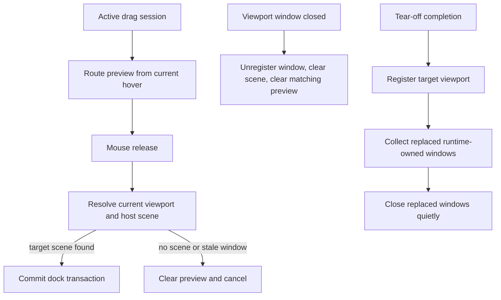

# fix: Tighten docking viewport parity

## Summary

This plan fixes the highest-risk gaps found while comparing the current docking multi-viewport implementation with Dear ImGui's docking branch. It focuses on stale drop targets, viewport window replacement cleanup, platform close cleanup, and platform coordinate contracts that can produce incorrect cross-window docking behavior.

---

## Problem Frame

Dear ImGui treats platform viewports as a lifecycle with current-frame platform facts, explicit hovered/focused window signals, and deterministic create/update/destroy paths. The current implementation has the right broad modules, but several paths still commit from stale snapshots or leave runtime-owned window state alive after replacement/close. Those gaps are visible in multi-window drag/drop, platform close, and multi-display placement.

---

## Requirements

**Runtime drop correctness**

- R1. A source-only release must commit only against the current release point and current target scene, not an older cross-window preview.
- R2. A known-viewport route with no resolved target scene must not present a valid cross-window drop preview.

**Window lifecycle cleanup**

- R3. Closing or unregistering a viewport window must invalidate routed drop preview state and host scene state that references that window.
- R4. Tear-off completion must close replaced runtime-owned windows using the same ownership rule as normal viewport open.

**Platform coordinate contracts**

- R5. Platform display and window bounds used by docking must represent a shared desktop coordinate space where the platform can provide one.
- R6. Remaining platform limitations around hovered viewport, DPI scale, live window movement, and unsupported ImGui viewport flags must be documented as explicit boundaries.

**Verification**

- R7. Tests must cover stale release retargeting, missing target-scene preview suppression, close cleanup, tear-off replacement cleanup, and platform coordinate contract behavior.

---

## Key Technical Decisions

- KTD1. **Retarget on release:** Keep route preview as visual state, but recompute the drop target from the release point before commit. This matches ImGui's delivery-frame target validation without requiring a full ImGui-style queued dock request rewrite.
- KTD2. **Treat missing target scene as not droppable:** A viewport hit is not enough for a valid docking target. The target host must publish a current drop scene that resolves the release point.
- KTD3. **Centralize runtime-owned replacement cleanup:** Tear-off completion should return or close replaced runtime-owned windows through the same path as `open_viewport`, so ownership semantics do not diverge by creation path.
- KTD4. **Fix concrete platform coordinate bugs before broad API expansion:** macOS global bounds can be corrected directly. DPI scale, hovered viewport, live move APIs, and no-input/no-focus viewport flags need a deliberate platform trait design and stay deferred.

---

## High-Level Technical Design

---

## Implementation Units

### U1. Retarget release-time cross-window drops

- **Goal:** Prevent stale cross-window previews from committing after the pointer leaves the previewed drop area.
- **Requirements:** R1, R2, R7.
- **Dependencies:** None.
- **Files:** `crates/gpui_docking/src/viewport_runtime.rs`, `crates/gpui_docking/src/viewport_drop_route.rs`, `crates/gpui_docking/src/host_viewport_runtime_tests.rs`, `crates/gpui_docking/src/host_viewport_runtime_handle_tests.rs`.
- **Approach:** Change release-time commit derivation so it validates the current target hit and resolves the current host scene position. If the target viewport has no current scene target, return no route/preview rather than a valid route that fails only at commit.
- **Patterns to follow:** Existing `resolve_frame_for_window` and `routed_drop_commit_for_drag_session` logic; ImGui's delivery-frame validation in `repo-ref/imgui/imgui.cpp`.
- **Test scenarios:** A release inside the same target window but outside the cached preview must cancel. A known viewport with no host scene target must not expose a cross-window preview. A valid scene retarget must still commit into the target host.
- **Verification:** Runtime tests fail before the change and pass after the retargeting behavior is in place.

### U2. Clear routed viewport state on window close and replacement

- **Goal:** Remove stale references when a registered viewport window is closed or replaced.
- **Requirements:** R3, R4, R7.
- **Dependencies:** None.
- **Files:** `crates/gpui_docking/src/viewport_runtime.rs`, `crates/gpui_docking/src/viewport_runtime_handle.rs`, `crates/gpui_docking/src/host_viewport_runtime_tests.rs`, `crates/gpui_docking/src/host_viewport_runtime_handle_tests.rs`.
- **Approach:** Clear routed preview state when the runtime unregisters a window that owns or participates in the preview. Make tear-off completion close replaced runtime-owned windows through the normal quiet-close path.
- **Patterns to follow:** Existing `register_opened_viewport` replacement handling and close gate cleanup.
- **Test scenarios:** Closing a target viewport during a drag clears preview state and prevents later commit through that window. Completing a tear-off into a space that was rebound after open closes the replaced runtime-owned window. Replacing an app-owned window must not force-close it.
- **Verification:** Close and replacement tests assert both registry cleanup and routed preview invalidation.

### U3. Align macOS bounds with desktop-space viewport routing

- **Goal:** Make macOS window and display bounds usable as shared screen-space facts for docking.
- **Requirements:** R5, R7.
- **Dependencies:** None.
- **Files:** `crates/gpui_macos/src/display.rs`, `crates/gpui_macos/src/window.rs`, relevant platform tests or focused unit tests if available.
- **Approach:** Preserve CoreGraphics global display origins and return window bounds in a shared desktop coordinate space. Keep any existing content-size/window-frame distinction intact.
- **Patterns to follow:** Existing Windows and Linux display bounds implementations, and ImGui backend monitor position contracts.
- **Test scenarios:** A secondary display with non-zero origin reports non-overlapping display bounds. A window on that display reports bounds that keep the display origin instead of being normalized to `(0,0)`.
- **Verification:** macOS-specific checks compile and docking coordinate tests can model non-overlapping viewports.

### U4. Document platform viewport boundaries

- **Goal:** Record which ImGui viewport capabilities are intentionally unsupported or deferred.
- **Requirements:** R6.
- **Dependencies:** U1, U2, U3.
- **Files:** `docs/architecture/docking-architecture-audit-20260609.md`, `docs/verification.md`.
- **Approach:** Add concise notes for DPI scale, hovered-window signal, live set-window-position, no-input/no-focus/alpha/topmost flags, and the current verification matrix.
- **Patterns to follow:** Existing architecture audit and verification language.
- **Test scenarios:** Test expectation: none -- documentation-only unit.
- **Verification:** Documentation names the limitation without implying the runtime already supports full ImGui PlatformIO parity.

---

## Scope Boundaries

- This work does not migrate the docking graph to ImGui's full floating-node model.
- This work does not add new GPUI platform trait APIs for live window move, hovered-window polling, DPI scale callbacks, or no-input/no-focus platform windows.
- This work does not change the public layout persistence format beyond tests or documentation needed for the fixes.

### Deferred to Follow-Up Work

- Design a GPUI platform viewport capability surface for hovered viewport, DPI scale, monitor work area, live window move, input passthrough, focus-on-appearing, and alpha/topmost flags.
- Revisit dock space versus platform viewport identity if the product needs multiple dockspaces inside one OS window or ImGui-style floating root nodes.
- Add richer platform test doubles for multi-monitor scale, active/hovered stack, maximized restore bounds, and frame request behavior.

---

## Risks & Dependencies

- macOS coordinate changes may affect existing callers that assumed display-local window bounds. The implementation should keep the change scoped to platform contract correctness and verify examples that use window positioning.
- Release-time retargeting may suppress some previews that previously appeared valid. That is intentional when the target host has no current scene target.
- Platform API expansion is deferred because adding half-modeled flags would create a second incomplete viewport contract.

---

## Sources & Research

- ImGui viewport lifecycle and PlatformIO contracts: `repo-ref/imgui/imgui.h`, `repo-ref/imgui/imgui.cpp`, `repo-ref/imgui/imgui_internal.h`, `repo-ref/imgui/backends/imgui_impl_win32.cpp`, `repo-ref/imgui/backends/imgui_impl_glfw.cpp`.
- Current docking runtime and tests: `crates/gpui_docking/src/viewport_runtime.rs`, `crates/gpui_docking/src/viewport_runtime_handle.rs`, `crates/gpui_docking/src/viewport_drop_route.rs`, `crates/gpui_docking/src/host_viewport_runtime_tests.rs`, `crates/gpui_docking/src/host_viewport_runtime_handle_tests.rs`.
- Platform coordinate and window contracts: `crates/gpui/src/platform.rs`, `crates/gpui/src/window.rs`, `crates/gpui_macos/src/display.rs`, `crates/gpui_macos/src/window.rs`, `crates/gpui_windows/src/display.rs`, `crates/gpui_linux/src/linux/x11/window.rs`, `crates/gpui_linux/src/linux/wayland/window.rs`.
