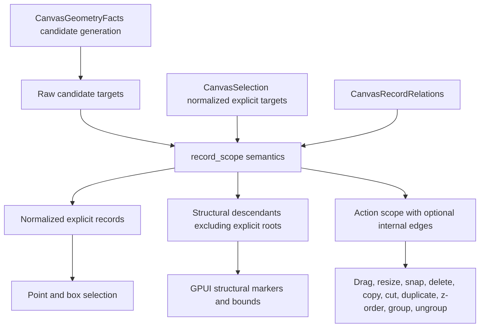

# Refactor Canvas Selection Scope Semantics

## Summary

This plan makes selection scope a first-class canvas semantic layer. Raw candidate targets are
normalized before they enter `CanvasSelection`, and the normalized explicit selection then feeds
structural descendants, internal edges, action scopes, and paint markers through one shared path.

---

## Problem Frame

The canvas now has typed record relations, group editing, structural resize, relation-aware
clipboard, z-order commands, and GPUI structural paint feedback. These features all need the same
answer to one question: when a user selects a parent, group, child, edge, or shape, which records are
explicitly selected and which records participate structurally in the next action?

That answer is currently spread across `record_scope`, select-tool hit handling, box selection,
delete, clipboard, z-order, group editing, transform handles, and paint-frame construction. The
result works for many cases, but the contract is still implicit. Figma, draw.io, MarginNote-style
mind maps, and xyflow-like parent scopes need a stable distinction between raw candidate targets,
normalized explicit selection, and derived structural scope before adding lasso, containers,
drill-in editing, or collaboration.

---

## Selection Contract

- Raw candidate targets are transient hits from point, box, keyboard, clipboard, or custom-tool
  input.
- Normalized explicit selection is what `CanvasSelection` stores after session-level normalization.
- Structural descendants are records reachable from the normalized explicit selection through
  parent and group relations, excluding the explicit roots themselves.
- Action scope is normalized explicit selection plus any requested structural descendants and
  optional internal edges.
- Normalization happens at the session and effect boundary so public intents and custom tools do
  not bypass the same rules.
- Default normalization suppresses descendants, but drill-in and future lasso candidate modes may
  request descendant-preserving normalization later.

---

## Requirements

**Selection Model**

- R1. Preserve `CanvasSelection` as the normalized explicit selection rather than a raw candidate
  bag.
- R2. Add one crate-owned selection scope path that can produce normalized explicit records,
  structural descendants excluding explicit roots, action records, and optional internal edges from
  the same inputs.
- R3. Normalize candidate targets at the session and effect boundary so a selected ancestor
  suppresses descendant records for default actions, while child-only selection remains possible
  when no selected ancestor is present.
- R4. Keep handles out of record scopes; endpoint handles stay explicit interaction targets, not
  structural records.

**Tool Behavior**

- R5. Point selection, shift selection, box selection, paste selection, and public custom-tool
  selection intents must use the same normalization rules for parent, group, child, shape, node,
  and edge targets.
- R6. Dragging from a structurally selected descendant under a selected ancestor must transform the
  existing ancestor scope instead of replacing selection with the descendant.
- R7. Delete, copy, cut, duplicate, resize, grouping, ungrouping, z-order, and snap commands must
  consume action scopes rather than each rebuilding related-record rules.
- R8. Internal edges are included only for actions that request them. Incident-edge deletion remains
  a command-side cleanup rule, not a scope-expansion rule.

**Rendering And Documentation**

- R9. GPUI paint frames must mark normalized explicit selection and structural descendants
  separately, so overlays, transform handles, and structural bounds do not drift from tool
  behavior.
- R10. Public API and serialized document format remain stable for this refactor. Any new helper must
  be additive and read-only.
- R11. Documentation must explain explicit selection, structural selection, and action scope in
  user-facing canvas terms.
- R12. Scope resolution must be cacheable by document revision and normalized explicit selection, and
  paint must not recompute ancestry per record.

---

## Key Technical Decisions

- KTD1. **Selection scope is a deep semantic module:** Extend the current `record_scope` seam into
  the place where selection normalization and action-scope expansion live. This avoids duplicating
  parent/group traversal in every tool command.
- KTD2. **Do not create a parallel resolver type by default:** Extend `CanvasRecordScope`,
  `CanvasRecordScopeOptions`, and `selection_record_scope` first. Add a crate-private helper struct
  only if normalized explicit records and action records cannot be represented cleanly by the
  existing types.
- KTD3. **Normalize selection at the write boundary:** Session selection writes from built-in
  reducers, public intents, custom tools, paste, duplicate, and cancel restore should all pass
  through the same normalization entry point.
- KTD4. **Explicit selection stays small:** Do not store descendants in `CanvasSelection` merely
  because a parent is selected. This keeps undo, paint overlays, custom tools, and serialized
  selection snapshots understandable.
- KTD5. **Normalize candidates before action expansion:** If a parent and descendant are both
  candidates, default actions operate on the ancestor once. A descendant can still be selected
  directly when the ancestor is not explicitly selected.
- KTD6. **Traversal and action predicates are separate:** Scope expansion needs one predicate for
  whether the graph may traverse through a record and another for whether that record participates
  in the action. Locked or hidden ancestors must not accidentally block policy-permitted
  descendants unless the consumer says so.
- KTD7. **Geometry produces candidates, scope normalizes records:** `CanvasGeometryFacts` remains the
  source for point and bounds candidates. Selection scope receives candidate record ids and relation
  facts; it should not own hit-test geometry.
- KTD8. **Paint consumes scope facts, not tool guesses:** Paint-frame structural markers and bounds
  should be computed from normalized explicit and structural-descendant facts used by tools, not
  from a parallel helper.
- KTD9. **Do not add live group bounds in this refactor:** Group bounds remain persistent and
  editable. This plan only clarifies which records participate in selection-driven actions.

---

## High-Level Technical Design

The scope path is not a new public editor object. It extends the existing `record_scope` module over
document relations, normalized explicit selection, candidate records, and action options. Geometry
feeds candidates into this path; it does not become part of scope normalization.

### Scope Matrices

| Input | Default normalized explicit result |
|---|---|
| Parent only | Parent |
| Child only | Child |
| Parent and descendant | Parent |
| Two unrelated roots | Both roots |
| Parent and unrelated child | Parent plus unrelated child |
| Edge only | Edge |
| Handle | Handle remains explicit interaction state and is excluded from record scope |

| Gesture | Behavior |
|---|---|
| Pointer down on selected explicit root | Enter pointing/possible drag state for that root scope |
| Pointer down on structural descendant of selected root | Preserve selection and prepare to drag the selected root scope |
| Pointer up without movement on structural descendant | Preserve selection; no descendant drill-in in this refactor |
| Pointer move past drag threshold | Transform the action scope from the preserved selection |
| Cancel before commit | Restore the previous normalized explicit selection |
| Shift-click selected ancestor | Remove that ancestor and its structural action scope from explicit selection |
| Shift-click descendant under selected ancestor | No-op for default mode |
| Shift-click ancestor when descendant is selected | Replace the descendant with the ancestor in normalized explicit selection |
| Shift-box with existing ancestor selection | Merge candidates, then normalize once |

| Action | Scope rule |
|---|---|
| Drag / resize / snap | Normalized explicit roots plus structural descendants when the action requests structural behavior |
| Copy / cut / duplicate | Copied records are action scope; pasted explicit selection is normalized roots |
| Delete | Action scope supplies selected records; external incident edges are removed by document command semantics |
| Group | Normalize explicit roots first; descendants suppressed by selected ancestors are not grouped twice |
| Ungroup | Acts only on normalized explicit group roots |
| Z-order | Action scope includes structural descendants and optional internal edges, preserving relative order |

| Paint feedback | Rule |
|---|---|
| Explicit root | `selected = true`, `structurally_selected = false` |
| Structural descendant | `selected = false`, `structurally_selected = true` |
| Edge in action scope | Structural marker only when included by the selected scope options |
| Handle | Never a structural record |
| Multiple explicit roots | Overlays and transform handles follow normalized explicit roots, not descendants |

| Box candidate case | Result |
|---|---|
| Group border and child intersected | Group candidate wins for default normalization |
| Transparent group interior only | Interior is not a group candidate; child candidates remain selectable |
| Nested group borders intersected | Nearest selected ancestor in the candidate set wins and suppresses descendants |
| Parent bounds partially intersected without a kind hit policy match | Parent is not a candidate; intersected descendants remain candidates |
| Existing selected ancestor plus shift-box descendants | Existing ancestor suppresses descendants during the merge |

---

## Implementation Units

### U1. Deepen the Selection Scope Resolver

- **Goal:** Extend `record_scope` into the shared place for normalized explicit selection,
  structural descendant expansion, action records, and internal-edge inclusion.
- **Requirements:** R1, R2, R3, R4, R8, R12.
- **Files:**
  - `crates/canvas/src/record_scope.rs`
  - `crates/canvas/src/relations.rs`
  - `crates/canvas/src/tool/context.rs`
  - `crates/canvas/src/lib.rs`
- **Patterns:** Build on existing `CanvasRecordScope` and `CanvasRecordScopeOptions`. Add upward
  ancestor lookup beside the existing descendant traversal; do not create a parallel public
  resolver type.
- **Test scenarios:**
  - `crates/canvas/src/record_scope.rs`: parent plus child candidates normalize to the parent for
    default action scope.
  - `crates/canvas/src/record_scope.rs`: child-only candidates stay child-only.
  - `crates/canvas/src/record_scope.rs`: nested parent and group membership expand descendants once
    and preserve stable ordering.
  - `crates/canvas/src/record_scope.rs`: multiple group memberships and parent plus group ancestry
    choose stable ancestor suppression without dropping unrelated roots.
  - `crates/canvas/src/record_scope.rs`: internal edges are included only when both endpoints are
    inside the effective node scope and the option requests them.
  - `crates/canvas/src/record_scope.rs`: external incident edges are not action-scope records and
    are left to document command cleanup.
  - `crates/canvas/src/record_scope.rs`: traversal and action predicates differ for locked parent
    with unlocked child, unlocked parent with locked child, hidden child, and locked internal edge.
  - `crates/canvas/src/record_scope.rs`: handles never appear in record scopes.
  - `crates/canvas/src/record_scope.rs`: one scope resolution can expose normalized explicit,
    structural descendants, and action records without repeating ancestor traversal per record.

### U2. Normalize Selection At The Session Boundary

- **Goal:** Make all selection writes produce normalized explicit selection from one policy.
- **Requirements:** R3, R5, R6.
- **Files:**
  - `crates/canvas/src/session.rs`
  - `crates/canvas/src/tool/action.rs`
  - `crates/canvas/src/tool/select.rs`
  - `crates/canvas/src/tool/context.rs`
  - `crates/canvas/src/tool.rs`
- **Patterns:** Continue using `CanvasGeometryFacts::record_intersects_bounds` for box selection
  and kind-registry hit policies for group borders. Treat `crates/canvas/src/schema.rs` as the
  existing policy source, not a planned schema API change.
- **Test scenarios:**
  - `crates/canvas/src/tool.rs`: clicking a child inside an already selected parent begins
    translating the parent scope and keeps the parent selected.
  - `crates/canvas/src/tool.rs`: clicking a child when no ancestor is selected selects the child.
  - `crates/canvas/src/tool.rs`: pointer down on a structural descendant followed by pointer up
    without movement preserves the selected parent and does not drill in.
  - `crates/canvas/src/tool.rs`: pointer move after structural-descendant pointer down transforms
    the preserved parent action scope.
  - `crates/canvas/src/tool.rs`: box selection over a group border and child normalizes to the
    group, while box selection over only the child selects the child.
  - `crates/canvas/src/tool.rs`: box selection wholly inside transparent group interior does not
    select the group by bounds alone.
  - `crates/canvas/src/tool.rs`: shift-clicking a descendant under a selected ancestor is a no-op
    in default mode.
  - `crates/canvas/src/tool.rs`: shift-clicking an ancestor while a descendant is selected replaces
    the descendant with the ancestor.
  - `crates/canvas/src/tool.rs`: public `SetSelection`, `ReplaceSelection`, `AddSelection`, and
    `ToggleSelection` intents normalize redundant ancestor and descendant targets.
  - `crates/canvas/src/tool.rs`: paste and duplicate selection writes normalize pasted explicit
    roots before storing session selection.
  - `crates/canvas/src/tool.rs`: cancel during pointing or translating restores the original
    normalized explicit selection.

### U3. Audit Action Consumers And Close Remaining Local Rules

- **Goal:** Ensure every selection-driven action consumes the shared action scope, while treating
  already-integrated consumers as characterization targets rather than broad rewrites.
- **Requirements:** R6, R7, R8, R12.
- **Files:**
  - `crates/canvas/src/tool/context.rs`
  - `crates/canvas/src/tool/z_order.rs`
  - `crates/canvas/src/tool/group.rs`
  - `crates/canvas/src/tool/clipboard.rs`
  - `crates/canvas/src/clipboard.rs`
  - `crates/canvas/src/snap.rs`
  - `crates/canvas/src/tool.rs`
- **Patterns:** Keep action-specific predicates near the command that owns them, such as
  copyable, deletable, reorderable, and resizable record filters. Existing clipboard, z-order,
  structural resize, and snap consumers should be audited for normalized explicit semantics before
  being rewritten.
- **Test scenarios:**
  - `crates/canvas/src/tool.rs`: deleting a selected parent removes descendants and incident
    edges once, then undo restores records and relations.
  - `crates/canvas/src/clipboard.rs`: copying a selected parent includes descendants, internal
    edges, and internal relations without duplicating explicitly selected descendants.
  - `crates/canvas/src/clipboard.rs`: payload copied records represent action scope, while payload
    and paste selection represent normalized explicit roots in a serialization-compatible way.
  - `crates/canvas/src/tool.rs`: cut uses the same copied action scope and delete cleanup as copy
    plus delete.
  - `crates/canvas/src/tool.rs`: duplicating a selected parent selects only pasted explicit roots
    and still remaps descendant records and relations.
  - `crates/canvas/src/tool.rs`: resize uses structural action scope when selected roots have
    descendants and direct explicit scope when no structural descendants are present.
  - `crates/canvas/src/snap.rs`: drag and resize snap candidates are computed from the same
    normalized action scope used for the transform.
  - `crates/canvas/src/tool.rs`: z-order commands move a selected parent scope as one logical
    selection while preserving descendant relative order.
  - `crates/canvas/src/tool.rs`: grouping a selection containing both an ancestor and descendant
    groups the normalized records without nesting duplicates.
  - `crates/canvas/src/tool.rs`: ungrouping acts only on normalized explicit group roots and does
    not ungroup structurally selected descendant groups unless they are explicit roots.

### U4. Align Paint With Normalized Scope Facts

- **Goal:** Make GPUI paint-frame selection markers, structural bounds, widget overlays, and
  transform handles consume normalized explicit and structural-descendant facts.
- **Requirements:** R2, R4, R9, R12.
- **Files:**
  - `crates/canvas/src/gpui/frame.rs`
  - `crates/canvas/src/gpui/model.rs`
  - `crates/canvas/src/gpui.rs`
  - `crates/canvas/src/transform.rs`
  - `crates/canvas/src/record_scope.rs`
- **Patterns:** Preserve batched paint-frame construction. The existing GPUI structural scope path
  should be tightened around normalized explicit roots and structural descendants, not replaced by a
  new paint subsystem.
- **Test scenarios:**
  - `crates/canvas/src/gpui.rs`: explicitly selected parent is `selected`, descendants are
    `structurally_selected`, and the explicit parent is not also marked as structural.
  - `crates/canvas/src/gpui.rs`: child-only selection marks the child as selected and does not mark
    the parent as structural.
  - `crates/canvas/src/gpui.rs`: structural selection bounds are derived from the same structural
    scope used by tools and are hidden when they equal explicit selected bounds.
  - `crates/canvas/src/gpui.rs`: transform handles remain attached to explicit transform targets,
    not every structural descendant.
  - `crates/canvas/src/gpui.rs`: handles are not marked as structural records.
  - `crates/canvas/src/gpui.rs`: multi-root selection emits overlays and transform handles for
    normalized explicit roots only.
  - `crates/canvas/src/gpui.rs`: paint frame computes selection scope once per frame and reuses the
    result while mapping visible records.

### U5. Document The Selection Contract

- **Goal:** Explain the new contract for application authors and future canvas feature work.
- **Requirements:** R10, R11.
- **Files:**
  - `crates/canvas/README.md`
  - `docs/adr/0002-open-gpui-canvas-architecture.md`
  - `docs/plans/2026-06-12-001-refactor-canvas-selection-scope-plan.md`
- **Patterns:** Keep the docs framed around canvas semantics rather than internal enum names.
- **Test scenarios:**
  - Documentation distinguishes explicit selection from structural selection.
  - Documentation names action scope as the path for transform, snap, delete, copy, cut,
    duplicate, resize, z-order, grouping, and ungrouping.
  - Documentation states that lasso, live container layout, and drill-in modifiers are future work.

---

## Acceptance Examples

- AE1. A frame contains a group, two nodes, and an internal edge. Selecting the frame, dragging from
  a child, and releasing moves the structural scope once, keeps the frame explicitly selected, and
  creates one undo entry.
- AE2. A box selection intersects both a group border and one of its children. The explicit
  selection stores the group, while the child appears only in structural scope.
- AE3. A box selection intersects only a child inside a larger parent. The child is explicitly
  selected, and copy/delete operate on the child-only action scope.
- AE4. A parent and descendant are both present in an incoming selection candidate set. The
  normalized explicit selection suppresses the descendant, and copy/delete/z-order do not duplicate
  side effects.
- AE5. A public custom tool submits a selection containing a parent and descendant. Session state
  stores only the normalized explicit parent, and action scope still includes permitted descendants.
- AE6. Duplicating a selected parent copies structural descendants and internal relations, but the
  pasted selection contains only the pasted explicit parent root.
- AE7. Paint for a selected parent shows one explicit overlay for the parent, structural markers for
  descendants, and transform handles only for the explicit parent.

---

## Scope Boundaries

### Active Scope

- Define explicit selection, structural scope, and action scope as one reusable canvas contract.
- Apply the contract to point selection, shift selection, box selection, paste selection, custom-tool
  selection intents, transform, snap, delete, copy, cut, duplicate, resize, z-order, grouping,
  ungrouping, and GPUI paint feedback.
- Preserve existing public editor, tool, document, and clipboard APIs. Add only read-only helpers if
  existing public surfaces cannot expose the new scope facts cleanly.

### Deferred To Follow-Up Work

- Lasso and freeform polygon selection.
- Drill-in or modifier-based selection for choosing a descendant while keeping an ancestor selected.
- Live derived group bounds, clipping, parent-relative transforms, and layout ownership.
- CRDT, redb, rkyv, or Jellyflow integration.
- Large nested relation graph benchmarks beyond the per-frame scope-resolution guardrails in this
  plan.

### Outside This Refactor

- Changing canvas snapshot serialization.
- Replacing the current relation model.
- Rewriting GPUI paint as per-record UI elements.
- Adding new node or shape kinds.

---

## System-Wide Impact

This refactor tightens a cross-cutting semantic boundary. Custom tools can continue reading
`CanvasSelection` as normalized explicit user intent, while built-in tools and adapters gain one
consistent way to ask for structural action participants. Runtime, geometry, relation, clipboard,
snap, and paint modules become easier to extend because they no longer need local interpretations
of parent/group selection.

---

## Risks & Dependencies

- **Behavioral expectation risk:** Parent/group selection can feel different from child-only
  selection. Mitigation: keep direct child selection possible when no ancestor is selected and make
  redundant descendant suppression explicit in tests and docs.
- **Selection write bypass risk:** Public intents, custom tools, paste, and cancel restore can write
  selection without going through select-tool code. Mitigation: normalize at the session/effect
  boundary and cover those paths with tests.
- **Regression risk in command paths:** Delete, copy, z-order, group, and resize currently have
  independent traversal logic. Mitigation: move one consumer at a time and keep command-level
  characterization tests around each action.
- **Clipboard compatibility risk:** Existing payload selection has represented copied records, not
  necessarily explicit roots. Mitigation: define copied record scope and pasted explicit selection
  separately while keeping serialized payloads backward compatible.
- **Performance risk in nested graphs:** Scope expansion can become hot for large relation trees.
  Mitigation: use stable `IndexSet` traversal, avoid repeated descendant walks inside a single
  event, resolve scope once per paint frame, and defer benchmark-backed caching until behavior is
  stable.
- **Custom tool ambiguity:** Custom tools may need either explicit selection or action scope.
  Mitigation: keep explicit selection unchanged and expose read-only scope helpers through existing
  context surfaces when needed.

---

## Sources & Research

- `crates/canvas/src/record_scope.rs`: current structural scope expansion and internal-edge
  inclusion.
- `crates/canvas/src/relations.rs`: current downward related-record traversal and relation lookup
  methods that need complementary ancestor checks.
- `crates/canvas/src/session.rs` and `crates/canvas/src/tool/action.rs`: current selection write
  boundary for built-in effects and public tool intents.
- `crates/canvas/src/tool/select.rs`: current point, shift, translation, resize, and box selection
  reducer behavior.
- `crates/canvas/src/tool/context.rs`: current delete, transform, resize, snap, and box selection
  helper surface.
- `crates/canvas/src/clipboard.rs`: relation-aware copy and paste behavior.
- `crates/canvas/src/snap.rs`: current selection-scope usage for snap candidates.
- `crates/canvas/src/tool/z_order.rs`: current structural z-order action scope.
- `crates/canvas/src/tool/group.rs`: current manual ancestor suppression during group creation.
- `crates/canvas/src/gpui/frame.rs`: explicit and structural selection paint-frame construction.
- `docs/plans/2026-06-10-007-refactor-canvas-record-relations-plan.md`: relation facts are the
  foundation for parent/group selection semantics.
- `docs/plans/2026-06-10-015-refactor-canvas-editor-session-seam-plan.md`: session state is already
  separated from durable store state, which lets selection scope stay semantic rather than public
  mutable editor state.
