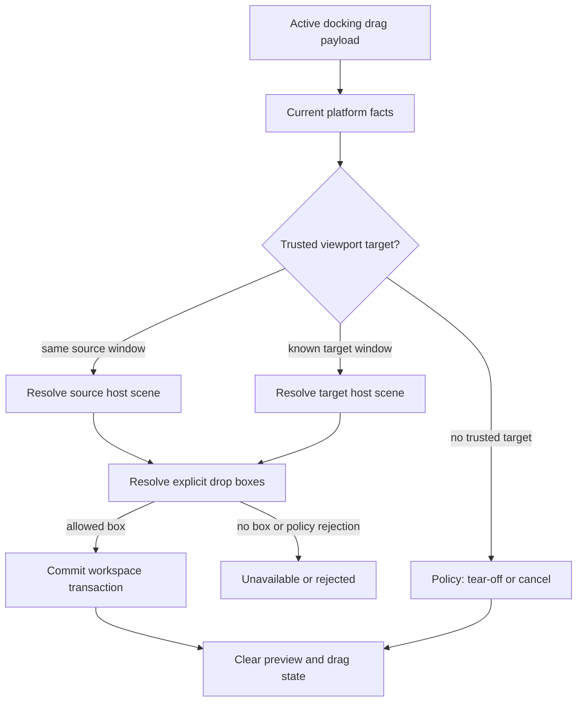
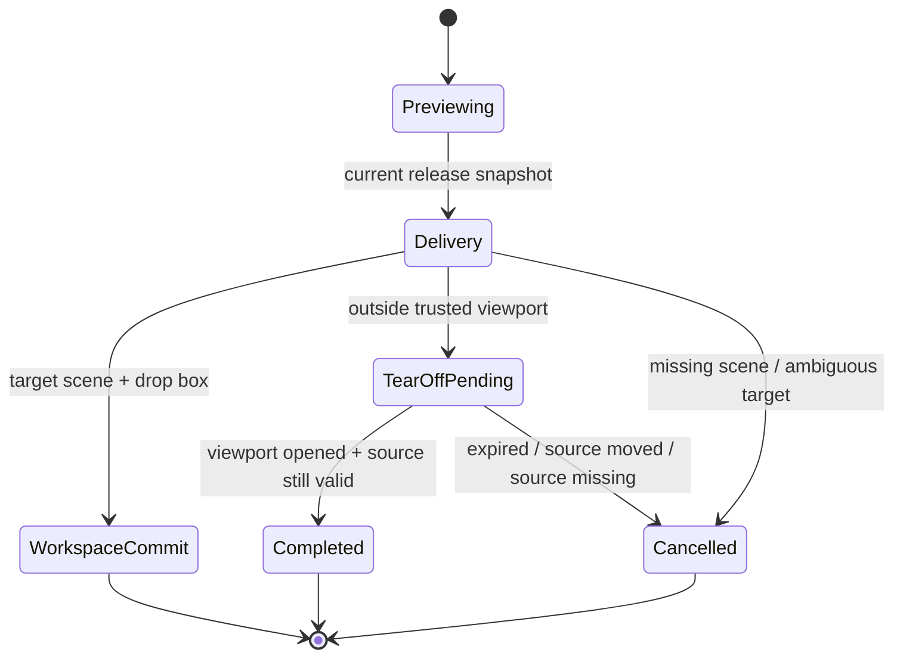

# fix: Remove heuristic docking viewport commits

## Summary

This plan continues the ImGui docking parity work by removing remaining heuristic behavior from docking multi-viewport routing, tear-off placement, drop geometry, and native platform capability boundaries. The core rule is that cached previews, saved placement snapshots, and rectangle-only viewport hits may guide rendering, but they must never be the final commit authority.

---

## Problem Frame

The previous viewport parity pass fixed stale routed preview commits, missing target-scene acceptance, close cleanup, tear-off replacement cleanup, and several platform coordinate bugs. The remaining risk is more architectural: parts of the docking runtime still expose behavior that looks deterministic but is partly inferred from fallback ordering, default tear-off bounds, broad edge bands, or placement snapshots that do not represent live platform windows.

Dear ImGui's docking branch uses fallback heuristics only as degraded input facts. Docking commit is still tied to a live drag payload, current delivery frame, host-local dock node target, fixed drop box geometry, and explicit platform viewport facts where available. This plan brings open-gpui closer to that model without pretending to implement full ImGui PlatformIO parity.

---

## Requirements

**Commit Authority**

- R1. Cross-window docking must require a current release point, a current target viewport identity, and a current host-scene `DockResolvedDropTarget`.
- R2. When hovered/topmost platform facts are unavailable or ambiguous for overlapping viewports, the runtime must not silently choose a cross-window dock target from stable space order.
- R3. Saved placement and restore bounds must never participate in live hit testing or routed commit decisions.
- R4. Viewport snapshots must be invalidated or versioned when platform move/resize facts change so release delivery cannot use stale host coordinates.

**Placement Contract**

- R5. Public placement APIs and example UI must distinguish open-time restore from live platform-window movement.
- R6. A live placement API may exist only when it can either move real platform windows or report an explicit unsupported result.

**Tear-Off Semantics**

- R7. Tear-off windows must derive their initial bounds from drag metadata, including cursor offset, source geometry, display work area, and payload size, instead of a fixed magic offset and fixed default size.
- R8. Tear-off lifecycle must preserve source payload identity and cancel deterministically when the source moves, disappears, or the opened viewport cannot complete the graph transaction.
- R9. Newly opened tear-off viewports must not be eligible as drop targets until their first render frame publishes live host-scene facts.

**Drop Geometry**

- R10. Docking drop geometry must use explicit center and side drop boxes comparable to ImGui's inner and outer preview boxes, rather than nearest-edge bands that can split when the user is not over a drop box.
- R11. Root, central-region, leaf, floating-title-bar, and empty-space targets must carry enough target metadata that preview and commit are generated from the same resolved target.
- R12. Floating subtree targets and empty central targets must preserve their real tree root and policy identity during preview and commit.

**Platform Boundaries**

- R13. Platform-window capabilities must be modeled as facts and capabilities, not assumed from backend-specific internals.
- R14. macOS, Windows, X11, Wayland, and test backends must document and test their viewport-relevant support for bounds, hover, focus, window stack, DPI, resize, move, close, and unsupported ImGui-style flags.

---

## Key Technical Decisions

- KTD1. **Fail closed when platform arbitration is missing:** ImGui labels rectangle plus focus-stamp hover discovery as flawed. In open-gpui, that fallback can keep local preview stable, but cross-window commit should require hovered window, window stack, or an equivalent trusted target signal when more than one registered viewport contains the point.
- KTD2. **Keep preview and commit from one resolved target:** A preview may be cached for drawing, but release must resolve a fresh host scene and commit only the target produced by that release snapshot. If the release snapshot cannot produce a target, the result is unavailable or tear-off.
- KTD3. **Rename or replace fake placement apply:** The current `apply_placement` validates registered spaces but intentionally does not move windows. The API and example controls should reflect that behavior, while any future live movement path must return a typed unsupported result on platforms without reliable move APIs.
- KTD4. **Version live viewport facts:** A host-scene frame should be treated as fresh only for the window facts that produced it. Platform move and resize events should invalidate old coordinate snapshots before release delivery can use them.
- KTD5. **Make tear-off bounds a drag fact:** Defaulting to `release_position - (24,18)` with `360x240` is a heuristic. Tear-off should carry source bounds, payload bounds, cursor offset, display work area, and restore-size preference so the new viewport opens under the cursor like the dragged object.
- KTD6. **Adopt drop boxes as first-class geometry:** ImGui computes explicit center and side boxes, filters them by docking flags, then queues a target with split direction and ratio. The docking crate should expose the same conceptual object so hit testing, preview, and transaction data cannot drift.
- KTD7. **Keep floating and central identities explicit:** Floating split trees and empty central regions should not collapse into leaf or empty-space fallbacks. Their target identity affects policy, preview, focus, and transaction behavior.
- KTD8. **Do not half-model ImGui viewport flags:** No-input, no-focus-on-appearing, alpha, topmost, no-taskbar, parent viewport, and DPI-scaling flags should not influence commit behavior until the platform layer can provide deterministic support.

---

## High-Level Technical Design

---

## Implementation Units

### U1. Split viewport target confidence from viewport rectangle hits

- **Goal:** Prevent rectangle-only fallback ordering from becoming cross-window commit authority.
- **Requirements:** R1, R2, R3, R13.
- **Dependencies:** None.
- **Files:** `crates/gpui_docking/src/viewport_target_context.rs`, `crates/gpui_docking/src/viewport_target_resolver.rs`, `crates/gpui_docking/src/viewport_target.rs`, `crates/gpui_docking/src/viewport_drop_route.rs`, `crates/gpui_docking/src/host_viewport_runtime_tests.rs`, `crates/gpui_docking/src/host_viewport_runtime_handle_tests.rs`.
- **Approach:** Add an explicit confidence outcome to target resolution, separating `Trusted`, `Ambiguous`, and `FallbackOnly` hits. Use hovered window, active window, window stack, and single-hit cases as commit-capable facts. Treat multi-hit stable-order fallback as preview-only or unavailable for cross-window commit.
- **Execution note:** Start with characterization tests that show overlapping registered viewport rectangles currently resolve through deterministic space order.
- **Patterns to follow:** `choose_viewport_target` in `crates/gpui_docking/src/viewport_target_resolver.rs`; ImGui's `ImGuiBackendFlags_HasMouseHoveredViewport` and `FindHoveredViewportFromPlatformWindowStack` boundary in `repo-ref/imgui/imgui.cpp`.
- **Test scenarios:** With two overlapping viewport snapshots and no platform signals, route resolution returns ambiguous or unavailable rather than committing to the lexicographically first space. With a hovered window signal, the hovered viewport wins. With a front-to-back window stack, the first matching window wins. With exactly one hit, route resolution remains valid. Saved placement without live `DockViewportWindowFacts` remains ignored for hit testing.
- **Verification:** Cross-window route tests assert a typed non-commit result for ambiguous fallback and still pass current valid hovered/window-stack cases.

### U2. Make release delivery recompute one authoritative host target

- **Goal:** Ensure preview and commit cannot diverge across target scene generations.
- **Requirements:** R1, R2, R3, R4, R11.
- **Dependencies:** U1.
- **Files:** `crates/gpui_docking/src/viewport_runtime.rs`, `crates/gpui_docking/src/viewport_drop_route.rs`, `crates/gpui_docking/src/viewport_drop_scene.rs`, `crates/gpui_docking/src/viewport_coordinates.rs`, `crates/gpui_docking/src/viewport_registry.rs`, `crates/gpui_docking/src/host_viewport_runtime_tests.rs`, `crates/gpui_docking/src/host_viewport_runtime_handle_tests.rs`.
- **Approach:** Treat `DockViewportDropRouteCommit` as a delivery snapshot produced from current route confidence and current host scene facts. Keep cached preview for drawing only. Include scene-frame identity and snapshot generation in resolved target validation so a target from an older frame cannot silently commit after the platform window moved or the host scene changed.
- **Patterns to follow:** `cached_route_target` and `routed_drop_target_hit_for_release` in `crates/gpui_docking/src/viewport_runtime.rs`; ImGui's `AcceptDragDropPayload` delivery and `DockContextQueueDock` path in `repo-ref/imgui/imgui.cpp`.
- **Test scenarios:** Preview accepted in one host-scene frame but release after that frame is replaced must recompute or cancel. A platform move or resize invalidates screen-to-host conversion until a fresh render frame publishes matching facts. Release inside the same viewport but outside any current drop scene returns unavailable. Release into a valid current scene commits the target produced by that scene. Rejected class-policy targets remain rejected rather than downgraded to tear-off.
- **Verification:** Runtime tests assert no workspace mutation occurs when the delivery snapshot cannot resolve an allowed target.

### U3. Replace fake placement apply with explicit restore semantics

- **Goal:** Remove API and example behavior that implies saved placement can live-move already registered platform windows.
- **Requirements:** R3, R5, R6.
- **Dependencies:** None.
- **Files:** `crates/gpui_docking/src/viewport_placement_adapter.rs`, `crates/gpui_docking/src/viewport_runtime.rs`, `crates/gpui_docking/src/viewport_runtime_handle.rs`, `crates/gpui_docking/src/viewport_placement.rs`, `crates/gpui_docking/src/host_viewport_tests.rs`, `examples/docking-native/src/main.rs`, `docs/architecture/docking-architecture-audit-20260609.md`, `docs/verification.md`.
- **Approach:** Rename the existing behavior to validation or restore-readiness language, and keep `window_options_for_space` as the open-time restore path. Add a handle-level restore orchestration helper for callers that need to open spaces from placement. If a public live apply entry point is retained, make it return a typed outcome such as unsupported/no-op rather than `applied` when no platform movement occurred.
- **Patterns to follow:** Existing `DockViewportPlacementLayout::window_options_for_space` open-time restore API; placement tests that assert saved placement does not masquerade as live screen coordinates.
- **Test scenarios:** Existing registered windows do not report placement as applied unless real platform movement occurred. Native example UI logs validation or restore readiness rather than "applied saved placement". Open-time window options still use saved display id and bounds. Invalid placement still fails before options or validation are returned.
- **Verification:** Tests and example strings no longer claim live placement application through a no-op path.

### U4. Introduce deterministic tear-off drag geometry

- **Goal:** Open tear-off viewports from drag facts instead of fixed magic defaults.
- **Requirements:** R7, R8, R9.
- **Dependencies:** U1, U2.
- **Files:** `crates/gpui_docking/src/drag.rs`, `crates/gpui_docking/src/viewport_tear_off.rs`, `crates/gpui_docking/src/viewport_runtime.rs`, `crates/gpui_docking/src/host_viewport_drop.rs`, `crates/gpui_docking/src/host_outside_release.rs`, `crates/gpui_docking/src/host_viewport_runtime_handle_tests.rs`.
- **Approach:** Add `DockViewportTearOffPlacementPolicy` that consumes release position, source window facts, payload kind, source bounds, cursor offset, optional suggested bounds, display work area, and minimum size. Use it to compute `WindowOptions` so the cursor remains over the same relative payload point after the new platform viewport opens. Keep fallback defaults only when the drag source did not publish geometry, and surface that fallback as a degraded path in status or tests.
- **Patterns to follow:** Existing `DockRuntimeDragSession` identity validation and `DockViewportTearOffMachine` lifecycle checks; ImGui's undock flow around `DockContextProcessUndockNode`, `FixLargeWindowsWhenUndocking`, and `DockNodeStartMouseMovingWindow`.
- **Test scenarios:** A tab tear-off with known tab bounds opens a viewport whose origin preserves the drag cursor offset. A stack tear-off uses the source stack bounds or saved restore size rather than the fixed `360x240` default. A floating subtree tear-off preserves the floating subtree size. Bounds clamp into the display work area near screen edges. Missing drag geometry falls back to a documented default and records that fallback. Source-moved and source-missing cancellation still prevent completion after the window opens.
- **Verification:** Tear-off tests assert computed window bounds from drag geometry and prove the fixed default is not used when source facts exist.

### U5. Make tear-off lifecycle state explicit

- **Goal:** Prevent newly opened tear-off windows from participating in routing before they have rendered live host-scene facts.
- **Requirements:** R8, R9.
- **Dependencies:** U4.
- **Files:** `crates/gpui_docking/src/viewport_tear_off.rs`, `crates/gpui_docking/src/viewport_runtime.rs`, `crates/gpui_docking/src/viewport_runtime_status.rs`, `crates/gpui_docking/src/host_viewport_runtime_handle_tests.rs`.
- **Approach:** Model tear-off as `Prepared`, `WindowOpened`, `GraphCommitted`, and `RenderReady` or equivalent state. Register the platform window for ownership and close cleanup immediately, but expose it as route-unavailable until the target `DockHost` publishes the first current scene frame.
- **Patterns to follow:** Existing `DockViewportTearOffMachine` duplicate, expiry, source-moved, source-missing, and commit-failure paths.
- **Test scenarios:** A tear-off window opened before its first render frame does not resolve as a known viewport target for another drop. A commit failure closes or unregisters the opened window and clears pending state. A completed graph commit becomes route-eligible only after a host-scene frame is registered. Duplicate tear-off requests reuse the pending transaction rather than opening a second route-eligible window.
- **Verification:** Runtime status and tests distinguish opened-but-not-render-ready from completed route targets.

### U6. Promote ImGui-like drop boxes into docking geometry

- **Goal:** Replace nearest-edge band semantics with explicit center, inner side, and outer side drop boxes.
- **Requirements:** R10, R11, R12.
- **Dependencies:** U2.
- **Files:** `crates/gpui_docking/src/geometry.rs`, `crates/gpui_docking/src/drop_target.rs`, `crates/gpui_docking/src/drop_preview.rs`, `crates/gpui_docking/src/drop_runtime.rs`, `crates/gpui_docking/src/host_viewport_matrix_tests.rs`, `crates/gpui_docking/src/host_interaction_tests.rs`.
- **Approach:** Introduce a drop-box model that returns all candidate boxes for a target rect, then selects only when the pointer is inside an allowed box. Keep policy filtering before preview acceptance. Encode whether the chosen box is center, inner split, or outer split so preview and workspace transaction consume the same resolved object. Specify corner tie-breaks and root-versus-leaf priority as tests rather than hidden resolver order.
- **Execution note:** Characterize current edge-band behavior before replacing it, because this unit changes visible docking affordances.
- **Patterns to follow:** `DockNodePreviewDockSetup`, `DockNodeCalcDropRectsAndTestMousePos`, and `DockContextCalcDropPosForDocking` in `repo-ref/imgui/imgui.cpp`.
- **Test scenarios:** A pointer near an edge but outside all side boxes resolves no split target. A pointer inside a side box resolves the expected split direction and preview bounds. Root and leaf boxes in the same area follow the explicit outer/inner priority. Corners choose the documented side box. A root central node uses outer boxes for side docking when inner and outer would be equivalent. Disabled split policy suppresses side boxes before preview acceptance. Center merge policy suppresses center boxes for central-region dock-over when configured.
- **Verification:** Geometry and host matrix tests assert explicit box membership rather than distance-to-edge behavior.

### U7. Carry resolved drop target metadata through workspace transactions

- **Goal:** Ensure root, central, leaf, floating, and empty-space commits use the same target metadata that produced preview.
- **Requirements:** R1, R10, R11, R12.
- **Dependencies:** U6.
- **Files:** `crates/gpui_docking/src/drop_target.rs`, `crates/gpui_docking/src/workspace_transaction.rs`, `crates/gpui_docking/src/workspace_move_transaction.rs`, `crates/gpui_docking/src/workspace_floating_transaction.rs`, `crates/gpui_docking/src/workspace_move_validation.rs`, `crates/gpui_docking/src/host_viewport_matrix_tests.rs`, `crates/gpui_docking/src/workspace_move_tests.rs`.
- **Approach:** Expand `DockResolvedDropTargetKind` only where current variants lose drop-box identity, split-ratio data, central identity, or floating-root identity. Make workspace transactions consume that resolved target directly rather than recomputing zone semantics from a smaller enum.
- **Patterns to follow:** Current `DockWorkspacePayloadDropRequest` path; ImGui's queued dock request carrying target node, split dir, split ratio, and outer flag.
- **Test scenarios:** Root-edge commit uses the same outer target chosen by preview. Leaf side-box commit uses the same inner target chosen by preview. Floating subtree docking into a root edge preserves target metadata. Empty dock space commit remains center-only and does not fabricate side splits. Class-policy rejection includes the resolved target that was rejected.
- **Verification:** Workspace tests can trace each preview target kind to one transaction without a second target-resolution pass.

### U8. Preserve floating tree and central target identity

- **Goal:** Remove graph-level fallbacks that collapse floating split trees or empty central regions into less specific targets.
- **Requirements:** R8, R11, R12.
- **Dependencies:** U6, U7.
- **Files:** `crates/gpui_docking/src/host_render_session.rs`, `crates/gpui_docking/src/drop_target.rs`, `crates/gpui_docking/src/render.rs`, `crates/gpui_docking/src/viewport_runtime.rs`, `crates/gpui_docking/src/host_render_tests.rs`, `crates/gpui_docking/src/host_interaction_tests.rs`, `crates/gpui_docking/src/host_viewport_runtime_handle_tests.rs`.
- **Approach:** Build a parent/root index for workspace root plus floating roots so `drop_root_for_tabs` returns the actual tree root containing the tabs. Add central identity to empty-space targets or introduce an empty-central target kind. Separate floating payload identity tabs from the focus source by resolving active item within the floating subtree rather than blindly using `source_tabs`.
- **Patterns to follow:** Existing `DockHostRenderSession::first_tabs_in_subtree`, `DockCentralRegion` metadata, and `DockGraph::active_item_in_tabs`.
- **Test scenarios:** A floating split tree resolves outer/root drops against the floating root rather than the leaf tabs node. A floating subtree tear-off focuses the active item inside the subtree. Empty central region drops obey central dock-over policy when the central policy says they should. Empty non-central spaces keep their existing center-only behavior.
- **Verification:** Render and interaction tests prove floating and central identity survive through preview, policy validation, and commit.

### U9. Model platform viewport capabilities explicitly

- **Goal:** Make platform support visible and prevent unsupported ImGui-style flags from leaking into docking decisions.
- **Requirements:** R13, R14.
- **Dependencies:** U1, U3.
- **Files:** `crates/gpui/src/platform.rs`, `crates/gpui/src/window.rs`, `crates/gpui/src/platform/test/window.rs`, `crates/gpui_macos/src/window.rs`, `crates/gpui_linux/src/linux/x11/window.rs`, `crates/gpui_linux/src/linux/wayland/window.rs`, `crates/gpui_windows/src/window.rs`, `crates/gpui_docking/src/viewport_runtime_status.rs`, `docs/architecture/docking-architecture-audit-20260609.md`, `docs/verification.md`.
- **Approach:** Add a narrow capability/facts surface for viewport routing and placement: global bounds reliability, hovered-window reliability, window stack reliability, runtime set-position/set-bounds support, focus/show semantics, topmost/no-focus/no-input support, DPI scale support, and unsupported flag classes. Use it to decide whether live placement and cross-window target arbitration are supported, degraded, or unavailable.
- **Patterns to follow:** Existing optional `Platform::window_stack`, `Platform::mouse_button_is_pressed`, `PlatformWindow::is_hovered`, `PlatformWindow::on_moved`, and test platform hooks.
- **Test scenarios:** Test platform advertises reliable hover and stack facts. macOS documents global bounds and `window_stack` support while avoiding a false `is_hovered` claim. Windows adds or explicitly declines `window_stack` support instead of falling through silently. X11 advertises live move only if exposed through a trait method rather than internal-only `set_bounds`. Wayland reports global move/position and stack limitations and forces degraded or unsupported results for live placement. Visual transparency is not treated as click-through/no-input. Runtime status surfaces degraded platform capability when a cross-window route cannot be trusted. Bare adapter close cleanup is documented as post-close cleanup, while platform viewport veto is available only through `DockViewportRuntimeHandle`-opened windows.
- **Verification:** Capability tests prove each backend reports only facts it can support, and docking route tests consume those capabilities instead of backend-specific assumptions.

### U10. Update dogfood coverage and manual verification

- **Goal:** Make the native example exercise deterministic routing, degraded platform paths, and ImGui-like drop boxes.
- **Requirements:** R5, R7, R10, R13, R14.
- **Dependencies:** U3, U4, U5, U6, U9.
- **Files:** `examples/docking-native/src/main.rs`, `docs/verification.md`, `crates/gpui_docking/src/host_viewport_matrix_tests.rs`, `crates/gpui_docking/src/host_viewport_runtime_handle_tests.rs`.
- **Approach:** Add status panel signals for route confidence, placement restore mode, and tear-off geometry source. Extend existing native dogfood tests to assert the example exposes these states without relying on physical native-window drag in CI.
- **Patterns to follow:** Existing docking-native status panel and manual verification checklist.
- **Test scenarios:** The example displays restore-readiness rather than live apply when platform movement is unsupported. A routed drop into an ambiguous overlap reports degraded or unavailable state. Tear-off status shows source-geometry placement when source facts exist. Drop-box matrix tests cover center, inner side, outer side, rejected, unavailable, and tear-off paths.
- **Verification:** Automated example tests assert the UI/control state, and `docs/verification.md` carries the remaining physical dogfood checklist for macOS, Windows, X11, and Wayland.

---

## Scope Boundaries

- This plan does not claim full Dear ImGui PlatformIO parity.
- This plan does not add no-input, no-focus, alpha, topmost, no-taskbar, or parent-viewport behavior unless the platform capability model can prove deterministic support.
- This plan does not migrate the whole docking graph to ImGui's floating root-node architecture.
- This plan does not use saved placement snapshots as live screen facts.
- This plan does not make Wayland global toplevel positioning reliable where the compositor does not expose it.

### Deferred to Follow-Up Work

- A full ImGui-style floating dock-node model where undock begins by extracting a dock node and moving it as the drag object.
- Per-monitor DPI scaling of docked windows while dragging across monitor boundaries.
- Renderer-level multi-viewport overlay synchronization and transparent payload rendering.
- A public application-facing API for advanced viewport flags once platform support exists.

---

## System-Wide Impact

This work affects docking runtime behavior, public docking placement API wording, the native dogfood example, and GPUI platform capability contracts. The most visible behavior change is that ambiguous cross-window drops may stop committing where they previously picked a deterministic fallback target. That is intentional: a cancelled or tear-off drop is preferable to docking into a window that was only selected by a heuristic.

---

## Risks & Dependencies

- Tightening route confidence may initially feel less permissive on platforms without reliable hovered-window or window-stack facts. The mitigation is to surface degraded capability in runtime status and allow tear-off where policy permits.
- Replacing edge bands with drop boxes changes visible target affordances. The mitigation is to land characterization tests and update matrix tests before changing commit behavior.
- Adding platform capability surfaces can grow into a broad trait expansion. The mitigation is to keep the first capability set limited to facts directly consumed by docking routing and placement.
- Renaming or changing `apply_placement` affects example code and downstream callers. The mitigation is to provide a compatibility path only if it cannot imply live movement.

---

## Sources & Research

- ImGui viewport and docking rules: `repo-ref/imgui/imgui.h`, `repo-ref/imgui/imgui_internal.h`, `repo-ref/imgui/imgui.cpp`.
- Previous parity plan and audit: `docs/plans/2026-06-12-001-fix-docking-viewport-parity-plan.md`, `docs/architecture/docking-architecture-audit-20260609.md`.
- Current docking runtime: `crates/gpui_docking/src/viewport_runtime.rs`, `crates/gpui_docking/src/viewport_drop_route.rs`, `crates/gpui_docking/src/viewport_target_resolver.rs`, `crates/gpui_docking/src/viewport_tear_off.rs`, `crates/gpui_docking/src/viewport_placement_adapter.rs`.
- Current drop geometry and transactions: `crates/gpui_docking/src/geometry.rs`, `crates/gpui_docking/src/drop_target.rs`, `crates/gpui_docking/src/workspace_transaction.rs`.
- Platform contracts: `crates/gpui/src/platform.rs`, `crates/gpui_macos/src/window.rs`, `crates/gpui_windows/src/window.rs`, `crates/gpui_linux/src/linux/x11/window.rs`, `crates/gpui_linux/src/linux/wayland/window.rs`.
