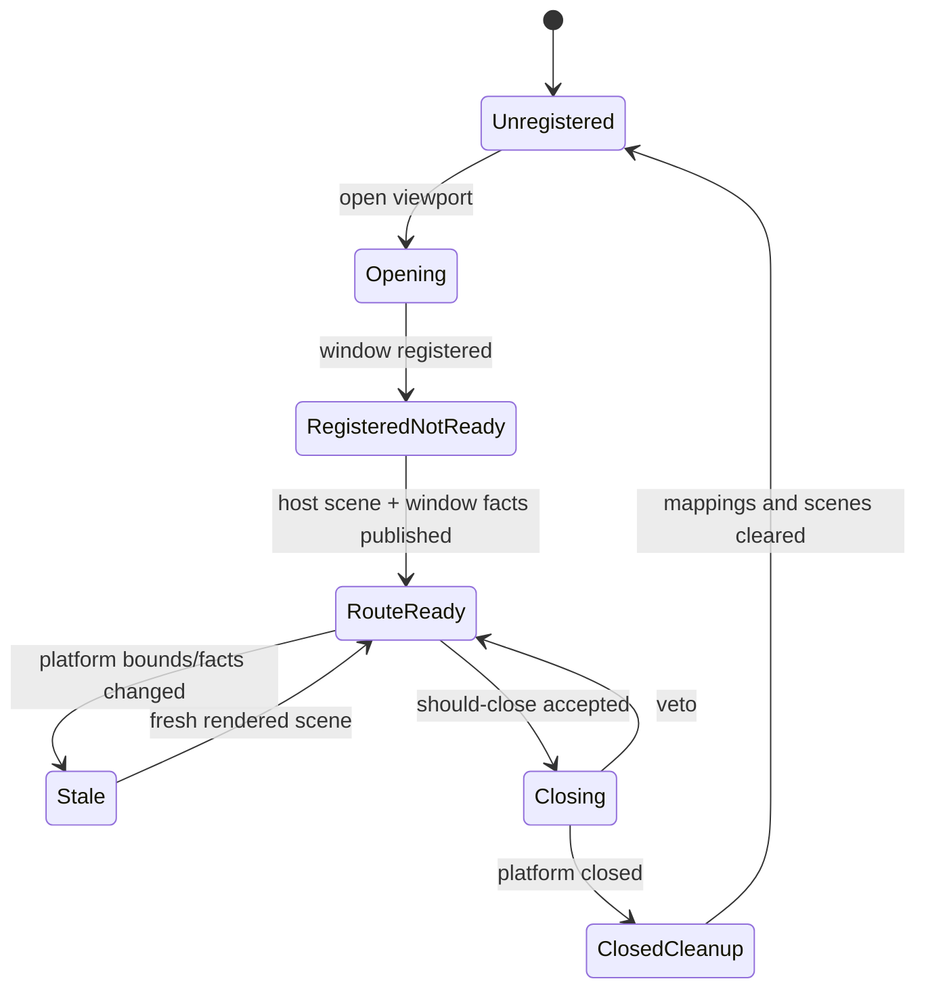
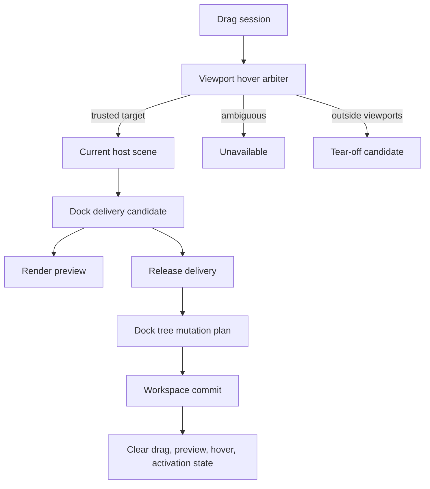
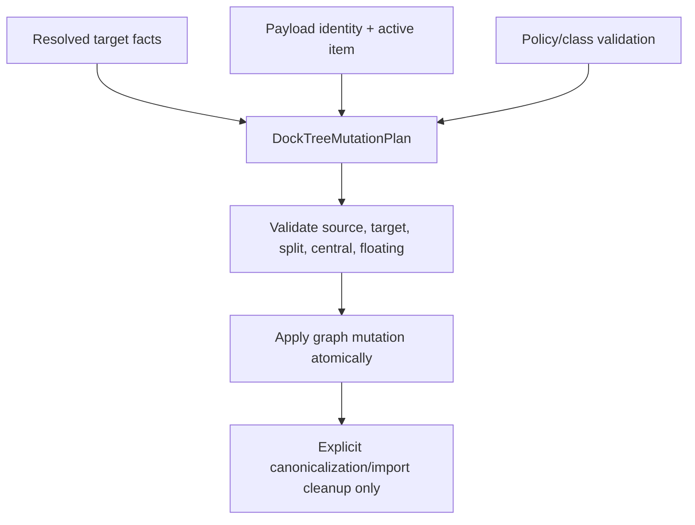

# refactor: Rebuild docking viewport model

## Summary

Rebuild the docking multi-viewport model around explicit lifecycle, hover arbitration, delivery, and graph mutation plans. This is a breaking internal refactor: delete heuristic fallback paths, replace index-based tab selection, and make preview, release, and durable graph commits consume the same resolved docking facts.

---

## Problem Frame

The current docking implementation has good pieces: `DockGraph` is pure retained layout, rendered hosts publish scene facts, `DockViewportRuntime` owns platform-window state, and `DockWorkspace` is the durable commit boundary. Recent fixes added route confidence, host-scene generation checks, drop boxes, tear-off geometry, and route-ready guards.

The remaining problem is model drift. Several modules still keep parallel interpretations of the same drag: viewport hit fallback, routed preview, release-time route request, cached target, workspace target kind, and graph mutation each have enough authority to disagree. That is the source of root-edge data-loss risk, ambiguous cross-viewport commits, active tab drift, central/floating identity loss, and stale viewport lifecycle bugs.

Dear ImGui's docking branch does not need to be ported structurally. The semantic invariants do need to move over: platform viewports are frame-owned lifecycle objects, hovered viewport is an arbitration result, preview produces delivery facts, commit consumes those facts, split/merge preserves central and selection state, and selected tabs are tracked by identity rather than by an index that can drift.

---

## Requirements

**Viewport Lifecycle**

- R1. Registered viewport windows must have explicit lifecycle state; `Registered` must not imply route readiness.
- R2. Live routing must require current window facts, current host-scene facts, and non-stale generations.
- R3. Overlapping viewport hits without trusted hovered/topmost arbitration must fail closed for commit.
- R4. Replacement, close, and stale-facts transitions must clear routed preview, host-scene, hover, and commit state for the affected window.

**Drop Delivery**

- R5. Drag preview must produce a delivery candidate that contains route, target, scene generation, window facts generation, split metadata, policy result, and payload identity.
- R6. Release must consume a current delivery candidate or create one from current trusted facts; it must not silently reinterpret an expired preview into a different target.
- R7. Local, known-viewport, and tear-off commits must share one delivery path and one drag-session identity check.
- R8. Rejected and unavailable outcomes must be first-class results in the matrix, not fall through to tear-off or stale fallback.

**Graph Mutation**

- R9. Workspace commits must consume `DockTreeMutationPlan`-like facts rather than re-deriving root, edge, central, and floating semantics from a small `DropZone`.
- R10. Source detach and target insertion must be atomic from the caller's perspective; failed target insertion must leave the graph unchanged.
- R11. Root-edge commits must target the resolved root/outer split plan, not pass a root id through APIs named as tabs targets.
- R12. Runtime canonicalization must not silently repair invalid active tab or topology state after interaction commits.

**Tabs, Central, and Floating Identity**

- R13. Tab selection must be stored by `DockItemId` identity, with index derived for rendering.
- R14. Empty central regions must remain central during preview, policy validation, and commit.
- R15. Floating title, floating subtree, and platform tear-off payloads must remain distinct concepts.
- R16. Moving a tabs stack or floating subtree must preserve active item and subtree structure.

**Cleanup and Verification**

- R17. Old heuristic helpers and tests that require lexical/focus fallback commit authority must be deleted or rewritten as diagnostics-only coverage.
- R18. The test matrix must cover success, rejection, unavailable, stale, and tear-off paths for item, tabs, and floating payloads.
- R19. Existing native dogfood docs must describe platform capability boundaries without implying full ImGui PlatformIO parity.

---

## Key Technical Decisions

- KTD1. **Replace compatibility fallback with explicit authority:** viewport rectangle order, focus stamps, and active-window guesses may produce diagnostics or preview hints, but only hovered/topmost/window-stack facts or a single non-conflicting live hit can authorize cross-window commit.
- KTD2. **Make delivery the single commit contract:** `DockResolvedDropTargetKind` is no longer enough for commit. The delivery object should carry split kind, split ratio or share intent, root identity, leaf identity, central marker, floating identity, frame generation, and policy acceptance.
- KTD3. **Use graph mutation plans instead of destructive helper sequencing:** source extraction, target validation, split construction, central rebinding, active selection, and canonicalization should be planned before mutation and applied as one checked operation.
- KTD4. **Keep the current three-layer ownership boundary:** `DockGraph` stays pure layout data, `DockViewportRuntime` stays platform/drag/preview lifecycle state, and `DockWorkspace` remains the only durable mutation authority.
- KTD5. **Store active tab by item id:** no production state should depend on `active: usize` as the semantic source. Index is a render-time projection and import fallback.
- KTD6. **Keep N-ary splits only if they become the explicit model:** do not pretend to have ImGui's binary split semantics while flattening after mutation. Delivery and mutation must speak the same topology model.
- KTD7. **Delete old code after replacement, not wrap it:** because the product is not live, compatibility adapters should be temporary only inside one implementation unit and removed before the plan is complete.

---

## Deletion Contract

The implementation must remove the old model instead of preserving it behind adapters. These paths may exist temporarily while their replacement unit is in progress, but the final state must not leave them as production commit authority.

- Viewport fallback ordering, focus stamps, and lexical ordering may remain only as diagnostics or status text; they must not authorize cross-viewport commits.
- `last_hovered_window` style memory must be scoped to a current drag-session arbitration result or removed.
- `DockViewportDropRouteCommit` must be replaced by a delivery contract that binds route authority, payload identity, scene generation, facts generation, resolved target, and outcome.
- Zone-only `DropZone` edge commits must be replaced by split-plan facts that distinguish root edge, inner edge, center, empty central, floating title, and tear-off.
- Source detach before target insertion must disappear from graph mutation helpers; planning and validation happen before mutation.
- `active: usize` must stop being semantic state in runtime graph/layout paths; imported index values are converted once into selected item identity.
- Runtime canonicalization must stop acting as hidden repair after interaction commits; it is reserved for import cleanup or plan-approved simplification.
- Route marker preview must not be treated as authoritative target preview; final preview facts come from the target host scene delivery candidate.

---

## High-Level Technical Design

---

## Phased Delivery

1. Characterize the desired fail-closed and transaction-safe behavior before deleting old paths.
2. Introduce explicit lifecycle, hover arbitration, delivery, and mutation-plan types.
3. Replace workspace and graph mutation paths so source detach cannot precede a failing target insertion.
4. Migrate tabs selection, central identity, and floating subtree handling to identity-preserving semantics.
5. Delete obsolete fallback helpers, old tests, and stale docs once the matrix proves the new model.

---

## Implementation Units

### U1. Characterize the new contract before deletion

- **Goal:** Lock the behavior the rewrite must preserve or intentionally change.
- **Requirements:** R1, R2, R3, R8, R10, R14, R18.
- **Dependencies:** None.
- **Files:** `crates/gpui_docking/src/host_viewport_runtime_tests.rs`, `crates/gpui_docking/src/host_viewport_runtime_handle_tests.rs`, `crates/gpui_docking/src/host_viewport_matrix_tests.rs`, `crates/gpui_docking/src/drop_target.rs`, `crates/gpui_docking/src/geometry.rs`, `crates/gpui_docking/src/fixtures/dock_op_sequences_v1.json`, `crates/gpui_docking/src/dock_op_fixture_tests.rs`.
- **Approach:** Add tests for the target behavior even where they currently fail. Focus on fail-closed arbitration, stale delivery rejection, root-edge same-space safety, central empty behavior, floating subtree payloads, and drop-box negative cases.
- **Execution note:** Add these as characterization tests first; they define the expected new model, not the current behavior.
- **Patterns to follow:** Existing viewport runtime stale tests, route-ready tests, and fixture replay scaffolding.
- **Test scenarios:** overlapping viewports with no trusted signal return unavailable; explicit platform signal for a non-hit window fails closed; stale facts generation rejects commit; pointer near an edge but outside a drop box does not split; same-space tabs-to-root-edge cannot lose items; empty central target remains central; floating subtree cross-viewport matrix includes leaf, root-edge, and empty target cases.
- **Verification:** Failing tests clearly point to old heuristic or non-transactional behavior, not to test harness gaps.

### U2. Build `DockViewportLifecycleMachine`

- **Goal:** Replace scattered `route_ready`, `facts_stale`, registry, scene, and close state with one lifecycle model.
- **Requirements:** R1, R2, R4.
- **Dependencies:** U1.
- **Files:** `crates/gpui_docking/src/viewport_runtime.rs`, `crates/gpui_docking/src/viewport_runtime_status.rs`, `crates/gpui_docking/src/viewport_registry.rs`, `crates/gpui_docking/src/viewport_drop_scene.rs`, `crates/gpui_docking/src/viewport_coordinates.rs`, `crates/gpui_docking/src/viewport_close.rs`, `crates/gpui_docking/src/viewport_close_gate.rs`, `crates/gpui_docking/src/host_viewport_runtime_tests.rs`, `crates/gpui_docking/src/host_viewport_runtime_handle_tests.rs`.
- **Approach:** Introduce an explicit viewport lifecycle record keyed by space/window identity. Store state, frame stamp, facts generation, stale reason, route readiness, focus stamp, and close phase together. Make coordinate conversion and host-scene resolution require a lifecycle state that can route.
- **Patterns to follow:** Current `DockViewportSnapshot`, `DockViewportHostSceneFrame`, `DockViewportCloseGate`, and ImGui's `LastFrameActive`/`PlatformWindowCreated` split.
- **Test scenarios:** newly registered viewport is not route-ready; first scene publication moves it to route-ready; stale facts demote it; new scene restores route-ready; replacement clears old scene and preview; closed window cleanup succeeds even if current close policy changed to prevent; stale window index does not clear a rebound current window.
- **Verification:** Runtime status can explain why a viewport is unavailable, and no route path reads raw registry snapshots without lifecycle validation.

### U3. Promote hover arbitration to a runtime state machine

- **Goal:** Delete rectangle-order and focus-stamp commit authority from cross-viewport routing.
- **Requirements:** R3, R4, R7, R17.
- **Dependencies:** U2.
- **Files:** `crates/gpui_docking/src/viewport_target_context.rs`, `crates/gpui_docking/src/viewport_target_resolver.rs`, `crates/gpui_docking/src/viewport_target.rs`, `crates/gpui_docking/src/viewport_platform_signals.rs`, `crates/gpui_docking/src/viewport_drop_route.rs`, `crates/gpui_docking/src/viewport_runtime.rs`, `crates/gpui_docking/src/host_viewport_runtime_tests.rs`, `crates/gpui_docking/src/host_viewport_matrix_tests.rs`.
- **Approach:** Create a `DockViewportHoverArbiter` that produces `Trusted`, `Ambiguous`, `FallbackOnly`, or `Unavailable` with a reason. Keep fallback ordering only for diagnostics or same-window local behavior. Scope last-hovered state to the active drag session and current frame facts.
- **Patterns to follow:** Existing `DockViewportTargetConfidence`, ImGui `MouseViewport` and `MouseLastHoveredViewport`, and current tests around hovered/active/window-stack priority.
- **Test scenarios:** hovered window wins when it is a live hit; window stack wins over active when it orders overlapping hits; active-only does not authorize overlap commit; unmatched platform signal fails closed; no global bounds allows only trusted source-local routes; stale or non-route-ready viewport is ignored.
- **Verification:** No production commit path calls a stable fallback target without checking confidence.

### U4. Replace route commits with `DockDropDelivery`

- **Goal:** Make preview, release, and commit share the same delivery facts.
- **Requirements:** R5, R6, R7, R8.
- **Dependencies:** U2, U3.
- **Files:** `crates/gpui_docking/src/viewport_drop_route.rs`, `crates/gpui_docking/src/viewport_runtime.rs`, `crates/gpui_docking/src/viewport_runtime_handle.rs`, `crates/gpui_docking/src/viewport_drop_scene.rs`, `crates/gpui_docking/src/host_viewport_drop.rs`, `crates/gpui_docking/src/host_outside_release.rs`, `crates/gpui_docking/src/host_render_actions.rs`, `crates/gpui_docking/src/interaction.rs`, `crates/gpui_docking/src/host_viewport_runtime_tests.rs`, `crates/gpui_docking/src/host_viewport_runtime_handle_tests.rs`.
- **Approach:** Replace `DockViewportDropRouteCommit` with a delivery object that carries route authority, payload identity, source identity, target identity, host-scene frame, facts generation, resolved target, and outcome reason. Preview stores a delivery candidate for rendering; release validates it or creates a new candidate from current trusted facts. Expired candidates reject instead of silently retargeting.
- **Patterns to follow:** Current cached target generation checks and ImGui's preview/delivery split around docking requests.
- **Test scenarios:** preview frame unchanged commits the same target; scene generation changed rejects; facts generation changed rejects; payload/session mismatch rejects; no candidate plus current trusted target can deliver; no candidate plus ambiguous target is unavailable; rejected policy remains rejected and does not fall through to tear-off.
- **Verification:** There is one delivery-to-workspace entry point for local, known viewport, and tear-off routes.

### U5. Introduce `DockTreeMutationPlan`

- **Goal:** Make graph mutation transactional and target-metadata complete.
- **Requirements:** R9, R10, R11, R12, R16.
- **Dependencies:** U4.
- **Files:** `crates/gpui_docking/src/workspace_transaction.rs`, `crates/gpui_docking/src/workspace_move_transaction.rs`, `crates/gpui_docking/src/workspace_floating_transaction.rs`, `crates/gpui_docking/src/workspace_move_validation.rs`, `crates/gpui_docking/src/graph_mutation.rs`, `crates/gpui_docking/src/graph_edge_dock.rs`, `crates/gpui_docking/src/graph_tab_stack.rs`, `crates/gpui_docking/src/graph_floating_mutation.rs`, `crates/gpui_docking/src/graph_ops.rs`, `crates/gpui_docking/src/op.rs`, `crates/gpui_docking/src/workspace_move_tests.rs`, `crates/gpui_docking/src/graph_move_tests.rs`.
- **Approach:** Build a plan object before changing the graph. The plan validates source payload, target anchor, split intent, central transfer, floating extraction, class policy, and active item. Apply the plan in one checked operation. Remove helper paths that detach source before proving target insertion.
- **Patterns to follow:** `commit_graph_op` as the durable boundary, but replace destructive sequencing inside graph helpers.
- **Test scenarios:** same-space tabs-to-root-edge keeps all items and produces expected split; target insertion failure leaves source unchanged; root-edge uses outer split metadata; inner-edge metadata cannot commit root-edge; floating subtree edge dock moves the child intact; active item survives tabs and floating moves; class policy failure leaves graph unchanged.
- **Verification:** `replace_node_in_space_tree` cannot silently fail, and no mutation helper returns success after failing to attach the new subtree.

### U6. Migrate tab selection from index to item identity

- **Goal:** Remove `active: usize` as the semantic tab-selection source.
- **Requirements:** R13, R16.
- **Dependencies:** U5.
- **Files:** `crates/gpui_docking/src/graph.rs`, `crates/gpui_docking/src/layout.rs`, `crates/gpui_docking/src/op.rs`, `crates/gpui_docking/src/graph_mutation.rs`, `crates/gpui_docking/src/graph_tab_stack.rs`, `crates/gpui_docking/src/render_tabs.rs`, `crates/gpui_docking/src/host_render_session.rs`, `crates/gpui_docking/src/workspace_selection_tests.rs`, `crates/gpui_docking/src/graph_move_tests.rs`, `crates/gpui_docking/src/layout_tests.rs`.
- **Approach:** Replace tabs state with item-order plus selected item id or equivalent selection object. Derive render index when needed. Import old layouts by mapping the old active index to an item id, then never store index as authority again.
- **Patterns to follow:** ImGui `SelectedTabId`, `NextSelectedTabId`, and settings selected tab id.
- **Test scenarios:** reorder keeps selected item; moving selected stack preserves selected item; moving active item into another stack selects that item in target; closing selected item chooses a deterministic nearby item; invalid imported active index falls back explicitly; rendering inactive tab labels does not instantiate inactive panel views.
- **Verification:** Production code no longer clamps active indexes as a hidden repair step after runtime mutation.

### U7. Rebuild drop target metadata around split plans

- **Goal:** Ensure drop geometry, preview, and workspace commit speak one target language.
- **Requirements:** R5, R9, R11, R14, R15.
- **Dependencies:** U4, U5.
- **Files:** `crates/gpui_docking/src/geometry.rs`, `crates/gpui_docking/src/drop_target.rs`, `crates/gpui_docking/src/drop_runtime.rs`, `crates/gpui_docking/src/drop_preview.rs`, `crates/gpui_docking/src/drop_scene_fact.rs`, `crates/gpui_docking/src/host_drop_scene.rs`, `crates/gpui_docking/src/host_interaction_tests.rs`, `crates/gpui_docking/src/host_viewport_matrix_tests.rs`.
- **Approach:** Replace zone-only edge targets with target facts that include box kind, root, leaf, split model, ratio/share intent, central marker, floating marker, and preview bounds. Make resolver continue past rejected candidates until it finds a valid target or reports the best rejection.
- **Patterns to follow:** Current explicit drop boxes and ImGui `DockNodePreviewDockSetup` split data.
- **Test scenarios:** center, inner edge, outer edge, tab bar, floating title, empty normal, and empty central targets all produce distinct target facts; rejected floating-title candidate can fall through to valid underlying target when appropriate; disabled split suppresses side boxes; central dock-over disabled rejects central center boxes; corner tie-breaks are deterministic.
- **Verification:** Workspace commit no longer infers root-edge behavior by passing `root` into a tabs-target parameter.

### U8. Preserve central and floating identity through delivery

- **Goal:** Stop treating central regions and floating subtrees as ordinary empty or tabs targets.
- **Requirements:** R14, R15, R16.
- **Dependencies:** U5, U7.
- **Files:** `crates/gpui_docking/src/graph.rs`, `crates/gpui_docking/src/graph_floating_mutation.rs`, `crates/gpui_docking/src/graph_canonical.rs`, `crates/gpui_docking/src/render.rs`, `crates/gpui_docking/src/render_floating.rs`, `crates/gpui_docking/src/host_render_session.rs`, `crates/gpui_docking/src/drop_target.rs`, `crates/gpui_docking/src/workspace_transaction.rs`, `crates/gpui_docking/src/graph_floating_tests.rs`, `crates/gpui_docking/src/host_render_tests.rs`, `crates/gpui_docking/src/host_viewport_runtime_handle_tests.rs`.
- **Approach:** Keep `DockCentralRegion` metadata attached through empty recovery and split/merge. Treat floating container, floating child subtree, and platform viewport tear-off as separate payload modes. Restrict canonicalization to explicit import cleanup or plan-approved simplification.
- **Patterns to follow:** Existing central-region tests, floating active-item tests, and ImGui central flag transfer during split/merge.
- **Test scenarios:** item/tabs/floating drop into empty central creates root and rebinds central node; central policy rejection leaves graph unchanged; floating title center merge preserves active item; floating root-edge docks the whole child subtree; floating tear-off does not delete in-window floating metadata until commit succeeds; canonicalization does not erase central metadata.
- **Verification:** Central and floating identity can be asserted from preview through final graph state.

### U9. Tighten tear-off lifecycle under the new delivery model

- **Goal:** Make tear-off a delivery path with explicit window lifecycle and cleanup.
- **Requirements:** R1, R2, R7, R15, R18.
- **Dependencies:** U2, U4, U5, U8.
- **Files:** `crates/gpui_docking/src/drag.rs`, `crates/gpui_docking/src/viewport_tear_off.rs`, `crates/gpui_docking/src/viewport_runtime.rs`, `crates/gpui_docking/src/viewport_runtime_handle.rs`, `crates/gpui_docking/src/viewport_runtime_status.rs`, `crates/gpui_docking/src/host_outside_release.rs`, `crates/gpui_docking/src/host_viewport_runtime_tests.rs`, `crates/gpui_docking/src/host_viewport_runtime_handle_tests.rs`.
- **Approach:** Express tear-off as `Prepared`, `Pending`, `Opened`, `CommitMove`, `Completed`, `Cancelled`, or `CommitFailed`. Keep suggested bounds and drag geometry, but remove silent magic fallback from normal rendered drags; missing geometry should be a typed degraded path or unavailable result depending on caller.
- **Patterns to follow:** Current `DockViewportTearOffMachine`, source-moved/source-missing checks, and route-ready-before-first-scene tests.
- **Test scenarios:** duplicate pending request does not open a second window; source moved after open cancels and closes the new window; target space already opened causes cancellation; commit failure unregisters mapping and closes owned window; first render is required before new viewport routes; work-area clamp preserves cursor offset; missing geometry records degraded fallback only where explicitly allowed.
- **Verification:** No orphan runtime-owned window remains after tear-off failure.

### U10. Consolidate close, merge-back, and activation state

- **Goal:** Keep platform close behavior consistent with workspace policy and delivery cleanup.
- **Requirements:** R1, R4, R7.
- **Dependencies:** U2, U4, U5.
- **Files:** `crates/gpui_docking/src/viewport_close.rs`, `crates/gpui_docking/src/viewport_close_gate.rs`, `crates/gpui_docking/src/viewport_runtime.rs`, `crates/gpui_docking/src/viewport_runtime_handle.rs`, `crates/gpui_docking/src/workspace_move_transaction.rs`, `crates/gpui_docking/src/workspace_panel_lifecycle.rs`, `crates/gpui_docking/src/host_viewport_runtime_tests.rs`, `crates/gpui_docking/src/host_viewport_runtime_handle_tests.rs`, `crates/gpui_docking/src/workspace_panel_lifecycle_tests.rs`.
- **Approach:** Make should-close validation prepare or validate the close plan. Window-closed cleanup always removes runtime state. Merge-back runs through workspace transactions and reports failure rather than hiding it. Activation after merge-back uses item identity selection.
- **Patterns to follow:** Existing close gate tests and merge-back focus tests.
- **Test scenarios:** prevent policy vetoes close; retain layout with non-closable panels vetoes close; merge-back invalid fallback vetoes at should-close; platform-closed cleanup clears state despite policy change; merge-back success activates fallback viewport and focused active item; unknown closed window is ignored.
- **Verification:** Close status distinguishes veto, retained, merged back, merge-back failed, and unknown cleanup.

### U11. Delete obsolete fallback APIs and rewrite tests

- **Goal:** Remove code that preserves the old heuristic model.
- **Requirements:** R17, R18, R19.
- **Dependencies:** U3, U4, U5, U6, U7, U8, U9, U10.
- **Files:** `crates/gpui_docking/src/viewport_target_resolver.rs`, `crates/gpui_docking/src/viewport_registry.rs`, `crates/gpui_docking/src/viewport_drop_route.rs`, `crates/gpui_docking/src/drop_preview.rs`, `crates/gpui_docking/src/host_viewport_matrix_tests.rs`, `crates/gpui_docking/src/host_interaction_tests.rs`, `crates/gpui_docking/src/dock_op_fixture_tests.rs`, `crates/gpui_docking/src/fixtures/dock_op_sequences_v1.json`, `examples/docking-native/src/main.rs`, `docs/architecture/docking-architecture-audit-20260609.md`, `docs/verification.md`.
- **Approach:** Remove tests that assert lexical/focus fallback commit authority and replace them with rejected/unavailable diagnostics. Expand the viewport matrix to item/tabs/floating payloads, success/rejected/unavailable/tear-off outcomes, and central/floating/root-edge targets. Delete production callers for the old commit, fallback, active-index, canonicalization-repair, and route-marker authority paths named in the Deletion Contract. Update docs and the native example to expose lifecycle/delivery status rather than old fallback markers.
- **Patterns to follow:** Existing matrix test harness and native docking status panel.
- **Test scenarios:** matrix includes item/tabs/floating payloads; matrix includes leaf, inner edge, root edge, empty normal, empty central, and floating-title targets; unavailable overlap does not mutate graph; rejected policy does not mutate graph; tear-off path requires geometry or an explicit degraded path; fixture replay includes central empty recovery and floating subtree sequences; stale preview delivery cannot commit through a fallback-only route; imported active index becomes selected item id and does not reappear as runtime authority.
- **Verification:** Searches for old helper names and fallback-only authority paths return no production references, except diagnostics explicitly named as non-authoritative.

---

## Scope Boundaries

- This plan is allowed to break internal APIs, tests, layout import shape, and examples because the docking system has not shipped.
- This plan does not port Dear ImGui's immediate-mode `DockContext` or backend callback architecture.
- This plan does not move GPUI `WindowHandle`, `Entity`, focus handles, or platform state into `DockGraph`.
- This plan does not promise full PlatformIO parity for no-input, no-focus-on-appearing, alpha, topmost, no-taskbar, DPI scaling, or parent viewport behavior.
- This plan does not preserve old lexical/focus fallback commit behavior.

### Deferred to Follow-Up Work

- A public stable layout migration story for shipped applications.
- Full per-backend platform capability expansion beyond facts consumed by docking route and placement.
- Transparent payload overlay parity across source and target platform windows.
- Import/export compatibility with ImGui `.ini` docking settings.

---

## System-Wide Impact

This refactor changes the internal contract between rendering, viewport runtime, workspace transactions, graph mutation, and tests. The main developer-facing effect is that several old helpers and tests disappear instead of being kept as compatibility shims. The user-visible effect should be stricter docking: ambiguous drops cancel or report unavailable instead of docking into a guessed window.

---

## Risks & Dependencies

- **Large blast radius:** tab selection, graph mutation, delivery, and viewport lifecycle intersect many tests. Mitigation: land characterization tests first and keep units independently reviewable.
- **Temporary red tests:** U1 intentionally describes behavior old code may fail. Mitigation: keep failing tests scoped to the unit being implemented.
- **Over-correcting ImGui parity:** copying C++ architecture would fight GPUI retained rendering. Mitigation: preserve the three-layer boundary and migrate only semantic invariants.
- **Topology choice risk:** N-ary split retention is acceptable only if delivery and mutation explicitly model N-ary behavior. Mitigation: choose and document one topology model during U5.
- **Selection migration risk:** replacing active index may touch layout serialization. Mitigation: import old index layouts once, then store item identity.
- **Platform limits:** Wayland and incomplete hover APIs cannot guarantee all ImGui behavior. Mitigation: express unsupported states as unavailable/degraded outcomes, not hidden fallback.

---

## Acceptance Examples

- AE1. Given two overlapping route-ready viewports and no trusted hovered/topmost signal, when an item is released over the overlap, then no workspace graph mutation occurs and the route reports unavailable.
- AE2. Given a stack drag preview over a root edge, when the source stack is in the same dock space as the target root, then commit either succeeds with all stack items attached to the new split or rejects without changing the source.
- AE3. Given a selected tab id inside a moved tabs stack, when the stack is docked into another viewport, then the same item is selected in the destination stack.
- AE4. Given an empty central region, when a floating subtree is dropped into it, then the central region remains present and points to the created root.
- AE5. Given a tear-off opens a new platform window and then graph commit fails, when cleanup completes, then the new window is closed or unregistered and no pending route can target it.
- AE6. Given a routed preview whose host-scene frame is replaced, when release occurs, then commit rejects rather than recomputing a different target.

---

## Documentation / Operational Notes

Update `docs/architecture/docking-architecture-audit-20260609.md` to record the new model and the intentionally unsupported PlatformIO areas. Update `docs/verification.md` with manual dogfood checks for overlap fail-closed behavior, floating subtree dock-back, central empty recovery, tear-off cleanup, and close merge-back.

Implementation should verify formatting and tests with the repository's Rust conventions, using `cargo fmt` and focused `cargo nextest` runs for `open-gpui-docking` before broader suites.

---

## Sources & Research

- ImGui docking and viewport semantics: `repo-ref/imgui/imgui.cpp`, `repo-ref/imgui/imgui.h`, `repo-ref/imgui/imgui_internal.h`, `repo-ref/imgui/imgui_widgets.cpp`.
- Current docking runtime: `crates/gpui_docking/src/viewport_runtime.rs`, `crates/gpui_docking/src/viewport_drop_route.rs`, `crates/gpui_docking/src/viewport_drop_scene.rs`, `crates/gpui_docking/src/viewport_target_resolver.rs`, `crates/gpui_docking/src/viewport_tear_off.rs`.
- Current graph and transaction layers: `crates/gpui_docking/src/graph.rs`, `crates/gpui_docking/src/graph_mutation.rs`, `crates/gpui_docking/src/graph_edge_dock.rs`, `crates/gpui_docking/src/workspace_transaction.rs`, `crates/gpui_docking/src/workspace_move_transaction.rs`, `crates/gpui_docking/src/workspace_floating_transaction.rs`.
- Current drop target and geometry layers: `crates/gpui_docking/src/drop_target.rs`, `crates/gpui_docking/src/drop_runtime.rs`, `crates/gpui_docking/src/geometry.rs`, `crates/gpui_docking/src/drop_preview.rs`.
- Prior related plans: `docs/plans/2026-06-11-001-refactor-docking-multiviewport-parity-plan.md`, `docs/plans/2026-06-12-001-fix-docking-viewport-parity-plan.md`, `docs/plans/2026-06-12-002-fix-docking-deterministic-viewport-plan.md`.
