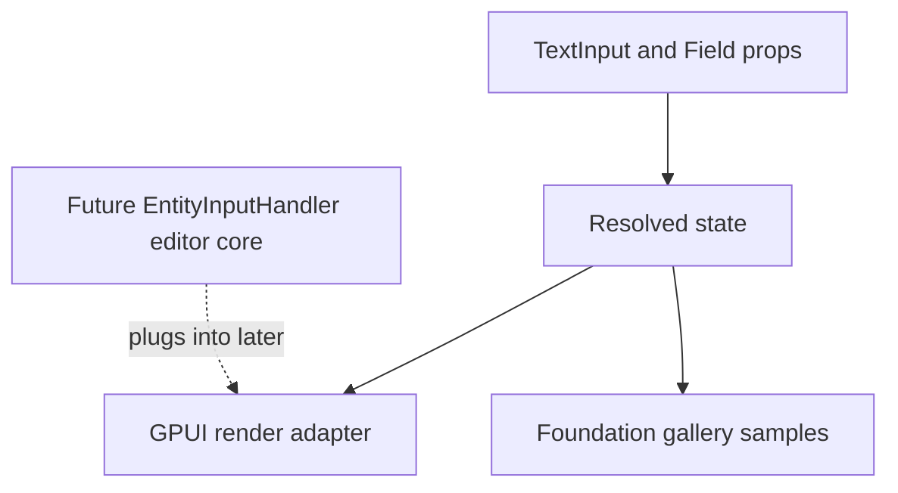

# Open GPUI UI Text Input and Field Slice

## Summary

Add the next official component proof point: a headless-ready `TextInput` and `Field` slice inside
`open-gpui-ui-components`, backed by resolved state tests and gallery dogfood.

## Problem Frame

ADR 0005 chose an adapter-first, headless-ready component architecture. `Button` and `Switch`
proved simple activation and toggled state, but they did not force value, placeholder, invalid,
required, read-only, label, help, and error contracts. Text inputs are the next smallest component
that exercises those contracts without committing to a full headless crate.

GPUI text editing is not a native `div()` concern. The complete path requires
`EntityInputHandler`, `ElementInputHandler`, UTF-16 selection mapping, IME marked ranges, grapheme
navigation, clipboard behavior, and paint-phase `Window::handle_input` registration. This slice
should not copy a full editor core from a reference repository. It should establish the official
component contract and visible adapter surface while keeping the real editing controller as a
follow-up.

## Requirements

- R1. `TextInput` exposes a testable resolved state for value, placeholder, disabled, read-only,
  invalid, required, size, metrics, role, and token intents.
- R2. `Field` exposes a testable resolved state for label, help text, error text, required,
  invalid, disabled, size, control id, and message precedence.
- R3. The GPUI adapter renders stable input and field anatomy with focusable text-input semantics
  using the public GPUI APIs available today.
- R4. The component crate keeps state resolution renderer-neutral enough to support future
  extraction into a headless behavior crate.
- R5. The foundation gallery includes TextInput and Field samples for default, filled, invalid,
  required, read-only, and disabled states.
- R6. Tests cover the new state contracts and gallery metadata without requiring native text input
  event synthesis.

## Key Technical Decisions

- **Contract first, editor core later:** Implement the official component API, resolved state, and
  render shell now; defer `EntityInputHandler` and full IME/selection behavior to a later adapter
  unit. This prevents a broad editor subsystem from entering the component crate as an accidental
  dependency.
- **Field remains a composition container:** `Field` owns label/help/error/required layout and
  can wrap any child element. It does not own the text input value model.
- **TextInput state carries a11y intent beyond current GPUI builders:** `TextInputState` records
  placeholder, value, invalid, required, read-only, and disabled semantics even where `div()` lacks
  dedicated aria setters. The render adapter maps only what GPUI exposes today and leaves the
  missing AccessKit writes visible as follow-up work.
- **Use existing foundation sizing and tokens:** Metrics come from `Size::input_h`,
  `Size::input_px`, `Size::input_py`, and `Size::control_text_px`; colors stay as `ColorIntent`
  slots until the ADR's theme resolver follow-up exists.

## Scope Boundaries

- Do not add a standalone `open-gpui-ui-headless` crate in this slice.
- Do not copy `repo-ref/gpui-component`'s editor, display map, LSP, context menu, completion, or
  popover code.
- Do not implement multi-line textarea, password masking, clear buttons, OTP, number input, or
  validation engines.
- Do not modify GPUI's core accessibility API unless implementation proves a tiny adapter hook is
  required for this slice.

### Deferred to Follow-Up Work

- Add a real `TextInputController` / `TextInputState` entity that implements `EntityInputHandler`.
- Expose missing GPUI accessibility setters for value, placeholder, disabled, required, invalid,
  and read-only state.
- Add the theme resolver layer described by ADR 0005.

### Completed Follow-Up Work

- Added a no-layout-shift `FocusRing` primitive shared by Button, Switch, TextInput, and the
  focus/a11y gallery demo. GPUI adapters now paint focus-visible state with box-shadow instead of
  changing border width.

## High-Level Technical Design

## Implementation Units

### U1. Add TextInput State and Adapter

**Goal:** Add a `TextInput` component with resolved metrics, colors, semantic state, and a visible
GPUI render shell.

**Requirements:** R1, R3, R4

**Files:**

- Create `crates/ui_components/src/text_input.rs`
- Modify `crates/ui_components/src/lib.rs`
- Modify `crates/ui_components/src/prelude.rs`
- Update `crates/ui_components/tests/components.rs`

**Approach:** Follow the existing `Button` and `Switch` builder/state pattern. The render shell
uses `Role::TextInput`, `aria_label`, focusability, tab-stop gating, placeholder/value text, and
visual invalid/disabled/read-only states. State resolution stays free of callback types and GPUI
render-tree types.

**Patterns to follow:**

- `crates/ui_components/src/button.rs`
- `crates/ui_components/src/switch.rs`
- `crates/gpui/examples/input.rs`
- `repo-ref/gpui-component/crates/ui/src/input/input.rs`
- `repo-ref/fret/ecosystem/fret-ui-shadcn/src/input.rs`

**Test scenarios:**

- Default state uses `Role::TextInput`, medium input metrics, text token, border token, and enabled
  input metadata.
- Placeholder state reports an empty value and placeholder-visible metadata.
- Invalid state uses destructive border and focus-ring token intent.
- Disabled and read-only states keep text-input role but block edit metadata.
- Size helpers apply `Size::input_h`, `input_px`, and `control_text_px`.

**Verification:** Component tests pass and the public crate exports the new types explicitly.

### U2. Add Field State and Adapter

**Goal:** Add a `Field` component that composes labels, help text, error text, and an arbitrary
control child without owning input editing behavior.

**Requirements:** R2, R3, R4

**Files:**

- Create `crates/ui_components/src/field.rs`
- Modify `crates/ui_components/src/lib.rs`
- Modify `crates/ui_components/src/prelude.rs`
- Update `crates/ui_components/tests/components.rs`

**Approach:** Make `Field` a `RenderOnce` builder with stable control id, label, optional help,
optional error, required, disabled, invalid, and size. `FieldState` resolves message precedence so
errors override help text when invalid. The child is accepted as `impl IntoElement` and stored as
`AnyElement`.

**Patterns to follow:**

- `repo-ref/gpui-component/crates/ui/src/form/field.rs`
- `repo-ref/fret/ecosystem/fret-ui-shadcn/src/field.rs`
- `repo-ref/fret/ecosystem/fret-ui-shadcn/src/form_field.rs`

**Test scenarios:**

- Default field state exposes label, control id, medium size, and no message.
- Help text appears when there is no error.
- Invalid error text takes precedence over help text and uses destructive token intent.
- Required and disabled states are reflected in field metadata.
- A field can wrap a `TextInput` child without changing the child's resolved state.

**Verification:** Component tests pass without needing full gallery rendering.

### U3. Extend Gallery Component Dogfood

**Goal:** Show the new TextInput and Field states in the foundation gallery's Components page.

**Requirements:** R5, R6

**Files:**

- Modify `examples/ui-foundation-gallery/src/pages/components.rs`
- Modify `examples/ui-foundation-gallery/src/shell.rs`
- Update `examples/ui-foundation-gallery/tests/foundation_gallery.rs`
- Modify `docs/verification.md`

**Approach:** Add sample descriptors backed by real `TextInputState` and `FieldState`. Render a
compact sample grid for default, filled, invalid, required, read-only, and disabled states. Keep the
existing Components page scroll behavior and avoid broad catalog expansion.

**Patterns to follow:**

- Existing Button and Switch gallery sections in `examples/ui-foundation-gallery/src/shell.rs`
- `examples/ui-foundation-gallery/src/pages/components.rs`

**Test scenarios:**

- Component samples expose TextInput and Field metadata alongside Button and Switch metadata.
- The signal list includes the new component types and `Role::TextInput`.
- Invalid and disabled samples expose non-editable metadata.

**Verification:** Gallery tests pass and the manual dogfood guide describes the new samples.

### U4. Update Engineering Memory and Ship

**Goal:** Preserve the architectural decision, implementation boundary, and verification result for
future sessions.

**Requirements:** R4, R6

**Files:**

- Modify `docs/knowledge/engineering/current-state.md`
- Modify `docs/knowledge/engineering/log.md`
- Optionally create `docs/knowledge/engineering/subagents/open-gpui-text-field-research.md`

**Approach:** Record the subagent finding that complete text editing needs `EntityInputHandler`,
the selected first-slice boundary, the plan path, commit, and verification commands.

**Test scenarios:** Test expectation: none -- this is documentation and continuity metadata.

**Verification:** Engineering memory validation passes.

## Risks & Dependencies

- Full text editing is easy to under-scope. The plan deliberately treats IME/selection/clipboard as
  follow-up work rather than pretending a focusable `div()` is a full input.
- GPUI's public aria builder surface is incomplete for text-input state. Resolved state tests should
  preserve the intended contract until the adapter API grows.
- Focus-visible styling can currently change border width. Avoid introducing a broader focus-ring
  rule in this slice until the shared primitive exists.

## Sources & Research

- `docs/adr/0005-open-gpui-official-component-architecture.md`
- `crates/ui_components/src/button.rs`
- `crates/ui_components/src/switch.rs`
- `crates/gpui/src/input.rs`
- `crates/gpui/examples/input.rs`
- `repo-ref/gpui-component/crates/ui/src/input/input.rs`
- `repo-ref/gpui-component/crates/ui/src/form/field.rs`
- `repo-ref/fret/ecosystem/fret-ui-shadcn/src/input.rs`
- `repo-ref/fret/ecosystem/fret-ui-shadcn/src/field.rs`
