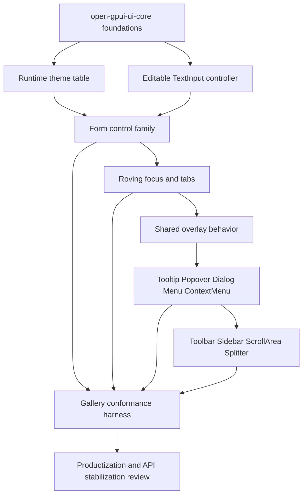

# Open GPUI Official UI Component Roadmap

## Summary

Continue the official Open GPUI UI component system as a series of independently shippable slices:
finish the missing runtime foundations first, then expand form controls, navigation, overlay
behavior, and composite components, with the current UI crates treated as the product boundary.

Roadmap update 2026-06-17: ADR 0008 supersedes the old extraction-centered next step for active
planning. Historical headless-readiness notes below should be read as boundary hygiene unless a new
standalone extraction plan is opened.

The recommended execution order is:

1. Runtime theme table and state token resolution.
2. Real editable `TextInput` controller using GPUI's `EntityInputHandler` path.
3. `Checkbox` and `Label`.
4. Roving-focus primitive and `Tabs`.
5. `RadioGroup` and `Toggle`.
6. `Badge` and `IconButton`.
7. Shared overlay behavior: dismissable layer, focus restore, focus scope, placement policy.
8. `Tooltip` and `Popover`.
9. `Dialog`.
10. `Menu` and `ContextMenu`.
11. `ScrollArea` and `Splitter`.
12. `Toolbar` and `Sidebar`.
13. Gallery conformance and documentation hardening.
14. Current-crate productization review and API stabilization.

U1 and U2 are both foundation gates. The default recommendation is to run U1 first because it
prevents color and state-token debt before the catalog grows. If the next session wants to stress
the self-drawn engine boundary immediately, U2 can be swapped ahead of U1 without invalidating the
rest of this roadmap.

Renderer-neutral resolved state remains a rolling checkpoint, not a once-at-the-end surprise. Each
slice should note whether it adds new GPUI runtime dependencies, but ADR 0008 makes productization
of the current crates the active roadmap.

## Problem Frame

ADR 0005 selected an adapter-first, headless-ready architecture rather than copying a broad
component library directly into `open-gpui`. The current repository has proven the first vertical
slices:

- `open-gpui-ui-core` provides foundation vocabulary for sizing, density, adaptive breakpoints,
  semantic tokens, overlay geometry, accessibility metadata, and focus metadata.
- `open-gpui-ui-components` provides `Button`, `Switch`, `TextInput`, `Field`, `ColorIntent`,
  `ThemeResolver`, and `FocusRing`.
- `examples/ui-foundation-gallery` dogfoods the foundation and component states.

The system is now useful enough to keep expanding, but the next choices matter. If the project
adds many styled components before runtime theme resolution, every component will bake in fallback
colors that must be revisited. If it adds more input-like components before a real editable
`TextInput`, the component surface will keep hiding the hardest self-drawn UI boundary: text
editing, IME, selection, clipboard, and UTF-16 range mapping. If it starts with menus and dialogs
before shared overlay behavior, dismissal and focus restoration will be duplicated in every
component.

The plan therefore treats the next phase as a sequence of architecture-enforcing slices, not a
catalog sprint.

## Requirements

- R1. Preserve ADR 0005's adapter-first, headless-ready model: resolved state stays testable and
  renderer-neutral; GPUI adapters own `div()`, `RenderOnce`, `Window`, `App`, `Context`,
  `ElementId`, focus handles, hitboxes, AccessKit mapping, and paint/layout details.
- R2. Replace static fallback-color resolution with a runtime theme table that can express light,
  dark, high-contrast, disabled, hover, selected, invalid, destructive, and focus-visible state
  colors.
- R3. Implement real editable text input through GPUI's `EntityInputHandler` /
  `ElementInputHandler` path rather than simulating editing on a focusable `div()`.
- R4. Expand simple controls in small families, with explicit state contracts, accessibility
  roles, keyboard behavior, focus-ring policy, and gallery examples for each state.
- R5. Introduce shared interaction primitives for roving focus, focus scope, dismissable layers,
  outside press, Escape dismissal, and focus restoration before shipping overlay-heavy components.
- R6. Keep the gallery as a conformance and dogfood surface, not only a visual sample page.
- R7. Use `repo-ref/gpui-component` as a GPUI-native component reference, `repo-ref/fret` and
  `repo-ref/fret/ecosystem/fret-ui-kit` as headless/policy-layer references, and
  `repo-ref/fret/ecosystem/fret-ui-shadcn` as a taxonomy and interaction-case reference.
- R8. Defer a standalone `open-gpui-ui-headless` crate unless a new extraction plan explicitly
  reopens it; current work should stabilize the existing UI crates as the product surface.

## Key Technical Decisions

- **Theme before broad visual expansion:** The current `ThemeResolver` centralizes fallback RGB
  values, but it is not yet a runtime theme table. The next theme slice should make token
  resolution a real runtime contract before more components depend on it.
- **Editable text before advanced forms:** `TextInput` is currently a display and semantic shell.
  Real text editing is the most important self-drawn UI proof point and should be solved before
  adding textarea, search boxes, combo boxes, or command inputs.
- **Small families before composites:** Split the simpler controls into separate slices so each
  one can prove its own state contract: checkbox/label association, radio-group movement, toggle
  selection, button-adjacent affordances, and display-only badge semantics.
- **Shared behavior before overlay components:** `Tooltip`, `Popover`, `Dialog`, `Menu`, and
  `ContextMenu` all need dismissal, focus restore, layer ordering, and placement behavior. These
  rules should be factored once before each component grows its own policy.
- **Gallery as contract harness:** Every slice should add resolved-state tests and gallery metadata
  checks. Manual screenshots are useful, but the durable contract should be in Rust tests.
- **Productize the current crates first:** A future headless extraction remains possible, but ADR
  0008 makes the current crates the active product boundary. Keep renderer-neutral contracts and
  adapter classification visible while stabilizing the shipped surface.

## Scope Boundaries

- Do not move styled components into `open-gpui` core.
- Do not copy `repo-ref/gpui-component` wholesale. Its theme, Root, story, input, and overlay
  patterns are references, not a target architecture.
- Do not make `fret-ui-kit` or `fret-ui-shadcn` runtime dependencies.
- Do not add editor, markdown, Tree-sitter, LSP, chart, dock, or webview features to the official
  base component crate.
- Do not create `open-gpui-ui-headless` in the active roadmap; reopen it only through a separate
  extraction plan.
- Do not broaden the gallery into a product shell until the component contracts need that surface.

## High-Level Technical Design

## Implementation Units

### U1. Runtime Theme Table and State Tokens

**Goal:** Upgrade `ThemeResolver` from a static fallback-color namespace into a runtime theme table
with deterministic token/state resolution.

**Requirements:** R1, R2, R6

**Files:**

- Modify `crates/ui_components/src/theme.rs`
- Modify `crates/ui_components/src/color.rs`
- Modify `crates/ui_core/src/tokens.rs`
- Update `crates/ui_components/tests/components.rs` or split theme tests into
  `crates/ui_components/tests/theme.rs`
- Update `examples/ui-foundation-gallery/src/pages/tokens.rs`
- Update `docs/ui/component-contract.md`

**Approach:** Introduce a `ThemeSnapshot` or equivalent runtime value that maps semantic token
names and component state to concrete GPUI colors. Keep `ColorIntent` in resolved component state,
but let adapters resolve against a snapshot instead of only using fallback RGB. Preserve simple
defaults so the first gallery remains runnable without application-level theme setup.

Prefer a small GPUI-native registry/snapshot shape over a broad cross-runtime theme engine. The
first useful version should support default themes, light/dark snapshots, state lookup, and a
revision or generation value that can invalidate cached render decisions when theme data changes.

**Patterns to follow:**

- Current `crates/ui_components/src/theme.rs`
- Current `crates/ui_core/src/tokens.rs`
- `repo-ref/gpui-component/crates/ui/src/theme/`
- `repo-ref/gpui-component/CLAUDE.md` theme notes and `repo-ref/gpui-component/themes/`
- `repo-ref/fret/crates/fret-ui/src/theme/mod.rs`
- `repo-ref/fret/ecosystem/fret-ui-kit/src/theme_tokens.rs`
- `repo-ref/fret/ecosystem/fret-ui-kit/src/style/tokens.rs`

**Test scenarios:**

- Default theme resolves all current `ColorIntent` tokens without panics.
- Light, dark, and high-contrast snapshots produce different surface/text/accent/focus-ring colors.
- Invalid, disabled, hover, selected, and destructive states have explicit token entries.
- Button, Switch, TextInput, Field, and FocusRing keep their public state contracts while render
  color resolution switches to the runtime table.
- Gallery token samples expose theme mode metadata.

**Verification:** Run focused core/component tests, gallery tests, `cargo fmt` for changed
packages, and `cargo check` for `open-gpui-ui-core`, `open-gpui-ui-components`, and
`open-gpui-ui-foundation-gallery`.

### U2. Real Editable TextInput Controller

**Goal:** Turn `TextInput` from a display/semantic shell into a real single-line editable input
backed by GPUI input handling.

**Requirements:** R1, R3, R6

**Files:**

- Modify `crates/ui_components/src/text_input.rs`
- Consider introducing `crates/ui_components/src/text_input/controller.rs` if the controller
  grows beyond a small module.
- Update `crates/ui_components/src/lib.rs`
- Update `crates/ui_components/src/prelude.rs`
- Add or update tests under `crates/ui_components/tests/`
- Update `examples/ui-foundation-gallery/src/pages/components.rs`
- Update `examples/ui-foundation-gallery/tests/foundation_gallery.rs`
- Update `docs/ui/component-contract.md`

**Approach:** Base the implementation on GPUI's canonical input path. The controller should own
content, selected range, selection direction, marked range, last layout/bounds, clipboard
operations, and edit actions. The rendered component should register `ElementInputHandler` during
paint through `Window::handle_input` and keep resolved state renderer-neutral.

Start with a single-line text input. Defer multiline textarea, password masking, validation
engines, autocomplete, context menus, and editor-grade text features.

Borrow `gpui-component`'s GPUI-native shape, but do not copy its full editor-oriented `InputState`
surface. The official base component should extract the core text input behavior first and leave
LSP, diagnostics, completion popovers, folding, and rich editor features out of scope. Use Fret's
text widget work mainly to check IME, UTF-16, preedit, and surrounding-text edge cases.

**Patterns to follow:**

- `crates/gpui/src/input.rs`
- `crates/gpui/examples/input.rs`
- `crates/canvas/src/gpui/input.rs`
- `repo-ref/gpui-component/crates/ui/src/input/state.rs`
- `repo-ref/fret/crates/fret-ui/src/text/input/widget.rs`

**Test scenarios:**

- Controller converts UTF-16 ranges to UTF-8 byte offsets and back.
- Inserting text replaces selected or marked ranges correctly.
- Backspace/Delete respect grapheme boundaries.
- Copy/Cut/Paste behavior is isolated from visual rendering where possible.
- Disabled and read-only inputs reject text input but keep correct focus and a11y state.
- Gallery can show editable and read-only examples without changing scroll behavior.

**Verification:** Run focused tests for the controller and existing component/gallery tests. Use
manual dogfood in the gallery for typing, selection, paste, disabled/read-only states, and IME
where the platform supports it.

### U3. Checkbox and Label

**Goal:** Add the first post-Button/Switch control pair: `Checkbox` and `Label`.

**Requirements:** R1, R4, R6

**Files:**

- Add `crates/ui_components/src/checkbox.rs`
- Add `crates/ui_components/src/label.rs`
- Modify `crates/ui_components/src/lib.rs`
- Modify `crates/ui_components/src/prelude.rs`
- Update or split tests under `crates/ui_components/tests/`
- Update `examples/ui-foundation-gallery/src/pages/components.rs`

**Approach:** Keep both components small and resolved-state-first. `Checkbox` should prove
checked/unchecked/indeterminate where appropriate, disabled, required, invalid, and keyboard
behavior. `Label` should establish association semantics for both current and future controls.
This slice should not absorb radio-group navigation, button variants, or display-only badge
semantics.

**Patterns to follow:**

- Current `crates/ui_components/src/button.rs`
- Current `crates/ui_components/src/switch.rs`
- `repo-ref/fret/ecosystem/fret-ui-kit/src/primitives/checkbox.rs`
- `repo-ref/fret/ecosystem/fret-ui-kit/src/primitives/label.rs`
- `repo-ref/fret/ecosystem/fret-ui-shadcn/src/checkbox.rs`

**Test scenarios:**

- Checked, unchecked, indeterminate, disabled, invalid, and required state resolution.
- Label association metadata for text input and form controls.
- Gallery includes compact state matrices without overflowing the viewport.

**Verification:** Run component tests, gallery tests, package checks, and manual traversal through
the controls page.

### U4. Roving Focus Primitive and Tabs

**Goal:** Introduce the first composite navigation behavior through a reusable roving-focus
primitive and `Tabs`.

**Requirements:** R1, R4, R5, R6

**Files:**

- Consider adding `crates/ui_core/src/navigation.rs` or `crates/ui_core/src/roving_focus.rs`
- Add `crates/ui_components/src/tabs.rs`
- Modify `crates/ui_core/src/lib.rs`
- Modify `crates/ui_core/src/prelude.rs`
- Modify `crates/ui_components/src/lib.rs`
- Modify `crates/ui_components/src/prelude.rs`
- Add or update tests under `crates/ui_components/tests/`
- Update `examples/ui-foundation-gallery/src/pages/components.rs`

**Approach:** Model tab state separately from GPUI rendering: selected tab, focused item, disabled
items, orientation, activation mode, panel linkage, and keyboard movement. Keep focus traversal
rules reusable for future toolbar, menu, radio group, and segmented control work.

**Patterns to follow:**

- `repo-ref/fret/ecosystem/fret-ui-kit/src/headless/tab_strip_controller.rs`
- `repo-ref/fret/ecosystem/fret-ui-kit/src/headless/tab_strip_arbitration.rs`
- `repo-ref/fret/ecosystem/fret-ui-kit/src/headless/focus_scope.rs`
- `repo-ref/fret/ecosystem/fret-ui-shadcn/src/toggle_group.rs`

**Test scenarios:**

- Arrow keys move focus according to orientation.
- Disabled tabs are skipped.
- Manual and automatic activation modes are represented in state.
- Selected tab and panel linkage metadata are stable.
- Gallery tab switching resets local scroll where that behavior is intentional.

**Verification:** Run focused state tests and manually dogfood tab switching, keyboard movement,
and scroll behavior in the gallery.

### U5. RadioGroup and Toggle

**Goal:** Add grouped selection and binary variant controls after roving focus exists.

**Requirements:** R1, R4, R6

**Files:**

- Add `crates/ui_components/src/radio.rs`
- Add `crates/ui_components/src/toggle.rs`
- Modify `crates/ui_components/src/lib.rs`
- Modify `crates/ui_components/src/prelude.rs`
- Update or split tests under `crates/ui_components/tests/`
- Update `examples/ui-foundation-gallery/src/pages/components.rs`

**Approach:** Make `RadioGroup` depend on the roving-focus primitive from U4 instead of inventing
its own keyboard model. Keep `Toggle` aligned with button/switch state contracts but separate it
from checkbox semantics so the API does not blur selection and binary activation.

**Patterns to follow:**

- Current `crates/ui_components/src/button.rs`
- Current `crates/ui_components/src/switch.rs`
- `repo-ref/fret/ecosystem/fret-ui-kit/src/primitives/checkbox.rs`
- `repo-ref/fret/ecosystem/fret-ui-kit/src/primitives/label.rs`
- `repo-ref/fret/ecosystem/fret-ui-shadcn/src/radio_group.rs`
- `repo-ref/fret/ecosystem/fret-ui-shadcn/src/toggle.rs`

**Test scenarios:**

- Radio group selection, disabled item, and required group metadata.
- Radio navigation follows roving focus semantics and skips disabled items.
- Toggle selected state reuses button/focus/theme primitives without affecting checkbox behavior.
- Gallery includes compact state matrices without overflowing the viewport.

**Verification:** Run component tests, gallery tests, package checks, and manual keyboard traversal
through the controls page.

### U6. Badge and IconButton

**Goal:** Add display and button-adjacent variants without mixing them into form-control logic.

**Requirements:** R1, R4, R6

**Files:**

- Add `crates/ui_components/src/badge.rs`
- Add `crates/ui_components/src/icon_button.rs`
- Modify `crates/ui_components/src/lib.rs`
- Modify `crates/ui_components/src/prelude.rs`
- Update or split tests under `crates/ui_components/tests/`
- Update `examples/ui-foundation-gallery/src/pages/components.rs`

**Approach:** Keep `Badge` display-only and token-driven. Keep `IconButton` aligned with the `Button`
contract, but require explicit accessible labels for icon-only affordances. Do not drag form
validation or selection state into this slice.

**Patterns to follow:**

- Current `crates/ui_components/src/button.rs`
- `repo-ref/fret/ecosystem/fret-ui-kit/src/primitives/label.rs`
- `repo-ref/fret/ecosystem/fret-ui-shadcn/src/button.rs`
- `repo-ref/fret/ecosystem/fret-ui-shadcn/src/badge.rs`

**Test scenarios:**

- Badge variants resolve token intent without interaction state.
- Icon-only buttons require accessible labels.
- IconButton reuses theme, sizing, and focus primitives rather than creating one-off styles.
- Gallery includes compact state matrices without overflowing the viewport.

**Verification:** Run component tests, gallery tests, package checks, and manual traversal of the
button-adjacent page.

### U7. Shared Overlay Behavior Foundation

**Goal:** Expand overlay foundation from geometry helpers into reusable behavior contracts for
overlay components.

**Requirements:** R1, R5, R6

**Files:**

- Modify `crates/ui_core/src/overlay.rs`
- Consider adding `crates/ui_core/src/focus_scope.rs`
- Consider adding `crates/ui_core/src/dismissable_layer.rs`
- Modify `crates/ui_core/src/lib.rs`
- Modify `crates/ui_core/src/prelude.rs`
- Add foundation tests under `crates/ui_core/tests/` if the logic outgrows unit tests.
- Update `examples/ui-foundation-gallery/src/pages/overlay.rs`

**Approach:** Add renderer-neutral state machines for layer identity, modal/non-modal mode,
outside press policy, Escape policy, focus restore target, initial focus intent, and placement
inputs. Keep actual event subscription, focus handle movement, hitbox capture, and drawing in GPUI
adapters.

**Patterns to follow:**

- Current `crates/ui_core/src/overlay.rs`
- `repo-ref/fret/ecosystem/fret-ui-kit/src/overlay.rs`
- `repo-ref/fret/ecosystem/fret-ui-kit/src/overlay_controller.rs`
- `repo-ref/fret/ecosystem/fret-ui-kit/src/window_overlays/`
- `repo-ref/fret/ecosystem/fret-ui-kit/src/primitives/dismissable_layer.rs`
- `repo-ref/fret/ecosystem/fret-ui-kit/src/primitives/focus_scope.rs`
- `repo-ref/fret/ecosystem/fret-ui-kit/src/headless/dismissible_layer.rs`

**Test scenarios:**

- Escape dismissal resolves consistently by topmost layer.
- Outside press can dismiss, ignore, or pass through according to policy.
- Focus restore target is preserved when an overlay closes.
- Modal and non-modal layers expose distinct state.
- Geometry helpers still prefer visual bounds over layout bounds.

**Verification:** Run `open-gpui-ui-core` tests and gallery overlay tests.

### U8. Tooltip and Popover

**Goal:** Build `Tooltip` and `Popover` on top of the shared overlay behavior.

**Requirements:** R1, R4, R5, R6

**Files:**

- Add `crates/ui_components/src/tooltip.rs`
- Add `crates/ui_components/src/popover.rs`
- Modify `crates/ui_components/src/lib.rs`
- Modify `crates/ui_components/src/prelude.rs`
- Add or update tests under `crates/ui_components/tests/`
- Update `examples/ui-foundation-gallery/src/pages/overlay.rs`
- Update `examples/ui-foundation-gallery/src/pages/components.rs` if component catalog metadata
  needs a dedicated overlay section.

**Approach:** Keep this slice narrow: hover/focus intent, anchoring, and focus restoration for
`Popover`, and delayed dismissal policy for `Tooltip`. Dialog and menu behavior are separate slices
so the overlay base remains easy to reason about.

**Patterns to follow:**

- `repo-ref/gpui-component/crates/ui/src/tooltip.rs`
- `repo-ref/gpui-component/examples/dialog_overlay/src/main.rs`
- `repo-ref/fret/ecosystem/fret-ui-shadcn/src/tooltip.rs`
- `repo-ref/fret/ecosystem/fret-ui-shadcn/src/popover.rs`
- `repo-ref/fret/ecosystem/fret-ui-shadcn/tests/default_action_focus_on_pointer_down.rs`

**Test scenarios:**

- Tooltip opens by hover/focus intent and closes according to delay/dismissal policy.
- Popover opens from an anchor and restores focus when closed.
- Tooltip and Popover remain usable without the later menu/dialog abstractions.

**Verification:** Run focused tests and manual gallery dogfood for keyboard-only and pointer
flows.

### U9. Dialog

**Goal:** Build `Dialog` on top of the shared overlay behavior and focus restore contract.

**Requirements:** R1, R4, R5, R6

**Files:**

- Add `crates/ui_components/src/dialog.rs`
- Modify `crates/ui_components/src/lib.rs`
- Modify `crates/ui_components/src/prelude.rs`
- Add or update tests under `crates/ui_components/tests/`
- Update `examples/ui-foundation-gallery/src/pages/overlay.rs`
- Update `examples/ui-foundation-gallery/src/pages/components.rs` if component catalog metadata
  needs a dedicated dialog section.

**Approach:** Keep `Dialog` modal-state focused: title/description metadata, Escape handling,
outside-click policy, and focus restoration. Do not fold menu or popover behavior into it.

**Patterns to follow:**

- `repo-ref/gpui-component/examples/dialog_overlay/src/main.rs`
- `repo-ref/fret/ecosystem/fret-ui-shadcn/src/dialog.rs`
- `repo-ref/fret/ecosystem/fret-ui-shadcn/tests/dialog_escape_dismiss_focus_restore.rs`

**Test scenarios:**

- Dialog exposes modal state, title/description metadata, Escape handling, and outside-click policy.
- Focus restore target is preserved when the dialog closes.
- Dialog can coexist with the later menu abstractions without sharing ownership of them.

**Verification:** Run focused tests and manual gallery dogfood for keyboard-only and pointer
flows.

### U10. Menu and ContextMenu

**Goal:** Build `Menu` and `ContextMenu` after roving focus, dismissable layers, and dialog focus
behavior are stable.

**Requirements:** R1, R4, R5, R6

**Files:**

- Add `crates/ui_components/src/menu.rs`
- Add `crates/ui_components/src/context_menu.rs`
- Modify `crates/ui_components/src/lib.rs`
- Modify `crates/ui_components/src/prelude.rs`
- Add or update tests under `crates/ui_components/tests/`
- Update `examples/ui-foundation-gallery/src/pages/overlay.rs`
- Update `examples/ui-foundation-gallery/src/pages/components.rs` if component catalog metadata
  needs a dedicated menu section.

**Approach:** Start with keyboard navigation, disabled items, separators, and focus restoration.
ContextMenu can open from a point anchor once the base menu model is stable.

**Patterns to follow:**

- `repo-ref/gpui-component/crates/ui/src/menu/popup_menu.rs`
- `repo-ref/gpui-component/crates/ui/src/menu/dropdown_menu.rs`
- `repo-ref/fret/ecosystem/fret-ui-shadcn/src/dropdown_menu.rs`
- `repo-ref/fret/ecosystem/fret-ui-shadcn/src/context_menu.rs`
- `repo-ref/fret/ecosystem/fret-ui-shadcn/tests/dropdown_menu_keyboard_navigation.rs`
- `repo-ref/fret/ecosystem/fret-ui-shadcn/tests/context_menu_keyboard_navigation.rs`

**Test scenarios:**

- Menu supports roving focus, disabled items, separators, and Escape focus restoration.
- Menu can be extended to check/radio items without inventing a second navigation model.
- ContextMenu can open from a point anchor and close consistently.

**Verification:** Run focused tests and manual gallery dogfood for keyboard-only and pointer
flows.

### U11. ScrollArea and Splitter

**Goal:** Add overflow and resize primitives without mixing them into shell navigation.

**Requirements:** R1, R4, R6

**Files:**

- Add `crates/ui_components/src/scroll_area.rs`
- Add `crates/ui_components/src/splitter.rs`
- Modify `crates/ui_components/src/lib.rs`
- Modify `crates/ui_components/src/prelude.rs`
- Update gallery pages under `examples/ui-foundation-gallery/src/pages/`

**Approach:** Keep `ScrollArea` focused on overflow and scroll-reset behavior. Keep `Splitter`
focused on min/max/collapse constraints and state-tested resizing. Do not mix toolbar/sidebar
selection into these primitives.

**Patterns to follow:**

- `repo-ref/fret/ecosystem/fret-ui-shadcn/src/scroll_area.rs`
- `repo-ref/fret/ecosystem/fret-ui-shadcn/src/resizable.rs`
- `repo-ref/gpui-component/crates/ui/src/virtual_list.rs`

**Test scenarios:**

- ScrollArea stable viewport metadata and optional scroll reset on view changes.
- Splitter min/max/collapse constraints.
- Gallery pages with long content remain scrollable in short viewports.

**Verification:** Run component/gallery tests and manually dogfood small and large viewports.

### U12. Toolbar and Sidebar

**Goal:** Add shell-level navigation after roving focus and overflow primitives are stable.

**Requirements:** R1, R4, R6

**Files:**

- Add `crates/ui_components/src/toolbar.rs`
- Add `crates/ui_components/src/sidebar.rs`
- Modify `crates/ui_components/src/lib.rs`
- Modify `crates/ui_components/src/prelude.rs`
- Update gallery pages under `examples/ui-foundation-gallery/src/pages/`
- Consider a future `examples/ui-gallery` only if the current foundation gallery becomes too
  crowded.

**Approach:** `Toolbar` should reuse roving focus and button variants. `Sidebar` should reuse
tokens, layout density, and selection state. Keep these out of the overflow primitive slice so the
shell layer can stay focused on navigation semantics.

**Patterns to follow:**

- `repo-ref/fret/ecosystem/fret-ui-shadcn/src/sidebar.rs`
- `repo-ref/fret/ecosystem/fret-ui-shadcn/src/scroll_area.rs`
- `repo-ref/gpui-component/crates/ui/src/virtual_list.rs`

**Test scenarios:**

- Toolbar keyboard movement and disabled action state.
- Sidebar selected/collapsed state and compact density.
- Shell navigation does not break scroll behavior in the gallery.

**Verification:** Run component/gallery tests and manually dogfood small and large viewports.

### U13. Gallery Conformance and Documentation Hardening

**Goal:** Keep documentation, examples, and verification aligned as the component system grows.

**Requirements:** R6, R7

**Files:**

- Update `examples/ui-foundation-gallery/src/pages/components.rs`
- Update `examples/ui-foundation-gallery/src/pages/overlay.rs`
- Update `examples/ui-foundation-gallery/src/shell.rs`
- Update `examples/ui-foundation-gallery/tests/foundation_gallery.rs`
- Update `docs/verification.md`
- Update `docs/ui/component-contract.md`
- Update `docs/knowledge/engineering/current-state.md`
- Update `docs/knowledge/engineering/log.md`

**Approach:** Treat the gallery as a conformance dashboard. Every component page should expose
metadata for state, role, token intent, size, focus behavior, disabled behavior, and known adapter
gaps. Keep pages scrollable and reset scroll only where the UX contract explicitly chooses it.
Use stable story ids and docs-surface tests once the gallery starts producing reusable snippets,
but do not copy Fret's full gallery/cookbook infrastructure before the component catalog needs it.

**Test scenarios:**

- Every component family has gallery metadata.
- Story ids or equivalent sample identifiers stay stable across refactors.
- Left navigation remains scrollable on short viewports.
- Pages with content taller than the viewport scroll correctly.
- Component state matrices include disabled, focus-visible, invalid, required, and compact/regular
  examples where relevant.

**Verification:** Run gallery tests and perform a manual viewport pass.

### U14. Headless Extraction Readiness Review

**Goal:** Decide whether to create `open-gpui-ui-headless`, keep headless-ready contracts inside
current crates longer, or expose a smaller internal behavior module first.

**Requirements:** R1, R7, R8

**Files:**

- Update `docs/adr/0005-open-gpui-official-component-architecture.md`
- Consider adding `docs/adr/0006-open-gpui-ui-headless-extraction.md`
- Update `docs/ui/component-contract.md`
- Update crate boundaries only if the ADR accepts extraction.

**Approach:** Review actual repetition after the earlier slices. The extraction should only happen
if it removes real duplication across multiple components or enables a concrete second adapter. A
good headless boundary should include behavior/state machines and semantic contracts, not GPUI
rendering, colors after resolution, or application product policy.

**Readiness gates:**

- At least two independent component families share each extracted primitive.
- Resolved states are free of GPUI render types, handles, callbacks, and window/context access.
- Tests can run without opening a GPUI window for the extracted behavior.
- The extraction does not force downstream users to adopt a specific visual design system.
- The extraction has a documented adapter contract for GPUI and at least one plausible future
  adapter.

**Verification:** ADR review, targeted compile checks, and a small migration proof if extraction is
accepted.

## Risks & Dependencies

- **Text input complexity:** Real input can expand into editor territory. Mitigation: ship
  single-line editing first and explicitly defer textarea, search suggestions, completion, syntax,
  and context-menu polish.
- **Theme churn:** Runtime theme APIs can become public too early. Mitigation: keep the first table
  small, component-facing, and internally swappable while tests assert behavior rather than exact
  type names.
- **Overlay focus bugs:** Dismissal and focus restoration are easy to get subtly wrong. Mitigation:
  create shared behavior primitives and state tests before component-specific overlay work.
- **Headless over-extraction:** A premature headless crate could freeze incidental GPUI choices.
  Mitigation: defer until repeated contracts exist and document an extraction ADR.
- **Gallery sprawl:** A single gallery page can become hard to navigate. Mitigation: keep pages
  scrollable, split sections when needed, and treat gallery data as conformance metadata.

## Suggested Execution Cadence

Each unit should usually become one focused plan and one or more implementation commits:

- Plan document: `docs/plans/YYYY-MM-DD-NNN-feat-ui-<slice>-plan.md`
- Implementation: scoped code changes with focused tests.
- Verification: package-level `cargo fmt`, `cargo check`, and `cargo nextest run`.
- Memory update: `docs/knowledge/engineering/current-state.md` and
  `docs/knowledge/engineering/log.md`.
- Commit: Conventional Commit message, e.g. `feat(ui): add runtime theme table`.

Do not batch U1 through U14 into one large change. The roadmap is intentionally a sequence of
reviewable slices.

## Sources & Research

- `docs/adr/0004-open-gpui-component-library-strategy.md`
- `docs/adr/0005-open-gpui-official-component-architecture.md`
- `docs/ui/component-contract.md`
- `docs/plans/2026-06-15-001-feat-ui-foundation-gallery-plan.md`
- `docs/plans/2026-06-15-002-feat-ui-components-first-slice-plan.md`
- `docs/plans/2026-06-15-003-feat-ui-text-field-slice-plan.md`
- `docs/knowledge/engineering/current-state.md`
- `crates/ui_components/src/theme.rs`
- `crates/ui_components/src/text_input.rs`
- `crates/ui_components/src/focus.rs`
- `crates/ui_core/src/overlay.rs`
- `crates/gpui/src/input.rs`
- `crates/gpui/examples/input.rs`
- `crates/canvas/src/gpui/input.rs`
- `repo-ref/gpui-component/CLAUDE.md`
- `repo-ref/gpui-component/crates/ui/src/`
- `repo-ref/gpui-component/crates/ui/src/input/state.rs`
- `repo-ref/gpui-component/crates/ui/src/theme/`
- `repo-ref/fret/CONTEXT.md`
- `repo-ref/fret/crates/fret-ui/src/text/input/widget.rs`
- `repo-ref/fret/crates/fret-ui/src/theme/mod.rs`
- `repo-ref/fret/apps/fret-ui-gallery/tests/`
- `repo-ref/fret/ecosystem/fret-ui-kit/src/headless/mod.rs`
- `repo-ref/fret/ecosystem/fret-ui-kit/src/overlay.rs`
- `repo-ref/fret/ecosystem/fret-ui-kit/src/primitives/dismissable_layer.rs`
- `repo-ref/fret/ecosystem/fret-ui-kit/src/primitives/focus_scope.rs`
- `repo-ref/fret/ecosystem/fret-ui-shadcn/src/`
- Read-only repository gap subagent research from this planning run.
