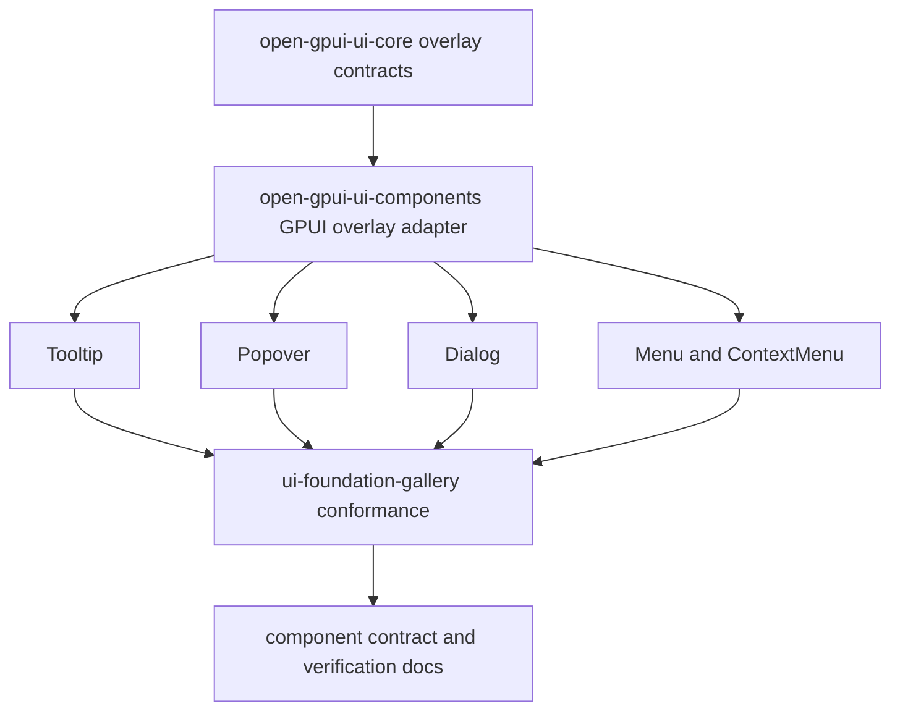
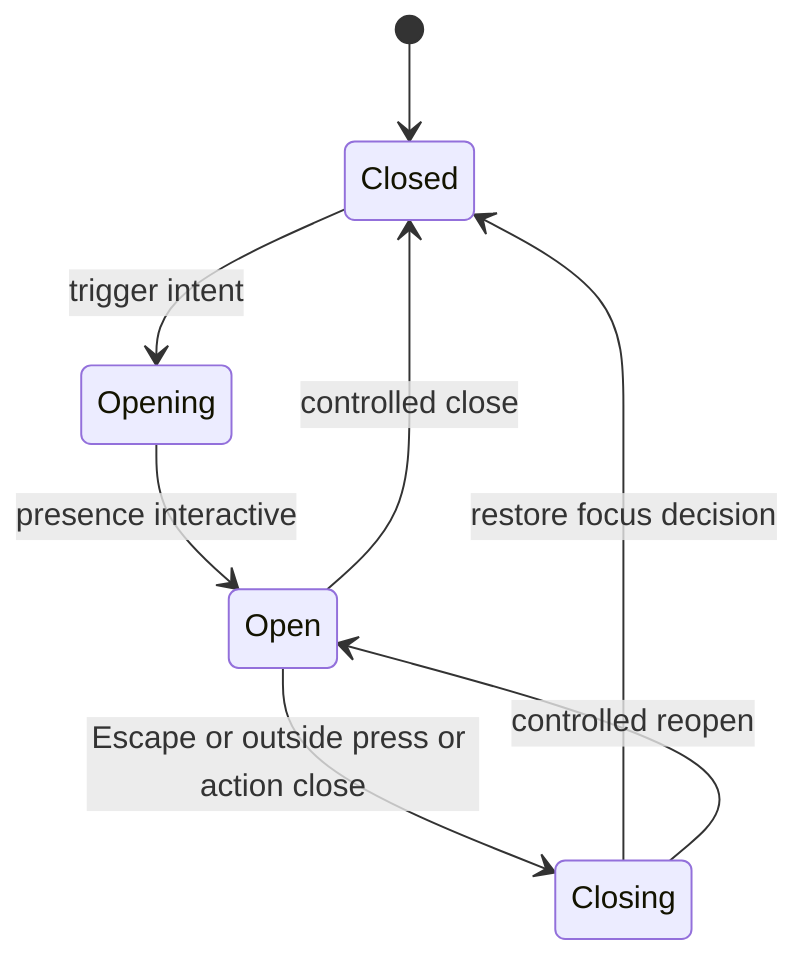

# Open GPUI UI Overlay Component Series

## Summary

Build the next component series around shared overlay behavior before adding overlay-heavy
components. The series starts with a small runtime hardening gate for the recent AccessKit repair,
then adds renderer-neutral overlay contracts, GPUI adapter helpers, `Tooltip`, `Popover`, `Dialog`,
`Menu`, and `ContextMenu`, and finishes with a headless-readiness checkpoint.

The active scope is the overlay interaction family. `ScrollArea`, `Splitter`, `Toolbar`, and
`Sidebar` remain the following layout and shell-navigation series.

---

## Problem Frame

The component roadmap has now shipped the simple and composite control foundation through
`Badge` and `IconButton`. The next missing layer is shared overlay behavior. If `Tooltip`,
`Popover`, `Dialog`, `Menu`, and `ContextMenu` are implemented independently, each component will
invent its own dismissal, focus restoration, layer ordering, placement, and accessibility policy.
That would make a later headless extraction harder and would raise the chance of subtle runtime
bugs.

The recent Components-page AccessKit crash also exposed a verification gap. GPUI now strips invalid
cross-node accessibility references before handing tree updates to AccessKit, but the direct
`open-gpui` test harness is locally blocked by missing font fixtures. The next series should close
that verification gap before adding more overlay surfaces that rely on explicit accessibility
relationships.

---

## Requirements

**Runtime hardening**

- R1. The Components gallery must keep running when component adapters emit explicit accessibility
  relationships, including cases where stale references are repaired before platform handoff.
- R2. The test strategy must cover invalid and valid accessibility reference repair without
  depending on unrelated local font assets.

**Overlay behavior**

- R3. Shared overlay behavior must model layer kind, presence, modal versus non-modal behavior,
  outside-press policy, Escape policy, focus restore intent, initial focus intent, and placement
  inputs without storing GPUI runtime types.
- R4. GPUI adapters must own event subscriptions, `deferred` and `anchored` rendering, focus
  handles, hitboxes, callbacks, AccessKit mapping, and concrete styling.
- R5. `Tooltip`, `Popover`, `Dialog`, `Menu`, and `ContextMenu` must reuse shared overlay behavior
  rather than duplicating dismissal, focus restoration, and placement decisions.

**Gallery and future extraction**

- R6. The gallery must remain a conformance surface: overlay pages need scrollable viewport
  behavior, keyboard and pointer dogfood paths, stable sample metadata, and focused automated tests.
- R7. A standalone `open-gpui-ui-headless` crate remains deferred until repeated renderer-neutral
  contracts exist across the shipped controls and at least one overlay family.
- R8. Reference repositories can shape API and behavior choices, but they must not become runtime
  dependencies or wholesale copied subsystems.

---

## Key Technical Decisions

- KTD1. Risk gate before new overlay components: start by proving the AccessKit repair and gallery
  runtime smoke path. Overlay components will add more explicit references, so the crash barrier
  needs a testable guard before the catalog grows.
- KTD2. Behavior contracts before component adapters: place renderer-neutral overlay policy in
  `open-gpui-ui-core` or pure component state modules, and place GPUI event/render wiring in
  `open-gpui-ui-components`. This preserves ADR 0005's adapter-first boundary.
- KTD3. No headless crate yet: keep the behavior extractable but inside current crates until the
  overlay family proves real duplication. Creating a new crate now would freeze names and seams
  before the component surface has enough evidence.
- KTD4. Treat overlay kinds separately: descriptive tooltip, non-modal dismissible popover, modal
  dialog, and menu/context-menu each need different outside-press and focus behavior. A single
  boolean `open` model is not enough.
- KTD5. Reference patterns, not implementations: use `gpui-component` for GPUI-native idioms and
  Fret for policy-layer vocabulary and diagnostic scenarios, but keep Open GPUI APIs small and
  consistent with the existing component contract.
- KTD6. Gallery as conformance, not marketing: every overlay component should ship with a gallery
  sample that exercises keyboard, pointer, overflow, and accessibility metadata rather than only a
  static visual example.

---

## High-Level Technical Design

Overlay components should share a small behavior contract and then layer component-specific
semantics on top:

The contract must keep `open`, `present`, and `interactive` distinct. A closing overlay may still
be painted while it is no longer interactive; a modal overlay may still block underlay input while
its content is transitioning out. The first Open GPUI implementation can be simple, but the model
should not collapse these states into one flag.

---

## Phased Delivery

| Phase | Units | Outcome |
| --- | --- | --- |
| Runtime gate | U1 | Accessibility repair and gallery smoke are testable before new overlay work. |
| Shared behavior | U2, U3 | Core overlay policy and GPUI adapter helpers exist. |
| Overlay components | U4, U5, U6, U7 | Tooltip, Popover, Dialog, Menu, and ContextMenu reuse the shared behavior. |
| Stabilization | U8 | Contract docs, gallery conformance, and headless readiness are reviewed. |

---

## Implementation Units

### U1. Accessibility and Gallery Runtime Gate

**Goal:** Convert the recent AccessKit crash repair into a repeatable verification gate and keep
the gallery stable before adding more overlay references.

**Requirements:** R1, R2, R6

**Dependencies:** None.

**Files:**

- Modify `crates/gpui/src/window/a11y.rs`
- Modify `crates/gpui/src/svg_renderer.rs` only if needed to unblock unrelated font-dependent test
  harness compilation.
- Modify `examples/ui-foundation-gallery/tests/foundation_gallery.rs`
- Modify `docs/verification.md`
- Modify `docs/knowledge/engineering/current-state.md`

**Approach:** Add characterization coverage for invalid cross-node AccessKit references such as
`labelled_by`, `controls`, and active-descendant pointers. If the direct `open-gpui` test harness
still fails before reaching the a11y test because local font assets are missing, fix that harness
dependency only enough for focused non-font tests to compile. Do not broaden this unit into a font
subsystem refactor.

**Execution note:** Start with characterization tests around the repaired accessibility behavior.

**Patterns to follow:**

- `crates/gpui/src/window/a11y.rs`
- `docs/ui/component-contract.md`
- `docs/verification.md`

**Test scenarios:**

- Invalid accessibility relationships pointing to absent nodes are stripped before the platform
  update reaches AccessKit.
- Valid accessibility relationships pointing to present nodes are preserved.
- A node with several invalid reference properties is repaired without removing unrelated role,
  label, action, or state metadata.
- The Components gallery can be opened and left running long enough to catch the prior
  `accesskit_consumer` panic path.
- Long gallery pages remain scrollable in a short viewport while focused controls stay reachable.

**Verification:** Focused a11y tests compile and pass, component and gallery package tests pass,
and the manual gallery smoke no longer exits when navigating to Components.

### U2. Renderer-Neutral Overlay Behavior Contracts

**Goal:** Expand `open-gpui-ui-core` from geometry helpers into shared overlay behavior contracts.

**Requirements:** R3, R7, R8

**Dependencies:** U1.

**Files:**

- Modify `crates/ui_core/src/overlay.rs`
- Consider adding `crates/ui_core/src/focus_scope.rs`
- Consider adding `crates/ui_core/src/dismissal.rs`
- Modify `crates/ui_core/src/lib.rs`
- Modify `crates/ui_core/src/prelude.rs`
- Add or update unit tests in `crates/ui_core/src/overlay.rs`
- Consider adding `crates/ui_core/tests/overlay_behavior.rs` if the contract outgrows unit tests.
- Modify `examples/ui-foundation-gallery/src/pages/overlay.rs`

**Approach:** Introduce pure types for overlay kind, layer identity, presence, dismiss reason,
outside-press policy, Escape policy, focus restore intent, initial focus intent, and placement
input. Keep event dispatch and window state out of this layer. Extend the existing geometry helper
tests rather than replacing them.

**Patterns to follow:**

- `crates/ui_core/src/overlay.rs`
- `repo-ref/fret/ecosystem/fret-ui-kit/src/overlay_controller.rs`
- `repo-ref/fret/ecosystem/fret-ui-kit/src/window_overlays/state.rs`
- `repo-ref/fret/ecosystem/fret-ui-kit/src/primitives/focus_scope.rs`
- `repo-ref/fret/ecosystem/fret-ui-kit/src/declarative/dismissible.rs`

**Test scenarios:**

- Topmost Escape dismissal resolves differently from lower-layer Escape handling.
- Outside press policy can represent dismiss, ignore, consume, and pass-through outcomes.
- Focus restore intent prefers trigger identity but can represent no-restore and fallback restore.
- Modal, non-modal dismissible, and tooltip-like overlays expose distinct layer behavior.
- Existing geometry helpers still prefer visual bounds over layout bounds.

**Verification:** `open-gpui-ui-core` tests prove the behavior contract without opening a GPUI
window, and the overlay gallery page exposes the new state vocabulary.

### U3. GPUI Overlay Adapter Helpers

**Goal:** Provide a small GPUI adapter surface that turns shared overlay contracts into
`deferred` and `anchored` Open GPUI elements.

**Requirements:** R3, R4, R5, R6

**Dependencies:** U2.

**Files:**

- Add `crates/ui_components/src/overlay.rs`
- Modify `crates/ui_components/src/lib.rs`
- Modify `crates/ui_components/src/prelude.rs`
- Modify `crates/ui_components/tests/components.rs`
- Modify `examples/ui-foundation-gallery/src/pages/overlay.rs`
- Modify `examples/ui-foundation-gallery/src/shell.rs` only if the overlay dogfood needs shell-level
  focus or scroll wiring.

**Approach:** Keep the adapter narrow: anchor capture, deferred priority, snap-to-window margin,
open-change callbacks, and focus restore hooks. Do not expose a broad overlay runtime or a global
manager unless implementation proves it is necessary. Component-specific APIs should consume this
adapter rather than reaching directly into `anchored()` and `deferred()` for every component.

**Patterns to follow:**

- `crates/gpui/examples/popover.rs`
- `repo-ref/gpui-component/crates/ui/src/popover.rs`
- `repo-ref/fret/ecosystem/fret-ui-kit/src/overlay_controller.rs`
- `repo-ref/fret/tools/diag-scripts/ui-gallery/overlay/`

**Test scenarios:**

- A non-modal overlay opens from a trigger anchor and clamps inside the safe window margin.
- Escape closes only the active overlay and reports the correct dismiss reason.
- Outside press follows the configured pass-through or consume policy.
- Closing an overlay restores focus to the trigger when the trigger is still live.
- Gallery overlay dogfood remains scrollable and does not block unrelated page interaction when
  closed.

**Verification:** Component tests cover adapter-resolved state, and manual gallery dogfood proves
anchor, Escape, outside press, and focus restore behavior.

### U4. Tooltip

**Goal:** Add a descriptive `Tooltip` component on top of the shared overlay adapter.

**Requirements:** R4, R5, R6, R8

**Dependencies:** U3.

**Files:**

- Add `crates/ui_components/src/tooltip.rs`
- Modify `crates/ui_components/src/lib.rs`
- Modify `crates/ui_components/src/prelude.rs`
- Modify `crates/ui_components/tests/components.rs`
- Modify `examples/ui-foundation-gallery/src/pages/overlay.rs`
- Modify `docs/verification.md`

**Approach:** Keep the first tooltip slice non-interactive and descriptive. It should support text
or simple element content, hover and focus intent, placement input, delay policy as resolved state,
and explicit accessible naming for icon-only triggers. Rich hover cards and action-bearing tooltip
content are deferred.

**Patterns to follow:**

- `repo-ref/gpui-component/crates/ui/src/tooltip.rs`
- `repo-ref/fret/ecosystem/fret-ui-kit/src/primitives/tooltip.rs`
- `repo-ref/fret/ecosystem/fret-ui-kit/src/tooltip_provider.rs`
- `repo-ref/fret/tools/diag-scripts/ui-gallery/overlay/ui-gallery-tooltip-focus-opens.json`
- `repo-ref/fret/tools/diag-scripts/ui-gallery/overlay/ui-gallery-tooltip-hovercard-scroll-clamp.json`

**Test scenarios:**

- Tooltip resolved state records content kind, placement, delay policy, disabled trigger behavior,
  and accessibility label requirements.
- Focus intent can open the tooltip without pointer input.
- Hover intent can open and close according to the delay policy.
- Tooltip content clamps inside the safe window margin near viewport edges.
- Disabled trigger policy is explicit and does not accidentally expose a focusable tooltip trigger.

**Verification:** Tooltip tests pass, the gallery exposes focus and hover samples, and manual
keyboard-only traversal can reveal and dismiss tooltip content.

### U5. Popover

**Goal:** Add an interactive `Popover` component that shares dismissal, placement, and focus
restoration with the overlay foundation.

**Requirements:** R4, R5, R6, R8

**Dependencies:** U3.

**Files:**

- Add `crates/ui_components/src/popover.rs`
- Modify `crates/ui_components/src/lib.rs`
- Modify `crates/ui_components/src/prelude.rs`
- Modify `crates/ui_components/tests/components.rs`
- Modify `examples/ui-foundation-gallery/src/pages/overlay.rs`
- Modify `docs/verification.md`

**Approach:** Support trigger, content, controlled or default-open state, `on_open_change`,
anchored placement, Escape dismissal, outside press policy, and focus restoration. Keep nested
popover coordination and rich animation out of the first slice.

**Patterns to follow:**

- `crates/gpui/examples/popover.rs`
- `repo-ref/gpui-component/crates/ui/src/popover.rs`
- `repo-ref/fret/ecosystem/fret-ui-kit/src/primitives/popover.rs`
- `repo-ref/fret/tools/diag-scripts/ui-gallery/overlay/ui-gallery-popover-escape-focus-restore.json`
- `repo-ref/fret/tools/diag-scripts/ui-gallery/overlay/ui-gallery-popover-click-through-outside-press-focus-underlay.json`

**Test scenarios:**

- Default-open and controlled-open state resolve consistently.
- Trigger activation opens the popover and marks the trigger selected or expanded when applicable.
- Escape dismissal closes the popover and restores focus to the trigger.
- Outside press can either dismiss and consume the event or dismiss and allow click-through based
  on policy.
- Popover placement clamps near window edges and preserves the preferred anchor when there is room.

**Verification:** Popover tests pass, gallery samples cover controlled and uncontrolled examples,
and manual keyboard and pointer flows match the documented policies.

### U6. Dialog

**Goal:** Add a modal `Dialog` component on top of shared overlay behavior.

**Requirements:** R4, R5, R6, R8

**Dependencies:** U3, U5.

**Files:**

- Add `crates/ui_components/src/dialog.rs`
- Modify `crates/ui_components/src/lib.rs`
- Modify `crates/ui_components/src/prelude.rs`
- Modify `crates/ui_components/tests/components.rs`
- Modify `examples/ui-foundation-gallery/src/pages/overlay.rs`
- Modify `docs/verification.md`

**Approach:** Model dialog title, description, modal state, initial focus intent, close action,
Escape policy, outside-click policy, and focus restoration. Keep `AlertDialog`, `Sheet`, nested
modal stacks, and advanced focus-trap edge cases out of the first dialog slice unless implementation
shows they are needed for a basic accessible modal.

**Patterns to follow:**

- `repo-ref/gpui-component/crates/ui/src/dialog/`
- `repo-ref/gpui-component/examples/dialog_overlay/src/main.rs`
- `repo-ref/fret/ecosystem/fret-ui-kit/src/primitives/dialog.rs`
- `repo-ref/fret/tools/diag-scripts/ui-gallery/overlay/ui-gallery-modal-barrier-focus-restore.json`
- `repo-ref/fret/tools/diag-scripts/ui-gallery/overlay/ui-gallery-modal-barrier-underlay-block.json`

**Test scenarios:**

- Dialog resolved state requires title metadata and supports optional description metadata.
- Opening a dialog records modal layer state and initial focus intent.
- Escape closes the dialog only when policy allows it.
- Outside press behavior is explicit and does not activate underlay controls while modal content is
  open.
- Closing the dialog restores focus to the trigger when the trigger is still live.

**Verification:** Dialog tests pass, gallery samples cover modal open and close flows, and manual
dogfood confirms underlay controls are inert while the dialog is open.

### U7. Menu and ContextMenu

**Goal:** Add menu surfaces after roving focus, dismissal, and focus restoration are available.

**Requirements:** R4, R5, R6, R8

**Dependencies:** U3, U5.

**Files:**

- Add `crates/ui_components/src/menu.rs`
- Add `crates/ui_components/src/context_menu.rs`
- Modify `crates/ui_components/src/lib.rs`
- Modify `crates/ui_components/src/prelude.rs`
- Modify `crates/ui_components/tests/components.rs`
- Modify `examples/ui-foundation-gallery/src/pages/overlay.rs`
- Modify `docs/verification.md`

**Approach:** Start with action items, disabled items, separators, roving focus, Escape focus
restore, pointer selection, and context-menu opening from a point anchor. Defer submenus,
checkbox/radio menu items, typeahead, menu bars, and application menu integration until the base
menu model is stable.

**Patterns to follow:**

- `crates/ui_components/src/tabs.rs`
- `crates/ui_components/src/radio.rs`
- `repo-ref/gpui-component/crates/ui/src/menu/popup_menu.rs`
- `repo-ref/gpui-component/crates/ui/src/menu/context_menu.rs`
- `repo-ref/fret/ecosystem/fret-ui-kit/src/primitives/menu/`
- `repo-ref/fret/ecosystem/fret-ui-kit/src/primitives/context_menu.rs`
- `repo-ref/fret/tools/diag-scripts/workspace/shell-demo/workspace-shell-demo-tab-contextmenu-keyboard-open-smoke.json`

**Test scenarios:**

- Arrow keys move active menu focus and skip disabled items.
- Home and End move to first and last enabled menu items.
- Enter and Space activate the focused action item and close the menu.
- Escape closes the menu and restores focus to the trigger.
- ContextMenu opens from a point anchor and closes consistently on outside press.

**Verification:** Menu tests pass, the gallery exposes keyboard and pointer samples, and the menu
model can later grow check/radio items without replacing roving-focus state.

### U8. Gallery, Documentation, and Headless Readiness Checkpoint

**Goal:** Stabilize the overlay series and decide whether the next work should extract headless
behavior or continue inside current crates.

**Requirements:** R6, R7, R8

**Dependencies:** U4, U5, U6, U7.

**Files:**

- Modify `examples/ui-foundation-gallery/src/pages/components.rs`
- Modify `examples/ui-foundation-gallery/src/pages/overlay.rs`
- Modify `examples/ui-foundation-gallery/src/shell.rs`
- Modify `examples/ui-foundation-gallery/tests/foundation_gallery.rs`
- Modify `docs/ui/component-contract.md`
- Modify `docs/verification.md`
- Modify `docs/knowledge/engineering/current-state.md`
- Modify `docs/knowledge/engineering/log.md`
- Consider adding `docs/adr/0006-open-gpui-ui-headless-extraction.md`

**Approach:** Treat the overlay family as the first serious extraction evidence. Review which
contracts stayed free of GPUI runtime types, which adapters leaked rendering concerns into state,
and which shared behaviors are now used by more than one component. Add an ADR only if the evidence
supports creating `open-gpui-ui-headless`; otherwise document why extraction remains deferred.

**Patterns to follow:**

- `docs/adr/0005-open-gpui-official-component-architecture.md`
- `docs/ui/component-contract.md`
- `docs/plans/2026-06-15-004-feat-ui-component-roadmap-plan.md`
- `docs/knowledge/engineering/subagents/ui-component-roadmap-reference-research.md`

**Test scenarios:**

- Gallery navigation remains scrollable on short viewports.
- Overlay and Components pages expose stable samples for each shipped overlay component.
- Component state matrices identify role, open state, disabled state, focus behavior, and token
  intent where applicable.
- Documentation names any remaining adapter gaps without implying the headless crate already
  exists.
- The extraction checkpoint can cite at least two components reusing a behavior before proposing
  extraction.

**Verification:** Focused component, core, and gallery tests pass; manual gallery traversal covers
keyboard, pointer, overflow, and close-restore flows; the headless decision is recorded in docs or
explicitly deferred.

---

## Scope Boundaries

### Active Scope

- Accessibility repair verification related to component and overlay growth.
- Renderer-neutral overlay policy contracts.
- GPUI adapter helpers for anchored and deferred overlay rendering.
- First slices for `Tooltip`, `Popover`, `Dialog`, `Menu`, and `ContextMenu`.
- Gallery and documentation updates required to verify the overlay series.
- A headless-readiness checkpoint after the overlay family exists.

### Deferred to Follow-Up Work

- `ScrollArea` and `Splitter`.
- `Toolbar` and `Sidebar`.
- `AlertDialog`, `Sheet`, hover card, command dialog, combobox, select, nested popovers, nested
  menus, submenus, menu bars, typeahead, checkbox and radio menu items.
- App-level theme registry, user theme file loading, hot reload, and JSON theme schema.
- Cross-platform non-GPUI adapters.

### Out of Scope

- Copying `repo-ref/gpui-component` or Fret overlay runtimes wholesale.
- Creating `open-gpui-ui-headless` before the extraction checkpoint accepts it.
- Building a full Radix or shadcn parity library in this series.
- Reworking unrelated GPUI font, SVG, text rendering, docking, or canvas systems beyond the
  minimal test-harness unblock described in U1.

---

## System-Wide Impact

This series affects the public API shape of `open-gpui-ui-core` and `open-gpui-ui-components`, the
manual verification contract for `examples/ui-foundation-gallery`, and the future extraction path
for a possible headless crate. It also increases pressure on GPUI accessibility tree correctness,
because overlay components tend to add explicit relationships such as trigger, label, description,
popup, and active-descendant references.

The plan should not change the base Open GPUI rendering model. GPUI remains the adapter and runtime
layer; the new shared contracts should be ordinary Rust state and policy types.

---

## Risks & Dependencies

| Risk | Mitigation |
| --- | --- |
| AccessKit repair remains under-tested because unrelated font fixtures block package tests. | U1 explicitly fixes or bypasses that harness issue only for focused non-font tests. |
| Shared overlay contracts become too abstract before real components use them. | U2 stays small and U3-U5 prove the contract with actual components before broader expansion. |
| Dialog and menu scope expands into full application shell behavior. | U6 and U7 defer alert dialogs, sheets, submenus, menu bars, and command dialogs. |
| Focus restoration bugs are hard to detect visually. | Every overlay component includes keyboard and close-restore gallery dogfood plus state tests. |
| A premature headless crate freezes incidental GPUI choices. | U8 requires reuse evidence and an ADR before extraction. |
| Reference repos pull the project toward incompatible architecture. | KTD5 keeps references as research inputs, not dependencies or wholesale implementations. |

---

## Acceptance Examples

- AE1. When the Components page emits an explicit label reference to a missing node, the GPUI
  repair layer strips that reference and the process does not exit.
- AE2. When a Popover is opened with keyboard focus on its trigger and then dismissed with Escape,
  focus returns to the trigger if it is still live.
- AE3. When a Dialog is open, pointer input outside the dialog does not activate underlay controls.
- AE4. When a ContextMenu opens from a point anchor near a window edge, its content clamps inside
  the safe window margin.
- AE5. When a future agent reviews the overlay family after U8, it can identify which behavior
  contracts are renderer-neutral and which remain GPUI adapter responsibilities.

---

## Documentation and Verification Notes

Update `docs/verification.md` incrementally as each overlay component ships. The manual dogfood
path should stay focused on observable outcomes: open and close behavior, Escape dismissal, outside
press policy, focus restoration, viewport scrollability, and gallery stability.

Update `docs/ui/component-contract.md` when a component introduces a new resolved-state concept
such as overlay presence, dismiss reason, trigger relationship, modal state, or focus restore
policy. Do not document a future headless crate as accepted until U8 records the decision.

---

## Sources and Research

- `docs/plans/2026-06-15-004-feat-ui-component-roadmap-plan.md`
- `docs/adr/0005-open-gpui-official-component-architecture.md`
- `docs/ui/component-contract.md`
- `docs/verification.md`
- `crates/ui_core/src/overlay.rs`
- `crates/gpui/examples/popover.rs`
- `repo-ref/gpui-component/crates/ui/src/tooltip.rs`
- `repo-ref/gpui-component/crates/ui/src/popover.rs`
- `repo-ref/gpui-component/crates/ui/src/dialog/`
- `repo-ref/gpui-component/crates/ui/src/menu/`
- `repo-ref/fret/ecosystem/fret-ui-kit/src/overlay_controller.rs`
- `repo-ref/fret/ecosystem/fret-ui-kit/src/window_overlays/`
- `repo-ref/fret/ecosystem/fret-ui-kit/src/primitives/focus_scope.rs`
- `repo-ref/fret/ecosystem/fret-ui-kit/src/declarative/dismissible.rs`
- `repo-ref/fret/tools/diag-scripts/ui-gallery/overlay/`
