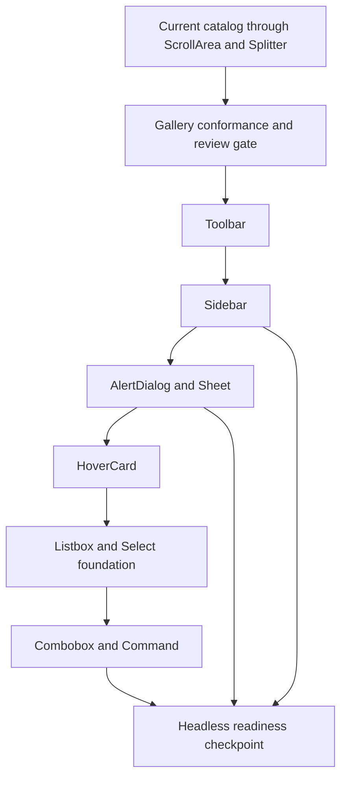
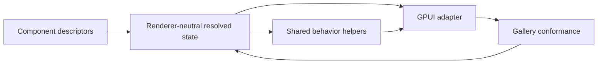

# Open GPUI UI Shell, Choice, and Headless Readiness Series

## Summary

Finish the next obvious official UI component series after `ScrollArea` and `Splitter`: harden the
gallery quality gate, add shell/navigation primitives, add derived overlay surfaces, add
choice/search primitives, and then run a headless-readiness checkpoint. The plan keeps components
inside the current adapter-first crates while continuing to shape APIs so a future headless crate
can be extracted from proven behavior.

---

## Problem Frame

The official component catalog now covers the foundation, common controls, overlay family, basic
scroll viewports, and splitters. The recent `ScrollArea` regression showed that state-level tests
are not enough for self-drawn UI components: a component can expose correct metadata and still fail
when a GPUI runtime handle is rebuilt during redraw. The next work should therefore start by making
gallery conformance and review gates more explicit.

The remaining obvious component gaps cluster into three families. Shell/navigation needs
`Toolbar` and `Sidebar` so application surfaces can be composed without ad hoc local widgets.
Overlay adjuncts need `AlertDialog`, `Sheet`, and `HoverCard` so the overlay behavior already built
for `Dialog`, `Popover`, and `Tooltip` is reused instead of duplicated. Choice/search components
need a shared collection/listbox contract before `Select`, `Combobox`, and `Command` grow separate
keyboard and filtering models.

ADR 0006 keeps `open-gpui-ui-headless` deferred. This series should not create the crate by default,
but it should gather the strongest extraction evidence so the next checkpoint can make that
decision from code rather than preference.

---

## Assumptions

- The active branch remains `feat/open-gpui-ui-core`.
- The next useful artifact is one consolidated series plan, not separate plan files per component.
- The official component library should prioritize reusable behavior contracts over copying a full
  shadcn-style taxonomy at once.
- A standalone headless crate remains out of active scope unless the final checkpoint produces a
  separate extraction plan.

---

## Requirements

**Quality and contract discipline**

- R1. Gallery pages must act as conformance surfaces for overflow, focus, keyboard, pointer,
  accessibility metadata, and redraw-sensitive runtime handles.
- R2. New components must expose resolved state that avoids GPUI runtime/rendering types while the
  GPUI adapter owns focus handles, scroll handles, event subscriptions, hitboxes, and rendering.
- R3. Each feature-bearing component must add component tests, gallery metadata tests, and manual
  dogfood coverage that can catch the class of issue that caused the recent `ScrollArea` failure.

**Shell and navigation**

- R4. `Toolbar` must provide a renderer-neutral action/group/separator model with orientation,
  roving focus, disabled item handling, accessible naming, and icon-only label requirements.
- R5. `Sidebar` must provide a bounded shell-navigation primitive with sections, menu items,
  selected/collapsed state, scrollable content, and app-owned selection without becoming a full app
  shell framework.

**Overlay adjuncts**

- R6. `AlertDialog`, `Sheet`, and `HoverCard` must reuse existing overlay, dialog, popover, tooltip,
  focus, and dismissal contracts rather than creating a second overlay runtime.

**Choice and search**

- R7. `Select`, `Combobox`, and `Command` must share a listbox or collection-navigation foundation
  for active item movement, disabled item skipping, grouping, selection, typeahead/filtering, empty
  states, and popup/dialog integration.

**Headless readiness**

- R8. The final checkpoint must identify which component behaviors are extractable, which state
  types still leak GPUI-specific geometry or adapter concerns, and what work remains before
  `open-gpui-ui-headless` is worth creating.
- R9. Reference repositories may shape API taxonomy and interaction coverage, but must not become
  runtime dependencies or wholesale copied implementations.

---

## Key Technical Decisions

- KTD1. Quality gate first: start with gallery conformance because self-drawn component failures
  often live in redraw, runtime handle, focus, and overflow behavior rather than pure resolved
  state.
- KTD2. Shell/navigation before richer data widgets: `Toolbar` and `Sidebar` complete the current
  layout/shell-navigation roadmap and give later `Command`, `Select`, and app examples a stable
  surrounding surface.
- KTD3. Overlay adjuncts reuse the current stack: `AlertDialog`, `Sheet`, and `HoverCard` are
  semantic variants over existing overlay primitives, not a reason to introduce a global overlay
  manager.
- KTD4. Listbox foundation before choice surfaces: `Select`, `Combobox`, and `Command` should not
  each own their own item activation, disabled skipping, grouping, and active-descendant model.
- KTD5. Headless extraction remains evidence-gated: the series should remove avoidable leaks and
  record extraction candidates, but crate creation should follow a checkpoint plan rather than
  happen opportunistically during component work.
- KTD6. References are pattern inputs: use `gpui-component` for GPUI-native examples and Fret's
  shadcn/kit code for taxonomy and scenario coverage, while keeping Open GPUI public APIs small and
  consistent with `docs/ui/component-contract.md`.

---

## High-Level Technical Design

The shared behavior layering should stay narrow:

`Toolbar`, `Sidebar`, and choice components should reuse existing roving-focus, overlay, scroll,
theme, text-input, and focus-ring helpers. They should not introduce new parallel navigation,
theme, or overlay policy systems.

---

## Phased Delivery

| Phase | Units | Outcome |
| --- | --- | --- |
| Quality gate | U1 | Gallery and review coverage catch scroll, tab, splitter, overflow, and naming/API regressions earlier. |
| Shell/navigation | U2, U3 | Toolbar and Sidebar establish reusable application-shell primitives. |
| Overlay adjuncts | U4, U5 | AlertDialog, Sheet, and HoverCard reuse existing overlay contracts. |
| Choice/search | U6, U7 | Select, Combobox, and Command share collection/listbox behavior. |
| Stabilization | U8 | Headless extraction evidence and remaining blockers are documented. |

---

## Implementation Units

### U1. Gallery Conformance and Review Gate

**Goal:** Convert recent manual findings into a repeatable quality gate for component work.

**Requirements:** R1, R2, R3

**Dependencies:** None.

**Files:**

- Modify `examples/ui-foundation-gallery/tests/foundation_gallery.rs`
- Modify `examples/ui-foundation-gallery/src/pages/components.rs`
- Modify `examples/ui-foundation-gallery/src/shell.rs`
- Modify `crates/ui_components/tests/components.rs`
- Modify `docs/verification.md`
- Modify `docs/ui/component-contract.md`
- Modify `docs/knowledge/engineering/current-state.md`
- Modify `docs/knowledge/engineering/log.md`

**Approach:** Add visible component conformance gates for exported type names, gallery metadata,
ScrollArea redraw persistence, Splitter runtime constraints, Tabs overflow/roving focus, and
explicit accessible labels. Keep pointer drag persistence, focus-visible traversal, and other
redraw-sensitive checks in the manual dogfood guide until they can be proven from state-level tests
without a full runtime harness.

**Execution note:** Start with characterization coverage for the current `ScrollArea` and
`Splitter` behavior so future component work does not regress the latest fixes.

**Patterns to follow:**

- `examples/ui-foundation-gallery/tests/foundation_gallery.rs`
- `docs/verification.md`
- `docs/ui/component-contract.md`
- `crates/ui_components/src/scroll_area.rs`
- `crates/ui_components/src/splitter.rs`

**Test scenarios:**

- Components page metadata includes scrollable `ScrollArea` samples for vertical, horizontal, and
  two-axis overflow.
- A reconstructed default `ScrollArea` component preserves a keyed runtime handle rather than
  resetting its offset on redraw.
- Splitter samples expose horizontal and vertical groups with stable handle adjacency and collapsed
  panel metadata.
- Vertical Tabs keep the left rail scrollable inside the constrained gallery card.
- Component exports and prelude exports include new public types by explicit name.

**Verification:** Component and gallery tests cover the metadata and state contracts, and the
manual Components-page dogfood guide names the scroll, split, tab, focus, and crash-regression
paths that must be checked before a component slice is considered done.

### U2. Toolbar

**Goal:** Add `Toolbar` as the first shell/action-group component after the layout primitives.

**Requirements:** R2, R3, R4

**Dependencies:** U1.

**Files:**

- Add `crates/ui_components/src/toolbar.rs`
- Modify `crates/ui_components/src/lib.rs`
- Modify `crates/ui_components/src/prelude.rs`
- Modify `crates/ui_components/tests/components.rs`
- Modify `examples/ui-foundation-gallery/src/pages/components.rs`
- Modify `docs/ui/component-contract.md`
- Modify `docs/verification.md`

**Approach:** Model toolbar items as renderer-neutral descriptors: actions, toggles, separators,
groups, disabled state, optional shortcut text, icon-only accessible labels, orientation, active
item, and roving-focus metadata. Use `Button`, `IconButton`, `Toggle`, `FocusRing`, and shared
roving-focus helpers instead of creating one-off action widgets.

**Patterns to follow:**

- `crates/ui_components/src/button.rs`
- `crates/ui_components/src/icon_button.rs`
- `crates/ui_components/src/toggle.rs`
- `crates/ui_components/src/menu.rs`
- `crates/ui_components/src/roving_focus.rs`
- `repo-ref/fret/crates/fret-a11y-accesskit/src/roles.rs`
- `repo-ref/fret/ecosystem/fret-ui-ai/src/elements/message_toolbar.rs`

**Test scenarios:**

- Horizontal and vertical toolbar state resolves action, toggle, separator, and group anatomy.
- Disabled toolbar items are skipped by roving focus and do not activate.
- Icon-only toolbar actions require accessible labels.
- Separator items are presentational and excluded from activation.
- Gallery samples expose compact and dense toolbars without resizing surrounding content on focus.

**Verification:** `ToolbarState` tests prove item anatomy and navigation without a GPUI window,
and the Components gallery shows toolbar samples with keyboard and pointer dogfood coverage.

### U3. Sidebar

**Goal:** Add `Sidebar` as a bounded shell-navigation primitive that composes existing controls
without becoming an app framework.

**Requirements:** R2, R3, R5

**Dependencies:** U1, U2.

**Files:**

- Add `crates/ui_components/src/sidebar.rs`
- Modify `crates/ui_components/src/lib.rs`
- Modify `crates/ui_components/src/prelude.rs`
- Modify `crates/ui_components/tests/components.rs`
- Modify `examples/ui-foundation-gallery/src/pages/components.rs`
- Modify `examples/ui-foundation-gallery/src/shell.rs` only if a shell sample needs shared runtime
  state.
- Modify `docs/ui/component-contract.md`
- Modify `docs/verification.md`

**Approach:** Keep v1 to side, variant, collapsed mode, selected item, groups, items, optional
badges/actions, disabled items, and scrollable content. Selection stays app-owned. Use
`ScrollArea` for long menus, `IconButton` for collapse affordances, and roving focus for menu
movement. Defer provider contexts, mobile offcanvas routing, nested submenus, route integration,
and persisted layout preferences.

**Patterns to follow:**

- `crates/ui_components/src/scroll_area.rs`
- `crates/ui_components/src/tabs.rs`
- `crates/ui_components/src/menu.rs`
- `repo-ref/gpui-component/crates/ui/src/sidebar/mod.rs`
- `repo-ref/gpui-component/crates/ui/src/sidebar/menu.rs`
- `repo-ref/gpui-component/examples/sidebar/src/main.rs`
- `repo-ref/fret/ecosystem/fret-ui-shadcn/src/sidebar.rs`

**Test scenarios:**

- Sidebar state records side, variant, collapsed mode, selected item, and section/item anatomy.
- Collapsed icon mode keeps item accessible labels even when visible text is hidden.
- Long sidebars keep the menu content scrollable in a constrained viewport.
- Disabled navigation items are skipped and cannot become selected through activation.
- Gallery samples show expanded, icon-collapsed, and long-menu states without making the page
  unscrollable.

**Verification:** Component tests cover the state contract, gallery tests cover sample metadata,
and manual dogfood verifies collapsed and scrollable sidebar behavior in a short viewport.

### U4. AlertDialog and Sheet

**Goal:** Add action-critical and edge-attached overlay derivatives on top of existing dialog and
overlay behavior.

**Requirements:** R2, R3, R6

**Dependencies:** U1, U3.

**Files:**

- Add `crates/ui_components/src/alert_dialog.rs`
- Add `crates/ui_components/src/sheet.rs`
- Modify `crates/ui_components/src/lib.rs`
- Modify `crates/ui_components/src/prelude.rs`
- Modify `crates/ui_components/tests/components.rs`
- Modify `examples/ui-foundation-gallery/src/pages/overlay.rs`
- Modify `docs/ui/component-contract.md`
- Modify `docs/verification.md`

**Approach:** Build `AlertDialog` from `Dialog` semantics with explicit title, description,
cancel/action affordances, destructive intent, and stricter accessible role metadata. Build `Sheet`
from modal or non-modal dialog presence with side, inset, size, close affordance, and edge-attached
placement. Both components should reuse existing overlay layer, outside-press, Escape, focus
restore, token, and metrics vocabulary.

**Patterns to follow:**

- `crates/ui_components/src/dialog.rs`
- `crates/ui_components/src/overlay.rs`
- `repo-ref/gpui-component/crates/ui/src/dialog/alert_dialog.rs`
- `repo-ref/gpui-component/crates/ui/src/sheet.rs`
- `repo-ref/fret/ecosystem/fret-ui-shadcn/src/alert_dialog.rs`
- `repo-ref/fret/ecosystem/fret-ui-shadcn/src/sheet.rs`

**Test scenarios:**

- AlertDialog state requires title and action/cancel metadata and records destructive intent.
- AlertDialog modal behavior blocks underlay input and restores focus to the trigger on close.
- Sheet state records side, modal mode, size, close affordance, and placement anatomy.
- Sheet outside-press and Escape behavior follows explicit policy rather than inheriting an
  accidental default.
- Gallery samples cover destructive confirmation, safe cancel, left/right sheet, and bottom sheet
  behavior without adding a second overlay runtime.

**Verification:** Component tests prove both state contracts, and overlay gallery dogfood confirms
modal underlay blocking, Escape dismissal, outside-press policy, and focus restoration.

### U5. HoverCard

**Goal:** Add `HoverCard` as an interactive hover/focus surface without overloading descriptive
`Tooltip`.

**Requirements:** R2, R3, R6

**Dependencies:** U1, U4.

**Files:**

- Add `crates/ui_components/src/hover_card.rs`
- Modify `crates/ui_components/src/lib.rs`
- Modify `crates/ui_components/src/prelude.rs`
- Modify `crates/ui_components/tests/components.rs`
- Modify `examples/ui-foundation-gallery/src/pages/overlay.rs`
- Modify `docs/ui/component-contract.md`
- Modify `docs/verification.md`

**Approach:** Treat `HoverCard` as a non-modal interactive overlay with hover/focus open intent,
delay policy, safe-window placement, optional pointer grace behavior, and focus restoration. It may
reuse `Tooltip` timing vocabulary and `Popover` placement/dismissal vocabulary, but its resolved
state should not be a tooltip with action-bearing content bolted on.

**Patterns to follow:**

- `crates/ui_components/src/tooltip.rs`
- `crates/ui_components/src/popover.rs`
- `repo-ref/gpui-component/crates/ui/src/hover_card.rs`
- `repo-ref/gpui-component/crates/ui/src/input/popovers/hover_popover.rs`
- `repo-ref/fret/ecosystem/fret-ui-shadcn/src/hover_card.rs`
- `repo-ref/fret/tools/diag-scripts/suites/ui-gallery-hover-card/suite.json`

**Test scenarios:**

- HoverCard state records hover/focus/manual open intent, placement, delay policy, and
  interactive-content policy.
- Focus intent can open the card without pointer input.
- Hover leave can close the card according to delay policy without leaving stale present state.
- Content placement clamps inside the safe window margin near viewport edges.
- Gallery samples distinguish descriptive Tooltip from interactive HoverCard behavior.

**Verification:** Tests cover state and policy resolution, and gallery dogfood verifies hover,
focus, close, and edge-clamped placement behavior.

### U6. Listbox and Select Foundation

**Goal:** Add the shared collection-navigation foundation and the first selection popup.

**Requirements:** R2, R3, R7

**Dependencies:** U1, U5.

**Files:**

- Add `crates/ui_components/src/listbox.rs`
- Add `crates/ui_components/src/select.rs`
- Modify `crates/ui_components/src/lib.rs`
- Modify `crates/ui_components/src/prelude.rs`
- Modify `crates/ui_components/tests/components.rs`
- Modify `examples/ui-foundation-gallery/src/pages/components.rs`
- Modify `examples/ui-foundation-gallery/src/pages/overlay.rs` if select samples live with other
  popup surfaces.
- Modify `docs/ui/component-contract.md`
- Modify `docs/verification.md`

**Approach:** First define item descriptors, groups, labels, disabled items, active item, selected
item, optional typeahead text, empty state, and active-descendant metadata in a renderer-neutral
listbox model. Then build `Select` as a trigger plus overlay content that uses the listbox model,
existing menu/roving-focus behavior, and `ScrollArea` for long option lists.

**Patterns to follow:**

- `crates/ui_components/src/menu.rs`
- `crates/ui_components/src/context_menu.rs`
- `crates/ui_components/src/scroll_area.rs`
- `crates/ui_components/src/roving_focus.rs`
- `repo-ref/gpui-component/crates/ui/src/select.rs`
- `repo-ref/gpui-component/crates/ui/src/combobox.rs`
- `repo-ref/fret/ecosystem/fret-ui-shadcn/src/select.rs`
- `repo-ref/fret/ecosystem/fret-ui-kit/src/imui/selectable_controls/`

**Test scenarios:**

- Listbox state records grouped items, labels, separators, disabled items, active item, and selected
  item.
- Keyboard navigation skips disabled items and wraps according to explicit policy.
- Typeahead input moves active selection without changing selected value until activation.
- Select trigger exposes expanded/selected state and accessible label/value metadata.
- Long Select content scrolls inside its popup and does not reset on redraw.

**Verification:** Listbox tests run without a GPUI window, Select tests cover popup state and
selection behavior, and gallery samples cover closed, open, grouped, disabled, long-list, and empty
option states.

### U7. Combobox and Command

**Goal:** Add editable search/command surfaces on top of `TextInputController`, Listbox, and
overlay behavior.

**Requirements:** R2, R3, R7

**Dependencies:** U1, U6.

**Files:**

- Add `crates/ui_components/src/combobox.rs`
- Add `crates/ui_components/src/command.rs`
- Modify `crates/ui_components/src/lib.rs`
- Modify `crates/ui_components/src/prelude.rs`
- Modify `crates/ui_components/tests/components.rs`
- Modify `examples/ui-foundation-gallery/src/pages/components.rs`
- Modify `examples/ui-foundation-gallery/src/pages/overlay.rs` if command dialog samples live with
  overlay surfaces.
- Modify `docs/ui/component-contract.md`
- Modify `docs/verification.md`

**Approach:** `Combobox` should combine an editable text controller, popup listbox, active item,
selected value, filtering metadata, empty state, and open-change policy. `Command` should reuse the
same collection/filtering model but expose command-oriented groups, shortcuts, loading/empty states,
and an optional dialog wrapper. The first slice should avoid async data loading, fuzzy-ranking
engines, multi-select chips, and global app command registration.

**Patterns to follow:**

- `crates/ui_components/src/text_input.rs`
- `crates/ui_components/src/popover.rs`
- `crates/ui_components/src/dialog.rs`
- `repo-ref/gpui-component/crates/ui/src/combobox.rs`
- `repo-ref/fret/ecosystem/fret-ui-shadcn/src/combobox.rs`
- `repo-ref/fret/ecosystem/fret-ui-shadcn/src/command.rs`
- `repo-ref/fret/apps/fret-ui-gallery/tests/command_page_contract.rs`
- `repo-ref/fret/apps/fret-ui-gallery/tests/combobox_docs_surface.rs`

**Test scenarios:**

- Combobox query text, selected value, active item, popup open state, and empty state resolve
  independently.
- Filtering updates visible items without clearing selection unless the selected value is
  explicitly changed.
- Disabled combobox rejects text input and activation while preserving accessible state.
- Command groups expose labels, items, shortcuts, disabled state, empty state, and loading state.
- Command dialog reuses dialog overlay behavior and restores focus on close.

**Verification:** Component tests cover text/listbox integration without requiring a full app
command registry, and gallery dogfood covers typing, filtering, keyboard activation, empty states,
and dialog open/close behavior.

### U8. Headless Readiness and Post-Series Stabilization

**Goal:** Decide the next architecture step from evidence gathered across shell, overlay adjunct,
and choice/search components.

**Requirements:** R2, R3, R8, R9

**Dependencies:** U2, U3, U4, U5, U6, U7.

**Files:**

- Modify `docs/adr/0006-open-gpui-ui-headless-extraction-checkpoint.md`
- Consider adding `docs/adr/0007-open-gpui-ui-headless-extraction-plan.md`
- Modify `docs/ui/component-contract.md`
- Modify `docs/verification.md`
- Modify `docs/knowledge/engineering/current-state.md`
- Modify `docs/knowledge/engineering/log.md`
- Modify `crates/ui_components/tests/components.rs`
- Modify `examples/ui-foundation-gallery/tests/foundation_gallery.rs`

**Approach:** Audit all public resolved-state types for GPUI runtime/rendering types, callback
storage, focus/scroll handle leakage, and GPUI-specific geometry that should become neutral before
extraction. Identify behavior helpers already reused by multiple families: roving focus, overlay
stack policies, scroll viewport state, splitter constraints, listbox navigation, and focus-ring
metadata. If the extraction gate is satisfied, write a separate extraction plan. If not, update ADR
0006 with concrete blockers and keep the current crates.

**Patterns to follow:**

- `docs/adr/0005-open-gpui-official-component-architecture.md`
- `docs/adr/0006-open-gpui-ui-headless-extraction-checkpoint.md`
- `docs/ui/component-contract.md`
- `docs/knowledge/engineering/subagents/ui-component-roadmap-reference-research.md`

**Test scenarios:**

- Public resolved-state contracts avoid `Window`, `App`, `Context`, `RenderOnce`, `IntoElement`,
  `FocusHandle`, `ScrollHandle`, and GPUI callback storage.
- Reusable behavior helpers have tests that do not require opening a GPUI window.
- Gallery metadata distinguishes renderer-neutral state from GPUI adapter-owned runtime behavior.
- Documentation names remaining blockers without implying a headless crate already exists.
- The checkpoint can cite at least two non-button component families reusing the same behavior
  before proposing extraction.

**Verification:** The final quality pass covers component, core, and gallery tests; manual dogfood
exercises the full Components and Overlay pages; the headless decision is recorded as either an
updated checkpoint or a new extraction plan.

---

## Scope Boundaries

### Active Scope

- Gallery quality gates for official UI components.
- `Toolbar` and `Sidebar` as official shell/navigation primitives.
- `AlertDialog`, `Sheet`, and `HoverCard` as overlay adjuncts.
- Listbox, `Select`, `Combobox`, and `Command` as choice/search primitives.
- Documentation and verification updates needed for the series.
- A final headless-readiness checkpoint.

### Deferred to Follow-Up Work

- Full `open-gpui-ui-headless` crate extraction.
- Data-heavy widgets such as `Table`, `DataTable`, `Tree`, `VirtualList`, and virtualized command
  results.
- Advanced `SidebarProvider`, mobile offcanvas routing, route integration, and persisted sidebar
  preferences.
- Advanced menu items, submenus, menubar integration, and application-level command registry
  wiring.
- Custom scrollbar anatomy, hover/auto scrollbar visibility, nested scroll arbitration, and wheel
  handoff policy.
- Splitter keyboard resizing, controlled resize callbacks, persisted layouts, RTL behavior, and
  nested splitter arbitration.
- Async loading, fuzzy ranking, multi-select chips, and global command palette indexing.

### Outside This Series

- Canvas, docking, editor, markdown, Tree-sitter, LSP, chart, and webview features.
- Copying `repo-ref/gpui-component` or Fret component implementations wholesale.
- Introducing Fret or shadcn runtime dependencies into Open GPUI component crates.

---

## System-Wide Impact

This series expands the public surface of `open-gpui-ui-components` and the conformance role of
`examples/ui-foundation-gallery`. It should not require changes to the core `open-gpui` runtime
unless a component exposes a missing accessibility, focus, scroll, or input primitive that must be
fixed at the platform layer. The largest architectural impact is on future headless extraction:
new shared behavior helpers should be shaped as extractable contracts even while they remain inside
the current crates.

---

## Risks and Dependencies

| Risk | Impact | Mitigation |
| --- | --- | --- |
| Component scope grows into a broad app framework | Sidebar, Command, and Sheet become hard to stabilize | Keep v1 surfaces bounded and route app-level routing, global registries, and persisted preferences to follow-up work. |
| Choice/search components duplicate behavior | Select, Combobox, and Command diverge in keyboard and active-item semantics | Build the listbox foundation before component-specific surfaces. |
| Gallery tests miss redraw-sensitive bugs | Scroll and focus regressions reach manual dogfood again | Make U1 require characterization coverage plus manual dogfood entries for redraw-sensitive paths. |
| Headless crate is extracted too early | Public APIs freeze GPUI leaks | Keep extraction as U8 evidence and create a separate plan only if the gate is satisfied. |
| Reference repos bias the API toward another framework | Open GPUI inherits DOM/CSS or Fret-specific assumptions | Use references for taxonomy and scenarios, then adapt to GPUI's self-drawn adapter boundary. |

---

## Documentation and Operational Notes

Each unit should keep `docs/ui/component-contract.md` current when a new component introduces
state, accessibility, focus, overlay, scroll, or adapter behavior. `docs/verification.md` should
remain the durable manual dogfood guide for the gallery and should name any behavior that cannot
yet be tested in a window-free Rust test. Engineering memory should be updated after each medium
component slice so resumed work starts from the actual completed state rather than the roadmap.

---

## Sources and Research

- `docs/plans/2026-06-15-004-feat-ui-component-roadmap-plan.md`
- `docs/plans/2026-06-16-001-feat-ui-overlay-component-series-plan.md`
- `docs/adr/0005-open-gpui-official-component-architecture.md`
- `docs/adr/0006-open-gpui-ui-headless-extraction-checkpoint.md`
- `docs/ui/component-contract.md`
- `docs/verification.md`
- `docs/knowledge/engineering/current-state.md`
- `crates/ui_components/src/lib.rs`
- `crates/ui_components/src/prelude.rs`
- `examples/ui-foundation-gallery/tests/foundation_gallery.rs`
- `repo-ref/gpui-component/crates/ui/src/sidebar/mod.rs`
- `repo-ref/gpui-component/crates/ui/src/sidebar/menu.rs`
- `repo-ref/gpui-component/crates/ui/src/dialog/alert_dialog.rs`
- `repo-ref/gpui-component/crates/ui/src/sheet.rs`
- `repo-ref/gpui-component/crates/ui/src/hover_card.rs`
- `repo-ref/gpui-component/crates/ui/src/select.rs`
- `repo-ref/gpui-component/crates/ui/src/combobox.rs`
- `repo-ref/gpui-component/crates/ui/src/table/mod.rs`
- `repo-ref/gpui-component/crates/ui/src/tree.rs`
- `repo-ref/fret/ecosystem/fret-ui-shadcn/src/sidebar.rs`
- `repo-ref/fret/ecosystem/fret-ui-shadcn/src/alert_dialog.rs`
- `repo-ref/fret/ecosystem/fret-ui-shadcn/src/sheet.rs`
- `repo-ref/fret/ecosystem/fret-ui-shadcn/src/hover_card.rs`
- `repo-ref/fret/ecosystem/fret-ui-shadcn/src/select.rs`
- `repo-ref/fret/ecosystem/fret-ui-shadcn/src/combobox.rs`
- `repo-ref/fret/ecosystem/fret-ui-shadcn/src/command.rs`
