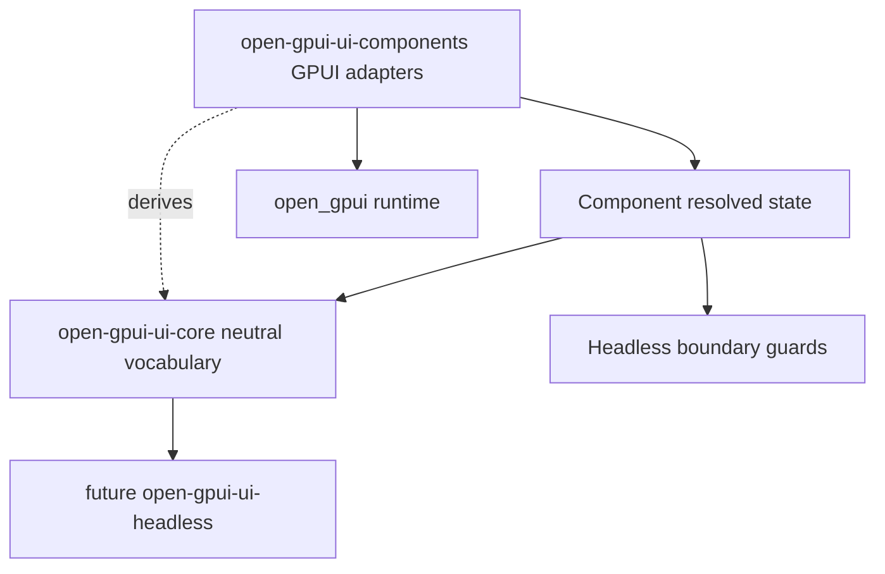

# Open GPUI UI Headless Extraction Prep

## Summary

Prepare the official Open GPUI UI component stack for a future headless behavior crate without
creating that crate yet. The work removes the blockers called out by ADR 0006: GPUI geometry in
public contracts, direct GPUI focus/a11y re-exports, adapter-facing overlay state, and ambiguous
adapter-only APIs such as `TextInputController` and `ScrollHandle`.

---

## Problem Frame

The component catalog now has enough repeated behavior to justify extraction planning. Overlay
policy, roving focus, listbox navigation, scroll viewport intent, and splitter constraints are
already reused across several component families. ADR 0006 still keeps `open-gpui-ui-headless`
deferred because the public boundary is not clean enough: some state types expose GPUI geometry,
`open_gpui_ui_core` re-exports GPUI focus and accessibility types, public overlay state is named
and shaped as a GPUI adapter state, and text editing is currently a concrete GPUI input-handler
adapter.

This plan is the cleanup layer before extraction. It should leave the current crates usable,
reduce future migration cost, and make the next checkpoint a straightforward crate-boundary
decision instead of another mixed audit.

---

## Assumptions

- The active branch is `feat/open-gpui-ui-core`.
- The next correct step is extraction-prep refactoring, not creating `open-gpui-ui-headless`.
- Reference repositories are inputs for boundaries and tests, not runtime dependencies.
- Public API compatibility can be preserved with transitional aliases or adapter-only exports when
  that avoids unnecessary churn.

---

## Requirements

**Boundary visibility**

- R1. Public contract tests must distinguish hard GPUI runtime/render leaks from extraction
  blockers that are being actively migrated.
- R2. New GPUI runtime/render leaks must fail tests instead of being recorded only in docs.
- R3. Extraction blockers that remain after this plan must be explicitly classified as deferred,
  adapter-only, or intentionally retained.

**Neutral vocabulary**

- R4. Geometry used by renderer-neutral state must be represented by `open_gpui_ui_core` value
  types rather than public aliases to `open_gpui::Pixels`, `Point`, `Size`, `Bounds`, or `Edges`.
- R5. Component metrics that are part of resolved state must use the same neutral scalar
  vocabulary or be classified as GPUI adapter metrics.
- R6. Accessibility roles, toggle state, orientation, and semantic actions must be exposed through
  a stable UI-core facade before any future headless crate depends on them.
- R7. Focus intent must stay renderer-neutral, while concrete `FocusHandle` and `Focusable`
  remain adapter-only GPUI concepts.

**Overlay and adapter boundaries**

- R8. Public overlay state must split neutral policy/presence/focus data from GPUI deferred
  priority, snap margin, anchor conversion, and renderer scheduling fields.
- R9. Public component resolved state must expose the neutral overlay state, while adapters can
  derive GPUI adapter state at render time.
- R10. `TextInputController`, externally supplied `ScrollHandle`, `focus_ring_shadow`, GPUI
  callback storage, and `Entity`-based builder APIs must be documented and guarded as adapter-only
  surfaces unless a smaller neutral model is introduced.

**Verification and documentation**

- R11. Existing component and gallery behavior must remain stable while public state types migrate.
- R12. ADR 0006, the component contract, verification docs, and engineering memory must record the
  new boundary and the remaining extraction decision.

---

## Key Technical Decisions

- KTD1. Prep before crate creation: this work should make the current crates extraction-ready, not
  introduce a nominally headless crate that still depends on GPUI shapes.
- KTD2. Owned neutral geometry over aliases: `UiPx`, `UiPoint`, `UiSize`, `UiRect`, and `UiEdges`
  should be Open GPUI UI value types with adapter conversions, not aliases to `open_gpui` types.
- KTD3. Accessibility facade first, exhaustive semantics later: introduce stable role, toggled,
  orientation, and action facades for the roles currently used by components, then extend them as
  components need more AccessKit coverage.
- KTD4. Focus handles stay out of the neutral layer: state can name focus targets and restoration
  intent, but handle allocation, focus movement, and `Focusable` implementations stay in GPUI
  adapters.
- KTD5. Overlay neutral state becomes the public contract: `GpuiOverlayState` should become an
  adapter-derived helper, while components expose a neutral resolved overlay state.
- KTD6. Text editing stays adapter-only for this pass: `TextInputController` should be classified
  as the GPUI single-line input adapter unless implementation reveals a small pure editing model
  worth extracting separately.

---

## High-Level Technical Design

Neutral contracts should flow downward into state and tests. GPUI conversions should flow upward
only inside adapters, gallery rendering, and runtime-owned helpers.

---

## Phased Delivery

| Phase | Units | Outcome |
| --- | --- | --- |
| Audit guard | U1 | Current blockers become test-visible and categorized. |
| Neutral value layer | U2, U3 | Geometry and metrics stop requiring public GPUI geometry types. |
| Semantic facade | U4 | Accessibility and focus contracts stop re-exporting GPUI handles. |
| Overlay split | U5 | Public overlay state becomes neutral; GPUI scheduling stays adapter-owned. |
| Adapter classification | U6 | Text, scroll, focus-ring, and runtime APIs are explicitly adapter-only. |
| Checkpoint | U7 | Docs and memory tell the next agent whether crate extraction is ready. |

---

## Implementation Units

### U1. Extraction Boundary Guard Inventory

**Goal:** Turn ADR 0006 blockers into a repeatable guard that fails new leaks and reports known
migration targets.

**Requirements:** R1, R2, R3

**Dependencies:** None.

**Files:**

- Modify `crates/ui_components/tests/components.rs`
- Add `crates/ui_core/tests/headless_contracts.rs`
- Modify `docs/ui/component-contract.md`
- Modify `docs/verification.md`

**Approach:** Extend the current public-state scan into two categories. Hard forbidden terms cover
GPUI runtime/render/callback leaks and should fail immediately. Extraction blockers cover
`GpuiOverlayState`, GPUI geometry aliases, GPUI accessibility/focus re-exports, `BoxShadow`, and
adapter handles; these should be enumerated with an allowlist that shrinks as later units migrate
them. Add a companion `open-gpui-ui-core` guard so future neutral vocabulary changes do not
silently reintroduce direct GPUI facades.

**Execution note:** Start with characterization tests so later units can reduce the allowlist one
class at a time.

**Patterns to follow:**

- `crates/ui_components/tests/components.rs`
- `docs/adr/0006-open-gpui-ui-headless-extraction-checkpoint.md`
- `docs/ui/component-contract.md`

**Test scenarios:**

- A public resolved-state struct containing `Window`, `App`, `Context<`, `IntoElement`,
  `RenderOnce`, `ElementId`, `Entity<`, `FocusHandle`, `ScrollHandle`, or `Rc<dyn` fails the hard
  leak guard.
- Existing `GpuiOverlayState` and GPUI geometry references are reported as expected extraction
  blockers before U2-U5 migrate them.
- `open_gpui_ui_core::prelude` direct `FocusHandle` and `Focusable` exports are captured as known
  blockers before U4 removes them.
- The guard output or assertion messages name the file and state type so a reviewer can fix the
  leak without rerunning a broad search.

**Verification:** Component and core tests prove the current boundary inventory, and docs describe
which classes are hard failures versus migration blockers.

### U2. Neutral Geometry Types

**Goal:** Add renderer-neutral geometry value types to `open-gpui-ui-core` and migrate overlay
placement inputs away from public GPUI geometry aliases.

**Requirements:** R4, R11

**Dependencies:** U1.

**Files:**

- Add `crates/ui_core/src/geometry.rs`
- Modify `crates/ui_core/src/lib.rs`
- Modify `crates/ui_core/src/prelude.rs`
- Modify `crates/ui_core/src/overlay.rs`
- Modify `crates/ui_core/tests/headless_contracts.rs`
- Modify `crates/ui_components/src/context_menu.rs`
- Modify `crates/ui_components/src/overlay.rs`
- Modify `crates/ui_components/tests/components.rs`
- Modify `examples/ui-foundation-gallery/tests/foundation_gallery.rs` if sample state assertions
  need neutral geometry constructors.

**Approach:** Introduce `UiPx`, `UiPoint`, `UiSize`, `UiRect`, and `UiEdges` as small owned values
inside UI core. Provide explicit conversion helpers at the GPUI adapter boundary, but keep public
overlay APIs expressed in neutral types. Migrate `OverlayAnchorInput`, `OverlayPlacementInput`,
`OverlaySize`, `Rect`, `OverlayEdges`, point anchors, safe bounds, offsets, and context-menu state
to the neutral vocabulary. Keep compatibility constructors only if the migration would otherwise
force unrelated call-site churn.

**Patterns to follow:**

- `crates/ui_core/src/overlay.rs`
- `repo-ref/fret/ecosystem/fret-ui-headless/src/scroll_area.rs`
- `repo-ref/fret/ecosystem/fret-ui-kit/src/imui/facade_support/geometry.rs`

**Test scenarios:**

- `OverlayAnchorInput::from_point` accepts neutral `UiPoint` and computes a 1x1 neutral anchor
  rect.
- `OverlayPlacementInput` preserves side, alignment, offset, content size, safe bounds, and
  preferred anchor bounds using neutral geometry.
- GPUI adapter placement converts neutral input into `Anchor`, `Point<Pixels>`, `Edges<Pixels>`,
  and snap margin without leaking those types back into core state.
- Context-menu state exposes neutral anchor and placement data while render code still positions a
  GPUI context menu correctly.

**Verification:** `open-gpui-ui-core`, component, and gallery tests pass, and the extraction guard
allowlist shrinks for overlay and context-menu geometry.

### U3. Neutral Component Metrics

**Goal:** Migrate public component metrics from GPUI `Pixels` to neutral UI-core geometry, or
explicitly separate metrics that are only GPUI adapter implementation details.

**Requirements:** R5, R11

**Dependencies:** U1, U2.

**Files:**

- Modify `crates/ui_components/src/button.rs`
- Modify `crates/ui_components/src/badge.rs`
- Modify `crates/ui_components/src/checkbox.rs`
- Modify `crates/ui_components/src/dialog.rs`
- Modify `crates/ui_components/src/field.rs`
- Modify `crates/ui_components/src/hover_card.rs`
- Modify `crates/ui_components/src/icon_button.rs`
- Modify `crates/ui_components/src/listbox.rs`
- Modify `crates/ui_components/src/menu.rs`
- Modify `crates/ui_components/src/scroll_area.rs`
- Modify `crates/ui_components/src/select.rs`
- Modify `crates/ui_components/src/sheet.rs`
- Modify `crates/ui_components/src/sidebar.rs`
- Modify `crates/ui_components/src/splitter.rs`
- Modify `crates/ui_components/src/switch.rs`
- Modify `crates/ui_components/src/tabs.rs`
- Modify `crates/ui_components/src/text_input.rs`
- Modify `crates/ui_components/src/toolbar.rs`
- Modify `crates/ui_components/src/tooltip.rs`
- Modify `crates/ui_components/tests/components.rs`
- Modify `docs/ui/component-contract.md`

**Approach:** Convert public metric structs to return neutral `UiPx` values when the values are
part of component resolved state. GPUI adapters should convert those values at render time. If a
visual helper returns a renderer-specific type such as `BoxShadow`, keep it out of resolved state
and classify it as adapter-only. This unit is broad but mechanical; it should avoid changing
component behavior or token decisions.

**Execution note:** Use narrow commits or staged review chunks if the migration touches many files.

**Patterns to follow:**

- `crates/ui_core/src/sizing.rs`
- `crates/ui_components/src/focus.rs`
- `crates/ui_components/src/theme.rs`

**Test scenarios:**

- Representative metrics for button, text input, scroll area, splitter, select, dialog, sidebar,
  and command expose neutral scalar values in public state.
- Render adapters convert neutral metrics to GPUI `Pixels` at the last practical point.
- The public-state guard no longer reports GPUI `Pixels` in migrated metric structs.
- Existing gallery metadata tests still observe the same sizes after conversion.

**Verification:** Component and gallery tests prove no metadata drift, and the blocker allowlist
shrinks for public component metrics.

### U4. Focus and Accessibility Facades

**Goal:** Replace direct GPUI focus and accessibility re-exports from UI core with stable semantic
facades that can move into a future headless crate.

**Requirements:** R6, R7, R11

**Dependencies:** U1, U2.

**Files:**

- Modify `crates/ui_core/src/a11y.rs`
- Modify `crates/ui_core/src/focus.rs`
- Modify `crates/ui_core/src/prelude.rs`
- Modify `crates/ui_core/src/lib.rs`
- Add `crates/ui_components/src/a11y.rs`
- Modify `crates/ui_components/src/lib.rs`
- Modify `crates/ui_components/src/prelude.rs`
- Modify component files that expose `Role`, `Toggled`, `Orientation`, or `AccessibleAction`
- Modify `examples/ui-foundation-gallery/src/pages/focus_a11y.rs`
- Modify `examples/ui-foundation-gallery/src/pages/components.rs`
- Modify `examples/ui-foundation-gallery/tests/foundation_gallery.rs`
- Modify `crates/ui_core/tests/headless_contracts.rs`
- Modify `crates/ui_components/tests/components.rs`

**Approach:** Define UI-core semantic types for the roles, toggled states, orientations, and
actions currently used by official components. Add adapter mapping functions in
`open-gpui-ui-components` for GPUI/AccessKit conversion. Remove `FocusHandle` and `Focusable` from
UI-core public prelude and keep any compatibility exposure under an explicitly GPUI-named adapter
module if needed. State should continue to use stable focus target IDs and focus restoration
intents, not concrete handles.

**Patterns to follow:**

- `crates/gpui/src/gpui.rs`
- `crates/ui_core/src/a11y.rs`
- `crates/ui_core/src/focus.rs`
- `repo-ref/fret/ecosystem/fret-ui-kit/src/imui/button_controls/visual/a11y.rs`
- `repo-ref/fret/ecosystem/fret-ui-kit/src/imui/text_controls/focus.rs`

**Test scenarios:**

- UI-core semantic roles map to the same GPUI roles used before for Button, Switch, Checkbox,
  RadioGroup, Toolbar, Sidebar, Listbox, Select, Combobox, Command, Label, TextInput, and Tabs.
- UI-core no longer exports `FocusHandle` or `Focusable` through `prelude`.
- Components can still render accessibility roles, toggled state, orientation, and actions through
  adapter mapping functions.
- Gallery focus/a11y samples keep the same observable metadata.

**Verification:** Core, component, and gallery tests pass, and the core guard no longer reports
direct GPUI focus/a11y re-export blockers.

### U5. Neutral Overlay State Split

**Goal:** Split neutral overlay resolved state from GPUI adapter scheduling state and migrate
components to expose the neutral half publicly.

**Requirements:** R8, R9, R11

**Dependencies:** U1, U2, U4.

**Files:**

- Modify `crates/ui_core/src/overlay.rs`
- Modify `crates/ui_components/src/overlay.rs`
- Modify `crates/ui_components/src/tooltip.rs`
- Modify `crates/ui_components/src/popover.rs`
- Modify `crates/ui_components/src/dialog.rs`
- Modify `crates/ui_components/src/menu.rs`
- Modify `crates/ui_components/src/context_menu.rs`
- Modify `crates/ui_components/src/alert_dialog.rs`
- Modify `crates/ui_components/src/sheet.rs`
- Modify `crates/ui_components/src/hover_card.rs`
- Modify `crates/ui_components/src/select.rs`
- Modify `crates/ui_components/src/combobox.rs`
- Modify `crates/ui_components/src/command.rs`
- Modify `crates/ui_components/tests/components.rs`
- Modify `examples/ui-foundation-gallery/tests/foundation_gallery.rs`
- Modify `docs/ui/component-contract.md`

**Approach:** Add a neutral overlay state, likely `OverlayResolvedState`, in UI core. It should own
`OverlayLayerPolicy`, `OverlayLayerState`, presence, outside-press policy, Escape policy, initial
focus intent, and focus restoration intent. Keep GPUI deferred priority, snap margin, anchor
conversion, and `Anchor`/`Point<Pixels>` scheduling fields in `GpuiOverlayState` or a renamed
adapter state. Component state accessors should return the neutral state. Render code can derive
the GPUI adapter state using local config.

**Patterns to follow:**

- `crates/ui_core/src/overlay.rs`
- `crates/ui_components/src/overlay.rs`
- `repo-ref/fret/ecosystem/fret-ui-headless/src/presence.rs`
- `repo-ref/fret/ecosystem/fret-ui-kit/src/imui/popup_overlay/menu/policy.rs`
- `repo-ref/fret/ecosystem/fret-ui-kit/src/imui/popup_overlay/modal/state.rs`

**Test scenarios:**

- Tooltip, Popover, Dialog, Menu, ContextMenu, AlertDialog, Sheet, HoverCard, Select, Combobox,
  and Command expose neutral overlay state publicly.
- GPUI adapter state can still provide deferred priority, snap edges, outside-press wiring, and
  render visibility.
- Escape and outside-press policy assertions still pass through the neutral overlay state.
- The public-state guard no longer reports `GpuiOverlayState` inside component resolved state.

**Verification:** Component and gallery overlay tests pass, and ADR 0006 blockers shrink for
overlay state.

### U6. Adapter-Only API Classification

**Goal:** Make GPUI-specific APIs explicit so future extraction does not accidentally treat them as
headless candidates.

**Requirements:** R3, R10, R11

**Dependencies:** U1, U3, U4, U5.

**Files:**

- Modify `crates/ui_components/src/text_input.rs`
- Modify `crates/ui_components/src/scroll_area.rs`
- Modify `crates/ui_components/src/focus.rs`
- Modify `crates/ui_components/src/lib.rs`
- Modify `crates/ui_components/src/prelude.rs`
- Modify `crates/ui_components/tests/components.rs`
- Modify `docs/ui/component-contract.md`
- Modify `docs/verification.md`

**Approach:** Classify `TextInputController`, `TextInput::controller(Entity<TextInputController>)`,
externally supplied `ScrollHandle`, `focus_ring_shadow`, and GPUI rendering helpers as adapter-only
surfaces. Prefer doc comments, adapter-named modules, and public export grouping over disruptive
renames unless implementation shows a rename is low-risk. If a pure single-line editing helper is
obvious, keep it smaller than `TextInputController` and do not make it depend on GPUI input handler
types.

**Patterns to follow:**

- `crates/ui_components/src/text_input.rs`
- `crates/ui_components/src/scroll_area.rs`
- `crates/ui_components/src/focus.rs`
- `docs/knowledge/engineering/subagents/text-input-controller-research.md`
- `repo-ref/gpui-component/crates/ui/src/input/state.rs`
- `repo-ref/fret/ecosystem/fret-ui-headless/src/text_assist.rs`

**Test scenarios:**

- `TextInputState` remains renderer-neutral while `TextInputController` is classified as GPUI
  adapter-owned.
- Combobox and Command can continue using `TextInputController` without exposing it through nested
  resolved state.
- `ScrollAreaState` remains neutral while externally supplied `ScrollHandle` is documented and
  guarded as adapter-owned.
- The public export smoke test still covers adapter-only APIs intentionally exported for GPUI
  component users.

**Verification:** Component tests prove text input, combobox, command, and scroll area behavior
remain stable, and docs distinguish neutral state from adapter APIs.

### U7. Extraction Prep Checkpoint

**Goal:** Record whether the current crates are ready for an actual `open-gpui-ui-headless`
extraction plan.

**Requirements:** R3, R11, R12

**Dependencies:** U1, U2, U3, U4, U5, U6.

**Files:**

- Modify `docs/adr/0006-open-gpui-ui-headless-extraction-checkpoint.md`
- Add `docs/adr/0007-open-gpui-ui-headless-extraction-plan.md` only if the final checkpoint
  clears the extraction gate.
- Modify `docs/ui/component-contract.md`
- Modify `docs/verification.md`
- Modify `docs/knowledge/engineering/current-state.md`
- Modify `docs/knowledge/engineering/log.md`
- Modify `crates/ui_core/tests/headless_contracts.rs`
- Modify `crates/ui_components/tests/components.rs`

**Approach:** Re-run the extraction guard inventory after the migration units. If remaining
blockers are only adapter-only surfaces and intentionally deferred behavior, update ADR 0006 and
write a narrow ADR 0007 or plan for creating `open-gpui-ui-headless`. If core public contracts
still expose GPUI-specific types, update ADR 0006 with the remaining blockers and defer crate
creation again.

**Patterns to follow:**

- `docs/adr/0006-open-gpui-ui-headless-extraction-checkpoint.md`
- `docs/plans/2026-06-16-002-feat-ui-shell-choice-headless-series-plan.md`
- `docs/knowledge/engineering/current-state.md`

**Test scenarios:**

- The final guard has no hard runtime/render leaks in public resolved state.
- The extraction blocker allowlist is empty or contains only documented adapter-only public APIs.
- Docs identify which behavior helpers can move first: overlay policy, roving focus, listbox
  navigation, scroll viewport intent, splitter constraints, and neutral geometry.
- Docs do not imply that `open-gpui-ui-headless` exists before the crate is actually created.

**Verification:** Core, component, gallery, and diff checks pass, and the checkpoint clearly
states whether to start a crate-extraction plan next.

---

## Scope Boundaries

### Active Scope

- Headless extraction blocker guard coverage.
- Neutral geometry and metrics vocabulary.
- UI-core accessibility and focus facades.
- Neutral overlay state split.
- Adapter-only classification for GPUI text, scroll, focus, and render helpers.
- Documentation, verification, and engineering memory updates needed for the checkpoint.

### Deferred to Follow-Up Work

- Creating `open-gpui-ui-headless`.
- Extracting behavior helpers into a new crate.
- Full focus-trap traversal, nested focus scopes, and submenu focus arbitration.
- Multiline text input, password input, undo/redo, completion, IME-heavy editor behavior, and
  rich text editing.
- Data-heavy widgets such as table, tree, virtual list, and app command registry integration.
- Replacing every GPUI visual rendering helper if it is not part of public resolved state.

### Outside This Plan

- Canvas, docking, editor, markdown, Tree-sitter, LSP, chart, and webview features.
- Runtime theme registry, user theme file schema, hot reload, and app-wide theme persistence.
- Copying Fret, shadcn, Radix, React Aria, or `gpui-component` implementations wholesale.

---

## System-Wide Impact

This plan touches the public API surface of `open-gpui-ui-core` and
`open-gpui-ui-components`. The intended result is a cleaner boundary, but downstream code that
imports GPUI re-export aliases from UI core may need compatibility aliases or small migrations.
Gallery samples and component tests should remain behaviorally stable; most user-visible change
should be in type names and boundary documentation.

---

## Risks and Dependencies

| Risk | Impact | Mitigation |
| --- | --- | --- |
| Geometry migration becomes a broad mechanical churn | Review quality drops across many metric structs | Split U2 and U3, keep behavior unchanged, and use guard allowlist reductions as the review signal. |
| Neutral a11y facade lags GPUI/AccessKit capability | Components lose semantic coverage during mapping | Start with roles and states already used by components, then fail tests if mappings drift. |
| Overlay split duplicates policy state | Components and adapters disagree on dismissal behavior | Make GPUI adapter state derived from neutral overlay state instead of independently resolved. |
| Adapter-only classification hides a useful headless model | Future extraction has less reusable text/scroll behavior | Record deferred candidates explicitly and only factor out pure helpers with small stable APIs. |
| Compatibility aliases keep old leaks alive | Extraction readiness remains ambiguous | Guard aliases as adapter-only or deprecated, and require ADR 0006 to name any alias that remains. |

---

## Documentation and Operational Notes

Update `docs/ui/component-contract.md` during each unit that changes public component state. Keep
`docs/verification.md` focused on observable gallery and test commands rather than implementation
churn. Engineering memory should be updated after the checkpoint and after any commit that changes
the extraction decision.

---

## Sources and Research

- `docs/adr/0005-open-gpui-official-component-architecture.md`
- `docs/adr/0006-open-gpui-ui-headless-extraction-checkpoint.md`
- `docs/plans/2026-06-16-002-feat-ui-shell-choice-headless-series-plan.md`
- `docs/ui/component-contract.md`
- `docs/verification.md`
- `docs/knowledge/engineering/current-state.md`
- `docs/knowledge/engineering/subagents/ui-component-roadmap-reference-research.md`
- `docs/knowledge/engineering/subagents/text-input-controller-research.md`
- `crates/ui_core/src/overlay.rs`
- `crates/ui_core/src/a11y.rs`
- `crates/ui_core/src/focus.rs`
- `crates/ui_core/src/prelude.rs`
- `crates/ui_components/src/overlay.rs`
- `crates/ui_components/tests/components.rs`
- `repo-ref/fret/ecosystem/fret-ui-headless/README.md`
- `repo-ref/fret/ecosystem/fret-ui-headless/src/lib.rs`
- `repo-ref/fret/ecosystem/fret-ui-headless/src/roving_focus.rs`
- `repo-ref/fret/ecosystem/fret-ui-headless/src/scroll_area.rs`
- `repo-ref/fret/ecosystem/fret-ui-kit/src/headless/dismissible_layer.rs`
- `repo-ref/fret/ecosystem/fret-ui-kit/src/headless/focus_scope.rs`
- `repo-ref/gpui-component/crates/ui/src/input/state.rs`
