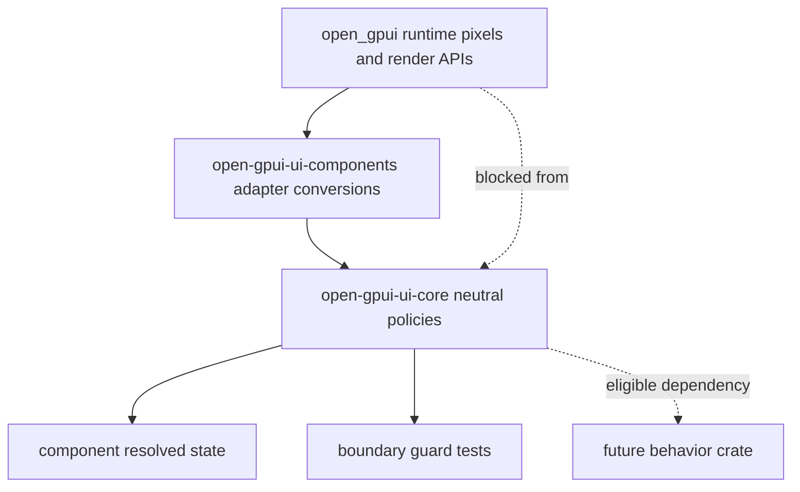
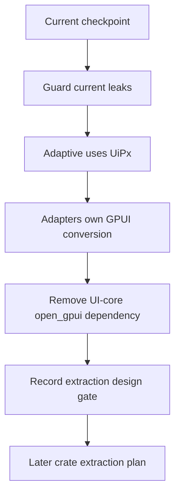

# Open GPUI UI Core Headless Boundary Gate

## Summary

Make `open-gpui-ui-core` strictly renderer-neutral before any behavior crate is created. This plan
removes the remaining GPUI dependency path through adaptive viewport pixels and `UiPx` style
conversions, moves GPUI conversion to adapter code, and records a crate-creation gate for the next
extraction series.

---

## Problem Frame

ADR 0006 deferred `open-gpui-ui-headless` because the component resolved-state blockers were gone
but `open-gpui-ui-core` still had two GPUI-specific boundary leaks. `adaptive.rs` imports
`open_gpui::{Pixels as Px, px}`, and `geometry.rs` implements `From<UiPx>` for GPUI style length
types. Those conveniences make the current GPUI component adapter concise, but they prevent UI core
from being a clean dependency for a future behavior crate or a non-GPUI adapter.

The next series should therefore tighten the core boundary before moving behavior into a new crate.
The goal is not to create `open-gpui-ui-headless` yet; it is to make that later step reviewable by
leaving no hidden GPUI dependency in the neutral foundation layer.

---

## Requirements

**Strict core boundary**

- R1. `open-gpui-ui-core` must not depend on `open_gpui` after the boundary migration is complete.
- R2. Adaptive policies and snapshots must use `UiPx` and neutral edge types rather than GPUI
  `Pixels` aliases.
- R3. `UiPx` and related geometry types must not implement conversions to GPUI style or geometry
  types inside UI core.

**Adapter conversion**

- R4. GPUI render code must convert `UiPx`, `UiPoint`, and `UiSize` at the adapter boundary with
  explicit helpers.
- R5. Public component resolved state must remain unchanged in behavior and continue to expose
  neutral metrics, overlay state, focus intent, and accessibility vocabulary.

**Guard and documentation**

- R6. Boundary tests must fail on any new `open_gpui` source reference or dependency inside
  `open-gpui-ui-core`.
- R7. The extraction checkpoint must document the first behavior candidates and keep actual crate
  creation deferred until a follow-up plan.
- R8. Verification docs, component contract docs, gallery checkpoint tests, and engineering memory
  must agree on the strict boundary status.

---

## Key Technical Decisions

- KTD1. UI core becomes dependency-clean before extraction: removing `open_gpui` from
  `open-gpui-ui-core` is the gate that makes a future behavior crate meaningful.
- KTD2. Adaptive layout uses `UiPx`: viewport and container widths enter UI core as neutral logical
  pixels, while GPUI windows convert their concrete `Pixels` values before calling adaptive policy
  helpers.
- KTD3. GPUI style conversion is explicit adapter work: render code should call adapter helpers
  rather than relying on `From<UiPx>` implementations in the neutral crate.
- KTD4. No behavior crate in this series: this plan prepares the boundary and records extraction
  candidates, leaving crate creation and module moves to the next plan.
- KTD5. The first extraction candidates are deterministic behavior modules: overlay policy,
  roving focus, listbox navigation, scroll viewport intent, and splitter constraints can move later
  because they already have window-free or resolved-state tests.
- KTD6. GPUI adapter APIs stay out of the candidate set: `TextInputController`, `ScrollHandle`,
  `focus_ring_shadow`, concrete overlay scheduling helpers, focus handles, AccessKit wiring, and
  render trees remain in `open-gpui-ui-components`.

---

## High-Level Technical Design

The strict boundary is directional: runtime data may be translated into neutral values before
entering UI core, but UI core should not import runtime types or provide runtime conversion impls.

This series stops at the design gate. The later extraction plan should start only after the guard
proves `open-gpui-ui-core` is free of GPUI source and dependency references.

---

## Phased Delivery

| Phase | Units | Outcome |
| --- | --- | --- |
| Boundary inventory | U1 | The two remaining core leaks are test-visible before migration. |
| Neutral adaptive policy | U2 | Adaptive width policy uses `UiPx` and keeps gallery behavior stable. |
| Adapter conversion migration | U3 | Component render code converts neutral geometry explicitly. |
| Strict dependency closure | U4 | UI core no longer depends on `open_gpui`. |
| Extraction design checkpoint | U5 | ADRs and contracts describe the next behavior extraction target. |
| Durable handoff | U6 | Verification docs, gallery checkpoint, and memory match the new boundary. |

---

## Implementation Units

### U1. Strict Boundary Guard Inventory

**Goal:** Expand boundary tests so the remaining `open_gpui` dependency paths are visible before
they are removed.

**Requirements:** R1, R3, R6

**Dependencies:** None.

**Files:**

- Modify `crates/ui_core/tests/headless_contracts.rs`
- Modify `crates/ui_components/tests/components.rs`
- Modify `docs/verification.md`

**Approach:** Extend the UI-core guard beyond public geometry blocker tokens. It should inventory
source references to `open_gpui`, GPUI style conversion impls for `UiPx`, and the package
dependency in `crates/ui_core/Cargo.toml`. Keep the initial allowlist limited to the current
`adaptive.rs` import and `geometry.rs` conversion impls so U2 and U3 can shrink it deliberately.
Keep component guard coverage focused on public resolved state and adapter-only exports.

**Execution note:** Start with characterization coverage so later units prove the allowlist shrinks
for the intended reason.

**Patterns to follow:**

- `crates/ui_core/tests/headless_contracts.rs`
- `crates/ui_components/tests/components.rs`
- `docs/verification.md`

**Test scenarios:**

- A new `open_gpui::` source reference in any UI-core module fails the strict boundary inventory
  unless it is explicitly allowlisted for this migration.
- `impl From<UiPx> for open_gpui::*` is reported as a boundary blocker before U3 removes it.
- The UI-core package dependency on `open_gpui` is reported as a blocker before U4 removes it.
- Component adapter-only public exports continue to pass their existing allowlist and are not
  reclassified as neutral contracts.

**Verification:** The guard reports the two known UI-core blocker classes and no unexpected
component resolved-state leaks.

### U2. Neutral Adaptive Policy

**Goal:** Move adaptive layout policies from GPUI `Pixels` to neutral `UiPx`.

**Requirements:** R2, R5, R6

**Dependencies:** U1.

**Files:**

- Modify `crates/ui_core/src/adaptive.rs`
- Modify `crates/ui_core/src/prelude.rs` if exports need adjustment
- Modify `crates/ui_core/tests/headless_contracts.rs`
- Modify `examples/ui-foundation-gallery/src/shell.rs`
- Modify `examples/ui-foundation-gallery/src/pages/adaptive.rs`
- Modify `examples/ui-foundation-gallery/tests/foundation_gallery.rs`

**Approach:** Replace `Pixels as Px` and `px()` defaults with `UiPx` and `ui_px()`. GPUI gallery
and component code that starts from concrete viewport width should convert to `UiPx` before calling
`DeviceAdaptivePolicy`, `DeviceShellSwitchPolicy`, `PanelAdaptivePolicy`, or
`device_adaptive_snapshot`. Keep public adaptive names stable unless implementation shows a
compatibility alias is required.

**Patterns to follow:**

- `crates/ui_core/src/geometry.rs`
- `crates/ui_core/src/adaptive.rs`
- `examples/ui-foundation-gallery/src/shell.rs`

**Test scenarios:**

- Device adaptive threshold defaults classify compact, regular, and expanded widths using `UiPx`.
- Reversed regular/expanded thresholds still normalize to compact, regular, and expanded classes.
- Desktop/mobile shell switching uses a neutral `UiPx` threshold and preserves the gallery compact
  versus desktop shell behavior.
- Panel adaptive classification uses `UiPx` and preserves compact, medium, and wide outcomes.
- The UI-core extraction blocker allowlist no longer includes `Pixels as Px`.

**Verification:** Adaptive core tests and gallery metadata tests prove the same adaptive behavior
without GPUI pixel types in UI core.

### U3. Adapter-Owned Style Conversion

**Goal:** Remove GPUI style conversion impls from `UiPx` and migrate render sites to explicit
adapter conversions.

**Requirements:** R3, R4, R5, R6

**Dependencies:** U1, U2.

**Files:**

- Modify `crates/ui_core/src/geometry.rs`
- Modify `crates/ui_components/src/geometry.rs`
- Modify `crates/ui_components/src/alert_dialog.rs`
- Modify `crates/ui_components/src/badge.rs`
- Modify `crates/ui_components/src/button.rs`
- Modify `crates/ui_components/src/checkbox.rs`
- Modify `crates/ui_components/src/combobox.rs`
- Modify `crates/ui_components/src/command.rs`
- Modify `crates/ui_components/src/context_menu.rs`
- Modify `crates/ui_components/src/dialog.rs`
- Modify `crates/ui_components/src/field.rs`
- Modify `crates/ui_components/src/hover_card.rs`
- Modify `crates/ui_components/src/icon_button.rs`
- Modify `crates/ui_components/src/label.rs`
- Modify `crates/ui_components/src/listbox.rs`
- Modify `crates/ui_components/src/menu.rs`
- Modify `crates/ui_components/src/popover.rs`
- Modify `crates/ui_components/src/radio.rs`
- Modify `crates/ui_components/src/scroll_area.rs`
- Modify `crates/ui_components/src/select.rs`
- Modify `crates/ui_components/src/sheet.rs`
- Modify `crates/ui_components/src/sidebar.rs`
- Modify `crates/ui_components/src/splitter.rs`
- Modify `crates/ui_components/src/switch.rs`
- Modify `crates/ui_components/src/tabs.rs`
- Modify `crates/ui_components/src/text_input.rs`
- Modify `crates/ui_components/src/toggle.rs`
- Modify `crates/ui_components/src/toolbar.rs`
- Modify `crates/ui_components/src/tooltip.rs`
- Modify `crates/ui_components/tests/components.rs`
- Modify `examples/ui-foundation-gallery/src/shell.rs`

**Approach:** Remove the `From<UiPx>` impls for GPUI `Pixels`, `DefiniteLength`,
`AbsoluteLength`, and `Length` from UI core. Extend the existing component adapter conversion
helpers so render code can convert `UiPx`, `UiPoint`, and `UiSize` explicitly before passing them
to GPUI style APIs. The migration is mechanical but broad: public `*Metrics` and `*State` values
should stay neutral, while `.h`, `.w`, `.px`, `.py`, `.rounded`, `.text_size`, `.line_height`,
`.scrollbar_width`, overlay placement, and input style calls become adapter-boundary conversions.

**Patterns to follow:**

- `crates/ui_components/src/geometry.rs`
- `crates/ui_components/src/overlay.rs`
- `examples/ui-foundation-gallery/src/shell.rs`

**Test scenarios:**

- `UiPx` no longer implements conversion traits for GPUI style types inside UI core.
- Button, Switch, TextInput, Listbox, Select, Dialog, ScrollArea, Splitter, Toolbar, and Sidebar
  still expose the same neutral metric values through public state.
- Representative component states keep the same accessibility vocabulary and focus intent after the
  conversion migration: controls preserve disabled, pressed, selected, checked, and focused
  semantics; selection surfaces preserve open, empty, active, and selected semantics; overlays
  preserve modal, placement, Escape, outside-press, initial-focus, and restore-focus semantics.
- The broad migration is checked against a lightweight state matrix rather than only default-state
  rendering: controls cover default/focused/disabled/active-or-checked branches; selection surfaces
  cover open/closed/empty/selected branches; inputs cover empty/focused/invalid/disabled branches;
  overlays cover open/closed/placement branches; scroll and splitter cover boundary states.
- Focus ring rendering still paints the same GPUI shadow while `FocusRing::width()` remains
  neutral.
- Component render sites compile only after using explicit adapter conversion helpers for neutral
  geometry values.
- Gallery pages that render neutral geometry continue to compile and display the same metadata.

**Verification:** Component and gallery checks prove no resolved-state behavior changed while the
implicit style conversion path disappeared from UI core.

### U4. Strict UI-Core Dependency Closure

**Goal:** Remove the `open_gpui` dependency from UI core and tighten the boundary guard to fail on
any reintroduction.

**Requirements:** R1, R6, R8

**Dependencies:** U2, U3.

**Files:**

- Modify `crates/ui_core/Cargo.toml`
- Modify `crates/ui_core/src/lib.rs`
- Modify `crates/ui_core/tests/headless_contracts.rs`
- Modify `docs/verification.md`

**Approach:** Delete `open_gpui.workspace = true` from UI core once U2 and U3 remove source usage.
Update crate-level docs so UI core is described as neutral foundation vocabulary rather than a
GPUI-adjacent convenience layer. Tighten the guard from a shrinking allowlist to an empty strict
boundary: no `open_gpui` dependency, no `open_gpui::` source references, no `Pixels as Px`, and no
GPUI conversion impls for neutral geometry.

**Patterns to follow:**

- `crates/ui_core/Cargo.toml`
- `crates/ui_core/tests/headless_contracts.rs`
- `docs/adr/0006-open-gpui-ui-headless-extraction-checkpoint.md`

**Test scenarios:**

- UI-core package metadata no longer declares `open_gpui` as a dependency.
- UI-core source contains no uncommented `open_gpui` references.
- The extraction blocker inventory for UI core becomes empty.
- Component and gallery crates still depend on `open_gpui` for concrete rendering and continue to
  build against the neutral UI-core API.

**Verification:** Focused core, component, and gallery checks prove UI core is dependency-clean and
the GPUI adapters still render through explicit conversions.

### U5. Behavior Extraction Design Checkpoint

**Goal:** Record the post-boundary extraction design without creating the behavior crate.

**Requirements:** R7, R8

**Dependencies:** U4.

**Files:**

- Modify `docs/adr/0006-open-gpui-ui-headless-extraction-checkpoint.md`
- Add `docs/adr/0007-open-gpui-ui-headless-boundary-design.md`
- Modify `docs/ui/component-contract.md`
- Modify `docs/verification.md`
- Modify `examples/ui-foundation-gallery/tests/foundation_gallery.rs`

**Approach:** Update ADR 0006 so the two former core blockers are no longer described as current
when U4 passes. Add ADR 0007 as a design gate, not a crate-creation ADR. It should name the first
behavior candidates, their current homes, the adapter APIs that must not move, and the conditions
for a later plan to create `open-gpui-ui-headless` or a more accurately named behavior crate.
Keep the design narrow enough that a future implementer can move one module family at a time. ADR
0007 should include an interaction ownership table for each candidate family: extractable state
machine or policy, adapter APIs that must stay in `open-gpui-ui-components`, keyboard and focus
responsibility, accessibility semantic responsibility, and the existing tests that protect that
boundary. In particular, AccessKit node wiring remains adapter-owned while neutral semantic state
and vocabulary can be behavior-owned when the tests already prove it without GPUI runtime access.

**Patterns to follow:**

- `docs/adr/0006-open-gpui-ui-headless-extraction-checkpoint.md`
- `docs/plans/2026-06-17-001-refactor-ui-headless-extraction-prep-plan.md`
- `repo-ref/fret/ecosystem/fret-ui-headless/src/lib.rs`
- `repo-ref/fret/ecosystem/fret-ui-headless/src/roving_focus.rs`
- `repo-ref/fret/ecosystem/fret-ui-headless/src/presence.rs`

**Test scenarios:**

- The gallery checkpoint test proves ADR 0006 no longer cites adaptive `Pixels as Px` or `UiPx`
  GPUI conversion impls as active blockers after they are removed.
- The checkpoint test proves ADR 0007 exists and states that no behavior crate is created in this
  series.
- ADR 0007 identifies overlay policy, roving focus, listbox navigation, scroll viewport intent,
  and splitter constraints as first extraction candidates.
- ADR 0007 excludes GPUI render trees, focus handles, AccessKit node wiring, `ScrollHandle`,
  `TextInputController`, `focus_ring_shadow`, and GPUI overlay scheduling helpers.
- ADR 0007 contains an interaction ownership matrix that separates behavior-owned policy/state
  from GPUI-owned rendering, focus handles, concrete event wiring, and AccessKit node wiring.
- The matrix cites at least one existing test entry point for each first extraction candidate so a
  later crate move starts from executable behavior evidence rather than prose alone.

**Verification:** Documentation and gallery checkpoint tests agree on the post-boundary extraction
state and the deferred crate creation decision.

### U6. Verification and Durable Memory Update

**Goal:** Make the new boundary durable for future agents and reviewers.

**Requirements:** R6, R8

**Dependencies:** U1, U2, U3, U4, U5.

**Files:**

- Modify `docs/verification.md`
- Modify `docs/ui/component-contract.md`
- Modify `docs/knowledge/engineering/current-state.md`
- Modify `docs/knowledge/engineering/log.md`
- Modify `crates/ui_core/tests/headless_contracts.rs`
- Modify `crates/ui_components/tests/components.rs`
- Modify `examples/ui-foundation-gallery/tests/foundation_gallery.rs`

**Approach:** Update verification guidance so future UI core changes know that `open_gpui` is not
allowed in the neutral crate. Keep component docs explicit that GPUI helpers remain public only for
concrete adapter users. Record the completed boundary work in engineering memory and point the next
series at actual behavior extraction planning.

**Patterns to follow:**

- `docs/knowledge/engineering/current-state.md`
- `docs/knowledge/engineering/log.md`
- `docs/verification.md`
- `docs/ui/component-contract.md`

**Test scenarios:**

- The final core guard has an empty blocker allowlist.
- The component adapter-only export guard still lists only intentional GPUI helper surfaces.
- The gallery checkpoint test confirms the strict boundary decision and deferred crate creation.
- Documentation contains no stale statement that adaptive `Pixels as Px` or UI-core `UiPx` GPUI
  conversions are still active blockers.

**Verification:** The focused UI core, component, gallery, and diff checks pass, and the working
tree contains only the intended boundary and documentation changes.

---

## Scope Boundaries

### Active Scope

- Removing GPUI dependency and source references from `open-gpui-ui-core`.
- Migrating adaptive policy to neutral `UiPx`.
- Moving neutral-to-GPUI conversions into component and gallery adapter code.
- Tightening boundary guard tests around UI-core source, package dependencies, and conversion impls.
- Writing a design checkpoint for future behavior extraction.

### Deferred to Follow-Up Work

- Creating `open-gpui-ui-headless` or any new behavior crate.
- Moving overlay, roving-focus, listbox, scroll, or splitter modules into a new crate.
- Renaming public component crates or publishing new packages.
- Adding full focus-trap traversal, nested focus scopes, submenu focus arbitration, or cross-window
  overlay runtime.
- Extracting a renderer-neutral text editing model from `TextInputController`.
- Designing non-GPUI adapters for another UI framework.

### Outside This Plan

- Visual redesign of components or gallery samples.
- Theme registry, user theme schema, hot reload, or app-level theme persistence.
- Canvas, docking, markdown, editor, chart, LSP, Tree-sitter, and webview features.
- Copying Fret, Radix, React Aria, shadcn, DaisyUI, or `gpui-component` implementations wholesale.

---

## System-Wide Impact

This plan changes a public foundation crate boundary. UI-core users that relied on implicit
`UiPx` conversion into GPUI style APIs will need to convert through the concrete adapter layer
instead. The official component crate absorbs that migration internally, so application code using
official components should see little or no behavioral change. Future crates gain a clearer
dependency path because they can consume UI core without pulling in the GPUI runtime.

---

## Risks and Dependencies

| Risk | Impact | Mitigation |
| --- | --- | --- |
| Style conversion churn hides behavior regressions | Reviewers may miss real component changes in broad mechanical edits | Keep public state tests unchanged and use representative component/gallery assertions as the behavior signal. |
| Removing implicit `UiPx` conversion makes render code noisy | Adapter code may become harder to scan | Centralize conversion helpers in component adapter modules and keep public state neutral. |
| UI core still depends on GPUI through an overlooked path | Future extraction starts from a false-clean boundary | Scan both source and `Cargo.toml`, not only public type names. |
| ADR 0007 becomes a disguised crate-creation plan | The team may start moving modules before the boundary lands | State that this series stops at the design gate and leaves crate creation to a follow-up plan. |
| Compatibility consumers rely on UI-core GPUI conversions | Downstream code may need migration | Document the change as adapter-boundary cleanup and keep official component APIs stable. |

---

## Documentation and Operational Notes

The final documentation should make one distinction clear: UI core is neutral, while
`open-gpui-ui-components` is the concrete GPUI adapter crate. Adapter-only helpers may remain public
for GPUI applications, but they should be grouped and documented as outside any future headless
contract.

---

## Sources and Research

- `docs/adr/0005-open-gpui-official-component-architecture.md`
- `docs/adr/0006-open-gpui-ui-headless-extraction-checkpoint.md`
- `docs/plans/2026-06-17-001-refactor-ui-headless-extraction-prep-plan.md`
- `docs/ui/component-contract.md`
- `docs/verification.md`
- `docs/knowledge/engineering/current-state.md`
- `docs/knowledge/engineering/log.md`
- `docs/knowledge/engineering/subagents/ui-component-roadmap-reference-research.md`
- `docs/knowledge/engineering/subagents/text-input-controller-research.md`
- `crates/ui_core/Cargo.toml`
- `crates/ui_core/src/adaptive.rs`
- `crates/ui_core/src/geometry.rs`
- `crates/ui_core/src/overlay.rs`
- `crates/ui_core/tests/headless_contracts.rs`
- `crates/ui_components/src/geometry.rs`
- `crates/ui_components/src/roving_focus.rs`
- `crates/ui_components/src/listbox.rs`
- `crates/ui_components/src/scroll_area.rs`
- `crates/ui_components/src/splitter.rs`
- `crates/ui_components/src/overlay.rs`
- `crates/ui_components/tests/components.rs`
- `examples/ui-foundation-gallery/src/shell.rs`
- `examples/ui-foundation-gallery/tests/foundation_gallery.rs`
- `repo-ref/fret/ecosystem/fret-ui-headless/src/lib.rs`
- `repo-ref/fret/ecosystem/fret-ui-headless/src/roving_focus.rs`
- `repo-ref/fret/ecosystem/fret-ui-headless/src/presence.rs`
- `repo-ref/fret/ecosystem/fret-ui-headless/src/scroll_area.rs`
