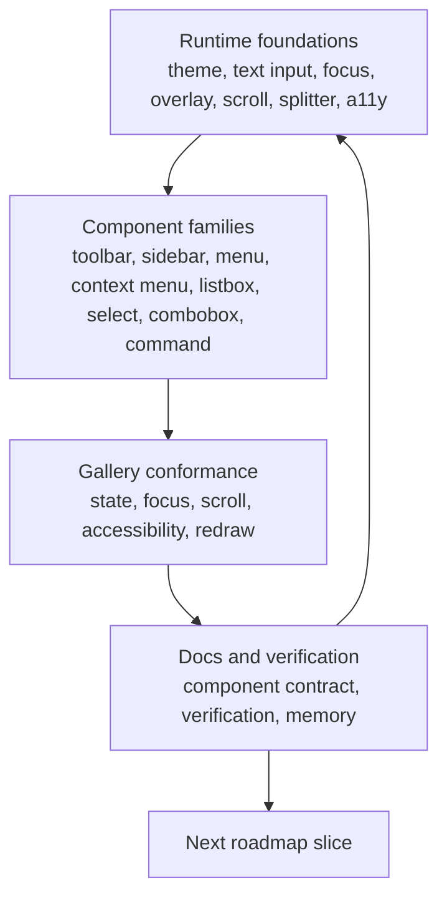

# Open GPUI UI Component Productization Roadmap

## Summary

Treat the current Open GPUI UI crates as the product surface, not a staging area for a later
headless split. The next phase should finish the runtime and interaction foundations that
self-drawn components depend on, then harden the existing shell/navigation and choice/search
families, with gallery conformance and documentation as the release gate.

`open-gpui-ui-headless` stays out of active scope in this roadmap.

---

## Problem Frame

The component catalog is already broad enough to be useful, but the remaining risk is consistency,
not breadth. The expensive seams are the ones that every component leans on: theme resolution,
editable text, focus and overlay behavior, scroll and resize behavior, and accessibility wiring.

The current docs still carry headless-extraction language from the earlier boundary work. That is
useful history, but it should no longer steer the next roadmapped work. The next phase should make
the current crates feel like the canonical Open GPUI component system: stable enough to ship,
well-documented enough to consume, and explicit enough about where GPUI adapters still own
framework-specific behavior.

---

## Requirements

- R1. The roadmap must keep the current crates as the product boundary and not introduce a
  standalone `open-gpui-ui-headless` crate in this roadmap.
- R2. Runtime foundations that affect every component must be finished before more surface area is
  added: theme snapshots, editable text, focus and overlay behavior, scroll viewports, splitter
  constraints, and accessibility mapping.
- R3. Resolved state must remain renderer-neutral, and GPUI-specific behavior must stay explicit as
  adapter-owned infrastructure rather than hidden product state.
- R4. Shell/navigation and choice/search families must continue to converge on shared behavior
  contracts instead of diverging per component.
- R5. Gallery pages, docs, and verification must stay the quality gate for every slice.
- R6. Reference repositories may inform taxonomy, behavior shape, and manual test coverage, but
  they must not become runtime dependencies or wholesale copy targets.

---

## Key Technical Decisions

- **Keep the current crates as the product:** the roadmap should optimize the current package
  layout, not a future headless extraction that is no longer active.
- **Close foundation debt first:** theme, text input, focus, overlay, scroll, splitter, and
  accessibility behavior should be treated as shared infrastructure that every later slice depends
  on.
- **Use the gallery as a release gate:** a slice is not done when it compiles; it is done when the
  gallery and verification docs can prove the intended behavior.
- **Keep adapters explicit:** GPUI-specific helpers may remain public, but they should be clearly
  classified as adapter surfaces rather than drifting into resolved state.
- **Use prior art as input only:** `gpui-component`, `fret`, and `fret-ui-shadcn` are good
  references for taxonomy and edge cases, but the Open GPUI API should stay its own shape.

---

## High-Level Technical Design

The loop is deliberate. Foundations make the families stable, the gallery proves the families, and
the docs and memory keep the next slice honest.

---

## Implementation Units

### U1. Recenter the roadmap on productization

**Goal:** Rewrite the roadmap, checkpoint docs, and engineering memory so the active story is
current-crate productization rather than headless extraction.

**Requirements:** R1, R5, R6

**Dependencies:** None.

**Files:**

- Modify `docs/plans/2026-06-15-004-feat-ui-component-roadmap-plan.md`
- Modify `docs/plans/2026-06-16-002-feat-ui-shell-choice-headless-series-plan.md`
- Add `docs/adr/0008-open-gpui-ui-component-productization-roadmap.md`
- Modify `docs/adr/0006-open-gpui-ui-headless-extraction-checkpoint.md` only to cross-reference the
  new productization decision.
- Modify `docs/adr/0007-open-gpui-ui-headless-boundary-design.md` only to cross-reference the new
  productization decision.
- Modify `docs/ui/component-contract.md`
- Modify `docs/verification.md`
- Modify `docs/knowledge/engineering/current-state.md`
- Modify `docs/knowledge/engineering/log.md`

**Approach:** Add a new accepted ADR that records the current-crate productization decision, then
update living roadmap language so runtime foundations, family hardening, and gallery conformance
are the active phases. Preserve ADR 0006 and ADR 0007 as historical boundary decisions, with only a
small cross-reference to the newer productization decision. Align the memory docs with the new
priority so the next agent resumes from the productization story rather than the extraction story.

**Patterns to follow:**

- Existing roadmap and series-plan structure
- Current ADR language in `docs/adr/0005-open-gpui-official-component-architecture.md`
- Current memory format in `docs/knowledge/engineering/current-state.md` and `docs/knowledge/engineering/log.md`
- Current contract and verification docs

**Test scenarios:**

- Test expectation: none -- documentation-only unit.
- The new productization ADR records why headless extraction is not the active roadmap.
- The roadmap summary no longer frames headless extraction as the active next step.
- The active scope names current crates, runtime foundations, component families, gallery
  conformance, and docs as the forward path.
- The engineering memory documents point the next work at productization instead of a separate
  headless crate.

**Verification:** A reviewer can read the updated docs once and see the new roadmap without
headless extraction taking center stage.

### U2. Finish runtime foundations for self-drawn behavior

**Goal:** Close the remaining theme, text input, and semantic-state gaps that every component
depends on.

**Requirements:** R2, R3

**Dependencies:** U1.

**Files:**

- Modify `crates/ui_components/src/theme.rs`
- Modify `crates/ui_components/src/color.rs`
- Modify `crates/ui_components/src/text_input.rs`
- Modify `crates/ui_components/src/a11y.rs`
- Modify `examples/ui-foundation-gallery/src/pages/tokens.rs`
- Modify `examples/ui-foundation-gallery/src/pages/components.rs`
- Modify `examples/ui-foundation-gallery/tests/foundation_gallery.rs`
- Modify `docs/ui/component-contract.md`
- Modify `docs/verification.md`

**Approach:** Keep the runtime theme table small but real, with explicit mode and revision metadata
that can drive component color resolution. Keep the editable text path as the canonical
single-line input surface, with GPUI input handling owned by the adapter and UTF-16, marked-text,
and grapheme behavior covered by tests. Keep accessibility state neutral in resolved state and let
the adapter own concrete relationship wiring.

**Patterns to follow:**

- `crates/ui_components/src/theme.rs`
- `crates/ui_components/src/text_input.rs`
- `crates/ui_core/src/a11y.rs`
- `repo-ref/gpui-component/crates/ui/src/theme/`
- `repo-ref/gpui-component/crates/ui/src/input/state.rs`
- `repo-ref/fret/crates/fret-ui/src/text/input/widget.rs`

**Test scenarios:**

- Theme snapshots resolve the existing semantic token table across light, dark, and high-contrast
  modes.
- Component state keeps exposing `ColorIntent` rather than concrete GPUI colors.
- Editable text input handles selected ranges, marked text, and grapheme-aware deletion without
  changing `Field` into an editor surface.
- Gallery samples expose runtime theme mode and editable versus read-only text states explicitly.

**Verification:** Focused component and gallery tests prove the theme and input contracts without
requiring a new package boundary.

### U3. Finish interaction primitives and layout behavior

**Goal:** Make overlay, focus, scroll, splitter, and accessibility wiring deterministic enough that
the component catalog can keep growing without hidden runtime debt.

**Requirements:** R2, R3, R5

**Dependencies:** U1, U2.

**Files:**

- Modify `crates/ui_core/src/overlay.rs`
- Modify `crates/ui_components/src/overlay.rs`
- Modify `crates/ui_components/src/focus.rs`
- Modify `crates/ui_components/src/scroll_area.rs`
- Modify `crates/ui_components/src/splitter.rs`
- Modify `crates/ui_components/src/a11y.rs`
- Modify `crates/gpui/src/window/a11y.rs`
- Modify `examples/ui-foundation-gallery/src/pages/overlay.rs`
- Modify `examples/ui-foundation-gallery/src/pages/components.rs`
- Modify `docs/ui/component-contract.md`
- Modify `docs/verification.md`

**Approach:** Keep overlay policy and stack ordering renderer-neutral, preserve focus-restore and
outside-press semantics in state and tests, and keep ScrollArea handle lifetime tied to keyed
runtime state. Keep Splitter resize math and collapse thresholds in the constraint solver rather
than in adapter code. If accessibility repair still exposes invalid cross-node relationships, strip
them at the adapter boundary instead of letting the crash path leak into the gallery.

**Patterns to follow:**

- `open_gpui_ui_core::overlay`
- `open_gpui_ui_components::overlay`
- Current `ScrollArea` and `Splitter` implementations
- `repo-ref/fret/ecosystem/fret-ui-kit/src/primitives/focus_scope.rs`
- `repo-ref/fret/ecosystem/fret-ui-kit/src/primitives/dismissable_layer.rs`
- GPUI accessibility repair tests

**Test scenarios:**

- Modal and non-modal overlay state resolve outside press, Escape, initial focus, and focus
  restore in window-free tests.
- ScrollArea keeps offset stable across redraw and respects axis/reset policy in gallery dogfood.
- Splitter keeps normalized fractions and collapsed-state restoration stable across
  pointer-driven resizing.
- Invalid accessibility relationships are stripped before the tree update reaches the platform
  adapter.

**Verification:** Core and component tests prove the interaction contracts without requiring a new
engine package.

### U4. Harden shell/navigation and shell-adjacent families

**Goal:** Make Toolbar, Sidebar, Menu, and ContextMenu feel like one coherent shell vocabulary
rather than separate widgets.

**Requirements:** R4, R5

**Dependencies:** U3.

**Files:**

- Modify `crates/ui_components/src/toolbar.rs`
- Modify `crates/ui_components/src/sidebar.rs`
- Modify `crates/ui_components/src/menu.rs`
- Modify `crates/ui_components/src/context_menu.rs`
- Modify `crates/ui_components/src/roving_focus.rs`
- Modify `crates/ui_components/src/scroll_area.rs`
- Modify `examples/ui-foundation-gallery/src/pages/components.rs`
- Modify `examples/ui-foundation-gallery/src/pages/overlay.rs`
- Modify `docs/ui/component-contract.md`
- Modify `docs/verification.md`

**Approach:** Keep roving-focus, disabled-skip, selection, and activation semantics shared. Keep
sidebar collapse and menu placement explicit. Close the remaining shell-level gaps, such as submenu
behavior, keyboard shortcut affordances, and long navigation surfaces, as part of the same family
contract rather than as one-off widgets.

**Patterns to follow:**

- Current `Toolbar`, `Sidebar`, `Menu`, and `ContextMenu` implementations
- `repo-ref/gpui-component/crates/ui/src/sidebar/mod.rs`
- `repo-ref/gpui-component/crates/ui/src/menu/popup_menu.rs`
- `repo-ref/gpui-component/crates/ui/src/menu/dropdown_menu.rs`
- `repo-ref/fret/ecosystem/fret-ui-shadcn/src/sidebar.rs`
- `repo-ref/fret/ecosystem/fret-ui-shadcn/src/context_menu.rs`

**Test scenarios:**

- Toolbar and Sidebar skip disabled or separator items consistently.
- Sidebar collapse modes preserve explicit labels and keep long navigation scrollable inside
  constrained viewports.
- Menu and ContextMenu preserve roving focus, Escape dismissal, and point-anchor behavior.
- Gallery samples keep the full Components page scrollable while shell samples overflow
  independently.

**Verification:** Component and gallery tests, plus manual dogfood on the Components page, prove
the shell vocabulary stays coherent.

### U5. Harden choice/search and popup families

**Goal:** Make Listbox, Select, Combobox, and Command share one stable collection/search contract.

**Requirements:** R2, R3, R4

**Dependencies:** U3, U4.

**Files:**

- Modify `crates/ui_components/src/listbox.rs`
- Modify `crates/ui_components/src/select.rs`
- Modify `crates/ui_components/src/combobox.rs`
- Modify `crates/ui_components/src/command.rs`
- Modify `crates/ui_components/src/menu.rs`
- Modify `crates/ui_components/src/scroll_area.rs`
- Modify `crates/ui_components/src/text_input.rs`
- Modify `examples/ui-foundation-gallery/src/pages/components.rs`
- Modify `examples/ui-foundation-gallery/src/pages/overlay.rs`
- Modify `docs/ui/component-contract.md`
- Modify `docs/verification.md`

**Approach:** Keep grouped descriptors, active-descendant movement, disabled skipping, filtering,
selection persistence, popup anchoring, loading and empty states, and dialog-backed command
surfaces aligned. The point is not to add more surface area, but to stop each family from
re-inventing its own list semantics.

**Patterns to follow:**

- Current `Listbox`, `Select`, `Combobox`, and `Command` implementations
- `repo-ref/gpui-component/crates/ui/src/select.rs`
- `repo-ref/gpui-component/crates/ui/src/combobox.rs`
- `repo-ref/gpui-component/crates/ui/src/menu/popup_menu.rs`
- `repo-ref/fret/ecosystem/fret-ui-shadcn/src/select.rs`
- `repo-ref/fret/ecosystem/fret-ui-shadcn/src/combobox.rs`
- `repo-ref/fret/ecosystem/fret-ui-shadcn/src/command.rs`

**Test scenarios:**

- Listbox, Select, Combobox, and Command preserve selected versus active item semantics
  independently.
- Filtering does not clear a selected Combobox value just because the query hides it.
- Select and Command popups keep long content scrollable and do not reintroduce redraw offset
  resets.
- Command dialog state keeps shortcut labels, loading and empty states, and focus restoration
  visible.

**Verification:** Component tests and gallery conformance checks cover the shared collection model
and popup behavior.

### U6. Promote gallery and verification to the release gate

**Goal:** Make the gallery, verification docs, and engineering memory the durable gate for every
future slice.

**Requirements:** R5, R6

**Dependencies:** U1-U5.

**Files:**

- Modify `examples/ui-foundation-gallery/tests/foundation_gallery.rs`
- Modify `examples/ui-foundation-gallery/src/pages/components.rs`
- Modify `examples/ui-foundation-gallery/src/pages/overlay.rs`
- Modify `docs/verification.md`
- Modify `docs/ui/component-contract.md`
- Modify `docs/knowledge/engineering/current-state.md`
- Modify `docs/knowledge/engineering/log.md`

**Approach:** Keep the gallery pages dense but stable, preserve visible conformance cards for the
major component families, update manual verification notes whenever a new edge case is learned,
and keep memory docs aligned so resumed work starts from the real last state rather than from the
old roadmap.

**Patterns to follow:**

- Current gallery gate tests
- Current verification format
- Current engineering memory entries

**Test scenarios:**

- Gallery pages expose explicit metadata for state, role, focus, scroll, and accessibility
  behavior.
- The Components page remains scrollable even as more sample families are added.
- Documentation names the active productization roadmap and the known deferred items without
  reintroducing headless extraction as the main story.

**Verification:** The final review of the series is mostly documentation and conformance, but it
still has to be backed by focused component and gallery tests plus manual dogfood.

---

## Scope Boundaries

### Active Scope

- Current-crate productization for `open-gpui-ui-core`, `open-gpui-ui-components`, and
  `examples/ui-foundation-gallery`.
- Runtime foundation work needed by the self-drawn engine.
- Shell/navigation and choice/search family hardening.
- Gallery, verification, docs, and engineering memory alignment.

### Deferred to Follow-Up Work

- Any standalone `open-gpui-ui-headless` crate extraction.
- Data-heavy widgets such as `Table`, `DataTable`, `Tree`, and virtualized lists.
- App-level theme registry, user theme loading, and theme JSON schema beyond the current snapshot
  model.
- Advanced sidebar provider contexts, mobile offcanvas routing, route integration, and persisted
  sidebar preferences.
- Nested splitter arbitration, persisted layouts, RTL behavior, and keyboard resize refinements
  not needed by the current library slices.
- Async command indexing, fuzzy ranking, multi-select chips, and other global command-palette
  machinery.

### Outside This Product's Identity

- Canvas, docking, editor, markdown, Tree-sitter, LSP, chart, and webview features.
- Runtime dependencies on `gpui-component`, `fret`, or `fret-ui-shadcn`.
- Recreating a separate cross-runtime headless package boundary as the primary roadmap.

---

## System-Wide Impact

This roadmap keeps the public component surface inside the current crates and makes the gallery the
default proof surface. The main system-wide effect is process-level: a slice is now complete only
when the runtime contract, gallery behavior, verification notes, and engineering memory all tell
the same story.

The roadmap also keeps the GPUI adapter boundary visible. That matters because the current
component library still has genuine framework-specific work, especially around text input, overlay
rendering, and accessibility relationships. Those details should stay explicit instead of getting
hidden behind a new package boundary.

---

## Risks and Dependencies

| Risk | Impact | Mitigation |
| --- | --- | --- |
| Foundation debt leaks into every later slice | The component catalog keeps inheriting the same runtime defects | Finish theme, input, overlay, scroll, splitter, and accessibility contracts before broadening further |
| Gallery drift hides regressions | Manual dogfood becomes the only reliable truth source again | Keep gallery metadata, tests, and verification docs in sync with each slice |
| Shell and choice families diverge | Toolbar, Sidebar, Menu, Select, Combobox, and Command feel inconsistent | Reuse the same roving-focus, listbox, and scroll contracts wherever possible |
| Reference repositories pull the API toward another framework | The Open GPUI surface becomes a copy of someone else's taxonomy | Use references for pattern input only and keep the Open GPUI API shape deliberate |
| Headless language keeps resurfacing | The product story stays ambiguous for future work | Recenter the roadmap in U1 and keep the docs aligned with that decision |

---

## Documentation and Operational Notes

Every slice should keep `docs/ui/component-contract.md` and `docs/verification.md` current when a
new state field, behavior rule, or gallery gate is added. Manual verification should keep using the
gallery pages as the durable dogfood surface, with the Components page remaining scrollable even as
more samples land.

Engineering memory should be updated after each medium slice so resumed work starts from the actual
product state, not from an outdated roadmap. That matters more now that the project is no longer
oriented around a future headless split.

---

## Sources and Research

- `docs/adr/0004-open-gpui-component-library-strategy.md`
- `docs/adr/0005-open-gpui-official-component-architecture.md`
- `docs/adr/0006-open-gpui-ui-headless-extraction-checkpoint.md`
- `docs/adr/0007-open-gpui-ui-headless-boundary-design.md`
- `docs/ui/component-contract.md`
- `docs/verification.md`
- `docs/knowledge/engineering/current-state.md`
- `docs/knowledge/engineering/log.md`
- `docs/plans/2026-06-15-004-feat-ui-component-roadmap-plan.md`
- `docs/plans/2026-06-16-002-feat-ui-shell-choice-headless-series-plan.md`
- `crates/ui_components/src/theme.rs`
- `crates/ui_components/src/text_input.rs`
- `crates/ui_components/src/overlay.rs`
- `crates/ui_components/src/scroll_area.rs`
- `crates/ui_components/src/splitter.rs`
- `crates/ui_components/src/toolbar.rs`
- `crates/ui_components/src/sidebar.rs`
- `crates/ui_components/src/listbox.rs`
- `crates/ui_components/src/select.rs`
- `crates/ui_components/src/combobox.rs`
- `crates/ui_components/src/command.rs`
- `examples/ui-foundation-gallery/src/pages/components.rs`
- `examples/ui-foundation-gallery/src/pages/overlay.rs`
- `examples/ui-foundation-gallery/tests/foundation_gallery.rs`
- `repo-ref/gpui-component/crates/ui/src/`
- `repo-ref/fret/crates/fret-ui/src/`
- `repo-ref/fret/ecosystem/fret-ui-kit/src/`
- `repo-ref/fret/ecosystem/fret-ui-shadcn/src/`
