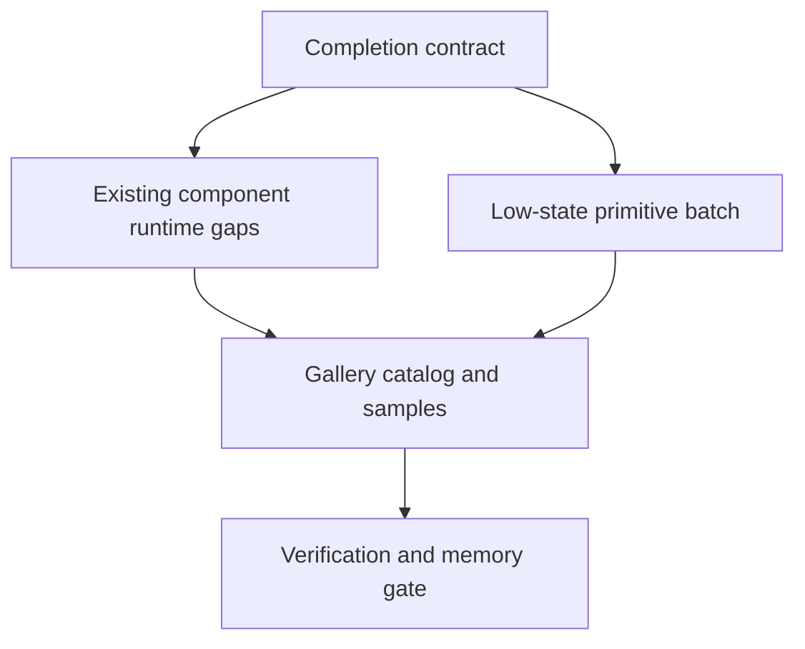

# Open GPUI UI Component Completion Plan

## Summary

Finish the next official UI component slice by turning the current productized crates into a
component completion system. The plan defines what "official component" means, closes runtime gaps
in existing complex widgets, adds the next low-state primitives, and makes the gallery plus
verification gate prove the result.

---

## Problem Frame

The component library is no longer an empty foundation. It already has buttons, form controls,
navigation widgets, overlay families, choice/search widgets, layout primitives, runtime tests, and a
gallery that can catch real GPUI interaction bugs. The remaining issue is that "done" is still too
implicit. Some existing components have stronger state tests than rendered runtime tests, the
gallery does not yet present an official completion matrix, and several basic display/status
primitives are still missing even though higher-level widgets already need their vocabulary.

This plan keeps ADR 0008's product boundary: `open-gpui-ui-core`,
`open-gpui-ui-components`, and `examples/ui-foundation-gallery` are the product. A standalone
headless crate remains deferred. The next step is to make the official component library coherent
inside the current crates.

---

## Requirements

### Product Boundary

- R1. The implementation must keep the active product boundary in the current UI crates and must
  not create `open-gpui-ui-headless`.
- R2. A component must have a resolved state, explicit crate-root and prelude exports, gallery
  samples, contract documentation, and focused verification before it is treated as official.
- R3. Component behavior must keep semantic state renderer-neutral while concrete GPUI rendering,
  focus handles, scroll handles, image loading, and callbacks remain adapter responsibilities.

### Existing Components

- R4. Existing complex components must gain rendered runtime coverage where state-only tests cannot
  catch regressions: standalone `TextInput`, keyboard-driven `Combobox`, dialog-backed `Command`,
  and popup dismissal/focus paths for choice surfaces.
- R5. Runtime debug selectors must follow stable family/id/part naming and stay test-only when they
  exist only for automation.

### New Components

- R6. The next component batch must add low-state foundational primitives before data-heavy or
  application-owned widgets: `Separator`, `Kbd`, `Progress`, `Skeleton`, and `Avatar`.
- R7. New components must use existing foundation vocabulary: `ThemeTokens`, `Size`, `ColorIntent`,
  neutral accessibility roles, and GPUI adapter rendering.
- R8. `Avatar` must treat image loading as adapter-owned. Resolved state should record display
  intent, fallback text, accessible label, and source metadata without owning async image lifecycle.

### Conformance

- R9. The gallery Components page must expose an official component catalog or status matrix and
  remain scrollable under short and compact viewports.
- R10. The focused UI package checks and `cargo run -p xtask -- verify` must remain the release gate
  for this series, with `docs/verification.md` and engineering memory updated as slices land.

---

## Key Technical Decisions

- **Current-crate product boundary:** Follow ADR 0008 and improve the existing crates before
  reopening headless extraction. The current resolved-state hygiene still matters, but extraction is
  not the active deliverable.
- **Completion contract before breadth:** Define the official-component checklist before adding more
  widgets. This prevents the catalog from becoming a set of one-off render helpers.
- **Characterization tests before behavior edits:** Runtime tests should pin the existing public
  behavior before refactoring complex widgets. The regressions found so far were redraw, scroll,
  popup, and focus bugs that state tests alone could not expose.
- **Low-state primitives first:** `Separator`, `Kbd`, `Progress`, `Skeleton`, and `Avatar` exercise
  tokens, metrics, semantic roles, fallback content, and gallery taxonomy without pulling in heavy
  application state.
- **No external design-system clone:** `gpui-component`, `fret`, shadcn, DaisyUI, and Radix-style
  primitives are references for taxonomy and edge cases. Open GPUI keeps its own resolved-state plus
  GPUI-adapter shape.
- **Image and animation boundaries stay narrow:** Avatar image loading and Skeleton animation can
  grow into runtime features later. The first official slice should expose stable state and static
  rendering, not introduce a new async or animation subsystem.

---

## High-Level Technical Design



The plan is intentionally sequential. First name the definition of done, then harden components
already in the crate, then add primitives that follow the same contract, then make the gallery and
verification docs prove the complete slice.

---

## Implementation Units

### U1. Component Completion Contract and Inventory

**Goal:** Define the official-component completion checklist and make the current catalog auditable.

**Requirements:** R1, R2, R3, R9

**Files:**

- Modify `docs/ui/component-contract.md`
- Modify `docs/verification.md`
- Modify `examples/ui-foundation-gallery/src/pages/components.rs`
- Modify `examples/ui-foundation-gallery/tests/foundation_gallery.rs`
- Optionally add `docs/ui/component-catalog.md` if the inventory becomes too large for the
  contract document.

**Approach:** Add a concise official-component checklist covering resolved state, exports, token and
size usage, accessibility metadata, adapter-only runtime ownership, gallery samples, runtime debug
selectors, and verification. Add an inventory that classifies components as official, experimental,
internal anatomy, or deferred. Keep the inventory factual rather than aspirational.

**Patterns to follow:**

- Current `docs/ui/component-contract.md` resolved-state and adapter sections
- Current `examples/ui-foundation-gallery/src/pages/components.rs` `SIGNALS` and
  `CONFORMANCE_GATES`
- Current verification style in `docs/verification.md`

**Test scenarios:**

- The gallery conformance test can assert that the status matrix lists every shipped crate-root
  component.
- Public exports remain explicit through the existing contract tests.
- Components classified as internal anatomy do not appear as official standalone components.

**Verification:** Focused gallery tests prove the inventory is rendered and the docs give later
implementers a single definition of done.

### U2. Existing Complex Component Runtime Gap Closure

**Goal:** Strengthen automation for existing components whose bugs are most likely to appear only in
real GPUI rendering.

**Requirements:** R4, R5, R10

**Files:**

- Modify `crates/ui_components/src/text_input.rs`
- Modify `crates/ui_components/src/combobox.rs`
- Modify `crates/ui_components/src/command.rs`
- Modify `crates/ui_components/src/select.rs`
- Modify `crates/ui_components/tests/components.rs`
- Modify `examples/ui-foundation-gallery/tests/foundation_gallery.rs`
- Modify `docs/verification.md`

**Approach:** Add rendered `open_gpui::test` coverage around real input, popup, and keyboard paths.
Keep each test focused on one behavioral contract instead of creating a full browser-like harness.
Use stable debug selectors as automation anchors, and document any new selector convention in the
completion checklist.

**Patterns to follow:**

- Existing runtime tests for `RadioGroup`, `Listbox`, `Select`, `Combobox`, `Command`, `Tabs`,
  `Toolbar`, `ScrollArea`, and `Splitter`
- Existing `TextInputController` tests for UTF-16, marked text, and grapheme behavior
- Existing gallery smoke helpers for page scrolling, outside press, and Escape dismissal

**Test scenarios:**

- Standalone `TextInput` accepts real text through the controller-backed path and exposes stable
  debug anchors.
- `Combobox` supports keyboard navigation and Enter selection after filtering, while preserving the
  selected value independently from the query.
- Dialog-backed `Command` opens, filters, selects, dismisses by Escape or outside press, and does
  not leave a modal layer blocking the Components page.
- Choice popup dismissal and focus restoration stay covered where Select, Combobox, and Command
  share overlay behavior.

**Verification:** Run the focused component tests first, then the full component and gallery package
tests before broad verification.

### U3. Layout and Status Primitive Batch

**Goal:** Add foundational display/status primitives that higher-level components already need.

**Requirements:** R2, R3, R6, R7, R10

**Files:**

- Add `crates/ui_components/src/separator.rs`
- Add `crates/ui_components/src/kbd.rs`
- Add `crates/ui_components/src/progress.rs`
- Add `crates/ui_components/src/skeleton.rs`
- Modify `crates/ui_components/src/lib.rs`
- Modify `crates/ui_components/src/prelude.rs`
- Modify `crates/ui_components/src/theme.rs`
- Modify `crates/ui_components/src/a11y.rs`
- Modify `crates/ui_core/src/a11y.rs` to add a neutral `Separator` role for non-decorative
  separators.
- Modify `crates/ui_components/tests/components.rs`

**Approach:** Implement the primitives as resolved-state-first components. `Separator` owns
orientation, decorative state, metrics, and optional semantic role. `Kbd` is a display primitive for
shortcuts and key labels. `Progress` supports determinate and indeterminate state with clamped
normalized values. `Skeleton` is decorative loading placeholder state with static rendering in the
first slice.

**Patterns to follow:**

- Current `Badge`, `Label`, `Toggle`, and `Toolbar` state/render patterns
- `repo-ref/fret/ecosystem/fret-ui-kit/src/primitives/separator.rs`
- `repo-ref/fret/ecosystem/fret-ui-kit/src/primitives/progress.rs`
- `repo-ref/gpui-component/docs/docs/components/progress.md`
- `repo-ref/gpui-component/docs/docs/components/skeleton.md`
- `repo-ref/gpui-component/docs/docs/components/kbd.md`

**Test scenarios:**

- `Separator` resolves horizontal and vertical orientation, exposes `Role::Separator` when semantic,
  and hides semantics when decorative.
- `Kbd` exposes stable label text, size metrics, and muted token intent without acting as a button.
- `Progress` clamps out-of-range values, preserves indeterminate state, and exposes
  `Role::ProgressIndicator`.
- `Skeleton` uses muted surface token intent, exposes stable metrics, and remains non-interactive.

**Verification:** Component tests cover all resolved-state branches; gallery tests cover exports and
sample metadata after U5 wires the samples.

### U4. Avatar Primitive

**Goal:** Add the identity primitive used by shell, profile, collaboration, and notification
surfaces.

**Requirements:** R2, R3, R6, R7, R8, R10

**Files:**

- Add `crates/ui_components/src/avatar.rs`
- Modify `crates/ui_components/src/lib.rs`
- Modify `crates/ui_components/src/prelude.rs`
- Modify `crates/ui_components/src/theme.rs`
- Modify `crates/ui_components/tests/components.rs`
- Modify `docs/ui/component-contract.md`

**Approach:** Start with a single `Avatar` component, not `AvatarGroup`. The state should resolve
name, fallback initials, optional source intent, accessible label, size metrics, and color intents.
The GPUI adapter may render source-backed visual content when supplied, but async loading status,
retry policy, cache lifecycle, and grouped overlap layout stay out of the first slice.

**Patterns to follow:**

- Current `Badge` and `IconButton` size/color patterns
- Current component resolved-state contract
- `repo-ref/gpui-component/crates/ui/src/avatar/avatar.rs`
- `repo-ref/fret/ecosystem/fret-ui-kit/src/primitives/avatar.rs`
- `repo-ref/gpui-component/docs/docs/components/avatar.md`

**Test scenarios:**

- Fallback initials derive predictably from display names and handle empty names.
- Explicit fallback text overrides derived initials.
- Optional source metadata does not make resolved state own image loading.
- Accessible label is explicit for image and fallback avatars.
- Size metrics and token intents are stable across small, medium, and large variants.

**Verification:** Component tests prove resolved state and rendering metadata. Gallery tests in U5
prove the sample catalog includes Avatar states.

### U5. Gallery Catalog and Sample Expansion

**Goal:** Make the Components page the visible catalog for current and newly added official
components without regressing scroll behavior.

**Requirements:** R2, R6, R9, R10

**Files:**

- Modify `examples/ui-foundation-gallery/src/pages/components.rs`
- Modify `examples/ui-foundation-gallery/tests/foundation_gallery.rs`
- Modify `docs/verification.md`

**Approach:** Add samples for `Separator`, `Kbd`, `Progress`, `Skeleton`, and `Avatar`, and surface
their resolved state in the same dense style as existing component samples. Add or extend a catalog
matrix that distinguishes official components from internal anatomy and deferred widgets. Keep the
page layout scrollable and avoid turning the gallery into nested decorative cards.

**Patterns to follow:**

- Existing sample functions in `examples/ui-foundation-gallery/src/pages/components.rs`
- Existing Components page smoke tests for short viewport scrolling, nested scroll areas, vertical
  tabs, splitters, and long sidebars

**Test scenarios:**

- The component catalog lists the new primitives and their exported state types.
- Short and compact viewport smoke tests can still scroll to deep samples and reset page scroll on
  navigation.
- Static primitives render with visible samples and resolved-state metadata.
- Existing complex samples still expose popup, scroll, focus, and overflow gates.

**Verification:** Run the full gallery package tests after focused component tests.

### U6. Release Gate, Review, and Memory Update

**Goal:** Finish the series with a repeatable verification and review path that can be reused for
later component batches.

**Requirements:** R9, R10

**Files:**

- Modify `docs/verification.md`
- Modify `docs/knowledge/engineering/current-state.md`
- Modify `docs/knowledge/engineering/log.md`
- Modify any plan or ADR cross-references only if the implementation changes the roadmap.

**Approach:** Keep `xtask verify` as the final local gate. After each medium slice, run focused
checks before broad checks, then use an independent review pass before committing when the code
touches public API or runtime behavior. Update engineering memory with what landed, what was
verified, and which component family should be next.

**Patterns to follow:**

- Existing verification command list in `docs/verification.md`
- Existing engineering memory entry format
- Existing Conventional Commit history for UI component slices

**Verification commands:**

```sh
cargo fmt -p open-gpui-ui-core -p open-gpui-ui-components -p open-gpui-ui-foundation-gallery
cargo check -p open-gpui-ui-core
cargo check -p open-gpui-ui-components
cargo check -p open-gpui-ui-foundation-gallery
cargo nextest run -p open-gpui-ui-core
cargo nextest run -p open-gpui-ui-components
cargo nextest run -p open-gpui-ui-foundation-gallery
cargo run -p xtask -- verify
```

**Verification:** The final slice is complete only when package tests, gallery tests, verification
docs, and engineering memory describe the same component state.

---

## Acceptance Examples

- AE1. Given a standalone `TextInput` sample, when a runtime test clicks it and sends text input,
  then the controller-backed value changes and the test can locate the stable root debug selector.
- AE2. Given a filtered `Combobox`, when keyboard navigation moves to a filtered option and Enter is
  pressed, then the selected value changes, ordered callbacks fire, and the popup closes by policy.
- AE3. Given a dialog-backed `Command`, when it opens from the Components page and is dismissed,
  then no stale modal layer blocks page scrolling or later component samples.
- AE4. Given a `Progress` with values below minimum, inside range, above maximum, and indeterminate,
  then resolved state reports clamped normalized values or no value for indeterminate state.
- AE5. Given a compact gallery viewport, when the user navigates away from Components and back, then
  the page scroll resets and the component catalog remains reachable.
- AE6. Given an `Avatar` with no loaded image source, when resolved state is inspected, then fallback
  text and accessible label are deterministic and no async image lifecycle is stored in state.

---

## Scope Boundaries

### Active Scope

- Current-crate productization for `open-gpui-ui-core`, `open-gpui-ui-components`, and
  `examples/ui-foundation-gallery`.
- Official-component completion criteria and catalog inventory.
- Existing runtime gap closure for complex widgets.
- New low-state primitives: `Separator`, `Kbd`, `Progress`, `Skeleton`, and `Avatar`.
- Gallery, verification, and engineering memory alignment.

### Deferred to Follow-Up Work

- Standalone `open-gpui-ui-headless` extraction.
- `AvatarGroup`, image cache lifecycle, async image loading policy, and retry behavior.
- Animated `Skeleton`, spinner variants, progress circles, and transition runtime.
- Toast or Snackbar, Slider, Breadcrumb, Accordion, Tree, Table, DataTable, Calendar, DatePicker,
  and virtualized collection widgets.
- App-level command registry, global shortcut registry, form validation framework, and route-aware
  navigation shell.
- Full visual screenshot regression harness unless later UI churn makes it worth the maintenance
  cost.

### Outside This Product's Identity

- Copying shadcn, DaisyUI, Radix, `gpui-component`, or `fret` APIs wholesale.
- Introducing web DOM assumptions into the GPUI component API.
- Replacing the existing resolved-state plus GPUI-adapter architecture.

---

## Risks and Dependencies

| Risk | Impact | Mitigation |
| --- | --- | --- |
| The catalog grows faster than the completion standard | Components look official but have uneven contracts | Land U1 before adding new primitives |
| Runtime tests become too broad | Failures are hard to diagnose and slow to run | Keep focused package tests for component behavior and reserve gallery smokes for composition bugs |
| Avatar pulls in async image lifecycle too early | A display primitive becomes a runtime subsystem | Keep first-slice Avatar static and adapter-owned |
| New semantic roles affect AccessKit mapping | Accessibility regressions or tree repair issues can reappear | Add neutral role mapping tests and run the existing accessibility repair gate when relationships change |
| Gallery density becomes hard to scan | Manual dogfood misses component states | Add catalog structure and keep samples compact rather than adding decorative layout |

---

## Documentation and Operational Notes

Update `docs/ui/component-contract.md` whenever a component introduces a new public resolved-state
pattern. Update `docs/verification.md` whenever a runtime path becomes part of the release gate.
Update engineering memory after each medium slice with the landed component set, focused commands
that passed, and any deferred follow-up that should not be rediscovered later.

This plan should be implemented in small commits. A practical commit sequence is U1, U2, U3, U4,
U5, and U6, with review after U2 and after U5 because those slices touch runtime behavior and the
public component catalog.

---

## Sources and Research

- `docs/adr/0004-open-gpui-component-library-strategy.md`
- `docs/adr/0005-open-gpui-official-component-architecture.md`
- `docs/adr/0008-open-gpui-ui-component-productization-roadmap.md`
- `docs/ui/component-contract.md`
- `docs/verification.md`
- `docs/plans/2026-06-17-003-feat-ui-component-productization-roadmap-plan.md`
- `docs/knowledge/engineering/current-state.md`
- `crates/ui_components/src/lib.rs`
- `crates/ui_components/src/prelude.rs`
- `crates/ui_components/tests/components.rs`
- `examples/ui-foundation-gallery/src/pages/components.rs`
- `examples/ui-foundation-gallery/tests/foundation_gallery.rs`
- `repo-ref/gpui-component/crates/ui/src/avatar/avatar.rs`
- `repo-ref/gpui-component/docs/docs/components/avatar.md`
- `repo-ref/gpui-component/docs/docs/components/kbd.md`
- `repo-ref/gpui-component/docs/docs/components/progress.md`
- `repo-ref/gpui-component/docs/docs/components/skeleton.md`
- `repo-ref/fret/ecosystem/fret-ui-kit/src/primitives/avatar.rs`
- `repo-ref/fret/ecosystem/fret-ui-kit/src/primitives/progress.rs`
- `repo-ref/fret/ecosystem/fret-ui-kit/src/primitives/separator.rs`
