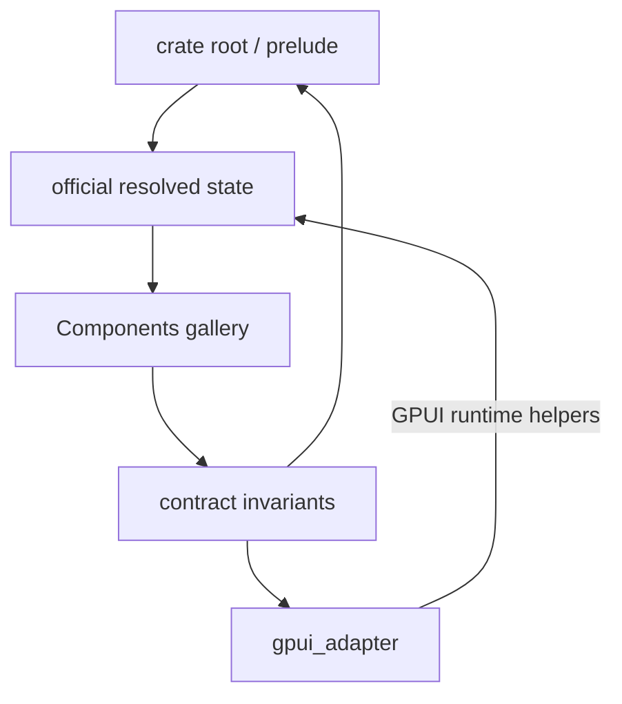

# Open GPUI UI Component Contract Alignment Plan

## Summary

Align the current UI component product surface with the adapter-first contract. The first pass fixes
public interface drift, corrects Avatar semantics, and adds gallery invariants that catch catalog,
sample, signal, and render selector mismatches before manual dogfood.

---

## Problem Frame

The current crates have enough official components to make drift expensive. Several GPUI adapter
surfaces still appear at the default crate root and prelude, Avatar exposes an image-like primitive
as `Role::Label`, and the Components gallery relies on several hand-written lists that can disagree
without failing tests.

---

## Requirements

**Public Interface**

- R1. Adapter-only public surfaces must be reachable through `open_gpui_ui_components::gpui_adapter`
  instead of the default root or prelude interface.
- R2. Official component state must expose semantic roles that match the component contract and the
  AccessKit roles available through the GPUI adapter.

**Gallery Conformance**

- R3. Every official catalog entry must have matching `SIGNALS` coverage for its component type and
  resolved state type when one is declared.
- R4. The Components page must expose stable rendered sample selectors for every official sample
  family so smoke tests can prove catalog entries are not only metadata.
- R5. Documentation and verification notes must describe the new stricter interface posture without
  implying a standalone headless crate is active.

---

## Key Technical Decisions

- **Break default adapter exports:** `TextInputController`, `focus_ring_shadow`, GPUI overlay
  scheduling helpers, and GPUI geometry conversion helpers stay public, but only through the
  `gpui_adapter` interface. This preserves concrete GPUI app capability while making the default
  interface mean official component contract.
- **Keep official component modules official:** `open_gpui_ui_components::text_input` remains the
  module for `TextInput`, `TextInputState`, `TextInputColors`, and `TextInputMetrics`; the GPUI
  `TextInputController` and text-input key binding initialization are internal adapter
  implementation details publicly surfaced only through `gpui_adapter`.
- **Use `Role::Image` for Avatar:** AccessKit already exposes `Image`, so UI core should expose the
  neutral role and the GPUI adapter should map it directly. Keeping Avatar as `Label` hides useful
  semantics from accessibility tests and future adapters.
- **Test list agreement rather than list length:** The gallery should fail when catalog, signals,
  sample factories, or rendered selectors drift. Fixed lists are still acceptable as structural
  snapshots, but they should be derived from the contract shape where possible.
- **Defer deeper module consolidation:** Overlay adapter deepening, choice/search model
  consolidation, and gallery module splitting are real follow-up candidates, but they would obscure
  this smaller contract-alignment pass.

---

## High-Level Technical Design

---

## Implementation Units

### U1. Narrow Adapter-Only Exports

- **Goal:** Make adapter-owned surfaces public only through `gpui_adapter`.
- **Files:** `crates/ui_components/src/lib.rs`, `crates/ui_components/src/prelude.rs`,
  `crates/ui_components/tests/components.rs`, `examples/ui-foundation-gallery/src/shell.rs`,
  `examples/ui-foundation-gallery/tests/foundation_gallery.rs`.
- **Approach:** Remove adapter-only re-exports from the default root and prelude. Update internal
  examples and tests to import those surfaces through `gpui_adapter` while keeping official
  components and neutral overlay state at the default interface.
- **Test scenarios:** Root/prelude explicit export tests compile without default adapter imports;
  adapter-only inventory no longer allows root/prelude leaks; `gpui_adapter` still exposes the same
  concrete GPUI helper set.
- **Verification:** `cargo nextest run -p open-gpui-ui-components adapter_only_public_surfaces_match_allowlist gpui_adapter_exports_group_runtime_specific_surfaces crate_root_and_prelude_exports_remain_explicit`.

### U2. Correct Avatar Accessibility Role

- **Goal:** Expose Avatar as an image-like identity primitive rather than a label.
- **Files:** `crates/ui_core/src/a11y.rs`, `crates/ui_core/tests/headless_contracts.rs`,
  `crates/ui_components/src/a11y.rs`, `crates/ui_components/src/avatar.rs`,
  `crates/ui_components/tests/components.rs`, `examples/ui-foundation-gallery/src/pages/components.rs`,
  `examples/ui-foundation-gallery/tests/foundation_gallery.rs`, `docs/ui/component-contract.md`,
  `docs/verification.md`.
- **Approach:** Add neutral `Role::Image`, map it to GPUI's AccessKit `Image`, and update Avatar
  state and tests. Add `Role::Image` to gallery signals so the conformance surface advertises the
  role vocabulary it uses.
- **Test scenarios:** `AvatarState::role()` returns `Role::Image`; `gpui_role_from_ui(Role::Image)`
  maps to `open_gpui::Role::Image`; gallery metadata and signals include `Role::Image`.
- **Verification:** `cargo nextest run -p open-gpui-ui-core -p open-gpui-ui-components -p open-gpui-ui-foundation-gallery avatar`.

### U3. Add Gallery Contract Invariants

- **Goal:** Catch future mismatches between official catalog entries, signals, sample factories,
  rendered selectors, and smoke coverage.
- **Files:** `examples/ui-foundation-gallery/src/shell.rs`,
  `examples/ui-foundation-gallery/tests/foundation_gallery.rs`,
  `examples/ui-foundation-gallery/src/pages/components.rs`.
- **Approach:** Add stable `gallery:component-{kebab}-sample:{id}` selectors to sample families
  that only had element ids. Add tests that assert official catalog entries have declared state
  signals and one rendered selector per official family.
- **Test scenarios:** Adding an official catalog entry without signals fails; removing a rendered
  sample section fails; one sample family cannot silently lose its stable selector.
- **Verification:** `cargo nextest run -p open-gpui-ui-foundation-gallery official_component_catalog_entries_have_signals_and_sample_selectors components_gallery_smoke_scrolls_short_viewport_and_resets_page_on_navigation`.

### U4. Update Documentation and Memory

- **Goal:** Keep the durable contract and release gate aligned with the stricter interface.
- **Files:** `docs/ui/component-contract.md`, `docs/verification.md`,
  `docs/adr/0006-open-gpui-ui-headless-extraction-checkpoint.md`,
  `docs/adr/0007-open-gpui-ui-headless-boundary-design.md`,
  `docs/knowledge/engineering/current-state.md`, `docs/knowledge/engineering/log.md`.
- **Approach:** Document that adapter helpers remain public only through `gpui_adapter`, Avatar maps
  to `Role::Image`, and gallery invariants are now part of the UI component gate.
- **Test scenarios:** Documentation references current command names and no longer describes root or
  prelude adapter compatibility as acceptable.
- **Verification:** Engineering wiki validation plus `git diff --check`.

---

## Scope Boundaries

- This plan does not create `open-gpui-ui-headless`.
- This plan does not consolidate overlay runtime rendering into a deeper adapter module.
- This plan does not introduce screenshot regression testing.
- This plan accepts breaking changes to default imports for adapter-only APIs.

---

## Risks and Dependencies

| Risk | Impact | Mitigation |
| --- | --- | --- |
| Downstream apps imported adapter helpers from the crate root | Compile breaks | The fix is mechanical: import from `open_gpui_ui_components::gpui_adapter` |
| Gallery invariant becomes too hand-written | New official families still need manual updates | Keep the invariant focused on catalog, signals, sample factories, and selectors |
| Avatar role change exposes GPUI AccessKit assumptions | Accessibility mapping failures | Add a direct adapter mapping test and rely on existing a11y repair tests for tree safety |

---

## Acceptance Examples

- AE1. Given code imports `TextInputController` from `open_gpui_ui_components`, when compiled after
  this refactor, then it must move to `open_gpui_ui_components::gpui_adapter::TextInputController`.
- AE2. Given an Avatar sample, when its resolved state is inspected, then its role is `Role::Image`
  and its accessible label remains explicit or derived.
- AE3. Given a new official catalog entry with a state type, when the gallery contract test runs
  without a matching signal or rendered sample selector, then the test fails.

---

## Sources and Research

- `docs/adr/0005-open-gpui-official-component-architecture.md`
- `docs/adr/0007-open-gpui-ui-headless-boundary-design.md`
- `docs/adr/0008-open-gpui-ui-component-productization-roadmap.md`
- `docs/ui/component-contract.md`
- `crates/ui_components/src/lib.rs`
- `crates/ui_components/src/prelude.rs`
- `crates/ui_components/src/avatar.rs`
- `crates/ui_components/tests/components.rs`
- `examples/ui-foundation-gallery/src/pages/components.rs`
- `examples/ui-foundation-gallery/src/shell.rs`
- `examples/ui-foundation-gallery/tests/foundation_gallery.rs`
