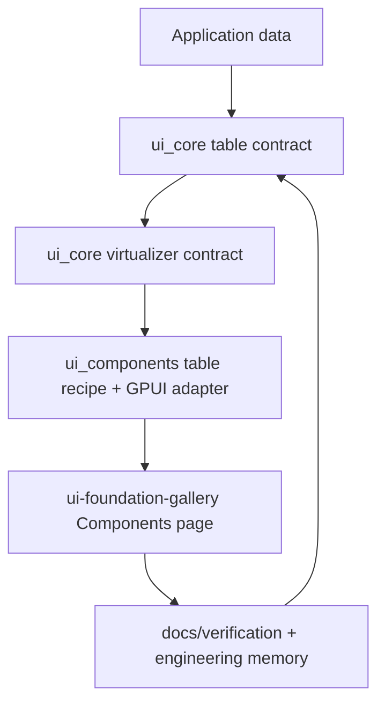

# Open GPUI Table and Virtualizer Roadmap

## Summary

Build the next Open GPUI table series as a TanStack-aligned contract plus GPUI recipe layer inside
the existing UI crates. The series should make row identity, row-model ordering, and virtualized
viewport behavior explicit enough that future adapters can reuse the same semantics. The first
useful outcome is a vertically virtualized data table surface in the Components gallery, not a new
headless package boundary or a browser-style grid clone.

## Problem Frame

Open GPUI already has the primitives tables need: stable tokens, scroll areas, overlays, focus,
selection-like choice widgets, and a gallery that can expose real regressions. What it does not yet
have is a table contract that is durable enough for cross-platform use or a virtualizer contract
that survives redraws, long lists, and nested scroll surfaces.

The existing `crates/gpui/examples/data_table.rs` proves the runtime can draw a table, but it is a
demo, not an official product boundary. The risk is either a shallow table widget that re-invents
state inside rendering code, or an overbuilt parity chase before the product shape is clear.

Local references point to the right direction. `fret` shows the useful layering pattern: thin
facades, deep behavior modules, and headless state that stays separate from recipes. TanStack Table
defines the row-model vocabulary and stable row identity shape. TanStack Virtual defines the
viewport contract, keying, overscan, measurement, anchoring, and snapshot/restore behavior.

## Requirements

- R1. Keep the series inside the current UI crates and do not introduce `open-gpui-ui-headless`
  as part of this roadmap.
- R2. Add a renderer-neutral table contract that preserves stable row ids, the full row-model
  vocabulary, and a v0 pipeline for core, filtered, sorted, paginated rows.
- R3. Add a renderer-neutral virtualizer contract that maps item count, viewport extent, scroll
  offset, item keys, overscan, and measurements to range output, total size, and snapshot/restore.
- R4. Ship the first official table surface as a GPUI adapter and recipe that can render large
  vertical datasets without leaking scroll input to the page shell.
- R5. Make gallery conformance, verification docs, and engineering memory prove the table and
  virtualizer contracts.
- R6. Use TanStack and fret as semantic references only; the Open GPUI API should stay Rust-native
  and renderer-aware at the adapter boundary.

## Acceptance Examples

- AE1. Given a 10k-row table sample, when the user scrolls inside the table viewport, the outer
  Components page does not move.
- AE2. Given a sorted or filtered table, when row order changes, the same row ids remain addressable
  and selection follows ids rather than indices.
- AE3. Given a virtualized sample with measured rows, when the component redraws with the same
  keys, the scroll position and visible window remain stable.
- AE4. Given Table is marked official in the Components gallery, when catalog conformance runs,
  `Table`, `TableState`, `COMPONENT_CATALOG`, `SIGNALS`, rendered sample selectors, and table
  accessibility metadata stay aligned.

## Key Technical Decisions

- **Keep the contract in the existing product boundary:** `open-gpui-ui-core` is the right home for
  renderer-neutral table and virtualizer state because it already owns shared vocabulary; concrete
  rendering and event wiring stay in `open-gpui-ui-components`.
- **Separate contract from recipe:** the table core should expose row identity, row-model
  transforms, and virtualization inputs and outputs; the first shipped recipe should consume those
  contracts rather than duplicate them.
- **Use TanStack row-model ordering as the semantic baseline:** core -> filtered -> grouped ->
  sorted -> expanded -> paginated -> final row model is the full vocabulary future adapters can
  share. The first slice implements the explicit v0 subset core -> filtered -> sorted -> paginated;
  grouped and expanded stages remain named but deferred.
- **Treat virtualization as pure input and output:** the core contract takes `count`,
  `viewport_extent`, `scroll_offset`, `estimated_size`, `measurements_by_key`, `overscan`, and
  optional gap or scroll-margin inputs, then returns `range`, item measurements, `total_size`, and
  snapshot/restore data. Concrete scroll elements stay in the GPUI adapter.
- **Start with one-dimensional vertical virtualization:** sticky headers, pinned columns, 2D grids,
  tree expansion, and aggregation stay deferred until the first slice proves row identity and
  viewport behavior.
- **Use fret as the layering reference, not the implementation target:** the useful part is thin
  facade plus deep behavior modules, not a wholesale port of its crate structure.

## High-Level Technical Design

The table contract keeps row identity, row-model stages, and derived lookup state renderer-neutral.
The virtualizer contract keeps visible range, keying, measurement cache, and scroll anchoring
testable without a GPUI window. The adapter owns real elements, scroll handles, keyboard and pointer
behavior, and visible table chrome. The gallery and memory docs keep the behavior story honest.

## Implementation Units

### U1. Lock the table and virtualizer product shape

**Goal:** Add the durable decision artifact and contract language for the new series.

**Requirements:** R1, R5, R6

**Dependencies:** None

**Files:**

- Add `docs/adr/0009-open-gpui-table-and-virtualizer-product-shape.md`
- Modify `docs/ui/component-contract.md`
- Modify `docs/verification.md`
- Modify `docs/knowledge/engineering/current-state.md`
- Modify `docs/knowledge/engineering/log.md`

**Approach:** Write a short ADR that says the table series stays in the current UI crates, borrows
TanStack and fret semantics, and intentionally stops short of a new headless package boundary.
Extend the component contract with explicit table and virtualizer vocabulary so later code has a
stable review target. Keep verification notes focused on table gallery behavior and scroll
isolation, not generic UI prose.

**Patterns to follow:**

- `docs/adr/0008-open-gpui-ui-component-productization-roadmap.md`
- `docs/adr/0005-open-gpui-official-component-architecture.md`
- `docs/ui/component-contract.md`
- `docs/verification.md`

**Test scenarios:**

- The ADR states what is in scope, what is deferred, and which crate owns which contract.
- The component contract names table and virtualizer state without smuggling GPUI runtime types
  into resolved state.
- The verification doc can point at the table gallery and its scroll gates as the release proof.

**Verification:** A reviewer can read the ADR and the contract once and understand the series
boundary without reading implementation code.

### U2. Add table core v0 contract

**Goal:** Add the core row-model contract types in the foundation crate.

**Requirements:** R2

**Dependencies:** U1

**Files:**

- Add `crates/ui_core/src/table.rs`
- Modify `crates/ui_core/src/lib.rs`
- Modify `crates/ui_core/src/prelude.rs`

**Approach:** Make table state explicit and deterministic. Keep stable row ids, row-model stages,
row lookup, selection, sorting, filtering, visibility, ordering, and pagination as renderer-neutral
state. Name the full TanStack-style pipeline so later work has a stable vocabulary, but implement
only the v0 subset for core, filtered, sorted, and paginated rows. Keep grouping and expansion as
deferred stages, not hidden implementation holes.

**Patterns to follow:**

- `repo-ref/fret/ecosystem/fret-ui-headless/src/table/`
- `repo-ref/fret/docs/adr/0100-headless-table-engine.md`
- `repo-ref/tanstack-table/docs/guide/row-models.md`

**Test scenarios:**

- Stable row ids survive sorting, filtering, and pagination.
- Row lookup does not depend on numeric index positions.
- Row-model ordering follows the v0 semantic pipeline core -> filtered -> sorted -> paginated.
- The full pipeline records grouped and expanded stages as deferred vocabulary without executing
  those transforms.
- Selection follows row ids after filtered or sorted order changes.

**Verification:** Unit tests in the new foundation table module prove the contract without
rendering.

### U6. Add virtualizer metrics and range contract

**Goal:** Add the renderer-neutral viewport range and measurement contract in the foundation crate.

**Requirements:** R3

**Dependencies:** U1

**Files:**

- Add `crates/ui_core/src/virtualizer.rs`
- Modify `crates/ui_core/src/lib.rs`
- Modify `crates/ui_core/src/prelude.rs`

**Approach:** Model virtualization as a pure calculation from item count, viewport extent, scroll
offset, stable item keys, estimated size, measurement cache, overscan, gap, and scroll margin into
visible range, overscan range, item measurements, total size, and an optional snapshot. Keep DOM or
GPUI scroll handles out of `ui_core`; adapters pass offsets in and apply the returned range.

**Patterns to follow:**

- `repo-ref/fret/docs/adr/0042-virtualization-and-large-lists.md`
- `repo-ref/fret/docs/adr/0070-virtualization-contract.md`
- `repo-ref/tanstack-virtual/docs/api/virtualizer.md`

**Test scenarios:**

- The virtualizer returns deterministic visible ranges and total size for empty and short lists.
- A zero viewport returns a stable empty or minimal range without panicking.
- Overscan never renders more row selectors than visible count plus configured overscan.
- Gap and scroll-margin inputs affect offsets and total size without changing stable item keys.
- Reapplying the same measurement for the same key is idempotent.
- Key-stable redraws preserve the range and snapshot; key changes invalidate only affected
  measurements.
- Snapshot/restore preserves the measured window when item keys stay stable.

**Verification:** Unit tests in the new foundation virtualizer module prove range math without
rendering.

### U3. Build the GPUI table recipe and adapter

**Goal:** Render the new table contract as a concrete Open GPUI component surface.

**Requirements:** R2, R4, R6

**Dependencies:** U2, U6

**Files:**

- Add `crates/ui_components/src/table.rs`
- Modify `crates/ui_components/src/lib.rs`
- Modify `crates/ui_components/src/prelude.rs`
- Modify `crates/ui_components/tests/components.rs`

**Approach:** Keep the rendering layer thin. Resolve the table model first, then render rows and
headers from that resolved state. The adapter owns the GPUI element tree, scroll handles, keyboard
and pointer wiring, and visible table chrome. The first slice should be a vertically virtualized
data table with stable row selectors and a scrollable body. Reuse the useful part of fret's
`table_virtualized` split: contract resolution first, rendering second, and wheel isolation at the
scroll boundary. Public exports should make `Table` and `TableState` visible through the crate root
and prelude once the component is official.

**Patterns to follow:**

- `crates/gpui/examples/data_table.rs`
- `repo-ref/fret/ecosystem/fret-ui-kit/src/declarative/table.rs`
- `repo-ref/fret/ecosystem/fret-ui-shadcn/src/data_table.rs`
- `crates/ui_components/src/scroll_area.rs`

**Test scenarios:**

- Header actions update the table state without coupling to render code.
- Large datasets only render the visible window and overscan.
- Rendered row debug selectors stay below or equal to visible rows plus configured overscan.
- Scroll input stays inside the table viewport and does not bubble to the page shell.
- Stable row selectors remain valid after redraws and state transitions.
- Table role, row/column metadata, sort metadata, and selection metadata are represented in the
  adapter's accessibility state without leaking GPUI runtime types into `TableState`.
- Public export tests cover `Table` and `TableState` once the component is promoted to official.

**Verification:** Component tests prove the contract and the adapter behavior separately.

### U4. Wire the gallery and conformance surface

**Goal:** Expose the table series in the Components gallery and make it dogfoodable.

**Requirements:** R4, R5

**Dependencies:** U3

**Files:**

- Modify `examples/ui-foundation-gallery/src/pages/components.rs`
- Modify `examples/ui-foundation-gallery/src/pages/components/render.rs`
- Modify `examples/ui-foundation-gallery/tests/foundation_gallery.rs`
- Modify `docs/verification.md`

**Approach:** Add a visible table section with stable sample ids, a long vertical data table sample,
and at least one constrained viewport case that proves scroll isolation. Keep the page dense but
not nested-card heavy. Expose the resolved state and the gate list plainly so later table work can
tell whether a regression is in row-model logic or in scrolling and layout. When Table becomes an
official component, add it to `COMPONENT_CATALOG`, add `SIGNALS` entries for `Table` and
`TableState`, and render at least one `gallery:component-table-sample:{id}` selector.

Gallery page scroll and table sample state should have separate owners. Page navigation resets the
outer Components page scroll. The gallery sample owns sort, filter, and selection state when those
controls are visible. The table adapter owns local viewport scroll, and virtualizer snapshot/restore
applies only when the sample passes an explicit saved snapshot for stable item keys.

**Patterns to follow:**

- Existing sample functions in `examples/ui-foundation-gallery/src/pages/components.rs`
- Existing Components page smoke tests for short viewport scrolling and page scroll reset
- `docs/verification.md`

**Test scenarios:**

- The Components page can reach the table section from a short viewport.
- Navigating away and back resets page scroll while preserving gallery-owned sort, filter, and
  selection state.
- The table sample remains internally scrollable when its content exceeds the viewport.
- A virtualized sample keeps the visible row window stable when item keys are unchanged.
- Official catalog conformance finds `Table`, `TableState`, `COMPONENT_CATALOG`, `SIGNALS`, and
  `gallery:component-table-sample:*` selectors in agreement.
- Role, row/column, sort, and selection metadata appear in the sample state or accessibility hooks
  used by the gallery tests.

**Verification:** Gallery package tests and manual dogfood keep the surface honest.

### U5. Add follow-up gates and growth rules

**Goal:** Turn the first slice into a repeatable table and virtualizer series.

**Requirements:** R5, R6

**Dependencies:** U4

**Files:**

- Modify `docs/ui/component-contract.md`
- Modify `docs/verification.md`
- Modify `docs/knowledge/engineering/current-state.md`
- Modify `docs/knowledge/engineering/log.md`

**Approach:** Document what stays intentionally out of scope after the first slice: grouped rows,
pinned columns, 2D grid virtualization, tree data, aggregation, and full TanStack parity. Keep the
next series step small enough that later changes can be reviewed against the core contract instead
of rediscovering the same boundary. Update engineering memory with the specific design choices that
survive implementation.

**Patterns to follow:**

- Current table and component contract wording
- Current verification format
- Current engineering memory entries

**Test scenarios:**

- The docs clearly distinguish shipped table behavior from deferred behavior.
- The next table slice can be reviewed against explicit row-model and virtualization rules.

**Verification:** Docs and memory stay aligned with the behavior the code actually shipped.

## Scope Boundaries

### Active Scope

- Renderer-neutral table and virtualizer contracts in the existing UI crates.
- A first GPUI table recipe or data table surface built on those contracts.
- Gallery conformance and verification gates for long, scrollable tables.
- Engineering memory updates that preserve the new series direction.

### Deferred to Follow-Up Work

- Standalone `open-gpui-ui-headless` extraction.
- Full TanStack parity for grouping, faceting, selection matrices, and column pinning.
- Two-dimensional grid virtualization, sticky headers, and pinned columns.
- Tree data, aggregation, and complex column sizing policy.
- Async indexing, app-wide command registry integration, and browser-style semantics.

### Outside This Product's Identity

- Copying TanStack, fret, shadcn, or React hook APIs wholesale.
- Browser DOM assumptions, CSS cascade assumptions, or other web-only runtime behavior.
- Moving the adapter boundary out of the current Open GPUI UI crates before the contracts prove
  themselves.

## Risks and Dependencies

| Risk | Impact | Mitigation |
| --- | --- | --- |
| The contract grows into a full parity chase too early | Delivery slows and the first table slice becomes too broad | Split table core v0 from virtualizer v0, then start with stable ids, one-dimensional virtualization, and a single usable recipe |
| Scroll behavior leaks to the page shell | Tables feel broken inside the gallery and hide other regressions | Keep scroll ownership inside the adapter and verify with gallery smokes |
| Row identity drifts across transforms | Selection, lookup, and virtualization keys stop matching the visible model | Treat rowsById-style lookup as part of the contract and test it directly |
| The foundation crate becomes too broad | The neutral crate starts to look like a second component crate | Keep only renderer-neutral vocabulary in `ui_core`; keep rendering in `ui_components` |
| TanStack or fret are copied too literally | The API becomes foreign to Open GPUI and hard to evolve | Use them as semantic references, not as source-level templates |

## Documentation and Operational Notes

Update `docs/ui/component-contract.md` and `docs/verification.md` whenever the table or virtualizer
contract gains a new public rule. Update engineering memory after each medium slice so resumed work
starts from the real product state rather than from the planning conversation.

The table series should be implemented in small commits. A practical order is U1, U2, U6, U3, U4,
and U5, with review after U6 because that slice establishes the contracts and after U4 because that slice
establishes the visible product surface.

## Sources and Research

- `docs/knowledge/engineering/current-state.md`
- `docs/knowledge/engineering/log.md`
- `docs/knowledge/engineering/progress/2026-06-21-table-virtualizer-roadmap-framing.md`
- `docs/adr/0005-open-gpui-official-component-architecture.md`
- `docs/adr/0008-open-gpui-ui-component-productization-roadmap.md`
- `docs/ui/component-contract.md`
- `docs/verification.md`
- `crates/gpui/examples/data_table.rs`
- `crates/ui_components/src/scroll_area.rs`
- `repo-ref/fret/docs/adr/0100-headless-table-engine.md`
- `repo-ref/fret/docs/adr/0042-virtualization-and-large-lists.md`
- `repo-ref/fret/docs/adr/0070-virtualization-contract.md`
- `repo-ref/fret/ecosystem/fret-ui-kit/src/declarative/table.rs`
- `repo-ref/fret/ecosystem/fret-ui-shadcn/src/data_table.rs`
- `repo-ref/fret/ecosystem/fret-ui-headless/src/table/`
- `repo-ref/tanstack-table/docs/guide/row-models.md`
- `repo-ref/tanstack-virtual/docs/api/virtualizer.md`
