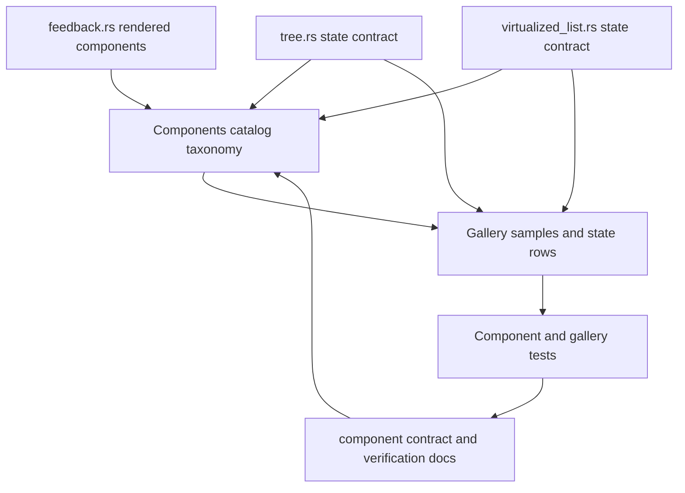

# Productize Feedback, Tree, and Virtualized List Primitives

## Summary

Move the newly landed feedback, tree, and virtualized-list primitives from exported code into the
Components gallery's product contract. Feedback becomes official rendered component coverage.
Tree and virtualized list become explicit state-contract surfaces until their renderers are designed.
The gallery gets separate feedback and state-contract sections so official rendered components and
pre-renderer contracts remain visually distinct.

---

## Problem Frame

`crates/ui_components/src/feedback.rs`, `crates/ui_components/src/tree.rs`, and
`crates/ui_components/src/virtualized_list.rs` are already public through the crate root and
prelude. They are not equally productized. `StatusCue` and `EmptyState` are concrete GPUI
components with resolved state, metrics, colors, roles, and stable root selectors. `TreeState` and
`VirtualizedListState` are renderer-neutral contracts. Tree models hierarchy, roving focus,
selection, toggle, and focus-target actions; virtualized list models long-list navigation,
activation, and viewport intent. Neither contract has an official render adapter yet.

The existing gallery contract currently treats catalog entries as official components,
adapter-only helpers, internal anatomy, or deferred work. That vocabulary is too coarse for these
new state-only exports. If the gallery marks them official too early, the component library appears
more complete than it is. If it hides them, future renderer work loses the durable contract and
test surface that made Table and Virtualizer reviewable.

---

## Requirements

**Feedback components**

- R1. `StatusCue` and `EmptyState` must be visible official feedback components with catalog
  entries, signals, a dedicated feedback section, stable gallery sample selectors, real component
  root selectors, state rows, and verification notes.
- R2. Feedback samples must exercise intent, size, role, metrics, and token intent metadata without
  introducing GPUI runtime types into resolved state.

**State contracts**

- R3. `TreeState` must be productized as a state contract that demonstrates visible flattening,
  disabled-item skipping, selected/focused metadata, expansion toggle payloads, and APG-style
  navigation results.
- R4. `VirtualizedListState` must be productized as a state contract that demonstrates active and
  selected indices, page navigation, activation payloads, viewport item count, default row metrics,
  overscan, and scroll-strategy labels.
- R5. The gallery catalog must distinguish renderer-neutral state contracts from official rendered
  components so state-only primitives are documented without implying a completed renderer.
- R6. State-contract entries must use a dedicated readout selector field and selector iterator so
  their selectors cannot satisfy the official completion gate by accident, and their signal checks
  must cover state, descriptor, helper, action, result, and payload types without requiring
  non-existent component signals.

**Boundary and verification**

- R7. Public export and headless-readiness tests must continue to prove the crate-root and prelude
  API while keeping public resolved state free of GPUI runtime/rendering types.
- R8. Documentation must explain that `VirtualizedListState` is a keyboard/navigation contract and
  `open_gpui_ui_core::VirtualizerState` remains the viewport range engine.

---

## Acceptance Examples

- AE1. Given the Components gallery catalog, when it renders feedback entries, `StatusCue` and
  `EmptyState` appear as official entries with matching signals and visible samples.
- AE2. Given the Components gallery state-contract section, when it renders tree samples, the
  readout shows only expanded visible rows, skips disabled rows for navigation, and reports the
  keyboard action for left, right, enter, and space from the focused item.
- AE3. Given the virtualized-list state-contract sample, when page navigation is resolved from an
  active row, the target index stays within range and activation is suppressed for disabled or empty
  states.
- AE4. Given public contract guard tests, when feedback, tree, and virtualized-list state structs
  are scanned, they do not contain `Window`, `App`, `Context`, `RenderOnce`, `IntoElement`,
  `ElementId`, `Entity`, focus handles, scroll handles, or callback storage.
- AE5. Given manual dogfood instructions, when a developer opens the Components page, the gallery
  explains which surfaces are official rendered components and which are state contracts waiting
  for renderer work.

---

## Key Technical Decisions

- **Add a state-contract catalog classification:** introduce a catalog status for public
  renderer-neutral contracts that deserve gallery visibility but are not official rendered
  components. This avoids overloading `internal-anatomy` and keeps the official component gate
  honest.
- **Promote feedback as official rendered components:** `StatusCue` and `EmptyState` already meet
  the adapter-first shape, so the plan completes their gallery, catalog, signals, tests, and docs
  rather than redesigning their API.
- **Keep tree renderer work deferred:** `TreeState` has enough behavior to document and test, but a
  full renderer needs focus handles, keyboard event wiring, disclosure affordances, and AccessKit
  tree mapping. Those choices should be designed after the state contract is visible.
- **Keep virtualized-list state separate from virtualizer range math:** `VirtualizedListState`
  models active-descendant navigation over a long logical list. `VirtualizerState` models viewport
  windows and measurement caches. This plan documents the relationship and avoids merging them
  until an adapter needs both.
- **Use the gallery as a contract display, not a fake renderer:** state-contract samples should
  render concise readouts and selector-backed sample cards. They should not pretend that a `Tree`
  or `VirtualizedList` component exists.

---

## High-Level Technical Design

The same gallery page should show both mature rendered components and pre-renderer state
contracts, but with different status labels and different conformance rules. Official entries
continue to require component and state signals plus official rendered sample selectors.
State-contract entries should expose a separate selector field and namespace for visible readouts,
not `sample_selector`, so they cannot satisfy the official completion gate by accident. Their
signals cover state, descriptor, helper, action, result, and payload types; they do not require
component signals for renderers that do not exist. They also require visible readouts and
documentation that names the missing adapter work.

---

## Implementation Units

### U1. Add catalog taxonomy for state contracts

**Goal:** Let the Components catalog classify public renderer-neutral state contracts without
marking them official components.

**Requirements:** R3, R4, R5, R6, R8

**Dependencies:** None

**Files:**

- Modify `examples/ui-foundation-gallery/src/pages/components.rs`
- Modify `examples/ui-foundation-gallery/tests/foundation_gallery.rs`
- Modify `docs/ui/component-contract.md`
- Modify `docs/verification.md`

**Approach:** Add a `StateContract` catalog status and a separate optional
`state_contract_selector` field on catalog entries. Keep `sample_selector` reserved for official
rendered components and make `official_sample_selector_pairs()` ignore state contracts. Add a
`state_contract_readout_pairs()` iterator for gallery tests, and make the catalog tests distinguish
official rendered samples from state-contract readouts. State-contract entries should have explicit
signal coverage for state, descriptor, helper, action, result, and payload types plus visible
gallery readouts, but no implied renderer completion or required component signal.

**Patterns to follow:**

- `ComponentCatalogStatus` and `ComponentCatalogEntry` in
  `examples/ui-foundation-gallery/src/pages/components.rs`
- `official_component_catalog_entries_have_signals_and_sample_selectors` in
  `examples/ui-foundation-gallery/tests/foundation_gallery.rs`
- The official Table gate wording in `docs/ui/component-contract.md`

**Test scenarios:**

- A state-contract catalog entry renders with a stable status label and does not count as official.
- Official catalog entries still require matching component and state signals plus a rendered
  official sample selector.
- State-contract catalog entries declare `state_contract_selector` values that are tested
  separately from official rendered samples and are not counted by `official_sample_selector_pairs()`.
- Non-official entries cannot declare official `sample_selector` values, including state-contract
  entries.
- The component contract describes state contracts as pre-renderer product surfaces, not internal
  anatomy.

**Verification:** The gallery metadata tests prove official completion and state-contract
classification are separate.

### U2. Promote StatusCue and EmptyState into the official gallery surface

**Goal:** Complete the feedback component slice as official rendered components.

**Requirements:** R1, R2, R7

**Dependencies:** U1

**Files:**

- Modify `examples/ui-foundation-gallery/src/pages/components.rs`
- Modify `examples/ui-foundation-gallery/src/pages/components/render.rs`
- Modify `examples/ui-foundation-gallery/tests/foundation_gallery.rs`
- Modify `crates/ui_components/tests/components.rs`
- Modify `docs/ui/component-contract.md`
- Modify `docs/verification.md`

**Approach:** Add a dedicated Feedback section to `COMPONENT_PAGE_JUMPS`,
`ComponentPageAnchors`, and the Components page render path. Add feedback samples that render
`StatusCue` and `EmptyState` from their resolved state. Add catalog entries, signals, stable
gallery wrapper selectors, real GPUI root selector smoke checks, and state rows for intent, role,
size, metrics, and optional description. Keep samples quiet and utilitarian so they match the
existing component gallery rather than becoming marketing-style empty-state blocks.

**Patterns to follow:**

- Primitive sample sections for `Progress`, `Skeleton`, and `Avatar`
- `feedback.rs` state methods and root debug selectors
- Public export tests around `Table` and low-state primitives

**Test scenarios:**

- `StatusCue` appears in `COMPONENT_CATALOG` as official with `StatusCueState` and a stable
  `gallery:component-status-cue-sample:*` wrapper selector.
- `EmptyState` appears in `COMPONENT_CATALOG` as official with `EmptyStateState` and a stable
  `gallery:component-empty-state-sample:*` wrapper selector.
- `SIGNALS` includes `StatusCue`, `StatusCueState`, `EmptyState`, `EmptyStateState`, and the roles
  used by their resolved state.
- Gallery smoke coverage finds the rendered root selectors from the real GPUI components,
  including `status-cue:*:root` and `empty-state:*:root`.
- Public export tests prove crate-root and prelude access for both components and their state
  types.
- Public contract scans keep `EmptyStateState` in the resolved-state guard while preserving the
  existing `EmptyState` component-name exception.
- Theme contract tests include feedback color intents so custom tokens stay observable.

**Verification:** Focused component tests and gallery metadata tests prove feedback is official
without adding runtime behavior beyond rendering.

### U3. Productize TreeState as a gallery state contract

**Goal:** Make tree behavior reviewable before committing to a full tree renderer.

**Requirements:** R3, R5, R6, R7

**Dependencies:** U1

**Files:**

- Modify `examples/ui-foundation-gallery/src/pages/components.rs`
- Modify `examples/ui-foundation-gallery/src/pages/components/render.rs`
- Modify `examples/ui-foundation-gallery/tests/foundation_gallery.rs`
- Modify `crates/ui_components/tests/components.rs`
- Modify `docs/ui/component-contract.md`
- Modify `docs/verification.md`

**Approach:** Add TreeState to a dedicated state-contract gallery section with a selector family
such as `gallery:component-tree-state-contract:*`. The sample should show flattened visible items,
depth, parent value, disabled metadata, selected/focused values, position-in-set, and resolved
keyboard actions. Treat Enter and Space as `TreeSelection` in this slice, not as a separate
activation payload. Add catalog and signal coverage for `TreeState`, `TreeItemDescriptor`,
`TreeItemState`, `TreeSelection`, `TreeToggle`, `TreeFocusTarget`, and `TreeKeyboardAction` without
introducing a public `Tree` renderer.

**Patterns to follow:**

- Existing resolved-state sample readouts for `SidebarState`, `ToolbarState`, and `Table`
- `tree_state_flattens_only_visible_expanded_items`
- `tree_keyboard_action_handles_expand_collapse_and_parent_focus`

**Test scenarios:**

- A collapsed branch hides descendants from the visible item list.
- Disabled visible items do not receive `position_in_set`, selection payloads, or toggle payloads.
- Up, Down, Home, and End navigation skips disabled visible items.
- Right on a collapsed branch resolves a toggle payload; right on an expanded branch focuses the
  first visible child.
- Left on an expanded branch resolves a collapse toggle; left on a child resolves parent focus.
- The gallery sample exposes the same selected/focused/visible counts as `TreeState::resolve`.
- The catalog entry uses `state_contract_selector`, not `sample_selector`, and the selector appears
  in the rendered Components page.
- Enter and Space resolve a `TreeSelection` payload rather than a separate activation payload.
- Public contract scans keep tree state structs free of GPUI runtime/rendering types.

**Verification:** State tests and gallery metadata tests prove the tree contract without claiming a
renderer.

### U4. Productize VirtualizedListState and clarify virtualizer boundaries

**Goal:** Make long-list keyboard and activation behavior visible while preserving the existing
virtualizer engine boundary.

**Requirements:** R4, R5, R6, R7, R8

**Dependencies:** U1

**Files:**

- Modify `examples/ui-foundation-gallery/src/pages/components.rs`
- Modify `examples/ui-foundation-gallery/src/pages/components/render.rs`
- Modify `examples/ui-foundation-gallery/tests/foundation_gallery.rs`
- Modify `crates/ui_components/tests/components.rs`
- Modify `docs/ui/component-contract.md`
- Modify `docs/verification.md`

**Approach:** Add VirtualizedListState to the dedicated state-contract gallery section with a
selector family such as `gallery:component-virtualized-list-state-contract:*`. The sample should
display item count, active index, selected index, viewport item count, row height, overscan count,
activation payload, and navigation targets. Document that this contract does not calculate rendered
ranges; range calculation remains `open_gpui_ui_core::VirtualizerState`, already used by Table.
Keep scroll strategy labels as semantic adapter inputs for future renderer work. Add
`state_contract_readout_pairs()` coverage for `VirtualizedListState`, `VirtualizedListActivation`,
`VirtualizedListMetrics`, `VirtualizedListScrollStrategy`, and `virtualized_list_navigation_target`
without requiring a `VirtualizedList` component signal.

**Patterns to follow:**

- `VirtualizerState` docs and Table gallery gate
- `virtualized_list_navigation_stays_inside_range`
- `virtualized_list_empty_or_disabled_state_has_no_targets`

**Test scenarios:**

- Home and End resolve to the first and last valid index.
- Up and Down clamp at list boundaries.
- PageUp and PageDown use `viewport_item_count.max(1)` and stay within range.
- Empty and disabled states expose no active index, no selected index, and no activation payload.
- Scroll strategy labels remain stable for `nearest`, `top`, `center`, and `bottom`.
- The gallery readout distinguishes logical list navigation from virtualizer range output.
- The catalog entry uses `state_contract_selector`, not `sample_selector`, and the selector appears
  in the rendered Components page.
- Public contract scans keep virtualized-list state structs free of GPUI runtime/rendering types.

**Verification:** Component state tests and gallery tests prove the contract without duplicating
the Table virtualizer implementation.

### U5. Close the documentation and verification loop

**Goal:** Keep the component contract, verification guide, and engineering memory aligned with the
new product surface.

**Requirements:** R5, R6, R7, R8

**Dependencies:** U2, U3, U4

**Files:**

- Modify `docs/ui/component-contract.md`
- Modify `docs/verification.md`
- Modify `docs/knowledge/engineering/current-state.md`
- Modify `docs/knowledge/engineering/log.md`

**Approach:** Document the new catalog taxonomy and the shipped surfaces. Add focused verification
notes for feedback official components and state-contract samples. Record that complete tree and
virtualized-list renderers remain deferred, and record the boundary between `VirtualizedListState`
and `VirtualizerState`.

**Patterns to follow:**

- Table and virtualizer contract wording in `docs/ui/component-contract.md`
- Components-page manual dogfood instructions in `docs/verification.md`
- Current engineering memory format

**Test scenarios:**

- The docs state that `StatusCue` and `EmptyState` are official rendered components.
- The docs state that `TreeState` and `VirtualizedListState` are state contracts, not official
  renderers.
- The verification guide names the automated gallery and component gates that protect these
  surfaces.
- Engineering memory points the next resumed session at renderer follow-up rather than repeating
  this productization work.

**Verification:** Documentation review confirms shipped behavior and deferred renderer work are not
mixed together.

---

## Scope Boundaries

### Active Scope

- Official gallery and catalog coverage for `StatusCue` and `EmptyState`.
- State-contract gallery and catalog coverage for `TreeState` and `VirtualizedListState`.
- Public export, signal, and resolved-state guard coverage for the new surfaces.
- Documentation and engineering memory updates for the new taxonomy and boundaries.

### Deferred to Follow-Up Work

- A full `Tree` GPUI renderer with focus handles, keyboard event wiring, disclosure controls, and
  AccessKit tree relationship mapping.
- A full `VirtualizedList` GPUI renderer with scroll handles, range materialization, row rendering,
  and active-descendant accessibility wiring.
- Merging `VirtualizedListState` and `VirtualizerState`, unless later renderer work proves the
  contracts should share a deeper abstraction.
- Virtualized tree data, async tree loading, typeahead over tree nodes, drag-and-drop hierarchy
  editing, and Table expanded/tree rows.

### Outside This Product's Identity

- Copying React, shadcn, DaisyUI, or TanStack hook APIs into the Rust component surface.
- Treating state-only contracts as completed official rendered components.
- Creating a new headless crate as part of this slice.

---

## Risks and Dependencies

| Risk | Impact | Mitigation |
| --- | --- | --- |
| State-only exports are mislabeled as official components | The catalog overstates component completion | Add a state-contract status and keep the official gate strict |
| Feedback samples become decorative marketing content | The gallery loses its dense component-library character | Use compact cards, real state rows, and existing feedback token intents |
| Tree renderer decisions leak into the state-contract slice | The plan becomes too broad and harder to verify | Defer renderer ownership and keep U3 focused on resolved state and sample readouts |
| Virtualized-list work duplicates `VirtualizerState` | Two range engines diverge | Document the navigation-vs-range boundary and keep range math in `ui_core::VirtualizerState` |
| Catalog tests become too permissive | Future incomplete components bypass official gates | Split official and state-contract assertions instead of weakening the official assertions |

---

## Documentation and Operational Notes

The implementation should update `docs/ui/component-contract.md` before relying on the new
taxonomy in tests. The contract is the source of truth for why a state-contract catalog entry is
not official completion. `docs/verification.md` should name the focused automated checks and the
manual Components page behavior to inspect after the implementation passes.

This work should not run external research. The local component contract, prior Table/Virtualizer
roadmap, and current gallery conformance surface provide the load-bearing patterns.

---

## Sources and Research

- `crates/ui_components/src/feedback.rs`
- `crates/ui_components/src/tree.rs`
- `crates/ui_components/src/virtualized_list.rs`
- `crates/ui_components/src/lib.rs`
- `crates/ui_components/src/prelude.rs`
- `crates/ui_components/tests/components.rs`
- `examples/ui-foundation-gallery/src/pages/components.rs`
- `examples/ui-foundation-gallery/src/pages/components/render.rs`
- `examples/ui-foundation-gallery/tests/foundation_gallery.rs`
- `docs/ui/component-contract.md`
- `docs/verification.md`
- `docs/knowledge/engineering/current-state.md`
- `docs/knowledge/engineering/log.md`
- `docs/plans/2026-06-21-001-feat-ui-table-virtualizer-roadmap-plan.md`
