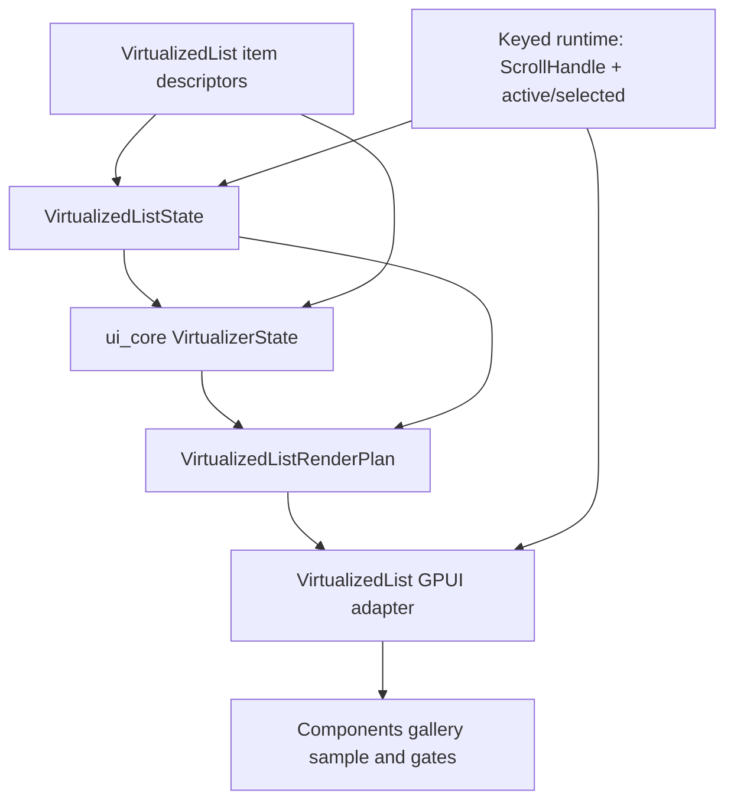
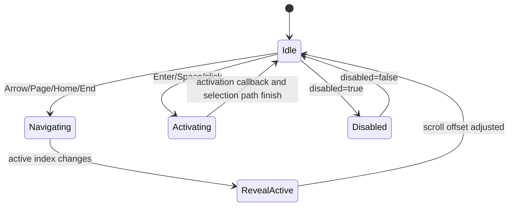

# Open GPUI VirtualizedList Renderer

## Summary

Build `VirtualizedList` as the next official GPUI component by keeping `VirtualizedListState` as
the renderer-neutral keyboard/navigation contract and using `open_gpui_ui_core::VirtualizerState`
for rendered range calculation. The first slice should ship a fixed-height, vertical list renderer
with stable item keys, active/selected metadata, keyboard navigation, activation callbacks, and
gallery scroll containment.

---

## Problem Frame

`VirtualizedListState` is currently visible in the Components gallery only as a `state-contract`
entry. That is correct for the productization slice, but it leaves a gap between the keyboard
contract and the concrete list renderer future components will want to reuse.

The project already proved the core pieces in adjacent code. `Table` composes `ScrollArea`,
`ScrollHandle`, and `VirtualizerState::resolve_fixed_window` for long vertical content. `Listbox`,
`Select`, and `Command` prove the collection-navigation and activation vocabulary. The remaining
work is to combine those patterns into a standalone virtualized list surface without pretending the
future `Tree` renderer is already solved.

---

## Requirements

**Component Contract**

- R1. Keep `VirtualizedListState` free of GPUI runtime and rendering types.
- R2. Add a concrete `VirtualizedList` adapter whose public API uses stable item descriptors,
  active and selected indices, size metrics, and activation or selection callbacks.
- R3. Resolve a testable `VirtualizedListRenderPlan` before rendering so row keys, roles, active
  state, selected state, virtual positions, and overscan bounds can be verified without a GPUI
  window.

**Virtualization and Input**

- R4. Use `open_gpui_ui_core::VirtualizerState` for rendered range math and keep concrete
  `ScrollHandle` ownership inside the adapter runtime.
- R5. Support APG-style Home, End, Up, Down, PageUp, PageDown, Enter, and Space using the existing
  `VirtualizedListState` navigation and activation helpers.
- R6. Scroll active rows into view with explicit fixed-height offset calculation because virtualized
  row elements are not stable full children for `ScrollHandle::scroll_to_item`.

**Productization**

- R7. Promote `VirtualizedList` from `state-contract` to `official` only after crate exports,
  catalog metadata, rendered sample selectors, signals, docs, and gallery runtime smoke coverage
  are aligned.
- R8. Keep `Tree` renderer work deferred; it may reuse `VirtualizedList` later, but this plan must
  not add tree expansion or hierarchical row behavior.

---

## Acceptance Examples

- AE1. Given a 10k-item `VirtualizedList` sample, when the user scrolls inside its viewport, row 0
  leaves the rendered window, a later row enters it, and the outer Components page does not move.
- AE2. Given an active row near the top of a long list, when the user presses PageDown, active state
  moves by the viewport item count and the adapter scrolls the new active row into view.
- AE3. Given a selected row and a different active row, when the user presses Enter or Space, the
  activation payload reports the active index and selection metadata updates only through the
  adapter's documented state path.
- AE4. Given `VirtualizedList` is promoted to official, when catalog conformance runs,
  `VirtualizedList`, `VirtualizedListState`, `COMPONENT_CATALOG`, `SIGNALS`, and
  `gallery:component-virtualized-list-sample:{id}` selectors stay aligned.

---

## Key Technical Decisions

- **Compose the two existing contracts:** `VirtualizedListState` remains the keyboard and selection
  state contract; `VirtualizerState` remains the range and measurement engine. The adapter should
  not duplicate either concern in render code.
- **Use stable descriptors instead of raw strings:** a `VirtualizedListItem`-style descriptor should
  carry a stable key, label, and disabled metadata so debug selectors and virtualizer item keys do
  not drift when labels change.
- **Resolve render plans before elements:** a `VirtualizedListRenderPlan` should mirror the Table
  pattern by exposing rows, roles, virtual positions, visible counts, overscan counts, and
  accessibility metadata for unit tests.
- **Own scroll in keyed runtime:** the adapter should allocate a persistent `ScrollHandle` in keyed
  runtime, read live scroll offset during render, and pass that offset into `VirtualizerState`.
- **Calculate scroll-to-active directly:** `ScrollHandle::scroll_to_item` targets concrete child
  positions, while a virtualized list renders only the overscan window. The v0 adapter should use
  fixed row height, viewport extent, total size, and `VirtualizedListScrollStrategy` to compute the
  target offset.
- **Defer `UniformList` replacement:** GPUI's `uniform_list` has useful scroll strategy ideas, but
  the current UI component stack already proved `ScrollArea + VirtualizerState` through Table. A
  renderer swap should be a later measured refactor, not the first official component slice.

---

## High-Level Technical Design

The render plan is the boundary between semantic state and concrete GPUI elements. It receives
descriptors, resolved list state, and virtualizer output, then returns only the rows that should be
rendered after overscan.

Keyboard navigation mutates adapter runtime first, then requests a scroll reveal for the new active
index. Disabled state blocks navigation and activation without losing the item descriptors.

---

## Implementation Units

### U1. Extend the virtualized-list contract for rendering

**Goal:** Add the descriptor and render-plan vocabulary needed by a concrete renderer while keeping
public state renderer-neutral.

**Requirements:** R1, R2, R3, R6

**Dependencies:** None

**Files:**

- Modify `crates/ui_components/src/virtualized_list.rs`
- Modify `crates/ui_components/tests/components.rs`

**Approach:** Add item descriptors, row render-plan structs, role metadata, stable render keys, and
a fixed-height scroll target helper that maps `VirtualizedListScrollStrategy` plus viewport metrics
to a non-negative scroll offset. Keep GPUI `ScrollHandle`, callbacks, and element ids out of public
state structs so `public_resolved_state_contracts_avoid_gpui_runtime_types` remains meaningful.

**Patterns to follow:**

- `crates/ui_components/src/table.rs`
- `crates/ui_core/src/virtualizer.rs`
- `crates/ui_components/tests/components.rs`

**Test scenarios:**

- A 10k-item render plan resolves only visible rows plus overscan.
- Stable item keys become virtualizer keys and debug-selector keys.
- Active and selected indices map to row metadata after the list scrolls into the middle.
- Duplicate descriptor keys are disambiguated with index-qualified render keys while preserving the
  original descriptor key for application-facing metadata.
- Top, Center, Bottom, and Nearest scroll strategies produce clamped non-negative target offsets.
- Public virtualized-list state and render-plan contracts do not contain GPUI runtime or callback
  types.

**Verification:** Component tests can prove row planning, scroll target math, and public contract
cleanliness without opening a GPUI window.

### U2. Implement the GPUI `VirtualizedList` adapter

**Goal:** Render the contract as a concrete, keyboard-operable, scroll-contained GPUI component.

**Requirements:** R2, R4, R5, R6

**Dependencies:** U1

**Files:**

- Modify `crates/ui_components/src/virtualized_list.rs`
- Modify `crates/ui_components/src/lib.rs`
- Modify `crates/ui_components/src/prelude.rs`
- Modify `crates/ui_components/tests/components.rs`

**Approach:** Follow the Table adapter shape: allocate a keyed runtime with a persistent
`ScrollHandle`, derive live scroll offset from that handle, resolve `VirtualizerState`, and render
absolute-positioned rows inside a `ScrollArea`. Wire keyboard input through
`VirtualizedListState::navigation_target` and `activation_for_key`. Use `Role::ListBox` and
`Role::ListBoxOption` until a different collection role is added to the neutral vocabulary.

**Patterns to follow:**

- `crates/ui_components/src/table.rs`
- `crates/ui_components/src/scroll_area.rs`
- `crates/ui_components/src/listbox.rs`
- `crates/ui_components/src/command.rs`

**Test scenarios:**

- `VirtualizedList::render_plan` reports listbox and option roles, row count, active row,
  selected row, visible count, and overscan count.
- Keyboard navigation skips disabled component state and clamps Home, End, PageUp, and PageDown.
- Enter and Space emit `VirtualizedListActivation` for the active row.
- Runtime scroll offset wins over any initial scroll default after the user scrolls.
- The crate root and prelude export `VirtualizedList` only after the component satisfies the
  official gate.

**Verification:** Focused component tests prove adapter planning and public exports before gallery
promotion.

### U3. Promote the gallery sample from readout to rendered component

**Goal:** Replace the state-contract-only gallery entry with real `VirtualizedList` samples and
official catalog metadata.

**Requirements:** R7

**Dependencies:** U2

**Files:**

- Modify `examples/ui-foundation-gallery/src/pages/components.rs`
- Modify `examples/ui-foundation-gallery/src/pages/components/render.rs`
- Modify `examples/ui-foundation-gallery/tests/foundation_gallery.rs`

**Approach:** Add `VirtualizedList` to the official catalog with matching `SIGNALS` and rendered
sample selectors. Keep the existing state-contract readout until the official sample proves the
renderer, then remove the guard that asserts `VirtualizedList` must not appear in `SIGNALS`. Add a
10k-item sample and one compact selected/active sample so both range behavior and state metadata
are visible.

**Patterns to follow:**

- `examples/ui-foundation-gallery/src/pages/components.rs`
- `examples/ui-foundation-gallery/src/pages/components/render.rs`
- `examples/ui-foundation-gallery/tests/foundation_gallery.rs`

**Test scenarios:**

- Official catalog conformance finds `VirtualizedList`, `VirtualizedListState`, matching signals,
  and at least one `gallery:component-virtualized-list-sample:{id}` selector.
- The state-contract readout no longer claims that a completed renderer is absent after promotion.
- A short viewport can scroll to the VirtualizedList section without breaking page scroll reset.
- The 10k-item sample exposes item count, active index, selected index, visible count, and overscan
  metadata.

**Verification:** Gallery metadata tests prove the catalog and sample selectors stay aligned.

### U4. Add gallery runtime smoke coverage

**Goal:** Prove the new renderer behaves correctly inside the full Components page.

**Requirements:** R4, R5, R6, R7

**Dependencies:** U3

**Files:**

- Modify `examples/ui-foundation-gallery/tests/foundation_gallery.rs`
- Modify `docs/verification.md`

**Approach:** Add smoke tests that mirror the Table scroll containment proof and add a keyboard
path unique to VirtualizedList. Keep assertions on stable debug selectors and bounds rather than
pixel-perfect screenshots.

**Patterns to follow:**

- `components_gallery_smoke_table_scroll_stays_inside_sample`
- `components_gallery_smoke_scroll_area_samples_scroll_inside_page`
- `components_gallery_smoke_scrolls_short_viewport_and_resets_page_on_navigation`

**Test scenarios:**

- Wheel input inside the VirtualizedList viewport changes the rendered row window and does not move
  the outer Components page.
- PageDown moves the active row by the resolved viewport item count and reveals the new active row.
- Enter or Space on the active row records the expected activation payload in the sample state.
- Disabled or empty samples do not navigate, activate, or render misleading selected metadata.

**Verification:** Runtime gallery smokes cover nested scroll containment, keyboard navigation, and
activation behavior.

### U5. Update docs and engineering memory

**Goal:** Record the official renderer boundary and the remaining deferred work.

**Requirements:** R7, R8

**Dependencies:** U4

**Files:**

- Modify `docs/ui/component-contract.md`
- Modify `docs/verification.md`
- Modify `docs/knowledge/engineering/current-state.md`
- Modify `docs/knowledge/engineering/log.md`

**Approach:** Move `VirtualizedList` from state-contract language into the official component
completion section after the renderer ships. Keep `TreeState` as a state contract and document that
Tree renderer work should reuse the list renderer only after this slice proves scroll and active
row behavior.

**Patterns to follow:**

- `docs/ui/component-contract.md`
- `docs/verification.md`
- `docs/knowledge/engineering/current-state.md`
- `docs/knowledge/engineering/log.md`

**Test scenarios:**

- Documentation names the completed `VirtualizedList` renderer without implying `Tree` is complete.
- Verification docs list the new component, catalog, keyboard, and scroll gates.
- Engineering memory points the next follow-up at `Tree` renderer or virtualized-list refinement,
  not at re-planning the same boundary.

**Verification:** Docs and memory match the behavior shipped by U1 through U4.

---

## Scope Boundaries

### Active Scope

- Fixed-height vertical `VirtualizedList` renderer.
- Stable item descriptors, render plans, active/selected metadata, and activation payloads.
- `ScrollArea + ScrollHandle + VirtualizerState` integration.
- Components gallery promotion and runtime smoke tests.

### Deferred to Follow-Up Work

- `Tree` renderer and hierarchical expansion behavior.
- Variable-height measurement feedback from rendered rows.
- Multi-select, range select, drag selection, and typeahead.
- Replacing the adapter with GPUI `uniform_list`.
- Two-dimensional grid virtualization or pinned regions.

### Outside This Product's Identity

- Copying TanStack Virtual or GPUI `uniform_list` APIs directly.
- Adding browser DOM assumptions or React-style hook APIs.
- Storing GPUI `ScrollHandle`, `Window`, `App`, callbacks, or element ids in resolved state.

---

## Risks and Dependencies

| Risk | Impact | Mitigation |
| --- | --- | --- |
| Scroll-to-active fights the live viewport offset | Keyboard navigation feels broken after user scrolls | Treat the live `ScrollHandle` offset as the source of truth and apply explicit reveal offsets only after navigation changes active state |
| Item identity uses labels instead of keys | Debug selectors and virtualizer snapshots drift when labels change | Require stable descriptor keys and test key-to-row mapping directly |
| The gallery promotes the component before runtime proof exists | `VirtualizedList` appears official while scroll or keyboard behavior is still untested | Keep the state-contract classification until U3 and U4 pass together |
| The slice grows into Tree work | The first renderer becomes too broad and harder to review | Keep tree expansion, indentation, and hierarchical keyboard behavior deferred |

---

## Sources and Research

- `crates/ui_components/src/virtualized_list.rs`
- `crates/ui_components/src/table.rs`
- `crates/ui_components/src/scroll_area.rs`
- `crates/ui_components/src/listbox.rs`
- `crates/ui_components/src/command.rs`
- `crates/ui_core/src/virtualizer.rs`
- `crates/gpui/src/elements/div.rs`
- `crates/gpui/src/elements/uniform_list.rs`
- `examples/ui-foundation-gallery/src/pages/components.rs`
- `examples/ui-foundation-gallery/src/pages/components/render.rs`
- `examples/ui-foundation-gallery/tests/foundation_gallery.rs`
- `docs/plans/2026-06-21-001-feat-ui-table-virtualizer-roadmap-plan.md`
- `docs/plans/2026-06-22-001-feat-ui-feedback-tree-virtual-list-productization-plan.md`
- `docs/adr/0009-open-gpui-table-and-virtualizer-product-shape.md`
- `repo-ref/tanstack-virtual/docs/api/virtualizer.md`
