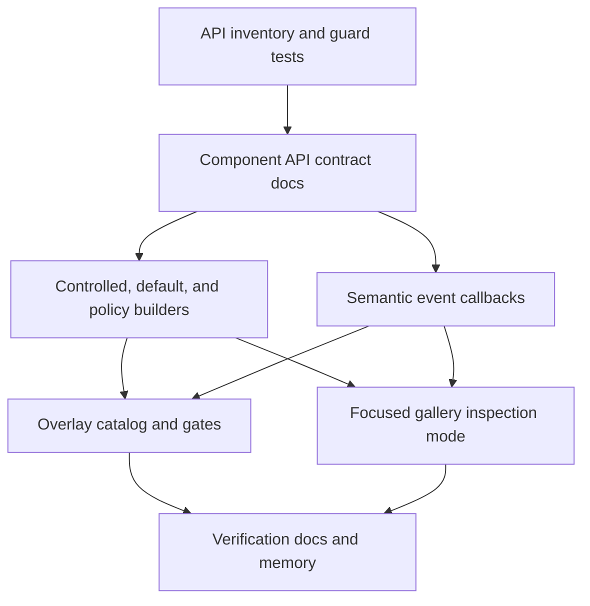
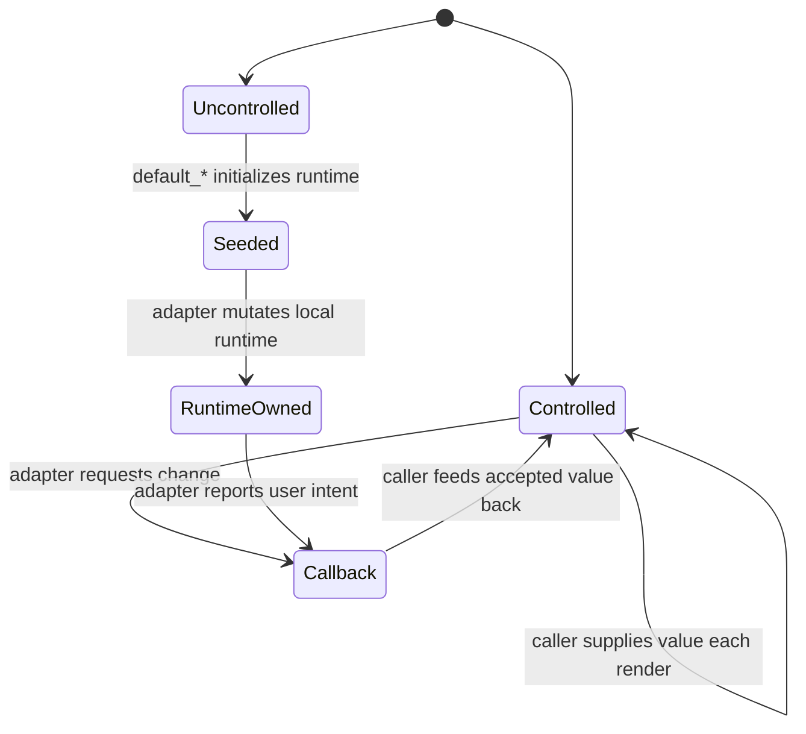

# Open GPUI UI API Stability and Overlay Productization

## Summary

Stabilize the public component API now that the catalog has real rendered components across input,
overlay, shell, table, tree, and virtualized-list families. The next slice should make controlled
versus uncontrolled builders explicit, standardize event callback names and payloads, promote the
Overlay page into the same productized contract posture as Components, and make the gallery easier
to inspect one component family at a time.

---

## Problem Frame

The component library now has enough surface area that informal API conventions are becoming a
maintenance risk. Several patterns are already visible: TextInput has `value(...).on_change(...)`,
overlay components use `open(...)`, `default_open(...)`, and `on_open_change(...)`, selection
families use `selected(...)`, `active(...)`, `focused(...)`, `on_select(...)`, and
`on_selection_change(...)`, and action surfaces use `on_activate(...)`, `on_toggle(...)`, or
pointer-shaped `on_click(...)`.

Those names are not yet governed by a single contract. The risky ambiguity is whether a builder is
a controlled render input, a one-time runtime seed, or a policy hint. That ambiguity matters more in
a self-drawn engine because adapters own runtime state, focus handles, scroll handles, and redraw
timing. If the public API does not say which side owns a value, gallery behavior and downstream app
state can drift.

Overlay components also live mostly on the Overlay page while the Components catalog owns the more
formal official-component gate. That split is acceptable for page organization, but the Overlay
family should still have catalog metadata, sample selectors, and verification gates that make its
official product status explicit.

---

## Requirements

**Public API contract**

- R1. Official components must classify public builder inputs as controlled values, default seeds,
  or policy hints, and the docs must define those terms.
- R2. Controlled builders must use direct semantic names such as `value`, `open`, `selected`,
  `active`, `focused`, `checked`, `pressed`, `collapsed`, `active_index`, and `selected_index`.
- R3. One-time runtime seeds must use `default_*`; policy hints that are not value ownership must
  use explicit names such as `initial_focus_intent`.
- R4. Event callbacks must follow a small semantic vocabulary: `on_change`, `on_open_change`,
  `on_selection_change`, `on_select`, `on_activate`, and `on_toggle`, with documented payload
  expectations.
- R5. Callback storage, focus handles, scroll handles, GPUI element ids, and runtime controllers
  must remain adapter-owned and must not enter resolved state.

**Overlay productization**

- R6. Overlay components must have a visible product contract comparable to the Components catalog:
  family metadata, state signals, rendered selectors, behavior gates, and focused smoke coverage.
- R7. Overlay default-open samples may report default-open state, but they must not visually block
  page load, scroll, or navigation.

**Gallery discoverability**

- R8. The Components gallery must let a developer inspect a single component family without
  scrolling through the full page every time.
- R9. Component-family filtering or focused viewing must preserve directory jumps, page scroll
  reset on navigation, and nested scroll containment for Table, Tree, VirtualizedList, ScrollArea,
  Sidebar, and vertical Tabs.
- R10. Documentation, verification notes, and engineering memory must stay aligned with the
  stabilized API and gallery product contract.

---

## Key Technical Decisions

- **Controlled names mean render-frame ownership:** direct names such as `value`, `open`, and
  `selected` should be treated as the value supplied by the caller for the current render. If the
  adapter owns mutable runtime state, the public seed must be named `default_*`.
- **Policy hints stay separate from owned values:** `initial_focus_intent` and overlay placement
  inputs describe adapter behavior. They should not be renamed into `default_*` because they do not
  seed an owned value.
- **Callbacks are semantic, not device-first:** pointer-specific names such as `on_click` can
  remain only where the component is a command button and the event itself is the action. Stateful
  components should prefer semantic callbacks that name the state transition or payload.
- **Audit before renaming broadly:** the first implementation unit should build an explicit
  inventory and guard tests. Broad API renames should be driven by that inventory instead of by a
  hand-edited list in one module.
- **Overlay gets its own catalog surface:** the Overlay page should remain a separate dogfood page,
  but it needs official metadata and selector gates so overlay components are productized rather
  than merely demonstrated.
- **Gallery focus mode is a product feature:** the Components page is now too large to use as only
  a linear document. A catalog-driven focused view should make one component family inspectable
  while preserving the full-page conformance mode.

---

## High-Level Technical Design

The API contract is the shared source of truth. Builder and callback changes should land only after
the inventory proves which components already follow the rule and which components need breaking
cleanup.

This distinction should be visible in docs and tests. It is acceptable for a component to support
both modes, but the public method names must tell the reader which mode they are using.

---

## Implementation Units

### U1. Add Public API Inventory and Guard Tests

**Goal:** Create an explicit, test-backed inventory of official component builders and callbacks so
API stabilization is based on the current product surface.

**Requirements:** R1, R4, R5

**Dependencies:** None

**Files:**

- Modify `crates/ui_components/tests/components.rs`
- Modify `docs/ui/component-contract.md`
- Modify `docs/verification.md`

**Approach:** Add an inventory test or helper table that classifies each official component's
public interaction API. The table should record controlled builders, default seed builders, policy
hint builders, callbacks, callback payload type names, and whether the resolved state stores only
renderer-neutral data. This is a contract test, not a source parser; it should be small enough to
review and strict enough to fail when a new component lands without classification.

**Patterns to follow:**

- `adapter_only_public_surfaces_match_allowlist` in `crates/ui_components/tests/components.rs`
- `official_component_catalog_entries_have_signals_and_sample_selectors` in
  `examples/ui-foundation-gallery/tests/foundation_gallery.rs`
- `docs/ui/component-contract.md`

**Test scenarios:**

- Each official stateful component has at least one API classification entry.
- Components with `default_*` builders also document the matching owned runtime value.
- Components with callbacks document the payload type and do not store callback types in resolved
  state.
- Adapter-only helper APIs remain classified under `open_gpui_ui_components::gpui_adapter`.
- Adding a new official catalog entry without an API classification fails a focused test.

**Verification:** Focused component tests prove the inventory and the public resolved-state guard
are both active.

### U2. Normalize Controlled, Default, and Policy Builder Semantics

**Goal:** Make direct builder names controlled render inputs and move one-time runtime seeds to
`default_*` names where the adapter owns state.

**Requirements:** R1, R2, R3, R5

**Dependencies:** U1

**Files:**

- Modify `crates/ui_components/src/text_input.rs`
- Modify `crates/ui_components/src/popover.rs`
- Modify `crates/ui_components/src/dialog.rs`
- Modify `crates/ui_components/src/alert_dialog.rs`
- Modify `crates/ui_components/src/sheet.rs`
- Modify `crates/ui_components/src/hover_card.rs`
- Modify `crates/ui_components/src/menu.rs`
- Modify `crates/ui_components/src/context_menu.rs`
- Modify `crates/ui_components/src/select.rs`
- Modify `crates/ui_components/src/combobox.rs`
- Modify `crates/ui_components/src/command.rs`
- Modify `crates/ui_components/src/tabs.rs`
- Modify `crates/ui_components/src/radio.rs`
- Modify `crates/ui_components/src/sidebar.rs`
- Modify `crates/ui_components/src/tree.rs`
- Modify `crates/ui_components/src/virtualized_list.rs`
- Modify `crates/ui_components/tests/components.rs`
- Modify `examples/ui-foundation-gallery/src/pages/components.rs`
- Modify `examples/ui-foundation-gallery/src/pages/overlay.rs`
- Modify `examples/ui-foundation-gallery/tests/foundation_gallery.rs`
- Modify `docs/ui/component-contract.md`

**Approach:** Start from the inventory. Keep existing correct patterns, especially
`TextInput::value(...).on_change(...)` and overlay `open/default_open/on_open_change`. Where a
builder currently acts as a first-render seed but is named like a controlled value, either make it
controlled or rename the seed to `default_*`. Preserve policy hint names such as
`initial_focus_intent`, `placement_side`, and `scroll_strategy` because they do not transfer value
ownership.

**Patterns to follow:**

- `TextInput::value(...).on_change(...)` in `crates/ui_components/src/text_input.rs`
- Overlay open-mode components in `crates/ui_components/src/popover.rs` and
  `crates/ui_components/src/dialog.rs`
- Selection state methods in `crates/ui_components/src/listbox.rs`,
  `crates/ui_components/src/select.rs`, and `crates/ui_components/src/tree.rs`

**Test scenarios:**

- Controlled `value`, `open`, `selected`, `active`, and `focused` inputs override adapter runtime
  state on every render.
- `default_open`, `default_selected`, `default_active`, or equivalent default builders seed
  adapter runtime only once when the component is uncontrolled.
- `initial_focus_intent` remains a policy hint and does not imply a controlled focus target.
- Gallery samples that need runtime interaction own sample state and feed controlled values back
  through builders after callbacks.
- Resolved state remains free of `Window`, `App`, `Context`, `RenderOnce`, `IntoElement`,
  `ElementId`, `Entity`, focus handles, scroll handles, and callbacks.

**Verification:** Component runtime tests prove controlled feedback loops and uncontrolled default
seeding for representative input, overlay, selection, tree, and virtualized-list components.

### U3. Standardize Callback Names and Payload Semantics

**Goal:** Make event callback names predictable across component families without losing
domain-specific payloads.

**Requirements:** R4, R5

**Dependencies:** U1, U2

**Files:**

- Modify `crates/ui_components/src/button.rs`
- Modify `crates/ui_components/src/icon_button.rs`
- Modify `crates/ui_components/src/switch.rs`
- Modify `crates/ui_components/src/checkbox.rs`
- Modify `crates/ui_components/src/toggle.rs`
- Modify `crates/ui_components/src/listbox.rs`
- Modify `crates/ui_components/src/select.rs`
- Modify `crates/ui_components/src/combobox.rs`
- Modify `crates/ui_components/src/command.rs`
- Modify `crates/ui_components/src/menu.rs`
- Modify `crates/ui_components/src/context_menu.rs`
- Modify `crates/ui_components/src/tabs.rs`
- Modify `crates/ui_components/src/radio.rs`
- Modify `crates/ui_components/src/sidebar.rs`
- Modify `crates/ui_components/src/tree.rs`
- Modify `crates/ui_components/src/virtualized_list.rs`
- Modify `crates/ui_components/tests/components.rs`
- Modify `examples/ui-foundation-gallery/src/pages/components.rs`
- Modify `examples/ui-foundation-gallery/src/pages/overlay.rs`
- Modify `docs/ui/component-contract.md`

**Approach:** Define callback meaning in the contract before renaming APIs. Use `on_change` for
scalar input changes, `on_open_change` for overlay visibility requests, `on_selection_change` for
components that own persistent selected state, `on_select` for item commit events that may be
action-like, `on_activate` for activation without persistent selection ownership, and `on_toggle`
for expansion or tri-state toggle payloads. Remove old callback names rather than keeping
compatibility aliases when a rename is required.

**Patterns to follow:**

- `TextInput::on_change`
- Overlay `on_open_change`
- `RadioGroup::on_selection_change`
- `VirtualizedList::on_activate`
- `Tree::on_select` and `Tree::on_toggle` as current payload examples to classify

**Test scenarios:**

- Scalar controls emit `on_change` payloads after user interaction and keep the accepted value
  caller-owned when controlled.
- Persistent selection components emit `on_selection_change` with stable selection payloads.
- Menu-like action components emit `on_select` or `on_activate` without implying persistent
  selected state.
- Expansion components emit `on_toggle` with the item value and target expanded state.
- Gallery runtime logs use the standardized callback names and still prove interaction order.

**Verification:** Focused component runtime tests prove renamed callbacks dispatch the same user
intent with clearer semantics.

### U4. Productize Overlay Catalog Metadata and Gates

**Goal:** Give overlay components the same official product posture as Components catalog entries
without merging the pages.

**Requirements:** R6, R7, R10

**Dependencies:** U1, U2, U3

**Files:**

- Modify `examples/ui-foundation-gallery/src/pages/overlay.rs`
- Modify `examples/ui-foundation-gallery/src/pages/overlay/render.rs` if split during execution
- Modify `examples/ui-foundation-gallery/tests/foundation_gallery.rs`
- Modify `docs/ui/component-contract.md`
- Modify `docs/verification.md`

**Approach:** Add an Overlay family catalog or metadata table that lists Tooltip, HoverCard,
Popover, Dialog, AlertDialog, Sheet, Menu, and ContextMenu with status, state type, sample selector,
behavior gates, and signal coverage. Keep the Overlay page as the interaction dogfood page. Add
tests equivalent to Components catalog conformance so overlay samples cannot drift from state
signals or rendered selectors.

**Patterns to follow:**

- `COMPONENT_CATALOG` and `ComponentCatalogEntry` in
  `examples/ui-foundation-gallery/src/pages/components.rs`
- Overlay sample functions in `examples/ui-foundation-gallery/src/pages/overlay.rs`
- Overlay runtime smoke tests in `examples/ui-foundation-gallery/tests/foundation_gallery.rs`

**Test scenarios:**

- Every official overlay family has a catalog entry with component/state signals and at least one
  rendered sample selector.
- Default-open overlay contract rows remain visible without rendering a blocking modal or floating
  layer at page load.
- Overlay smoke tests continue to cover outside press, Escape, focus restoration, menu roving
  focus, and ContextMenu point anchoring.
- Adding an overlay sample without catalog metadata or a selector fails a gallery test.

**Verification:** Focused overlay gallery metadata and runtime smoke tests prove the page is a
productized conformance surface.

### U5. Add Focused Component-Family Viewing to the Gallery

**Goal:** Make the Components page usable for one-family inspection while preserving the full
conformance page.

**Requirements:** R8, R9, R10

**Dependencies:** U1

**Files:**

- Modify `examples/ui-foundation-gallery/src/pages/components.rs`
- Modify `examples/ui-foundation-gallery/src/pages/components/render.rs`
- Modify `examples/ui-foundation-gallery/src/shell.rs` if the focused view needs shell-level state
- Modify `examples/ui-foundation-gallery/tests/foundation_gallery.rs`
- Modify `docs/verification.md`

**Approach:** Add a catalog-driven focused view or section filter with an explicit "all
components" mode. The focused view should render the selected component family, its state readouts,
conformance notes, and relevant runtime log without forcing the developer through the full
Components page. Keep the existing directory and full-page mode because it is still the best
integration proof.

**Patterns to follow:**

- Existing Components directory and `COMPONENT_PAGE_JUMPS`
- `ComponentPageAnchors` in `examples/ui-foundation-gallery/src/pages/components/render.rs`
- Existing compact-shell and directory-jump smoke tests

**Test scenarios:**

- Selecting a catalog row or focused-view control shows only the requested component family plus
  its local metadata.
- Returning to "all components" restores the full page and preserves the section directory.
- Switching away from Components and back resets page scroll as it does today.
- Focused mode does not break nested scroll containment for Table, Tree, VirtualizedList,
  ScrollArea, Sidebar, or vertical Tabs.
- The fixed directory remains independently scrollable on compact windows.

**Verification:** Gallery smoke tests cover focused mode, all-mode restoration, page scroll reset,
and one nested-scroll sample inside focused mode.

### U6. Update Documentation, Verification, and Engineering Memory

**Goal:** Make the stabilized API and productized overlay/gallery behavior durable for later
sessions.

**Requirements:** R10

**Dependencies:** U1-U5

**Files:**

- Modify `docs/ui/component-contract.md`
- Modify `docs/verification.md`
- Modify `docs/knowledge/engineering/current-state.md`
- Modify `docs/knowledge/engineering/log.md`

**Approach:** Document the API ownership model, callback vocabulary, overlay catalog gate, and
focused-gallery verification path. Update engineering memory after each medium slice so a later
agent can resume from the actual API decisions instead of re-auditing the whole component surface.

**Patterns to follow:**

- Current `Public API`, `Overlay Behavior`, and `Gallery Conformance Surface` sections in
  `docs/ui/component-contract.md`
- Existing focused verification notes in `docs/verification.md`
- Existing engineering memory format in `docs/knowledge/engineering/current-state.md`

**Test scenarios:**

- Documentation describes controlled, uncontrolled, default seed, and policy hint terms.
- Documentation maps every standardized callback name to its intended use.
- Verification docs name the focused commands for API inventory, overlay catalog, and gallery
  focused-view gates.
- Engineering memory points the next resumed session at the latest completed unit and verification
  evidence.

**Verification:** Engineering wiki validation passes, and `git diff --check` reports no whitespace
issues.

---

## Scope Boundaries

### Active Scope

- Public API classification and guard tests for official UI components.
- Breaking cleanup of ambiguous builder and callback names where the inventory proves drift.
- Overlay family catalog metadata and sample-selector gates.
- Components gallery focused-family inspection mode.
- Documentation, verification, and engineering memory updates.

### Deferred to Follow-Up Work

- Adding entirely new component families beyond the overlay/productized catalog already present.
- Tree async loading, typeahead, drag-and-drop hierarchy editing, or virtualized tree data.
- Table advanced features such as pinned columns, grouped rows, aggregation, and two-dimensional
  virtualization.
- A standalone `open-gpui-ui-headless` crate.
- Screenshot or image-diff regression infrastructure.

### Outside This Product's Identity

- Copying React hook, shadcn, DaisyUI, or TanStack APIs directly into the Rust component surface.
- Keeping deprecated compatibility aliases after a deliberate breaking rename.
- Moving GPUI runtime handles, callbacks, element ids, or controllers into resolved-state
  contracts.

---

## System-Wide Impact

This plan intentionally touches broad public API. The benefit is long-term predictability: app
authors can tell whether a component value is caller-owned, adapter-owned, or only a policy hint
from the method name. The cost is breaking import and method-name churn for unstable component
APIs. The project has already accepted breaking cleanup during productization, so the plan should
prefer a clean contract over compatibility aliases.

The gallery impact is also broad. Focused component-family viewing should make day-to-day dogfood
faster, while the existing full Components page remains the integration stress test for scrolling,
focus, and composition.

---

## Risks and Dependencies

| Risk | Impact | Mitigation |
| --- | --- | --- |
| Broad API renames create noisy diffs | Reviewers may miss behavior changes | Land the inventory first, then execute renames in family-sized units with focused tests |
| Controlled/default semantics are applied inconsistently | Components still behave differently after the cleanup | Add guard tests and docs before changing behavior |
| Gallery focused mode hides integration regressions | One-family inspection could replace full-page dogfood | Keep all-components mode and existing full-page smoke tests as mandatory gates |
| Overlay catalog duplicates Components catalog logic | Metadata drift moves from one page to two pages | Reuse the same entry/status shape where practical and test both catalogs |
| Removing compatibility aliases breaks downstream sample code | Local examples and apps need mechanical updates | Update the gallery and tests in the same units; do not keep aliases unless a public release policy requires them |

---

## Documentation and Operational Notes

Update `docs/ui/component-contract.md` before broad renames so the implementation has a written
target. Update `docs/verification.md` whenever a new API inventory, overlay catalog, or focused
gallery gate lands. Engineering memory should record each family-sized completion and the exact
verification evidence, because the plan intentionally changes cross-component API conventions.

No external research is required for the first execution pass. The local component surface, prior
Overlay plan, current productization ADR, and gallery conformance tests are the load-bearing
sources. Reference repositories can still be consulted during execution when a specific behavior
question comes up, but they should not override the current-crate productization decision.

---

## Sources and Research

- `docs/adr/0008-open-gpui-ui-component-productization-roadmap.md`
- `docs/ui/component-contract.md`
- `docs/verification.md`
- `docs/plans/2026-06-16-001-feat-ui-overlay-component-series-plan.md`
- `docs/plans/2026-06-17-003-feat-ui-component-productization-roadmap-plan.md`
- `docs/plans/2026-06-18-001-refactor-ui-component-contract-alignment-plan.md`
- `docs/plans/2026-06-22-001-feat-ui-feedback-tree-virtual-list-productization-plan.md`
- `docs/plans/2026-06-22-002-feat-ui-virtualized-list-renderer-plan.md`
- `crates/ui_components/src/text_input.rs`
- `crates/ui_components/src/popover.rs`
- `crates/ui_components/src/dialog.rs`
- `crates/ui_components/src/alert_dialog.rs`
- `crates/ui_components/src/sheet.rs`
- `crates/ui_components/src/hover_card.rs`
- `crates/ui_components/src/menu.rs`
- `crates/ui_components/src/context_menu.rs`
- `crates/ui_components/src/select.rs`
- `crates/ui_components/src/combobox.rs`
- `crates/ui_components/src/command.rs`
- `crates/ui_components/src/tree.rs`
- `crates/ui_components/src/virtualized_list.rs`
- `crates/ui_components/tests/components.rs`
- `examples/ui-foundation-gallery/src/pages/components.rs`
- `examples/ui-foundation-gallery/src/pages/components/render.rs`
- `examples/ui-foundation-gallery/src/pages/overlay.rs`
- `examples/ui-foundation-gallery/tests/foundation_gallery.rs`
- `docs/knowledge/engineering/current-state.md`
- `docs/knowledge/engineering/log.md`
