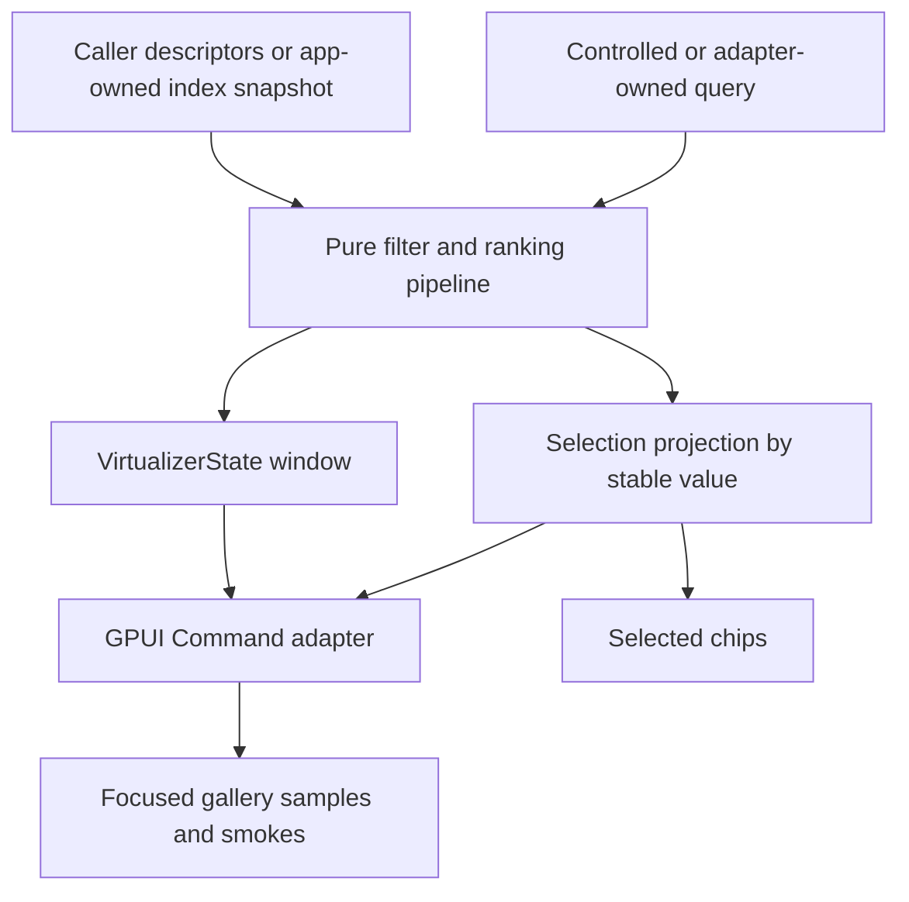

# feat: Deepen Command palette interactions

## Summary

Deepen the official `Command` component from a local substring-filtered listbox into a scalable
command palette surface. The slice adds deterministic ranked results, controlled query ergonomics,
optional multi-selection, virtualized long result sets, and app-owned index snapshot hooks while
keeping global command registration outside the component crate.

---

## Problem Frame

`Command` is already official: it has `CommandState`, inline and dialog rendering, loading and
empty states, keyboard selection, shortcut metadata, API inventory coverage, and gallery samples.
The contract still names fuzzy ranking, multi-select chips, virtualized result sets, and app-wide
indexing as follow-up work. Current resolution filters every item with substring matching and
materializes the full visible list, which is enough for small local demos but not enough for real
application command palettes.

---

## Requirements

**Search and result state**

- R1. `CommandState` must resolve a deterministic ranked result model from labels, values,
  shortcuts, and keywords without storing GPUI runtime types.
- R2. Empty-query behavior must preserve caller order, while non-empty queries rank matches
  consistently across standalone and grouped commands.
- R3. Active and selected command identity must track stable item values across filtering,
  ranking, and descriptor reorder.

**Interaction ownership**

- R4. `Command` must expose controlled query input and query-change callbacks in the public API
  inventory, while keeping `default_query` as the adapter-owned seed.
- R5. `Command` must support optional multi-selection where selection toggles update persistent
  selected values and selected chips without closing dialog-backed palettes.
- R6. Disabled commands must remain non-activatable in single-select and multi-select modes.

**Scale and integration**

- R7. Long command result sets must render through the existing virtualizer contract so runtime
  rendering is bounded to the visible window plus overscan.
- R8. App-wide indexing must enter as caller-owned descriptor or snapshot input, not as a global
  registry, background task runner, or application command bus owned by `ui_components`.
- R9. The Components gallery must expose focused `Command` samples for ranked search,
  multi-selection, virtualized results, and indexed/loading metadata with stable selectors and
  nested scroll containment.

---

## Key Technical Decisions

- **Keep ranking renderer-neutral:** the ranking and selection projection belong in
  `CommandState` or private pure helpers, not in GPUI render code. The adapter should render an
  already-resolved result model.
- **Use value identity, not index identity:** active, selected, and callback payloads should prefer
  stable command values so re-ranking does not silently move selection to a different command.
- **Use query-specific callback naming:** `Command` has both query editing and command selection,
  so the controlled query API should use an explicit query-change callback instead of overloading
  `on_select` or treating selected command activation as a scalar `on_change`.
- **Compose existing virtualizer primitives:** long result rendering should reuse
  `open_gpui_ui_core::VirtualizerState` and the `VirtualizedList` / `Table` render-plan pattern
  instead of adding ad hoc scroll math inside `command.rs`.
- **Keep indexing app-owned:** the component may accept indexed or pre-ranked snapshots from the
  caller, but it should not own command discovery, keybindings, enablement policies, or dispatch.
- **Update conformance at the same time as API:** public builder changes must update
  `COMPONENT_API_INVENTORY`, the component contract, gallery samples, and focused runtime gates in
  the same slice.

---

## High-Level Technical Design

The important boundary is the pipeline: descriptors or caller-owned snapshots feed a pure result
model; selection is projected by stable command value; the adapter only owns GPUI input,
callbacks, overlay lifecycle, focus handles, and scroll handles.

---

## Scope Boundaries

### In Scope

- Ranked command result metadata and deterministic matching.
- Controlled query API and callback inventory.
- Optional multi-selection with selected chip rendering.
- One-dimensional virtualized command result windows.
- App-owned index snapshot input.
- Components gallery samples, runtime smokes, contract docs, and verification notes.

### Deferred to Follow-Up Work

- A global command registry, command dispatch bus, keybinding resolver, or enablement engine.
- Async background indexing owned by the component crate.
- Cross-window command scope, workspace command routing, and application menu integration.
- Rich result rows with icons, badges, descriptions, and arbitrary row children beyond what is
  needed to prove selected chips and ranking metadata.
- Visual screenshot or image-diff baselines for the Command samples.

### Outside This Product's Identity

- Recreating `cmdk` or shadcn as a direct API clone.
- Introducing a standalone headless crate as part of this Command slice.

---

## Acceptance Examples

- AE1. Given a command palette with `Open File`, `New File`, and `Toggle Sidebar`, when the user
  searches `file`, the file commands appear before weaker matches and activation still returns the
  selected stable command value.
- AE2. Given multi-select mode with `Open File` already selected, when the user searches a query
  that hides that command, the selected chip remains visible and the hidden command is not lost.
- AE3. Given a 10k command snapshot, when the user scrolls inside the command result viewport, the
  rendered rows change while the outer Components page viewport does not move.
- AE4. Given an app-owned indexed snapshot update, when the snapshot revision changes, the visible
  result model refreshes without moving selection to a different stable command value.

---

## Implementation Units

### U1. Command Result Pipeline

- **Goal:** Replace ad hoc substring filtering with a pure ranked result model that keeps item,
  group, score, match source, and stable value metadata together.
- **Requirements:** R1, R2, R3.
- **Dependencies:** None.
- **Files:** `crates/ui_components/src/command.rs`, `crates/ui_components/tests/components.rs`.
- **Approach:** Add private or public renderer-neutral result types only where they help tests and
  docs. Keep the existing `CommandItemDescriptor` and `CommandGroupDescriptor` entry points, but
  move matching into a result pipeline that can rank standalone and grouped items with one ordering
  rule. Preserve empty-query caller order and make disabled rows visible but non-activatable.
- **Patterns to follow:** `CommandState::resolve` in `crates/ui_components/src/command.rs`,
  `ListboxState` navigation and activation metadata, and fret's command gallery checks for sorted
  rows and keyword matching in `repo-ref/fret/ecosystem/fret-ui-shadcn/src/command.rs`.
- **Test scenarios:**
  - Querying by label, value, keyword, and shortcut returns the expected item set with stable
    command values.
  - Empty query preserves standalone and grouped caller order.
  - Non-empty query ranks stronger label or value matches ahead of weaker keyword-only matches.
  - Active and selected values survive descriptor reorder when the stable value still exists.
  - Disabled matching commands remain visible but do not produce activation payloads.
- **Verification:** Component state tests prove ranked result ordering, match metadata, selected
  value projection, disabled activation suppression, and unchanged renderer-neutral state
  boundaries.

### U2. Controlled Query and Multi-Selection API

- **Goal:** Add standard controlled query ergonomics and optional multi-selection without
  weakening the existing single-select command activation path.
- **Requirements:** R3, R4, R5, R6.
- **Dependencies:** U1.
- **Files:** `crates/ui_components/src/command.rs`, `crates/ui_components/tests/components.rs`.
- **Approach:** Keep `default_query` as the uncontrolled seed and add a controlled query input plus
  query-change callback classified in the API inventory. Model multi-selection as an explicit
  command mode or selected-values input; single-select `on_select` keeps action semantics, while
  multi-select emits persistent selection changes and keeps dialog content open. Prefer removing or
  renaming ambiguous builders over carrying compatibility shims.
- **Patterns to follow:** `TextInput::value(...).on_change(...)` for controlled text editing,
  `Switch::on_change` inventory coverage, and current `Command::on_select` runtime tests.
- **Test scenarios:**
  - A controlled query renders the caller value and emits sanitized query text when the real
    command input is edited.
  - `default_query` still seeds adapter-owned query state when no controlled query is supplied.
  - Single-select activation emits one `CommandSelection` and closes dialog-backed content.
  - Multi-select activation toggles selected values, renders selected chips, and keeps
    dialog-backed content open.
  - Disabled commands do not enter or leave the multi-selection set from click, Enter, or Space.
  - Hidden selected values remain represented by chips after filtering.
- **Verification:** API inventory tests classify controlled query, default query, callbacks, and
  selection payloads; runtime tests prove controlled editing, single-select behavior, and
  multi-select chip behavior.

### U3. Virtualized Command Results

- **Goal:** Make long command result sets render through a bounded virtual window while preserving
  keyboard navigation and active-descendant semantics.
- **Requirements:** R3, R7, R9.
- **Dependencies:** U1.
- **Files:** `crates/ui_components/src/command.rs`, `crates/ui_components/tests/components.rs`.
- **Approach:** Reuse the existing fixed-height virtualizer path. Command should resolve row
  measurements and render keys before building GPUI rows, then render only the visible and overscan
  range. Keep live scroll offset in the adapter runtime and reset or clamp it when a query or
  snapshot revision changes the result count. Any missing generic virtualizer behavior should be
  treated as an implementation-time discovery and kept out of this unit unless the existing
  contract cannot express Command's needs.
- **Patterns to follow:** `VirtualizedListRenderPlan` in
  `crates/ui_components/src/virtualized_list.rs`, `TableRuntime` caching in
  `crates/ui_components/src/table.rs`, and `VirtualizerState::resolve_fixed_window` in
  `crates/ui_core/src/virtualizer.rs`.
- **Test scenarios:**
  - A 10k-item command model resolves total item count while rendering only a bounded row window.
  - Scrolling the command viewport changes the visible command window and preserves page scroll
    containment.
  - Arrow navigation to an item outside the visible range updates active value and reveals the
    target row without losing focus from the input.
  - Filtering a long list clamps or resets stale scroll offset so an empty viewport is not left
    behind.
  - Duplicate labels with distinct values produce stable render keys and deterministic activation
    payloads.
- **Verification:** Component runtime tests prove bounded rendering, scroll-window changes,
  reveal-on-keyboard navigation, and stable activation payloads for long lists.

### U4. App-Owned Index Snapshot Hook

- **Goal:** Allow applications to feed `Command` with indexed or pre-ranked command snapshots
  without making the component crate own global command discovery or dispatch.
- **Requirements:** R1, R2, R8.
- **Dependencies:** U1.
- **Files:** `crates/ui_components/src/command.rs`, `crates/ui_components/tests/components.rs`,
  `docs/ui/component-contract.md`.
- **Approach:** Introduce a caller-owned snapshot or source descriptor that can carry entries,
  revision metadata, loading state, and optional pre-ranked ordering. The default local descriptor
  path still works for small command palettes. If a snapshot is pre-ranked, `CommandState` should
  preserve that order unless the caller opts into local fuzzy ranking.
- **Patterns to follow:** Lazy/static gallery table samples in
  `examples/ui-foundation-gallery/src/pages/components.rs`, virtualizer snapshot language in
  `crates/ui_core/src/virtualizer.rs`, and fret's app-owned command breadth boundary in
  `repo-ref/fret/docs/workstreams/imui-collection-command-package-v1/DESIGN.md`.
- **Test scenarios:**
  - A caller-owned snapshot renders the same command state as equivalent local descriptors.
  - Snapshot revision changes refresh the result model while preserving selected values by stable
    command value.
  - Pre-ranked snapshots keep caller order when local filtering is disabled or bypassed.
  - Loading metadata can coexist with stale visible results and with an empty result set.
  - The public contract does not expose a global registry, app command dispatcher, or async task
    handle from `ui_components`.
- **Verification:** State and API inventory tests prove snapshot input, revision refresh,
  pre-ranked ordering, loading coexistence, and the absence of global registry ownership.

### U5. Gallery Command Depth Samples

- **Goal:** Make the new Command behaviors inspectable in focused Components mode and covered by
  runtime smoke tests.
- **Requirements:** R5, R7, R9.
- **Dependencies:** U1, U2, U3, U4.
- **Files:** `examples/ui-foundation-gallery/src/pages/components.rs`,
  `examples/ui-foundation-gallery/src/pages/components/render.rs`,
  `examples/ui-foundation-gallery/tests/foundation_gallery.rs`.
- **Approach:** Expand `command_samples` from small local demos into a focused set: ranked search,
  multi-select chips, virtualized 10k results, and indexed/loading metadata. Add stable sample
  selectors and keep the existing focused Command catalog entry. Runtime smokes should use the
  focused component-family path so failures are easier to isolate.
- **Patterns to follow:** Focused catalog matrix helpers in
  `examples/ui-foundation-gallery/tests/foundation_gallery.rs`, `VirtualizedList` 10k sample
  structure, and fret's command gallery diag scripts for scrollable filtering and retained active
  descendant behavior.
- **Test scenarios:**
  - Focused Command mode renders ranked, multi-select, virtualized, and indexed samples with
    stable selectors.
  - Typing in the ranked sample changes result order and leaves active/selected metadata coherent.
  - Multi-select sample toggles chips and keeps dialog-backed content open.
  - Wheel input inside the virtualized Command result viewport changes command rows without moving
    the surrounding Components page.
  - Focused Command mode can return to `All components` without stale dialog layers or scroll
    position leaks.
- **Verification:** Gallery metadata tests find all Command sample selectors, and focused runtime
  smokes prove ranking, multi-select, virtualization, and nested scroll containment.

### U6. Contract, Verification, and Memory Updates

- **Goal:** Record the completed Command depth boundary so future component slices can build on it.
- **Requirements:** R4, R8, R9.
- **Dependencies:** U1, U2, U3, U4, U5.
- **Files:** `docs/ui/component-contract.md`, `docs/verification.md`,
  `docs/knowledge/engineering/current-state.md`, `docs/knowledge/engineering/log.md`.
- **Approach:** Replace the current follow-up wording for `CommandState` with the shipped boundary:
  ranked results, controlled query, multi-selection, virtualized results, and app-owned snapshots.
  Keep global command registries and application command dispatch explicitly deferred. Add the
  focused verification gates and record the next likely component-depth follow-up.
- **Patterns to follow:** Table and VirtualizedList contract sections in
  `docs/ui/component-contract.md`, focused gallery verification notes in `docs/verification.md`,
  and the current engineering wiki memory bundle.
- **Test scenarios:** Test expectation: none -- this unit updates documentation and memory after
  feature-bearing tests pass in U1 through U5.
- **Verification:** Documentation names the new Command gates, engineering wiki validation passes,
  and the next action points at `Menu` / `ContextMenu` unless a regression needs priority.

---

## Risks & Dependencies

- **API surface creep:** Command can easily turn into an application command framework. Keep
  registry, dispatch, keybinding, and enablement ownership outside the component crate.
- **Ranking instability:** Fuzzy ranking can surprise tests and users if tie-breaking is vague.
  Preserve caller order for empty queries and use deterministic tie-breaks for equal scores.
- **Selection ambiguity:** Duplicate command values make selected-value ownership ambiguous.
  Prefer stable unique values and deterministic render keys; document any duplicate-value behavior
  that remains supported.
- **Virtualization and a11y:** Active-descendant metadata must reference a rendered node. When the
  active item moves outside the visible window, the adapter should reveal it before exposing the
  relationship.
- **Gallery scale:** Long Command samples can slow full Components rendering. Follow the existing
  Table and VirtualizedList lazy sample patterns.

---

## Documentation and Verification Notes

The implementation should update `docs/ui/component-contract.md` when each public Command boundary
ships, not only at the end. `docs/verification.md` should list the focused Command component tests
and the gallery smoke gates beside the existing `Command`, `VirtualizedList`, and focused
Components coverage. The engineering wiki memory should record the completed slice and the next
component-depth target.

---

## Sources and Research

- `docs/knowledge/engineering/decisions/open-gpui-ui-component-depth-roadmap.md`
- `docs/ui/component-contract.md`
- `docs/verification.md`
- `crates/ui_components/src/command.rs`
- `crates/ui_components/src/virtualized_list.rs`
- `crates/ui_core/src/virtualizer.rs`
- `crates/ui_components/tests/components.rs`
- `examples/ui-foundation-gallery/src/pages/components.rs`
- `examples/ui-foundation-gallery/src/pages/components/render.rs`
- `examples/ui-foundation-gallery/tests/foundation_gallery.rs`
- `repo-ref/fret/ecosystem/fret-ui-shadcn/src/command.rs`
- `repo-ref/fret/apps/fret-ui-gallery/tests/command_page_contract.rs`
- `repo-ref/fret/docs/workstreams/imui-collection-command-package-v1/DESIGN.md`
