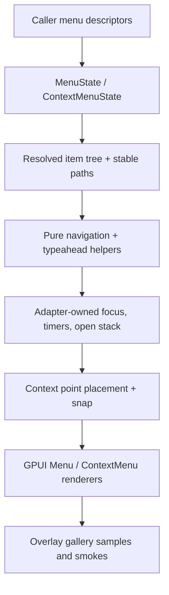

# feat: Deepen Menu and ContextMenu interactions

## Summary

Deepen the overlay menu family from basic action/separator menus into a richer application menu primitive with checked items, radio items, submenu descriptors, deterministic typeahead helpers, point-anchored context-menu placement, and gallery proof surfaces. The slice keeps `Menu` as a reusable overlay primitive and `ContextMenu` as its point-anchored specialization; it does not introduce menubar, global command dispatch, OS-menu bridging, or a standalone headless crate.

---

## Problem Frame

`Menu` and `ContextMenu` are official overlay families, but real application menus need more than flat action rows. They need caller-owned checked and radio state, submenu trees, keyboard movement that remains deterministic after re-render, prefix search, local scroll containment for long menus, and edge-safe context-menu placement.

The current working tree already contains a partial `MenuItemKind` expansion in `crates/ui_components/src/menu.rs`; execution should preserve that direction and finish the contract instead of restarting from the older flat model.

---

## Requirements

### Item Semantics

- R1. `MenuState` and `ContextMenuState` resolve action, checkbox, radio, separator, and submenu items with renderer-neutral disabled, checked, focusable, role, and child metadata.
- R2. Checkbox and radio checked state remain caller-owned input data. Menu activation returns enough payload for the caller to update its own state, including item kind and checked-at-activation.
- R3. Radio rows may expose optional group identity for caller ergonomics, but the component must not persist mutually exclusive radio state internally.
- R4. Submenu items need stable tree identity that is safe when the same item value appears under different parents.
- R5. Separator rows, disabled rows, and empty submenu triggers stay non-activatable across keyboard, pointer, and typeahead paths.

### Interaction And Runtime Boundaries

- R6. Pure state helpers cover vertical navigation, Home/End, Enter/Space activation, submenu open/close target calculation, and prefix typeahead over enabled rows.
- R7. Typeahead timer and text buffer are adapter runtime state. `MenuState` provides pure `typeahead_target(buffer, current)` style helpers only.
- R8. Submenu runtime stack, focus handles, hover timers, and pointer-safe corridor state stay adapter-owned. Resolved state may expose pure values such as item tree, focused item, and open path, but not GPUI handles or timer objects.
- R9. Keyboard submenu behavior should ship before pointer hover corridor behavior. Hover-open and safe-corridor policy can land once the pure keyboard path is tested.

### ContextMenu, Gallery, Docs, Verification

- R10. `ContextMenu` reuses the shared menu item model, opens from a point anchor, and keeps placement resolution split between pure `ContextMenuState::placement_input()` tests and gallery runtime bounds/snap smoke coverage.
- R11. Long menus and submenus must have an explicit local scroll carrier before wheel-containment tests assert that inner scroll does not move the overlay page.
- R12. The overlay gallery exposes inspectable samples for action, checkbox, radio, submenu, long-menu scroll, typeahead, and edge-anchored context menu cases.
- R13. Public API inventory, contract docs, verification notes, and engineering memory reflect the shipped boundary and the deferred menubar / app-menu work.

---

## Key Technical Decisions

- `Menu` remains a reusable overlay primitive. This slice intentionally does not add a menubar API, application-menu registry, global command dispatch, or native OS menu bridge.
- `ContextMenu` remains a point-anchored `Menu` specialization. It should share item semantics, navigation helpers, and selection payloads with `Menu`.
- Checked and radio menu rows are controlled by caller data. `MenuSelection` can describe what was activated, but it must not mutate persistent checked/radio state.
- Submenu tree identity should use a stable path or parent/value-derived identity rather than raw value alone. Raw values are not globally unique once nested menus exist.
- Typeahead is split: pure matching belongs in `MenuState`; elapsed-time reset and keystroke buffering belong in the adapter runtime.
- Submenu is split: pure state and keyboard transitions land before pointer hover corridor. The corridor is easy to make flaky without a stable state contract.
- Long-menu scroll is an implementation precondition for gallery wheel containment. Do not write AE-style wheel tests against a menu surface that cannot scroll locally.

---

## High-Level Technical Design



The state layer answers what rows exist, which rows are enabled, which pure item/path is focused, and what activation payload should be emitted. The adapter layer owns GPUI focus handles, overlay anchoring, typeahead buffers/timers, submenu stack presentation, pointer transitions, and scroll handles.

---

## Scope Boundaries

### In scope

- Action, checkbox, radio, separator, and submenu item semantics.
- Selection payloads that include item kind, checked-at-activation, and stable tree identity.
- Pure keyboard navigation and typeahead helpers.
- Keyboard submenu open/close path, followed by pointer hover policy only after keyboard behavior is stable.
- Context-menu point placement tests plus gallery runtime snap/dismissal coverage.
- Local scroll carrier for long menu surfaces and gallery wheel containment.
- Overlay gallery samples, focused smokes, docs, API inventory, and memory updates.

### Deferred for later

- Native menubar integration.
- Application menu registration and global command dispatch.
- OS menu bar bridging.
- Cross-window menu orchestration.
- Standalone headless extraction.
- Command/keybinding enablement engines.

### Outside this product's identity

- Recreating a full application menu framework inside `ui_components`.
- Adding unrelated shallow primitives just because the overlay page already hosts menus.

---

## Acceptance Examples

- AE1. Given a menu with action, checkbox, radio, separator, disabled, and submenu rows, arrow keys skip disabled/separator/empty-submenu rows and Enter/Space activates only enabled action/check/radio rows.
- AE2. Given checked and radio rows, activation payload includes item kind, checked-at-activation, and stable identity so caller-owned state can update externally.
- AE3. Given duplicate child values under different submenu parents, resolved item identity remains distinct and focus/activation do not collide.
- AE4. Given a submenu row, ArrowRight opens the child branch, ArrowLeft or Escape closes it, and focus returns to the parent trigger/opener.
- AE5. Given a typeahead buffer, the pure helper returns the next enabled matching item and ignores separators, disabled rows, and non-visible branches.
- AE6. Given a context menu opened near a viewport edge, pure placement input is correct and the gallery runtime keeps the surface visible through overlay snapping.
- AE7. Given a long menu or submenu in the overlay gallery, wheel input scrolls the local menu carrier and does not move the outer page.

---

## Implementation Units

### U1. Finish rich menu item model

- **Goal:** Complete the partially-started item model so action, checkbox, radio, separator, and submenu rows compile, render, resolve, and emit explicit payloads.
- **Requirements:** R1, R2, R3, R4, R5.
- **Files:** `crates/ui_components/src/menu.rs`, `crates/ui_components/src/context_menu.rs`, `crates/ui_components/src/lib.rs`, `crates/ui_components/src/prelude.rs`, `crates/ui_components/tests/components.rs`.
- **Approach:** Keep explicit item variants and preserve caller-owned checked data. Add stable item path/identity and make `MenuSelection` carry item kind, checked-at-activation, and path. Either add explicit radio group identity now or document and test that radio grouping remains caller-owned without internal mutual exclusion.
- **Patterns to follow:** `ListboxState` and `SelectState` for renderer-neutral resolved state, `CheckboxState` and `RadioGroupState` for toggled metadata, and `crates/ui_components/tests/components.rs` for API inventory gates.
- **Test scenarios:**
  - Checkbox and radio rows resolve checked/toggled state and remain activatable only when enabled.
  - Activation payload includes kind, checked-at-activation, and stable identity.
  - Separator, disabled, and empty submenu rows never become activation payloads.
  - Duplicate child values under different submenu parents produce distinct stable paths.
  - `ContextMenuState` resolves the same rich item metadata through the shared menu model.

### U2. Pure navigation and typeahead helpers

- **Goal:** Add deterministic pure helpers before introducing more runtime behavior.
- **Requirements:** R5, R6, R7.
- **Files:** `crates/ui_components/src/menu.rs`, `crates/ui_components/tests/components.rs`.
- **Approach:** Keep the existing roving-focus helper style for Up, Down, Home, and End. Add pure typeahead matching over visible/enabled rows and keep buffer reset outside `MenuState`.
- **Patterns to follow:** `crates/ui_components/src/roving_focus.rs`, `ListboxState::typeahead_target`, `repo-ref/fret/ecosystem/fret-ui-kit/src/imui/menu_controls/keyboard/popup/nav.rs`, and `repo-ref/fret/ecosystem/fret-ui-kit/src/imui/menu_controls/keyboard/popup/shortcut.rs`.
- **Test scenarios:**
  - Up, Down, Home, and End skip disabled rows, separators, and empty submenu rows.
  - Prefix typeahead returns the next enabled matching row from the current focus.
  - Typeahead ignores disabled/separator rows and does not require timer state inside `MenuState`.
  - Re-rendering with the same focused value preserves deterministic targets.

### U3. Keyboard submenu runtime

- **Goal:** Make nested submenu keyboard behavior work without putting GPUI runtime types into resolved state.
- **Requirements:** R4, R6, R8, R9.
- **Files:** `crates/ui_components/src/menu.rs`, `crates/ui_components/src/context_menu.rs`, `crates/ui_components/tests/components.rs`.
- **Approach:** Let state expose pure tree/path data. Let the GPUI adapter own open path, focus handles, and branch presentation. Ship ArrowRight/ArrowLeft/Escape first; add pointer hover-open only after keyboard smokes pass.
- **Patterns to follow:** `repo-ref/fret/ecosystem/fret-ui-kit/src/imui/menu_family_controls/menu.rs`, `repo-ref/fret/ecosystem/fret-ui-kit/src/imui/menu_family_controls/submenu.rs`, `repo-ref/fret/ecosystem/fret-ui-kit/src/imui/menu_family_controls/submenu_state.rs`, and `repo-ref/fret/ecosystem/fret-ui-kit/src/imui/menu_family_controls/menu_state/open_policy.rs`.
- **Test scenarios:**
  - ArrowRight opens a focused submenu branch and focuses its first enabled child.
  - ArrowLeft closes the child branch and returns focus to the parent submenu trigger.
  - Escape closes the active branch or menu according to overlay policy.
  - Re-rendering does not lose open path or focused stable identity.

### U4. ContextMenu placement and local scroll containment

- **Goal:** Keep point-anchored context menus stable near window edges and make long menu surfaces locally scrollable.
- **Requirements:** R10, R11.
- **Files:** `crates/ui_components/src/context_menu.rs`, `crates/ui_components/src/menu.rs`, `crates/ui_components/tests/components.rs`.
- **Approach:** Keep `ContextMenuState::placement_input()` as the pure contract. Use existing overlay placement/snap primitives for runtime edge behavior. Add constrained max-height and local scroll carrier for long menu content before writing wheel-containment smokes.
- **Patterns to follow:** `ContextMenuState::resolve`, `GpuiOverlayPlacement::resolve`, `crates/ui_components/src/scroll_area.rs`, `repo-ref/fret/ecosystem/fret-ui-shadcn/tests/web_vs_fret_overlay_placement/context_menu.rs`, and `repo-ref/fret/tools/diag-scripts/suites/ui-gallery-context-menu-semantics/suite.json`.
- **Test scenarios:**
  - Right-click opens the context menu at the requested anchor point.
  - Pure placement input preserves point anchor, side, alignment, offset, and content size.
  - Near-edge gallery runtime keeps the surface visible after snap.
  - Wheel input inside a long menu stays local to the component surface; gallery default-open samples remain metadata-only.

### U5. Overlay gallery depth samples

- **Goal:** Expose the new behavior through stable overlay gallery samples and focused smokes.
- **Requirements:** R12.
- **Files:** `examples/ui-foundation-gallery/src/pages/overlay.rs`, `examples/ui-foundation-gallery/tests/foundation_gallery.rs`.
- **Approach:** Expand the overlay page samples for checkbox/radio rows, nested submenu, typeahead, long menu scroll, and edge-anchored context menu. Keep Overlay as the canonical inspection surface for this family.
- **Patterns to follow:** Existing overlay sample cards in `examples/ui-foundation-gallery/src/pages/overlay.rs`, overlay catalog tests in `examples/ui-foundation-gallery/tests/foundation_gallery.rs`, and Fret gallery references under `repo-ref/fret/tools/diag-scripts/suites/ui-gallery-context-menu*.json`.
- **Test scenarios:**
  - Stable selectors exist for all new menu/context-menu variants.
  - Focused overlay smokes open, navigate, select, and dismiss the new samples.
  - Long menu wheel input does not move the outer page.
  - Edge context-menu sample remains inspectable after opening near a boundary.

### U6. Contract, verification, and memory updates

- **Goal:** Record the shipped boundary so future component slices do not re-litigate menu shape.
- **Requirements:** R13.
- **Files:** `docs/ui/component-contract.md`, `docs/verification.md`, `docs/knowledge/engineering/current-state.md`, `docs/knowledge/engineering/log.md`.
- **Approach:** Update menu/overlay contract sections, verification commands, and engineering memory after feature-bearing gates pass.
- **Test scenarios:** None. This unit documents the verified boundary after U1-U5.

---

## Risks & Dependencies

- The current working tree has a partial `menu.rs` item-kind expansion. Finish and test it before attempting gallery work.
- Submenu runtime can become timer- and focus-race sensitive. Ship keyboard path before pointer hover corridor.
- Raw `value` identity is insufficient for nested menus. Stable path identity must be tested before runtime submenus depend on it.
- Typeahead buffer reset cannot be tested as pure `MenuState` elapsed time unless the adapter owns the timer.
- Context-menu edge behavior is partly in `GpuiOverlayPlacement` and partly in GPUI snap runtime; tests must cover both layers.
- Local scroll containment needs an actual scrollable menu carrier.

---

## Documentation and Verification Notes

Run focused component and gallery gates first, then broader checks if shared contracts moved:

```powershell
cargo fmt -p open-gpui-ui-components -p open-gpui-ui-foundation-gallery
cargo nextest run -p open-gpui-ui-components menu
cargo nextest run -p open-gpui-ui-components context_menu
cargo nextest run -p open-gpui-ui-components component_api_inventory
cargo nextest run -p open-gpui-ui-foundation-gallery overlay
cargo check -p open-gpui-ui-foundation-gallery
git diff --check
python $HOME\.codex\skills\engineering-wiki-memory\scripts\wiki_memory.py validate --root docs\knowledge\engineering
```

Update `docs/verification.md` with the focused commands that prove rich item semantics, submenu keyboard navigation, typeahead, context-menu placement, and local menu scroll containment.

---

## Sources and Research

- `docs/knowledge/engineering/decisions/open-gpui-ui-component-depth-roadmap.md`
- `docs/ui/component-contract.md`
- `docs/verification.md`
- `crates/ui_components/src/menu.rs`
- `crates/ui_components/src/context_menu.rs`
- `crates/ui_components/src/lib.rs`
- `crates/ui_components/src/prelude.rs`
- `crates/ui_components/tests/components.rs`
- `examples/ui-foundation-gallery/src/pages/overlay.rs`
- `examples/ui-foundation-gallery/tests/foundation_gallery.rs`
- `repo-ref/fret/docs/audits/radix-menu.md`
- `repo-ref/fret/ecosystem/fret-ui-kit/src/imui/menu_controls/keyboard/popup/nav.rs`
- `repo-ref/fret/ecosystem/fret-ui-kit/src/imui/menu_controls/keyboard/popup/shortcut.rs`
- `repo-ref/fret/ecosystem/fret-ui-kit/src/imui/menu_controls/interaction.rs`
- `repo-ref/fret/ecosystem/fret-ui-kit/src/imui/menu_family_controls/menu.rs`
- `repo-ref/fret/ecosystem/fret-ui-kit/src/imui/menu_family_controls/submenu.rs`
- `repo-ref/fret/ecosystem/fret-ui-kit/src/imui/menu_family_controls/submenu_state.rs`
- `repo-ref/fret/ecosystem/fret-ui-kit/src/imui/menu_family_controls/menu_state/open_policy.rs`
- `repo-ref/fret/ecosystem/fret-ui-shadcn/tests/web_vs_fret_overlay_placement/context_menu.rs`
- `repo-ref/fret/tools/diag-scripts/suites/ui-gallery-context-menu-semantics/suite.json`
