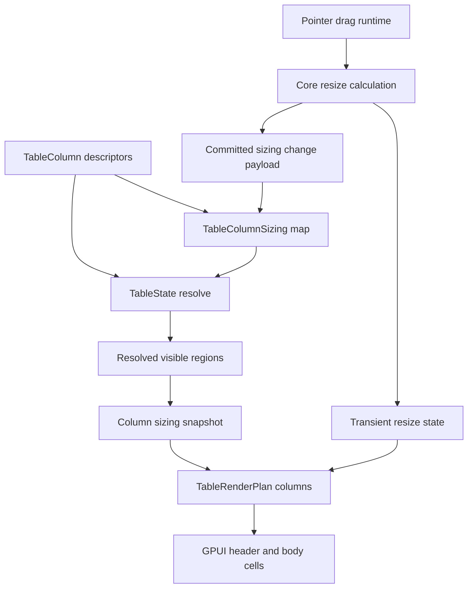

# Open GPUI Table Column Sizing Plan

## Summary

Deepen the official `Table` family with renderer-neutral column sizing state, resolved width
metadata, and GPUI resize interactions. The slice adapts TanStack Table's split between committed
`columnSizing` and transient `columnResizing` ideas to Open GPUI's current-crate architecture
without introducing a standalone headless crate or a full sticky grid.

## Problem Frame

The current `Table` can resolve rows, grouping, aggregation, expansion, sorting, pagination,
selection, and semantic left / center / right column regions. Column layout is still shallow:
`TableMetrics::min_column_width` drives visual width, center columns flex, pinned columns use a
fixed minimum, and there is no caller-owned column width map or resize payload. That makes the
table useful for proof samples but not yet suitable for real application tables where users expect
stable column widths, constrained resizing, and persisted width state.

TanStack Table and Fret both treat this as a state problem first. Persistent sizes are keyed by
stable column id, transient drag data is separate, and renderers read resolved size / start /
after / total-size helpers. Open GPUI should adopt that boundary while keeping pointer capture,
cursor changes, focus handles, and callbacks inside the GPUI adapter.

---

## Requirements

### Column Sizing Contract

- R1. Add renderer-neutral column sizing descriptors and caller-owned sizing state keyed by
  `TableColumnId`; do not store GPUI `Pixels`, elements, callbacks, or runtime handles in core
  table state.
- R2. Resolve each visible column to a clamped width from committed sizing state, column defaults,
  and min / max constraints.
- R3. Expose total size plus start and after offsets for all columns and for left, center, and right
  regions after visibility, ordering, grouping, and pinning have already resolved.

### Resize Interaction Contract

- R4. Represent transient resize information separately from committed sizing. The model should
  track active column id, start offset, start size, delta offset, delta percentage, and starting
  widths, following TanStack's state split without copying React APIs.
- R5. Support `onEnd` as the default resize mode and keep `onChange` available as a deliberate
  opt-in path. RTL delta direction must be explicit even if the first gallery sample is LTR.
- R6. Keep resize math deterministic and testable without opening a GPUI window. The adapter owns
  pointer capture, cursors, hit boxes, and callback dispatch.

### Adapter and Gallery Contract

- R7. Apply resolved column widths consistently to Table header cells and body cells. Header and
  body region plans must not drift.
- R8. Expose stable resize handle selectors and a controlled callback payload so applications can
  persist accepted column sizes.
- R9. Add a focused Components gallery sample that shows static sized columns, a resizable column,
  current sizing readout, and a runtime smoke proving drag input stays inside the table sample.

---

## Acceptance Examples

- AE1. Given a column with default width, min width, max width, and no committed override,
  `TableState::resolve()` exposes the clamped default width.
- AE2. Given committed sizing for a visible column, the committed width wins and is clamped to that
  column's min / max bounds.
- AE3. Given hidden or unknown sizing entries, visible column order, totals, and row models do not
  change except for known visible columns.
- AE4. Given left and right pinned columns, start / after offsets are computed inside the correct
  region and total sizes are available for left, center, right, and all visible columns.
- AE5. Given a resize drag in default `onEnd` mode, move events update transient resize metadata but
  do not emit committed sizing until the end event.
- AE6. Given a resize drag in `onChange` mode, move events can emit committed sizing updates while
  retaining the same final end-state semantics.
- AE7. Given RTL resize direction, positive pointer movement applies the opposite width delta from
  LTR.
- AE8. Given the gallery resizable-table sample is dragged, the callback log records the changed
  column width, header and body cells use the same width, and the outer Components page does not
  scroll.

---

## Key Technical Decisions

- **Adopt TanStack's state split, not its framework API:** Persistent `columnSizing` and transient
  resize state are the right conceptual model. Open GPUI should expose Rust-native types and
  payloads rather than React-style handlers or atom APIs.
- **Use neutral pixel vocabulary in core:** Column sizes should use `UiPx`. GPUI conversion stays
  in `ui_components`.
- **Resolve sizing after column visibility / ordering / pinning:** Width totals and offsets are
  layout metadata over the resolved visible column set, not independent inputs that can reorder
  columns.
- **Keep resize pointer runtime in the adapter:** Core can own pure resize calculations, but GPUI
  owns hit regions, pointer capture, cursor shape, drag thresholds, and event propagation.
- **Default to `onEnd`:** It matches TanStack's performance default and avoids forcing large table
  redraws on every pointer move. `onChange` remains part of the planned API so implementers do not
  hard-code a one-way path.
- **Do not ship sticky pinned columns in this slice:** Sizing offsets should prepare for sticky
  pinned layout, but this plan only delivers semantic widths, resize state, and local gallery proof.

---

## High-Level Technical Design

The core table layer should resolve column sizing as data: committed sizes, clamped widths, region
totals, and offsets. The GPUI adapter should consume that data when building header and body cells,
then use pure resize calculations to turn pointer deltas into transient preview metadata and
committed sizing payloads.

---

## Implementation Units

### U1. Add core column sizing descriptors and state

**Goal:** Give `TableColumn` and `TableState` a renderer-neutral sizing contract.

**Requirements:** R1, R2

**Dependencies:** None

**Files:**

- Modify `crates/ui_core/src/table.rs`
- Modify `crates/ui_core/src/prelude.rs`
- Modify `crates/ui_components/tests/components.rs`

**Approach:** Add column sizing descriptors for default width, minimum width, maximum width, and
resize enablement. Add a `TableColumnSizing` map keyed by `TableColumnId` and a
`TableState::with_column_sizing` builder. Preserve the current public API shape where possible,
but allow a deliberate break if deriving `Eq` or existing width assumptions no longer fit neutral
pixel values. Unknown sizing entries should stay harmless.

**Patterns to follow:**

- `TableColumnPinning` and `TableAggregation` in `crates/ui_core/src/table.rs`
- TanStack `ColumnSizingState` and column def defaults in
  `repo-ref/tanstack-table/packages/table-core/src/features/column-sizing/columnSizingFeature.types.ts`
- Fret `ColumnSizingState` in `repo-ref/fret/ecosystem/fret-ui-headless/src/table/column_sizing.rs`

**Test scenarios:**

- A column with no committed override resolves to its default width.
- A committed width overrides the default and clamps to min / max bounds.
- Unknown committed sizing ids are ignored.
- Hidden columns do not contribute sizing metadata.
- `TableStateCacheKey` includes sizing state so cached render plans invalidate when widths change.
- Crate-root and prelude exports expose the new public sizing types explicitly.

**Verification:** Core table tests prove sizing state without rendering. Component export and API
inventory tests fail if the new public types are omitted from the official surface.

### U2. Resolve region totals, offsets, and render-plan widths

**Goal:** Make resolved column widths usable by renderers and future sticky layouts.

**Requirements:** R2, R3, R7

**Dependencies:** U1

**Files:**

- Modify `crates/ui_core/src/table.rs`
- Modify `crates/ui_components/src/table.rs`
- Modify `crates/ui_components/tests/components.rs`
- Modify `docs/ui/component-contract.md`

**Approach:** Add resolved sizing metadata to the core resolved table state, then copy the same
metadata into the component render plan. Each visible column should expose width, min / max bounds,
start offset, after offset, region, and resizable capability. Region plans should expose total
widths for left, center, right, and all columns. Header and body render plans should read the same
resolved width data.

**Patterns to follow:**

- Current `TableColumnRegionRenderPlan` in `crates/ui_components/src/table.rs`
- TanStack `column_getSize`, `column_getStart`, `column_getAfter`, and total-size helpers in
  `repo-ref/tanstack-table/packages/table-core/src/features/column-sizing/columnSizingFeature.utils.ts`
- Fret total size and offset snapshots in
  `repo-ref/fret/ecosystem/fret-ui-headless/src/table/core_model.rs`

**Test scenarios:**

- Region totals sum visible columns only.
- Left, center, and right start / after offsets respect column pinning and explicit column order.
- Header and body cells expose matching widths for the same column id.
- Sorting, grouping, expansion, and pagination do not mutate sizing metadata.
- Resolved sizing metadata remains stable when only vertical scroll offset changes.

**Verification:** Component table render-plan tests prove header/body parity and pinning-aware
offsets. Contract docs no longer list custom column sizing as fully deferred.

### U3. Add resize interaction state and GPUI resize handles

**Goal:** Let users resize table columns while keeping application state controlled.

**Requirements:** R4, R5, R6, R8

**Dependencies:** U1, U2

**Files:**

- Modify `crates/ui_core/src/table.rs`
- Modify `crates/ui_components/src/table.rs`
- Modify `crates/ui_components/tests/components.rs`

**Approach:** Add pure resize calculation types for begin, drag, and end transitions. The
calculation should accept current sizing, visible column metadata, resize mode, resize direction,
active column id, and pointer x positions. The GPUI adapter should render resize handles for
resizable headers, own pointer runtime state, and emit a controlled callback payload with the next
committed sizing map. Default behavior should be `onEnd`; `onChange` should share the same pure
calculation path.

**Patterns to follow:**

- `TableHeaderAction` and `Table::on_sort_requested` in `crates/ui_components/src/table.rs`
- TanStack `columnResizingState` and `header_getResizeHandler` in
  `repo-ref/tanstack-table/packages/table-core/src/features/column-resizing/columnResizingFeature.utils.ts`
- Fret `ColumnSizingInfoState` in
  `repo-ref/fret/ecosystem/fret-ui-headless/src/table/column_sizing_info.rs`
- Fret table resize handle adapter in
  `repo-ref/fret/ecosystem/fret-ui-kit/src/imui/table_controls/header/resize.rs`

**Test scenarios:**

- Disabled table-wide resizing suppresses handle activation.
- Disabled per-column resizing suppresses handle activation for that header only.
- `onEnd` mode updates transient delta metadata during drag and emits committed sizing on release.
- `onChange` mode emits committed sizing during drag and ends with the same final width.
- RTL direction flips the sign of pointer deltas.
- Resize payloads contain stable column ids and do not require visible column indices.
- Runtime tests drag the real resize handle selector and observe the callback payload.

**Verification:** Pure core tests cover resize math. GPUI component runtime tests cover pointer
handle wiring, callback dispatch, and propagation control.

### U4. Add a resizable Table gallery sample and smoke proof

**Goal:** Make column sizing visible and regression-testable in the focused Components gallery.

**Requirements:** R7, R8, R9

**Dependencies:** U1, U2, U3

**Files:**

- Modify `examples/ui-foundation-gallery/src/pages/components.rs`
- Modify `examples/ui-foundation-gallery/src/pages/components/render.rs`
- Modify `examples/ui-foundation-gallery/tests/foundation_gallery.rs`
- Modify `docs/verification.md`

**Approach:** Add a focused Table sample, likely `release-resize`, with several explicit column
widths, at least one disabled resize column, and a controlled gallery-side sizing log. The sample
should reuse the current Table family instead of creating a separate data-grid surface. The smoke
should enter focused Table mode, drag a concrete resize handle, assert a changed callback payload,
and confirm the outer Components page does not move during the drag.

**Patterns to follow:**

- Existing `release-queue` and `release-rollup` Table samples in
  `examples/ui-foundation-gallery/src/pages/components.rs`
- Existing nested-scroll Table smokes in `examples/ui-foundation-gallery/tests/foundation_gallery.rs`
- TanStack React column sizing example in
  `repo-ref/tanstack-table/examples/react/column-sizing/src/main.tsx`

**Test scenarios:**

- Focused Table mode renders the existing virtualized samples plus the resizable sample.
- Gallery state summary exposes region totals and at least one column width.
- Dragging the resize handle records the changed column id and width.
- Header and first visible row cell for the resized column share the same width after the callback.
- The sample remains locally interactive when the surrounding Components page overflows.

**Verification:** Foundation-gallery Table tests prove visible sample metadata and runtime drag
behavior. `docs/verification.md` names the new focused gate.

### U5. Close docs, memory, and review boundaries

**Goal:** Leave the Table roadmap and verification memory accurate for the next slice.

**Requirements:** R9

**Dependencies:** U1, U2, U3, U4

**Files:**

- Modify `docs/ui/component-contract.md`
- Modify `docs/verification.md`
- Modify `docs/knowledge/engineering/current-state.md`
- Modify `docs/knowledge/engineering/log.md`

**Approach:** Update contract docs to mark column sizing and resizing as supported while keeping
sticky pinned-column layout, horizontal pinned scrolling, autosize-by-content, column drag reorder,
and two-dimensional virtualization deferred. Record the TanStack and Fret references that shaped
the implementation. Run focused component and gallery gates before broad suite checks if public
exports or gallery catalog metadata changed.

**Test scenarios:**

- Documentation names committed sizing, transient resize state, and adapter-owned pointer runtime
  without implying a standalone headless crate.
- Verification docs name focused core, component, and gallery gates for sizing / resize.
- Engineering memory records the commit, verification, and remaining Table follow-ups.

**Verification:** Wiki validation passes and `git diff --check` reports no whitespace issues.

---

## Scope Boundaries

### Active Scope

- Column default, min, max, resizable metadata.
- Caller-owned committed column sizing state.
- Pure resize math for `onEnd`, `onChange`, LTR, and RTL.
- GPUI resize handles and controlled sizing callback payloads.
- Render-plan width parity between headers and body cells.
- Focused gallery sample and runtime drag smoke.

### Deferred to Follow-Up Work

- Sticky pinned-column horizontal layout.
- Horizontal scroll synchronization between pinned and center regions.
- Two-dimensional grid virtualization.
- Autosize by measured content.
- Drag-to-reorder columns.
- Header groups / column group resizing beyond current flat visible columns.
- Server-owned table state, faceting UI, editing workflows, and persistence adapters.
- Standalone headless crate extraction.

---

## Risks and Mitigations

| Risk | Impact | Mitigation |
| --- | --- | --- |
| Width defaults change existing gallery layout too much | Medium visual churn | Preserve current medium visual width as the default unless tests show a better local baseline |
| Resize pointer handling leaks scroll or click events | High gallery regression risk | Add a real runtime drag smoke and assert outer page bounds stay stable |
| `onChange` resizing causes redraw churn | Medium performance risk | Default to `onEnd` and keep `onChange` opt-in with focused tests |
| Pinned sizing looks like sticky layout support | Medium product confusion | Document that region offsets prepare sticky work but do not implement sticky scrolling |
| Sizing map drifts from visibility and ordering | High correctness risk | Resolve sizes only after visible column regions are computed and test hidden / reordered columns |

---

## Sources and Research

- `docs/plans/2026-06-23-001-feat-ui-table-depth-plan.md`
- `docs/knowledge/engineering/decisions/open-gpui-ui-component-depth-roadmap.md`
- `docs/ui/component-contract.md`
- `crates/ui_core/src/table.rs`
- `crates/ui_components/src/table.rs`
- `examples/ui-foundation-gallery/src/pages/components.rs`
- `repo-ref/tanstack-table/docs/framework/react/guide/column-sizing.md`
- `repo-ref/tanstack-table/docs/framework/react/guide/column-resizing.md`
- `repo-ref/tanstack-table/packages/table-core/src/features/column-sizing/columnSizingFeature.types.ts`
- `repo-ref/tanstack-table/packages/table-core/src/features/column-sizing/columnSizingFeature.utils.ts`
- `repo-ref/tanstack-table/packages/table-core/src/features/column-resizing/columnResizingFeature.types.ts`
- `repo-ref/tanstack-table/packages/table-core/src/features/column-resizing/columnResizingFeature.utils.ts`
- `repo-ref/tanstack-table/examples/react/column-sizing/src/main.tsx`
- `repo-ref/fret/ecosystem/fret-ui-headless/src/table/column_sizing.rs`
- `repo-ref/fret/ecosystem/fret-ui-headless/src/table/column_sizing_info.rs`
- `repo-ref/fret/ecosystem/fret-ui-headless/tests/tanstack_v8_column_sizing_parity.rs`
- `repo-ref/fret/ecosystem/fret-ui-headless/tests/tanstack_v8_column_sizing_interactions_parity.rs`
- `repo-ref/fret/ecosystem/fret-ui-kit/src/imui/table_controls/header/resize.rs`
