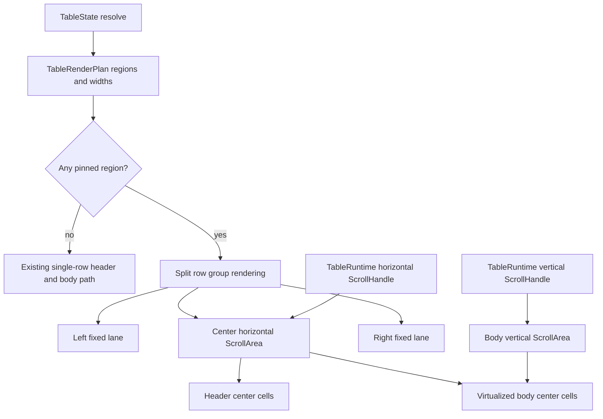

# Open GPUI Table Sticky Pinned Columns Plan

## Summary

Turn the current semantic `left` / `center` / `right` Table column regions into a concrete sticky
pinned-column layout in the GPUI adapter. The slice should add shared horizontal center-lane
scrolling for header and body cells while keeping vertical row virtualization one-dimensional.

## Problem Frame

The table core now resolves pinned regions, committed column widths, start / after offsets, and
region totals. The GPUI adapter renders matching header/body region selectors, but all regions
still sit in a single clipped flex row. When total width exceeds the viewport, center columns are
clipped rather than horizontally scrollable, and pinned left/right regions are only semantic
metadata.

TanStack Table exposes left/center/right column families and sizing helpers so renderers can either
split pinned columns into separate surfaces or use sticky positioning. Fret's table controls choose
a split-row-group model: pinned groups remain fixed, center groups are wrapped in a shared
horizontal scroll carrier, and the same `ScrollHandle` is reused by header and body groups. Open
GPUI should follow that self-drawn-friendly model instead of depending on CSS-style sticky behavior.

---

## Requirements

**Sticky Region Layout**

- R1. Render left and right column regions as fixed horizontal lanes when any visible column is
  pinned.
- R2. Render center columns inside a horizontally scrollable lane whose width is the remaining
  table viewport after pinned lanes are reserved.
- R3. Keep header and body center lanes synchronized through one adapter-owned horizontal scroll
  source.
- R4. Preserve existing vertical body virtualization and nested body scroll ownership.

**Sizing and Interaction**

- R5. Continue using `TableResolvedColumnSizingRegions` as the single width source for header and
  body cells.
- R6. Keep resize handles, sort header activation, row selectors, and accessibility metadata
  working in the split pinned layout.
- R7. Avoid storing `ScrollHandle`, pointer state, or layout runtime state in `ui_core`.

**Gallery and Verification**

- R8. Add or strengthen a focused gallery Table sample whose center region overflows horizontally
  while left and right pinned columns remain visible.
- R9. Add runtime coverage proving horizontal center scrolling does not move pinned lanes or the
  outer Components page.
- R10. Update contract and verification docs so sticky pinned-column scroll behavior is no longer
  listed as deferred, while sticky headers and two-dimensional grid virtualization remain deferred.

---

## Acceptance Examples

- AE1. Given a table with no pinned columns and no explicit horizontal-scroll policy, the adapter
  keeps the existing single-row visual layout and avoids creating unnecessary center scroll
  wrappers.
- AE2. Given left and right pinned columns, the header and body render fixed left/right lanes plus
  a center horizontal scroll lane.
- AE3. Given the center lane scrolls horizontally, center header cells and center body cells move by
  the same offset.
- AE4. Given the center lane scrolls horizontally, left and right pinned header/body cells keep
  their screen-space x positions.
- AE5. Given the body scrolls vertically after horizontal center scrolling, row virtualization
  still mounts only the visible rows plus overscan.
- AE6. Given a resizable pinned or center header is dragged, the resize callback still carries the
  committed `TableColumnSizingChange` and the split layout refreshes from the new widths.
- AE7. Given a sortable header inside any lane is clicked or activated by keyboard, the existing
  `TableHeaderAction` path still fires.
- AE8. Given the focused gallery sticky-pinned sample is scrolled horizontally, the outer
  Components page bounds stay stable.

---

## Key Technical Decisions

- **Use split row groups instead of CSS-style sticky:** GPUI is a self-drawn adapter surface. A
  shared center-lane scroll carrier matches Fret's approach and avoids relying on browser sticky
  semantics that do not exist in the same form here.
- **Make horizontal scroll adapter-owned:** `ui_core` already provides the region and width data.
  The concrete horizontal `ScrollHandle`, wheel containment, and viewport sizing belong in
  `ui_components::TableRuntime`.
- **Share one horizontal scroll source across header and body rows:** Separate handles would drift.
  One handle used by header and all rendered body center groups keeps column alignment testable.
- **Keep vertical virtualization one-dimensional:** The virtualizer still resolves rows only.
  Center-lane horizontal scrolling should not introduce cell virtualization in this slice.
- **Preserve the no-pinning fast path:** Tables without pinned columns should not pay for split
  wrappers or shared horizontal scroll state unless a later explicit horizontal-scroll API needs it.
- **Defer sticky headers:** The current header is fixed above the vertical body viewport. This plan
  does not add header stickiness inside a unified two-axis scroller.

---

## High-Level Technical Design

The adapter should treat pinning as a rendering topology change over the existing render plan.
Rows stay one virtual stream. Each rendered row and the header row choose between the existing flat
layout and a split layout. In the split layout, left and right groups are fixed-width flex lanes,
and the center group is wrapped in a horizontal `ScrollArea` that shares a runtime handle.

---

## Implementation Units

### U1. Add sticky layout planning metadata to the Table adapter

- **Goal:** Make the adapter able to choose the existing flat path or a split pinned path from the
  current render plan.
- **Requirements:** R1, R2, R5, R7
- **Files:**
  - Modify `crates/ui_components/src/table.rs`
  - Modify `crates/ui_components/tests/components.rs`
- **Approach:** Add adapter-only render metadata that answers whether pinned layout is active,
  the left / center / right widths, the center viewport policy, and the debug selector ids for
  lane surfaces. Keep this metadata derived from `TableRenderPlan::column_regions()` rather than
  copying pinning logic out of core.
- **Patterns to follow:** `TableColumnRegionRenderPlan` in `crates/ui_components/src/table.rs`,
  Fret `build_table_render_plan` in
  `repo-ref/fret/ecosystem/fret-ui-kit/src/imui/table_controls/render/plan.rs`, and TanStack
  left/center/right column-family APIs in
  `repo-ref/tanstack-table/docs/reference/index/interfaces/Table_ColumnPinning.md`.
- **Test scenarios:**
  - No pinned columns keeps the flat path active.
  - Left or right pinned columns activate the split path.
  - Region widths come from the resolved render plan and update after column sizing changes.
  - The plan exposes stable selector ids for header/body left, center, and right lanes.
- **Verification:** Component render-plan tests prove the adapter metadata is derived from the
  existing column-region contract.

### U2. Render split header and body row groups with shared center scrolling

- **Goal:** Implement the sticky pinned-column topology for real GPUI elements.
- **Requirements:** R1, R2, R3, R4, R5
- **Files:**
  - Modify `crates/ui_components/src/table.rs`
  - Modify `crates/ui_components/src/scroll_area.rs` only if the existing horizontal `ScrollArea`
    cannot share one handle across multiple center lanes safely.
  - Modify `crates/ui_components/tests/components.rs`
- **Approach:** Extend `TableRuntime` with a horizontal center `ScrollHandle`. Render pinned row
  groups as `[left fixed][center horizontal viewport][right fixed]`, reusing the same handle for
  the header center and all body center groups. Keep the existing vertical body `ScrollArea` as
  the only vertical scroll owner. Preserve the current flat renderer for unpinned tables.
- **Patterns to follow:** Fret `wrap_pinned_table_row_groups`,
  `row_groups/pinned.rs`, and `row_groups/scroll.rs`; existing
  `scroll_area_runtime_scrolls_horizontal_and_two_axis_content` tests in
  `crates/ui_components/tests/components.rs`.
- **Test scenarios:**
  - The header center lane and first body-row center lane share horizontal motion.
  - Left and right lanes retain x positions after center horizontal scrolling.
  - Vertical body scrolling still changes row y positions and leaves the parent viewport static.
  - Empty center regions do not create useless scroll wrappers.
  - Resolved lane widths do not collapse when pinned widths exceed the table viewport.
- **Verification:** Runtime component tests use debug bounds before and after horizontal wheel input
  to prove synchronized center movement and fixed pinned lanes.

### U3. Preserve interactions across lanes

- **Goal:** Keep sorting, resizing, roles, and selectors stable after the split layout lands.
- **Requirements:** R6, R7
- **Files:**
  - Modify `crates/ui_components/src/table.rs`
  - Modify `crates/ui_components/tests/components.rs`
- **Approach:** Ensure header cells in all lanes still own the same `TableHeaderAction` and
  `TableColumnSizingChange` paths. Resize handles should stay aligned to the right edge of the
  header cell inside its lane. The split layout should not change aria row/column indexing or row
  debug selector identity.
- **Patterns to follow:** Existing `table_runtime_header_click_emits_sort_action`,
  `table_runtime_resize_emits_controlled_sizing_change`, and
  `table_runtime_exposes_pinned_region_debug_selectors`.
- **Test scenarios:**
  - Sort activation still works for a center header after horizontal scrolling.
  - Sort activation still works for left and right pinned headers.
  - Resize emits controlled sizing changes from a center column and from a pinned column.
  - Header and body cell widths remain equal after a resize refresh.
  - Public API inventory remains unchanged unless a deliberate horizontal-scroll builder is added.
- **Verification:** Focused component runtime tests cover the existing interaction paths inside the
  split layout.

### U4. Add focused gallery sticky-pinned proof

- **Goal:** Make the new layout visible in the Components gallery and protect it with smoke tests.
- **Requirements:** R8, R9
- **Files:**
  - Modify `examples/ui-foundation-gallery/src/pages/components.rs`
  - Modify `examples/ui-foundation-gallery/src/pages/components/render.rs`
  - Modify `examples/ui-foundation-gallery/tests/foundation_gallery.rs`
  - Modify `docs/verification.md`
- **Approach:** Add a focused Table sample or strengthen `release-rollup` so it has explicit
  left/right pinned columns and enough center width to require horizontal scrolling. Expose state
  summary metadata for pinned lane widths and center overflow. Add a smoke that enters focused
  Table mode, aligns the sticky sample, scrolls the center lane horizontally, and asserts pinned
  columns plus the outer page remain stable.
- **Patterns to follow:** Existing `release-rollup` grouped/pinned sample,
  `release-resize` controlled sizing sample, and gallery helpers
  `scroll_page_selector_into_view` plus `components_gallery_smoke_resizable_table_resize_updates_sample`.
- **Test scenarios:**
  - The focused Table page renders the sticky-pinned sample selector.
  - The sample summary reports left, center, right, and total widths.
  - Horizontal center scroll moves a center cell but not pinned cells.
  - The outer Components page does not move during the table center scroll.
  - Vertical body scroll still works after horizontal scrolling.
- **Verification:** Add a focused foundation-gallery smoke dedicated to sticky pinned-column
  horizontal scrolling.

### U5. Contract, memory, and final verification

- **Goal:** Record the shipped boundary and leave the next Table slice unambiguous.
- **Requirements:** R10
- **Files:**
  - Modify `docs/ui/component-contract.md`
  - Modify `docs/verification.md`
  - Modify `docs/knowledge/engineering/current-state.md`
  - Modify `docs/knowledge/engineering/log.md`
- **Approach:** Update the Table contract from semantic pinned lanes to concrete sticky pinned
  horizontal layout. Keep two-dimensional grid virtualization, sticky headers, custom aggregate
  callbacks, autosize-by-content, and server table flows deferred. Refresh verification and memory
  with the focused component and gallery gates that prove the behavior.
- **Verification commands:**
  - `cargo fmt -p open-gpui-ui-components -p open-gpui-ui-foundation-gallery`
  - `cargo nextest run -p open-gpui-ui-components table`
  - `cargo nextest run -p open-gpui-ui-foundation-gallery table`
  - `cargo nextest run -p open-gpui-ui-components`
  - `cargo nextest run -p open-gpui-ui-foundation-gallery`
  - `git diff --check`
  - `python $HOME\\.codex\\skills\\engineering-wiki-memory\\scripts\\wiki_memory.py validate --root docs\\knowledge\\engineering`

---

## Scope Boundaries

### Active Scope

- Concrete sticky left/right pinned column layout in the official GPUI `Table` adapter.
- Shared horizontal center-lane scrolling for header and rendered body rows.
- Existing vertical row virtualization and body scroll ownership.
- Component and gallery runtime proof for horizontal scroll containment.

### Deferred

- Two-dimensional grid virtualization.
- Sticky table headers inside a unified two-axis scroller.
- Column reorder and drag-to-pin interactions.
- Autosize-by-content and double-click resize-to-fit.
- Tree-data tables and nested source-row indentation.
- Server pagination, faceting, editing, and data loading workflows.
- Standalone headless crate extraction.

---

## Risks and Mitigations

| Risk | Impact | Mitigation |
| --- | --- | --- |
| Multiple horizontal scroll wrappers drift | Header/body misalignment | Use one `ScrollHandle` in `TableRuntime` and share it across center lanes |
| Nested horizontal and vertical scroll areas fight wheel input | Page or body scroll leaks | Keep vertical ownership in the existing body `ScrollArea`; add targeted runtime smokes for horizontal and vertical paths |
| Per-row horizontal scroll wrappers become expensive | Large virtualized tables redraw slowly | Only wrap rendered rows, keep the no-pinning fast path, and avoid cell virtualization in this slice |
| Resize handles move out of alignment | Users cannot resize pinned or center columns reliably | Reuse the existing cell width contract and test resize from pinned and center headers |
| Sticky pinned layout is mistaken for full data-grid virtualization | Scope creep | Document that only rendered center columns scroll horizontally; 2D virtualization remains the next infrastructure slice |

---

## Sources and Research

- `docs/plans/2026-06-23-001-feat-ui-table-depth-plan.md`
- `docs/plans/2026-06-23-002-feat-ui-table-column-sizing-plan.md`
- `docs/ui/component-contract.md`
- `docs/verification.md`
- `crates/ui_core/src/table.rs`
- `crates/ui_components/src/table.rs`
- `crates/ui_components/src/scroll_area.rs`
- `examples/ui-foundation-gallery/src/pages/components.rs`
- `examples/ui-foundation-gallery/src/pages/components/render.rs`
- `examples/ui-foundation-gallery/tests/foundation_gallery.rs`
- `repo-ref/fret/ecosystem/fret-ui-kit/src/imui/table_controls/render/plan.rs`
- `repo-ref/fret/ecosystem/fret-ui-kit/src/imui/table_controls/row_groups.rs`
- `repo-ref/fret/ecosystem/fret-ui-kit/src/imui/table_controls/row_groups/pinned.rs`
- `repo-ref/fret/ecosystem/fret-ui-kit/src/imui/table_controls/row_groups/scroll.rs`
- `repo-ref/fret/ecosystem/fret-ui-kit/src/imui/table_controls/tests/rendering.rs`
- `repo-ref/tanstack-table/docs/framework/react/guide/column-pinning.md`
- `repo-ref/tanstack-table/docs/reference/index/interfaces/Table_ColumnPinning.md`
- `repo-ref/tanstack-table/docs/reference/index/interfaces/Table_ColumnSizing.md`
