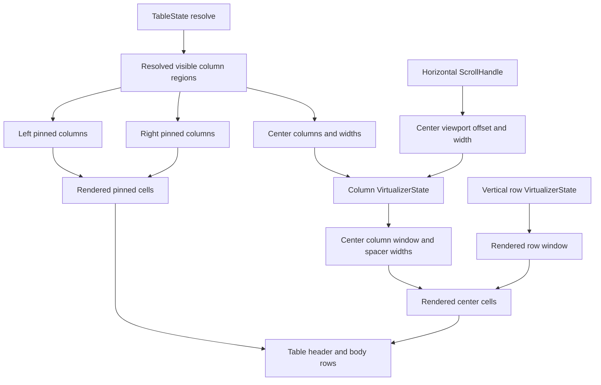

# Open GPUI Table Column Virtualization Plan

## Summary

Add horizontal center-column virtualization to the official GPUI `Table` adapter. The first slice
keeps left and right pinned lanes fully rendered, keeps row virtualization one-dimensional, and
mounts only the visible plus overscan center columns for wide tables.

## Problem Frame

The Table stack now has row models, grouping, aggregation, column sizing, resizing, pinned lane
regions, and sticky pinned center-lane scrolling. Wide tables still render every visible center
column for every rendered row. That is acceptable for current gallery samples, but it does not
scale to data-grid-style tables with hundreds of metrics columns.

TanStack Table treats virtualization as a rendering strategy rather than a table-core feature:
Table owns rows, columns, sizing, and state; TanStack Virtual owns visible indexes and total scroll
geometry. Its column examples virtualize visible columns and preserve horizontal geometry with
left/right spacer cells. Fret's table controls keep pinned groups and scroll carriers as render
plan decisions. Open GPUI should follow the same boundary: table state stays renderer-neutral, and
the GPUI adapter owns the concrete horizontal virtual window.

---

## Requirements

**Column Virtualization Contract**

- R1. Resolve a virtual center-column window from current center columns, committed widths,
  horizontal scroll offset, center viewport width, and column overscan.
- R2. Keep left and right pinned columns outside the column virtualizer so pinned lanes remain
  stable and always rendered.
- R3. Use `TableResolvedColumnSizingRegions` as the single width source for virtualized headers,
  cells, spacers, and total center-lane width.
- R4. Expose enough render-plan metadata to prove the visible center range, overscan range,
  spacer widths, total center width, and rendered center column count.

**Adapter Runtime**

- R5. Keep concrete horizontal scroll state in `ui_components::TableRuntime`; do not move
  `ScrollHandle`, bounds, wheel events, or adapter runtime state into `ui_core`.
- R6. Render center header and body cells from the same virtual center-column window so header and
  body stay aligned after horizontal scroll.
- R7. Keep row virtualization independent from column virtualization: rendered cells are the
  rendered row window crossed with the rendered center-column window plus pinned cells.
- R8. Preserve existing sorting, resizing, row selectors, cell selectors, and accessibility column
  indexes across virtualized and pinned lanes.

**Gallery and Verification**

- R9. Add a focused Table sample with many center columns and pinned edge columns so column
  virtualization is visible and testable.
- R10. Add runtime coverage proving off-window center columns are not mounted, horizontal scroll
  swaps the center column window, pinned lanes stay fixed, and the outer Components page does not
  move.
- R11. Update contract, verification, and engineering memory so center-column virtualization is no
  longer listed as deferred while server data flows and dynamic grid measurement remain later work.

---

## Acceptance Examples

- AE1. Given a wide table with pinned left and right columns plus 200 center columns, the first
  render mounts only the center columns in the visible plus overscan range.
- AE2. Given the center lane scrolls horizontally, an initially off-window center header and cell
  enter the rendered tree while a previous center column leaves it.
- AE3. Given the center lane scrolls horizontally, left and right pinned cells keep their
  screen-space x positions.
- AE4. Given the body scrolls vertically after horizontal column scrolling, the row virtualizer
  still mounts only the visible rows plus overscan.
- AE5. Given a center column is resized, the next render recomputes the center virtual range and
  spacer widths from the committed sizing state.
- AE6. Given a sortable virtualized center header is visible and activated, the existing
  `TableHeaderAction` callback still fires with the real column id.
- AE7. Given column visibility, ordering, or pinning changes, virtual indexes map to the current
  resolved center-column list rather than stale column positions.
- AE8. Given a small table or a table whose center columns do not overflow, the adapter avoids
  extra virtual-column chrome beyond the existing sticky pinned layout.

---

## Key Technical Decisions

- **Virtualize only the center lane first:** Pinned lanes are part of the navigation affordance.
  Keeping them fully rendered preserves the sticky pinned behavior and reduces the first slice's
  state space.
- **Reuse the one-dimensional virtualizer contract:** `VirtualizerState` is axis-neutral. Extend it
  only where exact per-index sizes are needed; do not introduce a table-specific grid engine in
  `ui_core`.
- **Use exact column widths instead of estimates for center columns:** Table already resolves
  committed widths. The column virtualizer should use those widths directly so spacer sizes and
  accessibility positions are deterministic.
- **Use spacer metadata, not absolute cell positioning, for Table rows:** TanStack's column
  examples preserve table-like row rendering with left/right virtual padding cells. That model fits
  the existing GPUI row-group layout better than absolutely positioning every cell.
- **Preserve the current vertical model:** Rows stay a single virtual stream. This slice should not
  add dynamic row heights, masonry lanes, or a unified two-axis scroll engine.
- **Avoid a public enablement switch initially:** Column virtualization should be an adapter
  optimization for overflowing center lanes. A public builder is only warranted for tunables such
  as `column_overscan`, not for opting into correctness.

---

## High-Level Technical Design

The adapter should resolve one column window per table render, not one per row. Header and body
rows then consume the same window. The row virtualizer still determines which rows exist, and the
column virtualizer only determines which center cells exist inside those rows.

---

## Implementation Units

### U1. Add exact-size virtualizer window support

- **Goal:** Let the existing renderer-neutral virtualizer resolve a compact window when item sizes
  are known per index.
- **Requirements:** R1, R3
- **Files:**
  - Modify `crates/ui_core/src/virtualizer.rs`
  - Modify `crates/ui_core/src/prelude.rs` only if new public contract types are introduced
  - Modify `crates/ui_components/src/lib.rs` and `crates/ui_components/src/prelude.rs` only if new
    virtualizer contract types need re-exporting
  - Modify `crates/ui_components/tests/components.rs` for public export inventory coverage when
    exports change
- **Approach:** Add a resolver shaped like `resolve_known_size_window` that accepts stable keys and
  exact sizes by index. It should compute total size, visible range, overscan range, and compact
  item measurements without materializing every item in the resolved output. Existing fixed-size
  and measurement-cache paths stay unchanged.
- **Patterns to follow:** Existing `VirtualizerState::resolve_fixed_window`,
  `VirtualizerRange`, and TanStack Virtual's `count`, `estimateSize`, `horizontal`, and `getItemKey`
  options in `repo-ref/tanstack-virtual/docs/api/virtualizer.md`.
- **Test scenarios:**
  - Variable exact sizes produce correct visible and overscan ranges.
  - Spacer-equivalent starts and ends are correct after a non-zero scroll offset.
  - Empty counts, zero viewport extents, and zero-width items return stable empty or clamped ranges.
  - Fixed-size existing tests remain unchanged.
- **Verification:** `cargo nextest run -p open-gpui-ui-core virtualizer table`

### U2. Add Table center-column window metadata

- **Goal:** Derive a reusable render-plan window for center columns from the current table state
  and horizontal runtime offset.
- **Requirements:** R1, R2, R3, R4, R5, R7
- **Files:**
  - Modify `crates/ui_components/src/table.rs`
  - Modify `crates/ui_components/tests/components.rs`
- **Approach:** Extend `TableRuntime` and `TableRenderPlan` with center-column virtualizer input
  and output. The plan should expose left and right pinned regions unchanged, plus center window
  metadata: total center width, leading spacer width, trailing spacer width, visible range,
  overscan range, rendered center columns, and whether column virtualization is active.
- **Patterns to follow:** Existing `TablePinnedLayoutPlan`,
  `TableColumnRegionRenderPlan`, `TableRenderPlan::virtualizer`, Fret
  `repo-ref/fret/ecosystem/fret-ui-kit/src/imui/table_controls/render/plan.rs`, and TanStack
  Table's guidance that visible columns remain the source list.
- **Test scenarios:**
  - A narrow center lane keeps all center columns rendered and reports virtualization inactive.
  - A wide center lane reports virtualization active and renders a bounded center column count.
  - Leading/trailing spacer widths match the known-size virtualizer output.
  - Pinning, visibility, and ordering changes recompute the center source list.
  - Pinned left/right regions are not counted in the virtualized center range.
- **Verification:** Focused component render-plan tests prove range and spacer metadata without
  needing a real window.

### U3. Render virtualized center headers and body cells

- **Goal:** Mount only the center cells in the resolved column window while preserving sticky
  pinned layout.
- **Requirements:** R2, R3, R6, R7, R8
- **Files:**
  - Modify `crates/ui_components/src/table.rs`
  - Modify `crates/ui_components/tests/components.rs`
- **Approach:** Update header and body row rendering so center lanes render leading spacer,
  rendered center columns, and trailing spacer. Left and right lanes keep the current full pinned
  rendering. All rendered rows consume the same center-column window, so the mounted cell count is
  `rendered_rows * rendered_center_columns` plus pinned cells.
- **Patterns to follow:** TanStack Table's column virtualization guide in
  `repo-ref/tanstack-table/docs/framework/react/guide/virtualization.md`, TanStack Virtual grid
  examples in `repo-ref/tanstack-virtual/examples/svelte/fixed/src/GridVirtualizerFixed.svelte`,
  and Fret's split pinned row wrapper in
  `repo-ref/fret/ecosystem/fret-ui-kit/src/imui/table_controls/row_groups/pinned.rs`.
- **Test scenarios:**
  - Off-window center header and body cell selectors are absent before horizontal scroll.
  - A later center header and body cell selector appears after scrolling the center lane.
  - Left and right pinned cell x positions do not change after horizontal scroll.
  - Vertical body scrolling after horizontal scroll still advances the row virtualizer only.
  - Group rows and aggregate cells render through the same virtual center-column window.
- **Verification:** Runtime component tests use debug bounds and selectors before and after wheel
  input.

### U4. Preserve interactions, resizing, and accessibility

- **Goal:** Keep the Table behavior contract stable after center cells become virtual.
- **Requirements:** R5, R6, R8
- **Files:**
  - Modify `crates/ui_components/src/table.rs`
  - Modify `crates/ui_components/tests/components.rs`
- **Approach:** Ensure sortable headers, resize handles, aria column indexes, row/cell debug
  selectors, and selection metadata use real resolved column identity rather than virtual index
  identity. Add a separate `column_overscan` builder only if tests show row overscan is the wrong
  control for horizontal rendering.
- **Patterns to follow:** Existing tests
  `table_runtime_pinned_headers_still_sort_after_center_scroll`,
  `table_runtime_pinned_resize_handles_emit_changes_for_center_and_pinned_columns`, and
  `component_api_inventory_uses_stable_ownership_vocabulary`.
- **Test scenarios:**
  - Sorting works for a virtualized center header after it enters the rendered window.
  - Resizing a virtualized center header emits the committed `TableColumnSizingChange`.
  - Resizing a center column updates spacer widths and keeps pinned lanes fixed.
  - Aria column indexes reflect full table column positions, not virtual-window positions.
  - API inventory is updated if a `column_overscan` builder is added.
- **Verification:** `cargo nextest run -p open-gpui-ui-components table component_api_inventory`

### U5. Add a wide Table gallery proof

- **Goal:** Make center-column virtualization inspectable in focused Components gallery mode.
- **Requirements:** R9, R10
- **Files:**
  - Modify `examples/ui-foundation-gallery/src/pages/components.rs`
  - Modify `examples/ui-foundation-gallery/src/pages/components/render.rs`
  - Modify `examples/ui-foundation-gallery/tests/foundation_gallery.rs`
  - Modify `docs/verification.md`
- **Approach:** Add a wide sample, likely `release-matrix`, with many metric columns, a pinned
  identity column, and a pinned status column. The sample summary should expose total columns,
  rendered center columns, center virtual range, lane widths, and row window counts. Add focused
  gallery smoke coverage for horizontal center-window replacement, pinned lane stability, and
  vertical row scrolling after horizontal movement.
- **Patterns to follow:** Existing `release-rollup` sticky pinned sample, `release-queue` long-row
  sample, and gallery helper `scroll_page_selector_into_view`.
- **Test scenarios:**
  - Focused Table mode renders the wide sample and its state readout.
  - Initial render omits a far-right center metric column.
  - Horizontal center scroll reveals that metric column without moving pinned lanes or the page.
  - The sample readout reports bounded rendered center columns rather than total center columns.
  - Vertical body scroll still stays inside the sample after horizontal scrolling.
- **Verification:** `cargo nextest run -p open-gpui-ui-foundation-gallery table`

### U6. Contract, memory, and final verification

- **Goal:** Record the shipped boundary and leave the next Table work unambiguous.
- **Requirements:** R11
- **Files:**
  - Modify `docs/ui/component-contract.md`
  - Modify `docs/verification.md`
  - Modify `docs/knowledge/engineering/current-state.md`
  - Modify `docs/knowledge/engineering/log.md`
- **Approach:** Update the Table contract from sticky pinned center scrolling to center-column
  virtualization over sticky pinned lanes. Keep dynamic row heights, cell measurement, server
  table flows, faceting, editing, row pinning, and tree-data tables deferred.
- **Verification commands:**
  - `cargo fmt -p open-gpui-ui-core -p open-gpui-ui-components -p open-gpui-ui-foundation-gallery`
  - `cargo nextest run -p open-gpui-ui-core virtualizer table`
  - `cargo nextest run -p open-gpui-ui-components table component_api_inventory`
  - `cargo nextest run -p open-gpui-ui-foundation-gallery table`
  - `git diff --check`
  - `python $HOME\\.codex\\skills\\engineering-wiki-memory\\scripts\\wiki_memory.py validate --root docs\\knowledge\\engineering`

---

## Scope Boundaries

### Active Scope

- Exact-size one-dimensional virtualizer support for center columns.
- Adapter-owned center-column virtualization for the official GPUI `Table`.
- Sticky pinned left/right lanes plus virtualized center columns.
- Focused component and gallery runtime proof for bounded mounted center cells.

### Deferred

- Dynamic row heights and cell measurement.
- Full cell-level measurement snapshots for two-axis grids.
- Row pinning.
- Column reorder and drag-to-pin interactions.
- Autosize-by-content and resize-to-fit.
- Server pagination, server sorting, faceting, editing, and infinite loading.
- Tree-data tables and nested source-row indentation.
- Standalone headless crate extraction.

---

## System-Wide Impact

This slice changes the performance shape of the official `Table`: mounted cells become bounded by
rendered row count and rendered center column count instead of rendered row count times all center
columns. The row model, column model, and table state cache remain in `ui_core`. GPUI-specific
scroll offsets, bounds, and wheel behavior stay in the adapter runtime.

---

## Risks and Mitigations

| Risk | Impact | Mitigation |
| --- | --- | --- |
| Virtual column indexes drift from table column identity | Wrong sort, resize, or cell selectors | Key all rendered center columns by `TableColumnId` and keep aria indexes from resolved columns |
| Spacer math becomes inconsistent after resize | Header/body misalignment | Use `TableResolvedColumnSizingRegions` as the only width source and test spacer widths after resize |
| Horizontal and vertical virtualizers fight over scroll ownership | Page scroll leaks or stale ranges | Keep vertical offset from the body `ScrollHandle` and horizontal offset from the shared center `ScrollHandle` |
| Wide grouped rows render differently from leaf rows | Aggregate cells disappear or misalign | Run group rows through the same center-column window as leaf rows |
| Auto virtualization surprises small tables | Extra wrappers and brittle selectors | Keep the non-overflowing center lane on the existing sticky pinned path |

---

## Sources and Research

- `docs/plans/2026-06-23-003-feat-ui-table-sticky-pinned-columns-plan.md`
- `docs/ui/component-contract.md`
- `docs/verification.md`
- `crates/ui_core/src/virtualizer.rs`
- `crates/ui_core/src/table.rs`
- `crates/ui_components/src/table.rs`
- `crates/ui_components/tests/components.rs`
- `examples/ui-foundation-gallery/src/pages/components.rs`
- `examples/ui-foundation-gallery/tests/foundation_gallery.rs`
- `repo-ref/tanstack-table/docs/framework/react/guide/virtualization.md`
- `repo-ref/tanstack-virtual/docs/api/virtualizer.md`
- `repo-ref/tanstack-virtual/examples/svelte/fixed/src/GridVirtualizerFixed.svelte`
- `repo-ref/tanstack-virtual/examples/vue/variable/src/components/GridVirtualizerVariable.vue`
- `repo-ref/fret/ecosystem/fret-ui-kit/src/imui/table_controls/render/plan.rs`
- `repo-ref/fret/ecosystem/fret-ui-kit/src/imui/table_controls/row_groups/pinned.rs`
- `repo-ref/fret/ecosystem/fret-ui-kit/src/imui/table_controls/row_groups/split.rs`
- `repo-ref/fret/ecosystem/fret-ui-kit/src/imui/table_controls/tests/rendering.rs`
