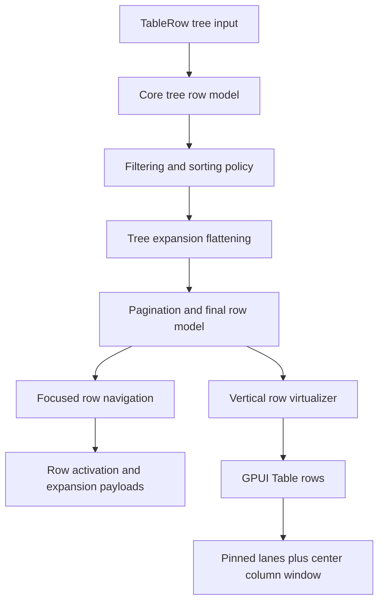

# Open GPUI Table Tree Data and Row Interaction Plan

## Summary

Add source-row hierarchy and first-class row interactions to the official `Table` family. This
slice should let a table render file-tree, dependency-tree, and issue-hierarchy data with stable
row ids, controlled expansion, keyboard/click row activation, and gallery proofs while preserving
the existing grouped-row, pinned-column, resize, and center-column virtualization work.

## Problem Frame

Open GPUI Table already supports synthetic grouped rows and controlled expansion for those groups.
That is not the same as tree data. Tree-data tables start with hierarchical source rows, preserve
parent/child relationships through filtering, sorting, pagination, and virtualization, and expose
an interaction affordance in a normal table cell.

TanStack Table models this as row expanding over `subRows`: table state owns expanded row ids, row
models flatten the visible hierarchy, and the UI renders the toggling affordance. Fret's tree
primitive keeps flattened tree entries small and renderer-neutral: id, depth, parent, child
presence, disabled, and selected state. Open GPUI should combine those ideas with the current
`TableState` shape instead of adding a standalone headless crate or a separate TreeGrid component.

---

## Requirements

**Tree Data Contract**

- R1. Let `TableRow` carry nested source rows with stable child ids and cell maps.
- R2. Resolve source tree rows into the existing row-model pipeline without converting them into
  synthetic group rows.
- R3. Preserve depth, parent id, leaf/branch metadata, descendant counts, and child availability on
  resolved tree rows.
- R4. Reuse `TableExpansionState` for tree-data expansion while keeping grouped-row expansion
  semantics intact.
- R5. Keep collapsed tree descendants addressable by stable row id through row lookup metadata.

**Row Interaction Contract**

- R6. Add row interaction payloads for click, double-click, keyboard activation, and expansion
  toggles without moving table state ownership into GPUI runtime.
- R7. Add a focused-row model so keyboard navigation can move through visible rows, skip disabled
  rows when needed, and keep selection keyed by row id.
- R8. Keep row activation independent from selection and expansion; consumers decide whether a row
  click selects, opens, toggles, or does nothing.
- R9. Preserve table, row, cell, column-header, aria row/column indexes, selected state, expanded
  state, and tree depth metadata across virtualized rows and virtualized center columns.

**Gallery and Verification**

- R10. Add a focused Components gallery sample that proves nested table rows, indentation, expand
  toggles, row focus, and row activation events.
- R11. Keep nested scroll containment intact for tree-data tables with pinned columns and center
  column virtualization.
- R12. Update the contract, verification docs, and engineering memory so tree-data tables are no
  longer listed as deferred.

---

## Acceptance Examples

- AE1. Given a `TableRow` with children, `TableState::resolve()` includes the parent row in the
  core model and keeps descendants addressable by stable row id.
- AE2. Given a branch row is collapsed, the final row model includes the branch row and excludes
  its descendants from the visible row stream.
- AE3. Given a branch row is expanded, visible descendants render with increased depth, parent id,
  and full table cells.
- AE4. Given grouping and source tree data are both configured, the first slice treats the
  combination as unsupported and keeps existing grouped-table behavior unchanged.
- AE5. Given a visible branch row receives a toggle gesture, the adapter emits a controlled
  expansion payload with row id and next expanded state.
- AE6. Given keyboard focus is on a branch row, Right expands or moves to the first child and Left
  collapses or moves to the parent, matching the existing `TreeState` behavior.
- AE7. Given a visible row receives Enter or Space, row activation emits a payload without changing
  selection unless the consumer applies a new `TableState`.
- AE8. Given a tree-data table is scrolled vertically and horizontally, the row virtualizer and
  center-column window stay bounded and the outer Components page does not move.

---

## Key Technical Decisions

- **Represent hierarchy in `TableRow`, not with a `getSubRows` callback:** Rust callers need a
  durable, cloneable state object. A closure-style hook would complicate equality, cache keys,
  testing, and future serialization.
- **Distinguish source tree rows from synthetic group rows:** Group rows are produced by grouping
  state. Tree rows are source data. Both can have depth and parents, but they must remain different
  row kinds so aggregation, grouping labels, and tree toggles do not collide.
- **Reuse expansion state, add toggle payloads:** `TableExpansionState` already represents all
  rows or explicit row ids. The adapter should emit `TableRowExpansionToggle` rather than owning
  expansion internally.
- **Add interaction payloads before richer selection modes:** Row click, double-click, keyboard
  activation, and focus are the minimum interaction foundation. Multi-select gestures, range
  selection, and checkbox-column selection can build on that foundation later.
- **Keep row navigation one-dimensional:** Keyboard movement follows visible row order and parent
  links. It does not need a spreadsheet-like cell focus grid in this slice.
- **Keep server/manual expansion deferred:** This plan targets client-owned source trees. Server
  expansion and async child loading should be a later server-flow slice.
- **Keep grouping and source tree data separate for the first slice:** Grouped rows are synthetic
  rows derived from column grouping. Tree rows are source data. Supporting both in one composition
  adds policy ambiguity for filtering, sorting, and expansion, so this slice should ship tree data
  without mixed tree/group composition.

---

## High-Level Technical Design

The implementation should keep source tree rows and grouped rows separate for this slice. Tree data
is the first shipped hierarchy source. Grouping stays on the existing synthetic grouped-row path,
and mixed tree-plus-group composition is deferred.

---

## Implementation Units

### U1. Add source-row hierarchy to the core Table contract

- **Goal:** Let `TableRow` own nested child rows while keeping flat row input unchanged.
- **Requirements:** R1, R2, R3, R5
- **Files:**
  - Modify `crates/ui_core/src/table.rs`
  - Modify `crates/ui_components/src/lib.rs` and `crates/ui_components/src/prelude.rs` only if new
    public row metadata types need re-exporting
  - Modify `crates/ui_components/tests/components.rs` for public export inventory changes
- **Approach:** Add child-row storage and builders such as `with_child` / `with_children` to
  `TableRow`. Extend resolved rows with source-tree metadata: depth, parent id, has children,
  expanded, and descendant count. Keep the existing flat constructor path identical for callers
  that do not use children.
- **Patterns to follow:** Existing `TableResolvedRow` / `TableGroupRow` metadata,
  `TreeItemDescriptor` child construction in `crates/ui_components/src/tree.rs`, and Fret
  `TreeEntry` in `repo-ref/fret/ecosystem/fret-ui-kit/src/tree.rs`.
- **Test scenarios:**
  - Flat rows resolve exactly as before.
  - Nested rows produce deterministic ids and parent/depth metadata.
  - Duplicate row-id detection includes nested descendants.
  - Collapsed descendants remain available through row lookup.
  - Cache keys change when child topology changes.
- **Verification:** `cargo nextest run -p open-gpui-ui-core table`

### U2. Resolve tree expansion in the row-model pipeline

- **Goal:** Flatten source tree rows according to caller-owned expansion state.
- **Requirements:** R2, R3, R4, R5
- **Files:**
  - Modify `crates/ui_core/src/table.rs`
  - Modify `docs/ui/component-contract.md`
- **Approach:** Add a tree-aware core model and expansion flattening step that operates on source
  hierarchy. Preserve existing grouped-row expansion behavior. Keep tree data and grouped rows on
  separate paths for this slice; do not compose them together until a later plan defines filtering,
  sorting, and expansion policy for the combination.
- **Patterns to follow:** Existing `TableExpansionState`, `push_expanded_rows`, TanStack
  `getSubRows` and `ExpandedState` behavior in
  `repo-ref/tanstack-table/docs/framework/react/guide/expanding.md`, and Fret TanStack parity
  snapshots in
  `repo-ref/fret/ecosystem/fret-ui-headless/tests/tanstack_v8_visibility_ordering_parity.rs`.
- **Test scenarios:**
  - `TableExpansionState::All` expands all source branches.
  - Explicit expanded row ids expand only matching branches.
  - Collapsing a parent hides all descendants regardless of child expansion state.
  - Filtering behavior is documented and tested for the first slice.
  - Pagination applies to the flattened final row model.
- **Verification:** `cargo nextest run -p open-gpui-ui-core table`

### U3. Add row focus, activation, and expansion payloads

- **Goal:** Give the adapter a standard controlled interaction API for visible rows.
- **Requirements:** R6, R7, R8, R9
- **Files:**
  - Modify `crates/ui_components/src/table.rs`
  - Modify `crates/ui_components/tests/components.rs`
- **Approach:** Add payload types such as `TableRowAction`, `TableRowActivation`, or
  `TableRowExpansionToggle` with row id, render key, model index, depth, and modifier metadata
  where available. Add builder callbacks for row activation and row expansion requests. Add a
  focused-row runtime value in the adapter, but keep selected/expanded state controlled by
  `TableState`.
- **Patterns to follow:** `TreeKeyboardAction`, `TreeToggle`, and `TreeSelection` in
  `crates/ui_components/src/tree.rs`; existing `TableHeaderAction` for callback payload shape.
- **Test scenarios:**
  - Clicking a row focuses it and emits row activation only when the row is enabled.
  - Double-click emits a distinct activation payload.
  - Enter and Space activate the focused row without mutating selected rows.
  - Right and Left emit expansion toggles or parent/child focus moves for tree rows.
  - Row focus remains stable across vertical virtualization when the row is still visible.
- **Verification:** `cargo nextest run -p open-gpui-ui-components table component_api_inventory`

### U4. Render tree affordances in the Table adapter

- **Goal:** Make tree rows visually and semantically inspectable without creating a separate
  TreeGrid component.
- **Requirements:** R3, R6, R9, R11
- **Files:**
  - Modify `crates/ui_components/src/table.rs`
  - Modify `crates/ui_components/tests/components.rs`
- **Approach:** Render a compact disclosure affordance in the first visible non-pinned or left
  pinned cell when the row has children. Apply indentation from resolved row depth. Expose
  `aria-expanded` only for branch rows and keep aria row indexes based on the final flattened row
  stream. Ensure center-column virtualization still receives the same row metadata for tree rows.
- **Patterns to follow:** `render_tree_item_toggle` in `crates/ui_components/src/tree.rs`, current
  Table group-row chrome, and existing pinned/center-window Table row rendering.
- **Test scenarios:**
  - Branch rows expose a toggle selector and `aria-expanded`.
  - Leaf rows do not expose toggle controls.
  - Indentation increases with depth and is present in pinned-left layouts.
  - Center-column virtualization still mounts only the active center window for tree rows.
  - Existing grouped-row chrome remains unchanged.
- **Verification:** `cargo nextest run -p open-gpui-ui-components table`

### U5. Add a tree-data Table gallery proof

- **Goal:** Prove the feature in the same conformance surface users already inspect.
- **Requirements:** R10, R11
- **Files:**
  - Modify `examples/ui-foundation-gallery/src/pages/components.rs`
  - Modify `examples/ui-foundation-gallery/src/pages/components/render.rs`
  - Modify `examples/ui-foundation-gallery/tests/foundation_gallery.rs`
  - Modify `docs/verification.md`
- **Approach:** Add a sample such as `dependency-tree` or `file-tree-table` with nested package or
  file rows, pinned identity/status columns, and enough center columns to keep current table
  foundations exercised. Add a runtime log for row activation and expansion requests if callbacks
  need proof.
- **Patterns to follow:** Existing `release-rollup`, `release-matrix`, Tree `document-outline`
  gallery sample, and focused Table gallery smokes.
- **Test scenarios:**
  - Focused Table mode renders the tree-data sample.
  - A collapsed child row is absent before toggling and present after expansion.
  - Row activation payloads are recorded without changing selection by default.
  - Vertical wheel input stays inside the table sample.
  - Horizontal center scroll still keeps pinned lanes and the page fixed.
- **Verification:** `cargo nextest run -p open-gpui-ui-foundation-gallery table`

### U6. Contract, memory, and final verification

- **Goal:** Record the shipped tree-data boundary and leave later data-grid work distinct.
- **Requirements:** R12
- **Files:**
  - Modify `docs/ui/component-contract.md`
  - Modify `docs/verification.md`
  - Modify `docs/knowledge/engineering/current-state.md`
  - Modify `docs/knowledge/engineering/log.md`
- **Approach:** Update docs to say Table supports source hierarchy and controlled row
  interactions, while server/manual expansion, row pinning, cell focus grids, editing, and
  checkbox/range selection remain follow-up work.
- **Verification commands:**
  - `cargo fmt -p open-gpui-ui-core -p open-gpui-ui-components -p open-gpui-ui-foundation-gallery`
  - `cargo nextest run -p open-gpui-ui-core table`
  - `cargo nextest run -p open-gpui-ui-components table component_api_inventory`
  - `cargo nextest run -p open-gpui-ui-foundation-gallery table`
  - `git diff --check`
  - `python $HOME\\.codex\\skills\\engineering-wiki-memory\\scripts\\wiki_memory.py validate --root docs\\knowledge\\engineering`

---

## Scope Boundaries

### Active Scope

- Source-row hierarchy inside `TableRow`.
- Controlled expansion over source tree rows.
- Row focus, row activation, and row expansion request payloads.
- Table adapter tree affordance and keyboard behavior.
- Focused Components gallery tree-data sample and runtime smoke coverage.

### Deferred

- Server/manual expansion and async child loading.
- Full spreadsheet-style cell focus and editing.
- Checkbox-column selection, range selection, and bulk selection UI.
- Row pinning and expanded-row detail panels.
- Combining grouping and source tree data.
- Standalone headless crate extraction.

---

## System-Wide Impact

This slice deepens `TableState` from a flat or synthetic-group model into a source hierarchy model.
It will affect row-model cache keys, row lookup, selection counts, aria row metadata, and adapter
keyboard handling. It should not change column sizing, pinned-column layout, center-column
virtualization, or the existing `Tree` component contract.

---

## Risks and Mitigations

| Risk | Impact | Mitigation |
| --- | --- | --- |
| Tree rows and group rows collapse into one concept | Aggregation, grouping labels, and tree toggles become ambiguous | Add explicit row-kind metadata and tests that distinguish source branches from synthetic groups |
| Filtering and sorting semantics become too broad | Implementation stalls on data-grid policy choices | Pick and document one first-slice policy; defer alternate leaf-up filtering and manual expansion |
| Row interaction mutates app-owned state internally | Controlled API becomes inconsistent with the rest of the library | Emit payloads only; require callers to rebuild `TableState` for selection or expansion changes |
| Keyboard behavior duplicates Tree logic incorrectly | Navigation feels inconsistent across components | Reuse `TreeState` navigation semantics for row-level Left/Right/Home/End where applicable |
| Gallery proof grows too wide and flaky | Automation becomes slow or scroll-sensitive | Keep one focused tree-data sample, use existing scroll-handle alignment helpers, and test selectors instead of visual copy |

---

## Sources and Research

- `docs/plans/2026-06-23-001-feat-ui-table-depth-plan.md`
- `docs/plans/2026-06-23-004-feat-ui-table-column-virtualization-plan.md`
- `docs/ui/component-contract.md`
- `docs/verification.md`
- `crates/ui_core/src/table.rs`
- `crates/ui_components/src/table.rs`
- `crates/ui_components/src/tree.rs`
- `crates/ui_components/tests/components.rs`
- `examples/ui-foundation-gallery/src/pages/components.rs`
- `examples/ui-foundation-gallery/tests/foundation_gallery.rs`
- `repo-ref/tanstack-table/docs/framework/react/guide/expanding.md`
- `repo-ref/tanstack-table/docs/reference/index/interfaces/TableState_RowExpanding.md`
- `repo-ref/tanstack-table/docs/reference/index/interfaces/Table_RowModels_Expanded.md`
- `repo-ref/fret/ecosystem/fret-ui-kit/src/tree.rs`
- `repo-ref/fret/ecosystem/fret-ui-headless/tests/tanstack_v8_visibility_ordering_parity.rs`
