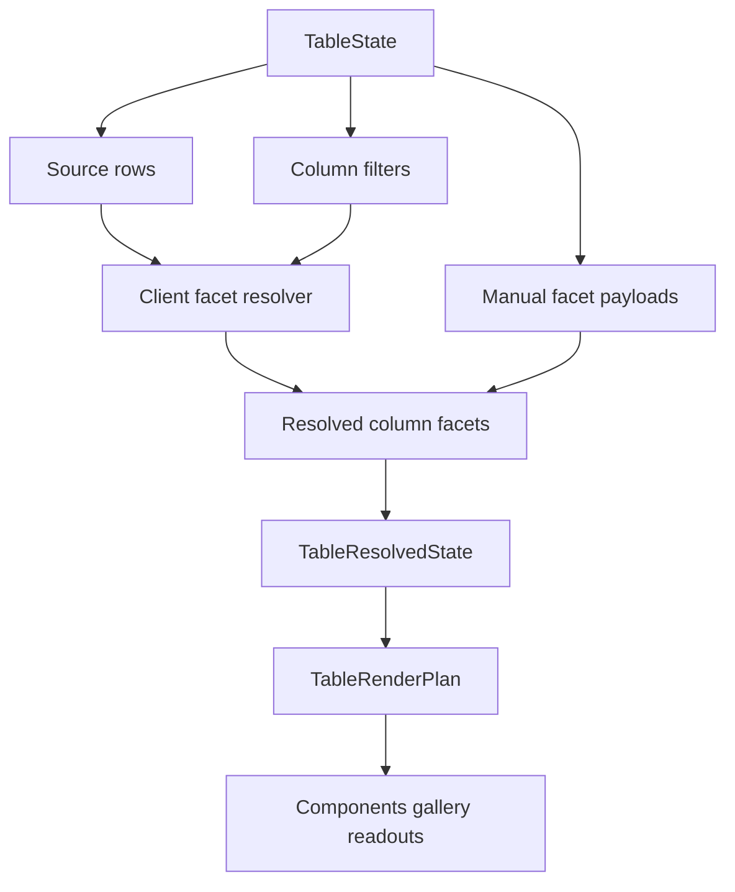

# Table faceting and filter metadata

## Summary

Table now has local and manual row-model controls. This plan adds per-column faceting metadata so filter UIs can read deterministic unique-value counts, numeric ranges, and server-provided facet payloads without moving data fetching or filter popover rendering into the component crate.

## Problem Frame

The current Table can filter, sort, paginate, group, expand, resize, pin, and virtualize columns, but it cannot answer the common filter-UI question: "what values are available for this column under the other active filters?" Applications can compute that externally, but then the official Table surface lacks the metadata contract needed for a reusable component family.

TanStack Table models faceting as a row-model sidecar: a per-column faceted row model excludes that column's own filter, then unique counts and min/max values derive from those rows. Fret's table implementation keeps the same idea while using Rust-native facet keys and explicit UI recipe counts. Open GPUI should follow that boundary: `ui_core` owns deterministic facet metadata, `ui_components` exposes it in render plans, and applications still own fetching, cache invalidation, and rich filter controls.

## Requirements

### Core faceting contract

- R1. `TableState` can resolve per-column facet metadata for configured columns without changing the existing final row-model pipeline.
- R2. Client faceting derives a column's row set by applying local filters for every other column while excluding the target column's own filter.
- R3. Unique facet values expose deterministic value/count entries using the existing `TableCellValue` vocabulary.
- R4. Numeric facet ranges expose min/max values for numeric cells and ignore empty or non-numeric cells.

### Manual and server-owned data

- R5. Manual filtering keeps client-derived facets scoped to the caller-supplied source snapshot, and server-wide counts require explicit caller-provided facet payloads.
- R6. Caller-provided facet payloads can override or supplement client-derived metadata by column id without introducing fetch/cache orchestration.
- R7. Faceting inputs participate in equality and cache keys so stale facet summaries cannot survive state changes.

### Component and gallery surface

- R8. `ui_components::TableRenderPlan` exposes facet metadata and faceting ownership in a renderer-neutral shape.
- R9. The Components gallery includes Table samples that prove local faceting and server-provided facet payloads through stable readouts and focused tests.
- R10. Component contract docs, verification docs, and engineering memory record faceting as shipped Table behavior while keeping rich filter controls deferred.

## Key Technical Decisions

- Per-column faceting ships before global faceting. The current Table has no global filter state, so adding global facet APIs now would produce an incomplete TanStack surface.
- Faceting is metadata, not another final row-model stage. It should not reorder, group, expand, paginate, or virtualize rows; it derives sidecar summaries from the pre-grouped filter basis.
- `TableCellValue` remains the public value vocabulary, but facet counting needs an internal stable ordering/keying strategy for numbers, booleans, text, and empty values.
- Manual/server facets are explicit payloads. The component crate should not own network queries, retry state, cancellation, or cache lifecycles.
- Gallery proof should start with readout-level metadata and focused assertions. A full faceted filter popover can build on the Menu/Command/Popover family later.

## High-Level Technical Design

## Implementation Units

### U1. Add core facet value types

- **Goal:** Introduce renderer-neutral types for column facet entries, numeric ranges, facet summaries, and faceting ownership.
- **Files:** `crates/ui_core/src/table.rs`, `crates/ui_core/src/prelude.rs`
- **Patterns:** Follow the current `TablePagination`, `TableStageMode`, `TableAggregation`, and `TableResolvedState` public getter style.
- **Test Scenarios:**
  - A text column facet returns stable value/count entries in deterministic order.
  - Boolean, empty, text, and numeric values do not collide in the facet keying path.
  - Numeric min/max ignores empty, text, bool, and non-finite numeric cells.
  - Empty facetable input returns an empty unique list and no numeric range.

### U2. Resolve client faceted row metadata

- **Goal:** Compute per-column client facets from source leaf rows while excluding the target column's own filter and honoring other local filters.
- **Files:** `crates/ui_core/src/table.rs`
- **Patterns:** Mirror TanStack's `createFacetedRowModel` dependency shape and Fret's `faceted_row_model_excluding` helper, but keep the result embedded in `TableResolvedState`.
- **Test Scenarios:**
  - A `status` facet with active `status=A` and `team=UI` filters ignores the `status` filter and honors the `team` filter.
  - A `team` facet in the same state ignores the `team` filter and honors the `status` filter.
  - Pagination does not limit client facet counts.
  - Grouping and expansion do not count synthetic group rows as facet values.
  - When filtering mode is manual, client facets describe only the supplied source snapshot.

### U3. Add manual facet payload support

- **Goal:** Let applications provide server-owned facet summaries for columns when the current row snapshot is not enough.
- **Files:** `crates/ui_core/src/table.rs`
- **Patterns:** Reuse the manual row-model vocabulary from `TableStageMode` where possible; keep payload construction value-based and clone-friendly.
- **Test Scenarios:**
  - Manual facet payloads are returned unchanged even when the current page rows do not contain every advertised value.
  - Manual payloads replace client-derived summaries for the same column without affecting other columns.
  - Faceting mode and manual payload content participate in `TableStateCacheKey`.
  - Unknown column payloads cannot corrupt visible-column facet lookup.

### U4. Surface facets through `ui_components::Table`

- **Goal:** Expose resolved facet metadata from `TableRenderPlan` and crate exports without adding a concrete filter toolbar.
- **Files:** `crates/ui_components/src/table.rs`, `crates/ui_components/src/lib.rs`, `crates/ui_components/src/prelude.rs`, `crates/ui_components/tests/components.rs`
- **Patterns:** Follow the current render-plan metadata accessors for row-model stage modes, pagination totals, pinned regions, and center-column windows.
- **Test Scenarios:**
  - Render-plan accessors return client facet summaries for visible columns.
  - Render-plan accessors expose manual/server facet summaries and faceting ownership.
  - Public export and API inventory tests include the new facet contract types.
  - The public resolved-state contract remains free of GPUI runtime types.

### U5. Add gallery proof for local and server facets

- **Goal:** Add focused Components gallery coverage that makes facet metadata inspectable without shipping a full faceted filter UI yet.
- **Files:** `examples/ui-foundation-gallery/src/pages/components.rs`, `examples/ui-foundation-gallery/src/pages/components/render.rs`, `examples/ui-foundation-gallery/tests/foundation_gallery.rs`
- **Patterns:** Extend `TableSampleStateSummary` the same way manual pagination and pinned-column summaries are exposed today.
- **Test Scenarios:**
  - A local faceted Table sample displays status unique counts and score min/max derived from the other active filters.
  - The local sample proves facet counts are based on pre-pagination rows.
  - The `server-paged` or a new server facet sample displays caller-provided facet counts that exceed the current page snapshot.
  - Focused Table smoke coverage asserts stable readout selectors and keeps nested table scroll contained.

### U6. Update contracts, verification, and memory

- **Goal:** Record the shipped behavior and remaining boundaries after implementation.
- **Files:** `docs/ui/component-contract.md`, `docs/verification.md`, `docs/knowledge/engineering/current-state.md`, `docs/knowledge/engineering/log.md`
- **Patterns:** Keep Table documentation consistent with the previous manual row-model controls slice.
- **Test Scenarios:**
  - Docs describe per-column faceting, manual facet payloads, and the lack of component-owned fetching.
  - Verification docs list the focused core/components/gallery gates for this slice.
  - Engineering memory names the plan, commits, verification, and next Table boundary.

## Acceptance Examples

- AE1. Given a table with `status=A` and `team=UI` filters, when the `status` facet is resolved, then counts include all statuses available inside `team=UI` and do not self-filter to `A` only.
- AE2. Given a numeric `score` column with text and empty cells mixed in, when its facet range is resolved, then min/max use only numeric cells and the unique list still reports the non-numeric values as distinct entries.
- AE3. Given a manual server-paged table showing 8 rows out of 64, when the caller provides server facet counts, then the render plan reports those server counts instead of deriving counts only from the 8 visible rows.

## Scope Boundaries

### Deferred for later

- Global faceting and global filter metadata.
- A concrete faceted filter toolbar, range slider, or autocomplete popup.
- Multi-value cell faceting.
- Fuzzy filtering scores, ranked facet suggestions, and async option search.
- Row pinning, row selection variants, cell editing, and two-axis grid virtualization.

### Outside this plan

- Real network fetching, retry, cancellation, cache invalidation, or query-client integration.
- A standalone headless crate extraction.
- Compatibility shims for applications that want to bypass the Table facet metadata surface.

## Risks & Dependencies

- Facet counting can become expensive on very large local row sets. The first implementation should stay allocation-conscious and deterministic, then rely on manual facet payloads for server-scale datasets.
- `TableCellValue::Number(f64)` needs a stable facet key policy. Non-finite values must not make equality, ordering, or cache behavior undefined.
- The gallery should not imply that a full faceted filter component shipped. Readouts and tests should name this as metadata, not a toolbar control.

## Sources / Research

- `docs/plans/2026-06-23-007-feat-ui-table-manual-row-model-controls-plan.md`
- `crates/ui_core/src/table.rs`
- `crates/ui_components/src/table.rs`
- `examples/ui-foundation-gallery/src/pages/components.rs`
- `examples/ui-foundation-gallery/tests/foundation_gallery.rs`
- `repo-ref/tanstack-table/packages/table-core/src/features/column-faceting/columnFacetingFeature.ts`
- `repo-ref/tanstack-table/packages/table-core/src/features/column-faceting/createFacetedRowModel.ts`
- `repo-ref/tanstack-table/packages/table-core/src/features/column-faceting/createFacetedUniqueValues.ts`
- `repo-ref/tanstack-table/packages/table-core/src/features/column-faceting/createFacetedMinMaxValues.ts`
- `repo-ref/tanstack-table/docs/framework/react/guide/column-faceting.md`
- `repo-ref/tanstack-table/examples/react/filters-faceted/src/main.tsx`
- `repo-ref/fret/ecosystem/fret-ui-headless/src/table/faceting.rs`
- `repo-ref/fret/ecosystem/fret-ui-headless/tests/tanstack_v8_faceting_parity.rs`
- `repo-ref/fret/ecosystem/fret-ui-shadcn/src/data_table_recipes.rs`
