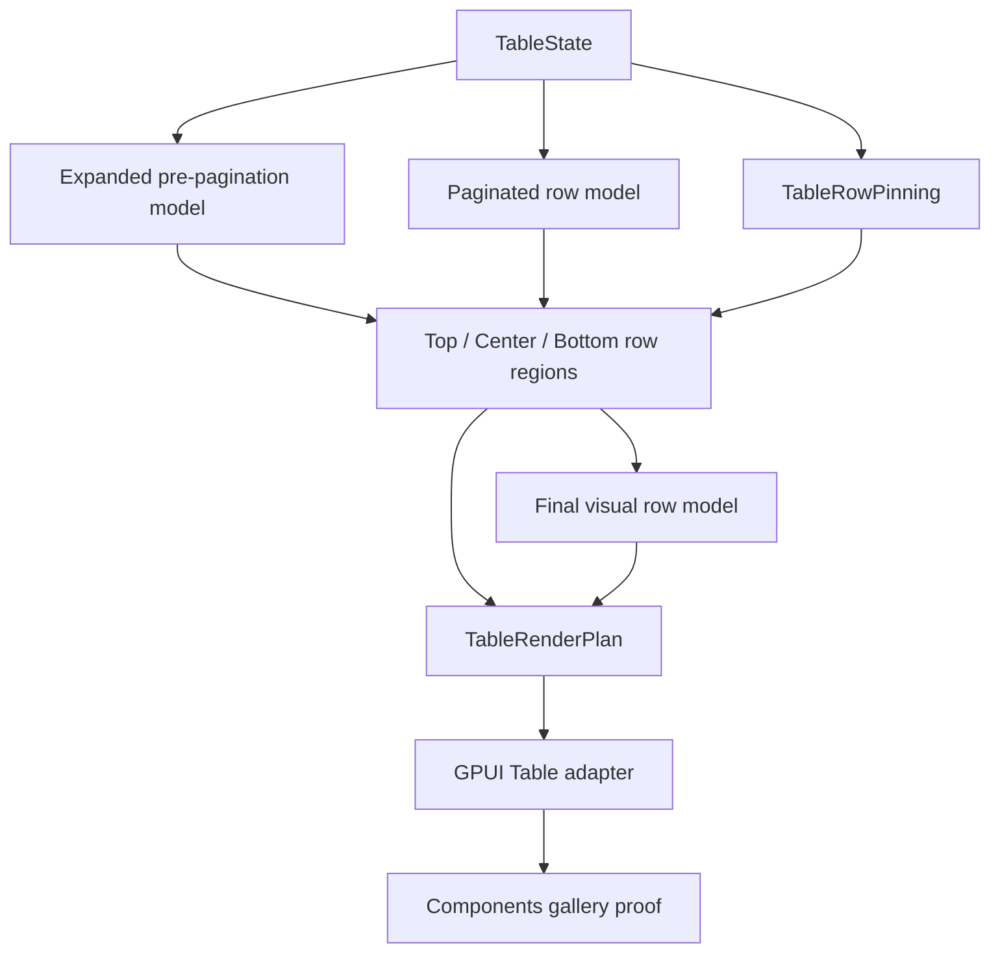

# Table row pinning

## Summary

This plan adds Table row pinning as a renderer-neutral top / center / bottom row contract. The first slice keeps data ownership in `ui_core`, renders pinned rows as fixed bands in `ui_components`, and proves the behavior in the Components gallery without adding row-selection controls, editing, or full two-axis virtualization.

## Problem Frame

The current Table can group, expand, paginate, facet, resize, pin columns, and virtualize rows, but every rendered body row still belongs to one vertical scrolling stream. Real data grids need selected operational rows, active incidents, totals, or review anchors to remain visible while the center body scrolls.

TanStack Table models row pinning as a state slice with `top` and `bottom` row ids plus APIs that split rows into top, center, and bottom lists. Fret follows the same shape in Rust and applies pinned rows around paged center rows. Open GPUI should adopt that split while preserving its existing rule: the component crate owns rendering and scroll containment, while row-model semantics stay renderer-neutral.

---

## Requirements

**Core row contract**

- R1. `TableState` can carry caller-owned row pinning state with ordered top and bottom row ids.
- R2. The resolver exposes top, center, and bottom row regions with duplicate-free visual row order.
- R3. Unknown, filtered-out, and collapsed-out pinned row ids are ignored instead of creating placeholder rows.
- R4. Pinned rows can stay visible when they are outside the current page but still present in the expanded pre-pagination row model.
- R5. A page-only pinning policy is available for callers that want pinned rows to render only when present in the current paginated model.

**Component and adapter behavior**

- R6. `ui_components::TableRenderPlan` exposes pinned row regions and uses the center region as the only vertical virtualizer input.
- R7. The GPUI adapter renders top and bottom pinned bands outside the center scroll body so vertical wheel input moves only center rows.
- R8. Accessibility row indexes, debug selectors, focus handles, activation payloads, expansion payloads, and pinned-column lanes remain stable across pinned and center rows.

**Gallery and documentation**

- R9. The Components gallery includes a focused row-pinning Table sample with stable readouts for pinned top, center, bottom, and total visual rows.
- R10. Contract docs, verification docs, and engineering memory record row pinning as shipped Table behavior while keeping selection variants, editing, and full grid virtualization deferred.

---

## Key Technical Decisions

- **Pinning is a visual row-region split after expansion and around pagination:** Top and bottom rows resolve from the expanded pre-pagination model by default, while the center region starts from the paginated model and removes pinned ids.
- **Final visual rows become top + center + bottom:** `TableResolvedState` should expose a canonical pinned-region sidecar, and its final visual model should match render order when row pinning is active.
- **Page-only behavior is explicit:** TanStack's `keepPinnedRows=false` equivalent belongs in state policy so applications can choose current-page-only rendering without adapter-specific branching.
- **The vertical virtualizer stays center-only:** Pinned bands are fixed chrome; they should not inflate center scroll height, remount as virtual rows, or leak wheel input to the outer Components page.
- **No data-source ownership moves into components:** Rows outside the expanded pre-pagination model remain invisible until the application supplies them through the existing Table row snapshot.

---

## High-Level Technical Design

---

## Implementation Units

### U1. Add core row-pinning state types

- **Goal:** Introduce renderer-neutral row pinning state, pin positions, and visibility policy.
- **Files:** `crates/ui_core/src/table.rs`, `crates/ui_core/src/prelude.rs`
- **Patterns:** Follow `TableColumnPinning`, `TablePagination`, and `TableStageMode` for caller-owned state, builder ergonomics, cache-key participation, and public getters.
- **Test Scenarios:**
  - Top and bottom pin lists preserve caller order.
  - Builder helpers remove duplicates within one region.
  - Moving a row between top and bottom removes it from the previous region.
  - Raw overlapping state resolves deterministically without rendering duplicate rows.
  - Empty row pinning is the default and leaves existing unpinned tables unchanged.

### U2. Resolve top, center, and bottom row regions in `ui_core`

- **Goal:** Partition resolved rows into pinned top, center, and bottom regions while keeping row lookup and final visual order coherent.
- **Files:** `crates/ui_core/src/table.rs`
- **Patterns:** Use TanStack's `getTopRows` / `getCenterRows` / `getBottomRows` split and Fret's `apply_row_pinning_to_paged_rows` visible-all plus paged-center approach.
- **Test Scenarios:**
  - A top-pinned row outside page 2 but inside the expanded pre-pagination model appears in the top region under the default keep-pinned policy.
  - The same row is omitted under the page-only policy when it is not part of the current paginated model.
  - A pinned row already present on the current page is removed from the center region.
  - Unknown row ids, filtered-out rows, and rows hidden by collapsed parents are ignored.
  - Top wins over bottom for overlapping raw state and no row appears twice in the final visual model.
  - Selection, tree metadata, group metadata, aggregate cells, and row lookup still resolve for pinned rows.

### U3. Surface row regions through `ui_components::TableRenderPlan`

- **Goal:** Expose pinned row render metadata and make the vertical virtualizer consume only center rows.
- **Files:** `crates/ui_components/src/table.rs`, `crates/ui_components/src/lib.rs`, `crates/ui_components/src/prelude.rs`, `crates/ui_components/tests/components.rs`
- **Patterns:** Follow `TableCenterColumnWindowPlan`, `TablePinnedLayoutPlan`, and existing render-plan metadata accessors.
- **Test Scenarios:**
  - Render-plan accessors expose top, center, and bottom row counts and ordered row ids.
  - The virtualizer count equals center row count, not total visual row count, when rows are pinned.
  - `aria_row_count` includes header plus top, center, and bottom visual rows.
  - Row render plans include stable pin-region metadata without embedding GPUI runtime types.
  - Crate-root, prelude, and API inventory tests cover the new row-pinning contract types.

### U4. Render fixed pinned row bands in the GPUI adapter

- **Goal:** Render pinned top and bottom rows outside the scrollable center body while preserving existing row interactions.
- **Files:** `crates/ui_components/src/table.rs`
- **Patterns:** Reuse the current `render_table_row` path for row chrome, cell regions, pinned-column lanes, focus handles, activation payloads, and expansion affordances.
- **Test Scenarios:**
  - Top pinned rows stay at the top of the table body after vertical wheel scroll.
  - Bottom pinned rows stay at the bottom of the table body after vertical wheel scroll.
  - Center rows scroll and virtualize independently between the pinned bands.
  - Pinned rows with left/right pinned columns keep those columns fixed during horizontal center-lane scroll.
  - Clicking, double-clicking, Enter, Space, Left, and Right on pinned rows emit the same controlled payload shape as center rows.
  - Pinned row debug selectors are stable and distinguish top, center, and bottom regions.

### U5. Add Components gallery row-pinning proof

- **Goal:** Add a focused sample that makes row pinning inspectable and catches scroll containment regressions.
- **Files:** `examples/ui-foundation-gallery/src/pages/components.rs`, `examples/ui-foundation-gallery/src/pages/components/render.rs`, `examples/ui-foundation-gallery/tests/foundation_gallery.rs`
- **Patterns:** Extend `TableSampleStateSummary` and the focused Table smoke style used by `release-rollup`, `release-matrix`, `server-paged`, and `server-tree`.
- **Test Scenarios:**
  - A new row-pinning sample displays non-zero top, center, and bottom row counts.
  - The sample proves at least one pinned row comes from outside the current page under the default keep-pinned policy.
  - Wheel input inside the center body changes center rendered rows without moving pinned bands or the outer Components page.
  - Horizontal center-lane scroll keeps pinned-column lanes fixed for pinned and center rows.
  - Gallery metadata and conformance gates include stable selectors for the row-pinning sample.

### U6. Update contracts, verification, and memory

- **Goal:** Record row pinning as an official Table capability and leave the next boundaries explicit.
- **Files:** `docs/ui/component-contract.md`, `docs/verification.md`, `docs/knowledge/engineering/current-state.md`, `docs/knowledge/engineering/log.md`
- **Patterns:** Keep the Table documentation style aligned with the manual row-model, faceting, pinned-column, and center-column virtualization slices.
- **Test Scenarios:**
  - Contract docs describe row pinning state, top/center/bottom regions, keep-pinned policy, page-only policy, and adapter scroll ownership.
  - Verification docs list focused `ui_core`, `ui_components`, and foundation-gallery row-pinning gates.
  - Engineering memory names the plan, implementation commits, verification, and next Table boundary after the slice ships.

---

## Acceptance Examples

- AE1. Given page 2 shows rows 20-39 and row 3 is pinned to the top, when the default keep-pinned policy resolves the table, then row 3 appears in the top region and rows 20-39 remain the center page except for any pinned duplicates.
- AE2. Given the same state under page-only policy, when row 3 is outside the current page, then row 3 is not rendered in top, center, or bottom.
- AE3. Given row 24 is pinned to the bottom and also belongs to the current page, when the render plan resolves, then row 24 appears once in the bottom region and the center virtualizer count is one less than the page size.
- AE4. Given a grouped table with a collapsed group, when a descendant row id inside that collapsed group is pinned, then the descendant is ignored until the application expands or supplies a visible row model containing it.

---

## Scope Boundaries

### Deferred for later

- Row pinning controls in cells or headers.
- Checkbox, range, and list-like row selection variants.
- Cell editing and row-level form validation.
- Synthetic summary rows and totals rows that are not source rows.
- Pinning rows that are absent from the application-supplied row snapshot.
- Full two-axis grid virtualization where rows and columns both virtualize across pinned regions.

### Outside this plan

- Real network fetching, cache hydration, retries, or data-source orchestration.
- Native platform table views or OS-level row pinning.
- Standalone headless crate extraction.
- Compatibility shims for applications that want an older single-stream row rendering model.

---

## Risks & Dependencies

- Pinned bands reduce the effective center viewport height. The adapter must saturate the center viewport instead of producing negative virtualizer geometry when many rows are pinned.
- Final visual row order affects accessibility row indexes and gallery readouts. Tests should assert row indexes for top, center, and bottom rows rather than only count rows.
- Pagination and pinning can surprise users if the scope is implicit. The contract must name the default keep-pinned behavior and the page-only policy.
- Reusing the current row renderer avoids interaction drift, but it also means focus-handle and debug-selector keys must include enough region context to stay unique for duplicate source ids.

---

## Sources / Research

- `docs/plans/2026-06-23-008-feat-ui-table-faceting-filter-metadata-plan.md`
- `crates/ui_core/src/table.rs`
- `crates/ui_components/src/table.rs`
- `examples/ui-foundation-gallery/src/pages/components.rs`
- `examples/ui-foundation-gallery/tests/foundation_gallery.rs`
- `docs/ui/component-contract.md`
- `docs/verification.md`
- `repo-ref/tanstack-table/packages/table-core/src/features/row-pinning/rowPinningFeature.ts`
- `repo-ref/tanstack-table/packages/table-core/src/features/row-pinning/rowPinningFeature.types.ts`
- `repo-ref/tanstack-table/packages/table-core/src/features/row-pinning/rowPinningFeature.utils.ts`
- `repo-ref/tanstack-table/docs/framework/react/guide/row-pinning.md`
- `repo-ref/fret/ecosystem/fret-ui-headless/src/table/row_pinning.rs`
- `repo-ref/fret/ecosystem/fret-ui-headless/src/table/row_model.rs`
- `repo-ref/fret/ecosystem/fret-ui-kit/src/declarative/table.rs`
