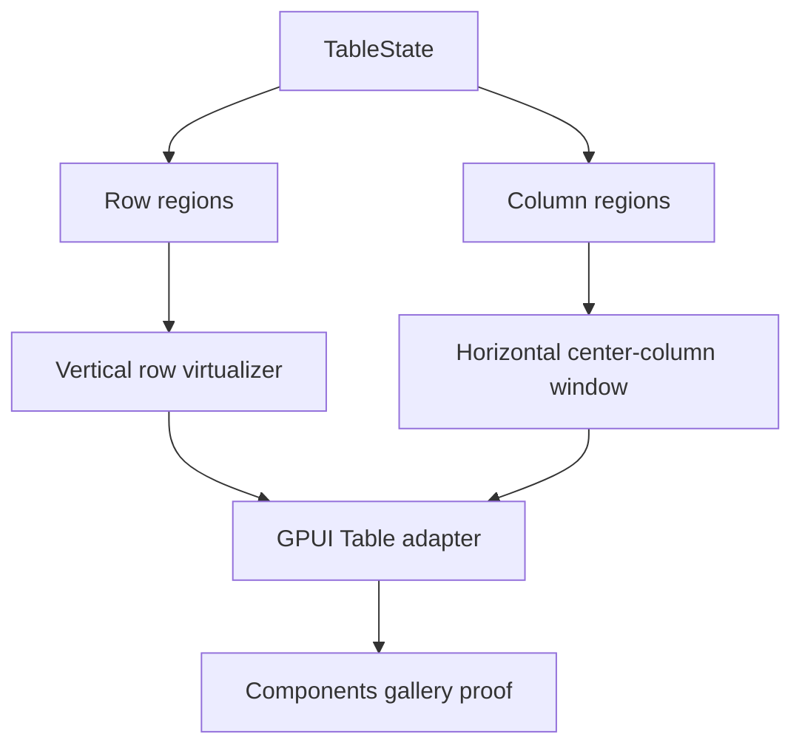

# Table two-axis virtualization

## Summary

This plan adds a Table slice for two-axis virtualization around the existing row-pinning and center-column window work. The first pass keeps the current Table contract in `ui_core`, keeps rendering in `ui_components`, and proves that a wide, row-pinned table can virtualize both axes without turning into a canvas grid or a new headless package boundary.

This is a refactor-friendly slice: when the combined two-axis path makes older adapter branches, helper duplication, or selector plumbing redundant, remove them instead of preserving parallel code paths.

## Execution Posture

This plan assumes bold cleanup after the combined path is proven. Compatibility shims, duplicate helpers, and dead branches are temporary scaffolding, not a target state, so the implementation should delete them once the new path is stable.

## Problem Frame

The current Table can already split rows into top, center, and bottom bands, and it can virtualize a horizontal center-column window. What remains is the combined case: a table that is both tall and wide, where the center body needs row and column virtualization at the same time while pinned rows and pinned columns remain fixed.

TanStack treats row virtualization and column virtualization as separate rendering strategies that can be combined. Fret's headless `GridViewport2D` shows the useful shape for a pure two-axis viewport contract: row range, column range, scroll offsets, and total dimensions. Open GPUI should keep the same boundary discipline, but the first shipped slice should stay adapter-owned and proof-driven rather than becoming a separate grid product.

## Requirements

- R1. The Table adapter can combine vertical row virtualization with horizontal center-column virtualization.
- R2. Pinned top and bottom row bands stay fixed while the center body scrolls in both axes.
- R3. Pinned left and right column lanes stay fixed while the center body scrolls in both axes.
- R4. The row and column virtualizers remain independent contracts, not a merged opaque grid engine.
- R5. The gallery exposes a focused wide-and-tall Table sample that makes two-axis scroll containment inspectable.
- R6. Contract docs, verification docs, and engineering memory record two-axis virtualization as an adapter-owned follow-up to the row-pinning and center-column slices.

## Key Technical Decisions

- **Keep two-axis behavior as adapter composition, not a new core grid type:** `ui_core` should continue to provide row regions and column regions, while `ui_components` composes the row and column virtualizers around that state.
- **Use the current row-pinning slice as the row contract:** the row virtualizer should still consume only center rows, and pinned top/bottom rows should stay outside the vertical scrolling body.
- **Use the existing center-column window as the column contract:** horizontal virtualization should continue to render only the center lane while left and right pinned columns stay fully rendered.
- **Model the combined viewport as two independent ranges:** a two-axis viewport should carry row range, column range, scroll offsets, and total dimensions, but the ranges should stay independently testable.
- **Stay away from canvas or a standalone grid crate in this slice:** the first result should be a correct, inspectable adapter surface inside the current UI crates.
- **Delete redundant adapter branches once the combined path is stable:** keep only the fast paths that still matter, and remove obsolete helper layers instead of carrying them forward as compatibility shims.

## High-Level Technical Design

The adapter reads the resolved row and column regions, composes the two virtualizers, and renders the combined body with pinned bands fixed on both axes. The goal is not to invent a brand-new data-grid engine; it is to make the current Table survive wide and tall datasets without leaking scroll ownership.

## Implementation Units

### U1. Define the two-axis table viewport contract

**Goal:** Capture the minimum viewport vocabulary needed to reason about a table that virtualizes both axes.

**Files:**

- Add `crates/ui_core/src/grid_viewport.rs`
- Modify `crates/ui_core/src/lib.rs`
- Modify `crates/ui_core/src/prelude.rs`

**Approach:** Introduce a renderer-neutral viewport contract that expresses row range, column range, scroll offsets, total width, total height, and the chosen overscan budgets. Keep it close to the current `VirtualizerState` and `GridViewport2D` shape from Fret, but avoid binding it to any specific widget tree or scroll handle.

**Patterns to follow:**

- `crates/ui_core/src/virtualizer.rs`
- `repo-ref/fret/ecosystem/fret-ui-headless/src/grid_viewport.rs`
- `repo-ref/tanstack-virtual/docs/api/virtualizer.md`

**Test scenarios:**

- The viewport contract resolves stable row and column ranges for empty, narrow, and wide inputs.
- Scroll offsets clamp to the available total size without panicking.
- The contract preserves row and column key stability when the same inputs are resolved again.
- Overscan changes only the exposed ranges, not the stable item keys.

**Verification:** Unit tests in the new foundation viewport module prove the pure contract.

### U2. Compose row and column virtualization in the Table adapter

**Goal:** Make the concrete Table render path combine the existing row and column virtualizers without collapsing them into one opaque engine.

**Files:**

- Modify `crates/ui_components/src/table.rs`
- Modify `crates/ui_components/tests/components.rs`

**Approach:** Extend the existing Table render plan so it can resolve both the vertical row window and the horizontal center-column window at once. Keep row pinning as the vertical band split, keep column pinning as the horizontal lane split, and make the adapter own the cross-product rendering logic. Preserve the current non-overflow fast path when one axis does not need virtualization.
After the combined path is proven, remove now-redundant adapter branches, duplicate selector plumbing, and dead helper code instead of leaving them behind as a second path.

**Patterns to follow:**

- `crates/ui_components/src/table.rs`
- `docs/plans/2026-06-23-004-feat-ui-table-column-virtualization-plan.md`
- `docs/plans/2026-06-23-009-feat-ui-table-row-pinning-plan.md`

**Test scenarios:**

- A wide-and-tall table renders both axes without losing row or column identity.
- Pinned top and bottom rows remain fixed while the center body scrolls vertically and horizontally.
- Pinned left and right columns remain fixed while the center body scrolls vertically and horizontally.
- Row indexes and column indexes stay stable across redraws for the same keys.
- The adapter still preserves the current row-pinning and center-column behavior when only one axis overflows.

**Verification:** Component tests prove the combined adapter behavior and keep the existing single-axis cases green.

### U3. Add a gallery sample that exercises both axes together

**Goal:** Expose a single Table sample that makes the two-axis behavior visible and regression-friendly.

**Files:**

- Modify `examples/ui-foundation-gallery/src/pages/components.rs`
- Modify `examples/ui-foundation-gallery/src/pages/components/render.rs`
- Modify `examples/ui-foundation-gallery/tests/foundation_gallery.rs`

**Approach:** Extend the current `release-matrix`-style proof or add a sibling wide table sample that combines enough rows and columns to require both row and column virtualization. Keep the sample inspectable in the Components page and verify that scrolling one axis does not leak into the outer page shell or collapse the pinned bands.

**Patterns to follow:**

- `examples/ui-foundation-gallery/src/pages/components.rs`
- `examples/ui-foundation-gallery/tests/foundation_gallery.rs`
- `docs/plans/2026-06-23-004-feat-ui-table-column-virtualization-plan.md`
- `docs/plans/2026-06-23-009-feat-ui-table-row-pinning-plan.md`

**Test scenarios:**

- The sample exposes a wide and tall table with both pinned rows and pinned columns.
- Vertical scrolling changes the row window while leaving pinned rows in place.
- Horizontal scrolling changes the center column window while leaving pinned columns in place.
- The outer Components page stays fixed while the sample scrolls.
- The sample keeps stable debug selectors for the combined row and column windows.

**Verification:** Gallery tests prove the combined scroll containment and the sample metadata.

### U4. Update contracts, verification, and memory

**Goal:** Record two-axis virtualization as the next explicit Table boundary.

**Files:**

- Modify `docs/ui/component-contract.md`
- Modify `docs/verification.md`
- Modify `docs/knowledge/engineering/current-state.md`
- Modify `docs/knowledge/engineering/log.md`

**Approach:** Document that two-axis virtualization is adapter-owned composition over the existing row and column region contracts. Keep the next boundary explicit so later work can move into tree tables, richer grid semantics, or a headless grid helper without reopening the same scope question.

**Patterns to follow:**

- Current Table contract wording
- Current verification format
- Current engineering memory entries

**Test scenarios:**

- The docs describe the two-axis boundary without implying a new standalone grid product.
- The docs keep row pinning, column pinning, and two-axis virtualization in the right order.
- Engineering memory records the implemented slice, the verification used, and the next Table boundary.

**Verification:** Docs and memory stay aligned with the behavior that actually shipped.

## Scope Boundaries

### Deferred for later

- A standalone headless grid crate.
- Canvas-backed or GPU-backed grid rendering.
- Cell-level virtualization that replaces table row and column region composition.
- Tree-table refinements beyond the existing row-model contracts.
- New editing, selection, or data-loading semantics.

### Outside this plan

- Replacing the current Table adapter with a different grid product.
- Copying TanStack or Fret APIs wholesale.
- Moving scroll ownership back to the page shell.

## Risks & Dependencies

- Combining two axes can make the center viewport easy to miscompute. The plan should keep row and column viewport math separate so a regression shows up in one axis instead of both.
- The gallery proof can become noisy if it tries to cover every table variation at once. Keep the sample focused on one wide-and-tall case with pinned bands and stable selectors.
- The existing row-pinning slice already changes the effective center viewport height. The combined adapter must continue to treat pinned rows as fixed chrome, not as part of the center virtualizer.
- The current column virtualization slice already depends on stable region metadata. This plan should reuse that contract rather than re-deriving column windows in the gallery.

## Sources / Research

- `docs/plans/2026-06-23-009-feat-ui-table-row-pinning-plan.md`
- `docs/plans/2026-06-23-004-feat-ui-table-column-virtualization-plan.md`
- `crates/ui_core/src/virtualizer.rs`
- `crates/ui_core/src/table.rs`
- `crates/ui_components/src/table.rs`
- `examples/ui-foundation-gallery/src/pages/components.rs`
- `examples/ui-foundation-gallery/tests/foundation_gallery.rs`
- `docs/ui/component-contract.md`
- `docs/verification.md`
- `repo-ref/fret/ecosystem/fret-ui-headless/src/grid_viewport.rs`
- `repo-ref/fret/ecosystem/fret-ui-shadcn/src/data_grid.rs`
- `repo-ref/fret/ecosystem/fret-ui-shadcn/src/data_grid_canvas.rs`
- `repo-ref/tanstack-table/docs/framework/react/guide/virtualization.md`
- `repo-ref/tanstack-virtual/docs/api/virtualizer.md`
