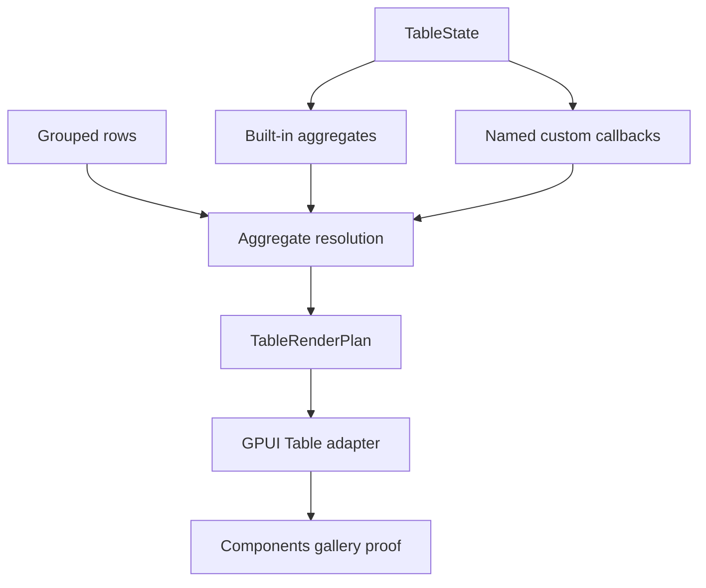

# Table custom aggregation callbacks

## Summary

This plan adds named custom aggregation callbacks to Table so grouped rows can use app-owned summary logic beyond the built-in count, sum, min, max, and average kinds. The slice keeps the row-model resolver in `ui_core`, keeps rendering in `ui_components`, and proves the behavior in the Components gallery without turning Table into a general plugin system.

## Problem Frame

Built-in aggregates cover the common summary cells, but some tables need domain-specific grouped values such as median, unique counts, or normalized business totals. Current docs already mark custom aggregate callbacks as follow-up work, so the remaining gap is a stable callback seam rather than a new grouping model.

TanStack and Fret both separate built-in aggregate kinds from named custom aggregation functions. That split is the useful boundary to copy here: Table should stay renderer-neutral, keep grouped-row summaries inspectable, and let applications register named custom aggregations without moving aggregation semantics into the GPUI adapter.

---

## Requirements

**Core callback contract**

- R1. `TableState` can register named custom aggregation callbacks and resolve them for grouped rows.
- R2. Built-in aggregate kinds continue to work unchanged, and custom callbacks can be mixed in the same grouped table.
- R3. Named custom aggregation entries override built-in lookup only when the same name is registered explicitly.
- R4. Callback registration and spec identity participate in state equality and cache keys.

**Resolution behavior**

- R5. Custom callbacks receive the grouped row set for a column and return a `TableCellValue`.
- R6. Missing or unknown custom names resolve safely and do not panic or break unrelated columns.

**Component and gallery behavior**

- R7. `ui_components::TableRenderPlan` exposes custom aggregation metadata without owning callback semantics.
- R8. The Components gallery includes a focused grouped Table sample that shows a custom callback and a built-in aggregate side by side.
- R9. Contract docs, verification docs, and engineering memory record custom aggregation callbacks as shipped behavior while keeping row pinning, two-axis virtualization, selection variants, editing, and multi-aggregation-per-column outside this slice.

---

## Key Technical Decisions

- **Use named custom aggregation registration rather than anonymous closures in the row model:** stable names keep cache keys and grouped state inspectable, which matches the TanStack and Fret shape.
- **Keep callback execution in the core grouped aggregation pipeline:** aggregate values stay part of the renderer-neutral contract instead of becoming adapter-only view logic.
- **Treat missing names as safe empty results:** aggregation configuration drift should not break table rendering.
- **Keep this slice to one callback per column:** multi-aggregation fanout is a separate design and remains deferred.

---

## High-Level Technical Design

The resolver keeps the current built-in aggregate path intact, then applies named custom callbacks when the grouped column requests them. The plan stays intentionally narrower than a general table-plugin system.

---

## Implementation Units

### U1. Add named custom aggregation registration to core

- **Goal:** Let Table store stable custom aggregation names and registry entries.
- **Files:** `crates/ui_core/src/table.rs`, `crates/ui_core/src/prelude.rs`, `crates/ui_components/tests/components.rs`
- **Patterns:** Follow `TableAggregation`, `TableAggregateKind`, TanStack's `aggregationFns` registry, and Fret's `AggregationFnSpec` / `aggregation_fn_named` split.
- **Test Scenarios:**
  - Registered callback names resolve deterministically.
  - Duplicate registrations resolve predictably instead of panicking.
  - Registry identity changes invalidate equality and cache keys.
  - Existing built-in aggregate specs continue to resolve unchanged.

### U2. Resolve custom callback aggregates in grouped rows

- **Goal:** Compute custom aggregate cells alongside built-in aggregates in the core grouped-row pipeline.
- **Files:** `crates/ui_core/src/table.rs`, `crates/ui_components/src/table.rs`, `docs/ui/component-contract.md`
- **Patterns:** Reuse the current aggregate cell resolution helpers, the grouped-row pipeline, and the Fret parity tests for built-in plus named aggregation lookup.
- **Test Scenarios:**
  - A custom callback receives the grouped row set and returns the expected `TableCellValue`.
  - Built-in `sum` and `count` continue to work in the same grouped table.
  - Named custom callbacks override built-in lookup only when explicitly registered.
  - Missing custom names resolve to empty cells without changing row lookup or pinning behavior.
  - Custom aggregation does not change leaf row values, expansion behavior, or row order.

### U3. Add a gallery proof for custom aggregation callbacks

- **Goal:** Expose custom aggregations in the Components gallery as a regression-friendly sample.
- **Files:** `examples/ui-foundation-gallery/src/pages/components.rs`, `examples/ui-foundation-gallery/src/pages/components/render.rs`, `examples/ui-foundation-gallery/tests/foundation_gallery.rs`
- **Patterns:** Extend the grouped Table gallery style already used by `release-rollup`, `server-paged`, and `server-tree`.
- **Test Scenarios:**
  - A focused grouped sample shows one custom callback and one built-in aggregate side by side.
  - The sample metadata exposes the custom aggregation name and grouped totals.
  - Wheel input stays inside the sample and does not move the outer Components page.
  - Focused Table mode renders the sample with stable selectors.

### U4. Update contracts, verification, and memory

- **Goal:** Record custom aggregation callbacks as shipped behavior and leave the next Table boundaries explicit.
- **Files:** `docs/ui/component-contract.md`, `docs/verification.md`, `docs/knowledge/engineering/current-state.md`, `docs/knowledge/engineering/log.md`
- **Patterns:** Match the documentation style already used for grouping, aggregation, pinned columns, row pinning, and center-column virtualization.
- **Test Scenarios:**
  - Contract docs describe named custom aggregation callbacks, built-in fallback, and safe missing-name behavior.
  - Verification docs list the focused core, components, and gallery gates for the slice.
  - Engineering memory records the implementation, verification, and remaining Table follow-ups.

---

## Acceptance Examples

- AE1. Given a grouped table with `median_duration` registered for `duration`, group rows render the registered custom value.
- AE2. Given a grouped table that mixes `sum(score)` and `median(duration)`, both cells resolve in the same group row without changing row order or pinning.
- AE3. Given a grouped table that references an unknown custom callback name, the table still renders and the unresolved cell stays empty.

---

## Scope Boundaries

### Deferred for later

- Multiple aggregation callbacks per column.
- A general plugin system for non-table features.
- Global faceting or filter toolbar UI.
- Editing, row-selection variants, or tree-table changes beyond the current contracts.
- Moving aggregation rendering into the GPUI adapter.

### Outside this plan

- Reworking the built-in aggregate kinds shipped in the previous Table depth slice.
- Introducing a standalone headless crate.
- Replacing the current Table adapter with a different grid product.

---

## Risks & Dependencies

- Callback registration must invalidate cache keys; otherwise stale aggregate cells can survive after the registry changes.
- Callback semantics must stay deterministic across grouped, expanded, and paginated row models.
- The gallery proof can become noisy if it tries to cover every aggregate shape, so the sample should stay focused on one custom callback and one built-in comparison.
- The current contract docs still describe custom callbacks as deferred, so the docs update must land with the code to avoid a temporary mismatch.

---

## Sources / Research

- `docs/plans/2026-06-23-001-feat-ui-table-depth-plan.md`
- `docs/plans/2026-06-23-009-feat-ui-table-row-pinning-plan.md`
- `docs/plans/2026-06-24-001-feat-ui-table-two-axis-virtualization-plan.md`
- `crates/ui_core/src/table.rs`
- `crates/ui_components/src/table.rs`
- `examples/ui-foundation-gallery/src/pages/components.rs`
- `examples/ui-foundation-gallery/tests/foundation_gallery.rs`
- `docs/ui/component-contract.md`
- `docs/verification.md`
- `repo-ref/tanstack-table/docs/framework/react/guide/grouping.md`
- `repo-ref/tanstack-table/docs/reference/index/variables/aggregationFns.md`
- `repo-ref/tanstack-table/examples/react/grouping/src/main.tsx`
- `repo-ref/fret/ecosystem/fret-ui-headless/src/table/aggregation_fns.rs`
- `repo-ref/fret/ecosystem/fret-ui-headless/src/table/row_model.rs`
- `repo-ref/fret/ecosystem/fret-ui-headless/tests/tanstack_v8_grouping_aggregation_fns_parity.rs`
