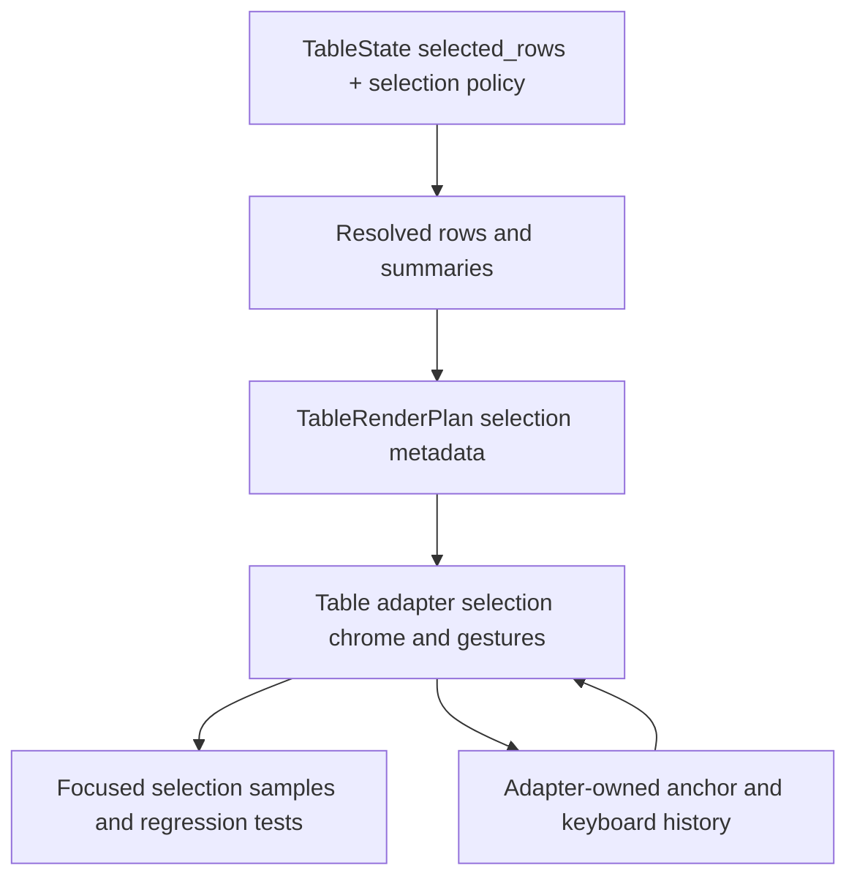

# Table row selection variants

## Summary

This plan adds first-class Table row-selection variants so the same Table family can render checkbox, radio, and list-like selection behavior on top of the existing stable selected-row state. The slice keeps selection semantics renderer-neutral in `ui_core`, keeps gesture handling and selection chrome in `ui_components`, and proves the contract in the Components gallery without turning Table into a general data-grid interaction engine.

## Problem Frame

Table already records selected row ids, but selection is still a passive state slice. Applications that need selectable tables currently have to invent their own checkbox columns, single-select logic, range anchors, and select-all behavior, which fragments the contract and makes regression coverage brittle.

TanStack and Fret treat row selection as a distinct feature surface with explicit policy knobs. Open GPUI should copy that boundary, but it should keep the selection model keyed by stable row ids and keep transient pointer and keyboard history inside the adapter runtime.

---

## Requirements

**Core selection model**

- R1. `TableState` keeps selection keyed by stable row id and preserves it across filtering, sorting, grouping, expansion, pagination, and pinning.
- R2. `TableState` exposes explicit selection policy inputs for multi vs single selection, row-click vs explicit control behavior, and sub-row propagation.
- R3. `TableRenderPlan` exposes selection summaries for full-model and current-page scopes, including selected count and all/some/none state.

**Adapter interactions**

- R4. `ui_components::Table` emits controlled selection requests for row toggle, replace, range extend, select-all, and page-select-all actions, and the adapter owns any range anchor or keyboard history needed to satisfy those requests.
- R5. Checkbox, radio, and list-like selection variants reuse the existing row renderer and remain separate from row activation and row expansion.

**Gallery and documentation**

- R6. The Components gallery exposes focused selection samples and the contract docs and verification docs record the shipped behavior and explicit follow-ups.

---

## Key Technical Decisions

- **Keep selection keyed by stable row ids.** Positional selection would drift as rows are filtered, grouped, paginated, or virtualized.
- **Model checkbox, radio, and list-like selection as recipes over one contract.** The variants should differ in interaction and chrome, not in row identity rules.
- **Keep range anchors in adapter runtime.** Core state should describe current selection, not click history.
- **Treat select-all scope explicitly.** Current-page selection and full-model selection are different actions and should stay different in the contract.
- **Make sub-row propagation a policy.** Grouped and tree rows should not infer descendant selection behavior implicitly.

---

## High-Level Technical Design

---

## Implementation Units

### U1. Add core selection policy and summary helpers

- **Goal:** Represent selection policy and summaries without moving UI runtime state into `ui_core`.
- **Files:** `crates/ui_core/src/table.rs`, `crates/ui_core/src/prelude.rs`, `crates/ui_components/tests/components.rs`
- **Patterns:** Keep `selected_rows` as the canonical id set, mirror the existing policy enums used by pinning and stage ownership, and let the resolver expose selection summaries from the final row model.
- **Test Scenarios:**
  - Single-selection policy keeps at most one selected row id.
  - Multi-selection policy preserves multiple stable row ids.
  - Sub-row propagation includes or excludes descendants according to policy.
  - Full-model and current-page selection summaries report consistent all/some/none state.
  - Selection survives filtering, grouping, expansion, pagination, and pinning because it stays keyed by row id.

### U2. Add controlled selection requests and adapter runtime state

- **Goal:** Emit selection change requests from table gestures while keeping range anchors and keyboard history adapter-owned.
- **Files:** `crates/ui_components/src/table.rs`, `crates/ui_components/src/lib.rs`, `crates/ui_components/src/prelude.rs`, `crates/ui_components/tests/components.rs`
- **Patterns:** Follow the existing `on_row_activate` and `on_row_expansion_request` split, and keep selection callbacks controlled rather than mutating caller state inside the component.
- **Test Scenarios:**
  - Row toggle requests carry stable row ids and selection scope metadata.
  - Select-all and page-select-all requests stay distinct.
  - Range extension uses adapter-owned anchor state and does not leak into `ui_core`.
  - Selection gestures do not suppress row activation or row expansion payloads.
  - Non-selectable or disabled rows are ignored by the selection gesture path.

### U3. Render checkbox, radio, and list-like selection recipes

- **Goal:** Add inspectable selection chrome using the existing row renderer and the existing Checkbox and Radio primitives.
- **Files:** `crates/ui_components/src/table.rs`, `examples/ui-foundation-gallery/src/pages/components.rs`, `examples/ui-foundation-gallery/src/pages/components/render.rs`
- **Patterns:** Use a dedicated selection column for checkbox and radio variants, keep list-like selection on the row chrome, and keep activation and expansion visually distinct from selection.
- **Test Scenarios:**
  - Checkbox selection renders a header select-all control and an indeterminate state.
  - Radio selection renders a single-choice table that clears the previous row.
  - List-like selection toggles from row clicks and modifier keys without stealing activation.
  - Selection samples stay inside the Components page viewport and remain inspectable in focused mode.
  - The rendered selection chrome keeps stable selectors for gallery tests.

### U4. Add gallery and contract proof

- **Goal:** Make the new selection variants visible in the Components gallery and record the shipped contract.
- **Files:** `examples/ui-foundation-gallery/tests/foundation_gallery.rs`, `docs/ui/component-contract.md`, `docs/verification.md`
- **Patterns:** Match the existing Table sample/readout style and keep the selection samples focused instead of folding them into the larger release-table proofs.
- **Test Scenarios:**
  - Focused Table mode renders the new selection samples.
  - Gallery readouts expose the current selection mode, counts, and summaries.
  - Table sample scrolling remains local to the sample viewport.
  - Contract docs name the shipped selection recipes and the explicit follow-ups.

### U5. Refresh engineering memory and verification gates

- **Goal:** Capture the shipped selection slice and the next Table boundary in durable repo-local memory.
- **Files:** `docs/knowledge/engineering/current-state.md`, `docs/knowledge/engineering/log.md`
- **Patterns:** Keep the memory bundle aligned with the plan and the verification surface, and record the remaining Table gaps without inventing new scope.
- **Test Scenarios:**
  - Engineering memory records the selection slice, the commit or commits that land it, and the next Table follow-up.
  - Verification notes reference the focused `ui_core`, `ui_components`, and foundation-gallery gates used for the slice.

---

## Acceptance Examples

- AE1. Given a checkbox-selection table on page 2, when the header select-all control is toggled, then every selectable row in the current scope becomes selected and the header reports the correct all/some state.
- AE2. Given a radio-selection table, when a new row is selected, then the previous row is cleared and row activation still emits independently.
- AE3. Given a list-like selection table, when shift-click extends the current anchor across contiguous rows, then the selection set expands without changing row order or row ids.
- AE4. Given grouped or tree rows with sub-row propagation enabled, when a parent row is selected, then the resolved summaries reflect descendant selection and the adapter can render an indeterminate state when only some descendants are selected.

---

## Scope Boundaries

### Deferred for later

- Cell editing and row-level validation.
- Server-synced selection persistence and remote conflict resolution.
- A general table feature plugin system.
- Standalone headless extraction.

### Outside this plan

- Changing the row-model ordering.
- Native platform table views or OS selection APIs.
- Non-table selection widgets.

---

## Risks & Dependencies

- Selection can silently become positional if helpers use visible indexes instead of stable row ids.
- Range anchors and select-all state can drift when the current page or filter changes.
- Grouped and tree rows can produce partial or duplicate-looking states unless the policy and summaries are explicit.
- The gallery already carries several table samples, so the new selection variants must stay focused or the Components page becomes hard to scan.

---

## Sources / Research

- `docs/ui/component-contract.md`
- `docs/verification.md`
- `crates/ui_core/src/table.rs`
- `crates/ui_components/src/table.rs`
- `examples/ui-foundation-gallery/src/pages/components.rs`
- `repo-ref/tanstack-table/docs/framework/react/guide/row-selection.md`
- `repo-ref/tanstack-table/docs/reference/index/interfaces/TableState_RowSelection.md`
- `repo-ref/tanstack-table/docs/reference/index/interfaces/TableOptions_RowSelection.md`
- `repo-ref/tanstack-table/docs/reference/index/interfaces/Table_RowSelection.md`
- `repo-ref/fret/ecosystem/fret-ui-headless/src/table/row_selection.rs`
- `repo-ref/fret/ecosystem/fret-ui-kit/src/declarative/table.rs`
