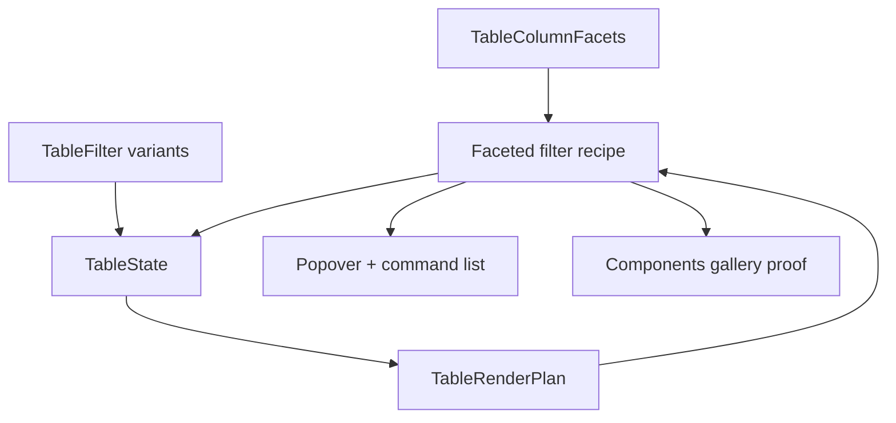

# Table faceted filter controls

## Summary

This plan turns the existing Table faceting metadata into an actual faceted filter control. It keeps facet summaries renderer-neutral in core, adds deterministic categorical filter variants, and ships a focused Popover + Command-backed recipe plus gallery proof for a single-column control.

The slice is intentionally narrower than a full filter system. It does not add global faceting, numeric range sliders, or server-fetched facet search.

---

## Problem Frame

Table already computes per-column facet metadata, but it still lacks an official control surface that lets users pick a facet value and apply it through the Table contract. The current gallery can show filtered rows and facet counts, but the filtering interaction itself is still app-owned and stringly typed.

TanStack and Fret both solve this with a popover-based faceted filter recipe built on exact-value selection and searchable option lists. Open GPUI should follow that pattern, but keep the control local to one column and keep the core contract renderer-neutral.

---

## Requirements

### Core filter contract

- R1. `TableFilter` supports exact categorical selection alongside the existing contains filter, and matching stays deterministic across equality and cache keys.
- R2. Categorical filters operate on stable facet tokens derived from row values, not on labels, so UI text can change without changing filter semantics.
- R3. Clearing a categorical selection removes only that column's facet filter and preserves unrelated filters and row-model behavior.

### Component recipe

- R4. The recipe can read current `TableColumnFacets`, show selected counts and labels, search the visible options, and clear selected values.
- R5. The recipe emits controlled filter updates against app-owned table state, while search text and popup open state stay adapter-owned.
- R6. Missing or empty facet metadata resolves safely and does not panic or corrupt unrelated column filters.

### Gallery proof

- R7. The Components gallery includes a focused faceted-filter Table sample that proves selecting values changes the rendered row set.
- R8. The faceted popup keeps wheel and scroll input inside the sample viewport.
- R9. Contract docs, verification docs, and engineering memory record the shipped control and its explicit follow-ups.

---

## Key Technical Decisions

- **Model categorical facet selection as exact stable tokens, not display labels.** The UI needs deterministic round-tripping, and the Table core already exposes stable filter tokens through row values.
- **Keep search local to the popup.** Search narrows choices; it does not become table filter semantics.
- **Build on existing `Popover` + command-palette primitives.** The component library already has the search, list, and checked-item behavior needed for this control.
- **Start with one-column categorical faceted filters only.** Numeric range sliders, global faceting, and async facet loading are separate slices.

---

## High-Level Technical Design

The core filter model stays renderer-neutral. The recipe reads facet metadata and the current filter set, renders a searchable option list, and writes controlled filter updates back into app-owned table state.

---

## Implementation Units

### U1. Extend core filter semantics for categorical facet selection

**Goal:** Add a categorical exact-match filter variant to `TableFilter` and make row-model resolution understand it without disturbing contains filtering.

**Files:**

- Modify `crates/ui_core/src/table.rs`
- Modify `crates/ui_core/src/prelude.rs`
- Modify `crates/ui_components/tests/components.rs`

**Patterns to follow:**

- `TableFilter` and `TableStateCacheKey` in `crates/ui_core/src/table.rs`
- Existing `contains` filter behavior and cache-key derivation
- Facet token handling from `TableCellValue::filter_text()`

**Test scenarios:**

- Contains filters keep their current substring behavior.
- Categorical filters match exact facet tokens and can carry multiple selected values for one column.
- Empty categorical selections behave like no filter and are not retained in cache keys.
- Filter equality and cache keys change when the selected value set changes.
- Manual filtering still scopes facet evaluation to the caller-supplied snapshot.

### U2. Add a faceted filter recipe in `ui_components`

**Goal:** Ship a reusable filter control for one column that shows counts, supports search, and toggles exact categorical selections through app-owned table state.

**Files:**

- Modify `crates/ui_components/src/table.rs`
- Modify `crates/ui_components/src/lib.rs`
- Modify `crates/ui_components/src/prelude.rs`
- Modify `crates/ui_components/tests/components.rs`

**Patterns to follow:**

- Existing `Popover`, `Command`, `Checkbox`, `TextInput`, and controlled callback conventions in `crates/ui_components/src/command.rs`, `crates/ui_components/src/popover.rs`, and `crates/ui_components/src/text_input.rs`
- The existing Table recipe and component export style in `crates/ui_components/src/table.rs`
- Fret's `DataTableToolbar::faceted_filter` recipe shape, adapted to Open GPUI state ownership

**Test scenarios:**

- The trigger shows the selected count and selected labels for the active column.
- Search narrows the popup option list without mutating table filters.
- Toggling an item adds or removes the corresponding categorical token from the app-owned filter set.
- Selection changes reset the app-owned pagination index to the first page.
- Clear-all removes the filter for that column and leaves unrelated filters intact.
- Empty or missing facet metadata renders a safe empty state.
- Popup scroll handling stays local and does not move the outer page shell.

### U3. Add a gallery proof for faceted filtering

**Goal:** Expose the new control in the Components gallery and prove that it changes a real Table sample.

**Files:**

- Modify `examples/ui-foundation-gallery/src/pages/components.rs`
- Modify `examples/ui-foundation-gallery/src/pages/components/render.rs`
- Modify `examples/ui-foundation-gallery/tests/foundation_gallery.rs`

**Patterns to follow:**

- The existing `filter-board` and `server-paged` Table samples
- The existing facet readout rendering in `examples/ui-foundation-gallery/src/pages/components/render.rs`
- TanStack's faceted filters example and Fret's toolbar recipe

**Test scenarios:**

- The sample renders a faceted filter trigger for one column.
- Selecting values changes the filtered row set and the sample readout.
- Clearing selections restores the unfiltered row set.
- Wheel and scroll input stay inside the sample viewport.
- Stable selectors remain available in focused and full gallery modes.

### U4. Update contracts, verification, and memory

**Goal:** Record the control as shipped behavior and leave the next Table boundaries explicit.

**Files:**

- Modify `docs/ui/component-contract.md`
- Modify `docs/verification.md`
- Modify `docs/knowledge/engineering/current-state.md`
- Modify `docs/knowledge/engineering/log.md`

**Patterns to follow:**

- The existing faceting metadata wording in `docs/ui/component-contract.md`
- The current verification format used for Table and gallery slices
- The current engineering memory entries for shipped Table work

**Test scenarios:**

- Docs describe categorical faceted filter controls without implying global faceting or a range slider.
- Verification docs list the focused core, components, and gallery gates used for the slice.
- Engineering memory records the implementation, verification, and remaining Table follow-ups.

---

## Acceptance Examples

- AE1. Given a table with `status` facet values `Blocked`, `Queued`, `Ready`, and `Review`, when the user selects `Ready`, then only rows with the exact `Ready` token remain and other filters still apply.
- AE2. Given the faceted filter popup on a long option list, when the user types a search term, then only matching options remain visible and the outer page does not scroll.
- AE3. Given a board sample with a cleared faceted filter, when the user closes and reopens the popup, then the selected count and checked items reflect the current table state.

---

## Scope Boundaries

### Deferred for later

- Global faceting and global filter metadata.
- Numeric range sliders or histogram-style filter UIs.
- Server-supplied remote option search or async facet loading.
- A general table filter builder for combining arbitrary predicates.
- Standalone headless extraction.

### Outside this plan

- Replacing the current Table filtering model with a general query language.
- New pagination, sorting, or selection semantics beyond the filter change needed for this control.

---

## Risks & Dependencies

- A stringly exact-token filter can drift if the UI stores labels instead of stable facet tokens, so the implementation must keep labels and tokens separate.
- If the recipe mutates table state without a controlled update path, it can fight with the gallery render loop.
- The popup can become noisy if the sample tries to cover every facet shape, so keep the proof focused on one categorical column and one filtered board.
- Numeric range support is not included, so the first slice must not accrete a second filter family.

---

## Sources / Research

- `docs/plans/2026-06-23-008-feat-ui-table-faceting-filter-metadata-plan.md`
- `crates/ui_core/src/table.rs`
- `crates/ui_components/src/table.rs`
- `crates/ui_components/src/command.rs`
- `crates/ui_components/src/popover.rs`
- `crates/ui_components/src/text_input.rs`
- `examples/ui-foundation-gallery/src/pages/components.rs`
- `examples/ui-foundation-gallery/src/pages/components/render.rs`
- `examples/ui-foundation-gallery/tests/foundation_gallery.rs`
- `repo-ref/tanstack-table/docs/framework/react/guide/column-faceting.md`
- `repo-ref/tanstack-table/examples/react/filters-faceted/src/main.tsx`
- `repo-ref/fret/ecosystem/fret-ui-headless/src/table/faceting.rs`
- `repo-ref/fret/ecosystem/fret-ui-shadcn/src/data_table_recipes.rs`
