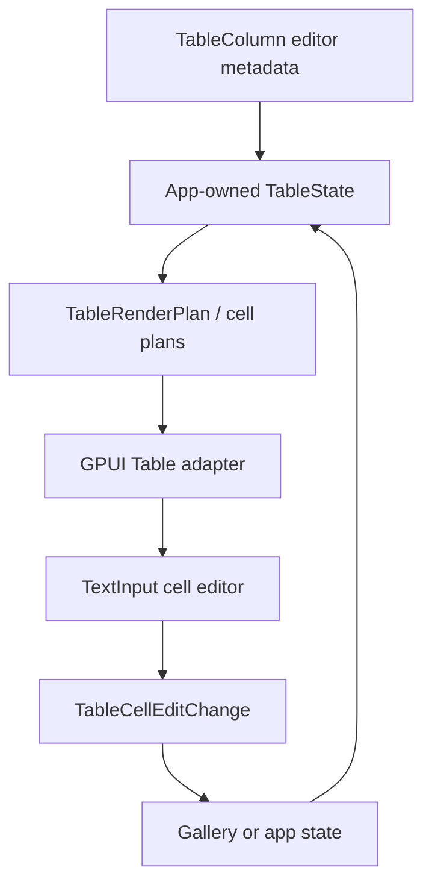

# Table cell editing

## Summary

This plan adds the first official Table editing surface: explicit single-line text editors for editable leaf cells. It keeps row data app-owned, lets the GPUI adapter compose `TextInput` inside visible table cells, and emits controlled cell-change payloads that applications can apply to their own `TableState`.

The slice is intentionally narrower than spreadsheet editing. It does not add validation, dirty tracking, row forms, numeric parsing, select editors, server mutation queues, or rich multi-line editors.

---

## Problem Frame

Table now has row models, selection, pinning, sizing, faceting, and nested scroll proofs, but every body cell is still display-only text. Product UIs need at least inline edits for names, labels, notes, and status-like text fields, while preserving the current Table contract: stable row ids, app-owned data, row activation separation, and virtualized rendering.

TanStack Table's current form examples treat the table as a layout and row-model primitive while a form or app state owns values. Open GPUI should follow that boundary. The Table component should decide where editable controls render and what row/column payload is emitted; it should not become a form engine.

---

## Requirements

### Editing Contract

- R1. Columns can opt into a renderer-neutral text-cell editor without making every table cell editable.
- R2. Editable cells resolve through stable row id and column id, not through transient visible row index.
- R3. Synthetic group rows and missing source cells remain read-only even when the column is editable.
- R4. Editing a cell emits a controlled payload with row id, column id, previous value, next text value, source index when available, and enough row metadata for the application to update its own state.
- R5. The Table contract must not own validation, dirty tracking, submit queues, or persistence state.

### GPUI Adapter

- R6. The GPUI `Table` renders editable text cells with the existing `TextInput` controller path and keeps cell input editing inside the cell's stable debug selector.
- R7. Typing in an editable cell must not trigger row selection, row activation, source-tree expansion, sorting, resizing, or outer page scroll.
- R8. Editable cell rendering must keep row and center-column virtualization intact: only rendered rows / rendered center columns mount inputs.
- R9. Read-only cells keep the existing display-only rendering and accessibility role.

### Gallery and Docs

- R10. The Components gallery includes a focused editable Table sample that proves a cell edit changes app-owned row data and updates rendered text.
- R11. Contract docs, verification docs, and engineering memory record text cell editing as shipped while keeping richer editor families explicit follow-ups.

---

## Key Technical Decisions

- **Keep row values app-owned.** Following TanStack Form composition, Table lays out editable cells and emits payloads; the gallery or application owns the row collection and feeds a new `TableState` back.
- **Start with always-editable text cells for opt-in columns.** The first slice avoids per-cell edit-mode state and commit/cancel workflows. Visible editable cells render `TextInput` directly, and value changes flow through a controlled callback.
- **Use stable row identity instead of visible indexes.** The payload may include `source_index` for convenience, but the authoritative edit target is `(row_id, column_id)` so sorting, filtering, pagination, pinning, and virtualization do not change edit identity.
- **Do not expand `TextInput` for table-specific semantics.** The Table adapter should compose the existing controlled `TextInput::value(...).on_change(...)` path. If execution shows a missing primitive, keep any `TextInput` API addition minimal and independently tested.
- **Preserve row-model state on edit.** A helper may apply a change to source rows, but it should preserve filters, sorting, pagination, selection, pinning, expansion, and faceting inputs. Applications can choose whether a changed value should reset pagination.

---

## High-Level Technical Design

The core table contract exposes which cells may be edited. The component adapter renders `TextInput` for editable leaf cells and emits a controlled payload when the text value changes. The application applies the change to its row data and re-renders the table.

---

## Implementation Units

### U1. Add renderer-neutral editable column metadata

**Goal:** Let table columns declare text-cell editability and expose that metadata through resolved column and cell plans without changing row data ownership.

**Files:**

- Modify `crates/ui_core/src/table.rs`
- Modify `crates/ui_core/src/prelude.rs`
- Modify `crates/ui_components/src/table.rs`
- Modify `crates/ui_components/tests/components.rs`

**Patterns to follow:**

- `TableColumn` builder fields such as `sortable`, `filterable`, `resizable`, and width metadata in `crates/ui_core/src/table.rs`
- `TableColumnRenderPlan` and `TableCellRenderPlan` metadata forwarding in `crates/ui_components/src/table.rs`
- API inventory and public export assertions in `crates/ui_components/tests/components.rs`

**Test scenarios:**

- Read-only columns remain the default.
- A text-editable column exposes editor metadata through the resolved table plan and cell plan.
- Group rows and cells with no source value resolve as read-only even when the column is editable.
- Column editability participates in column descriptor equality / cache signatures so render plans refresh when a column changes from read-only to editable.

### U2. Add controlled cell edit payloads and apply helpers

**Goal:** Provide a stable payload for editable cell value changes and a helper that applications can use to update source rows by stable row id.

**Files:**

- Modify `crates/ui_components/src/table.rs`
- Modify `crates/ui_components/src/lib.rs`
- Modify `crates/ui_components/src/prelude.rs`
- Modify `crates/ui_components/tests/components.rs`

**Patterns to follow:**

- `TableHeaderAction::apply_to`, `TableFacetedFilterChange::apply_to`, and `TableRowAction` metadata in `crates/ui_components/src/table.rs`
- `TableRow::with_cell` and nested source-row traversal in `crates/ui_core/src/table.rs`

**Test scenarios:**

- A change payload includes row id, render key, model index, source index, column id, previous value, and next text.
- Applying a change updates the matching source row by stable id and preserves unrelated rows, children, filters, sorting, pagination, selection, expansion, pinning, and faceting inputs.
- Applying a change to a missing row or synthetic group row is a no-op with an inspectable outcome.
- Public exports include the new payload and editor metadata types.

### U3. Render editable text cells in the GPUI Table adapter

**Goal:** Compose `TextInput` inside editable body cells, stop cell editing events from leaking into row activation/selection, and keep virtualization behavior unchanged.

**Files:**

- Modify `crates/ui_components/src/table.rs`
- Modify `crates/ui_components/tests/components.rs`

**Patterns to follow:**

- Existing `render_table_body_cell` and row click/keyboard handling in `crates/ui_components/src/table.rs`
- Controlled `TextInput::value(...).on_change(...)` tests in `crates/ui_components/tests/components.rs`
- Nested scroll and row-selection runtime tests in `crates/ui_components/tests/components.rs`

**Test scenarios:**

- Editable text cells render a stable `text-input:table:{id}:cell:{row}:{column}:root` selector inside the existing `table:{id}:cell:{row}:{column}` selector.
- Simulated input in an editable cell emits exactly one controlled cell-change payload per sanitized value update.
- Clicking or typing inside the editable cell does not emit row activation or row selection payloads.
- Disabled/read-only outcomes are preserved for non-editable columns, group rows, and missing cells.
- Row virtualization and center-column virtualization still mount inputs only for visible rendered cells.

### U4. Add a focused gallery proof for editable cells

**Goal:** Add a Components gallery sample that demonstrates app-owned row updates through editable Table cells.

**Files:**

- Modify `examples/ui-foundation-gallery/src/pages/components.rs`
- Modify `examples/ui-foundation-gallery/src/pages/components/render.rs`
- Modify `examples/ui-foundation-gallery/tests/foundation_gallery.rs`

**Patterns to follow:**

- `TableSampleRuntimeLog` controlled sizing / expansion / faceted-filter override patterns in `examples/ui-foundation-gallery/src/pages/components.rs`
- The `release-resize` and `filter-board` focused Table smoke tests in `examples/ui-foundation-gallery/tests/foundation_gallery.rs`
- TanStack's app/form-owned data examples in `repo-ref/tanstack-table/examples/react/with-tanstack-form/src/main.tsx` and `repo-ref/tanstack-table/examples/angular/editable/src/app/app.ts`

**Test scenarios:**

- The new sample renders one or two explicitly editable text columns and at least one read-only column.
- Typing into an editable cell records a `TableCellEditChange`, updates the sample's app-owned row snapshot, and re-renders the changed cell text.
- Editing a cell does not move the sample card or page scroll.
- Read-only cell clicks still follow the existing row interaction contract.
- Stable selectors remain available in focused Table mode and full Components mode.

### U5. Update contract, verification, and engineering memory

**Goal:** Record text cell editing as shipped Table behavior and leave richer editing workflows out of scope.

**Files:**

- Modify `docs/ui/component-contract.md`
- Modify `docs/verification.md`
- Modify `docs/knowledge/engineering/current-state.md`
- Modify `docs/knowledge/engineering/log.md`
- Add or update `docs/knowledge/engineering/progress/2026-06-24-table-cell-editing-plan.md`

**Patterns to follow:**

- Current Table contract wording in `docs/ui/component-contract.md`
- Current focused Table verification entries in `docs/verification.md`
- Existing Table progress notes under `docs/knowledge/engineering/progress/`

**Test scenarios:**

- Docs describe text cell editing without implying form validation, row-level submit, numeric parsing, select editors, or server mutation orchestration.
- Verification docs name the focused components and gallery gates used for the slice.
- Engineering memory records the implementation, verification, and remaining Table follow-ups.

---

## Acceptance Examples

- AE1. Given a table with an editable `name` column and a read-only `status` column, when the user types `Payments API` in the `name` cell for row `pkg-core`, then the app receives a payload for `(pkg-core, name)` and the rendered row updates after the app feeds back the changed `TableState`.
- AE2. Given a sorted or filtered table, when the user edits a visible leaf cell, then the payload still targets the stable source row id and does not depend on the current visible index.
- AE3. Given a grouped row or aggregate cell, when the column is otherwise editable, then the rendered cell remains display-only and no edit payload is emitted.
- AE4. Given an editable cell inside a virtualized table body, when the user clicks and types in the input, then row activation / selection callbacks are not emitted and the outer Components page does not scroll.

---

## Scope Boundaries

### Deferred for later

- Per-cell edit mode, commit/cancel workflows, blur-save, and edit focus grids.
- Numeric, boolean, date, combobox/select, and custom editor variants.
- Validation, dirty-state summaries, row forms, save buttons, optimistic mutation queues, and server persistence.
- Clipboard range paste, spreadsheet fill handles, undo/redo, and multi-cell selection.
- Cell-level authorization or async editable-state loading.

### Outside this plan

- Replacing `TextInput` with a new editor engine.
- Changing existing row sorting, filtering, faceting, grouping, pagination, selection, pinning, or expansion semantics.
- Making grouped synthetic rows editable.
- Extracting a standalone headless table-editing crate.

---

## Risks & Dependencies

- Mounting `TextInput` in many visible cells can increase runtime churn, so the first proof should keep editable columns narrow and verify virtualization still constrains mounted inputs.
- Event propagation from nested inputs can accidentally trigger row click or selection behavior; runtime tests must prove editing input events stay inside the cell.
- Applying edits by visible row index would fail under sorting, filtering, pagination, grouping, and virtualization; payloads must center stable row ids.
- Live value-change editing can reorder or filter rows as the application feeds back state. The first gallery proof should use a column that does not drive the current sort/filter.

---

## Sources / Research

- `crates/ui_core/src/table.rs`
- `crates/ui_components/src/table.rs`
- `crates/ui_components/src/text_input.rs`
- `crates/ui_components/tests/components.rs`
- `examples/ui-foundation-gallery/src/pages/components.rs`
- `examples/ui-foundation-gallery/src/pages/components/render.rs`
- `examples/ui-foundation-gallery/tests/foundation_gallery.rs`
- `repo-ref/tanstack-table/examples/react/with-tanstack-form/src/main.tsx`
- `repo-ref/tanstack-table/examples/react/with-tanstack-form/src/form.tsx`
- `repo-ref/tanstack-table/examples/angular/editable/src/app/app.ts`
- `repo-ref/tanstack-table/examples/react/material-react-table/src/material-react-table/components/inputs/MRT_EditCellTextField.tsx`
- `repo-ref/fret/crates/fret-ui/src/widget.rs`
