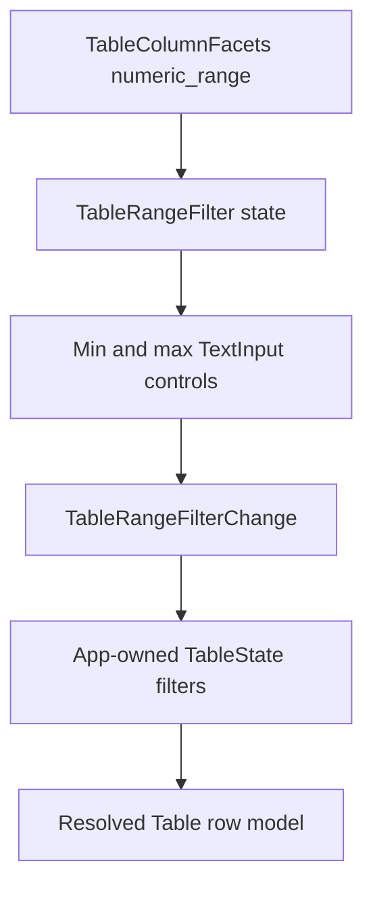

# Table numeric range filter controls

## Summary

This plan productizes numeric range filtering for Table. It adds renderer-neutral inclusive range
filter semantics, a GPUI `TableRangeFilter` recipe over existing numeric facet metadata, and a
Components gallery proof that score filtering remains app-owned and stable under the current table
pipeline.

---

## Problem Frame

Table already exposes `TableColumnFacets::numeric_range()` and categorical `TableFacetedFilter`,
but numeric facets cannot yet drive a user-facing control. Product tables need score, duration,
count, and cost filters that narrow rows by numeric bounds without turning Table into a global query
builder.

TanStack Table's faceted filter example uses column-owned min/max metadata to seed two number
inputs, while column filter state remains controlled by the application. Open GPUI should follow
that boundary: Table owns range semantics and payload shape; applications own filter state and
server/manual behavior.

---

## Requirements

**Core semantics**

- R1. `TableFilter` can express an inclusive numeric range over one column with optional lower and
  upper endpoints.
- R2. Blank or invalid endpoints are treated as absent, reversed finite endpoints are normalized,
  and filters with no endpoints are removable no-ops.
- R3. Client filtering only matches finite numeric `TableCellValue::Number` cells; missing,
  textual, boolean, and non-finite values do not match an active numeric range.
- R4. Numeric range filters preserve the existing row-model pipeline and work alongside contains,
  exact categorical, sorting, pagination, grouping, row pinning, and manual row-model modes.

**Component recipe**

- R5. `TableRangeFilter` composes existing Button, Popover, TextInput, and theme primitives into a
  reusable single-column numeric range control.
- R6. `TableRangeFilterChange` emits controlled payloads with stable column id, lower/upper bound
  text, parsed bounds, clear state, and an `apply_to` helper that preserves unrelated filters while
  resetting pagination to page 0.
- R7. The recipe reads `TableColumnFacets::numeric_range()` for visible min/max metadata, but it
  must still render safely when metadata is absent or manually supplied by an application.

**Gallery and docs**

- R8. The Components gallery proves range filtering with a focused Table sample, visible score
  bounds, app-owned filter overrides, and stable runtime logs.
- R9. Contract docs, verification docs, and engineering memory record numeric range controls as a
  shipped Table recipe while leaving global faceting and richer predicate builders out of scope.

---

## Key Technical Decisions

- **Use inclusive open-ended range semantics.** This matches TanStack's `inNumberRange` behavior
  and keeps common threshold filters cheap: minimum-only, maximum-only, and bounded ranges use one
  filter kind.
- **Keep endpoint parsing in the component payload, not in table rows.** Core range filters should
  store normalized numeric endpoints; the UI recipe can keep user-entered text so applications can
  show partial input without making the resolver parse strings repeatedly.
- **Keep manual/server ownership intact.** Manual filtering still preserves the caller-supplied row
  snapshot; range filter payloads update `TableState::filters()` like categorical filters, but they
  do not fetch data, debounce network calls, or own cache invalidation.
- **Do not merge categorical and numeric recipes.** `TableFacetedFilter` remains exact-token
  categorical selection. `TableRangeFilter` is a sibling recipe so each control has a narrow state
  contract and inspectable payload.

---

## High-Level Technical Design

The core table resolver applies normalized numeric range filters to client-owned rows. The GPUI
recipe renders two number-like text inputs from facet metadata and emits a controlled change. The
gallery applies the change to a sample-owned `TableState` override and re-renders through the
normal Table pipeline.

---

## Implementation Units

### U1. Add core numeric range filter semantics

- **Goal:** Extend `TableFilterKind` with normalized inclusive numeric range filters.
- **Files:** `crates/ui_core/src/table.rs`, `crates/ui_core/src/prelude.rs`,
  `crates/ui_components/tests/components.rs`
- **Patterns:** Follow `TableFilter::one_of`, `TableFacetRange::new`, and TanStack
  `filterFn_inNumberRange`.
- **Test scenarios:**
  - Minimum-only, maximum-only, and bounded filters match finite numeric cells inclusively.
  - Reversed finite endpoints normalize to ascending bounds.
  - Empty endpoints create an inspectable no-op or are omitted by helper APIs.
  - Non-numeric and missing cells do not match an active range.
  - Range filters compose with categorical and contains filters while preserving existing
    pagination and manual filtering behavior.

### U2. Add `TableRangeFilter` state, payload, and GPUI recipe

- **Goal:** Productize a numeric range filter control that emits controlled payloads over stable
  column ids.
- **Files:** `crates/ui_components/src/table.rs`, `crates/ui_components/src/lib.rs`,
  `crates/ui_components/src/prelude.rs`, `crates/ui_components/tests/components.rs`
- **Patterns:** Follow `TableFacetedFilterState`, `TableFacetedFilterChange`,
  controlled `TextInput::value(...).on_change(...)`, and API inventory tests.
- **Test scenarios:**
  - State exposes column id, visible facet range, input text, parsed normalized bounds, trigger
    label, clear-enabled state, and resolved popover/text-input states.
  - `TableRangeFilterChange::apply_to` replaces only the target column's range filter, preserves
    unrelated filters, and resets pagination to page 0.
  - Clearing removes only the target column's range filter.
  - Runtime input in min/max fields emits controlled changes without leaking clicks to surrounding
    row/table interactions.
  - Crate-root, prelude, and API inventory exports include the new recipe and payload types.

### U3. Add a focused Components gallery proof

- **Goal:** Demonstrate app-owned numeric range filtering on a real Table sample.
- **Files:** `examples/ui-foundation-gallery/src/pages/components.rs`,
  `examples/ui-foundation-gallery/src/pages/components/render.rs`,
  `examples/ui-foundation-gallery/tests/foundation_gallery.rs`
- **Patterns:** Reuse `TableSampleRuntimeLog`, `record_table_faceted_filter_change`, and the
  `filter-board` status filter placement.
- **Test scenarios:**
  - The sample renders a score `TableRangeFilter` from `TableColumnFacets::numeric_range()`.
  - Entering a minimum score records `TableRangeFilterChange`, updates a sample-owned table-state
    override, and reduces the rendered row window.
  - Clearing the range restores the original row window and keeps unrelated status/category filters
    intact.
  - Popup wheel and input events remain local to the sample.

### U4. Update contract, verification, and engineering memory

- **Goal:** Record numeric range filtering as a shipped Table recipe.
- **Files:** `docs/ui/component-contract.md`, `docs/verification.md`,
  `docs/knowledge/engineering/current-state.md`, `docs/knowledge/engineering/log.md`,
  `docs/knowledge/engineering/progress/2026-06-24-table-numeric-range-filter-controls-plan.md`
- **Patterns:** Follow the categorical faceted filter and text-cell editing memory entries.
- **Test scenarios:**
  - Docs distinguish numeric range controls from global faceting and a general predicate builder.
  - Verification docs name the focused component and gallery gates for the slice.
  - Engineering memory records implementation, verification, commit, and remaining Table follow-ups.

---

## Scope Boundaries

### Deferred for later

- Global faceting and cross-column search.
- Date/time, currency-specific, histogram, and discrete slider controls.
- Async option loading, remote count refresh, fetch/cache orchestration, and optimistic server
  filtering.
- A general predicate builder with arbitrary comparison operators.

### Outside this plan

- Replacing `TableFacetedFilter`.
- Changing the table row-model stage order.
- Making range filtering own application data fetching or persistence.
- Extracting a standalone headless table-filter crate.

---

## Risks & Dependencies

- `f64` does not implement `Eq`, so the core filter type must either drop `Eq` where appropriate
  or store bounds in a normalized finite-only wrapper.
- Partial input is common in numeric fields. The recipe should keep input text visible while only
  applying parsed finite endpoints.
- Filtering by score can reorder or shrink the visible table quickly. Gallery tests should assert
  stable row ids and row counts instead of brittle visual positions.
- Manual filtering mode must keep its existing semantics: payload helpers may update filters, but
  the resolver must not prune caller-supplied manual rows.

---

## Sources / Research

- `crates/ui_core/src/table.rs`
- `crates/ui_components/src/table.rs`
- `examples/ui-foundation-gallery/src/pages/components.rs`
- `examples/ui-foundation-gallery/src/pages/components/render.rs`
- `examples/ui-foundation-gallery/tests/foundation_gallery.rs`
- `docs/plans/2026-06-24-004-feat-ui-table-faceted-filter-controls-plan.md`
- `docs/plans/2026-06-24-005-feat-ui-table-cell-editing-plan.md`
- `repo-ref/tanstack-table/examples/preact/filters-faceted/src/main.tsx`
- `repo-ref/tanstack-table/packages/table-core/src/fns/filterFns.ts`
