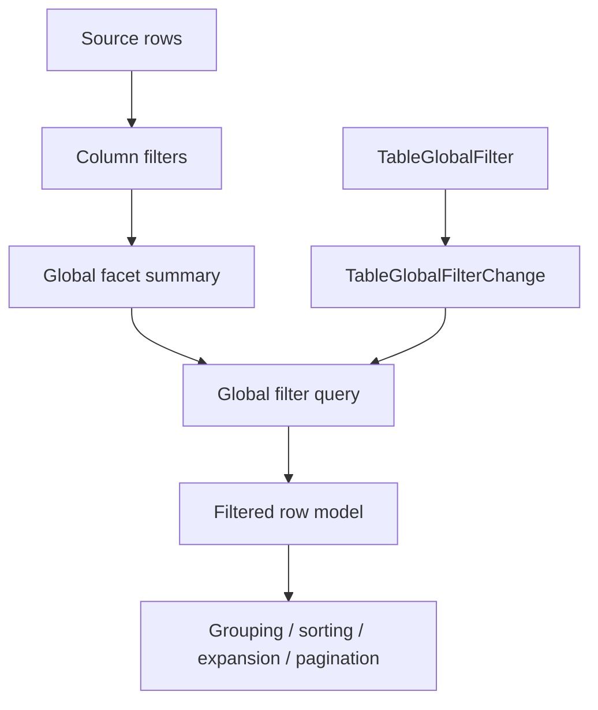

# Table global filtering and faceting

## Summary

This plan adds a first-class global Table filter without turning the component into a general query
builder. `TableState` gains renderer-neutral global query state, the resolver derives global
faceting metadata that excludes the global query itself, and `ui_components` ships a
`TableGlobalFilter` text-input recipe that applications can keep controlled.

---

## Problem Frame

The Table now has column filters, categorical facets, numeric range filters, manual row-model modes,
and app-owned gallery proofs. Product tables still need a common search box that scans several
columns at once while preserving the existing column filter and faceting contracts.

TanStack models global filtering as a separate table-state slice with its own filter function and
global faceted row model. Fret mirrors that split with `global_filter` state and global faceting
parity tests. Open GPUI should follow the same boundary: the core owns deterministic row-model
semantics and metadata, the GPUI adapter owns text input runtime, and applications still own
server fetching, debounce, and persistence.

---

## Requirements

**Core global filtering**

- R1. `TableState` can carry an optional global filter query separate from column filters.
- R2. Client filtering applies the global query in the existing filtered stage before grouping,
  sorting, expansion, pagination, row pinning, and virtualization.
- R3. Empty or whitespace-only global queries behave like no global filter and do not change cache
  keys beyond normalized absence.
- R4. The default global matcher is case-insensitive `contains` over configured globally
  filterable columns using the existing `TableCellValue::filter_text()` vocabulary.
- R5. Manual filtering mode preserves the caller-supplied row snapshot while still exposing the
  global filter state for app-owned fetch/cache keys.

**Global faceting metadata**

- R6. The resolver exposes a global facet summary derived from the row set after column filters but
  before the global query is applied.
- R7. Global facet metadata reports row count, deterministic unique value counts, and numeric
  min/max across globally filterable columns.
- R8. Global facet metadata is available through `TableResolvedState` and
  `ui_components::TableRenderPlan` without adding fetch/cache ownership.

**Component recipe and gallery**

- R9. `TableGlobalFilter` composes the existing `TextInput` contract into a reusable search recipe
  with controlled/default query ownership.
- R10. `TableGlobalFilterChange` emits stable query text, clear state, and an `apply_to` helper that
  preserves column filters while resetting pagination to page 0.
- R11. The Components gallery proves global search on a real Table sample with app-owned state
  overrides, runtime logs, row-count changes, and stable scroll containment.
- R12. Contract docs, verification docs, and engineering memory record global filtering as shipped
  while leaving richer predicate builders out of scope.

---

## Key Technical Decisions

- **Keep global filter state separate from column filters.** This follows TanStack and Fret and
  avoids inventing synthetic pseudo-column ids that would complicate per-column facet exclusion.
- **Default to text contains, not fuzzy ranking.** Fuzzy matching changes ordering and score
  metadata. The first slice should only decide inclusion; sorting remains the existing table stage.
- **Use a distinct global-filterable column capability.** Some columns are useful for exact column
  filters but noisy for global search. A column-level global-search flag keeps this policy
  inspectable without adding a custom predicate registry.
- **Derive global facets before applying the global query.** This mirrors the existing per-column
  "exclude own filter" rule and lets a search input show available values without self-filtering
  its own suggestions.
- **Keep the component recipe narrow.** `TableGlobalFilter` should be a controlled search input,
  not an operator builder, saved-view system, or remote-search coordinator.

---

## High-Level Technical Design

The resolver keeps the global filter inside the existing row-model pipeline. Global facet metadata
uses the same pre-grouped source-row basis as column facets, but it excludes the global query
itself and honors column filters. The GPUI recipe feeds app-owned `TableState` by emitting a
controlled change payload.

---

## Implementation Units

### U1. Add core global filter state

- **Goal:** Add renderer-neutral global query state and default matching semantics.
- **Files:** `crates/ui_core/src/table.rs`, `crates/ui_core/src/prelude.rs`,
  `crates/ui_components/tests/components.rs`
- **Patterns:** Follow `TableFilter`, `TableStageMode`, `filter_source_row_nodes`, and TanStack's
  `globalFilteringFeature`.
- **Test Scenarios:**
  - A query matches rows when any globally filterable column contains the query case-insensitively.
  - Whitespace-only queries normalize to no global filter.
  - Global filtering composes with column filters and runs before sorting/pagination.
  - Columns opted out of global filtering do not match even when their cell text contains the query.
  - Manual filtering mode preserves the source snapshot while retaining global query state.

### U2. Add global facet metadata

- **Goal:** Expose a global facet summary that honors column filters but excludes the global query.
- **Files:** `crates/ui_core/src/table.rs`, `crates/ui_components/src/table.rs`,
  `crates/ui_components/tests/components.rs`
- **Patterns:** Follow `TableColumnFacets`, `resolve_client_column_facets`, and Fret's
  `global_faceted_unique_values` / `global_faceted_min_max_u64` parity tests.
- **Test Scenarios:**
  - With `team=UI` and global query `done`, global facets count values available inside `team=UI`
    before the global query narrows rows.
  - Unique values are deterministic across text, number, boolean, and empty cells.
  - Numeric min/max uses only numeric cells from globally filterable columns.
  - Manual filtering still exposes only caller-supplied rows unless manual global facets are added
    in a later server-facet slice.

### U3. Add `TableGlobalFilter` recipe and payload

- **Goal:** Productize a standard controlled global search input for Table consumers.
- **Files:** `crates/ui_components/src/table.rs`, `crates/ui_components/src/lib.rs`,
  `crates/ui_components/src/prelude.rs`, `crates/ui_components/tests/components.rs`
- **Patterns:** Follow `TextInput::value(...).on_change(...)`, `TableRangeFilterChange::apply_to`,
  and API inventory tests.
- **Test Scenarios:**
  - State exposes id, label, query, placeholder, clear label, active state, and resolved
    `TextInputState`.
  - `TableGlobalFilterChange::apply_to` updates only the global query and resets pagination.
  - Clearing removes the global query while preserving column filters, sorting, selection, row
    pinning, faceting, sizing, and editing state.
  - Crate-root, prelude, and API inventory exports include the recipe, state, and payload types.

### U4. Add focused Components gallery proof

- **Goal:** Demonstrate global filtering in a real Table sample without changing app ownership.
- **Files:** `examples/ui-foundation-gallery/src/pages/components.rs`,
  `examples/ui-foundation-gallery/src/pages/components/render.rs`,
  `examples/ui-foundation-gallery/tests/foundation_gallery.rs`
- **Patterns:** Reuse `TableSampleRuntimeLog`, `filter-board` runtime overrides, and focused Table
  gallery smokes.
- **Test Scenarios:**
  - The sample renders a `TableGlobalFilter` beside the existing status and score controls.
  - Typing a query records `TableGlobalFilterChange`, updates an app-owned `TableState` override,
    and changes filtered/final row counts.
  - The query composes with the existing `team=UI` base filter and does not clear status/range
    filters.
  - Text input focus and wheel interactions stay inside the sample and do not move the outer page.

### U5. Update contract, verification, and engineering memory

- **Goal:** Record global filtering as a shipped Table behavior and keep richer filtering deferred.
- **Files:** `docs/ui/component-contract.md`, `docs/verification.md`,
  `docs/knowledge/engineering/current-state.md`, `docs/knowledge/engineering/log.md`,
  `docs/knowledge/engineering/progress/2026-06-24-table-global-filtering-faceting-plan.md`
- **Patterns:** Follow the faceted filter and numeric range filter documentation entries.
- **Test Scenarios:**
  - Docs distinguish global filtering from global faceting metadata and richer predicate builders.
  - Verification docs name the focused component and gallery gates.
  - Engineering memory records implementation, verification, and remaining follow-ups.

---

## Acceptance Examples

- AE1. Given a Table with `team=UI` and global query `done`, when it resolves, then only source rows
  inside `team=UI` whose globally filterable cells contain `done` remain in the filtered row model.
- AE2. Given a `notes` column with `global_filterable=false`, when the global query appears only in
  `notes`, then the row does not match the global filter.
- AE3. Given `team=UI` plus global query `done`, when global facets are inspected, then their
  row-count basis is `team=UI` before applying `done`.
- AE4. Given a rendered `filter-board` sample, when the user types in the global search input, then
  the gallery records a controlled payload and re-renders rows from the sample-owned `TableState`.

---

## Scope Boundaries

### Deferred for later

- Fuzzy ranking, match highlighting, and score metadata.
- Operator menus such as starts-with, not-contains, equals, date range, and relative time.
- A general predicate builder with nested AND/OR groups.
- Server-wide global facet payloads beyond the current source snapshot.
- Async search, debounce policy, data fetching, cache invalidation, and optimistic remote updates.
- Saved views, query persistence, and URL synchronization.

### Outside this plan

- Replacing `TableFacetedFilter` or `TableRangeFilter`.
- Changing the row-model stage order outside the existing filtered stage.
- Adding a standalone headless table crate.
- Making the gallery own production data-source behavior.

---

## Risks & Dependencies

- Global filtering can become expensive on large local row sets. The resolver should stay
  deterministic and allocation-conscious, while server-scale behavior remains app-owned through
  manual filtering.
- Scanning hidden or operational columns can surprise users. The plan depends on a clear
  `global_filterable` policy rather than assuming every cell is searchable.
- Global facet metadata can be confused with per-column facets. The public names should make the
  basis clear: column facets exclude their own column filter, while global facets exclude the
  global query.
- Future predicate-builder work should not require rewriting this slice. Keep global query state
  narrow and additive so richer filters can land as a separate state family later.

---

## Sources / Research

- `docs/plans/2026-06-23-008-feat-ui-table-faceting-filter-metadata-plan.md`
- `docs/plans/2026-06-24-004-feat-ui-table-faceted-filter-controls-plan.md`
- `docs/plans/2026-06-24-006-feat-ui-table-numeric-range-filter-controls-plan.md`
- `repo-ref/tanstack-table/packages/table-core/src/features/global-filtering/globalFilteringFeature.ts`
- `repo-ref/tanstack-table/packages/table-core/src/features/global-filtering/globalFilteringFeature.types.ts`
- `repo-ref/fret/ecosystem/fret-ui-headless/tests/tanstack_v8_faceting_parity.rs`
- `repo-ref/fret/ecosystem/fret-ui-headless/tests/tanstack_v8_capability_smoke.rs`
