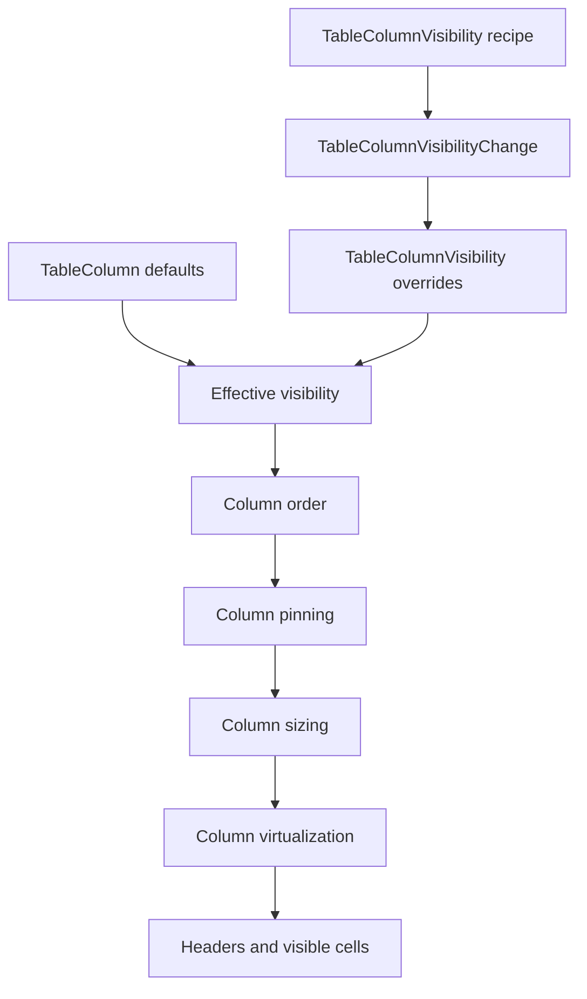

# Table column visibility controls

## Summary

This plan turns column visibility from a static column default into a controlled Table view state.
`TableColumn::visible` remains the default seed, `TableState` gains sparse runtime visibility
overrides, and `ui_components` ships a compact column-visibility recipe that can live in
`TableToolbar`.

---

## Problem Frame

The current Table can hide columns only by constructing `TableColumn` descriptors with
`with_visible(false)`. That is enough for static examples, but mature data grids need users to
trim wide tables, restore defaults, and keep identity columns locked without mutating row data or
rebuilding unrelated table state.

TanStack treats column visibility as a table-state slice and resolves visible columns before cell
rendering. Fret uses a caller-owned visibility override model plus view-options menus. Open GPUI
should follow that boundary: core owns deterministic visibility resolution, the GPUI adapter owns
menu runtime, and applications own persistence, saved views, and remote preferences.

---

## Requirements

**Core visibility state**

- R1. `TableState` carries renderer-neutral column visibility overrides separate from column
  descriptors, column order, and column pinning.
- R2. `TableColumn::visible` remains the default visibility seed when no override exists.
- R3. `TableColumn` exposes a hideability policy so identity columns can remain visible and disabled
  in user-facing view-option menus.
- R4. Effective visibility resolves before ordering, pinning, sizing, column virtualization, row
  cells, and header metadata.
- R5. Visibility changes affect only the visible column set and cache key; filtering, sorting,
  grouping, expansion, selection, row pinning, column sizing, and pagination are preserved.

**Component recipe**

- R6. `TableColumnVisibilityChange` emits stable column ids, next visibility, action kind, and an
  `apply_to` helper for app-owned `TableState` updates.
- R7. `TableColumnVisibilityState` exposes item labels, checked state, hideability, visible counts,
  hidden counts, all-visible state, and some-visible state without exposing GPUI runtime types.
- R8. `TableColumnVisibility` renders a reusable menu recipe using existing Menu/Popover behavior
  and composes inside `TableToolbar`.
- R9. The recipe supports single-column toggles plus reset/show-all actions without owning saved
  views, persistence, or server fetches.

**Gallery and docs**

- R10. The Components gallery proves column visibility on a wide Table sample with app-owned
  visibility overrides and stable runtime logs.
- R11. Smoke coverage proves hidden columns leave headers and cells, restoring visibility brings
  them back, and nested table scrolling remains local.
- R12. Contract docs, verification docs, and engineering memory record column visibility as a
  shipped Table behavior and keep saved views out of scope.

---

## Key Technical Decisions

- **Use sparse overrides, not mutated column definitions.** Runtime visibility state should store
  only explicit column id overrides. This matches TanStack's `columnVisibility` object and Fret's
  override snapshot while keeping column descriptors as schema defaults.
- **Keep static defaults meaningful.** `TableColumn::with_visible(false)` still creates a default
  hidden column. A visibility override can show it when the column is hideable.
- **Make hideability a column policy.** User-facing controls need to disable permanent identity
  columns without special-casing labels or pinned regions.
- **Resolve before existing layout stages.** Ordering, pinning, sizing, and virtualization already
  operate on visible columns. The new state should feed the same visible-column pipeline rather
  than adding a parallel render path.
- **Allow zero visible hideable columns.** Core should not invent a minimum-visible rule. The
  recipe offers reset/show-all actions so applications can recover without hidden state magic.
- **Reuse Menu and TableToolbar.** Column visibility is a table shell control, not a new overlay
  primitive. The recipe should sit beside global/faceted/range controls in `TableToolbar`.

---

## High-Level Technical Design

Visibility is resolved once in the existing column pipeline. Hidden columns disappear from render
plans, sizing totals, row-cell lists, and virtualized center-column source lists. The recipe emits
controlled payloads; the gallery applies them to a sample-owned `TableState`.

---

## Implementation Units

### U1. Add core runtime column visibility state

- **Goal:** Add renderer-neutral visibility overrides and hideability policy to the core table
  contract.
- **Files:** `crates/ui_core/src/table.rs`, `crates/ui_core/src/prelude.rs`,
  `crates/ui_components/tests/components.rs`
- **Patterns:** Follow `TableColumnPinning`, `TableColumnSizing`, and TanStack's
  `columnVisibilityFeature` tests.
- **Test Scenarios:**
  - A visibility override hides a visible column without changing source rows or row models.
  - A visibility override can show a column whose descriptor default is hidden.
  - Unknown column ids are ignored and retained or normalized predictably in state.
  - Non-hideable columns stay visible even when an override attempts to hide them.
  - Effective visible columns still respect explicit order, pinning, sizing, and center-column
    virtualization.
  - The cache key changes when visibility overrides change.

### U2. Add `TableColumnVisibility` recipe and payload

- **Goal:** Productize a standard column-visibility control for table toolbars.
- **Files:** `crates/ui_components/src/table.rs`, `crates/ui_components/src/lib.rs`,
  `crates/ui_components/src/prelude.rs`, `crates/ui_components/tests/components.rs`
- **Patterns:** Follow `TableFacetedFilter`, `TableRangeFilter`, `TableToolbar`, and Menu
  checkbox-item behavior.
- **Test Scenarios:**
  - State exposes item count, visible count, hidden count, all-visible, some-visible, reset-enabled,
    and per-column item metadata.
  - The change payload can toggle one column, show all hideable columns, and reset to descriptor
    defaults.
  - `apply_to` updates only column visibility while preserving filtering, sorting, pagination,
    selection, row pinning, column sizing, and cell edits.
  - Non-hideable items render disabled and do not emit a hiding payload.
  - Crate-root, prelude, public resolved-state, and API inventory tests include all new types.

### U3. Prove the recipe in the Components gallery

- **Goal:** Demonstrate app-owned column visibility on a wide table sample.
- **Files:** `examples/ui-foundation-gallery/src/pages/components.rs`,
  `examples/ui-foundation-gallery/src/pages/components/render.rs`,
  `examples/ui-foundation-gallery/tests/foundation_gallery.rs`
- **Patterns:** Reuse `TableToolbar`, `TableSampleRuntimeLog`, `release-matrix`, and existing table
  scroll-containment smokes.
- **Test Scenarios:**
  - `release-matrix` renders a column-visibility trigger in a `TableToolbar`.
  - Toggling a metric column records `TableColumnVisibilityChange`, updates a sample-owned
    `TableState` override, and removes that header/cell from the rendered table.
  - Reset/show-all restores hidden columns and keeps the sample's row/filter/sort state intact.
  - Horizontal and vertical wheel input still stays inside the table sample after visibility changes.
  - Conformance gates and page signals list `TableColumnVisibility` and its state/payload types.

### U4. Update docs, verification, and engineering memory

- **Goal:** Record column visibility as a shipped Table capability and preserve follow-up
  boundaries.
- **Files:** `docs/ui/component-contract.md`, `docs/verification.md`,
  `docs/knowledge/engineering/current-state.md`, `docs/knowledge/engineering/log.md`
- **Patterns:** Follow the table global filter and numeric range filter documentation entries.
- **Test Scenarios:**
  - Contract docs distinguish descriptor default visibility from runtime visibility overrides.
  - Verification docs name the focused component and gallery gates.
  - Engineering memory records the implementation commit, verification commands, and remaining
    Table maturity follow-ups.

---

## Acceptance Examples

- AE1. Given columns `name`, `status`, and `score`, when visibility hides `score`, then
  `visible_columns()` and the rendered header/cells omit `score` while row data remains unchanged.
- AE2. Given a default-hidden `notes` column, when visibility explicitly shows `notes`, then it
  appears in visible columns using its configured order, pinning, and sizing behavior.
- AE3. Given a non-hideable identity column, when the visibility recipe renders, then its checkbox
  is disabled and the column remains visible even if a stale override says hidden.
- AE4. Given the `release-matrix` sample, when a metric column is toggled off and then reset, then
  the gallery logs both controlled changes and the column returns without moving the outer page.

---

## System-Wide Impact

Column visibility touches the same resolved-column pipeline used by ordering, pinning, sizing, and
two-axis virtualization. The implementation must keep those stages single-sourced through visible
column regions so future table features do not have to choose between descriptor visibility and
runtime visibility.

---

## Scope Boundaries

### Deferred for later

- Saved views, named presets, URL synchronization, and persistence.
- Drag-and-drop column reordering.
- Column groups and nested header visibility rules.
- Server-driven column capability negotiation.
- Per-role or policy-based visibility defaults.
- Match highlighting or search inside the column-visibility menu.

### Outside this plan

- Replacing column pinning, sizing, or virtualizer contracts.
- Moving fetch/cache ownership into `ui_components`.
- Extracting a standalone headless table crate.
- Making `TableToolbar` own table state.

---

## Risks & Dependencies

- Hidden columns can interact with pinned lanes and exact-size column virtualization. The resolver
  must feed existing region and sizing helpers rather than duplicating layout state.
- Stale visibility overrides can reference deleted columns. Tests should prove unknown ids cannot
  corrupt visible-column resolution.
- Non-hideable columns need a clear precedence rule. Treat hideability as a hard visibility guard so
  identity columns cannot disappear through stale app state.
- Allowing zero visible hideable columns can reveal empty-table layout edge cases. The adapter
  should keep rendering stable and the recipe should make recovery obvious through reset/show-all.

---

## Sources / Research

- `crates/ui_core/src/table.rs`
- `crates/ui_components/src/table.rs`
- `docs/plans/2026-06-23-002-feat-ui-table-column-sizing-plan.md`
- `docs/plans/2026-06-23-004-feat-ui-table-column-virtualization-plan.md`
- `docs/plans/2026-06-24-007-feat-ui-table-global-filtering-faceting-plan.md`
- `repo-ref/tanstack-table/packages/table-core/tests/unit/features/column-visibility/columnVisibilityFeature.utils.test.ts`
- `repo-ref/tanstack-table/examples/lit/column-visibility/src/main.ts`
- `repo-ref/fret/ecosystem/fret-ui-kit/src/imui/table_column_visibility/state/snapshot.rs`
- `repo-ref/fret/ecosystem/fret-ui-kit/src/imui/table_column_visibility/state/mutation.rs`
- `repo-ref/fret/ecosystem/fret-ui-kit/src/imui/table_column_visibility/menu/items.rs`
- `repo-ref/fret/ecosystem/fret-ui-shadcn/src/data_table_controls.rs`
