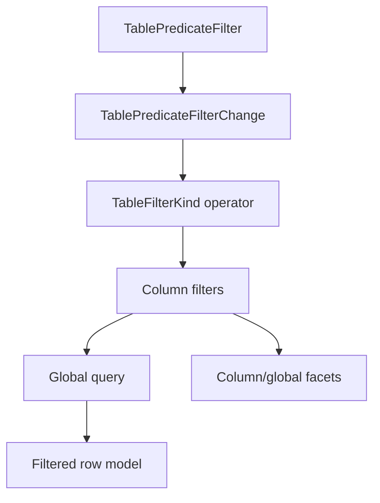

# Table filter operators and predicate controls

## Summary

This plan upgrades Table filtering from three hard-coded filter shapes into an explicit operator
contract. `TableFilterKind` should keep the current categorical and numeric recipes working, while
adding renderer-neutral text, equality, comparison, and collection operators that future table
controls can share without inventing per-widget predicate semantics.

---

## Problem Frame

The current Table has useful first-party controls: categorical facets, numeric ranges, global text
search, and column visibility. Filtering is still shallow at the core boundary: text filters mean
case-insensitive contains, exact filters are modeled as token sets, and numeric comparison only
exists as an inclusive range. Real data grids need equals, starts-with, not-contains, greater-than,
less-than, and collection membership without moving predicate rules into gallery code or product
applications.

TanStack solves this with named filter functions and auto-remove rules. Fret mirrors those built-in
filter functions for TanStack parity. Open GPUI should take the useful part but keep the API simpler:
use a closed, serializable operator enum for built-in behavior, leave arbitrary callback registries
out of the component crate for now, and expose controlled UI recipes only after the core operators
are deterministic.

---

## Requirements

**Core filter operators**

- R1. `TableFilterKind` supports explicit text operators: contains, not-contains, equals,
  not-equals, starts-with, and ends-with, with a case-sensitivity flag.
- R2. `TableFilterKind` supports scalar equality operators over `TableCellValue::filter_text()` and
  existing exact token semantics without breaking `TableFilter::exact` / `TableFilter::one_of`.
- R3. `TableFilterKind` supports numeric comparison operators: greater-than, greater-or-equal,
  less-than, less-or-equal, plus the existing inclusive range.
- R4. Empty text inputs and empty token sets still auto-remove or no-op consistently, matching the
  existing filter-change helper behavior.
- R5. Operators participate in `TableState` equality and cache keys, compose with global filtering,
  manual filtering, faceting, sorting, grouping, pagination, row pinning, and virtualization.

**Component recipes**

- R6. A reusable `TablePredicateFilter` recipe exposes an operator selector plus one text or numeric
  value input for one column and emits a controlled `TablePredicateFilterChange` payload.
- R7. The recipe is controlled/default-owned in the same vocabulary as `TableGlobalFilter`,
  `TableFacetedFilter`, and `TableRangeFilter`.
- R8. Predicate filter payloads update only the target column filter and reset pagination to page 0
  while preserving other table state slices.
- R9. Existing `TableFacetedFilter`, `TableRangeFilter`, and `TableGlobalFilter` remain source
  compatible and continue to emit their current specialized payloads.

**Gallery and docs**

- R10. The Components gallery proves predicate operators on a real Table sample with app-owned
  state, runtime logs, row-count changes, and nested scroll containment.
- R11. Contract docs and verification docs distinguish the built-in operator family from future
  nested AND/OR predicate builders, saved views, server query compilation, and async data fetching.
- R12. Engineering memory records the shipped global-filter slice before starting this plan and
  records this plan's implementation, verification, and remaining follow-ups as units land.

---

## Key Technical Decisions

- **Use a closed built-in operator enum, not a callback registry.** TanStack's `filterFns` registry
  is powerful, but this component crate is still stabilizing its official surface. A closed enum is
  serializable, inspectable, and easier to prove in gallery and docs.
- **Keep current constructors as compatibility vocabulary.** `contains`, `exact`, `one_of`, and
  `number_range` should become convenience constructors over the operator model rather than
  parallel semantics.
- **Do not build a query builder yet.** Nested groups, boolean logic, saved views, and server query
  compilation are product-level workflows. The first slice only supplies reliable leaf predicates.
- **Keep global filter text-only.** `TableGlobalFilter` remains a search-box recipe. Operator
  selection belongs to per-column predicates, not global search.
- **Let specialized controls coexist.** Faceted and range controls are better UX for common cases;
  the predicate recipe is a general escape hatch, not a replacement.

---

## High-Level Technical Design

Core filtering remains in the existing filtered stage. Each `TableFilter` still targets one column,
but the kind carries a precise operator and normalized value. Facets continue to exclude their own
column filter and honor other column filters plus the global query.

---

## Implementation Units

### U1. Add core built-in filter operators

- **Goal:** Expand `TableFilterKind` into a stable built-in operator family while preserving existing
  constructors and semantics.
- **Files:** `crates/ui_core/src/table.rs`, `crates/ui_core/src/prelude.rs`,
  `crates/ui_components/tests/components.rs`
- **Patterns:** Follow existing `TableFilterKind`, TanStack `filterFns.ts`, and Fret
  `apply_built_in_filter_fn`.
- **Test Scenarios:**
  - Text contains, not-contains, equals, starts-with, and ends-with behave correctly with
    case-sensitive and case-insensitive modes.
  - Numeric greater-than / greater-or-equal / less-than / less-or-equal compose with existing
    inclusive ranges.
  - Empty predicate inputs normalize predictably and do not corrupt filters or cache keys.
  - Existing `contains`, `exact`, `one_of`, and `number_range` tests still pass unchanged.

### U2. Preserve faceting and row-model composition

- **Goal:** Make the richer operators compose with column facets, global filtering, and manual stage
  modes.
- **Files:** `crates/ui_core/src/table.rs`, `crates/ui_components/tests/components.rs`
- **Patterns:** Follow `resolve_client_column_facets`, `filter_source_row_nodes`, and the current
  global-filter tests.
- **Test Scenarios:**
  - Column facets exclude only their own richer predicate while honoring other predicates and the
    global query.
  - Manual filtering keeps the supplied snapshot while preserving predicate state for app-owned
    fetch/cache keys.
  - Cache keys differ when an operator changes even if the raw input text is the same.

### U3. Add `TablePredicateFilter` recipe and payload

- **Goal:** Productize a general one-column predicate control for text and numeric columns.
- **Files:** `crates/ui_components/src/table.rs`, `crates/ui_components/src/lib.rs`,
  `crates/ui_components/src/prelude.rs`, `crates/ui_components/tests/components.rs`
- **Patterns:** Follow `TableGlobalFilter`, `TableRangeFilterChange::apply_to`, `Select`, and
  `TextInput`.
- **Test Scenarios:**
  - State exposes column id, label, operator, value text, available operators, active state, clear
    state, and nested input/select state without GPUI runtime types.
  - Change payloads apply, clear, and reset only the target column predicate while preserving
    sorting, selection, pinning, sizing, visibility, edits, and other filters.
  - Root/prelude exports and API inventory include the recipe, state, operator option state, and
    payload.

### U4. Add Components gallery proof

- **Goal:** Demonstrate predicate operators on `filter-board` without changing data ownership.
- **Files:** `examples/ui-foundation-gallery/src/pages/components.rs`,
  `examples/ui-foundation-gallery/src/pages/components/render.rs`,
  `examples/ui-foundation-gallery/tests/foundation_gallery.rs`
- **Patterns:** Reuse `TableSampleRuntimeLog`, the current toolbar composition, and focused Table
  smokes for global/faceted/range filters.
- **Test Scenarios:**
  - The sample renders a `TablePredicateFilter` beside existing table toolbar controls.
  - Selecting a text operator and typing a value records a controlled payload and changes the
    rendered row window.
  - Selecting a numeric comparison records a controlled payload and composes with the existing
    status/range/global filters.
  - Input, operator popup, and wheel interactions stay local to the sample.

### U5. Update docs, verification, and memory

- **Goal:** Record built-in predicate operators as shipped Table behavior and keep larger query
  workflows deferred.
- **Files:** `docs/ui/component-contract.md`, `docs/verification.md`,
  `docs/knowledge/engineering/current-state.md`, `docs/knowledge/engineering/log.md`,
  `docs/knowledge/engineering/progress/2026-06-24-table-filter-operators.md`
- **Patterns:** Follow the global-filter and column-visibility documentation entries.
- **Test Scenarios:**
  - Docs name the operator family and predicate recipe as official Table capabilities.
  - Verification docs name the focused component and gallery gates.
  - Memory records the global-filter completion commits and this plan's current implementation
    status.

---

## Acceptance Examples

- AE1. Given `status = "Ready"`, when a case-insensitive equals predicate with value `ready` is
  applied, then the row remains visible.
- AE2. Given `name = "Release 012"`, when a not-contains predicate with value `012` is applied, then
  that row is removed from the filtered row model.
- AE3. Given `score = 170`, when a greater-or-equal predicate with value `150` is applied, then the
  row remains visible and lower-score rows are removed.
- AE4. Given a `filter-board` sample with status and score controls active, when a predicate filter
  changes, then the app receives a controlled payload and the sample-owned `TableState` preserves
  the other active filters.

---

## Scope Boundaries

### Deferred for later

- Nested AND/OR groups and arbitrary query-builder UIs.
- Saved views, URL persistence, local storage, and server query compilation.
- Fuzzy ranking, match highlighting, and score metadata.
- Date/time-specific operators and relative time windows.
- Async option search and server-owned facet counts beyond current manual facet payloads.
- Custom callback filter registries in the public component API.

### Outside this plan

- Replacing `TableFacetedFilter`, `TableRangeFilter`, or `TableGlobalFilter`.
- Moving fetch/cache ownership into `ui_components`.
- Extracting a standalone headless table crate.
- Changing row-model stage order.

---

## Risks & Dependencies

- Operator growth can make `TableFilterKind` noisy. Keep constructors and accessor methods clear so
  specialized controls do not need to pattern-match every variant.
- Numeric parsing can surprise users. The first slice should use finite numbers and no-op invalid
  numeric predicates, matching the range-filter safety posture.
- Facet exclusion can regress if richer predicates bypass existing filter traversal. Tests must
  prove the same exclusion rule still holds.
- A generic predicate control can become a mini query builder. Keep U3 to one column, one operator,
  and one value so it remains a component primitive.

---

## Sources / Research

- `repo-ref/tanstack-table/packages/table-core/src/fns/filterFns.ts`
- `repo-ref/tanstack-table/packages/table-core/src/features/column-filtering/columnFilteringFeature.utils.ts`
- `repo-ref/fret/ecosystem/fret-ui-headless/src/table/filtering.rs`
- `repo-ref/fret/ecosystem/fret-ui-headless/tests/tanstack_v8_filtering_fns_parity.rs`
- `docs/plans/2026-06-24-007-feat-ui-table-global-filtering-faceting-plan.md`
- `docs/plans/2026-06-24-008-feat-ui-table-column-visibility-controls-plan.md`
