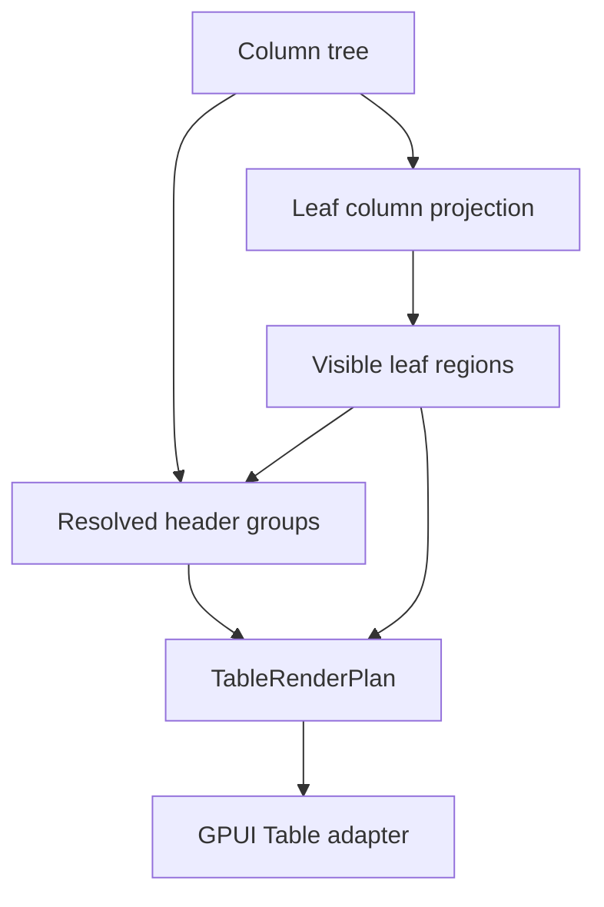

# Table column groups and nested headers

## Summary

This plan upgrades Table from a single flat header row to renderer-neutral column groups and nested
headers. The behavior should follow TanStack's header-group model where leaf columns remain the
only behavioral columns, while group headers provide labels, spans, and alignment over visible leaf
columns across pinned regions and center-column virtualization.

---

## Problem Frame

Open GPUI's Table now covers sorting, filtering, faceting, column visibility, column sizing,
pinning, grouping, row pinning, editing, and two-axis viewport metadata. The remaining header model
is still flat: `TableColumn` is both the schema leaf and the only rendered header cell, so wide data
sets cannot express grouped metric families, nested column categories, or multi-row header
accessibility. Mature data grids need nested headers without turning group labels into sortable,
filterable, or resizable data columns.

TanStack solves this by keeping a column tree, deriving ordered visible leaf columns, and building
header groups with placeholder headers plus `colSpan` / `rowSpan`. Fret mirrors the useful part in
`fret-ui-headless/src/table/headers.rs`. Open GPUI should adopt that shape, but keep the existing
leaf-column API source-compatible and keep all behavior ownership keyed by leaf `TableColumnId`.

---

## Requirements

**Core column tree**

- R1. Existing `TableState::with_columns` and `TableState::columns()` continue to describe visible
  behavioral leaf columns so current tables compile unchanged.
- R2. A new column tree API can describe group headers with stable group ids, labels, and nested
  leaf/group children without making group nodes sortable, filterable, hideable, editable, pinned,
  or sizable columns.
- R3. `TableState` normalizes the configured tree into a deterministic leaf projection, rejects or
  ignores duplicate leaf ids consistently with existing table identity rules, and includes the tree
  in equality/cache-key semantics.

**Resolved header groups**

- R4. `TableState::resolve` exposes header groups with stable header ids, depth, index, label,
  placeholder metadata, `col_span`, `row_span`, leaf-column coverage, and region family.
- R5. Header groups derive from visible ordered leaf columns after visibility, ordering, pinning,
  and sizing have resolved; hidden leaves shrink or remove group headers, and empty groups do not
  render.
- R6. Pinned left, center, and right lanes each get header groups aligned to that lane's leaf
  columns. A group crossing pinning boundaries is split into region-specific header families rather
  than forcing pinned lanes to move.
- R7. Flat tables resolve to a single header group that preserves the current one-row header
  behavior, current sortable header payloads, and current debug selector vocabulary.

**GPUI adapter and gallery proof**

- R8. `ui_components::TableRenderPlan` exposes nested header-group render metadata with summed
  widths from leaf column sizing and center-window rendering decisions from the same horizontal
  virtualizer as body cells.
- R9. The GPUI adapter renders multi-row headers whose group cells align with body cells, pinned
  lanes, resize handles, sortable leaf headers, and column virtualization spacers.
- R10. The Components gallery proves nested headers on a wide table sample with app-owned state,
  column visibility interaction, horizontal center-lane scrolling, and row/body scroll containment.

**Docs and verification**

- R11. Contract and verification docs record nested headers as official Table behavior while
  leaving header drag-reorder, grouped header context menus, sticky headers, and autosize-by-content
  as follow-up work.
- R12. Engineering memory records the plan, the chosen column-tree boundary, verification commands,
  and the next action after each implementation slice.

---

## Key Technical Decisions

- **Keep `TableColumn` as a leaf descriptor.** A group header is not a data column. Introducing a
  separate group/tree node avoids leaking group ids into sorting, filtering, faceting, editing,
  pinning, sizing, and visibility controls.
- **Store a normalized tree plus a leaf projection.** Existing APIs need `columns() -> &[TableColumn]`
  to remain cheap and source-compatible. A new tree setter should normalize the tree into the
  existing leaf vector and keep the full group structure for header resolution.
- **Resolve headers in `ui_core`, not in the GPUI adapter.** Spans, placeholders, visible leaf
  coverage, and region splitting are renderer-neutral table contracts. The adapter should only map
  that contract into element geometry, scroll handles, roles, and debug selectors.
- **Use region-specific header families.** Pinned lanes and center-column virtualization already
  split columns into left / center / right render regions. Nested headers must follow that split so
  group labels never make pinned columns scroll with the center lane.
- **Virtualize center leaf headers and their covering group cells together.** The visible center
  column window should determine which leaf headers and ancestor group headers mount, while spacer
  geometry preserves the full center width.

---

## High-Level Technical Design

The core resolver keeps row-model behavior leaf-oriented. Header resolution is a sibling of visible
column region resolution: it consumes the full column tree plus the ordered visible leaf regions and
produces header rows for each region family. The adapter consumes those rows when drawing the table
header and keeps body rows unchanged.

---

## Implementation Units

### U1. Add column tree descriptors and leaf projection

- **Goal:** Represent nested column groups without breaking the current flat column API.
- **Files:** `crates/ui_core/src/table.rs`, `crates/ui_core/src/prelude.rs`,
  `crates/ui_components/src/lib.rs`, `crates/ui_components/src/prelude.rs`,
  `crates/ui_components/tests/components.rs`
- **Patterns:** Follow `TableColumn`, `TableColumnId`, existing root/prelude export tests, and Fret
  `ColumnDef` / `headers.rs` tree inputs.
- **Test Scenarios:**
  - Flat `with_columns` still produces the same `columns()`, `visible_columns()`, and cache-key
    behavior.
  - A nested tree produces a deterministic leaf projection in tree order.
  - Duplicate leaf ids normalize or fail in one documented way and cannot produce duplicate render
    columns.
  - Group ids and labels are inspectable but do not appear as sortable, filterable, pinning,
    sizing, visibility, or editable leaf columns.

### U2. Resolve renderer-neutral header groups

- **Goal:** Build TanStack-aligned header groups from the column tree and visible leaf regions.
- **Files:** `crates/ui_core/src/table.rs`, `crates/ui_components/tests/components.rs`
- **Patterns:** Follow TanStack `buildHeaderGroups.ts`, Fret `build_header_groups`, and existing
  `TableColumnRegions` / `TableResolvedColumnSizingRegions`.
- **Test Scenarios:**
  - A two-level group resolves top group headers with correct `col_span` and leaf child headers.
  - A leaf under a shallower branch emits placeholder metadata so all header rows align.
  - Hidden leaves shrink group spans and remove empty group headers.
  - Column ordering changes leaf order while preserving valid ancestor group coverage.
  - Pinned left / center / right regions get independent header families with stable ids.

### U3. Expose nested headers in `TableRenderPlan`

- **Goal:** Give the GPUI adapter width-aware header rows that align with existing body cells,
  pinned lanes, sizing, sorting, resizing, and center-column virtualization.
- **Files:** `crates/ui_components/src/table.rs`, `crates/ui_components/tests/components.rs`
- **Patterns:** Follow `TableColumnRenderPlan`, `TableColumnRegionRenderPlan`,
  `TableCenterColumnWindowPlan`, and current header render-plan tests.
- **Test Scenarios:**
  - Render plan exposes header groups, header cells, row count, group width, leaf coverage, and
    region metadata without GPUI runtime types.
  - Flat tables keep one header row and preserve existing leaf header selectors and sort payloads.
  - Group header widths equal the sum of visible covered leaf widths after committed sizing.
  - Center-column virtualization mounts only the header cells covering rendered center leaves and
    keeps leading/trailing spacer widths aligned with body cells.
  - Resize handles and sort actions remain leaf-header-only.

### U4. Render multi-row headers in GPUI

- **Goal:** Replace the single-row header renderer with a multi-row header lane renderer while
  keeping body rows, scroll containment, and leaf interactions stable.
- **Files:** `crates/ui_components/src/table.rs`, `crates/ui_components/tests/components.rs`
- **Patterns:** Follow `render_table_header`, `render_table_header_cell`, row-region render code,
  and focused runtime tests for pinned / center-window headers.
- **Test Scenarios:**
  - Group cells render with stable debug selectors and no sort/resize interaction.
  - Leaf headers continue to sort by click / keyboard and expose current resize handles.
  - Pinned group headers stay fixed while center group headers move with the shared horizontal
    scroll handle.
  - Accessibility row/column positions account for multiple header rows without changing body cell
    leaf-column indexes.

### U5. Add Components gallery proof

- **Goal:** Prove nested headers on a real wide sample rather than only state tests.
- **Files:** `examples/ui-foundation-gallery/src/pages/components.rs`,
  `examples/ui-foundation-gallery/src/pages/components/render.rs`,
  `examples/ui-foundation-gallery/tests/foundation_gallery.rs`
- **Patterns:** Reuse `release-matrix`, `TableSampleStateSummary`, column-visibility controls,
  center-column virtualization smokes, and metadata conformance gates.
- **Test Scenarios:**
  - `release-matrix` or a sibling wide sample declares grouped metric headers over existing leaf
    metric columns.
  - Gallery metadata summarizes header row count, group count, and visible leaf count.
  - A focused smoke scrolls the center lane and proves group headers move with rendered center
    leaf headers while pinned group/leaf headers stay fixed.
  - Column visibility changes shrink a group span and unmount hidden leaf headers/cells without
    leaving empty group headers.

### U6. Update docs, verification, and memory

- **Goal:** Record nested headers as shipped Table behavior and keep later header work scoped.
- **Files:** `docs/ui/component-contract.md`, `docs/verification.md`,
  `docs/knowledge/engineering/current-state.md`, `docs/knowledge/engineering/log.md`,
  `docs/knowledge/engineering/progress/2026-06-24-table-column-groups-nested-headers.md`
- **Patterns:** Follow the column visibility, filter operators, and center-column virtualization
  documentation entries.
- **Test Scenarios:**
  - Contract docs describe leaf columns, group headers, placeholder headers, pinned-region header
    families, and deferred header work.
  - Verification docs name focused core/component/gallery gates for nested headers.
  - Engineering memory records shipped commits and the next Table maturity boundary.

---

## Acceptance Examples

- AE1. Given a flat table with `name`, `team`, and `status`, when it resolves headers, then it has
  one header row and the existing `table:{id}:header:{column}` selectors still target leaf headers.
- AE2. Given a `Delivery` group containing `status` and `score`, when both leaves are visible, then
  the top `Delivery` header has `col_span = 2` and the leaf row contains `status` and `score`.
- AE3. Given the same group, when `score` is hidden, then `Delivery` shrinks to `col_span = 1` and
  no placeholder or empty group remains for the hidden leaf.
- AE4. Given a group whose leaves are split between center and right pinning regions, when the
  header groups resolve, then each region receives its own header family aligned to that region's
  visible leaves.
- AE5. Given a wide grouped `release-matrix`, when the center lane scrolls horizontally, then the
  visible center group headers and leaf headers move together while pinned headers and the outer
  page stay fixed.

---

## Scope Boundaries

### Deferred for later

- Header drag-reorder and column group drag-reorder.
- Header context menus, group-level visibility menus, and group collapse/expand.
- Sticky header positioning beyond the existing fixed table header band.
- Autosize-by-content and text wrapping policies for multi-line group labels.
- Server-driven column schema negotiation or persisted column views.
- Group-level aggregation, summaries, or synthetic header/footer rows.

### Outside this plan

- Changing row-model stage order.
- Moving sorting/filtering/pinning/sizing behavior from leaf columns to group headers.
- Replacing existing `TableColumnVisibility`, `TableRangeFilter`, `TableFacetedFilter`, or
  `TablePredicateFilter` recipes.
- Extracting a standalone headless table crate.

---

## Risks & Dependencies

- Header group resolution can drift from body geometry if it recomputes order or widths separately.
  The resolver should consume the same visible leaf regions and sizing metadata already used by
  body cells.
- Duplicate ids are more dangerous in a tree than in a flat list. The first slice must define one
  normalization policy and test it before rendering work starts.
- Pinning can split one logical group into multiple visible families. This should be treated as a
  normal rendered outcome, not as an error or a reason to move pinned leaves.
- Center-column virtualization can hide a leaf while an ancestor group is partially visible. Tests
  must prove group cell mounting follows rendered leaf coverage and spacer geometry.

---

## Sources / Research

- `repo-ref/tanstack-table/packages/table-core/src/core/headers/buildHeaderGroups.ts`
- `repo-ref/tanstack-table/packages/table-core/src/core/headers/constructHeader.ts`
- `repo-ref/tanstack-table/packages/table-core/src/types/Header.ts`
- `repo-ref/tanstack-table/packages/table-core/src/types/HeaderGroup.ts`
- `repo-ref/fret/ecosystem/fret-ui-headless/src/table/headers.rs`
- `repo-ref/fret/ecosystem/fret-ui-kit/src/imui/table_controls/header_row.rs`
- `docs/plans/2026-06-23-003-feat-ui-table-sticky-pinned-columns-plan.md`
- `docs/plans/2026-06-23-004-feat-ui-table-column-virtualization-plan.md`
- `docs/plans/2026-06-24-008-feat-ui-table-column-visibility-controls-plan.md`
