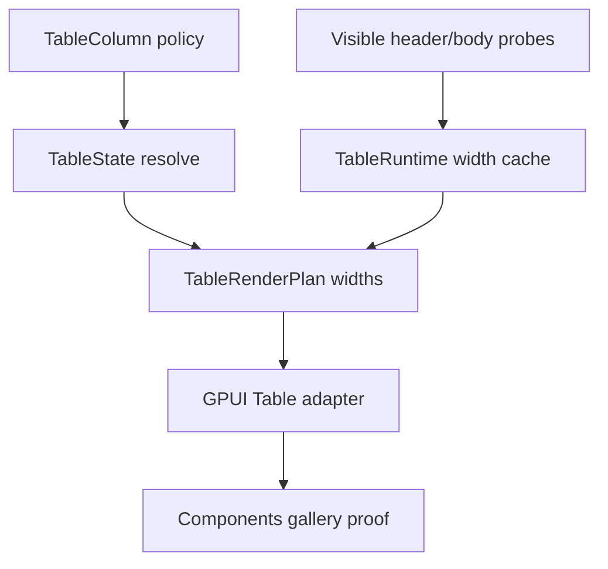

# Open GPUI Table Autosize by Content Plan

## Summary

The Table stack already has fixed widths, committed resize state, nested headers, pinning, and
viewport virtualization. The remaining maturity gap is content-fit sizing: some columns should
expand to fit their rendered labels and values without forcing callers to precompute widths by
hand. This plan adds a renderer-neutral content-fit policy and an adapter-owned measurement cache
so the current Table can follow visible content while keeping manual sizing authoritative.

## Problem Frame

Current column widths are either defaults or explicit committed widths. That works for resize
demos, but real tables need a predictable way to fit identity columns, status columns, and long
metric labels to their visible content. The content-fit behavior must respect min/max bounds,
pinned regions, nested headers, and virtualization. It also must not turn the component into a
full data-grid engine or a dataset scanner.

## Requirements

- R1. Add a renderer-neutral content-fit policy to table columns, keyed by stable column id,
  without adding GPUI runtime types to core state.
- R2. Resolve content-fit columns from the widest rendered header/body content sample in the
  current virtualized window, then clamp the result to existing min/max bounds.
- R3. Keep committed sizing authoritative. Manual widths beat content-fit measurements until the
  caller clears or replaces them.
- R4. Keep measurement ownership in `ui_components`; the core contract stays pure and the adapter
  keeps the visible-content width cache and probe wiring.
- R5. Expose measured content-fit width snapshots in the render plan so header and body use one
  width decision per frame.
- R6. Prove the slice in the Components gallery with a focused sample and smoke that widen
  fit-content columns from visible content, preserve scroll containment, and keep header/body
  widths aligned.
- R7. Update docs and engineering memory to mark autosize-by-content supported and leave sticky
  headers, column drag reorder, and dataset-wide precomputation as follow-up.

## Key Technical Decisions

- **Treat content-fit as a column policy, not a table-wide layout mode.** The caller opts specific
  columns in, and the rest of the table keeps the existing fixed-width behavior.
- **Use the rendered visible window as the measurement basis.** The first slice fits to what the
  adapter already mounts, not to the full backing dataset.
- **Keep committed widths above measured widths.** A manual resize remains the explicit override
  path. Clearing the override restores content-fit behavior.
- **Keep measurement in the adapter and cache it there.** This matches existing GPUI-local
  measurement patterns such as text input bounds and select content-width probes.
- **Keep the policy monotonic within a session.** A column can widen when wider visible content
  appears, but it should not thrash smaller on every redraw unless the caller resets it.
- **Keep the first slice single-line and nowrap.** Wrapped cell content and rich multi-line
  editors remain out of scope for this pass.

## High-Level Technical Design

The core table layer only needs to know which columns prefer content-fit behavior. The adapter
renders hidden or off-flow measurement probes for those columns, caches the widest visible sample
per column id, and overlays that snapshot onto the render plan. The resulting width should remain
compatible with existing sizing bounds, pinning, and header-group geometry.

## Implementation Units

### U1. Add content-fit column policy to the core Table contract

**Goal:** Give `TableColumn` a renderer-neutral way to opt into content-fit sizing.

**Requirements:** R1, R3

**Files:**

- Modify `crates/ui_core/src/table.rs`
- Modify `crates/ui_core/src/prelude.rs`
- Modify `crates/ui_components/tests/components.rs`

**Approach:** Add a width policy enum or equivalent to distinguish fixed and content-fit columns.
Keep the policy keyed by stable column id, include it in table cache-key semantics, and leave the
existing fixed-width behavior unchanged. The policy should not pull GPUI runtime types into
`ui_core`.

**Test scenarios:**

- Fixed columns resolve exactly as before.
- Content-fit columns can be inspected through the resolved contract.
- Policy changes invalidate table cache keys.
- Visibility and pinning continue to work for both policies.

**Verification:** Core table tests and public export inventory tests cover the new policy.

### U2. Resolve measured visible content widths in the render plan

**Goal:** Make header and body use one width decision per frame.

**Requirements:** R2, R4, R5

**Files:**

- Modify `crates/ui_core/src/table.rs`
- Modify `crates/ui_components/src/table.rs`
- Modify `crates/ui_components/tests/components.rs`

**Approach:** Keep committed sizing as the authoritative override, then overlay the widest visible
header/body sample for columns that opt into content-fit. The adapter runtime owns a keyed
measurement cache and invalidates it when the table id, visibility set, header tree, or visible
sample set changes. Use the same visible snapshot for header groups and body cells so region totals
stay aligned.

**Test scenarios:**

- The widest visible label or value wins for a content-fit column.
- A committed width suppresses the measured width until the override is cleared.
- Min/max bounds still clamp the final width.
- Nested headers and pinning do not desynchronize header/body widths.
- Scroll redraws do not thrash widths when the visible sample set is unchanged.

**Verification:** Component render-plan tests prove header/body parity and visible-window width
snapshots.

### U3. Add adapter-owned measurement probes and gallery proof

**Goal:** Prove the content-fit behavior in the Components gallery.

**Requirements:** R2, R6

**Files:**

- Modify `crates/ui_components/src/table.rs`
- Modify `examples/ui-foundation-gallery/src/pages/components.rs`
- Modify `examples/ui-foundation-gallery/src/pages/components/render.rs`
- Modify `examples/ui-foundation-gallery/tests/foundation_gallery.rs`

**Approach:** Render hidden or off-flow probes for fit-content columns using the same measurement
pattern Fret uses for width-sensitive surfaces. Add a focused sample with long labels and values so
the fit-content columns visibly widen while a manually sized column stays fixed. Keep the sample
inside the existing Components page and preserve nested scroll containment.

**Test scenarios:**

- The focused Table page renders the autosize sample.
- A long visible value widens the fit-content column.
- A manually sized column remains fixed.
- Header and body widths match after the measurement update.
- The outer Components page stays fixed while the sample is interacted with.

**Verification:** Gallery runtime smokes prove local containment and width growth.

### U4. Update docs, memory, and verification boundaries

**Goal:** Record autosize-by-content as supported and bound the follow-up scope.

**Requirements:** R7

**Files:**

- Modify `docs/ui/component-contract.md`
- Modify `docs/verification.md`
- Modify `docs/knowledge/engineering/current-state.md`
- Modify `docs/knowledge/engineering/log.md`

**Approach:** Update the Table contract to say content-fit sizing is supported for rendered content
while dataset-wide exact autosizing, sticky headers, column drag reorder, and standalone headless
extraction remain deferred. Refresh the verification and memory trail with the new gallery proof
and the next Table boundary.

**Verification:**

- `cargo fmt -p open-gpui-ui-core -p open-gpui-ui-components -p open-gpui-ui-foundation-gallery`
- `cargo nextest run -p open-gpui-ui-core table`
- `cargo nextest run -p open-gpui-ui-components table component_api_inventory`
- `cargo nextest run -p open-gpui-ui-foundation-gallery table`
- `git diff --check`
- `python $HOME\.codex\skills\engineering-wiki-memory\scripts\wiki_memory.py validate --root docs\knowledge\engineering`

## Acceptance Examples

- AE1. Given a content-fit identity column with a long rendered label, the resolved width grows to
  the widest visible content within min/max bounds.
- AE2. Given a manual width override, the override wins over the measured width until the caller
  clears it.
- AE3. Given a virtualized table where wider content scrolls into view, the column can grow
  without breaking header/body alignment.
- AE4. Given the autosize gallery sample is scrolled or interacted with, wheel input stays inside
  the sample and the outer Components page does not move.

## Scope Boundaries

### Deferred for later

- Sticky headers inside a unified two-axis scroller.
- Dataset-wide exact autosizing or precomputed width scans owned by the table component.
- Column drag reorder and header drag-reorder.
- Multiline wrapped-cell autosizing and rich editor measurement.
- Standalone headless table extraction.

### Outside this plan

- Replacing committed sizing and resize interactions.
- Moving measurement ownership into `ui_core`.
- Changing row-model ordering or pinned-region semantics.

## Risks & Dependencies

- Measurement can thrash if the cache chases every scroll delta. Keep the cache keyed to visible
  sample state and content-fit policy, not raw pointer motion.
- Hidden probes can perturb layout if they are not truly off-flow. Keep them adapter-owned and
  non-interactive.
- Width measurements can drift if text shaping differs between header and body surfaces. Use the
  same measurement path for both and verify width parity in tests.
- Manual resize and content-fit can conflict if precedence is unclear. Keep committed sizing
  authoritative so the user always has an escape hatch.

## Sources / Research

- `docs/plans/2026-06-23-002-feat-ui-table-column-sizing-plan.md`
- `docs/plans/2026-06-24-010-feat-ui-table-column-groups-nested-headers-plan.md`
- `docs/knowledge/engineering/decisions/open-gpui-ui-component-depth-roadmap.md`
- `docs/ui/component-contract.md`
- `docs/verification.md`
- `crates/ui_core/src/table.rs`
- `crates/ui_components/src/table.rs`
- `crates/ui_components/src/text_input.rs`
- `crates/ui_components/tests/components.rs`
- `examples/ui-foundation-gallery/src/pages/components.rs`
- `examples/ui-foundation-gallery/tests/foundation_gallery.rs`
- `repo-ref/tanstack-table/docs/framework/react/guide/column-sizing.md`
- `repo-ref/tanstack-table/docs/reference/index/interfaces/Column_ColumnSizing.md`
- `repo-ref/tanstack-table/docs/reference/index/interfaces/Header_ColumnSizing.md`
- `repo-ref/fret/ecosystem/fret-ui-headless/src/table/column_sizing.rs`
- `repo-ref/fret/ecosystem/fret-ui-headless/src/table/column_sizing_info.rs`
- `repo-ref/fret/ecosystem/fret-ui-kit/src/primitives/select.rs`
- `repo-ref/fret/ecosystem/fret-ui-kit/src/declarative/table.rs`
