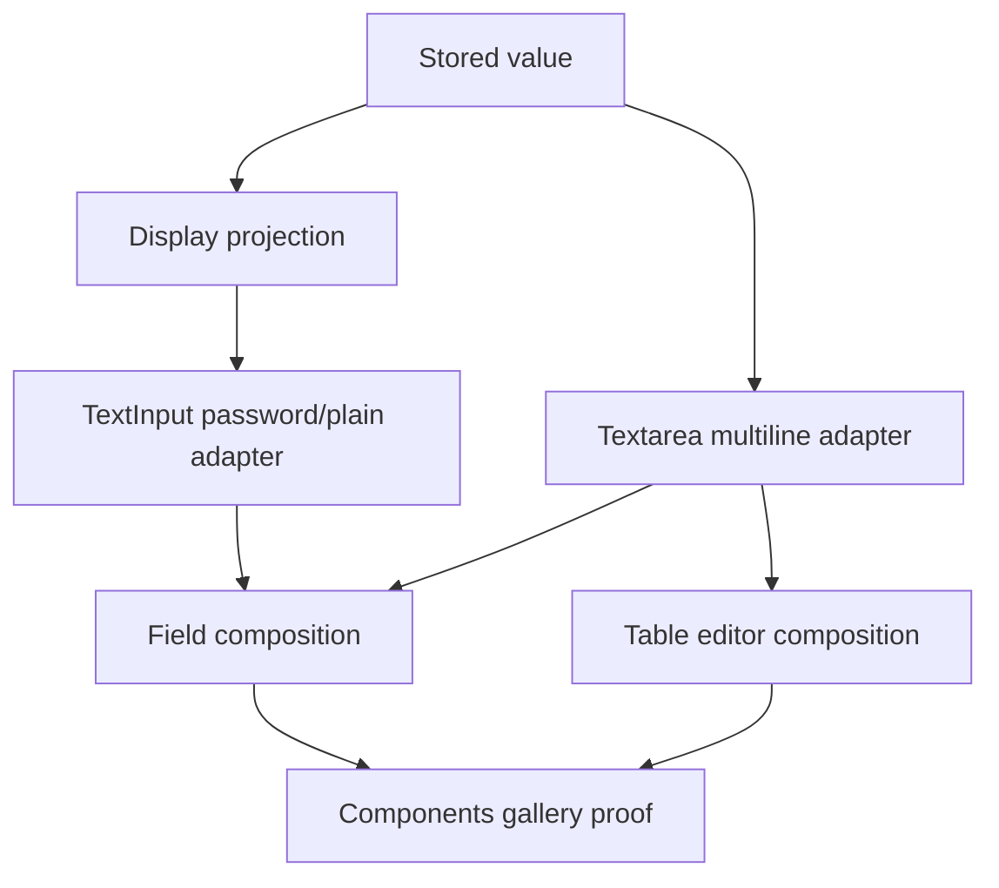

# Open GPUI Text Input Editor Family Plan

## Summary

The component library now has a real controlled single-line `TextInput` and Table text-cell
editing, but all richer editor behavior is still deferred. This plan grows the text input family
without importing a full editor subsystem: first split stored text from displayed text, then add
single-line password masking, then add a separate controlled `Textarea` for multiline form input,
and finally let Table opt into the richer editor surface only after the primitive is stable.

## Execution Status

- U1 complete in the working tree: `TextInput` has internal value/display projection helpers and
  focused projection tests for ASCII, emoji, CJK, and ZWJ-family values.
- U2 complete in the working tree: `TextInputDisplayMode` is public, password mode masks one glyph
  per stored grapheme for static and controller-backed rendering, and the controller maps displayed
  mask offsets back to stored value offsets for hit testing and IME geometry.
- U3 complete in the working tree: `Textarea` is a separate controlled multiline form editor with
  renderer-neutral state, newline-preserving `on_change`, Field composition, Components gallery
  samples, and a focused gallery smoke proving wheel input stays inside the textarea viewport.
- Current next unit: U4 optional Table multiline cell editor composition.

## Problem Frame

`TextInput::value(...).on_change(...)` gives applications a standard controlled scalar input, and
Table editable text cells already compose it. That path intentionally normalizes newlines away and
uses a one-line layout model. The remaining gap is not just another visual variant: password
masking needs value/display offset mapping, and multiline text needs vertical layout, newline
preservation, local scroll/height rules, and clear ownership boundaries.

The implementation should keep the current-crate product boundary from ADR 0008. It should use
reference repositories for behavior shape and edge cases, not copy their editor-grade features.

## Requirements

- R1. Keep public resolved states renderer-neutral. `TextInputState`, new editor-family states, and
  Table editor metadata must not expose GPUI focus handles, shaped lines, element ids, scroll
  handles, callbacks, or adapter geometry.
- R2. Introduce an explicit value/display projection layer for text editing so stored values,
  callback payloads, displayed text, caret offsets, selection offsets, and hit testing do not rely
  on ad hoc string substitution.
- R3. Add single-line password masking for `TextInput` without changing the stored value or
  `on_change` payload. Masked display must handle non-ASCII values without corrupting caret and
  selection geometry.
- R4. Add a first official controlled `Textarea` component for multiline form input: value,
  placeholder, disabled, read-only, invalid, required, size, rows/min-height metadata, metrics,
  role, token intents, and `on_change` payloads that preserve newlines.
- R5. Keep `Textarea` separate from `TextInput`. Shared helpers are encouraged, but the public API
  should not turn single-line input into a mode bag that hides different layout and scroll rules.
- R6. Preserve current `TextInput`, `Command`, `Combobox`, Table filter, and Table text-cell
  behavior while adding the richer family.
- R7. Prove the new editor family in the Components gallery with focused samples and runtime
  smokes. The gallery must keep nested scroll local and should show Field composition for both
  password and textarea use cases.
- R8. Extend Table editor metadata only after the primitive is stable: a multiline editor column
  should remain app-owned, virtualized, and opt-in, with stable row/column payloads.
- R9. Update the component contract, verification docs, API inventory, and engineering memory so
  password masking and multiline input are supported while undo/redo, completion, validation
  engines, rich text, LSP, spreadsheet editing, and standalone headless extraction remain deferred.

## Key Technical Decisions

- **Separate value from display early.** Password masking is the smallest feature that proves the
  split. It should introduce reusable projection helpers before adding more editor widgets.
- **Use a separate `Textarea` component.** Fret and shadcn both treat textarea as a leaf control
  with different row/min-height and resize semantics. Open GPUI should follow that shape instead
  of hiding multiline behavior behind `TextInput::multiline(true)`.
- **Keep the first textarea form-oriented.** The first slice should cover controlled multiline form
  editing, stable line boxes, rows/min-height, placeholder, local overflow, and Field composition.
  It should not become a code editor.
- **Do not add reveal toggles until the masked value path is correct.** A reveal icon is useful,
  but it should build on a stable password display contract rather than drive the first API.
- **Table composes editors; it does not own editor engines.** Table may add a `Textarea` cell
  editor after the primitive exists, but row data, validation, save/cancel workflows, and mutation
  orchestration stay app-owned.
- **Reference mature projects for edge cases, not architecture.** `gpui-component` is useful for
  masked display offsets. Fret is useful for textarea leaf-control boundaries and multiline policy.
  TanStack Table is useful for app-owned editable data examples, not for text editing internals.

## High-Level Technical Design

## Implementation Units

### U1. Add text value/display projection helpers

**Goal:** Make display text and offset mapping explicit before adding password masking or multiline
editing.

**Requirements:** R1, R2, R6

**Files:**

- Modify `crates/ui_components/src/text_input.rs`
- Modify `crates/ui_components/tests/components.rs`

**Approach:** Extract small internal helpers for projecting stored text into display text and for
mapping stored byte offsets to display byte offsets. The default projection is identity and should
leave existing `TextInputController` behavior unchanged. Add tests around ASCII, emoji, CJK, and
ZWJ-family values so later masked display work has clear offset semantics.

**Patterns to follow:**

- Current `EditableTextElement` caret and selection painting in `crates/ui_components/src/text_input.rs`
- `repo-ref/gpui-component/crates/ui/src/input/element.rs` masked offset helper
- Existing UTF-16 and grapheme controller tests in `crates/ui_components/tests/components.rs`

**Test scenarios:**

- Plain projection returns the original display string and identity offsets.
- Offset mapping is clamped to valid display boundaries for empty, ASCII, emoji, CJK, and ZWJ
  grapheme values.
- Existing controlled `TextInput` runtime tests still receive the unmodified stored value.
- Existing `Command`, `Combobox`, and Table filter text-input tests remain unchanged.

### U2. Add single-line password masking to TextInput

**Goal:** Let `TextInput` render a masked value while keeping stored value and callbacks unchanged.

**Requirements:** R2, R3, R6, R7, R9

**Files:**

- Modify `crates/ui_components/src/text_input.rs`
- Modify `crates/ui_components/src/lib.rs`
- Modify `crates/ui_components/src/prelude.rs`
- Modify `crates/ui_components/tests/components.rs`
- Modify `examples/ui-foundation-gallery/src/pages/components.rs`
- Modify `examples/ui-foundation-gallery/src/pages/components/render.rs`
- Modify `examples/ui-foundation-gallery/tests/foundation_gallery.rs`
- Modify `docs/ui/component-contract.md`
- Modify `docs/verification.md`

**Approach:** Add a small public text input mode or display-policy enum for plain vs password
display. The adapter projects non-empty password values to mask glyphs for paint and uses the
projection mapping for caret and selection geometry. `TextInputState` records the mode without
holding callbacks or GPUI runtime values. The first slice should not add a reveal button; a future
icon button can compose on top of this policy.

**Patterns to follow:**

- Existing `TextInput::value(...).on_change(...)` controlled path
- `repo-ref/gpui-component/crates/ui/src/input/state.rs` password masked state
- `repo-ref/gpui-component/crates/ui/src/input/input.rs` mask-toggle separation from core input
- Existing component API inventory tests

**Test scenarios:**

- Password state exposes password display policy while preserving `Role::TextInput`.
- Rendered password input displays mask glyphs but `on_change` receives the real value.
- Caret and selection geometry do not panic or use invalid offsets for emoji/CJK values.
- Placeholder remains visible and unmasked when the value is empty.
- Disabled and read-only password inputs preserve the existing edit-blocking behavior.
- Gallery samples expose a focused password field and keep page scroll stable while editing.

### U3. Add controlled Textarea state and adapter

**Goal:** Add the first official multiline form editor without importing a full editor engine.

**Requirements:** R1, R4, R5, R6, R7, R9

**Files:**

- Add `crates/ui_components/src/textarea.rs`
- Modify `crates/ui_components/src/lib.rs`
- Modify `crates/ui_components/src/prelude.rs`
- Modify `crates/ui_components/src/theme.rs`
- Modify `crates/ui_components/tests/components.rs`
- Modify `examples/ui-foundation-gallery/src/pages/components.rs`
- Modify `examples/ui-foundation-gallery/src/pages/components/render.rs`
- Modify `examples/ui-foundation-gallery/tests/foundation_gallery.rs`
- Modify `docs/ui/component-contract.md`
- Modify `docs/verification.md`

**Approach:** Start with a controlled `Textarea::value(...).on_change(...)` API matching
`TextInput`'s scalar callback vocabulary, but preserve `\n` instead of sanitizing it. Give
`TextareaState` rows/min-height, stable-line-box, placeholder, invalid, required, read-only,
disabled, metrics, colors, role, and controller-driven metadata. The adapter may share text editing
helpers with `TextInput`, but the layout should be multiline-specific: split lines, shape visible
lines, map hit testing by line, and keep overflow local to the textarea viewport.

**Patterns to follow:**

- Current `TextInputController` and `EditableTextElement`
- `repo-ref/fret/ecosystem/fret-ui-shadcn/src/textarea.rs`
- `repo-ref/fret/ecosystem/fret-ui-editor/src/controls/text_field.rs`
- `repo-ref/fret/ecosystem/fret-ui-editor/src/controls/text_field/element/entry/multiline.rs`
- `repo-ref/gpui-component/crates/ui/src/input/state.rs` multiline mode boundaries

**Test scenarios:**

- Resolved state records multiline value, placeholder, row/min-height metadata, size metrics,
  disabled, read-only, invalid, and required state.
- Controlled `Textarea` emits newline-preserving `on_change` payloads.
- Enter or pasted newline input produces multiline stored text instead of single-line
  sanitization.
- Backspace/Delete remain grapheme-aware across line boundaries.
- Mouse hit testing and selection do not panic on multiple lines or trailing newline values.
- Local textarea wheel/drag behavior does not move the outer Components page.
- Field composition can wrap `Textarea` without owning the editor value.

### U4. Compose Textarea into Table as an opt-in cell editor

**Goal:** Let Table prove richer editor-family composition without making Table own editor state.

**Requirements:** R5, R6, R8, R9

**Files:**

- Modify `crates/ui_core/src/table.rs`
- Modify `crates/ui_core/src/prelude.rs`
- Modify `crates/ui_components/src/table.rs`
- Modify `crates/ui_components/tests/components.rs`
- Modify `examples/ui-foundation-gallery/src/pages/components.rs`
- Modify `examples/ui-foundation-gallery/src/pages/components/render.rs`
- Modify `examples/ui-foundation-gallery/tests/foundation_gallery.rs`
- Modify `docs/ui/component-contract.md`
- Modify `docs/verification.md`

**Approach:** Extend `TableCellEditor` with a multiline text editor variant after `Textarea` is
stable. The GPUI adapter composes `Textarea` only for editable leaf cells, keeps stable
row/column-id payloads through `TableCellEditChange`, and keeps grouping, virtualization,
pinning, row selection, and row activation behavior unchanged. If implementation shows that
textarea height changes destabilize virtual row measurement, defer Table composition and record
the measurement blocker instead of forcing a brittle integration.

**Patterns to follow:**

- `docs/plans/2026-06-24-005-feat-ui-table-cell-editing-plan.md`
- Existing Table text-cell editing implementation in `crates/ui_components/src/table.rs`
- `repo-ref/tanstack-table/examples/react/with-tanstack-form/src/main.tsx`
- Existing Table gallery editable sample and nested scroll smokes

**Test scenarios:**

- A multiline editor column renders a stable nested textarea selector only for visible editable
  leaf cells.
- Newline-preserving edits emit one `TableCellEditChange` with stable row/column ids.
- Typing or scrolling inside the textarea does not emit row activation or selection payloads.
- Virtualized rows still mount editors only for the rendered row window.
- If dynamic height is deferred, tests prove the editor uses a fixed row height and does not break
  existing virtualizer math.

### U5. Update docs, memory, and verification boundaries

**Goal:** Record the editor family contract and keep deferred editor-grade work explicit.

**Requirements:** R7, R9

**Files:**

- Modify `docs/ui/component-contract.md`
- Modify `docs/verification.md`
- Modify `docs/knowledge/engineering/current-state.md`
- Modify `docs/knowledge/engineering/log.md`
- Add or update `docs/knowledge/engineering/progress/2026-06-25-text-input-editor-family-plan.md`

**Approach:** Update the component contract to distinguish shipped single-line input, password
display, controlled textarea, and Table composition. Keep undo/redo, completion, validation
engines, rich text, code-editor behavior, password reveal toggles, async spellcheck, and standalone
headless extraction out of this slice. Record verification commands and the next action in the
engineering wiki.

**Test scenarios:**

- Contract docs do not imply that `TextInputController` is renderer-neutral.
- Verification docs name the focused component and gallery gates for password and textarea.
- Engineering memory records the plan, branch, current status, verification state, and next action.

## Acceptance Examples

- AE1. Given a password `TextInput` with value `a🙂中`, when it renders, then the user sees a masked
  display while callbacks and controller value still contain `a🙂中`.
- AE2. Given a controlled `Textarea`, when the user enters `Line 1\nLine 2`, then `on_change`
  receives the newline-preserving value and the next render displays two lines.
- AE3. Given a `Field` wrapping a `Textarea`, when the field is invalid and required, then the
  field owns label/message composition while the textarea state owns control semantics.
- AE4. Given a Table cell configured with a multiline text editor, when the user edits a visible
  leaf cell, then the payload targets the stable row id and column id and row activation does not
  fire.
- AE5. Given a textarea sample inside the Components gallery, when the user wheels inside the
  editor viewport, then the outer Components page does not scroll.

## Scope Boundaries

### Deferred for later

- Password reveal toggle, generated-password affordances, and credential-manager integration.
- Undo/redo history, completion popovers, spellcheck, validation engines, rich text, syntax
  highlighting, LSP, diagnostics, context menus, and code-editor behavior.
- Auto-growing textarea height, user drag-resize handles, soft wrapping beyond form-stable line
  boxes, and dynamic virtual row heights.
- Table row-form workflows, save/cancel/dirty summaries, spreadsheet range paste, multi-cell
  selection, and optimistic server mutation queues.
- Standalone headless text-editing crate extraction.

### Outside this plan

- Replacing GPUI's `EntityInputHandler` / `ElementInputHandler` path.
- Changing `Command`, `Combobox`, Table filters, or existing single-line cell editing APIs except
  where tests need to preserve behavior.
- Adding new application-level form libraries.
- Moving text editing ownership into `open_gpui_ui_core`.

## Risks & Dependencies

- Password masking can corrupt cursor geometry if display offsets are treated as stored byte
  offsets. U1 exists to make the mapping explicit before U2 changes rendering.
- Multiline editing can grow into a full editor quickly. Keep the first `Textarea` form-oriented
  and defer editor-grade behavior.
- Textarea local scrolling can leak wheel events to the Components page. Gallery smoke coverage is
  required before treating the component as official.
- Table composition may require stable fixed-height editor rows until dynamic row measurement is
  mature. If dynamic height fights the current virtualizer, defer auto-grow instead of weakening
  virtualized Table behavior.

## Sources / Research

- `docs/plans/2026-06-15-003-feat-ui-text-field-slice-plan.md`
- `docs/plans/2026-06-15-004-feat-ui-component-roadmap-plan.md`
- `docs/plans/2026-06-24-005-feat-ui-table-cell-editing-plan.md`
- `docs/knowledge/engineering/decisions/open-gpui-ui-component-depth-roadmap.md`
- `docs/knowledge/engineering/subagents/text-input-patterns.md`
- `docs/knowledge/engineering/subagents/text-input-controller-research.md`
- `docs/ui/component-contract.md`
- `docs/verification.md`
- `crates/ui_components/src/text_input.rs`
- `crates/ui_components/src/table.rs`
- `repo-ref/gpui-component/crates/ui/src/input/state.rs`
- `repo-ref/gpui-component/crates/ui/src/input/element.rs`
- `repo-ref/gpui-component/crates/ui/src/input/input.rs`
- `repo-ref/fret/ecosystem/fret-ui-shadcn/src/textarea.rs`
- `repo-ref/fret/ecosystem/fret-ui-editor/src/controls/text_field.rs`
- `repo-ref/fret/ecosystem/fret-ui-editor/src/controls/text_field/element/entry/multiline.rs`
- `repo-ref/tanstack-table/examples/react/with-tanstack-form/src/main.tsx`
