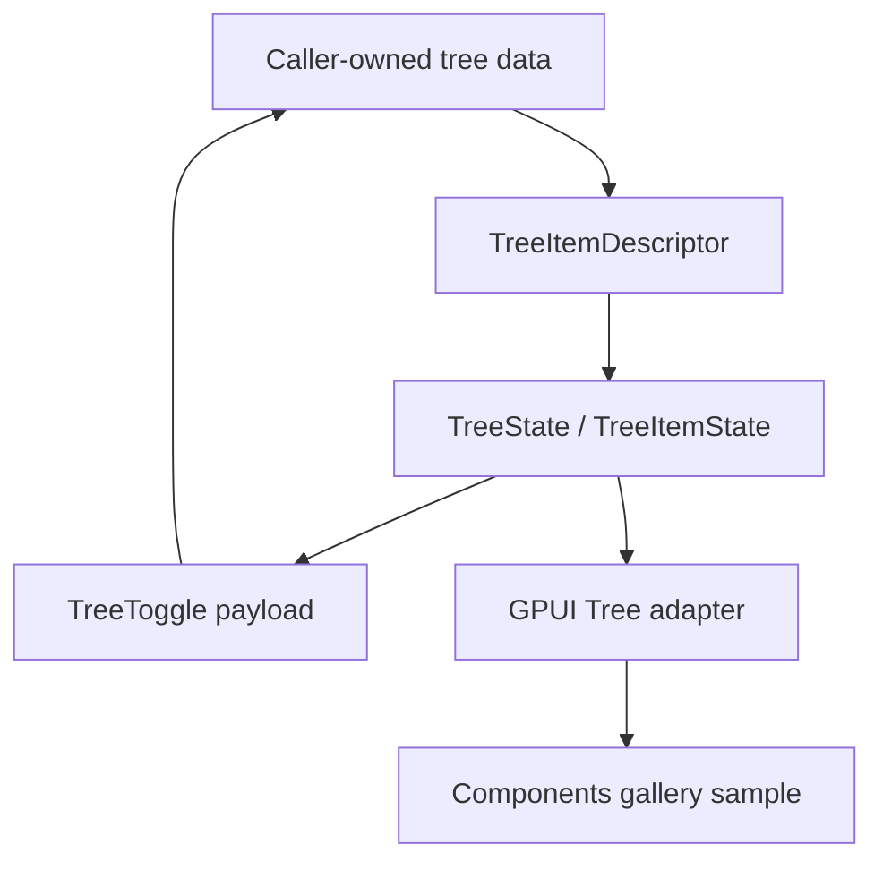

# feat: Add Tree lazy-loading branch contract

## Summary

Deepen the official `Tree` component so branch rows can represent caller-owned lazy children:
unloaded, loading, loaded, and failed. The component must stay renderer-neutral at the state
layer and must not own asynchronous data fetching. Applications own data and retry policy; `Tree`
owns resolved metadata, accessibility-safe disclosure behavior, and deterministic toggle payloads.

---

## Problem Frame

`Tree` already renders hierarchical items, roving focus, selection, expansion overrides, keyboard
actions, and local scroll containment. Real file explorers, project outlines, and remote trees
also need expandable rows before children have been loaded. Today a row without children is treated
as a leaf, so callers cannot show a disclosure affordance for remote branches or distinguish
unloaded, loading, and failed states in the toggle callback.

The Table row model already has `TableRowChildrenLoadState`; this Tree slice should mirror the
same ownership principle without coupling Tree to Table internals.

---

## Requirements

- R1. `TreeItemDescriptor` can mark a branch as having loadable children even when the current
  descriptor has no loaded child descriptors.
- R2. Loaded child count and child load state are exposed through `TreeItemState`.
- R3. `TreeToggle` payloads include loaded child count and child load state so callers can decide
  whether to fetch, retry, or only update local expansion.
- R4. Unloaded and failed branches remain focusable and expandable when enabled.
- R5. Loading branches remain visible as branches, but keyboard/pointer toggling must not collapse
  or repeatedly request loading while the branch is already loading.
- R6. Expanded unloaded/loading/failed branches do not synthesize fake child rows in `TreeState`.
- R7. The GPUI adapter continues to own only focus, selection, expansion overrides, and scroll
  handles. It must not spawn async work or mutate caller data.
- R8. The gallery exposes a lazy tree sample with idle, loading, loaded, and failed branches plus
  smoke coverage for toggle payloads and rendered affordances.
- R9. Public exports, component contract docs, verification notes, and engineering memory reflect
  the shipped boundary.

---

## Non-Goals

- Virtualized tree rendering.
- Drag-and-drop hierarchy editing.
- Typeahead search.
- Async executor integration, data-source traits, cancellation, or retries owned by the component.
- Reusing `TableRowChildrenLoadState` as a public Tree type. Tree should have its own small
  vocabulary even if semantics are intentionally similar.

---

## Technical Design

### State Vocabulary

Add a Tree-specific load-state enum:

- `TreeChildrenLoadState::Loaded`
- `TreeChildrenLoadState::Unloaded`
- `TreeChildrenLoadState::Loading { message }`
- `TreeChildrenLoadState::Failed { message }`

`TreeItemDescriptor` keeps children as caller-provided descriptors and adds child-state builder
helpers. `TreeItemState` resolves:

- `has_children()`: true for loaded children or loadable branch states.
- `loaded_child_count()`: current descriptor child count.
- `children_load_state()`: current load-state metadata.
- `children_loaded()`, `children_loading()`, and `children_load_failed()` convenience helpers.

### Toggle Policy

`TreeToggle::from_item` should return `None` for disabled rows, leaves, and currently loading
branches. For unloaded or failed branches it returns a normal expansion request with load metadata
so the caller can start fetch or retry. For loaded branches it preserves existing expand/collapse
behavior.

### Rendering Policy

The disclosure glyph is rendered for loadable branches. Loading and failed rows should use stable
text hints without adding fake descendants. The adapter emits `on_toggle` only when
`TreeToggle::from_item` returns a payload.

---

## Implementation Units

### U1. Tree lazy branch state

- Add `TreeChildrenLoadState`.
- Extend `TreeItemDescriptor`, `TreeItemState`, and `TreeToggle`.
- Update flattening, expansion override application, keyboard actions, and unit tests.

### U2. Adapter rendering and behavior

- Render disclosure for unloaded/loading/failed branches.
- Block repeated toggles while loading.
- Add stable debug selectors or text hints for loading and failed branches.
- Keep focus and scroll behavior unchanged.

### U3. Gallery proof

- Add a `remote-workspace` Tree sample or expand the existing Tree sample list.
- Record toggle payload load-state metadata in `TreeSampleRuntimeLog`.
- Add focused sample metadata and smoke coverage for idle, loading, loaded, and failed branches.

### U4. Docs, memory, and verification

- Update component contract and verification docs.
- Update engineering memory current state and log.
- Run focused `cargo nextest` gates and `cargo fmt`.

---

## Acceptance Evidence

- Unit tests prove visible flattening for expanded unloaded/loading/failed branches does not add
  synthetic rows.
- Unit tests prove disabled/leaves/loading rows do not create toggle payloads.
- Unit tests prove unloaded and failed rows emit toggle payloads with stable load-state metadata.
- Runtime smoke proves the gallery sample exposes branch affordances and logs child load metadata.
- Public export/inventory tests include `TreeChildrenLoadState`.
