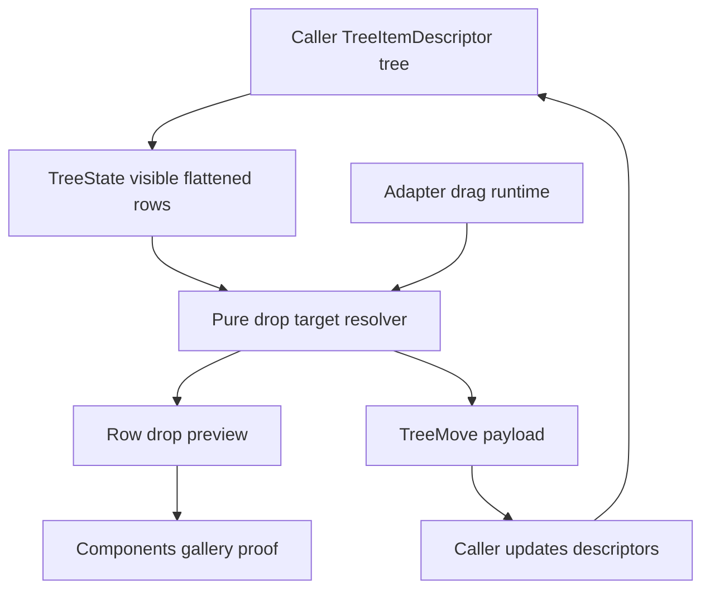

# feat: Add Tree drag-and-drop hierarchy editing

## Summary

Add the first production-grade Tree hierarchy editing slice: a renderer-neutral drop-target
contract, controlled move payloads, adapter-owned pointer drag state, and focused gallery proof.
The component should report what the user intended to move; it should not mutate the caller's tree
data internally.

---

## Problem Frame

The official `Tree` now has lazy branch metadata, typeahead, and fixed-row virtual rendering.
Applications still need a standard way to reorder and reparent visible tree items for file
explorers, outline editors, release plans, and dependency browsers. The tricky part is not the
pointer event itself; it is defining legal tree moves without creating cycles, dropping into
unloaded branches, or coupling the reusable component to app-owned persistence rules.

Fret's file-tree surface is a useful reference for flattened retained rows, stable ids, depth
metadata, row clipping, and virtualization. Fret's DnD layer is a useful reference for separating
headless collision/drop policy from adapter-owned pointer tracking. Open GPUI should follow that
split inside the current `ui_components` crate rather than extracting a standalone headless crate
for this slice.

---

## Requirements

**Move Contract**

- R1. Tree exposes a stable move payload with dragged item identity, source parent, target parent,
  target sibling anchor, and drop position.
- R2. Pure helpers reject illegal moves: dropping onto self, dropping into a descendant, dropping
  into disabled items, and dropping into loading or unloaded branches unless a future policy opts
  in.
- R3. Drop target resolution works from visible flattened rows and row metrics so it can be tested
  without GPUI pointer state.
- R4. The component emits controlled `on_move` payloads only; callers rebuild descriptors and feed
  them back when they accept a move.

**Adapter and Interaction**

- R5. The GPUI Tree adapter owns pointer tracking, drag thresholds, hover/preview state, and local
  scroll behavior.
- R6. Drag affordances stay opt-in so existing Tree samples and tests keep their current click,
  selection, expansion, lazy-load, typeahead, and virtualized behavior.
- R7. Virtualized Tree rows can participate in drop-target resolution for currently rendered rows
  without requiring off-window row elements.
- R8. Keyboard accessibility remains intact; pointer drag must not steal normal row activation or
  disclosure toggles before the drag threshold is crossed.

**Gallery, Docs, and Verification**

- R9. Components gallery adds a Tree sample that demonstrates move payloads and caller-owned
  descriptor updates.
- R10. Focused gallery smoke coverage proves a visible reorder or reparent operation updates the
  sample while the Tree scroll surface keeps ownership of wheel/drag interactions.
- R11. Public exports, API inventory, component contract, verification docs, and engineering
  memory record the shipped boundary and deferred advanced DnD behavior.

---

## Key Technical Decisions

- **Keep move ownership controlled:** `Tree` emits `TreeMove` payloads and never rewrites
  `TreeItemDescriptor` internally. This matches the existing selected, expanded, and lazy-load
  callback style.
- **Model targets as relative positions, not raw coordinates:** Pure state should describe
  `Before`, `After`, and `Inside` targets around stable row values. Pointer coordinates stay in
  the adapter.
- **Resolve legality before rendering previews:** The state helper should decide whether a move is
  valid. The adapter only renders an allowed or rejected preview from that result.
- **Treat visible rows as the first slice's universe:** Dragging into collapsed, unloaded, or
  off-window rows is deferred. The current Tree contract is based on the visible flattened
  hierarchy, so the first move contract should follow it.
- **Preserve click and disclosure semantics:** The drag sensor must arm on pointer down but only
  activate after a movement threshold. Normal click selection and disclosure toggles keep working
  below that threshold.
- **Defer a shared DnD crate:** Fret's DnD split is the target shape, but this repo has no shared
  DnD primitive yet. Build a narrow Tree-specific contract first, then extract only after another
  component needs the same policy.

---

## High-Level Technical Design

The state layer knows row identity, depth, parents, child availability, disabled state, and loaded
child metadata. The adapter layer knows pointer position, drag activation, rendered row bounds,
preview chrome, and local scrolling.

---

## Implementation Units

### U1. Add pure Tree move target contract

- **Goal:** Define the renderer-neutral vocabulary for Tree drag moves.
- **Requirements:** R1, R2, R3, R4
- **Files:**
  - Modify `crates/ui_components/src/tree.rs`
  - Modify `crates/ui_components/src/lib.rs`
  - Modify `crates/ui_components/src/prelude.rs`
  - Modify `crates/ui_components/tests/components.rs`
- **Approach:** Add `TreeDropPosition`, `TreeMoveTarget`, `TreeMove`, and a pure resolver on
  `TreeState` that accepts a dragged value, a target value, and a relative position. Include
  source/target parent metadata and sibling anchor metadata in the payload. Reject self,
  descendant, disabled, loading, and unloaded branch targets.
- **Patterns to follow:** `TreeToggle`, `TreeSelection`, `TreeKeyboardAction`, `TreeRenderPlan`,
  and `TableRowExpansionToggle` style payloads.
- **Test scenarios:**
  - Reordering before or after a sibling produces a payload with stable source and target parents.
  - Dropping inside an expanded loaded branch produces a payload with the branch as target parent.
  - Dropping onto self or into a visible descendant returns `None`.
  - Disabled, loading, unloaded, and failed-branch targets reject `Inside` drops.
  - Public root and prelude exports include the new payload types.
- **Verification:** `cargo nextest run -p open-gpui-ui-components tree component_api_inventory`

### U2. Add descriptor move helper for caller-owned samples

- **Goal:** Provide an optional utility that applies a valid `TreeMove` to descriptor data.
- **Requirements:** R4, R9
- **Files:**
  - Modify `crates/ui_components/src/tree.rs`
  - Modify `crates/ui_components/tests/components.rs`
- **Approach:** Add a pure helper such as `move_tree_item` or `apply_tree_move` that returns a new
  descriptor vector for app/demo convenience. Keep it outside runtime state; callers may ignore it
  and use their own persistence model.
- **Patterns to follow:** `TableColumnVisibilityChange::apply_to` and table filter control
  helpers that preserve unrelated state.
- **Test scenarios:**
  - Applying a sibling reorder preserves the moved subtree.
  - Applying an inside move reparents the item as the last loaded child by default.
  - Applying an invalid or stale move leaves descriptors unchanged or returns `None`.
  - Expanded, disabled, and children-load metadata survive moves.
- **Verification:** `cargo nextest run -p open-gpui-ui-components tree`

### U3. Wire Tree adapter pointer drag and move callback

- **Goal:** Let users drag visible Tree rows and receive controlled move payloads.
- **Requirements:** R5, R6, R7, R8
- **Files:**
  - Modify `crates/ui_components/src/tree.rs`
  - Modify `crates/ui_components/tests/components.rs`
- **Approach:** Add opt-in builders such as `draggable(true)` and `on_move(...)`. Store drag source,
  latest target, and activation state in `TreeRuntime`. Use row bounds and `TreeMetrics` to map the
  pointer to `Before`, `After`, or `Inside`. Render a simple preview line or row highlight only for
  legal targets.
- **Patterns to follow:** Splitter and Table resize drag handling in `crates/ui_components/src/splitter.rs`
  and `crates/ui_components/src/table.rs`, plus Fret DnD activation separation in
  `repo-ref/fret/ecosystem/fret-ui-kit/src/dnd/mod.rs`.
- **Test scenarios:**
  - Dragging a row past the threshold emits exactly one `TreeMove` on release.
  - Clicking below the drag threshold still selects the row normally.
  - Dragging a branch onto its descendant does not emit a move.
  - Dragging inside a virtualized Tree only resolves currently rendered row targets.
  - Disclosure toggle clicks do not start row dragging.
- **Verification:** `cargo nextest run -p open-gpui-ui-components tree`

### U4. Add Components gallery drag-editing proof

- **Goal:** Make Tree hierarchy editing inspectable in the official gallery.
- **Requirements:** R9, R10
- **Files:**
  - Modify `examples/ui-foundation-gallery/src/pages/components.rs`
  - Modify `examples/ui-foundation-gallery/src/pages/components/render.rs`
  - Modify `examples/ui-foundation-gallery/tests/foundation_gallery.rs`
- **Approach:** Add a Tree sample such as `editable-outline` with controlled descriptor state and
  a move log. Use `apply_tree_move` in the sample so the UI visibly updates after accepted moves.
  Keep the sample focused and small enough for deterministic automation.
- **Patterns to follow:** Existing Tree `remote-workspace` / `release-outline` samples and Table
  runtime-log gallery samples.
- **Test scenarios:**
  - Focused Tree mode renders the editable sample and its move log.
  - Dragging one visible leaf before another updates row order.
  - Dragging a leaf inside an expanded branch updates depth/parent metadata.
  - The outer Components page does not move while dragging or scrolling inside the sample.
- **Verification:** `cargo nextest run -p open-gpui-ui-foundation-gallery components_page_samples_expose_component_metadata components_gallery_smoke_tree_drag_move_updates_sample`

### U5. Contract, verification, and memory updates

- **Goal:** Record the supported Tree DnD boundary and the deferred advanced behavior.
- **Requirements:** R11
- **Files:**
  - Modify `docs/ui/component-contract.md`
  - Modify `docs/verification.md`
  - Modify `docs/knowledge/engineering/current-state.md`
  - Modify `docs/knowledge/engineering/log.md`
  - Create `docs/knowledge/engineering/verification/tree-drag-drop-hierarchy-20260626.md`
- **Approach:** Document Tree move payloads as controlled state, adapter pointer drag as opt-in,
  and collapsed/off-window/unloaded target behavior as deferred.
- **Verification commands:**
  - `cargo fmt -p open-gpui-ui-components -p open-gpui-ui-foundation-gallery`
  - `cargo nextest run -p open-gpui-ui-components tree component_api_inventory crate_root_and_prelude_exports_remain_explicit`
  - `cargo nextest run -p open-gpui-ui-foundation-gallery components_page_samples_expose_component_metadata components_gallery_smoke_tree_drag_move_updates_sample`
  - `python $HOME\\.codex\\skills\\engineering-wiki-memory\\scripts\\wiki_memory.py validate --root docs\\knowledge\\engineering`
  - `git diff --check`

---

## Scope Boundaries

### Deferred for later

- Cross-tree dragging and external drag sources.
- Dragging into collapsed, unloaded, or off-window virtualized targets.
- Auto-expand-on-hover while dragging.
- Auto-scroll while dragging near Tree viewport edges.
- Multi-select drag moves.
- Keyboard-only reorder commands.
- Extracting a shared DnD crate.

### Outside this plan

- Making `Tree` own persistence, filesystem writes, or server mutation.
- Replacing Tree selection, expansion, lazy-load, typeahead, or virtualized rendering contracts.
- Reworking all components around a generic DnD framework before this concrete slice proves the
  needed contract.

---

## Risks and Mitigations

| Risk | Impact | Mitigation |
| --- | --- | --- |
| Payload identity is too weak for duplicate values | Callers cannot safely apply moves | Continue treating `value` as the stable item identity and document duplicate values as unsupported until path ids are introduced |
| Drag runtime breaks click selection | Existing Tree ergonomics regress | Arm drag separately and activate only after threshold movement; cover below-threshold click behavior |
| Virtualized rows expose stale targets | Moves resolve to unmounted rows | Limit first-slice target resolution to rendered rows and test the boundary |
| Unloaded branches accept children prematurely | Caller-owned async loading becomes ambiguous | Reject `Inside` drops for unloaded/loading branches and keep opt-in policy for later |
| Gallery drag smoke becomes flaky | Verification slows future slices | Keep one small deterministic sample and assert payload/state selectors instead of visual-only movement |

---

## Sources and Research

- `docs/knowledge/engineering/decisions/open-gpui-ui-component-depth-roadmap.md`
- `docs/plans/2026-06-26-001-feat-ui-tree-lazy-loading-plan.md`
- `docs/plans/2026-06-26-002-feat-ui-tree-typeahead-plan.md`
- `docs/plans/2026-06-26-003-feat-ui-tree-virtualized-window-plan.md`
- `docs/ui/component-contract.md`
- `docs/verification.md`
- `crates/ui_components/src/tree.rs`
- `crates/ui_components/src/splitter.rs`
- `crates/ui_components/src/table.rs`
- `crates/ui_components/tests/components.rs`
- `examples/ui-foundation-gallery/src/pages/components.rs`
- `examples/ui-foundation-gallery/tests/foundation_gallery.rs`
- `repo-ref/fret/ecosystem/fret-ui-kit/src/declarative/file_tree.rs`
- `repo-ref/fret/ecosystem/fret-ui-kit/src/dnd/mod.rs`
- `repo-ref/fret/ecosystem/fret-ui-headless/src/tab_strip_drop_target.rs`
