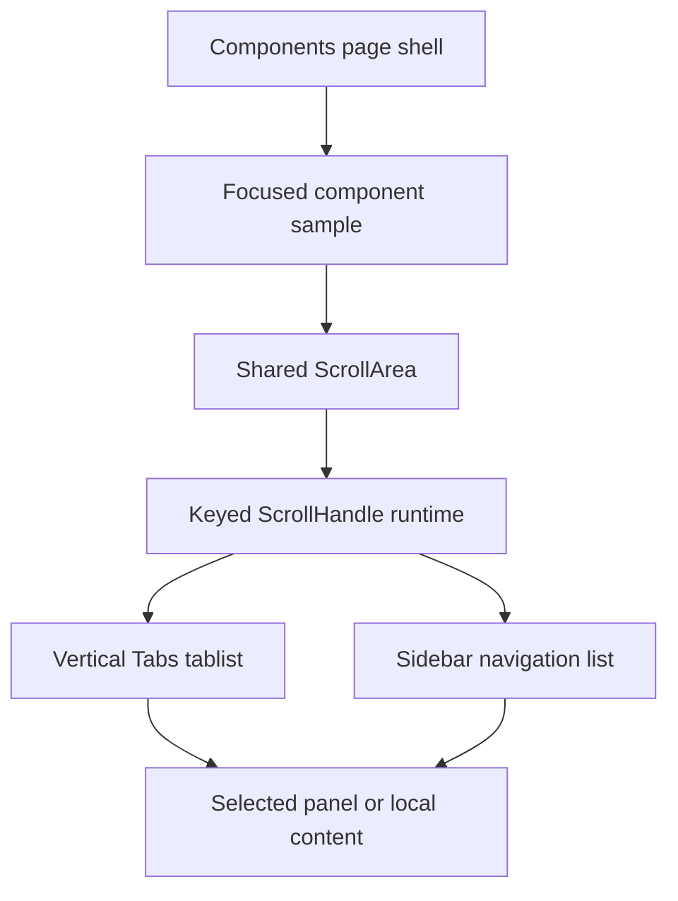

# Scroll surface local containment for ScrollArea, Tabs, and Sidebar

## Summary

Open GPUI already has a shared `ScrollArea` primitive, but some of the most visible scrollable
surfaces still behave like separate one-off layouts. The current gap is local scroll ownership: a
constrained vertical Tabs list or a long Sidebar should scroll inside its own viewport without
moving the outer Components page, and the scroll offset should reset only when the surface's own
identity changes.

This plan hardens the shared scroll primitive, routes the long Tabs and Sidebar surfaces through it
consistently, and proves the behavior in the gallery with nested-scroll smokes.

## Problem Frame

The library already models scroll intent in `ScrollAreaState`, and `ScrollArea` already owns a
keyed runtime handle. The missing part is consistency at the component surfaces that use or should
use that primitive. Vertical Tabs currently rely on ad hoc overflow handling, and the long Sidebar
surface needs the same containment discipline as the other nested scroll examples.

The user-facing failure mode is simple: inner wheel input can leak to the page shell, and a long
vertical surface can feel non-scrollable even when its content clearly exceeds the viewport. That is
not a selection bug. It is a viewport-ownership bug.

## Requirements

- R1. `ScrollAreaState` remains the renderer-neutral local viewport contract, with stable viewport
  identity, axis metadata, reset policy, and keyed runtime handle ownership in the adapter.
- R2. Wheel input inside a local scroll surface stays inside that surface when the content exceeds
  the viewport, and the outer Components page does not move.
- R3. Vertical Tabs use the shared scroll surface for overflow instead of ad hoc overflow handling,
  while preserving roving focus, selected tab state, and tabpanel linkage.
- R4. Vertical Tabs keep their selected panel stable while the tablist scrolls, and family or page
  changes reset the page viewport without corrupting the tablist's own scroll offset.
- R5. Sidebar keeps using the shared scroll surface for long navigation lists, while preserving
  icon-collapse, offcanvas, disabled-item, and selection semantics.
- R6. Long Sidebar samples continue to expose local scrollability in the gallery without leaking
  wheel input to the outer Components page.
- R7. The Components gallery keeps focused, inspectable samples and runtime smokes for the shared
  scroll surface, vertical Tabs, and long Sidebar.
- R8. Docs, verification, and engineering memory record the new scroll-surface contract and the
  remaining deferred follow-ups.

## Key Technical Decisions

- **Use one shared local scroll primitive.** Local viewport ownership, scrollbar metrics, and
  reset policy should stay consistent across consumer surfaces.
- **Keep scroll state adapter-owned.** The core contract should stay pure; keyed handles and wheel
  ownership remain GPUI runtime concerns.
- **Prefer consumer migration over new overflow abstractions.** Tabs and Sidebar already need local
  scroll behavior, so wiring them to the same primitive is clearer than introducing another scroll
  system.
- **Keep page reset and inner scroll reset separate.** Switching family or jumping around the
  Components page should not automatically wipe a surface's local offset unless that surface's own
  reset key changes.
- **Defer overflow menus and sticky chrome.** Tab overflow menus, sticky tabstrip behavior, and
  sidebar route persistence are useful follow-ups, but they should not blur this containment slice.

## High-Level Technical Design

The design keeps one scroll primitive in the middle and lets the consumer surface decide what
content belongs inside it. The adapter still owns the handle and reset behavior; the component
surface only decides which content should be locally scrollable.

## Implementation Units

### U1. Harden `ScrollArea` as the canonical local viewport primitive

**Goal:** Make the shared scroll primitive the stable source of local viewport ownership.

**Requirements:** R1, R2

**Files:**

- Modify `crates/ui_components/src/scroll_area.rs`
- Modify `crates/ui_components/tests/components.rs`
- Modify `docs/ui/component-contract.md`

**Approach:** Keep the current keyed runtime handle model, keep the adapter-owned reset semantics,
and tighten the contract so local wheel input remains local when a surface nests inside the page
shell. The core state should still describe intent only; it should not gain GPUI runtime types or
callback ownership.

**Test scenarios:**

- A reconstructed `ScrollArea` value keeps its default keyed scroll handle stable.
- Changing the reset key resets the local viewport only when the key actually changes.
- Horizontal and two-axis scrolling still work with the same local ownership model.
- A nested scroll surface consumes wheel input without moving the outer page.

**Verification:** Focused `cargo nextest run -p open-gpui-ui-components` checks around the
`scroll_area_*` contract keep passing.

### U2. Route vertical Tabs overflow through the shared scroll surface

**Goal:** Make constrained vertical Tabs scroll locally without changing tab semantics.

**Requirements:** R3, R4

**Files:**

- Modify `crates/ui_components/src/tabs.rs`
- Modify `crates/ui_components/tests/components.rs`
- Modify `examples/ui-foundation-gallery/src/pages/components/render.rs`
- Modify `examples/ui-foundation-gallery/tests/foundation_gallery.rs`

**Approach:** Render the vertical tablist through the shared local viewport instead of relying on ad
hoc overflow handling. Keep roving focus, selection, and `Role::TabList` / `Role::Tab` behavior
unchanged, and keep the selected panel separate from the scrolling tab strip.

**Test scenarios:**

- A long vertical tablist scrolls inside its own viewport when constrained.
- Keyboard navigation still moves focus and selection correctly.
- The selected panel remains stable while the tablist scrolls.
- Switching family or page context does not leak the tablist scroll to the outer page.

**Verification:** Focused component tests and the vertical-tabs gallery smoke keep proving local
scroll containment.

### U3. Tighten Sidebar long-navigation scrolling around the same primitive

**Goal:** Keep long Sidebar navigation local, stable, and inspectable.

**Requirements:** R5, R6

**Files:**

- Modify `crates/ui_components/src/sidebar.rs`
- Modify `crates/ui_components/tests/components.rs`
- Modify `examples/ui-foundation-gallery/src/pages/components/render.rs`
- Modify `examples/ui-foundation-gallery/tests/foundation_gallery.rs`

**Approach:** Keep Sidebar backed by the shared scroll primitive, preserve icon-collapsed,
offcanvas, and disabled-item behavior, and make sure long navigation surfaces keep their wheel
input inside the sidebar viewport.

**Test scenarios:**

- A long sidebar scrolls locally instead of moving the outer Components page.
- Icon-collapsed and offcanvas modes keep the right reachable item set.
- Disabled items still stay skipped by roving focus and activation.
- The sidebar sample remains inspectable in focused gallery mode.

**Verification:** Focused component tests and the long-sidebar gallery smoke continue to pass.

### U4. Update gallery proofs, docs, and memory

**Goal:** Record the new scroll-surface contract and the remaining follow-ups.

**Requirements:** R7, R8

**Files:**

- Modify `docs/ui/component-contract.md`
- Modify `docs/verification.md`
- Modify `docs/knowledge/engineering/current-state.md`
- Modify `docs/knowledge/engineering/log.md`

**Approach:** Document `ScrollArea` as the shared local-scroll primitive, note that vertical Tabs and
Sidebar are supported consumer surfaces, and keep the gallery contract focused on inspectable local
scroll proofs. Leave tab overflow menus, sticky tabstrip behavior, and sidebar route persistence as
later work.

**Verification:**

- `cargo fmt -p open-gpui-ui-components -p open-gpui-ui-foundation-gallery`
- `cargo nextest run -p open-gpui-ui-components scroll_area_default_handle_survives_reconstructed_component_values scroll_area_reset_key_resets_default_runtime_handle scroll_area_runtime_scrolls_horizontal_and_two_axis_content tabs_vertical_tablist_scrolls_when_constrained`
- `cargo nextest run -p open-gpui-ui-components sidebar`
- `cargo nextest run -p open-gpui-ui-foundation-gallery components_gallery_smoke_vertical_tabs_scroll_inside_sample components_gallery_smoke_sidebar_long_navigation_scrolls_inside_sample components_gallery_smoke_scroll_area_samples_scroll_inside_page`
- `git diff --check`
- `python $HOME\.codex\skills\engineering-wiki-memory\scripts\wiki_memory.py validate --root docs\knowledge\engineering`

## Acceptance Examples

- AE1. Given a vertically constrained tab list, wheel input scrolls the tab strip locally and the
  outer Components page stays fixed.
- AE2. Given a long sidebar, wheel input scrolls the sidebar locally and disabled items still stay
  skipped.
- AE3. Given a `ScrollArea` with a changed reset key, the local viewport resets without affecting
  sibling samples.
- AE4. Given a family switch in the Components page, the page viewport resets while each inner
  local scroll surface keeps its own ownership rules.

## Scope Boundaries

### Deferred for later

- Tab overflow menus and sticky tabstrip behavior.
- Global nested-scroll arbitration across unrelated overlays.
- Sidebar route persistence, command registry integration, and mobile shell orchestration.
- Auto-hiding scrollbar chrome and custom scrollbar anatomy.

### Outside this plan

- New navigation primitives.
- Changes to Tabs or Sidebar selection semantics.
- Rewriting row-model, overlay, or table scroll behavior.

## Risks & Dependencies

- Rewrapping consumer surfaces can change focus order or `aria` relationships if the hierarchy is
  adjusted carelessly.
- Wheel containment can appear correct in one sample while still leaking on compact windows, so the
  gallery smokes need to use the real nested viewport.
- Reset keys can become too broad and over-reset the local viewport if the identity is coarse.
- The plan depends on the current `ScrollArea` keyed runtime model remaining stable.

## Sources / Research

- `docs/knowledge/engineering/decisions/open-gpui-ui-component-depth-roadmap.md`
- `docs/ui/component-contract.md`
- `crates/ui_components/src/scroll_area.rs`
- `crates/ui_components/src/tabs.rs`
- `crates/ui_components/src/sidebar.rs`
- `examples/ui-foundation-gallery/tests/foundation_gallery.rs`
- `repo-ref/fret/ecosystem/fret-ui-kit/src/primitives/scroll_area.rs`
- `repo-ref/fret/ecosystem/fret-ui-kit/src/primitives/tabs.rs`
- `repo-ref/fret/ecosystem/fret-ui-headless/src/tab_strip_overflow.rs`
- `repo-ref/fret/ecosystem/fret-ui-kit/src/declarative/scroll.rs`
