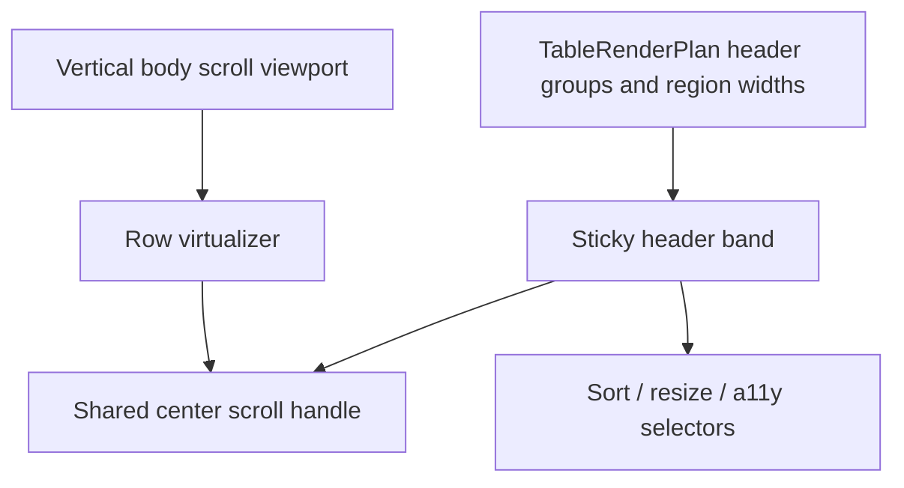

# Open GPUI Table Sticky Headers Plan

## Summary

The Table stack already resolves header groups, pinned left/center/right regions, and one-axis row
virtualization. The remaining maturity gap is sticky headers: the header family should stay
attached to the visible table viewport while the body scrolls, without changing row-model
resolution or the existing pinned-column behavior.

This plan keeps center-lane synchronization, resize, sort, and selection contracts intact. It adds
a sticky header topology in the adapter, proves it in the Components gallery, and updates the
contract and engineering memory so sticky headers stop being deferred.

---

## Problem Frame

Tables with long bodies are easy to inspect only if the header stays visible while rows move. The
current adapter already knows how to compute header rows, pinned region widths, and center-window
geometry, but it still treats the header family as a normal static band. That leaves a visible gap
in long samples and nested scroll surfaces, where the reader has to jump back to the top to recover
column meaning.

---

## Requirements

- R1. Render the entire header family as one sticky band attached to the table viewport while the
  body scrolls vertically.
- R2. Preserve nested header row order, placeholder alignment, and header height resolution inside
  that band.
- R3. Keep left/center/right regions aligned under the same sticky header band and the existing
  shared center scroll source.
- R4. Sort activation, resize handles, aria row/column metadata, and debug selectors continue to
  work from sticky header cells.
- R5. Tables that do not need sticky treatment keep the current fast path and do not pay for extra
  layout wrappers.
- R6. Add a focused gallery proof that scrolls a long Table sample vertically and shows the header
  stays visible while the outer Components page remains fixed.
- R7. Update contract, verification, and engineering memory so sticky headers move out of the
  deferred list, while two-axis grid virtualization, standalone headless extraction, and unrelated
  Table maturity slices remain deferred.

---

## Key Technical Decisions

- **Keep sticky behavior adapter-owned.** `ui_core` keeps the header model; viewport bounds,
  sticky offsets, and scroll interactions stay in `ui_components`.
- **Stick the whole header family, not individual cells.** Nested headers need one band so depth
  and placeholder alignment stay coherent.
- **Reuse the existing horizontal center scroll source.** Sticky headers must not introduce a
  second center-sync path.
- **Keep vertical row virtualization unchanged.** The slice adjusts header placement, not row-model
  resolution or row window math.
- **Preserve a no-sticky fast path.** Tables that do not overflow vertically should not have to
  pay for extra stickiness wrappers.

---

## High-Level Technical Design

The adapter should render the header family in a sticky band that is anchored to the table
viewport, while the body keeps using the existing vertical scroll and row virtualizer. The current
header-group and column-region plans already carry enough geometry to keep the sticky band aligned
with pinned lanes and the horizontal center window.

---

## Implementation Units

### U1. Add sticky-header planning metadata to the Table adapter

- **Goal:** Decide when sticky headers apply and compute the sticky band geometry from the current
  render plan.
- **Files:**
  - Modify `crates/ui_components/src/table.rs`
  - Modify `crates/ui_components/tests/components.rs`
- **Approach:** Derive sticky mode from the existing render plan, header row count, and viewport
  metrics. Keep the logic adapter-owned and preserve the current row-model contract.
- **Patterns to follow:** `TableHeaderGroupRegionsRenderPlan`, `TableRenderPlan::header_row_count`,
  TanStack's virtualization guide for sticky header layout, and Fret's split-scroll table
  discipline.
- **Test scenarios:**
  - Flat tables remain on the current path.
  - Nested header rows compute the correct sticky band height.
  - Pinned region widths and header selectors remain unchanged.
  - Sticky metadata does not leak into core state.
- **Verification:** Component render-plan tests cover the new sticky metadata.

### U2. Render the sticky header band and preserve interactions across scroll

- **Goal:** Keep header families visible while body rows move underneath them.
- **Files:**
  - Modify `crates/ui_components/src/table.rs`
  - Modify `crates/ui_components/src/scroll_area.rs` if the current surface plumbing needs a small
    adapter hook
  - Modify `crates/ui_components/tests/components.rs`
- **Approach:** Render the header rows in a sticky container or anchored band above the body scroll
  viewport, keep the shared center horizontal scroll source, and leave the body row virtualizer
  unchanged.
- **Patterns to follow:** Existing `render_table_header` / `render_table_body` split, the shared
  center scroll source in `crates/ui_components/src/table.rs`, and Fret's scroll-carrier layout in
  `repo-ref/fret/ecosystem/fret-ui-kit/src/imui/table_controls/render/plan.rs`.
- **Test scenarios:**
  - Body vertical scroll leaves the header visible.
  - Horizontal center scroll stays synced between header and body.
  - Sort activation still fires from sticky headers.
  - Resize handles still emit controlled sizing changes.
  - Nested header rows keep their depth order and placeholder alignment.
- **Verification:** Runtime component tests prove sticky containment and interaction parity.

### U3. Add focused gallery proof

- **Goal:** Prove sticky headers in a long Table sample and preserve outer page containment.
- **Files:**
  - Modify `examples/ui-foundation-gallery/src/pages/components.rs`
  - Modify `examples/ui-foundation-gallery/src/pages/components/render.rs`
  - Modify `examples/ui-foundation-gallery/tests/foundation_gallery.rs`
- **Approach:** Strengthen `release-matrix` or `release-queue` with a tall sticky-header sample and
  a readout for header-band height and sticky state. Add a smoke that scrolls vertically inside the
  table sample and asserts the header remains visible while the Components page stays fixed.
- **Test scenarios:**
  - Focused Table mode renders the sticky sample.
  - Vertical scroll changes body rows but not the header band.
  - Pinned lanes and nested headers stay aligned.
  - Outer page bounds remain stable.
- **Verification:** Add a focused gallery smoke for sticky containment.

### U4. Update contract, verification, and engineering memory

- **Goal:** Record the new boundary and keep the next Table follow-up explicit.
- **Files:**
  - Modify `docs/ui/component-contract.md`
  - Modify `docs/verification.md`
  - Modify `docs/knowledge/engineering/current-state.md`
  - Modify `docs/knowledge/engineering/log.md`
- **Approach:** Mark sticky headers as supported, keep two-axis grid virtualization and standalone
  headless extraction deferred, and record the gallery proof in the memory trail.
- **Verification:**
  - `cargo fmt -p open-gpui-ui-components -p open-gpui-ui-foundation-gallery`
  - `cargo nextest run -p open-gpui-ui-components table`
  - `cargo nextest run -p open-gpui-ui-foundation-gallery table`
  - `cargo nextest run -p open-gpui-ui-components`
  - `cargo nextest run -p open-gpui-ui-foundation-gallery`
  - `git diff --check`
  - `python $HOME\.codex\skills\engineering-wiki-memory\scripts\wiki_memory.py validate --root docs\knowledge\engineering`

---

## Acceptance Examples

- AE1. Given a long table sample, vertical scrolling keeps the header band visible while body rows
  move underneath it.
- AE2. Given nested headers, the full header family sticks as one band and keeps row depth order.
- AE3. Given pinned left/right columns plus a horizontally scrollable center lane, sticky headers
  remain aligned after center scroll.
- AE4. Given the sticky gallery smoke runs, the outer Components page stays fixed.

---

## Scope Boundaries

### Active Scope

- Sticky header band for Table.
- Existing pinned regions and center scroll sync.
- Gallery proof and contract / memory updates.

### Deferred for later

- Two-axis grid virtualization.
- Standalone headless extraction.
- Column drag reorder.
- Dataset-wide exact autosizing.
- Data-source orchestration and global faceting.

### Outside this plan

- Row-model ordering changes.
- Pinned-region semantics changes.
- Editing, filtering, and selection behavior changes.

---

## Risks & Dependencies

| Risk | Impact | Mitigation |
| --- | --- | --- |
| Sticky band clips or loses pointer hit-testing inside nested scroll surfaces | Sort and resize become unreliable | Keep the body virtualizer unchanged and add runtime smokes around scroll, sort, and resize |
| Header and body drift under center-lane horizontal scroll | Column labels no longer line up with cells | Reuse one shared center scroll handle and verify after scroll offsets |
| Nested header heights are miscomputed | Overlap or dead space appears between header rows | Derive band height from resolved header row count instead of manual constants |
| Gallery proof only covers one scroll path | Page containment regressions slip through | Use a smoke that exercises vertical scroll in focused mode and asserts outer bounds remain stable |

---

## Sources / Research

- `docs/plans/2026-06-23-003-feat-ui-table-sticky-pinned-columns-plan.md`
- `docs/plans/2026-06-23-004-feat-ui-table-column-virtualization-plan.md`
- `docs/plans/2026-06-24-010-feat-ui-table-column-groups-nested-headers-plan.md`
- `docs/knowledge/engineering/decisions/open-gpui-ui-component-depth-roadmap.md`
- `docs/ui/component-contract.md`
- `docs/verification.md`
- `crates/ui_components/src/table.rs`
- `crates/ui_components/src/scroll_area.rs`
- `crates/ui_components/tests/components.rs`
- `examples/ui-foundation-gallery/src/pages/components.rs`
- `examples/ui-foundation-gallery/tests/foundation_gallery.rs`
- `repo-ref/tanstack-table/docs/framework/react/guide/virtualization.md`
- `repo-ref/tanstack-table/docs/framework/react/guide/column-pinning.md`
- `repo-ref/tanstack-table/packages/table-core/skills/column-layout/references/subsystems.md`
- `repo-ref/fret/ecosystem/fret-ui-kit/src/imui/table_controls/render/plan.rs`
- `repo-ref/fret/ecosystem/fret-ui-kit/src/imui/table_controls/row_groups/scroll.rs`
