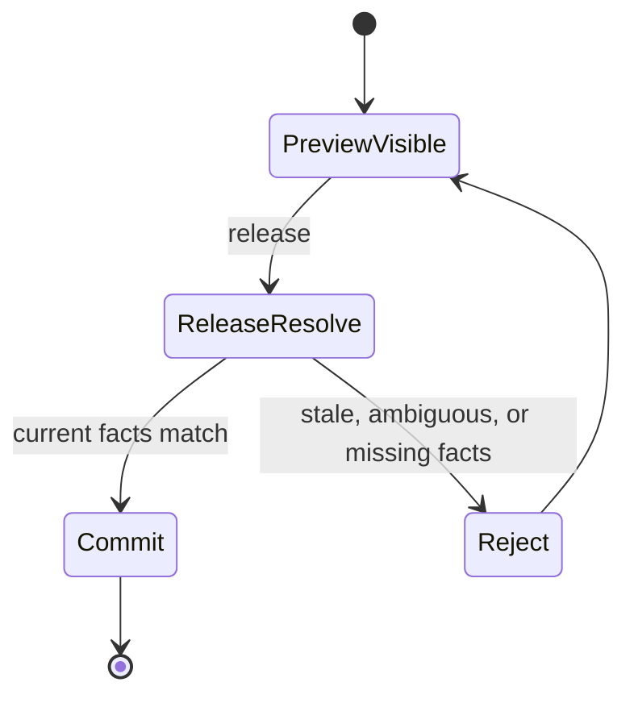
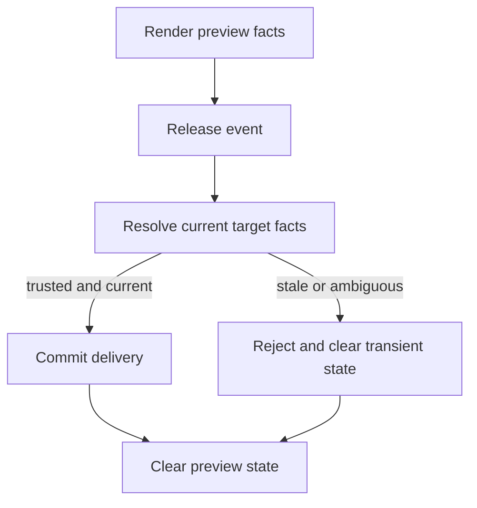

# refactor: Break docking viewport authority

## Goal Capsule

- Objective: replace the current routed-preview replay model with a current-facts-only delivery model.
- Authority hierarchy: current host-scene and runtime route facts outrank any preview-state cache; render may publish preview facts but may not mint durable release authority.
- Stop conditions: a source-only or known-viewport release either commits from current facts or fails closed; no stale accepted token, replay ladder, or hidden fallback remains in production.
- Execution profile: break/refactor on a dedicated branch; characterization first, then deletion of obsolete paths.
- Tail ownership: `crates/gpui_docking` runtime, render, delivery, example, and verification surfaces.

## Product Contract

### Summary

The docking viewport path should behave like a one-pass current-facts delivery system.
Preview can still render a target, but preview must not become durable authority for a later release.
If the current scene, target key, or hover facts are stale or ambiguous at release time, the release fails closed instead of reusing a remembered acceptance state.

### Problem Frame

The current implementation split authority across `viewport_routed_preview.rs`, `render.rs`, and `viewport_runtime.rs`.
`DockViewportAcceptedRoutedPreview` stores a target across frames.
`finish_routed_drop_acceptance_pass` lets render-side code mint that authority.
`resolve_accepted_routed_preview_resolution` and related fallback checks then replay the stored decision when release time arrives.

That is stronger than Dear ImGui's immediate `AcceptBeforeDelivery` gate and materially different from the branch semantics we want.
ImGui peeks and accepts in the same frame; this code path turns acceptance into a cached authorization token that survives scene refresh and release replay.
The rewrite should delete that mismatch rather than layering more guards on top of it.

### Requirements

- R1. Release-time drop delivery must be resolved from current facts only.
- R2. No production code may persist an accepted routed preview as a cross-frame authorization token.
- R3. Render code may publish preview facts, but it may not create durable release authority.
- R4. Replay helpers, replay ladders, and acceptance-pass fallback branches that exist only to preserve the old contract must be removed.
- R5. Tear-off remains an explicit delivery outcome, but it cannot inherit stale acceptance from a prior preview.
- R6. Tests, example output, and verification notes must be rewritten to assert fail-closed behavior.
- R7. Deleted helper names and dead exports should not be preserved behind compatibility wrappers.
- R8. Graph and layout semantics outside this seam remain unchanged unless a file is touched only to remove dead authority plumbing.

### Scope Boundaries

- In scope: `crates/gpui_docking/src/viewport_routed_preview.rs`, `crates/gpui_docking/src/render.rs`, `crates/gpui_docking/src/viewport_runtime.rs`, `crates/gpui_docking/src/viewport_runtime_handle.rs`, `crates/gpui_docking/src/viewport_drop_delivery.rs`, `crates/gpui_docking/src/viewport_drop_route.rs`, `crates/gpui_docking/src/viewport_target_resolver.rs`, `crates/gpui_docking/src/viewport_target_context.rs`, `crates/gpui_docking/src/viewport_platform_signals.rs`, `crates/gpui_docking/src/drop_runtime.rs`, `crates/gpui_docking/src/interaction.rs`, `crates/gpui_docking/src/host_viewport_runtime_tests.rs`, `crates/gpui_docking/src/host_viewport_runtime_handle_tests.rs`, `crates/gpui_docking/src/host_interaction_tests.rs`, `crates/gpui_docking/src/host_viewport_matrix_tests.rs`, `examples/docking-native/src/main.rs`, and `docs/verification.md`.
- Deferred: graph mutation policy, tab identity migration, panel registry refactors, and broader platform viewport features that do not participate in the replay bug.
- Out of scope: preserving old acceptance/replay behavior, keeping compatibility shims for removed helpers, or treating the current contract as stable API.

### Acceptance Examples

- AE1. Given a routed preview that was accepted in a prior frame, when the target scene refreshes before release, then the release rejects instead of replaying the accepted token.
- AE2. Given a source-only release with no trustworthy current hover signal, when the user releases over a stale or ambiguous window, then the release fails closed and the graph does not mutate.
- AE3. Given a target whose current key or scene generation no longer matches the preview, when release runs, then the target is treated as obsolete rather than silently re-resolved.
- AE4. Given a tear-off candidate, when no current-facts delivery path exists, then it remains a tear-off or rejection outcome and does not borrow stale acceptance state.

### Dependencies

- `docs/adr/0002-docking-gpui-integration.md` for the ownership boundary that keeps docking inside retained GPUI windows.
- `repo-ref/imgui/imgui.cpp` for the immediate-mode `AcceptDragDropPayload` and docking preview semantics this rewrite is comparing against.
- `crates/gpui_docking/src/viewport_runtime.rs` and `crates/gpui_docking/src/viewport_routed_preview.rs` for the current replay-oriented implementation to be replaced.
- `crates/gpui_docking/src/host_viewport_runtime_tests.rs` and `crates/gpui_docking/src/host_interaction_tests.rs` for the current regression surface that needs to be rewritten.

### Outstanding Questions

None blocking.
The user has explicitly authorized a breaking refactor and deletion of unnecessary code.

### Sources

- `repo-ref/imgui/imgui.cpp`
- `repo-ref/imgui/docs/TODO.txt`
- `crates/gpui_docking/src/viewport_routed_preview.rs`
- `crates/gpui_docking/src/viewport_runtime.rs`
- `crates/gpui_docking/src/viewport_drop_delivery.rs`
- `crates/gpui_docking/src/host_viewport_runtime_tests.rs`
- `crates/gpui_docking/src/host_viewport_runtime_handle_tests.rs`
- `crates/gpui_docking/src/host_interaction_tests.rs`
- `crates/gpui_docking/src/host_viewport_matrix_tests.rs`

## Planning Contract

### Key Technical Decisions

- KTD1. Accepted-preview replay is not a product feature for this seam and should be removed rather than preserved behind a guard.
- KTD2. Release-time validation is current-facts-only; if the runtime cannot prove the target is current, the release fails closed.
- KTD3. Render publishes preview state, not authorization.
- KTD4. Deletion is preferred over adapters once replacement coverage exists.
- KTD5. This work should land on a dedicated break branch so the rewrite does not need to pretend the old contract remains supported.

### Assumptions

- No downstream code relies on the internal accepted-preview helper names as a stable API.
- The product preference is current-facts correctness over preserving stale-preview convenience.
- Tear-off can remain a separate explicit outcome even after the replay path is removed.

### Sequencing

1. Lock the desired no-replay contract with characterization tests.
2. Remove the persistent accepted-preview token and render-time acceptance pass.
3. Collapse release-time delivery to current-facts validation only.
4. Prune obsolete replay plumbing and state bookkeeping.
5. Rewrite the native example, verification notes, and legacy tests around fail-closed behavior.
6. Delete dead exports and helper names once no production path needs them.

### High-Level Technical Design

## Implementation Units

### U1. Characterize the no-replay contract

- **Goal:** pin the break target with tests before deleting the old model.
- **Requirements:** R1, R2, R3, R4, R5, R6.
- **Dependencies:** None.
- **Files:** `crates/gpui_docking/src/host_viewport_runtime_tests.rs`, `crates/gpui_docking/src/host_viewport_runtime_handle_tests.rs`, `crates/gpui_docking/src/host_interaction_tests.rs`, `crates/gpui_docking/src/host_viewport_matrix_tests.rs`, `crates/gpui_docking/src/viewport_runtime.rs`, `crates/gpui_docking/src/viewport_routed_preview.rs`, `crates/gpui_docking/src/drop_runtime.rs`.
- **Approach:** add characterization coverage for stale accepted-preview replay, release-time fail-closed behavior, source-only release authority, and tear-off separation. Start from the current failure mode and capture the new contract before the implementation changes land.
- **Execution note:** this unit should initially expose the buggy replay model so the later deletion is measurable.
- **Patterns to follow:** the existing source-only release matrix, runtime handle regression tests, and ImGui's current-frame `AcceptBeforeDelivery` behavior in `repo-ref/imgui/imgui.cpp`.
- **Test scenarios:** release after scene refresh does not reuse prior acceptance; known-empty hover does not borrow an old target; target key mismatch rejects; stale preview is not silently re-resolved; ambiguous hover fails closed.
- **Verification:** the new tests describe the desired break behavior, even if they fail before the rewrite starts.

### U2. Remove persistent accepted-preview state

- **Goal:** delete the cross-frame acceptance token and render-time acceptance pass.
- **Requirements:** R1, R2, R3, R7.
- **Dependencies:** U1.
- **Files:** `crates/gpui_docking/src/viewport_routed_preview.rs`, `crates/gpui_docking/src/render.rs`, `crates/gpui_docking/src/host_viewport_drop.rs`, `crates/gpui_docking/src/viewport_runtime.rs`, `crates/gpui_docking/src/viewport_runtime_handle.rs`, `crates/gpui_docking/src/lib.rs`.
- **Approach:** remove `DockViewportAcceptedRoutedPreview`, `finish_acceptance_pass`, `accepted_for_drag_session`, `is_currently_accepted`, and any render-side call that keeps that token alive. Preview publication remains, but it only carries observation data; it no longer authorizes later release.
- **Test scenarios:** render no longer mutates acceptance state; replacing a preview clears only transient preview state; no production path can revive a prior accepted token; target mismatch is not rescued by cached acceptance.
- **Verification:** search-based review should find no production reference to a persistent accepted-preview token after the unit lands.

### U3. Collapse release-time delivery to current facts

- **Goal:** make release resolution current-facts-only and remove the replay ladder.
- **Requirements:** R1, R4, R5.
- **Dependencies:** U1, U2.
- **Files:** `crates/gpui_docking/src/viewport_runtime.rs`, `crates/gpui_docking/src/viewport_runtime_handle.rs`, `crates/gpui_docking/src/viewport_drop_delivery.rs`, `crates/gpui_docking/src/viewport_drop_route.rs`, `crates/gpui_docking/src/viewport_target_resolver.rs`, `crates/gpui_docking/src/viewport_target_context.rs`, `crates/gpui_docking/src/viewport_platform_signals.rs`.
- **Approach:** delete `resolve_accepted_routed_preview_resolution`, `resolve_accepted_routed_preview_route`, `can_replay_accepted_routed_preview`, and the delivery-permit branches that exist only to replay a previous preview. Keep tear-off explicit, but make it a separate outcome that is also validated from current facts.
- **Test scenarios:** source-only release after a generation change fails closed; live hover-none does not replay a stale preview; unavailable hover does not promote an old target; replay-only branches disappear from the current release path; tear-off still resolves as an explicit outcome.
- **Verification:** release-time resolution never consults a saved acceptance token or a previous frame's preview state.

### U4. Prune obsolete replay plumbing and state bookkeeping

- **Goal:** remove helper state that exists only to keep the old contract alive.
- **Requirements:** R2, R4, R7, R8.
- **Dependencies:** U2, U3.
- **Files:** `crates/gpui_docking/src/drop_runtime.rs`, `crates/gpui_docking/src/interaction.rs`, `crates/gpui_docking/src/host_render_actions.rs`, `crates/gpui_docking/src/host_viewport_runtime_tests.rs`, `crates/gpui_docking/src/host_viewport_runtime_handle_tests.rs`, `crates/gpui_docking/src/host_interaction_tests.rs`, `crates/gpui_docking/src/host_viewport_matrix_tests.rs`.
- **Approach:** strip cached route-delivery reuse, acceptance-active bookkeeping, and any helper surface that only exists to simulate the old replay ladder. Keep the minimum state needed for drag-session identity and current route publication, and remove the rest instead of wrapping it.
- **Test scenarios:** source-only release cannot consume cached local or cross-window delivery; drag-session changes invalidate prior route state; the stale replay tests are rewritten as fail-closed tests; a release with no current target does not borrow a previous route.
- **Verification:** no production path should still depend on a state branch that exists only to represent "accepted but not delivered yet" across frames.

### U5. Rewrite dogfood and verification around fail-closed semantics

- **Goal:** make the example, tests, and docs describe the new current-facts model.
- **Requirements:** R1, R5, R6.
- **Dependencies:** U2, U3, U4.
- **Files:** `examples/docking-native/src/main.rs`, `docs/verification.md`, `crates/gpui_docking/src/host_viewport_runtime_tests.rs`, `crates/gpui_docking/src/host_viewport_runtime_handle_tests.rs`, `crates/gpui_docking/src/host_interaction_tests.rs`, `crates/gpui_docking/src/host_viewport_matrix_tests.rs`.
- **Approach:** update the native example to describe the current-facts delivery model and to stop narrating replay as a supported behavior. Rewrite or delete tests that encode the old acceptance cache, then replace them with explicit stale-preview, ambiguous-hover, and target-mismatch failures.
- **Test scenarios:** the native example still compiles; the example no longer teaches replay semantics; matrix tests cover current-facts success and fail-closed rejection; stale-preview regression tests no longer assert replay.
- **Verification:** the example and docs should not describe the removed replay behavior as supported.

### U6. Delete dead exports and obsolete names

- **Goal:** remove symbols that only existed to support the old authority model.
- **Requirements:** R4, R7, R8.
- **Dependencies:** U2, U3, U4, U5.
- **Files:** `crates/gpui_docking/src/lib.rs`, `crates/gpui_docking/src/viewport_routed_preview.rs`, `crates/gpui_docking/src/viewport_drop_delivery.rs`, `crates/gpui_docking/src/viewport_runtime.rs`, `crates/gpui_docking/src/viewport_runtime_handle.rs`.
- **Approach:** remove public(crate) exports, helper aliases, and stale names that exist only to keep the replay model buildable. If a symbol is only there for compatibility with the removed contract, delete it rather than keeping a shim.
- **Test scenarios:** production search no longer finds replay-only helpers in use; the crate still compiles against the new no-replay path; remaining test-only references are intentional and local.
- **Verification:** the codebase should not advertise the deleted contract through exports, helper names, or dead branches.

## Verification Contract

| Gate | Command | What it proves |
| --- | --- | --- |
| Formatting | `cargo fmt -p open-gpui-docking --check` | the break stays mechanically clean. |
| Docking crate tests | `cargo nextest run -p open-gpui-docking` | the no-replay contract, current-facts delivery, and deletion rewrites hold together. |
| Native example compile | `cargo check -p open-gpui-docking-native` | the example still builds against the broken-in contract surface. |
| Manual dogfood | `cargo run -p open-gpui-docking-native` | the current-facts behavior is visible in the native smoke surface. |

## Definition of Done

- No production code persists or replays an accepted routed preview token.
- Release-time routing either commits from current facts or fails closed.
- Replay-only helpers, fallback ladders, and obsolete exports are deleted.
- The native example and verification notes describe the current-facts model, not the old replay model.
- `cargo fmt -p open-gpui-docking --check` and `cargo nextest run -p open-gpui-docking` pass.
- `cargo check -p open-gpui-docking-native` passes.

