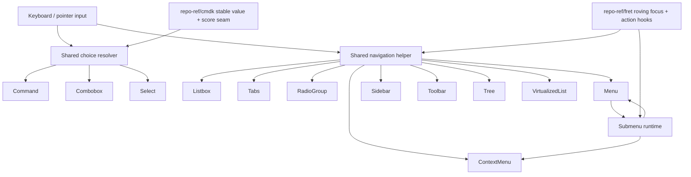

# Open GPUI Choice Surface Refactor - Plan

## Goal Capsule

- Objective: deepen the choice surfaces and menu runtime so Open GPUI reads more like a reusable UI framework and less like a set of shallow wrappers.
- Authority: user request first, then this plan, then ADR 0008 and the component contract and verification docs, then the reference repos.
- Execution profile: code.
- Stop conditions: stable-value command choice, shared navigation helper, isolated submenu runtime, gallery proofs, and contract docs are all in place.
- Tail ownership: execution can continue in `ce-work` or by hand without carrying progress in the document.

---

## Product Contract

### Summary

Open GPUI already has a broad component catalog, but the deepest choice surfaces still carry too much local logic.
The highest-leverage refactor is to deepen command choice, roving-focus navigation, and submenu runtime around a smaller set of shared seams.
`repo-ref/cmdk` is the main reference for stable-value selection and deterministic ranking.
`repo-ref/fret` is the main reference for roving focus, action-hook ownership, and submenu policy vocabulary.
The result should stay inside the current `open-gpui-ui-components` product boundary.

### Problem Frame

`crates/ui_components/src/command.rs` currently holds ranking, query ownership, snapshot modes, selection projection, dialog wrapping, and list rendering concerns in one place.
`crates/ui_components/src/combobox.rs` and `crates/ui_components/src/select.rs` repeat enough of that choice plumbing to make the shared shape obvious but still unextracted.
`crates/ui_components/src/roving_focus.rs` already proves that traversal can be shared, but several consumers still own their own navigation edge cases.
`Tabs` and `RadioGroup` already reuse the same helper, which makes the remaining duplication feel like a seam that still needs to be deepened.
`crates/ui_components/src/menu.rs` mixes submenu hover timing, safe-hover state, scroll-handle ownership, and render assembly.
That breadth works, but it leaves too much depth on the table for a component library that is supposed to be reusable across products.

### Requirements

- R1. `Command` should treat stable values as the identity seam for active and selected item state, not transient row indices.
- R2. `Command` should keep deterministic query normalization and score ordering, while preserving app-owned snapshot modes, controlled and default query ownership, and multi-select chip behavior.
- R3. `Combobox` and `Select` should reuse the same stable choice projection rules where their query and selected-value behavior overlaps.
- R4. Listbox-like and roving-focus surfaces should share one enabled-item navigation helper for arrow keys, Home/End, and wrap behavior.
- R5. The shared navigation helper should feed `Listbox`, `Tabs`, `RadioGroup`, `Menu`, `ContextMenu`, `Sidebar`, `Toolbar`, `Tree`, and `VirtualizedList` without flattening their component-specific behavior.
- R6. `Menu` and `ContextMenu` should keep submenu hover timing, branch switching, and local scroll ownership inside adapter-local runtime state.
- R7. The public contract should stay renderer-neutral and the current `open-gpui-ui-components` product boundary should remain intact.
- R8. Gallery samples, component-state tests, docs, and engineering memory should cover the new seams and the regressions they replace.

---

## Planning Contract

### Key Technical Decisions

- **Keep the new seam in `ui_components`.** `ui_core` stays dependency-clean and renderer-neutral.
- **Use stable values and deterministic scores as the choice identity.** The `cmdk` reference is the leverage point here, but the Open GPUI adaptation should remain state-first rather than DOM-first.
- **Deepen `roving_focus.rs` instead of cloning traversal logic.** Component-specific wrappers remain thin, while the shared helper owns enabled-item traversal and orientation-aware movement.
- **Extract submenu runtime into a small internal helper.** Hover timers, trigger-bounds caches, and submenu scroll handles should not live in the render body.
- **Keep gallery proof and contract updates in the same slice.** The public catalog is part of the product surface, so it should move with the code.

### Sequencing

1. Extract the shared choice resolver for Command, Combobox, and Select.
2. Deepen the shared navigation helper and retarget the consumers that duplicate it.
3. Split Menu submenu runtime state away from render-time assembly.
4. Update gallery proofs, docs, verification, and memory around the new seams.

### Assumptions

- `CommandIndexSnapshot` remains the right app-owned seam for pre-ranked and pre-filtered snapshots.
- The current choice surfaces do not need a new crate or a headless extraction.
- The current gallery page remains the primary proof surface for the user-facing contracts.
- Submenu runtime can be isolated without changing the visible overlay contract.

---

## System-Wide Impact

This plan changes how several official components derive and expose their public resolved state.
That means the API inventory, gallery selectors, and targeted nextest filters all need to move together.
A bug in the shared seam will affect more than one widget family, so the implementation has to stay test-driven and keep the per-component smoke coverage explicit.
The upside is leverage: once the seam is right, Command, Combobox, Select, Menu, ContextMenu, Listbox, Sidebar, Toolbar, Tree, and VirtualizedList all get better locality from the same work.

## High-Level Technical Design

The choice resolver should own stable identity, normalized query handling, and ranking policy.
The navigation helper should own enabled-item traversal and orientation-aware key movement.
The menu runtime should own hover delays, branch path mutation, and submenu scroll-handle state.
The adapters should keep render-time layout and event wiring thin around those seams.

## Implementation Units

### U1. Shared choice resolver for Command, Combobox, and Select

- **Goal:** Extract the shared choice identity and filtering seam so the three primary choice surfaces stop reimplementing it locally.
- **Requirements:** R1, R2, R3
- **Files:**
  - Add `crates/ui_components/src/choice.rs`
  - Modify `crates/ui_components/src/command.rs`
  - Modify `crates/ui_components/src/combobox.rs`
  - Modify `crates/ui_components/src/select.rs`
  - Modify `crates/ui_components/src/lib.rs`
  - Modify `crates/ui_components/tests/components.rs`
- **Approach:** Move normalized query handling, stable-value projection, and reusable choice filtering helpers into the new internal module.
  Keep `Command` as the only surface that uses deterministic ranking and app-owned snapshot modes.
  Keep `Combobox` and `Select` as lighter wrappers that project the selected value through the shared seam without inheriting command-specific scoring behavior.
  Preserve existing public builder names and callback shapes unless a compatibility alias is required to keep the seam coherent.
- **Test Scenarios:**
  - Reordering command descriptors preserves the same selected and active value.
  - Controlled and default query ownership still resolve to the same runtime query behavior.
  - A filtered-out combobox selection stays selected even when the popup list hides it.
  - A select trigger still shows the resolved option after option reorder.
  - Multi-select command chips still toggle without duplicates and without stale dialog state.
- **Verification:** `cargo nextest run -p open-gpui-ui-components command_state_tracks_active_and_selected_by_value_after_reorder command_state_models_controlled_and_default_query_ownership command_state_models_multi_selected_values_and_hidden_chips command_index_snapshot_matches_equivalent_local_descriptors command_index_snapshot_revision_preserves_selection_by_value_after_reorder command_index_snapshot_modes_preserve_pre_ranked_and_pre_filtered_order command_render_plan_virtualizes_large_result_sets_with_stable_rows command_runtime_filters_input_and_selects_with_keyboard command_runtime_controlled_query_emits_sanitized_query_changes command_runtime_multi_select_toggles_chips_without_closing_dialog command_runtime_virtualized_results_scroll_inside_viewport_and_reveal_keyboard_targets combobox_state_filters_query_without_clearing_selection combobox_state_scrollable_content_tracks_filtered_option_count combobox_disabled_empty_state_blocks_popup_and_input combobox_runtime_filters_input_and_selects_filtered_option combobox_runtime_keyboard_selects_filtered_option select_state_records_popup_listbox_overlay_and_scroll_contract select_state_models_disabled_empty_and_policy_overrides select_runtime_click_and_keyboard_selection_close_popup_and_emit_payloads`
  plus the focused command, combobox, and select gallery smokes in `open-gpui-ui-foundation-gallery`.

### U2. Shared navigation helper for listbox-like surfaces

- **Goal:** Make enabled-item traversal and orientation-aware key movement consistent across the component families that already depend on roving focus.
- **Requirements:** R4, R5
- **Files:**
  - Modify `crates/ui_components/src/roving_focus.rs`
  - Modify `crates/ui_components/src/listbox.rs`
  - Modify `crates/ui_components/src/tabs.rs`
  - Modify `crates/ui_components/src/radio.rs`
  - Modify `crates/ui_components/src/menu.rs`
  - Modify `crates/ui_components/src/sidebar.rs`
  - Modify `crates/ui_components/src/toolbar.rs`
  - Modify `crates/ui_components/src/tree.rs`
  - Modify `crates/ui_components/src/virtualized_list.rs`
  - Modify `crates/ui_components/tests/components.rs`
- **Approach:** Deepen `roving_focus.rs` into the shared traversal nucleus rather than cloning target math per component.
  Keep thin wrappers for component-specific rules like tree expansion, virtualized row reveal, and menu submenu branching.
  Preserve the existing disabled-item skipping and wrap semantics that the current tests already rely on.
- **Test Scenarios:**
  - Disabled items are skipped consistently across listbox, menu, sidebar, toolbar, tree, and virtualized list.
  - Home/End and arrow keys still resolve the correct item for horizontal and vertical surfaces.
  - Tabs and RadioGroup still use the same stable selection and roving-focus rules after reorder.
  - Tree typeahead still targets visible rows only.
  - Virtualized list still reveals the active row after keyboard navigation.
  - Toolbar and sidebar still skip disabled and separator items when moving focus.
- **Verification:** `cargo nextest run -p open-gpui-ui-components listbox_state_resolves_grouped_options_navigation_and_typeahead listbox_runtime_click_and_keyboard_selection_skip_disabled_items tabs_navigation_helpers_skip_disabled_tabs tabs_state_resolution_tracks_selected_focus_and_tab_stop tabs_builder_state_falls_back_to_first_enabled_tab tabs_runtime_manual_keyboard_activation_preserves_selected_seed_and_payloads radio_group_runtime_keyboard_navigation_skips_disabled_items_and_payloads radio_group_state_exposes_selection_required_and_disabled_items radio_group_reuses_roving_focus_helpers_and_skips_disabled_items sidebar_navigation_helper_skips_disabled_items toolbar_runtime_keyboard_navigation_skips_disabled_and_separator_items tree_typeahead_targets_visible_focusable_items_from_current_focus tree_runtime_typeahead_focuses_visible_matching_row virtualized_list_render_plan_uses_item_descriptors_and_virtualizer_contracts virtualized_list_runtime_reveals_active_row_and_emits_activation`
  plus the focused Tabs, Sidebar, Tree, and VirtualizedList gallery smokes.

### U3. Menu submenu runtime extraction

- **Goal:** Pull submenu hover, branch switching, and scroll-handle bookkeeping out of render-time assembly.
- **Requirements:** R5, R6
- **Files:**
  - Add `crates/ui_components/src/menu/runtime.rs`
  - Modify `crates/ui_components/src/menu.rs`
  - Modify `crates/ui_components/src/context_menu.rs`
  - Modify `crates/ui_components/tests/components.rs`
  - Modify `examples/ui-foundation-gallery/src/pages/components/render.rs`
  - Modify `examples/ui-foundation-gallery/tests/foundation_gallery.rs`
- **Approach:** Keep `MenuState` as the resolved state contract, but move submenu timer state, trigger-bounds caching, and submenu scroll-handle ownership into a dedicated internal runtime helper.
  Preserve hover-open, hover-switch, keyboard open/close, and local submenu scrolling behavior.
  Keep `ContextMenu` as a thin reuse of the same runtime path.
- **Test Scenarios:**
  - ArrowRight and ArrowLeft still open and close submenu branches correctly.
  - Hovering a sibling submenu branch still switches the open path and preserves the focused child.
  - Long menus and context menus still scroll locally without moving the outer page.
  - Invalid submenu paths are discarded cleanly after item changes.
  - Focus restoration still returns to the trigger when the menu closes.
- **Verification:** `cargo nextest run -p open-gpui-ui-components menu_state_records_items_roving_focus_and_overlay_policy menu_state_defaults_focus_to_first_focusable_item_when_open menu_navigation_and_activation_skip_disabled_and_separator_items menu_state_resolves_checked_radio_and_submenu_item_contracts menu_state_resolves_typeahead_without_runtime_timer_state menu_state_resolves_visible_submenu_navigation_and_local_scroll_contract menu_state_resolves_submenu_surface_and_safe_hover_contract menu_state_discards_invalid_runtime_submenu_paths_after_items_change menu_runtime_keyboard_navigation_keeps_runtime_focused_value_after_rerender menu_runtime_keyboard_submenu_opens_and_selects_child menu_runtime_hover_opens_submenu_and_preserves_child_focus menu_runtime_hover_switches_between_submenu_branches context_menu_state_reuses_menu_model_and_point_anchor_placement context_menu_state_defaults_focus_to_first_focusable_item_when_open context_menu_state_navigation_target_prefers_runtime_focused_value context_menu_state_reuses_visible_submenu_navigation_contract context_menu_state_uses_clamped_visible_menu_size_for_point_placement context_menu_runtime_keyboard_navigation_preserves_focused_value_after_rerender context_menu_runtime_long_menu_scroll_stays_inside_surface`
  plus the menu and context-menu gallery smokes, including the long-menu scroll regression gate.

### U4. Gallery, docs, verification, and memory

- **Goal:** Make the new seam visible in the public contract, the gallery, and the engineering memory trail.
- **Requirements:** R7, R8
- **Files:**
  - Modify `docs/ui/component-contract.md`
  - Modify `docs/verification.md`
  - Modify `docs/knowledge/engineering/current-state.md`
  - Modify `docs/knowledge/engineering/log.md`
  - Modify `examples/ui-foundation-gallery/src/pages/components.rs`
  - Modify `examples/ui-foundation-gallery/src/pages/components/render.rs`
  - Modify `examples/ui-foundation-gallery/tests/foundation_gallery.rs`
- **Approach:** Update the API inventory and gallery catalog so the command, navigation, and menu seams stay discoverable.
  Add or tighten the focused gallery samples that prove stable-value command selection, shared traversal, submenu runtime isolation, and local scroll containment.
  Update the verification matrix with the package gates that actually prove those seams.
- **Test Scenarios:**
  - The command sample keeps stable value selection after reorder and filter changes.
  - The menu sample keeps submenu hover and local scroll behavior visible in the gallery.
  - The public component catalog still distinguishes official surfaces from helper anatomy.
  - The focused Components page still keeps nested sample scrolling local.
- **Verification:** `cargo run -p xtask -- verify`
  and `git diff --check` after the focused component and gallery gates pass.

---

## Acceptance Examples

- AE1. Given a command palette with stable values, reordering the source descriptors does not move the selected logical item.
- AE2. Given a combobox with a filtered-out selected option, the selected value remains in state and the popup stays consistent.
- AE3. Given a long menu with nested submenus, hover switching keeps the correct branch open and the submenu scroll stays local.
- AE4. Given listbox-like surfaces with disabled items, traversal skips them consistently across menu, sidebar, toolbar, tree, and virtualized list.

---

## Scope Boundaries

### Deferred for later

- Headless extraction and any new behavior crate.
- OS-native menu bar work.
- A new visual language or token redesign.
- Global command registry or app-wide action routing changes beyond the current snapshot seam.
- Two-axis grid virtualization and other non-choice refactors.

### Outside this plan

- Moving the current product boundary out of `open-gpui-ui-components`.
- Rewriting unrelated public builders or callback names without a direct seam reason.
- Changing `ui_core` back toward GPUI dependencies.

---

## Risks & Dependencies

| Risk | Why it matters | Mitigation |
| --- | --- | --- |
| Stable-value migration breaks reorder behavior | selection can jump when arrays reorder | add reorder-after-selection tests before extraction lands |
| Over-sharing traversal hides component-specific rules | tree and virtualized list can lose their special cases | keep thin wrappers and retain their current focused tests |
| Menu runtime extraction changes hover timing | submenu flicker or stuck-open branches can appear | lock hover and keyboard branch-switch tests in component and gallery coverage |
| Gallery and contract updates drift apart | the public catalog can lie about the implementation | ship docs, gallery, and verification changes in the same slice |

---

## Verification Contract

| Gate | What it proves | Command |
| --- | --- | --- |
| Format | changed files stay formatted | `cargo fmt -p open-gpui-ui-components -p open-gpui-ui-foundation-gallery` |
| Command choice | stable-value choice and ranking stay correct | `cargo nextest run -p open-gpui-ui-components command` |
| Shared navigation | disabled-item traversal stays consistent | `cargo nextest run -p open-gpui-ui-components listbox_state_resolves_grouped_options_navigation_and_typeahead listbox_runtime_click_and_keyboard_selection_skip_disabled_items tabs_navigation_helpers_skip_disabled_tabs tabs_state_resolution_tracks_selected_focus_and_tab_stop tabs_builder_state_falls_back_to_first_enabled_tab tabs_runtime_manual_keyboard_activation_preserves_selected_seed_and_payloads radio_group_runtime_keyboard_navigation_skips_disabled_items_and_payloads radio_group_state_exposes_selection_required_and_disabled_items radio_group_reuses_roving_focus_helpers_and_skips_disabled_items sidebar_navigation_helper_skips_disabled_items toolbar_runtime_keyboard_navigation_skips_disabled_and_separator_items tree_typeahead_targets_visible_focusable_items_from_current_focus tree_runtime_typeahead_focuses_visible_matching_row virtualized_list_render_plan_uses_item_descriptors_and_virtualizer_contracts virtualized_list_runtime_reveals_active_row_and_emits_activation` |
| Menu runtime | submenu hover and local scroll still work | `cargo nextest run -p open-gpui-ui-components menu_state_records_items_roving_focus_and_overlay_policy menu_state_defaults_focus_to_first_focusable_item_when_open menu_navigation_and_activation_skip_disabled_and_separator_items menu_state_resolves_checked_radio_and_submenu_item_contracts menu_state_resolves_typeahead_without_runtime_timer_state menu_state_resolves_visible_submenu_navigation_and_local_scroll_contract menu_state_resolves_submenu_surface_and_safe_hover_contract menu_state_discards_invalid_runtime_submenu_paths_after_items_change menu_runtime_keyboard_navigation_keeps_runtime_focused_value_after_rerender menu_runtime_keyboard_submenu_opens_and_selects_child menu_runtime_hover_opens_submenu_and_preserves_child_focus menu_runtime_hover_switches_between_submenu_branches context_menu_state_reuses_menu_model_and_point_anchor_placement context_menu_state_defaults_focus_to_first_focusable_item_when_open context_menu_state_navigation_target_prefers_runtime_focused_value context_menu_state_reuses_visible_submenu_navigation_contract context_menu_state_uses_clamped_visible_menu_size_for_point_placement context_menu_runtime_keyboard_navigation_preserves_focused_value_after_rerender context_menu_runtime_long_menu_scroll_stays_inside_surface` |
| Gallery proof | the public surface still renders the right behavior | `cargo nextest run -p open-gpui-ui-foundation-gallery components_page_samples_expose_component_metadata official_component_catalog_entries_have_signals_and_sample_selectors overlay_page_catalog_entries_have_signals_and_sample_selectors components_gallery_smoke_focuses_catalog_family_and_restores_all_mode components_gallery_smoke_vertical_tabs_scroll_inside_sample components_gallery_smoke_sidebar_long_navigation_scrolls_inside_sample components_gallery_smoke_virtualized_list_scroll_stays_inside_sample components_gallery_smoke_virtualized_list_card_wheel_does_not_leak_to_page components_gallery_smoke_virtualized_list_keyboard_reveals_and_activates overlay_gallery_smoke_closes_menu_from_escape_and_outside_press overlay_gallery_smoke_opens_menu_submenu_from_hover overlay_gallery_smoke_opens_context_menu_from_right_click_and_dismisses` |
| Repo gate | broader regressions stay out | `cargo run -p xtask -- verify` |
| Diff hygiene | no accidental patch noise | `git diff --check` |

If a local nextest filter is too broad, split it by family and keep the same coverage intent.

---

## Definition of Done

| Scope | Done signal |
| --- | --- |
| Global | Choice, navigation, and submenu seams are centralized; gallery and docs reflect them; `xtask verify` passes; no exploratory dead code remains in the diff. |
| U1 | Command, Combobox, and Select share the stable choice resolver, and command selection stays stable across reorder and filter changes. |
| U2 | Shared navigation covers the listed families without regressing disabled-item skipping, typeahead, or virtualized reveal behavior. |
| U3 | Menu and ContextMenu submenu runtime state is isolated from render assembly, and hover, keyboard, and scroll behavior is still correct. |
| U4 | The component contract, verification matrix, gallery, and engineering memory all describe the new seam. |
| Cleanup | Any failed exploration path, duplicate helper, or temporary shim is removed before the plan is considered done. |

---

## Sources / Research

- `docs/adr/0004-open-gpui-component-library-strategy.md`
- `docs/adr/0005-open-gpui-official-component-architecture.md`
- `docs/adr/0008-open-gpui-ui-component-productization-roadmap.md`
- `docs/knowledge/engineering/decisions/open-gpui-ui-component-depth-roadmap.md`
- `docs/ui/component-contract.md`
- `docs/verification.md`
- `docs/knowledge/engineering/current-state.md`
- `docs/knowledge/engineering/log.md`
- `crates/ui_components/src/command.rs`
- `crates/ui_components/src/combobox.rs`
- `crates/ui_components/src/select.rs`
- `crates/ui_components/src/listbox.rs`
- `crates/ui_components/src/roving_focus.rs`
- `crates/ui_components/src/tabs.rs`
- `crates/ui_components/src/radio.rs`
- `crates/ui_components/src/menu.rs`
- `crates/ui_components/src/context_menu.rs`
- `crates/ui_components/src/sidebar.rs`
- `crates/ui_components/src/toolbar.rs`
- `crates/ui_components/src/tree.rs`
- `crates/ui_components/src/virtualized_list.rs`
- `crates/ui_components/tests/components.rs`
- `examples/ui-foundation-gallery/src/pages/components.rs`
- `examples/ui-foundation-gallery/src/pages/components/render.rs`
- `examples/ui-foundation-gallery/tests/foundation_gallery.rs`
- `repo-ref/cmdk/ARCHITECTURE.md`
- `repo-ref/cmdk/cmdk/src/index.tsx`
- `repo-ref/cmdk/cmdk/src/command-score.ts`
- `repo-ref/fret/CONTEXT.md`
- `repo-ref/fret/docs/action-hooks.md`
- `repo-ref/fret/docs/a11y-acceptance-checklist.md`
- `repo-ref/fret/docs/audits/radix-menu.md`
- `repo-ref/fret/docs/audits/radix-select.md`
- `repo-ref/fret/docs/audits/radix-tabs.md`
- `repo-ref/fret/docs/audits/radix-toolbar.md`
