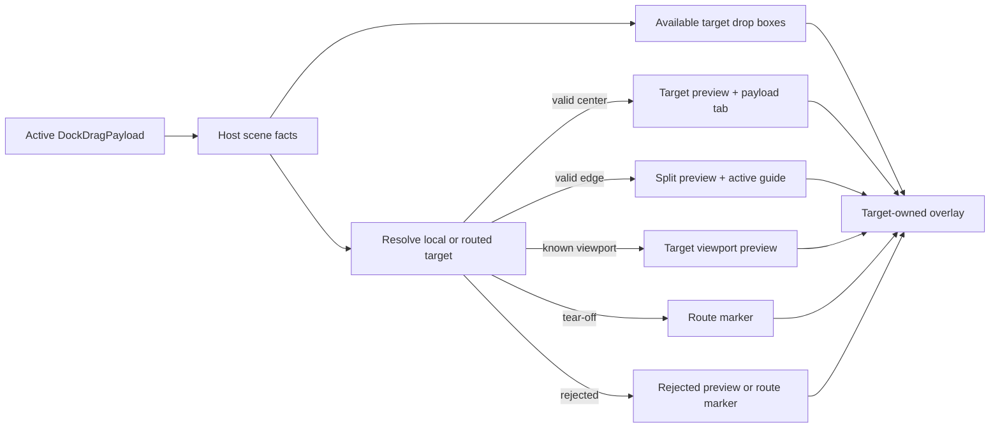
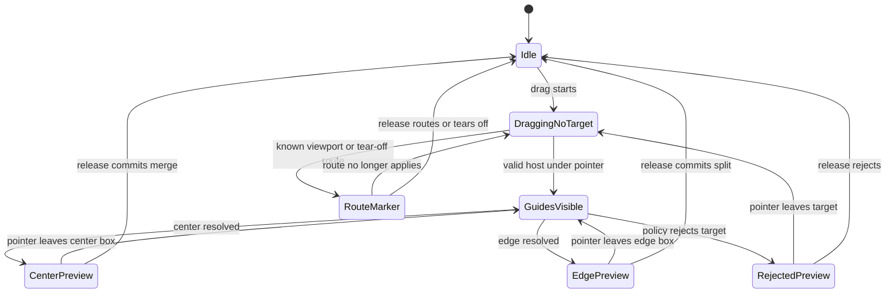

# Docking Target Affordance Alignment

## Goal Capsule

- Objective: align docking target-side visual affordances with ImGui-like preview semantics while keeping the current docking graph, target resolution, and viewport authority model intact.
- Interaction model: source drag payload stays visually quiet; target hosts own the preview, guide, hover, rejected, routed, and tear-off signals.
- Visual direction: ImGui-like readability and hierarchy, not pixel-perfect ImGui theming.
- Execution profile: breaking refactor is allowed inside `crates/gpui_docking`, but changes should remove ambiguity rather than add compatibility layers.
- Tail ownership: `crates/gpui_docking` render, geometry, interaction tests, viewport tests, native example dogfood, and verification notes.

## Product Contract

### Summary

The docking UI should make the target region, chosen drop mode, and rejected state readable during drag.
The previous source-side payload preview fix removes the dark drag rectangle and mirrors ImGui's no-preview drag source behavior.
This plan covers the remaining target-side UI/UX: drop guides, edge-vs-center preview, route markers, hover emphasis, and regression tests.

### Problem Frame

Current target guides are rendered as small button-like rectangles near the center of the host.
That is serviceable for hit testing, but it reads as controls floating above the surface rather than as target-owned docking affordance.
ImGui separates the concerns more clearly: the target viewport displays a translucent future-area preview, draw boxes for valid drop directions, stronger emphasis for the hovered direction, and a tab-shape label only when merging into the center.

The code already has the right semantic building blocks: `DockDropPreview`, `DockDropRoutePreview`, `DockDropBox`, guide availability checks, policy validation, and debug regions.
The refactor should make rendering consume those semantics consistently instead of adding a second visual contract.

### Requirements

- R1. A docking drag over a valid host must show target-side affordance owned by the target host, not a source-owned payload tooltip or dark floating rectangle.
- R2. Center/merge docking and edge/split docking must use distinct visual treatments; only center-like drops may render a payload tab preview.
- R3. Available drop directions must be shown as translucent target drop boxes with directional split cues, not as button-like controls.
- R4. The currently hovered or resolved drop direction must be visually stronger than other available directions.
- R5. Rejected targets must use a consistent rejected visual state and must not invite the user to drop as if the target were valid.
- R6. Cross-window known-viewport, tear-off, and rejected route previews must remain visually distinct from local target previews and must not conflict with them.
- R7. Guide rendering and delivery hit testing must stay driven by the same `DropZone` and `DockDropBox` semantics wherever practical.
- R8. Geometry/debug-region tests must lock the interaction contract; screenshot or pixel checks may supplement but must not be the only guard.
- R9. Existing docking graph mutation behavior is preserved unless a failing test proves the current behavior is itself a mismatch.

### Scope Boundaries

- In scope: `crates/gpui_docking/src/render.rs`, `crates/gpui_docking/src/geometry.rs`, `crates/gpui_docking/src/drop_preview.rs`, `crates/gpui_docking/src/drop_target.rs`, `crates/gpui_docking/src/host_render_tests.rs`, `crates/gpui_docking/src/host_interaction_tests.rs`, `crates/gpui_docking/src/host_viewport_runtime_handle_tests.rs`, `crates/gpui_docking/src/host_viewport_matrix_tests.rs`, `examples/docking-native/src/main.rs`, and `docs/verification.md`.
- Deferred: pixel-perfect Dear ImGui theme cloning, user-facing theme configuration, public docking UI style APIs, shift-to-dock mode, no-split mode, and broader docking graph changes.
- Out of scope: reintroducing a source drag preview, preserving button-like guide visuals for compatibility, or using screenshots as the only behavioral oracle.
- Baseline dependency: the current uncommitted source-payload fix should remain true throughout this work; if commits are split, land that baseline before this plan's target-side work.

### Acceptance Examples

- AE1. Given a tab dragged over the center of a tab host, when the center target is active, then the target host shows a translucent merge preview with a contained tab-shaped payload label and no source-side dark rectangle.
- AE2. Given a tab dragged over a host edge, when the edge target is active, then the target host shows an edge/split preview and directional guide emphasis, and it does not render a payload tab label.
- AE3. Given multiple available drop directions, when the pointer moves between center and side zones, then the active zone highlight changes without changing the underlying available-zone set.
- AE4. Given a policy-rejected target, when the pointer enters that target, then the visual state is rejected and release does not mutate the docking graph.
- AE5. Given a drag from a floating viewport into a main viewport, when a known target viewport is under the pointer, then the target viewport owns the drop preview and the source viewport shows only an appropriate route marker if needed.
- AE6. Given a tear-off candidate, when no valid local target is under the pointer, then the route marker reads as tear-off rather than a fake valid dock target.

### Dependencies

- `repo-ref/imgui/imgui.cpp` for the docking preview flow around `DockNodePreviewDockSetup`, `DockNodePreviewDockRender`, and no-preview drag source flags.
- `repo-ref/imgui/imgui.h` for default docking configuration flags that clarify which behaviors are optional rather than required parity.
- `crates/gpui_docking/src/render.rs` for current guide, target preview, and route preview rendering.
- `crates/gpui_docking/src/geometry.rs` for the existing drop-box geometry and ImGui-derived sizing formula.
- `crates/gpui_docking/src/drop_target.rs` for resolved target kind, preview bounds, and policy-filtered drop semantics.
- `crates/gpui_docking/src/host_interaction_tests.rs` and viewport runtime tests for the current regression surface.

### Outstanding Questions

None blocking.
The plan intentionally aligns interaction semantics and visual hierarchy, not exact ImGui colors or theme metrics.

### Sources

- `repo-ref/imgui/imgui.cpp`
- `repo-ref/imgui/imgui.h`
- `crates/gpui_docking/src/render.rs`
- `crates/gpui_docking/src/geometry.rs`
- `crates/gpui_docking/src/drop_target.rs`
- `crates/gpui_docking/src/host_interaction_tests.rs`
- `crates/gpui_docking/src/host_viewport_runtime_handle_tests.rs`

## Planning Contract

### Current Implementation Facts

- F1. `render_host_drop_preview` picks local preview first, then routed target preview, then route preview, so target-side rendering already has a single precedence point in `render.rs`.
- F2. `render_target_drop_preview` draws one absolute preview rectangle and optionally draws `DockDebugRegion::DropPayloadTabPreview` when `DockDropPreview.payload_tab` is true.
- F3. `render_drop_guides` filters `DROP_GUIDE_ZONES` through policy validation, then renders each available zone with `render_drop_guide`.
- F4. `render_drop_guide` currently uses nominal guide layout metrics to draw a center cluster of bordered rounded rectangles with simple line glyphs.
- F5. `geometry.rs` already exposes `DockDropBox`, `DockDropBoxKind`, `DockDropBoxSet`, `drop_boxes_with_style`, and resolved preview bounds for center, inner edge, and outer edge drop zones.
- F6. ImGui uses a no-preview drag source for docking, computes valid drop rectangles on the target, draws target preview rectangles/drop boxes, and only draws a tab label preview for center-like drops.

### Key Technical Decisions

- KTD1. Keep target resolution semantics authoritative; the UI refactor consumes `DockDropPreview`, `DockDropRoutePreview`, `DropZone`, and `DockDropBox` rather than inventing a separate hover model.
- KTD2. Treat ImGui as the interaction reference, not the theme reference. Colors, rounding, and opacity should fit the existing GPUI style while preserving ImGui's hierarchy: preview area, drop boxes, hovered box, and center tab label.
- KTD3. Replace button-like guides with target drop boxes using existing geometry where possible. If guide rendering cannot access final host bounds at every call site, share the same geometry metrics or deepen `geometry.rs` with a private draw-geometry bridge instead of duplicating unrelated relative-position math in `render.rs`.
- KTD4. Preserve the quiet source payload behavior: docking drag sources should continue returning an empty drag element unless a future explicit product decision changes that.
- KTD5. Use debug selectors and geometry assertions as the primary test oracle. Pixel or screenshot checks are allowed only as a supplemental smoke check because the desired behavior is spatial and semantic.
- KTD6. Do not add public styling/configuration API in this pass. Any private helper extraction must reduce `render.rs` complexity or remove duplicated guide math.

### Target State

### State Model

### Risks And Mitigations

- Risk: visual guide draw bounds drift from hit-test bounds. Mitigation: route guide rendering through `DockDropBox` data where bounds are available, otherwise share the same metrics/formula and add geometry tests proving draw and hit semantics stay aligned.
- Risk: center payload tab preview leaks into split previews. Mitigation: keep `payload_tab` as an explicit preview fact and add edge tests that assert no `DropPayloadTabPreview` region exists.
- Risk: routed cross-window previews show both source and target affordances. Mitigation: preserve `render_host_drop_preview` precedence and add route-vs-target tests.
- Risk: rejected targets still look actionable. Mitigation: centralize valid/rejected colors and assert rejected debug regions/bounds in tests.
- Risk: visual refactor accidentally changes graph mutation. Mitigation: keep delivery tests unchanged except where they add UI assertions; add graph-state assertions for representative drag releases.

## Implementation Units

### U1 - Characterize The Current Affordance Contract

Goal: add focused tests that describe the intended target-side behavior before changing visual internals.

Files:

- `crates/gpui_docking/src/geometry.rs`
- `crates/gpui_docking/src/host_render_tests.rs`
- `crates/gpui_docking/src/host_interaction_tests.rs`
- `crates/gpui_docking/src/host_viewport_runtime_handle_tests.rs`

Approach:

- Add or tighten tests that assert center drops expose `DropPayloadTabPreview` inside `DropPreview`.
- Add edge split tests that assert `DropPreview` exists but `DropPayloadTabPreview` does not.
- Add guide availability tests for center, inner edge, root edge, empty host, and central-region side-split suppression.
- Add rejected-policy tests that assert rejected preview state and no graph mutation on release.
- Keep these tests semantic: selectors, bounds, colors when exposed, route kind, and graph state.

Test scenarios:

- TS1. Center hover renders one target preview and one contained payload tab preview.
- TS2. Edge hover renders one split preview and no payload tab preview.
- TS3. Central region side guide is suppressed where existing target semantics suppress central-node side splits.
- TS4. Rejected policy target renders rejected state and release leaves graph unchanged.

### U2 - Introduce A Private Target Affordance Visual Model

Goal: make guide, preview, hovered, rejected, and routed visual decisions explicit and reusable without creating public API.

Files:

- `crates/gpui_docking/src/render.rs`
- `crates/gpui_docking/src/drop_preview.rs`
- `crates/gpui_docking/src/geometry.rs`

Approach:

- Add private helper functions or a private module only if it materially reduces `render.rs` duplication.
- Centralize visual tokens for valid preview, hovered guide, non-hovered guide, rejected preview, known-viewport route, and tear-off route.
- Represent guide visual state in terms of zone/kind and active resolved preview where available.
- Preserve existing debug region enum names unless additional state-specific selectors are required for tests.

Test scenarios:

- TS1. Valid preview, route preview, and rejected preview preserve distinct debug regions.
- TS2. Visual helpers expose enough stable structure for tests without requiring pixel snapshots.
- TS3. No public API or exported style struct is added.

### U3 - Rework Drop Guides Into Target Drop Boxes

Goal: replace the button-like four-way guide cluster with translucent target drop boxes that read as docking targets.

Files:

- `crates/gpui_docking/src/render.rs`
- `crates/gpui_docking/src/geometry.rs`
- `crates/gpui_docking/src/host_render_tests.rs`
- `crates/gpui_docking/src/host_interaction_tests.rs`

Approach:

- Render each available `DropZone` using draw bounds derived from existing `DockDropBox` geometry when host bounds are available.
- Draw center, left, right, top, and bottom boxes as translucent affordances with an inner outline.
- Draw a simple split cue line for side zones, matching ImGui's left/right/up/down distinction.
- Keep center visually different from edge boxes without making it look like a clickable button.
- If render-time host bounds are not available in the current element tree for all guide sites, add a minimal geometry bridge or shared metrics helper rather than duplicating relative-position math in `render.rs`.

Test scenarios:

- TS1. Guide debug bounds match the intended `DockDropBox` draw bounds for center and all four inner edges.
- TS2. Root-level outer guides use outer-edge geometry and do not expose center.
- TS3. Available-but-inactive guides render in a subdued state while the resolved active zone renders stronger.
- TS4. Small host bounds clamp guide draw boxes without producing zero-size or out-of-bounds guides.

### U4 - Align Active Preview, Rejected Preview, And Route Marker Hierarchy

Goal: make the active target preview and routed preview states clear, non-overlapping, and consistent with ImGui-like hierarchy.

Files:

- `crates/gpui_docking/src/render.rs`
- `crates/gpui_docking/src/drop_preview.rs`
- `crates/gpui_docking/src/host_interaction_tests.rs`
- `crates/gpui_docking/src/host_viewport_runtime_handle_tests.rs`
- `crates/gpui_docking/src/host_viewport_matrix_tests.rs`

Approach:

- Keep `render_host_drop_preview` precedence explicit: local target preview, routed target preview, then route marker.
- Ensure active split previews use edge preview bounds and never draw the payload tab preview.
- Ensure center previews draw a contained tab-like label only when `payload_tab` is true.
- Make rejected target and rejected route states share a recognizable rejected palette but preserve their distinct debug regions.
- Keep known-viewport and tear-off route markers visibly distinct from target drop previews.

Test scenarios:

- TS1. Local target preview wins over route marker when both could be observed in a frame.
- TS2. Routed target preview uses the target viewport's bounds and payload title.
- TS3. Tear-off route marker does not render as a local drop preview.
- TS4. Rejected route marker is red/rejected and does not commit on release.

### U5 - Native Dogfood And Documentation

Goal: make the new affordance behavior easy to verify manually and durable for future agents.

Files:

- `examples/docking-native/src/main.rs`
- `docs/verification.md`
- `crates/gpui_docking/src/host_interaction_tests.rs`

Approach:

- Ensure the native example still makes main-window, floating-window, center, edge, rejected, and tear-off states reachable.
- Add a concise manual checklist to `docs/verification.md` for dragging a tab within one host, from floating to main, from main to floating, and to no target.
- Keep log output useful for target/route resolution, but do not rely on logs as the primary test oracle.
- If a screenshot smoke path already exists in the repo, add one supplemental check for nonblank guide/preview rendering; otherwise leave screenshot testing deferred.

Test scenarios:

- TS1. Native example can reproduce center merge, inner edge split, root edge split, floating tear-off, and cross-window dock.
- TS2. Manual verification notes include expected target-side visual state for each drag.
- TS3. Existing `RUST_LOG=info,open_gpui_docking=debug,open_gpui=info` dogfood command remains sufficient to inspect resolution logs.

## Verification Contract

- Run `cargo fmt --all --check`.
- Run `cargo nextest run -p open-gpui-docking --no-fail-fast`.
- Run `cargo check -p open-gpui-docking-native`.
- Dogfood the native example and verify:
  - Dragging center shows target preview plus contained tab preview.
  - Dragging edge shows split preview and active edge guide, without payload tab preview.
  - Dragging from floating viewport to main viewport shows target-owned preview.
  - Dragging to no valid target shows tear-off or rejected route marker, not a fake dock target.
  - Rejected policy cases do not mutate the graph.
- Run `git diff --check`.

## Definition Of Done

- Source-side docking drag remains visually quiet; no dark payload preview is reintroduced.
- Target drop guides no longer read as button-like controls and instead render as translucent target drop boxes with directional cues.
- Active center, active edge, rejected, known-viewport route, and tear-off states are visually distinct.
- Payload tab preview is constrained to center-like drops and is absent from edge/split previews.
- Cross-window docking shows one coherent target-side preview path without duplicate or conflicting affordances.
- New or updated tests cover geometry, debug regions, active-zone emphasis, rejected state, and routed preview cases.
- The native example can be used to manually inspect all major visual states.
- The verification contract passes.

## PR And Landing Strategy

- Commit the existing source-payload-preview baseline separately if it has not already landed, because it is a complete source-side fix.
- Land this target-affordance refactor as one follow-up commit unless implementation naturally separates into geometry/test characterization and render rewrite.
- Do not open a PR from this plan unless the user explicitly asks; keep local commits reviewable and conventional.
