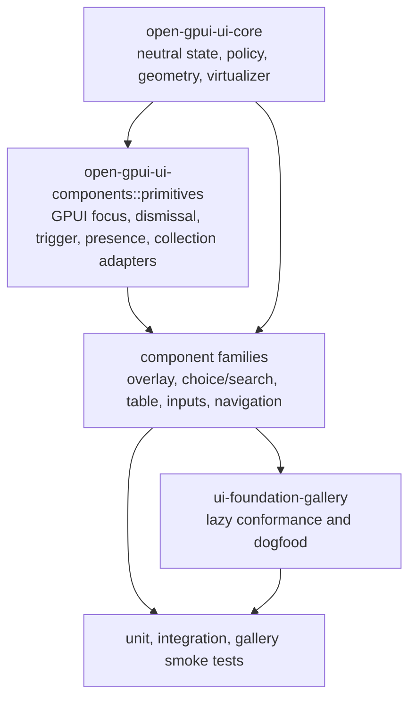
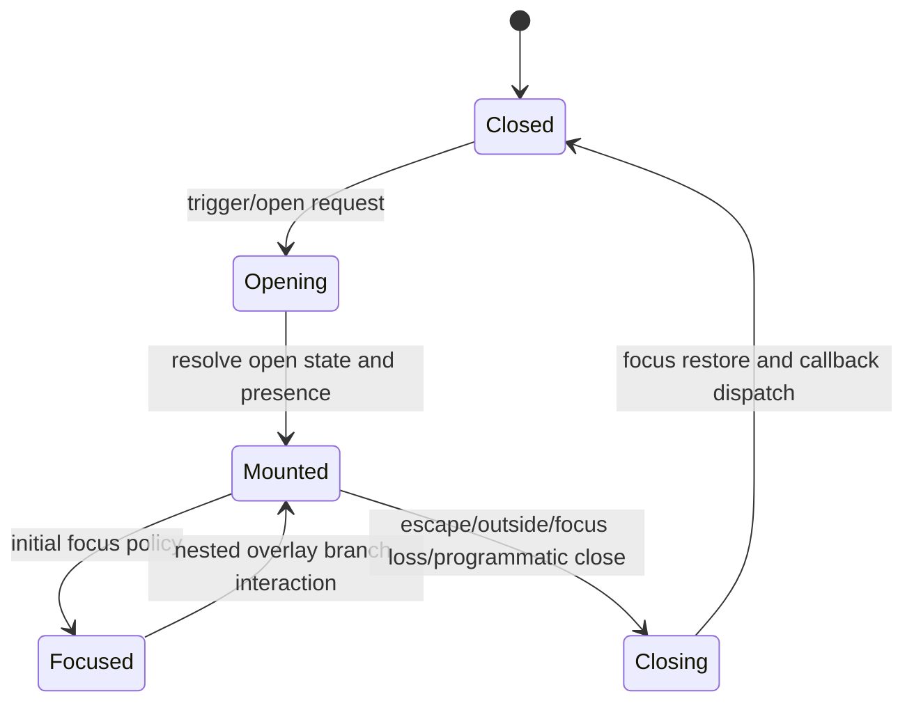
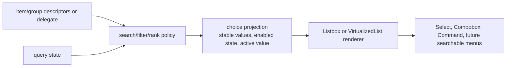

# Open GPUI Component Library Foundation Refactor - Plan

## Goal Capsule

Refactor the Open GPUI component library before launch so it behaves like a general-purpose UI framework rather than a growing catalog of individually solved components.

The current direction is correct: `open-gpui-ui-core` owns renderer-neutral state, policy, and vocabulary; `open-gpui-ui-components` owns official GPUI adapters and concrete components; `examples/ui-foundation-gallery` is the conformance and dogfood surface. This plan keeps that crate boundary from ADR 0008. It does not introduce a standalone headless crate.

The gap is architectural concentration. Several foundational behaviors exist but are still scattered or private: overlay dismissal and focus handling, controlled/default state, trigger accessibility, choice/search projection, active-descendant navigation, safe hover, and virtualization. At the same time, high-value modules such as `table.rs`, `command.rs`, `menu.rs`, `tree.rs`, and `text_input.rs` have become large enough that they hide distinct sub-systems inside single files.

The refactor is intentionally breaking. The project has not launched, so implementation should prefer the final framework shape over compatibility layers. Remove stale aliases, dead helpers, and duplicated internal policies once the new seams are covered by tests and gallery smoke coverage.

Success means:

- Public framework primitives exist for shared component behavior.
- Overlay components use one dismiss/focus/presence/placement path.
- Select, Combobox, Listbox, and Command share stable-value choice/search semantics.
- Table, Command, Menu, Tree, and text input internals are split by concern while preserving intended public exports.
- The component gallery renders heavy sections lazily or virtually in debug mode.
- High-value missing components are added through the new primitives.
- Documentation and verification commands describe the new architecture.

## Product Contract

### Requirements

R1. Preserve the active product boundary from ADR 0008: no new standalone headless crate in this refactor. Renderer-neutral policy belongs in `open-gpui-ui-core`; GPUI wiring and official component facades belong in `open-gpui-ui-components`.

R2. Create a first-class primitives layer for shared component behavior: controllable state, open state, trigger semantics, focus scope, dismissable layer, presence, placement, roving focus group, active descendant, field state, and collection/item identity.

R3. Route Dialog, AlertDialog, Sheet, Popover, HoverCard, Tooltip, Menu, ContextMenu, Select, Combobox, and Command overlays through the shared primitives so escape, outside press, modal/non-modal behavior, focus restore, and nested overlay branches are consistent.

R4. Unify choice and search behavior across Listbox, Select, Combobox, Command, Menu-like item collections, and future searchable surfaces. Stable values must be the primary identity. Index identity is only a transient render concern.

R5. Align Command with cmdk-style contracts where they map cleanly to GPUI: stable selected value, optional built-in filtering, custom filter/rank hooks, forced rendering of items or groups where needed, loop policy, pointer selection policy, and optional Vim-style key behavior.

R6. Make virtualization and lazy rendering normal for large UI surfaces. The gallery components page must not eagerly render every heavy example in debug mode. Data-heavy components must be able to render viewport-relevant rows/items only.

R7. Split large component modules into deeper internal modules. The public API can break if the replacement is cleaner, but each split must leave a clear facade and tests that cover behavior rather than file layout.

R8. Add the most valuable missing general UI components after the primitives exist: Accordion, Collapsible, Slider, ToggleGroup or ButtonGroup, Toast or Notification, Breadcrumb, Link, Tag or Chip, and NumberInput or Stepper. Defer specialized surfaces such as chart, dock, highlighter, calendar/date picker, and color picker unless they are needed to validate primitives.

R9. Update docs, gallery metadata, and verification instructions so downstream contributors understand the official architecture and the expected test gates.

### Acceptance Examples

AE1. Scrolling the gallery components page in debug mode does not require all catalog sections to be mounted at once. Far-away heavy examples are mounted only when focused or near the viewport.

AE2. Filtering a Command palette keeps selection by stable value across query changes, re-ranking, item group changes, and virtualization.

AE3. Select, Combobox, and Listbox resolve disabled items, loop behavior, multi-select state, active descendant, and typeahead through the same choice/navigation policy.

AE4. Nested overlays behave consistently: a menu submenu, popover inside dialog, and select inside sheet do not close the wrong layer on outside press, escape, or focus transition.

AE5. Table keeps current functional depth while its internals are split into state, row model, column model, layout, virtualization, editing, selection, and rendering modules.

AE6. New components are built from shared primitives, not one-off logic. For example, Accordion and Collapsible share open state; Slider and NumberInput share field state and validation vocabulary where appropriate.

### Scope Boundaries

In scope:

- `crates/ui_core`
- `crates/ui_components`
- `examples/ui-foundation-gallery`
- Existing docs and plans that define the UI component architecture
- Tests and smoke coverage for the affected crates

Out of scope for this plan:

- A new standalone `open-gpui-ui-headless` crate
- Native OS menu integration or a full application command bus
- Charting, dock layout, code highlighters, date picker/calendar, and color picker as official components
- Maintaining compatibility aliases for pre-launch APIs that are replaced by the new design

## Context And Research

The current repository already has meaningful foundation code:

- `crates/ui_core/src/overlay.rs` defines renderer-neutral overlay policy, dismiss reasons, focus restore intent, initial focus intent, escape policy, outside press policy, layer kind, and presence.
- `crates/ui_core/src/virtualizer.rs` defines reusable virtualizer state and resolved snapshots.
- `crates/ui_components/src/overlay.rs` adapts overlay policy into GPUI overlay state and deferred layer priorities.
- `crates/ui_components/src/choice.rs` centralizes stable-value selection helpers, but it is private and too narrow for framework-level choice/search behavior.
- `crates/ui_components/src/roving_focus.rs` contains navigation and typeahead helpers that should become part of a deeper primitive surface.
- `crates/ui_components/src/menu_runtime.rs` contains submenu hover, safe hover, and scroll runtime behavior that should be isolated and reused.
- `crates/ui_components/src/command.rs` and `crates/ui_components/src/table.rs` contain strong feature work, but each file has accumulated multiple distinct responsibilities.

Reference patterns:

- `repo-ref/fret/ecosystem/fret-ui-kit/src/primitives` follows a Radix-like split: stable primitive entry points wrap reusable headless behavior and declarative/render wiring. Especially relevant modules are `dismissable_layer`, `focus_scope`, `trigger_a11y`, `active_descendant`, `collection`, `controllable_state`, `open_state`, `presence`, `popper`, `portal`, `roving_focus_group`, `safe_hover`, and `tooltip_provider`.
- `repo-ref/gpui-component/crates/ui/src/lib.rs` demonstrates a broad GPUI component catalog plus global initialization hooks for focus trap, sheets, dialogs, popovers, menus, lists, tables, trees, and tooltips. Its `searchable_list/delegate.rs`, `table/delegate.rs`, and `virtual_list.rs` are useful references for delegate-based data surfaces and viewport-based rendering.
- `repo-ref/cmdk` is useful for Command semantics. Its architecture centers item identity on stable values, separates filtering policy from selection identity, and supports opt-outs such as custom filtering and forced item/group rendering.

No `docs/solutions` directory exists in this checkout, so this plan is grounded in ADRs, existing project docs, existing plans, source inspection, and local reference repositories.

## Key Technical Decisions

KTD1. Keep the current crate boundary.

Rationale: ADR 0008 already defines the product boundary. Adding a new headless crate now would increase API surface and migration work before the current core/components split is fully used. Put renderer-neutral policy in `ui_core`; put GPUI adapter primitives and component facades in `ui_components`.

KTD2. Introduce `ui_components::primitives` as the official GPUI primitive layer.

Rationale: Many components need the same adapter behavior but should not each own one-off focus, dismissal, trigger, and collection code. `ui_components::primitives` should expose GPUI-aware building blocks backed by neutral `ui_core` policies where possible.

KTD3. Treat stable value as the identity for choice/search components.

Rationale: cmdk and the current Open GPUI choice helpers both point to the same rule. Indexes are fragile under filtering, sorting, virtualization, async updates, and Strict-like remount behavior. Values are stable enough to preserve selection and active item state across transformations.

KTD4. Prefer breaking cleanup over deprecation shims.

Rationale: The library has not launched. Compatibility layers would preserve accidental design. Once tests and gallery coverage prove replacement behavior, remove old aliases, duplicated helpers, and stale module boundaries.

KTD5. Split large modules by responsibility, not by arbitrary size.

Rationale: A file being large is a symptom, not the root problem. The split should expose real sub-systems: state resolution, item collection, keyboard policy, overlay runtime, render plan, virtualization, editing, selection, and adapter glue.

KTD6. Make gallery performance a product requirement.

Rationale: The gallery is not only a demo. It is the conformance surface and the first place framework-level regressions appear. If debug mode scrolls poorly because every heavy sample mounts at once, the library is not using its own virtualization primitives correctly.

KTD7. Add missing components only after their primitives are available.

Rationale: The goal is a framework, not a visual checklist. Components such as Accordion, Collapsible, Slider, ToggleGroup, Toast, Breadcrumb, Link, Tag, NumberInput, and Stepper should validate and reuse the foundation rather than add more one-off behavior.

## High-Level Technical Design

The design is intentionally layered. This is a planning sketch, not a prescription for exact module names.



Overlay behavior should collapse into one lifecycle:



Choice and search surfaces should share a stable projection:



## Implementation Units

### U1 - Foundation Primitives And Public Contracts

Goal: Establish the official primitive layer that future components build on.

Requirements: R1, R2, R4, R9.

Dependencies: none.

Primary files:

- `crates/ui_core/src/lib.rs`
- `crates/ui_components/src/lib.rs`
- `crates/ui_components/src/a11y.rs`
- `crates/ui_components/src/focus.rs`
- `crates/ui_components/src/roving_focus.rs`
- `crates/ui_components/src/choice.rs`
- `docs/ui/component-contract.md`

Likely new or moved files:

- `crates/ui_core/src/controllable_state.rs`
- `crates/ui_core/src/collection.rs`
- `crates/ui_core/src/active_descendant.rs`
- `crates/ui_components/src/primitives/mod.rs`
- `crates/ui_components/src/primitives/controllable_state.rs`
- `crates/ui_components/src/primitives/trigger_a11y.rs`
- `crates/ui_components/src/primitives/roving_focus_group.rs`
- `crates/ui_components/src/primitives/active_descendant.rs`
- `crates/ui_components/src/primitives/collection.rs`
- `crates/ui_components/src/primitives/field_state.rs`

Approach:

1. Inventory existing helpers for controlled/default values, open state, focus movement, item identity, a11y trigger attributes, and field status.
2. Move renderer-neutral pieces into `ui_core` only when they have no GPUI dependency.
3. Expose GPUI-facing primitive facades under `ui_components::primitives`.
4. Update `ui_components::prelude` only for primitives that are safe, stable, and broadly useful.
5. Delete private duplicate helpers once components are migrated in later units.

Patterns to follow:

- Fret `controllable_state`, `open_state`, `collection`, `active_descendant`, `field_state`, and `trigger_a11y`.
- Existing Open GPUI `choice.rs` and `roving_focus.rs` tests.

Test scenarios:

- Controlled state ignores default value after a controlled value is supplied.
- Uncontrolled state uses default value and emits change events exactly once per transition.
- Collection descriptors preserve stable value ordering and disabled state.
- Active descendant resolves by stable value after filtering and after item removal.
- Roving focus handles first, last, next, previous, loop, disabled items, and empty collections.

Verification:

- `cargo nextest run -p open-gpui-ui-core`
- `cargo nextest run -p open-gpui-ui-components`
- `cargo check -p open-gpui-ui-components`

### U2 - Overlay Runtime Primitives

Goal: Make overlay behavior consistent across the component family.

Requirements: R2, R3, R9.

Dependencies: U1.

Primary files:

- `crates/ui_core/src/overlay.rs`
- `crates/ui_components/src/overlay.rs`
- `crates/ui_components/src/popover.rs`
- `crates/ui_components/src/dialog.rs`
- `crates/ui_components/src/alert_dialog.rs`
- `crates/ui_components/src/sheet.rs`
- `crates/ui_components/src/hover_card.rs`
- `crates/ui_components/src/tooltip.rs`
- `crates/ui_components/src/menu.rs`
- `crates/ui_components/src/context_menu.rs`
- `crates/ui_components/src/select.rs`
- `crates/ui_components/src/combobox.rs`
- `crates/ui_components/src/command.rs`

Likely new or moved files:

- `crates/ui_components/src/primitives/dismissable_layer.rs`
- `crates/ui_components/src/primitives/focus_scope.rs`
- `crates/ui_components/src/primitives/presence.rs`
- `crates/ui_components/src/primitives/popper.rs`
- `crates/ui_components/src/primitives/portal.rs`
- `crates/ui_components/src/primitives/tooltip_provider.rs`
- `crates/ui_components/src/primitives/safe_hover.rs`

Approach:

1. Keep neutral overlay policy in `ui_core::overlay`.
2. Convert GPUI overlay adapter helpers into explicit primitives for dismissal, focus scope, presence, placement, and nested branch handling.
3. Migrate Popover, Dialog, AlertDialog, Sheet, HoverCard, Tooltip, Menu, ContextMenu, Select, Combobox, and Command to the shared path.
4. Normalize callback names and payloads around open changes and dismiss reasons.
5. Remove component-local escape/outside/focus policies that duplicate the primitive path.

Patterns to follow:

- Fret `dismissable_layer`, `focus_scope`, `presence`, `popper`, `portal`, `safe_hover`, and `tooltip_delay_group`.
- Existing Open GPUI overlay policy types.

Test scenarios:

- Escape closes the active overlay according to its `EscapeKeyPolicy` and does not close lower layers.
- Outside press closes non-modal overlays according to policy and respects nested branch nodes.
- Modal overlays trap focus and restore focus according to `FocusRestoreIntent`.
- Tooltip and HoverCard delays do not leak open state after pointer leave or owner removal.
- Menu submenu safe-hover keeps the submenu open while moving through the grace area.
- Select inside Sheet and Popover inside Dialog do not close the parent layer incorrectly.

Verification:

- `cargo nextest run -p open-gpui-ui-core`
- `cargo nextest run -p open-gpui-ui-components`
- Focused gallery smoke tests for overlay, menu, select, combobox, and command pages.

### U3 - Choice, Search, And Command Refactor

Goal: Unify item identity, search, filtering, ranking, and navigation for choice-based surfaces.

Requirements: R4, R5, R6, R9.

Dependencies: U1.

Primary files:

- `crates/ui_components/src/choice.rs`
- `crates/ui_components/src/listbox.rs`
- `crates/ui_components/src/select.rs`
- `crates/ui_components/src/combobox.rs`
- `crates/ui_components/src/command.rs`
- `crates/ui_components/src/roving_focus.rs`
- `crates/ui_components/src/virtualized_list.rs`
- `examples/ui-foundation-gallery/src/pages/components.rs`
- `examples/ui-foundation-gallery/tests/foundation_gallery.rs`

Likely new or moved files:

- `crates/ui_components/src/choice_surface/mod.rs`
- `crates/ui_components/src/choice_surface/search.rs`
- `crates/ui_components/src/choice_surface/projection.rs`
- `crates/ui_components/src/choice_surface/navigation.rs`
- `crates/ui_components/src/choice_surface/delegate.rs`
- `crates/ui_components/src/command/mod.rs`
- `crates/ui_components/src/command/state.rs`
- `crates/ui_components/src/command/render_plan.rs`
- `crates/ui_components/src/command/search.rs`
- `crates/ui_components/src/command/runtime.rs`

Approach:

1. Promote `choice.rs` from private helper to a deeper choice/search surface with stable-value descriptors, group descriptors, enabled/disabled state, active value, selected values, query normalization, and projection output.
2. Add a delegate or descriptor API similar to gpui-component searchable list only if it reduces complexity for Command and future searchable surfaces.
3. Move Command search/filter/rank behavior into the shared choice surface where possible.
4. Keep Command-specific features such as palette open mode, index snapshots, loading state, and multi-select chips in Command modules.
5. Align with cmdk where useful: stable selected value, `should_filter` style opt-out, custom filter/rank, forced item/group rendering, loop policy, pointer-selection policy, and optional Vim-style navigation.
6. Migrate Select, Combobox, and Listbox to the same projection and navigation semantics.

Patterns to follow:

- `repo-ref/cmdk/ARCHITECTURE.md`
- `repo-ref/cmdk/cmdk/src/index.tsx`
- `repo-ref/gpui-component/crates/ui/src/searchable_list/delegate.rs`
- Existing Open GPUI Listbox and Command state tests.

Test scenarios:

- Filtering preserves selected value when item indexes change.
- Removing the active item resolves the next enabled value deterministically.
- Custom filter disabled mode keeps original ordering and only updates query state.
- Custom filter/rank mode produces deterministic group and item ordering.
- Multi-select Command toggles values without losing active descendant.
- Select, Combobox, and Command agree on disabled item navigation and loop behavior.
- Virtualized Command lists keep active item visibility without mounting the whole list.

Verification:

- `cargo nextest run -p open-gpui-ui-components`
- `cargo nextest run -p open-gpui-ui-foundation-gallery`
- Focused gallery smoke tests for Listbox, Select, Combobox, Command, and VirtualizedList.

### U4 - Large Module Split And Internal Architecture Cleanup

Goal: Split large files into maintainable modules without weakening public component facades.

Requirements: R7, R9.

Dependencies: U1, U2, U3 where touched behavior has moved to primitives.

Primary files:

- `crates/ui_components/src/table.rs`
- `crates/ui_components/src/command.rs`
- `crates/ui_components/src/menu.rs`
- `crates/ui_components/src/context_menu.rs`
- `crates/ui_components/src/tree.rs`
- `crates/ui_components/src/text_input.rs`
- `crates/ui_components/src/textarea.rs`
- `crates/ui_components/src/sidebar.rs`
- `crates/ui_components/src/lib.rs`
- `crates/ui_components/src/prelude.rs`

Likely new or moved directories:

- `crates/ui_components/src/table/`
- `crates/ui_components/src/command/`
- `crates/ui_components/src/menu/`
- `crates/ui_components/src/tree/`
- `crates/ui_components/src/text_input/`

Approach:

1. Add characterization tests before moving high-risk behavior when tests are missing.
2. Convert each large file into a `mod.rs` facade plus internal modules split by real concern.
3. Keep public type names only when they remain the right API. Break, rename, or delete accidental exports where the new architecture is clearer.
4. Move tests with the behavior they cover where that improves local reasoning.
5. Treat Table as a boundary-preparation pass here. U5 owns the detailed Table architecture and behavior split.
6. Delete dead helper types and obsolete reexports after compile and tests pass.

Suggested split targets:

- Table: prepare module scaffolding and characterization coverage only; U5 owns state, row model, column model, filters, sorting, selection, editing, layout, virtualization, render plan, and GPUI adapter.
- Command: state, descriptors, search, render plan, overlay runtime, input binding, list rendering.
- Menu: descriptors, runtime, submenu, safe hover, keyboard navigation, render plan.
- Tree: state model, flattening, keyboard policy, rendering, async/loading hooks if present.
- Text input and Textarea: state, validation/field state, GPUI adapter, composition/event handling.

Test scenarios:

- Public examples compile after intentional API changes are applied.
- Characterization tests prove Command render plans, Table row/column plans, Menu submenu behavior, Tree selection, and TextInput editing still match intended behavior.
- No moved module keeps duplicated legacy helpers after migration to primitives.

Verification:

- `cargo fmt -p open-gpui-ui-components`
- `cargo check -p open-gpui-ui-components`
- `cargo nextest run -p open-gpui-ui-components`

### U5 - Table Architecture And Optional Delegate Adapter

Goal: Preserve Table depth while making the data, layout, and rendering boundaries explicit.

Requirements: R6, R7, R9.

Dependencies: U1, U4.

Primary files:

- `crates/ui_core/src/table.rs`
- `crates/ui_core/src/grid_viewport.rs`
- `crates/ui_core/src/virtualizer.rs`
- `crates/ui_components/src/table.rs`
- `examples/ui-foundation-gallery/src/pages/components.rs`
- `examples/ui-foundation-gallery/tests/foundation_gallery.rs`

Likely new or moved files:

- `crates/ui_components/src/table/mod.rs`
- `crates/ui_components/src/table/state.rs`
- `crates/ui_components/src/table/row_model.rs`
- `crates/ui_components/src/table/column_model.rs`
- `crates/ui_components/src/table/filtering.rs`
- `crates/ui_components/src/table/sorting.rs`
- `crates/ui_components/src/table/selection.rs`
- `crates/ui_components/src/table/editing.rs`
- `crates/ui_components/src/table/layout.rs`
- `crates/ui_components/src/table/virtualization.rs`
- `crates/ui_components/src/table/render_plan.rs`
- `crates/ui_components/src/table/delegate.rs`

Approach:

1. Keep neutral table state and viewport math in `ui_core`.
2. Split GPUI Table implementation into state resolution, row model, column model, layout, interaction, and rendering modules.
3. Evaluate a `TableDelegate` adapter inspired by gpui-component only after the split shows where app-owned data loading, visible range, and load-more hooks belong.
4. Preserve current features that make Table valuable: sorting, filtering, pagination or faceting where present, column resizing, row selection, editing, pinned rows/columns if present, and virtualization.
5. Ensure Table can host heavy cells without forcing all rows and columns to render.

Patterns to follow:

- `repo-ref/gpui-component/crates/ui/src/table/delegate.rs`
- Existing `ui_core::table`, `ui_core::grid_viewport`, and `ui_core::virtualizer`.

Test scenarios:

- Sorting and filtering produce the expected row order without corrupting selection.
- Column resize and layout snapshots remain stable across viewport changes.
- Row editing emits one committed value per edit and cancels cleanly.
- Column and row virtualization render the expected visible range with overscan.
- Delegate mode, if added, calls visible range and load-more hooks exactly when expected.

Verification:

- `cargo nextest run -p open-gpui-ui-core`
- `cargo nextest run -p open-gpui-ui-components`
- Table-focused gallery smoke tests.

### U6 - Gallery Lazy Conformance And Performance

Goal: Make the gallery prove that the library uses its own virtualization and lazy rendering correctly.

Requirements: R6, R9.

Dependencies: U1, U3.

Primary files:

- `examples/ui-foundation-gallery/src/pages/components.rs`
- `examples/ui-foundation-gallery/src/pages/components/render.rs`
- `examples/ui-foundation-gallery/src/pages/overlay.rs`
- `examples/ui-foundation-gallery/tests/foundation_gallery.rs`
- `docs/verification.md`

Approach:

1. Convert the components page into a section registry plus lazy or virtualized section renderer.
2. Keep focused family views lightweight and deterministic.
3. Let all-components mode exist, but window section mounting so heavy samples are not all live at once.
4. Add smoke tests that navigate, scroll, and focus component families without depending on every section being mounted.
5. Use the gallery as the public parity matrix for current and planned components.

Patterns to follow:

- Existing Open GPUI `VirtualizedList` and `ui_core::virtualizer`.
- gpui-component virtual list behavior as a reference for visible-range rendering.

Test scenarios:

- Opening the components page mounts the visible sections and does not eagerly mount far-away heavy samples.
- Switching focused component family resets scroll and mounts the selected family only.
- Scrolling to Table or Command mounts that section and preserves inner component interaction.
- Returning to all-components mode does not leak focus handles or stale open overlays.
- Gallery catalog entries all have a focused route or focused sample.

Verification:

- `cargo check -p open-gpui-ui-foundation-gallery`
- `cargo nextest run -p open-gpui-ui-foundation-gallery`
- Focused smoke tests listed in `docs/verification.md`.

### U7 - High-Value Missing Components

Goal: Add missing general UI components that validate the new primitives and fill framework gaps.

Requirements: R2, R8, R9.

Dependencies: U1, U2 for overlay-backed components, U3 for choice-backed components.

Primary files:

- `crates/ui_components/src/lib.rs`
- `crates/ui_components/src/prelude.rs`
- `examples/ui-foundation-gallery/src/pages/components.rs`
- `examples/ui-foundation-gallery/tests/foundation_gallery.rs`
- `docs/ui/component-contract.md`

Likely new files, depending on final family naming:

- `crates/ui_components/src/accordion.rs`
- `crates/ui_components/src/collapsible.rs`
- `crates/ui_components/src/slider.rs`
- `crates/ui_components/src/toggle_group.rs`
- `crates/ui_components/src/button_group.rs`
- `crates/ui_components/src/toast.rs`
- `crates/ui_components/src/notification.rs`
- `crates/ui_components/src/breadcrumb.rs`
- `crates/ui_components/src/link.rs`
- `crates/ui_components/src/tag.rs`
- `crates/ui_components/src/number_input.rs`
- `crates/ui_components/src/stepper.rs`

Approach:

1. Implement components in priority order: Accordion, Collapsible, Slider, ToggleGroup or ButtonGroup, Toast or Notification, Breadcrumb, Link, Tag or Chip, NumberInput or Stepper.
2. For each component, define state/descriptor types first, then GPUI adapter/rendering, then gallery sample and tests.
3. Reuse primitives introduced earlier. If a component requires a missing primitive, add the primitive rather than embedding custom behavior in the component.
4. Add only the official API shape intended to survive launch. Do not add temporary compatibility wrappers.

Patterns to follow:

- Fret primitives for Accordion, Collapsible, Slider-adjacent field behavior, ToggleGroup, Toast, and Label/Field patterns.
- gpui-component catalog for component coverage expectations and gallery examples.

Test scenarios:

- Accordion supports single and multiple open item modes where implemented.
- Collapsible supports controlled and uncontrolled open state.
- Slider handles min, max, step, disabled state, keyboard increment/decrement, and value clamping.
- ToggleGroup preserves stable values and disabled item behavior.
- Toast or Notification supports add, dismiss, timeout, action, and stacking behavior.
- Breadcrumb and Link expose accessible text and activation behavior.
- Tag or Chip supports removable and non-removable variants.
- NumberInput or Stepper clamps values, emits changes once, and handles keyboard stepping.

Verification:

- `cargo check -p open-gpui-ui-components`
- `cargo nextest run -p open-gpui-ui-components`
- `cargo check -p open-gpui-ui-foundation-gallery`
- `cargo nextest run -p open-gpui-ui-foundation-gallery`

### U8 - API Inventory, Documentation, And Removal Pass

Goal: Make the new architecture explicit and remove stale pre-refactor code.

Requirements: R9.

Dependencies: U1 through U7.

Primary files:

- `crates/ui_core/src/lib.rs`
- `crates/ui_components/src/lib.rs`
- `crates/ui_components/src/prelude.rs`
- `docs/ui/component-contract.md`
- `docs/verification.md`
- `docs/adr/0008-open-gpui-ui-component-productization-roadmap.md`
- `examples/ui-foundation-gallery/src/pages/components.rs`

Approach:

1. Produce a public export inventory for `ui_core`, `ui_components`, and `ui_components::prelude`.
2. Remove obsolete modules, aliases, duplicated helpers, and examples that contradict the new architecture.
3. Update `docs/ui/component-contract.md` with the final primitive, overlay, choice/search, table, and gallery contracts.
4. Update `docs/verification.md` with focused commands for contributors and full verification gates.
5. Add or update an ADR only if the final public architecture materially changes ADR 0008.
6. Ensure `repo-ref/` remains reference-only and excluded from workspace verification.

Test scenarios:

- `cargo run -p xtask -- scan-import-boundary` passes.
- Workspace examples compile against the new public exports.
- Gallery metadata and docs agree on official component names and status.
- No component imports deleted private helpers.

Verification:

- `cargo fmt --all --check`
- `cargo run -p xtask -- scan-import-boundary`
- `cargo run -p xtask -- verify`

## System-Wide Impact

Public API:

- Existing pre-launch APIs can break. Breaks should be intentional, documented, and reflected in gallery examples.
- `ui_components::prelude` should become more curated. Do not export every primitive by default.
- Internal helper modules should either become official primitives or be deleted after migration.

Runtime behavior:

- Overlay focus and dismissal behavior will become more consistent, but migration can expose hidden assumptions in individual components.
- Choice/search components will shift from index-driven behavior to stable-value behavior.
- Gallery rendering will change from eager all-sections rendering to lazy or virtualized mounting.

Testing:

- More behavior should be covered without a running GPUI window when it is renderer-neutral.
- GPUI-specific behavior still needs gallery smoke tests for focus, overlay, and interaction paths.
- Large module splits should be guarded by characterization tests before code movement.

Contributor workflow:

- Contributors should start from the primitive layer before adding new components.
- New components should add state/descriptor tests, GPUI adapter tests where feasible, gallery samples, and documentation updates.

## Risks And Mitigations

Risk: The refactor becomes a broad rewrite with weak intermediate checkpoints.

Mitigation: Land by units. Each unit must compile and run focused tests before moving to the next. Do not start missing components before primitives and the relevant family migrations exist.

Risk: Primitive abstractions become too generic and harder to use.

Mitigation: Extract only behavior already repeated in current code or required by near-term components. Keep GPUI-facing APIs concrete and ergonomic.

Risk: Overlay migration introduces focus or close-order regressions.

Mitigation: Add nested overlay smoke tests before replacing component-local policies. Keep dismiss reason and focus restore assertions explicit.

Risk: Command and choice/search refactors regress keyboard behavior.

Mitigation: Use stable-value tests across filtering, disabled state, group movement, multi-select, and virtualization. Compare Command behavior to cmdk-inspired contracts where applicable.

Risk: Table split hides regressions behind file movement.

Mitigation: Characterize row model, column model, selection, editing, layout, and virtualization before moving implementation.

Risk: Gallery lazy rendering hides broken examples.

Mitigation: Keep focused routes and smoke tests for every official catalog entry. Lazy rendering should reduce mounting cost, not reduce coverage.

Risk: Adding missing components delays architecture cleanup.

Mitigation: U7 depends on foundation units. If schedule pressure appears, ship primitives and migrations first; add components in priority order afterward.

## Verification Contract

Focused UI foundation gate:

```powershell
cargo fmt -p open-gpui-ui-core -p open-gpui-ui-components -p open-gpui-ui-foundation-gallery
cargo check -p open-gpui-ui-core
cargo check -p open-gpui-ui-components
cargo check -p open-gpui-ui-foundation-gallery
cargo nextest run -p open-gpui-ui-core
cargo nextest run -p open-gpui-ui-components
cargo nextest run -p open-gpui-ui-foundation-gallery
```

Full verification gate:

```powershell
cargo run -p xtask -- verify
```

Additional focused checks should be added to `docs/verification.md` as unit work lands:

- Overlay nested dismissal and focus restoration.
- Choice/search stable-value filtering and active descendant behavior.
- Command virtualized list behavior.
- Table row/column virtualization and editing.
- Gallery lazy section mounting and focused family navigation.

## Definition Of Done

- `ui_core` and `ui_components` expose a coherent primitive/component architecture consistent with ADR 0008.
- Overlay family components share the same dismissal, focus, presence, and placement primitives.
- Choice/search family components share stable-value projection, filtering, and navigation semantics.
- Table, Command, Menu, Tree, and text input internals are split by concern with clear facades.
- Components gallery uses lazy or virtualized rendering for heavy sections and has focused coverage for every official component.
- The U7 component families are implemented in the chosen API shape: Accordion, Collapsible, Slider, one ToggleGroup/ButtonGroup API, one Toast/Notification family, Breadcrumb, Link, one Tag/Chip API, and one NumberInput/Stepper API.
- Obsolete helpers, stale aliases, and duplicate private policies are removed.
- `docs/ui/component-contract.md` and `docs/verification.md` describe the final design and commands.
- Focused UI foundation gate passes.
- Full `cargo run -p xtask -- verify` passes before the branch is considered complete.

## Open Questions

Q1. Should `Toast` and `Notification` be one component family or separate APIs?

Default: start as one notification/toast family if the interaction model is shared, then split names only if persistent notifications and transient toasts need different state contracts.

Q2. Should Table expose a delegate API in the first table refactor?

Default: split the current implementation first. Add `TableDelegate` only if the split shows a real need for app-owned loading, visible-range callbacks, or incremental data ownership.

Q3. Should all primitives be exported through `ui_components::prelude`?

Default: no. Export common component types through the prelude, but keep advanced primitives under `ui_components::primitives` unless repeated downstream use proves they belong in the prelude.

Q4. How strict should the file-size cleanup be?

Default: do not enforce a hard line-count budget. The rule is responsibility ownership: a file should not own multiple independent sub-systems just because they belong to the same component.

## Sources And References

- `docs/adr/0008-open-gpui-ui-component-productization-roadmap.md`
- `docs/ui/component-contract.md`
- `docs/verification.md`
- `docs/plans/2026-06-28-001-refactor-ui-choice-surface-plan.md`
- `docs/plans/2026-06-22-003-feat-ui-api-overlay-productization-plan.md`
- `docs/plans/2026-06-22-005-feat-ui-command-depth-plan.md`
- `docs/plans/2026-06-23-001-feat-ui-table-depth-plan.md`
- `docs/plans/2026-06-22-002-feat-ui-virtualized-list-renderer-plan.md`
- `crates/ui_core/src/overlay.rs`
- `crates/ui_core/src/virtualizer.rs`
- `crates/ui_core/src/table.rs`
- `crates/ui_components/src/overlay.rs`
- `crates/ui_components/src/choice.rs`
- `crates/ui_components/src/roving_focus.rs`
- `crates/ui_components/src/menu_runtime.rs`
- `crates/ui_components/src/command.rs`
- `crates/ui_components/src/table.rs`
- `repo-ref/fret/ecosystem/fret-ui-kit/src/primitives/mod.rs`
- `repo-ref/fret/ecosystem/fret-ui-kit/src/primitives/dismissable_layer.rs`
- `repo-ref/fret/ecosystem/fret-ui-kit/src/primitives/focus_scope.rs`
- `repo-ref/fret/ecosystem/fret-ui-kit/src/primitives/trigger_a11y.rs`
- `repo-ref/fret/ecosystem/fret-ui-kit/src/primitives/active_descendant.rs`
- `repo-ref/gpui-component/crates/ui/src/lib.rs`
- `repo-ref/gpui-component/crates/ui/src/searchable_list/delegate.rs`
- `repo-ref/gpui-component/crates/ui/src/table/delegate.rs`
- `repo-ref/gpui-component/crates/ui/src/virtual_list.rs`
- `repo-ref/cmdk/ARCHITECTURE.md`
- `repo-ref/cmdk/cmdk/src/index.tsx`
