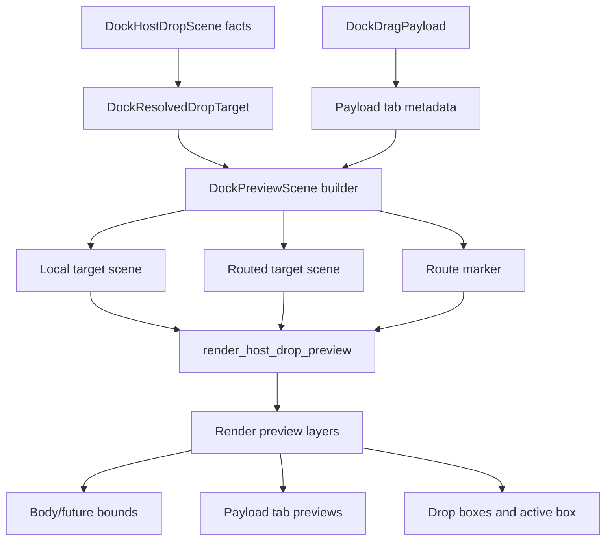
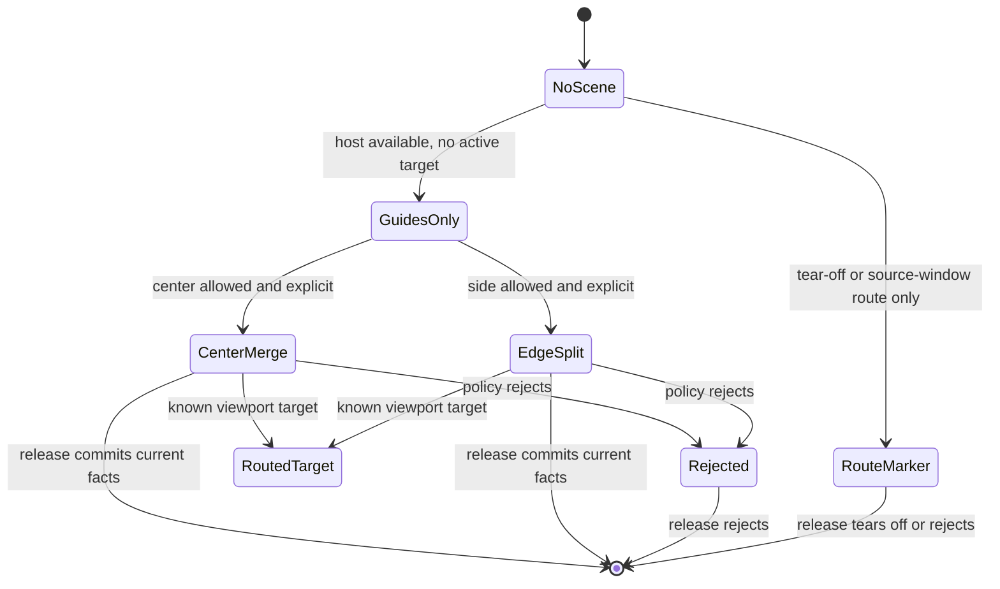

# Docking ImGui Preview Model

## Goal Capsule

- Objective: refactor docking UI/UX preview state from a flattened single-preview model into an ImGui-like preview scene model that can express merge, split, inner/outer guides, route markers, rejected state, and payload tab previews without render-layer patchwork.
- Authority hierarchy: current target resolution and viewport facts still decide delivery; preview scene state is renderable explanation, not release authority.
- Scope posture: breaking internal refactor is allowed inside `crates/gpui_docking`; obsolete flattened fields should be deleted once replacements are covered.
- Product fit: align interaction semantics and readability with Dear ImGui docking, while keeping GPUI visual language and avoiding pixel-perfect theme cloning.
- Tail ownership: preview data structures, render composition, routed preview transport, debug selectors, tests, native dogfood, and verification notes.

---

## Product Contract

### Summary

The previous target-affordance work improved the first visible layer of docking feedback, but the underlying data model is still too narrow.
`DockDropPreview` can describe one rectangle plus one optional payload tab, while ImGui's docking preview model carries a future node rectangle, center/sides availability, explicit split direction, split ratio, draw rectangles, hover state, inner/outer layer selection, and multi-tab payload previews.

This plan expands the data structure contract first, then rewires rendering and routed preview transport to consume that richer model.
The result should make center merge previews, edge split previews, root central-node side behavior, cross-window routing, rejected state, and multi-tab payload previews predictable and testable.

### Problem Frame

The current implementation has two related problems.
First, UI rendering decisions are distributed across `drop_preview.rs`, `geometry.rs`, `drop_target.rs`, `render.rs`, and viewport runtime code, so a change like "center should show a tab preview but edge should not" has to be inferred from several booleans and target kinds.
Second, several ImGui concepts have no structural home: `IsSplitDirExplicit`, `SplitRatio`, independent inner/outer preview data, `DropRectsDraw`, and payload tab lists are either absent or compressed into one field.

This makes UI/UX parity fragile.
It also makes tests overly indirect: they can assert that a debug rectangle exists, but they cannot assert that the preview scene actually distinguishes allowed center merge, explicit side split, inactive guide availability, rejected target, and route marker layering.

### Requirements

**Preview semantics**

- R1. Preview state must represent a renderable scene, not only a single target rectangle.
- R2. The scene must carry allowed/rejected state, center availability, side availability, active split direction, explicit-vs-implicit target state, split ratio, and inner/outer layer identity where applicable.
- R3. Center-like merge previews must support payload tab previews; split previews must not render payload tabs.
- R4. Root central-node side docking must prefer outer split semantics, while nested central leaves keep the current inner-side behavior that already matches the product expectation.

**Payload and routing**

- R5. Drag payload metadata must be able to describe one or more preview tabs, not only one title string.
- R6. Routed cross-window previews must carry the same preview scene shape as local previews, so target-window rendering does not fork into a weaker data contract.
- R7. Route markers for known viewport, tear-off, and rejected route remain distinct from target-owned preview scenes.

**UI/UX and maintainability**

- R8. Docking preview colors, opacities, line colors, tab-preview colors, and rejected colors must be centralized behind private theme tokens instead of scattered render constants.
- R9. Debug selectors and tests must expose semantic scene pieces: body preview, payload tab previews, drop boxes, active drop box, route marker, and rejected state.
- R10. Existing graph mutation and current-facts delivery behavior must not regress while preview structures change.

### Scope Boundaries

- In scope: `crates/gpui_docking/src/drop_preview.rs`, `crates/gpui_docking/src/drop_target.rs`, `crates/gpui_docking/src/geometry.rs`, `crates/gpui_docking/src/render.rs`, `crates/gpui_docking/src/drag.rs`, `crates/gpui_docking/src/drop_runtime.rs`, `crates/gpui_docking/src/viewport_runtime.rs`, `crates/gpui_docking/src/viewport_runtime_handle.rs`, `crates/gpui_docking/src/host_drop_scene.rs`, `crates/gpui_docking/src/viewport_drop_scene.rs`, `crates/gpui_docking/src/debug.rs`, render/interaction/viewport tests, `examples/docking-native/src/main.rs`, and `docs/verification.md`.
- Deferred to follow-up work: public theme configuration, pixel-perfect Dear ImGui styling, transparent OS payload-window rendering, full screenshot/pixel regression infrastructure, and a GPUI primitive equivalent of ImGui draw-list foreground overlays.
- Out of scope: changing docking graph persistence, reintroducing cross-frame preview authority, changing the current-facts delivery model, or rewriting panel registry ownership.
- Compatibility boundary: public crate API should not grow for this work; private structs and helpers may break freely.

### Acceptance Examples

- AE1. Given a single tab dragged over a target stack center, when the center target is active, then the target renders a body preview plus a selected-tab-like payload tab at the insertion location.
- AE2. Given a full tab stack with multiple tabs dragged over a target stack center, when the center target is active, then the target renders multiple payload tab previews in order and clips them to the target tab bar.
- AE3. Given a tab dragged over a target edge, when the side split target is active, then the target renders split preview bounds and an active side drop box, with no payload tab preview.
- AE4. Given a root central leaf and a side hover, when side docking is available, then the scene chooses an outer split layer instead of rendering both functionally identical inner and outer side guides.
- AE5. Given a nested central leaf and a side hover, when the pointer is inside that nested leaf, then the scene keeps inner side guide semantics and does not incorrectly promote the target to the root.
- AE6. Given a cross-window known-viewport target, when the target window has a valid scene, then the target window renders the same scene structure as a local hover and the source window does not show a competing target preview.
- AE7. Given a rejected target or rejected route, when the pointer enters that region, then the visual state is rejected and release leaves the graph unchanged.
- AE8. Given a small floating viewport target, when a tab is dragged to center or edge, then preview boxes clamp to usable bounds without becoming tiny unreadable artifacts.

### Dependencies

- `repo-ref/imgui/imgui.cpp:17820` for `ImGuiDockPreviewData`.
- `repo-ref/imgui/imgui.cpp:19906` for `DockNodeCalcDropRectsAndTestMousePos`.
- `repo-ref/imgui/imgui.cpp:19960` for `DockNodePreviewDockSetup`.
- `repo-ref/imgui/imgui.cpp:20048` for `DockNodePreviewDockRender`.
- `repo-ref/imgui/imgui.cpp:21449` for inner/outer preview setup and render ordering.
- `repo-ref/imgui/imgui_draw.cpp:6183` for the optional filled-rect-with-hole pattern.
- `docs/plans/2026-06-28-001-refactor-docking-viewport-authority-break-plan.md` for current-facts delivery constraints.
- `docs/plans/2026-06-29-001-refactor-docking-target-affordance-alignment-plan.md` for the first target-affordance pass.

### Outstanding Questions

None blocking.
Transparent payload-window rendering and full pixel regression coverage are intentionally deferred because the current codebase does not yet have the platform and screenshot infrastructure to make them the primary contract.

### Sources

- `repo-ref/imgui/imgui.cpp`
- `repo-ref/imgui/imgui_draw.cpp`
- `crates/gpui_docking/src/drop_preview.rs`
- `crates/gpui_docking/src/drop_target.rs`
- `crates/gpui_docking/src/geometry.rs`
- `crates/gpui_docking/src/render.rs`
- `crates/gpui_docking/src/drag.rs`
- `crates/gpui_docking/src/drop_runtime.rs`
- `crates/gpui_docking/src/viewport_runtime.rs`
- `crates/gpui_docking/src/host_render_tests.rs`
- `crates/gpui_docking/src/host_interaction_tests.rs`
- `crates/gpui_docking/src/host_viewport_runtime_tests.rs`
- `crates/gpui_docking/src/host_viewport_runtime_handle_tests.rs`

---

## Planning Contract

### Current Data Model Findings

- F1. `DockDropPreview` currently contains `bounds`, `rejected`, `payload_tab`, `target_tabs`, and `insert_index`; it does not model availability, active drop box, split ratio, inner/outer layer identity, or multiple payload tabs.
- F2. `DockDropRoutePreview` models source-window route markers separately from target preview scenes, which is useful, but routed target previews still carry the same flattened `DockDropPreview` shape.
- F3. `DockResolvedDropTarget` already knows target kind, source, drop box, preview bounds, edge sizing, edge plan, and central-region status; this is the correct input layer for a richer preview scene.
- F4. `DockDropBox` currently has `hit_bounds` and `preview_bounds`, but ImGui distinguishes hit testing from `DropRectsDraw`, so rendering needs a stable draw-rectangle field rather than borrowing hit bounds.
- F5. `DockDragPayload` stores one `title`, and routed preview APIs accept one `payload_title`; this blocks ImGui-style multi-tab payload preview for dragged tab stacks or floating roots carrying multiple tabs.
- F6. `render_host_drop_preview` has the right precedence point: local target preview, routed target preview, then route marker. The refactor should preserve that single render gateway.
- F7. Existing tests already use debug selectors and bounds inspection heavily, which is the right oracle for structural UI behavior before adding screenshot checks.

### ImGui Data Structure Parity Matrix

| ImGui preview concept | Current GPUI structure | Target GPUI structure |
| --- | --- | --- |
| `FutureNode.Rect()` main overlay | `DockDropPreview.bounds` | `DockPreviewBody { future_bounds, body_bounds, tab_bar_bounds }` |
| `IsDropAllowed` | `rejected: bool` inversion | `DockPreviewDecision { allowed, rejection_reason }` |
| `IsCenterAvailable` | inferred from target kind and guide filtering | `DockPreviewAvailability { center, sides }` |
| `IsSidesAvailable` | guide zones recomputed in render | same `DockPreviewAvailability`, produced before render |
| `IsSplitDirExplicit` | absent | `DockPreviewSplit { explicit, zone, layer }` |
| `SplitDir` | `DockResolvedDropTargetKind::InnerEdge/RootEdge` | `DockPreviewSplit.zone` |
| `SplitRatio` | implicit in edge plan and preview bounds | `DockPreviewSplit.ratio` derived from edge plan/sizing |
| `DropRectsDraw[]` | `DockDropBox.hit_bounds` reused for drawing | `DockPreviewDropBox { hit_bounds, draw_bounds, active, layer, zone }` |
| inner and outer preview data | one resolved target plus separate guides | `DockPreviewScene { layers: Vec<DockPreviewLayer> }` with explicit ordering |
| center tab preview loop | one `payload_title` | `DockPreviewPayloadTabs { tabs: Vec<DockPreviewPayloadTab>, insert_index }` |
| overlay on host and payload viewports | local preview vs route marker split | target scene plus route marker, with source preview kept quiet |
| `ImGuiCol_DockingPreview` and tab style colors | hard-coded palette helpers in `render.rs` | private `DockPreviewTheme` tokens consumed by scene rendering |
| filled host area around central node | not modeled | deferred optional `DockPreviewHole` or background mask if visual testing proves value |

### Key Technical Decisions

- KTD1. Introduce a private scene model before rendering changes. The renderer should consume `DockPreviewScene`-like data rather than continuing to infer UI state from `DockDropPreview.payload_tab` and target kinds.
- KTD2. Keep resolver facts authoritative and pure. `DockResolvedDropTarget`, `DockDropBox`, and `DockEdgeDockPlan` remain the source for scene construction; render code should not re-resolve target semantics.
- KTD3. Model inner and outer preview layers explicitly. This matches ImGui's split-inner/split-outer data and prevents root central-node side docking from depending on accidental render order.
- KTD4. Treat payload tab previews as a list. Single-tab drags are the one-item case; tab-stack and floating payloads can add more entries without changing render APIs again.
- KTD5. Keep route markers separate from target scenes. A route marker explains source-window routing or tear-off; a target scene explains an actual target host.
- KTD6. Centralize UI tokens privately. The work should remove hard-coded preview colors from scattered helpers, but it should not expose public theme API until the docking visual language stabilizes.
- KTD7. Delete obsolete flattened fields after migration. Compatibility wrappers are allowed only inside one implementation unit; the final state should not carry both scene fields and old booleans indefinitely.

### High-Level Technical Design

### Sequencing

1. Add characterization tests that describe the current ImGui parity gaps without changing production behavior.
2. Introduce the preview scene model and convert local target previews first.
3. Move geometry draw rectangles and active drop-box state into scene data.
4. Expand payload metadata and render multi-tab center previews.
5. Update routed preview transport to carry the same scene structure.
6. Centralize theme tokens and rendering order.
7. Delete old flattened fields and update dogfood documentation.

### Risks And Mitigations

| Risk | Impact | Mitigation |
| --- | --- | --- |
| Scene model duplicates resolver logic | High | Build scenes only from `DockResolvedDropTarget`, `DockDropBox`, and existing scene facts; keep policy validation in resolver paths. |
| Multi-tab preview requires titles not currently available at drag start | Medium | Add a payload-preview metadata builder close to the graph/registry boundary and fall back to the current title only when enumeration is impossible. |
| Routed preview transport grows too wide | Medium | Carry one scene DTO instead of parallel title/bounds/kind fields; keep route marker as a separate lightweight DTO. |
| Inner/outer layer rendering regresses root central behavior | High | Add tests for root central leaf, nested central leaf, outer guide selection, and render ordering before deleting old paths. |
| Visual token refactor becomes public styling work | Medium | Keep tokens private and route public theming to follow-up work. |
| Tests assert brittle colors | Low | Prefer semantic selectors and bounds; color assertions are limited to palette unit tests where tokens are intentionally stable. |

---

## Implementation Units

### U1. Characterize preview-scene gaps against ImGui behavior

- **Goal:** add focused tests that lock the intended scene-level behavior before changing the data structures.
- **Requirements:** R1, R2, R3, R4, R8, R9, R10.
- **Dependencies:** None.
- **Files:** `crates/gpui_docking/src/host_render_tests.rs`, `crates/gpui_docking/src/host_interaction_tests.rs`, `crates/gpui_docking/src/host_viewport_runtime_tests.rs`, `crates/gpui_docking/src/host_viewport_runtime_handle_tests.rs`, `crates/gpui_docking/src/drop_preview.rs`, `crates/gpui_docking/src/geometry.rs`.
- **Approach:** add or tighten tests for center merge, edge split, root central outer side docking, nested central inner side docking, cross-window target preview, rejected preview, and small floating target bounds. These tests should assert debug regions, bounds, active/inactive guide presence, and graph non-mutation for rejected paths.
- **Execution note:** start with tests that expose the missing scene concepts, even if some fail before the refactor.
- **Patterns to follow:** existing debug selector tests in `crates/gpui_docking/src/host_render_tests.rs` and routed preview tests in `crates/gpui_docking/src/host_viewport_runtime_handle_tests.rs`.
- **Test scenarios:** center hover emits body and payload tab preview; edge hover emits split preview with no payload tab; root central side hover emits outer guide and not inner side guide; nested central side hover keeps inner guide; rejected target has rejected state and no graph mutation; known-viewport target renders preview only in the target host.
- **Verification:** the new tests describe scene semantics directly enough that later units can replace internals without weakening coverage.

### U2. Introduce a private DockPreviewScene model

- **Goal:** create the internal data structure that represents ImGui-like preview state independently of rendering.
- **Requirements:** R1, R2, R3, R4, R9.
- **Dependencies:** U1.
- **Files:** `crates/gpui_docking/src/drop_preview.rs`, `crates/gpui_docking/src/drop_target.rs`, `crates/gpui_docking/src/geometry.rs`, `crates/gpui_docking/src/lib.rs`.
- **Approach:** add a private scene model in `drop_preview.rs` or a new private module if the file becomes too broad. The model should include scene kind, decision, layers, body bounds, drop boxes, active split data, target tabs, insert index, and route-marker separation. Keep conversion methods from `DockDropResolution` and `DockResolvedDropTarget` while old render callers are migrated.
- **Patterns to follow:** `DockDropPreview::from_resolution`, `DockResolvedDropTarget::zone`, and ImGui's `ImGuiDockPreviewData` fields around `repo-ref/imgui/imgui.cpp:17820`.
- **Test scenarios:** valid center target builds a scene with center availability and payload-tab capability; valid edge target builds a split scene with zone and ratio; rejected target builds an allowed=false decision with rejected visual state; empty dock space builds a center-like scene without target tabs; root edge builds an outer layer.
- **Verification:** scene construction tests pass without requiring GPUI rendering, and render code still compiles through temporary compatibility adapters.

### U3. Move drop-box draw geometry and active state into scene data

- **Goal:** make guide and drop-box rendering consume explicit hit and draw rectangles instead of recomputing them in `render.rs`.
- **Requirements:** R2, R4, R8, R9, R10.
- **Dependencies:** U2.
- **Files:** `crates/gpui_docking/src/geometry.rs`, `crates/gpui_docking/src/drop_target.rs`, `crates/gpui_docking/src/drop_preview.rs`, `crates/gpui_docking/src/render.rs`, `crates/gpui_docking/src/host_render_tests.rs`.
- **Approach:** extend the geometry bridge so scene drop boxes carry `hit_bounds`, `draw_bounds`, `preview_bounds`, `zone`, `layer`, and `active`. Keep ImGui's distinction that draw rectangles may differ from hit-test rectangles. Replace render-time `drop_guide_box_for_zone` decisions with scene-provided drop boxes where practical.
- **Patterns to follow:** `geometry::drop_boxes_with_style`, `DockNodeCalcDropRectsAndTestMousePos` in `repo-ref/imgui/imgui.cpp:19906`, and existing guide bounds assertions.
- **Test scenarios:** center, inner side, and outer side boxes expose both hit and draw bounds; active drop box matches the resolved target zone; root central side uses outer draw boxes; small bounds clamp draw boxes without zero-size output.
- **Verification:** tests can assert active/inactive drop boxes from scene data before the renderer draws them.

### U4. Expand payload preview metadata to support multiple tabs

- **Goal:** support ImGui-style payload tab preview lists for dragged tab stacks and floating roots.
- **Requirements:** R3, R5, R8, R9.
- **Dependencies:** U2.
- **Files:** `crates/gpui_docking/src/drag.rs`, `crates/gpui_docking/src/drop_preview.rs`, `crates/gpui_docking/src/render.rs`, `crates/gpui_docking/src/drop_runtime.rs`, `crates/gpui_docking/src/host_interaction_tests.rs`, `crates/gpui_docking/src/host_viewport_runtime_tests.rs`.
- **Approach:** add private payload-preview metadata that can enumerate tab labels for item, tabs-stack, and floating payload kinds. Keep payload identity independent from preview labels, preserving the existing identity test that ignores title changes. The first implementation may derive titles from graph and registry facts available to the host; it should fall back to the current single title only when enumeration is not available.
- **Patterns to follow:** `DockDragPayload::identity`, `DockDragPayload::as_workspace_payload`, and ImGui's payload tab loop in `DockNodePreviewDockRender`.
- **Test scenarios:** single item payload yields one preview tab; tabs-stack payload yields one preview tab per source tab; floating payload carrying a tabs node yields multiple preview tabs; preview label changes do not affect drag-session identity; edge split scenes ignore payload tab metadata.
- **Verification:** center preview tests can count payload tab preview regions or scene entries without depending on a single title string.

### U5. Render scenes with ImGui-like layer ordering and private theme tokens

- **Goal:** make target preview rendering consume scene data with consistent visual hierarchy.
- **Requirements:** R1, R2, R3, R6, R7, R8, R9.
- **Dependencies:** U2, U3, U4.
- **Files:** `crates/gpui_docking/src/render.rs`, `crates/gpui_docking/src/debug.rs`, `crates/gpui_docking/src/host_render_tests.rs`, `crates/gpui_docking/src/host_interaction_tests.rs`.
- **Approach:** replace `render_target_drop_preview` and `render_drop_guides` internals with scene rendering. Draw main body preview first, then payload tabs for center merge, then drop boxes with active hover emphasis. Render inner before outer where both layers exist so outer drop boxes remain legible, matching ImGui's ordering. Introduce private theme tokens for main overlay, drop boxes, active drop boxes, lines, tabs, route markers, and rejected state.
- **Patterns to follow:** `DockNodePreviewDockRender` in `repo-ref/imgui/imgui.cpp:20048`, existing `drop_preview_tab_layout`, and the private palette tests near the bottom of `render.rs`.
- **Test scenarios:** center scenes render body plus tabs; edge scenes render body plus active drop box and no tabs; outer layer draws after inner layer; rejected scene uses rejected tokens; route marker tokens remain distinct from target-scene tokens.
- **Verification:** semantic render tests pass through debug selectors and bounds, and palette unit tests prove token distinctions without requiring screenshot baselines.

### U6. Carry DockPreviewScene through routed preview transport

- **Goal:** make cross-window target previews use the same scene model as local previews.
- **Requirements:** R1, R5, R6, R7, R9, R10.
- **Dependencies:** U2, U3, U4, U5.
- **Files:** `crates/gpui_docking/src/viewport_runtime.rs`, `crates/gpui_docking/src/viewport_runtime_handle.rs`, `crates/gpui_docking/src/viewport_drop_scene.rs`, `crates/gpui_docking/src/host_drop_scene.rs`, `crates/gpui_docking/src/drop_preview.rs`, `crates/gpui_docking/src/host_viewport_runtime_tests.rs`, `crates/gpui_docking/src/host_viewport_runtime_handle_tests.rs`.
- **Approach:** replace routed preview payload fields that only carry `DockDropPreview` plus one title with a routed target scene DTO. Keep `DockDropRoutePreview` for source-window route markers. Ensure scene transport remains current-facts-only and does not recreate accepted-preview authority.
- **Patterns to follow:** `viewport_runtime.rs` routed preview storage, `render_host_drop_preview` precedence, and the current-facts plan in `docs/plans/2026-06-28-001-refactor-docking-viewport-authority-break-plan.md`.
- **Test scenarios:** local and routed center previews produce equivalent scene shape; routed edge preview carries split data and no payload tabs; routed multi-tab payload carries all tab preview entries; clearing or replacing a viewport clears the routed scene; source window route marker remains separate.
- **Verification:** cross-window tests assert scene shape and render selectors in the target window, while source-window previews stay quiet except for route markers.

### U7. Delete flattened preview fields and compatibility adapters

- **Goal:** remove obsolete preview data paths after local and routed rendering have moved to scenes.
- **Requirements:** R1, R2, R5, R6, R9, R10.
- **Dependencies:** U5, U6.
- **Files:** `crates/gpui_docking/src/drop_preview.rs`, `crates/gpui_docking/src/render.rs`, `crates/gpui_docking/src/viewport_runtime.rs`, `crates/gpui_docking/src/viewport_runtime_handle.rs`, `crates/gpui_docking/src/debug.rs`.
- **Approach:** delete or shrink `DockDropPreview` fields that are superseded by scene data, including `payload_tab` and single-title assumptions. Remove render compatibility adapters, stale palette helpers, and route APIs that still expose the flattened model. Keep only names that remain semantically true.
- **Patterns to follow:** the deletion posture from `docs/plans/2026-06-28-001-refactor-docking-viewport-authority-break-plan.md`.
- **Test scenarios:** production search finds no render path branching on old `payload_tab`; routed preview APIs do not accept only a single title when a scene is available; tests construct scenes through the new builders; no stale compatibility wrapper is exported from `lib.rs`.
- **Verification:** the crate compiles with the old flattened contract removed, and tests continue to pass through scene assertions.

### U8. Update native dogfood and verification docs

- **Goal:** make the expanded UI/UX contract easy to inspect manually and durable for future agents.
- **Requirements:** R7, R8, R9, R10.
- **Dependencies:** U5, U6, U7.
- **Files:** `examples/docking-native/src/main.rs`, `docs/verification.md`, `crates/gpui_docking/src/host_interaction_tests.rs`, `crates/gpui_docking/src/host_viewport_runtime_handle_tests.rs`.
- **Approach:** ensure the native example still exposes main-window center merge, main-window edge split, root central side docking, nested central side docking, floating tear-off, floating-to-main docking, multi-tab payload preview, and rejected targets. Update `docs/verification.md` with expected visual states and known deferred limitations.
- **Patterns to follow:** the existing native example and the manual dogfood command documented in prior verification notes.
- **Test scenarios:** native example compiles; manual flows can reach every acceptance example; log output remains useful for target and route resolution but is not the primary oracle; rejected and tear-off cases are distinguishable by UI and logs.
- **Verification:** `cargo check -p open-gpui-docking-native` passes and the manual checklist covers all scene states introduced by the plan.

---

## Verification Contract

| Gate | Command | What it proves |
| --- | --- | --- |
| Formatting | `cargo fmt --all --check` | Rust formatting stays clean across docking and native example edits. |
| Docking tests | `cargo nextest run -p open-gpui-docking --no-fail-fast` | scene model, local render, routed render, and current-facts delivery remain coherent. |
| Native example compile | `cargo check -p open-gpui-docking-native` | the dogfood surface still builds with the refactored preview APIs. |
| Mac platform compile if touched | `cargo check -p open-gpui-macos` | display/window changes remain isolated if implementation touches platform preview behavior. |
| Diff hygiene | `git diff --check` | no whitespace or patch hygiene regressions. |
| Manual dogfood | `RUST_LOG=info,open_gpui_docking=debug,open_gpui=info RUST_BACKTRACE=1 cargo run -p open-gpui-docking-native --bin open-gpui-docking-native` | center, edge, root, nested, routed, tear-off, rejected, and multi-tab preview states are inspectable. |

---

## Definition of Done

- `DockPreviewScene` or an equivalent private model replaces flattened preview rendering decisions for local and routed target previews.
- Center/sides availability, active split direction, explicit split state, split ratio, inner/outer layer identity, and drop-box draw bounds are represented before render.
- Payload tab previews support one or more tabs, and edge split previews do not render payload tabs.
- Route markers remain separate from target scenes and do not compete with target-window previews.
- Preview theme tokens are centralized privately, with tests for valid, active, rejected, known-viewport, and tear-off distinctions.
- Obsolete flattened fields and compatibility adapters are removed after migration.
- Tests cover local render, routed render, geometry, payload metadata, root central behavior, nested central behavior, rejected state, and current-facts delivery non-regression.
- The native example and verification docs describe the expanded UI/UX behavior and known deferred limitations.
