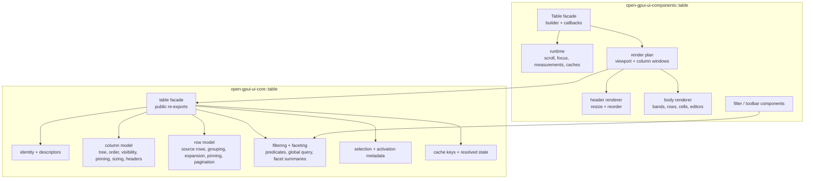

# Open GPUI Table Depth Second Stage - Plan

## Goal Capsule

Refactor the official Table stack after the component-library foundation work so its modules are deep: callers keep a small stable interface, while row-model, column-model, filtering, faceting, sizing, virtualization, runtime, and render assembly complexity live behind clear seams.

The plan is intentionally breaking inside pre-launch internals. Public behavior and documented Table capabilities should be preserved unless a narrower interface removes accidental exposure.

Authority order:

1. ADR 0008 and ADR 0009 keep `open-gpui-ui-core` as renderer-neutral policy and `open-gpui-ui-components` as GPUI adapter.
2. `docs/ui/component-contract.md` is the current public Table contract.
3. Existing focused Table tests and gallery smokes are the behavior characterization baseline.
4. This plan owns the second-stage module split and cleanup.

Success means `crates/ui_core/src/table.rs` and `crates/ui_components/src/table/mod.rs` stop acting as catch-all implementations. They become facades over concern-owned modules without weakening the current Table feature set, gallery proofs, or export contract.

---

## Product Contract

### Summary

The first Table depth work made the official Table semantically rich: grouping, expansion, faceting, pinned columns, pinned rows, editing, resizing, and virtualized rendering all exist and are covered by tests. The remaining friction is not missing product behavior; it is concentration. The core table module and GPUI adapter facade still expose too much implementation locality through single files, which makes future changes harder to review, harder for agents to navigate, and easier to regress during refactors.

### Problem Frame

`crates/ui_core/src/table.rs` is roughly nine thousand lines and owns row identity, column descriptors, sizing, headers, filtering, faceting, row models, grouping, expansion, aggregation, selection, pagination, cache keys, and tests in one module. Deleting the module would spread real complexity across callers, so the module itself is valuable; the problem is that it has too many internal responsibilities behind one maintenance surface.

`crates/ui_components/src/table/mod.rs` is still over six thousand lines after the first split. It contains filter UI components, column visibility UI, toolbar UI, table runtime, public `Table` builder, render-plan resolution, header/body rendering, resize and reorder handlers, row keyboard behavior, scroll handling, and adapter tests. Several helper submodules now exist, but the facade still owns enough code that local changes require scanning unrelated behavior.

### Requirements

**Core Table module depth**

- R1. Preserve the ADR 0008/0009 crate boundary: renderer-neutral Table semantics stay in `open-gpui-ui-core`; GPUI runtime, window events, scroll handles, focus handles, and concrete elements stay in `open-gpui-ui-components`.
- R2. Split `ui_core::table` into concern-owned internal modules while preserving explicit crate-root and prelude re-exports.
- R3. Keep `TableState` as the main public core interface; move row-model, column-model, filtering/faceting, sizing, grouping/expansion, selection, and cache implementation behind private or narrowly public modules.
- R4. Preserve the current row-model pipeline, cache-key semantics, stable row and column identities, duplicate-row reporting, grouping/expansion lookup behavior, pinned-row and pinned-column region semantics, faceting metadata, and built-in aggregation outputs.

**GPUI Table adapter depth**

- R5. Keep `open_gpui_ui_components::Table` and the filter/toolbar component names as public facades while splitting their implementations by module responsibility.
- R6. Separate Table runtime ownership from render assembly: scroll handles, focus handles, expansion overrides, row measurement cache, content-fit cache, selection anchor, and resolved-state cache should be understandable without reading the body renderer.
- R7. Separate adapter rendering into header, body, cell editors, resize/reorder affordances, row bands, and scroll containment modules.
- R8. Preserve all current debug selectors, accessibility roles, controlled callback payloads, lazy gallery behavior, and local scroll containment.

**Verification and cleanup**

- R9. Move or split tests only when it improves locality. Behavior coverage must remain at least as strong as the current focused Table gates.
- R10. Remove obsolete pass-through helpers, stale aliases, and accidental internal re-exports revealed by the split.
- R11. Update documentation only where module ownership or verification commands become clearer; do not invent new Table product promises in this refactor.

### Acceptance Examples

- AE1. A contributor can inspect row-model behavior by opening a `ui_core::table` row-model module and its tests without reading column resizing, faceting UI, or GPUI rendering code.
- AE2. A contributor can inspect pinned column region resolution by opening a column-model or layout module without reading row expansion or editor rendering code.
- AE3. A contributor can inspect GPUI row measurement and resolved-state caching without reading filter popover UI or table cell editor recipes.
- AE4. The public `open_gpui_ui_core::prelude` and `open_gpui_ui_components::prelude` exports remain explicit and continue to expose the same intended Table surface.
- AE5. Existing Table gallery smokes still prove local scroll containment, pinned regions, row pinning, manual expansion, faceting, editing, resizing, and center-column windowing after the file split.

### Scope Boundaries

In scope:

- `crates/ui_core/src/table.rs`
- New `crates/ui_core/src/table/` internal modules
- `crates/ui_core/src/lib.rs`
- `crates/ui_core/src/prelude.rs`
- `crates/ui_components/src/table/mod.rs`
- Existing `crates/ui_components/src/table/` modules and new sibling modules
- `crates/ui_components/src/lib.rs`
- `crates/ui_components/src/prelude.rs`
- `crates/ui_components/tests/components.rs`
- `examples/ui-foundation-gallery/tests/foundation_gallery.rs`
- `docs/ui/component-contract.md`
- `docs/verification.md`

Deferred to follow-up work:

- New Table product behavior such as synthetic summary rows, richer editor families, custom aggregation callbacks, dataset-wide exact autosizing, sticky header redesign, or full two-axis grid virtualization.
- Standalone headless crate extraction.
- A delegate-based data-source adapter. This refactor may leave a seam ready for it, but should not introduce `TableDelegate` unless implementation proves a real second adapter.
- Splitting unrelated large components such as Tree, Menu, Command, or TextInput.
- Rewriting the gallery samples beyond what is needed to preserve Table coverage.

---

## Planning Contract

### Key Technical Decisions

- KTD1. Split by stable Table concepts, not by line count. The target modules are row identity/model, column model/header/sizing, filtering/faceting, selection, expansion/grouping, virtualization/windowing, render plan, runtime, and concrete GPUI rendering.
- KTD2. Keep public interfaces narrow during the split. `TableState`, `TableRenderPlan`, `Table`, and the existing filter components remain the main interfaces; new modules should be private by default and re-exported only when downstream callers need them.
- KTD3. Characterize before moving behavior. Units that move large core or adapter behavior should first pin the existing behavior with focused tests or keep existing tests green during mechanical moves.
- KTD4. Prefer moving complete responsibility clusters over layering wrappers. A new module passes the deletion test only if deleting it would push real complexity back into multiple places.
- KTD5. Defer delegate extraction. ADR 0009 and the foundation plan both keep the current crate boundary; one GPUI adapter is still the only concrete adapter, so a delegate interface remains hypothetical unless the split reveals a second real adapter need.

### High-Level Technical Design



The core seam remains `TableState::resolve()` and the resolved types it returns. Internal modules should make that resolution readable by concept rather than by file position.

The adapter seam remains `Table::render_plan()` for pure planning and `Table` rendering for GPUI. Runtime modules may own GPUI state, but renderer-neutral decisions must continue to flow from `TableState` and `TableRenderPlan`.

### Alternative Approaches Considered

| Approach | Pros | Cons | Decision |
|---|---|---|---|
| Keep the current files and add comments | Lowest immediate churn | Does not improve locality, test navigation, or future agent reliability | Rejected |
| Extract a new headless crate now | Creates an obvious public package boundary | Contradicts ADR 0008/0009 and freezes interfaces before a second adapter exists | Rejected |
| Split only the GPUI adapter | Reduces the largest rendered component file | Leaves `ui_core::table` as the hardest long-term semantic module | Rejected |
| Split core and adapter by responsibility | Improves locality while preserving current crate boundary | Requires careful export and test migration | Chosen |

### System-Wide Impact

This refactor affects the main Table interface that downstream component users import. The goal is module ownership cleanup with no product behavior regression. Because Table is heavily represented in gallery smokes, test runtime may stay high; implementation should avoid expanding gallery smoke coverage unless a moved responsibility loses coverage.

### Risks and Mitigations

| Risk | Severity | Mitigation |
|---|---|---|
| Mechanical moves accidentally change public exports | High | Keep explicit export tests and run `public_reexports_stay_explicit_without_wildcards`, `crate_root_and_prelude_exports_remain_explicit`, and Table-specific export tests after each public-surface unit |
| Core module split hides behavior changes behind moved code | High | Use characterization-first units and focused `open-gpui-ui-core table` nextest before broader checks |
| Adapter split creates circular imports between runtime, render plan, and body rendering | Medium | Put shared adapter types in a small `types` or `runtime` module; keep render modules depending inward on plans rather than back on `Table` |
| Test file split creates churn without improving coverage | Medium | Split tests only by behavior family when it improves locality; otherwise leave integration tests in place and add unit tests beside new modules |
| New modules become shallow pass-throughs | Medium | Apply the deletion test before committing each module; merge or inline modules that only rename calls without owning responsibility |

---

## Implementation Units

### U1. Core Table Module Scaffold And Characterization

- **Goal:** Convert `ui_core::table` from a single-file module into a directory module with explicit responsibility seams and no behavior changes.
- **Requirements:** R1, R2, R4, R9
- **Dependencies:** None
- **Files:**
  - Move `crates/ui_core/src/table.rs` to `crates/ui_core/src/table/mod.rs`
  - Delete `crates/ui_core/src/table.rs`
  - Create `crates/ui_core/src/table/mod.rs`
  - Create `crates/ui_core/src/table/identity.rs`
  - Create `crates/ui_core/src/table/columns.rs`
  - Create `crates/ui_core/src/table/rows.rs`
  - Create `crates/ui_core/src/table/filtering.rs`
  - Create `crates/ui_core/src/table/faceting.rs`
  - Create `crates/ui_core/src/table/selection.rs`
  - Create `crates/ui_core/src/table/row_model.rs`
  - Create `crates/ui_core/src/table/resolved.rs`
  - Modify `crates/ui_core/src/lib.rs`
  - Modify `crates/ui_core/src/prelude.rs`
- **Approach:** Move the existing file to `table/mod.rs`, then split only enough type clusters to establish stable modules. Keep re-exports explicit from `table/mod.rs` so downstream import paths do not change. Do not leave a sibling `table.rs`; Rust should resolve the module through `table/mod.rs` only. Do not rename public types in this unit.
- **Execution note:** Characterization-first. Run the existing core Table tests before moving logic and again after the scaffold compiles.
- **Patterns to follow:** `crates/ui_components/src/table/mod.rs` plus its existing `content_fit.rs`, `layout.rs`, `render_plan.rs`, and `virtualization.rs` submodules.
- **Test scenarios:**
  - Existing `open-gpui-ui-core table` tests pass before and after the module scaffold.
  - Public imports through `open_gpui_ui_core::TableState`, `open_gpui_ui_core::table::TableState`, and `open_gpui_ui_core::prelude::TableState` still compile.
  - The row-model pipeline constants keep their current labels and ordering.
- **Verification:** Core Table behavior is unchanged and the new module tree compiles without wildcard public re-export drift.

### U2. Core Column, Header, And Sizing Ownership

- **Goal:** Concentrate column descriptors, column tree normalization, visibility, ordering, pinning, sizing, resize math, region splitting, and header group resolution in column-owned modules.
- **Requirements:** R2, R3, R4, R10
- **Dependencies:** U1
- **Files:**
  - Modify `crates/ui_core/src/table/mod.rs`
  - Modify `crates/ui_core/src/table/columns.rs`
  - Create `crates/ui_core/src/table/headers.rs`
  - Create `crates/ui_core/src/table/sizing.rs`
  - Modify `crates/ui_core/src/prelude.rs`
  - Modify `crates/ui_components/tests/components.rs`
- **Approach:** Move column model and header resolution code as complete clusters. Keep `TableColumn`, `TableColumnNode`, `TableColumnGroup`, `TableColumnSizing`, `TableColumnPinning`, `TableColumnRegions`, `TableResolvedHeaderCell`, and resize helpers public through the same facades.
- **Patterns to follow:** Existing `resolve_column_region_render_plans` in `crates/ui_components/src/table/layout.rs` should remain adapter-side; renderer-neutral region and sizing calculations belong in core.
- **Test scenarios:**
  - Nested header groups preserve placeholder ids and child relationships.
  - Visibility, order, pinning, and sizing still resolve left, center, and right column regions without duplicates.
  - Resize drag and end helpers keep clamping, RTL direction, on-change, and on-end semantics.
  - Existing export tests still prove explicit crate-root and prelude Table exports.
- **Verification:** Column and header behavior can be tested through core types without reading row-model code.

### U3. Core Row Model, Filtering, Faceting, And Selection Ownership

- **Goal:** Move row-model stages and row-facing policy into modules with high locality while keeping `TableState::resolve()` as the public interface.
- **Requirements:** R2, R3, R4, R9, R10
- **Dependencies:** U1, U2
- **Files:**
  - Modify `crates/ui_core/src/table/mod.rs`
  - Modify `crates/ui_core/src/table/rows.rs`
  - Modify `crates/ui_core/src/table/row_model.rs`
  - Modify `crates/ui_core/src/table/filtering.rs`
  - Modify `crates/ui_core/src/table/faceting.rs`
  - Modify `crates/ui_core/src/table/selection.rs`
  - Create `crates/ui_core/src/table/grouping.rs`
  - Create `crates/ui_core/src/table/aggregation.rs`
  - Create `crates/ui_core/src/table/cache.rs`
- **Approach:** Move source row descriptors, tree metadata, grouped rows, expansion, filtering, global query, facet summaries, aggregation, row pinning, pagination, selection summary, and cache-key logic into cohesive modules. `TableState` should orchestrate modules rather than contain every helper below its impl.
- **Patterns to follow:** Existing tests in `crates/ui_core/src/table.rs` around filtering, grouping, expansion, row pinning, faceting, and cache keys.
- **Test scenarios:**
  - Filtering, global query, sorting, grouping, expansion, pagination, and final row models keep their current stage outputs.
  - Collapsed and manually loaded tree branches preserve lookup metadata and child-load state.
  - Client and manual faceting preserve per-column and global summaries.
  - Selection summaries keep page/full-scope semantics after row-model changes.
  - Cache keys still change for row topology, filters, facets, grouping, expansion, pinning, sizing, and manual stage modes.
- **Verification:** A maintainer can modify row-model behavior in row-owned modules and rely on focused core tests for the full pipeline.

### U4. Adapter Public Facades, Filter Components, And Toolbar Split

- **Goal:** Split non-Table-renderer UI components currently living in the Table adapter facade into their own modules without changing public names.
- **Requirements:** R5, R8, R9, R10
- **Dependencies:** U1
- **Files:**
  - Modify `crates/ui_components/src/table/mod.rs`
  - Modify `crates/ui_components/src/table/filtering.rs`
  - Create `crates/ui_components/src/table/faceted_filter.rs`
  - Create `crates/ui_components/src/table/range_filter.rs`
  - Create `crates/ui_components/src/table/predicate_filter.rs`
  - Create `crates/ui_components/src/table/column_visibility.rs`
  - Create `crates/ui_components/src/table/toolbar.rs`
  - Modify `crates/ui_components/src/lib.rs`
  - Modify `crates/ui_components/src/prelude.rs`
  - Modify `crates/ui_components/tests/components.rs`
- **Approach:** Move `TableFacetedFilter`, `TableRangeFilter`, `TablePredicateFilter`, `TableColumnVisibility`, `TableGlobalFilter`, and `TableToolbar` types and renderers into named modules. Keep shared filter parsing and label helpers in `filtering.rs` only if they serve multiple modules.
- **Execution note:** Characterization-first for public component inventory and debug selectors.
- **Patterns to follow:** `crates/ui_components/src/command/mod.rs` plus `command/render_plan.rs` and `command/runtime.rs` for facade-plus-submodule shape.
- **Test scenarios:**
  - Component API inventory still classifies Table filter components and callback payloads.
  - Existing faceted, range, predicate, global filter, column visibility, and toolbar state tests pass with unchanged names.
  - Stable debug selectors for filter popovers and column visibility rows remain unchanged.
  - Crate-root and prelude exports stay explicit without wildcard exports.
- **Verification:** Table filter and toolbar components can be maintained without opening the Table body renderer.

### U5. Adapter Runtime And Render-Plan Split

- **Goal:** Isolate GPUI Table runtime ownership and pure render-plan resolution from concrete element rendering.
- **Requirements:** R5, R6, R8, R9
- **Dependencies:** U2, U3, U4
- **Files:**
  - Modify `crates/ui_components/src/table/mod.rs`
  - Modify `crates/ui_components/src/table/render_plan.rs`
  - Modify `crates/ui_components/src/table/virtualization.rs`
  - Modify `crates/ui_components/src/table/content_fit.rs`
  - Create `crates/ui_components/src/table/runtime.rs`
  - Create `crates/ui_components/src/table/resolve.rs`
  - Modify `crates/ui_components/tests/components.rs`
- **Approach:** Move `TableRuntime`, `TableResolvedCache`, runtime sync methods, row measurement cache integration, expansion override application, content-fit measurement use, and `render_plan_with_runtime` style resolution into modules that can be read independently. Keep `Table::render_plan()` as the public pure-planning interface.
- **Patterns to follow:** `crates/ui_components/src/command/runtime.rs` separates command runtime from command render plan.
- **Test scenarios:**
  - Runtime cache invalidates when `TableState` cache key changes.
  - Measured-row height feedback still reflows after paint without resetting unrelated runtime state.
  - Content-fit measurements still widen only content-fit columns and preserve committed widths.
  - Virtualizer snapshots restore measurements without overriding live scroll.
  - Manual expansion override still emits controlled payloads and then reflects caller-owned state.
- **Verification:** Runtime state can be reviewed without scanning header/body element construction.

### U6. Adapter Header, Body, Cell Editor, And Scroll Rendering Split

- **Goal:** Move GPUI element assembly into rendering modules by visual responsibility while preserving debug selectors, roles, and event behavior.
- **Requirements:** R5, R7, R8, R9
- **Dependencies:** U5
- **Files:**
  - Modify `crates/ui_components/src/table/mod.rs`
  - Create `crates/ui_components/src/table/header.rs`
  - Create `crates/ui_components/src/table/body.rs`
  - Create `crates/ui_components/src/table/cell.rs`
  - Create `crates/ui_components/src/table/editors.rs`
  - Create `crates/ui_components/src/table/resize.rs`
  - Modify `crates/ui_components/src/table/interaction.rs`
  - Modify `crates/ui_components/tests/components.rs`
  - Modify `examples/ui-foundation-gallery/tests/foundation_gallery.rs`
- **Approach:** Move header group rendering, resize handles, reorder drop zones, row bands, row rendering, body cells, tree toggles, cell editor recipes, row keyboard actions, and vertical wheel handling into modules. Shared event payload types remain in `interaction.rs` unless a more precise module owns them.
- **Patterns to follow:** Existing `table/layout.rs` and `table/render_plan.rs` already own non-element calculations; new render modules should consume those plans rather than recompute state.
- **Test scenarios:**
  - Header click still emits sort action payloads.
  - Header drag still emits controlled column order changes.
  - Resize handles still emit on-change and on-end sizing changes.
  - Text, checkbox, select, and multiline editors still emit `TableCellEditChange` without row activation.
  - Pinned left/right lanes and center column windows keep existing debug selectors and scroll containment.
  - Row keyboard navigation still reveals off-window center rows without moving the outer gallery page.
- **Verification:** The body renderer no longer owns header, runtime cache, or filter UI code.

### U7. Test Locality, Documentation, And Removal Pass

- **Goal:** Close the refactor by improving test locality, documenting the new ownership, and deleting obsolete glue introduced during the split.
- **Requirements:** R9, R10, R11
- **Dependencies:** U1, U2, U3, U4, U5, U6
- **Files:**
  - Modify `crates/ui_components/tests/components.rs`
  - Optionally create `crates/ui_components/tests/table.rs`
  - Modify `examples/ui-foundation-gallery/tests/foundation_gallery.rs`
  - Modify `docs/ui/component-contract.md`
  - Modify `docs/verification.md`
- **Approach:** Split tests only where a new file materially improves locality. Keep cross-component inventory tests in `components.rs` if they validate shared export contracts. Update docs to explain Table module ownership and focused verification gates. Remove transitional wrappers, unused imports, stale compatibility language, and private pass-through helpers that fail the deletion test.
- **Patterns to follow:** Existing verification section for Table focused proofs.
- **Test scenarios:**
  - Focused Table nextest filters still find the same behavior families.
  - Public export and inventory tests still protect the official Table surface.
  - Documentation names the module ownership without promising new product behavior.
  - `rg` scans find no stale references to the old single-file `crates/ui_components/src/table.rs` path except historical plan text.
- **Verification:** Full plan gates pass and the final diff removes accidental complexity instead of adding wrapper layers.

---

## Verification Contract

Focused checks:

```powershell
cargo fmt -p open-gpui-ui-core -p open-gpui-ui-components -p open-gpui-ui-foundation-gallery
cargo check -p open-gpui-ui-core --tests
cargo check -p open-gpui-ui-components --tests
cargo nextest run -p open-gpui-ui-core table
cargo nextest run -p open-gpui-ui-components table
cargo nextest run -p open-gpui-ui-foundation-gallery table
```

Public surface and gallery checks:

```powershell
cargo nextest run -p open-gpui-ui-components public_reexports_stay_explicit_without_wildcards crate_root_and_prelude_exports_remain_explicit table_public_exports_include_core_table_and_virtualizer_contracts component_api_inventory_uses_stable_ownership_vocabulary
cargo nextest run -p open-gpui-ui-foundation-gallery components_page_samples_expose_component_metadata components_page_conformance_gates_reference_core_and_gallery_contracts components_gallery_smoke_focused_table_scroll_stays_inside_sample components_gallery_smoke_grouped_table_pinned_center_scroll_stays_inside_sample components_gallery_smoke_matrix_table_center_column_window_stays_inside_sample components_gallery_smoke_row_pinning_table_scroll_stays_inside_sample
```

Full gate:

```powershell
cargo run -p xtask -- verify
```

The implementer may run smaller focused tests after each unit, but the full gate is required before considering the plan complete.

---

## Definition of Done

- `crates/ui_core/src/table.rs` is replaced by `crates/ui_core/src/table/mod.rs` plus concern-owned modules.
- `crates/ui_components/src/table/mod.rs` is a facade over filter components, runtime, render plan, header/body/cell rendering, interaction, layout, virtualization, content-fit, and metrics modules.
- `TableState`, `TableRenderPlan`, `Table`, Table filter components, callback payloads, and documented Table exports remain available through intended crate-root, module, and prelude paths.
- Current Table behavior is preserved: row-model ordering, filtering, sorting, grouping, expansion, faceting, aggregation, pinned columns, pinned rows, column sizing, column reorder, editing, measured rows, content-fit, virtualized center windows, scroll containment, and gallery metadata.
- Tests are closer to the modules they verify where useful, without weakening cross-surface export and inventory coverage.
- Documentation and verification notes reflect the new module ownership and do not add new product promises.
- Obsolete wrappers, stale imports, and accidental internal re-exports created during the refactor are removed.
- Focused Table gates pass.
- Full `cargo run -p xtask -- verify` passes.

---

## Sources And References

- `docs/adr/0008-open-gpui-ui-component-productization-roadmap.md`
- `docs/adr/0009-open-gpui-table-and-virtualizer-product-shape.md`
- `docs/plans/2026-06-21-001-feat-ui-table-virtualizer-roadmap-plan.md`
- `docs/plans/2026-06-23-001-feat-ui-table-depth-plan.md`
- `docs/plans/2026-06-29-001-refactor-ui-component-library-foundation-plan.md`
- `docs/ui/component-contract.md`
- `docs/verification.md`
- `crates/ui_core/src/table.rs`
- `crates/ui_components/src/table/mod.rs`
- `crates/ui_components/src/table/content_fit.rs`
- `crates/ui_components/src/table/filtering.rs`
- `crates/ui_components/src/table/interaction.rs`
- `crates/ui_components/src/table/layout.rs`
- `crates/ui_components/src/table/render_plan.rs`
- `crates/ui_components/src/table/virtualization.rs`
- `crates/ui_components/tests/components.rs`
- `examples/ui-foundation-gallery/tests/foundation_gallery.rs`
- `repo-ref/fret/ecosystem/fret-ui-headless/src/table/grouping.rs`
- `repo-ref/fret/ecosystem/fret-ui-headless/src/table/row_expanding.rs`
- `repo-ref/fret/ecosystem/fret-ui-headless/src/table/column_pinning.rs`
- `repo-ref/gpui-component/crates/ui/src/table/delegate.rs`
