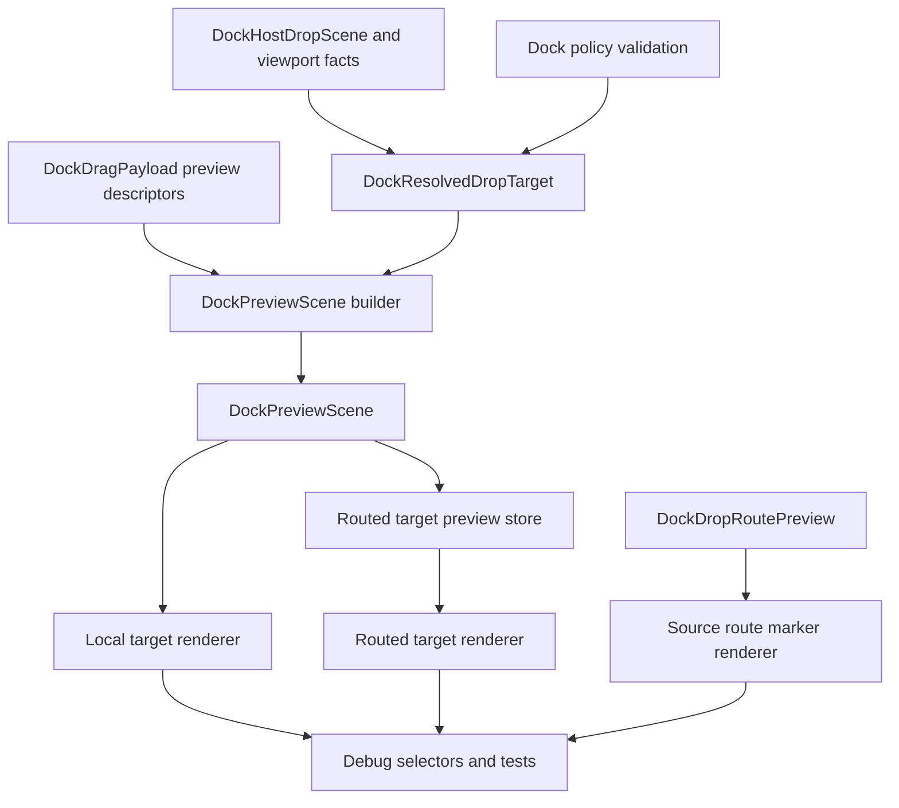
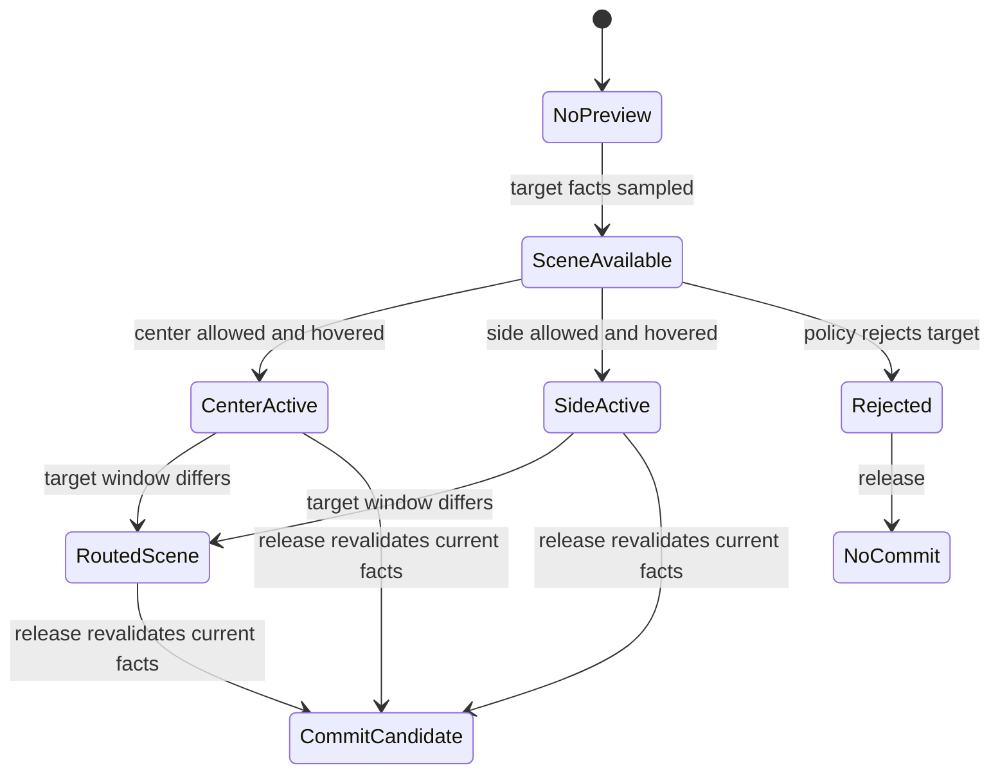

# Docking Preview Scene Authority

## Goal Capsule

- Objective: make `DockPreviewScene` the authoritative renderable explanation for docking target previews, including all active and inactive guide boxes, availability, active split selection, layer ordering, payload tab previews, routed target previews, and rejected state.
- Authority hierarchy: current hover facts and target resolution still decide delivery; preview scene state explains the UI and must not become release authority.
- Scope posture: breaking private `crates/gpui_docking` APIs is allowed; obsolete guide/render compatibility paths should be deleted once scene-owned tests cover them.
- Product fit: align Dear ImGui docking preview capabilities and behavior contracts without copying pixel-level styling or platform payload-window transparency.
- Tail ownership: scene model, guide geometry, render gateway, routed preview transport, payload preview descriptors, debug selectors, tests, dogfood checklist, and deletion of redundant code.

---

## Product Contract

### Summary

This plan completes the preview-model refactor started by the previous ImGui preview plan by making the scene own every visible target-preview affordance.
The renderer should stop recomputing guide availability and drop boxes, and routed previews should carry the same scene shape as local previews.
The result is capability alignment with Dear ImGui: availability is separate from activity, inner and outer layer candidates can coexist, draw rectangles are not confused with hit testing, and center tab previews communicate tab insertion rather than only drawing a generic rectangle.

### Problem Frame

The current code already has `DockPreviewScene`, but it still represents the currently resolved target more than the full preview state.
`DockPreviewScene::from_target` builds one layer, `DockPreviewLayer.active_zones` describes the active target rather than all available choices, and `render_drop_guides` still computes available zones and guide boxes independently from the scene.
This leaves two sources of truth: one for the active preview and another for inactive guide affordances.

Dear ImGui keeps the equivalent state together in `ImGuiDockPreviewData`: `IsDropAllowed`, `IsCenterAvailable`, `IsSidesAvailable`, `IsSplitDirExplicit`, `SplitDir`, `SplitRatio`, `FutureNode`, and `DropRectsDraw`.
It also builds inner and outer preview data separately, renders inner before outer, and only shows payload tab previews for center merge.
The GPUI implementation should keep its own visual language, but it needs the same capability-level data ownership so tests can lock behavior instead of inspecting incidental DOM fragments.

### Requirements

**Scene authority**

- R1. Target-window preview visuals must be explainable from `DockPreviewScene` alone, including body preview, payload tab previews, active drop box, inactive drop boxes, rejected state, and layer identity.
- R2. Scene data must separate availability from activity: available center and side zones are not the same concept as the currently hovered split or merge target.
- R3. Scene data must represent inner and outer layer candidates together when both are relevant, with active outer selection able to suppress inner drop allowance while preserving render ordering.
- R4. Scene drop boxes must carry separate hit bounds, draw bounds, preview bounds, zone, layer, and active state.
- R5. The scene must preserve allowed vs rejected decisions and rejection reason without letting preview state authorize delivery.

**Rendering and routing**

- R6. Target preview rendering must consume scene-owned geometry and availability instead of recomputing guide zones in `render.rs`.
- R7. Routed target previews must carry the same scene contract as local previews, including layer, availability, drop boxes, payload tab descriptors, and rejected state.
- R8. Source-window route markers for known viewport, tear-off, and rejected routes must remain separate from target-window preview scenes.

**Payload preview and UI behavior**

- R9. Payload tab preview data must be a semantic descriptor list, not only a title string, so center merge can preview one tab, a tab stack, or a floating tabs payload consistently.
- R10. Center merge previews must communicate tab insertion through body plus tab-preview geometry; edge split previews must not render payload tab previews.
- R11. Visual tokens may remain GPUI-specific and private, but active, inactive, rejected, tab-preview, and route-marker states must be distinguishable in semantic render tests.

**Tests and cleanup**

- R12. Tests must lock local, routed, root, nested, rejected, small-target, no-jitter, and multi-tab preview behavior before obsolete code is removed.
- R13. Compatibility paths that keep flattened preview fields, single-title routed payloads, or renderer-derived guides alive after migration must be deleted.

### Scope Boundaries

- In scope: private docking preview model and builders, drop guide geometry, render composition, routed preview transport, drag payload preview descriptors, debug selectors, tests, native dogfood coverage, and verification docs.
- Deferred to follow-up work: transparent payload-window rendering, full screenshot or pixel regression infrastructure, public preview theme API, and platform-level foreground overlay primitives.
- Out of scope: changing docking graph persistence, changing current-facts delivery authority, changing public docking API shape, rewriting panel registry ownership, or pursuing pixel-perfect Dear ImGui styling.
- Compatibility boundary: private structs and helpers may break freely; public crate behavior should remain stable unless tests prove the old private shape was encoding the wrong behavior.

### Acceptance Examples

- AE1. Given a payload hovering a target stack center, when center and side guides are available, then the scene contains center and side drop boxes and marks only center as active.
- AE2. Given a payload hovering a target edge, when side splitting is active, then the scene contains split preview bounds and active side drop box data, and payload tabs are absent.
- AE3. Given a root central leaf side hover, when outer docking is the active choice, then the scene represents outer layer selection and does not let inner center behavior consume the side drop.
- AE4. Given a nested leaf inside a larger split, when the pointer targets the nested leaf left side, then the scene keeps the side split scoped to that nested leaf rather than promoting it to the root.
- AE5. Given both inner and outer candidates, when the outer drop box is explicit, then inner rendering is still ordered below outer boxes and inner drop allowance is suppressed.
- AE6. Given a routed known-viewport target, when the target window renders preview feedback, then the target scene has the same body, boxes, layers, and payload tab descriptors as the equivalent local hover.
- AE7. Given a rejected local or routed target, when the pointer enters that target region, then the scene is rejected, release leaves the graph unchanged, and no delivery is minted from preview state.
- AE8. Given a small floating target, when a payload hovers center or edge, then draw boxes and preview bounds stay visible and stable without shrinking into unusable fragments.
- AE9. Given repeated hover movement across guide boxes, when the active zone changes, then guide buttons do not jitter because inactive and active boxes come from stable scene geometry.
- AE10. Given a multi-tab payload hovering center, when the drop would merge as tabs, then the preview shows tab-shaped entries in payload order and clips them within target bounds.

### Sources

- `repo-ref/imgui/imgui.cpp:17820` for `ImGuiDockPreviewData`.
- `repo-ref/imgui/imgui.cpp:19906` for hit-test and draw-rect separation in `DockNodeCalcDropRectsAndTestMousePos`.
- `repo-ref/imgui/imgui.cpp:19960` for availability and drop-allowed setup in `DockNodePreviewDockSetup`.
- `repo-ref/imgui/imgui.cpp:20048` for body, tab preview, drop-box, and overlay render ordering in `DockNodePreviewDockRender`.
- `repo-ref/imgui/imgui.cpp:21449` for inner and outer preview setup and ordering.
- `docs/plans/2026-06-29-002-refactor-docking-imgui-preview-model-plan.md` for the current scene-model baseline.
- `crates/gpui_docking/src/drop_preview.rs` for the current scene structs and single-layer builder.
- `crates/gpui_docking/src/render.rs` for the current scene renderer and independent guide renderer.
- `crates/gpui_docking/src/geometry.rs` for drop-box metrics, anti-flicker hit testing, and draw-bound defaults.

---

## Planning Contract

### Current Findings

| Finding | Evidence | Planning implication |
| --- | --- | --- |
| Scene exists but is target-local | `DockPreviewScene::from_target` builds `layers: vec![layer]` | The next refactor should not reintroduce a scene model; it should widen scene ownership to guide candidates and availability. |
| Active zones are not availability | `DockPreviewLayer.active_zones` is derived from the resolved target zone | Replace this with explicit availability plus active selection so inactive guide affordances are testable. |
| Renderer still computes guides | `render_drop_guides`, `available_drop_guide_zones`, and `drop_guide_box_for_zone` run in `render.rs` | Delete or demote this path after the scene can provide guide boxes. |
| Hit and draw bounds are structurally separate but identical | `geometry.rs` sets `draw_bounds = hit_bounds` for edge and center boxes | Preserve the fields and make the geometry contract prove they can diverge when needed. |
| Routed previews already transport scenes | Runtime APIs return `DockDropPreview` for target windows | Expand the carried scene rather than creating a second routed-only preview DTO. |
| Payload tabs already support multiple labels | `DockDragPayload::preview_tabs` exists | Promote payload tab entries into semantic descriptors and keep identity independent from preview labels. |

### Key Technical Decisions

- KTD1. Scene authority over target preview UI. `DockPreviewScene` becomes the only input for target-window preview rendering; resolver facts remain the input to scene construction, and release still revalidates current facts.
- KTD2. Availability is a first-class scene concept. Replace `active_zones` with availability and active-selection structures so tests can assert available center/sides even when only one target is hovered.
- KTD3. Build layer candidates before choosing the active layer. Inner and outer preview layers should be expressible in one scene, matching ImGui's split-inner and split-outer setup while preserving GPUI's root and nested target semantics.
- KTD4. Geometry owns stable boxes, render owns styling. Geometry should produce hit, draw, and preview rectangles plus stable zone/layer identity; render should only decorate those boxes.
- KTD5. Payload preview descriptors are semantic. A descriptor can carry title, source order, eligibility, and style intent; renderer-specific shape and private colors remain outside drag identity.
- KTD6. Local and routed target scenes share the same contract. Routed transport should move the already-built target scene and keep route markers as separate source-window feedback.
- KTD7. Delete the renderer-derived guide path after migration. Keeping independent guide inference would preserve the bug class where visible UI cannot be explained by scene tests.
- KTD8. Platform payload overlay stays deferred. The plan aligns target preview capability first; transparent payload-window rendering needs platform and screenshot infrastructure that is not part of this refactor.

### High-Level Technical Design

### System-Wide Impact

- Preview state becomes a shared private contract between interaction, rendering, viewport runtime, and tests; naming must stay precise enough for future changes to avoid re-splitting responsibility.
- Render tests should move from incidental rectangle existence toward semantic assertions over scene pieces, because the scene is now the behavior contract.
- Routed preview storage remains non-authoritative; stale preview hardening from prior viewport work must continue to win over any cached scene.
- Native dogfood remains important because the UI problem is spatial and hover-driven, but manual logs should support tests rather than replace them.

### Alternative Approaches Considered

- Keep renderer-derived guide computation and only add more tests. Rejected because it preserves two sources of truth and cannot prove routed previews have the same affordance set as local previews.
- Make the renderer ask the resolver for guide candidates on every render. Rejected because rendering would continue to own policy and geometry decisions, and hover jitter bugs would remain hard to isolate.
- Pursue pixel-perfect Dear ImGui styling first. Rejected because the user's goal is preview capability alignment, and GPUI still needs its own visual language.
- Include transparent payload-window rendering in this refactor. Deferred because it requires platform overlay behavior and screenshot infrastructure that would obscure the scene-authority work.

### Risks And Mitigations

| Risk | Impact | Mitigation |
| --- | --- | --- |
| Scene builder duplicates resolver policy | High | Build scenes only from resolved targets, policy validation results, and existing host facts; release continues to revalidate current facts. |
| Availability model becomes another naming layer | Medium | Delete `active_zones` and old guide helpers in the same plan so the new names replace rather than stack on top. |
| Inner and outer layers regress nested docking | High | Add root-central and nested-leaf tests before changing layer construction. |
| Routed scenes accidentally become delivery authority | High | Keep routed scene storage separate from delivery resolution and keep stale-route tests in the verification gate. |
| Payload descriptor expansion affects drag identity | Medium | Preserve existing identity tests that ignore title and preview descriptor changes. |
| Visual cleanup turns into public theme API work | Medium | Keep tokens private and defer public theming. |

---

## Implementation Units

### U1. Characterize scene-authority gaps

- **Goal:** add tests that prove the current gaps before private preview data structures are replaced.
- **Requirements:** R1, R2, R3, R4, R6, R12.
- **Dependencies:** None.
- **Files:** `crates/gpui_docking/src/drop_preview.rs`, `crates/gpui_docking/src/host_render_tests.rs`, `crates/gpui_docking/src/host_interaction_tests.rs`, `crates/gpui_docking/src/host_viewport_runtime_handle_tests.rs`.
- **Approach:** write characterization coverage around scene contents rather than only final rendered fragments. The tests should assert available center and side guide boxes, active selection, root vs nested layer selection, routed equivalence, and rejected scene state.
- **Execution note:** start characterization-first and allow the first version to fail against current `DockPreviewScene`.
- **Patterns to follow:** existing debug selector tests in `crates/gpui_docking/src/host_render_tests.rs`, multi-tab preview tests in `crates/gpui_docking/src/host_interaction_tests.rs`, and routed preview tests in `crates/gpui_docking/src/host_viewport_runtime_handle_tests.rs`.
- **Test scenarios:** center hover exposes inactive side boxes plus active center; edge hover exposes center availability plus active side and no payload tabs; root central side hover activates outer layer; nested leaf side hover stays nested; routed known-viewport preview preserves local scene shape; rejected hover exposes rejected scene and no commit.
- **Verification:** failing tests identify the specific scene concepts that production code must add, and passing tests do not depend on pixel snapshots.

### U2. Replace active zones with availability and active selection

- **Goal:** split scene availability from active hover state.
- **Requirements:** R1, R2, R3, R5, R12.
- **Dependencies:** U1.
- **Files:** `crates/gpui_docking/src/drop_preview.rs`, `crates/gpui_docking/src/drop_target.rs`, `crates/gpui_docking/src/geometry.rs`.
- **Approach:** replace `DockPreviewActiveZones` with explicit availability and active-target structures. Availability should describe center and side eligibility for each layer; active selection should identify the hovered merge or split, explicitness, ratio, sizing, and layer.
- **Patterns to follow:** ImGui's `IsCenterAvailable`, `IsSidesAvailable`, `IsSplitDirExplicit`, `SplitDir`, and `SplitRatio` fields in `repo-ref/imgui/imgui.cpp`.
- **Test scenarios:** allowed center target has center availability independent from active side availability; edge target has side availability and active split metadata; rejected target preserves availability for visual explanation but `allowed` is false; empty dock space has center availability without target tabs; root edge records outer layer active selection.
- **Verification:** unit tests can describe availability and activity without reading render output.

### U3. Build full scene-owned guide box sets

- **Goal:** make `DockPreviewScene` carry all renderable guide boxes for each applicable layer.
- **Requirements:** R1, R2, R3, R4, R6, R9, R12.
- **Dependencies:** U2.
- **Files:** `crates/gpui_docking/src/drop_preview.rs`, `crates/gpui_docking/src/geometry.rs`, `crates/gpui_docking/src/drop_target.rs`, `crates/gpui_docking/src/render.rs`, `crates/gpui_docking/src/host_render_tests.rs`.
- **Approach:** move guide-candidate construction out of `render_drop_guides` and into the scene-building path. The builder should produce inner and outer layers, all available drop boxes, and the active drop box derived from the resolved target. Render may temporarily consume the new data while old helpers are still present, but the scene must become the source of truth by the end of the unit.
- **Patterns to follow:** `DockNodePreviewDockSetup` and the inner/outer setup around `repo-ref/imgui/imgui.cpp:21449`.
- **Test scenarios:** center, inner side, and outer side boxes all appear in the layer where they are available; active box matches the resolved target; inactive boxes remain stable when hover moves; outer active selection suppresses inner drop allowance; rejected scene still exposes visual boxes for feedback.
- **Verification:** scene-level tests can account for every visible guide box before the renderer draws anything.

### U4. Separate hit, draw, and preview geometry contracts

- **Goal:** make geometry produce stable draw boxes without relying on hit-test rectangles as the visual contract.
- **Requirements:** R4, R6, R8, R11, R12.
- **Dependencies:** U3.
- **Files:** `crates/gpui_docking/src/geometry.rs`, `crates/gpui_docking/src/drop_preview.rs`, `crates/gpui_docking/src/host_render_tests.rs`.
- **Approach:** preserve ImGui's distinction between hit rectangles and `DropRectsDraw` by treating `hit_bounds`, `draw_bounds`, and `preview_bounds` as separately testable outputs. Keep the anti-flicker quadrant hit logic for inner guides, but avoid using expanded or inferred hit regions as the visual button geometry.
- **Patterns to follow:** `DockNodeCalcDropRectsAndTestMousePos` in `repo-ref/imgui/imgui.cpp:19906` and existing `drop_box_contains_position` tests.
- **Test scenarios:** inner boxes can hit through anti-flicker quadrant logic while draw boxes remain stable; outer boxes do not use inner quadrant expansion; small targets keep non-zero center and side draw boxes; draw boxes remain inside their target bounds; preview bounds continue to map to the resulting split region.
- **Verification:** geometry tests prove visual boxes and hit logic can change independently without render tests absorbing the distinction.

### U5. Render target previews only from scenes

- **Goal:** remove renderer-owned guide inference and render the complete scene with ImGui-like ordering.
- **Requirements:** R1, R3, R6, R8, R10, R11, R13.
- **Dependencies:** U3, U4.
- **Files:** `crates/gpui_docking/src/render.rs`, `crates/gpui_docking/src/debug.rs`, `crates/gpui_docking/src/host_render_tests.rs`, `crates/gpui_docking/src/host_interaction_tests.rs`.
- **Approach:** change the render gateway so body preview, existing payload tab entries, inactive boxes, active boxes, rejected styling, and layer ordering come from `DockPreviewScene`. Delete or demote `available_drop_guide_zones`, `drop_guide_box_for_zone`, and guide-specific policy recomputation once scene rendering covers them. Descriptor expansion happens in U6 without changing this scene-rendering boundary.
- **Patterns to follow:** `DockNodePreviewDockRender` in `repo-ref/imgui/imgui.cpp:20048` and the existing `drop_preview_tab_layout` helper.
- **Test scenarios:** center scene renders body, tab preview, inactive side boxes, and active center; edge scene renders split body and active side box with no payload tabs; inner layer draws before outer layer; rejected scene uses rejected semantic selectors or tokens; route marker rendering remains separate; hover transitions do not change guide box positions.
- **Verification:** render tests assert semantic selectors and bounds for all scene pieces, and searching the code shows target preview UI no longer depends on renderer-derived guide availability.

### U6. Expand payload tab preview descriptors

- **Goal:** move from title-only preview tabs to descriptor-based payload tab previews.
- **Requirements:** R9, R10, R11, R12.
- **Dependencies:** U2.
- **Files:** `crates/gpui_docking/src/drag.rs`, `crates/gpui_docking/src/drop_preview.rs`, `crates/gpui_docking/src/host_render_session.rs`, `crates/gpui_docking/src/render.rs`, `crates/gpui_docking/src/host_interaction_tests.rs`.
- **Approach:** extend `DockPreviewPayloadTab` so the scene can carry title, payload order, eligibility, and style intent without changing drag identity. The renderer should still render GPUI-style tabs and only use descriptors when the active target is a center merge.
- **Patterns to follow:** `DockDragPayload::preview_tabs`, `DockDragPayload::identity`, `DockHostRenderSession::tab_titles`, and ImGui's center-only tab preview loop.
- **Test scenarios:** single item payload yields one descriptor; tab-stack payload yields descriptors in source order; floating tabs payload yields descriptors for its tabs; descriptor title or style changes do not affect drag identity; edge split scenes ignore descriptors; narrow center preview clips descriptor tabs within preview bounds.
- **Verification:** payload preview tests assert descriptor contents and render tests assert center-only tab preview behavior.

### U7. Carry full scenes through routed preview transport

- **Goal:** make target-window routed preview use the same scene contract as local target preview.
- **Requirements:** R5, R7, R8, R9, R12.
- **Dependencies:** U3, U5, U6.
- **Files:** `crates/gpui_docking/src/viewport_runtime.rs`, `crates/gpui_docking/src/viewport_runtime_handle.rs`, `crates/gpui_docking/src/host_drop_scene.rs`, `crates/gpui_docking/src/viewport_drop_scene.rs`, `crates/gpui_docking/src/drop_preview.rs`, `crates/gpui_docking/src/host_viewport_runtime_tests.rs`, `crates/gpui_docking/src/host_viewport_runtime_handle_tests.rs`.
- **Approach:** update routed preview publication and storage to carry the complete scene, not a weaker title-or-bounds subset. Keep route previews as source-window markers and keep routed scenes scoped to the active drag session.
- **Patterns to follow:** `render_host_drop_preview` precedence and prior current-facts tests from the viewport authority plan.
- **Test scenarios:** local and routed center previews have equivalent availability, layer, and payload descriptor shape; routed edge preview carries active split and no payload tabs; rejected routed preview carries rejected decision and cannot mint delivery; clearing, closing, replacing, or staling a viewport clears the routed scene; source window shows only route marker when appropriate.
- **Verification:** viewport runtime and handle tests prove routed scenes are renderable feedback and never release authority.

### U8. Delete obsolete preview compatibility paths and update dogfood

- **Goal:** remove redundant private code and refresh manual verification around the new scene contract.
- **Requirements:** R6, R8, R11, R12, R13.
- **Dependencies:** U5, U7.
- **Files:** `crates/gpui_docking/src/drop_preview.rs`, `crates/gpui_docking/src/render.rs`, `crates/gpui_docking/src/viewport_runtime.rs`, `crates/gpui_docking/src/viewport_runtime_handle.rs`, `crates/gpui_docking/src/debug.rs`, `examples/docking-native/src/main.rs`, `docs/verification.md`.
- **Approach:** delete stale flattened preview helpers, single-title routed-preview assumptions, renderer-derived guide helpers, and compatibility adapters that no longer carry unique meaning. Update the native example only if additional dogfood states are needed to reach all acceptance examples.
- **Patterns to follow:** the deletion posture in `docs/plans/2026-06-29-002-refactor-docking-imgui-preview-model-plan.md` and existing native docking verification notes.
- **Test scenarios:** production search finds no target-preview render path using old guide inference; no routed API requires only a single payload title; debug selectors still expose scene body, payload tabs, guide boxes, active guide, route marker, and rejected state; native dogfood reaches center, side, root, nested, routed, rejected, small-target, and multi-tab cases.
- **Verification:** codebase compiles with compatibility paths removed, and verification docs describe the scene-owned preview contract rather than old flattened fields.

---

## Verification Contract

| Gate | Command | What it proves |
| --- | --- | --- |
| Formatting | `cargo fmt --all --check` | Rust formatting stays clean after the wide private refactor. |
| Patch hygiene | `git diff --check` | No whitespace or patch hygiene regressions. |
| Docking compile | `cargo check --tests -p open-gpui-docking` | Private preview API changes still type-check with tests. |
| Docking tests | `cargo nextest run -p open-gpui-docking --no-fail-fast` | Scene model, geometry, rendering, routed preview, and current-facts non-regression are covered. |
| Native example tests | `cargo nextest run -p open-gpui-docking-native --no-fail-fast` | Native harness tests still pass. |
| Native example compile | `cargo check -p open-gpui-docking-native` | Dogfood application builds with refactored preview APIs. |
| Manual dogfood | `RUST_LOG=info,open_gpui_docking=debug,open_gpui=info RUST_BACKTRACE=1 cargo run -p open-gpui-docking-native --bin open-gpui-docking-native` | Center merge, edge split, root central, nested leaf, routed preview, rejected preview, small target, and multi-tab preview states are inspectable. |

---

## Definition of Done

- `DockPreviewScene` or an equivalent private model is the sole source for target-window preview visuals.
- Availability and active selection are separate scene concepts.
- Inner and outer layer candidates can coexist in a scene, with active outer behavior preserving ImGui-like ordering and GPUI's nested target semantics.
- Drop boxes carry separate hit, draw, and preview bounds, and tests prove the separation matters.
- Target preview rendering no longer independently computes guide availability or guide boxes.
- Routed target previews carry the same scene shape as local target previews and remain non-authoritative for release.
- Payload tab previews use descriptor lists and render only for center merge.
- Obsolete flattened preview fields, single-title routed assumptions, and renderer guide compatibility helpers are removed.
- Tests cover local, routed, root, nested, rejected, small-target, no-jitter, and multi-tab preview behavior.
- `docs/verification.md` describes the final preview capability contract and explicitly lists deferred platform overlay and pixel-regression work.
