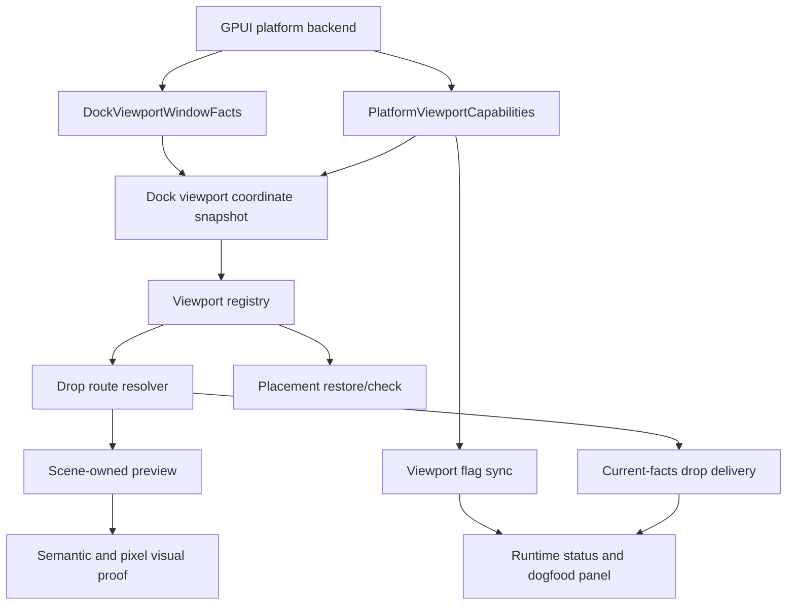
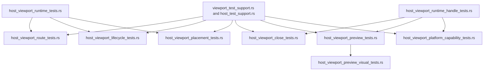
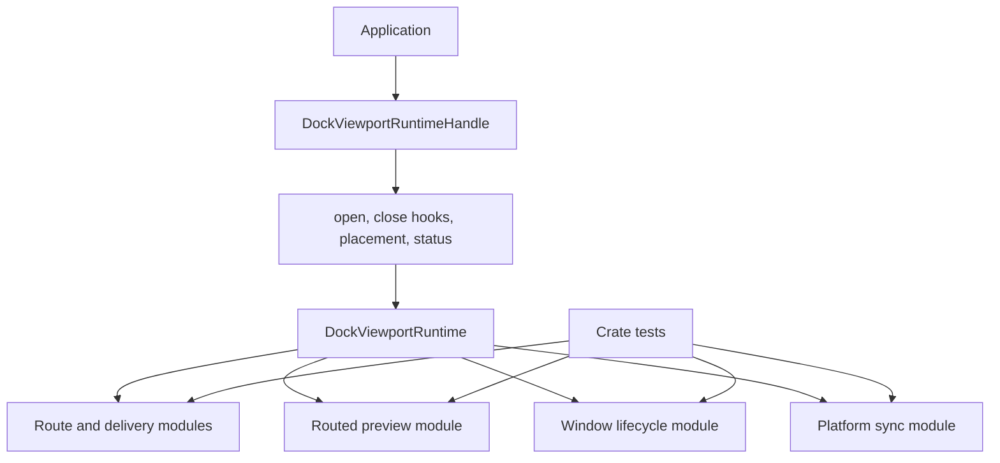

# Docking Multi-Viewport Platform Hardening - Plan

## Goal Capsule

| Field | Value |
| --- | --- |
| Objective | Convert the remaining docking multi-viewport gaps into explicit, testable platform and maintenance seams. |
| Scope | Coordinate capability modeling, platform viewport flag negotiation, visual regression proof, viewport test decomposition, runtime handle slimming, and native dogfood cleanup. |
| Authority | Current-facts release authority and scene-owned previews stay authoritative; platform facts become capability-scoped inputs rather than implicit assumptions. |
| Execution profile | Characterization-first refactor with deletion allowed after replacement tests pass. |
| Stop condition | `docs/verification.md` no longer carries these five gaps as unowned caveats; each is implemented, explicitly degraded, or explicitly unsupported with tests and status reporting. |

---

## Product Contract

### Summary

The docking multi-viewport work now behaves correctly in the reported drag/drop cases, but the remaining risk sits at platform and maintenance boundaries.
This plan targets the five open gaps: coordinate capability, platform viewport flags, visual regression infrastructure, test maintainability, and the broad `DockViewportRuntimeHandle` internal surface.
The work is intentionally refactor-heavy and may delete compatibility code, duplicate helpers, and shallow pass-through methods when a deeper seam replaces them.

### Problem Frame

Current docking verification documents the right behavior for routed previews, nested targets, center-tab previews, tear-off sizing, and stale route rejection.
It also still lists platform caveats for mixed-DPI and Wayland coordinate facts, unsupported ImGui-style viewport flags, and missing screenshot or pixel regression proof.
Those caveats are now the highest-leverage place to improve reliability because route and preview correctness already depend on platform facts being current and explainable.

Two test files also carry too much behavior: `crates/gpui_docking/src/host_viewport_runtime_tests.rs` and `crates/gpui_docking/src/host_viewport_runtime_handle_tests.rs`.
They make regression coverage hard to extend because route, lifecycle, placement, close, preview, and platform sync tests are co-located behind one broad runtime handle facade.

### Requirements

**Coordinate and platform facts**

- R1. Viewport bounds, pointer positions, display identity, DPI reliability, and freshness must be represented as one explicit coordinate/fact snapshot before routing or placement uses them.
- R2. Mixed-DPI, local-only, stale, or display-ambiguous snapshots must fail closed for cross-window commit unless a trusted hovered-window or receiver-local scene proof selects the target.
- R3. Runtime status and the native example must expose whether a route used global bounds, receiver-local proof, hovered-window facts, window stack fallback, or a degraded/unsupported path.

**Platform viewport flags**

- R4. No-input, no-focus-on-appearing, no-focus-on-click, alpha/transparent payload windows, topmost, and no-taskbar behavior must be modeled as capability negotiation, not inferred from unrelated `WindowOptions` fields.
- R5. Existing pointer input passthrough sync must move into the same capability/result model as other viewport flag requests.
- R6. Unsupported, skipped, applied, and degraded platform requests must be recorded in `DockViewportRuntimeStatus` without pretending that unavailable ImGui PlatformIO behavior exists.

**Preview proof**

- R7. Docking preview verification must add screenshot or pixel-region proof where the GPUI test infrastructure can support it, while keeping semantic selectors as the stable cross-platform oracle.
- R8. Center-tab previews, edge previews, rejected previews, route markers, and multi-tab payload previews must have durable visual or visual-descriptor regression coverage.

**Maintainability and interfaces**

- R9. Viewport tests must be split by concern so route, lifecycle, placement, close, preview, platform capability, and visual proof each have an obvious home.
- R10. `DockViewportRuntimeHandle` must remain the application-facing facade while crate-internal route, preview, lifecycle, activation, and platform sync work moves behind smaller internal seams.
- R11. Public docking behavior must remain source-compatible unless implementation proves an additive GPUI platform capability interface is required.

**Dogfood and cleanup**

- R12. The native docking example and `docs/verification.md` must describe the new capability states and manual proof flows.
- R13. Obsolete compatibility paths, duplicate helpers, and one-off debug/status branches must be deleted after the replacement seams own their behavior.

### Acceptance Examples

- AE1. Given two registered viewport windows with global bounds on different displays, when the backend cannot prove a shared coordinate space, then a rectangle-only cross-window release is unavailable or tear-off instead of docking into a guessed target.
- AE2. Given a Wayland-style local-only backend, when the receiver window supplies local scene proof for the release, then the route may commit inside that receiver; without that proof it fails closed.
- AE3. Given a reused viewport requests no-input passthrough on a backend that cannot apply it, then runtime status records an unsupported pointer-input request and routing does not assume pass-through succeeded.
- AE4. Given an unsupported topmost, no-taskbar, alpha, or no-focus request, then the status panel reports the unsupported flag class instead of silently treating it as applied.
- AE5. Given a center dock hover with a two-tab payload, then semantic selectors and visual proof show a target preview body plus two payload tab previews rather than one dark payload rectangle.
- AE6. Given an edge dock hover, then the target preview proves the active side box and suppresses payload tab previews.
- AE7. Given a pure route resolver test, then the test does not have to call `DockViewportRuntimeHandle` unless it exercises the public app facade.

### Scope Boundaries

#### In Scope

- Coordinate and platform capability refactors under `crates/gpui_docking/src/viewport_*`.
- Additive GPUI platform capability fields and test-platform support where needed.
- Docking preview visual proof using existing GPUI render-to-image or semantic debug-bound infrastructure.
- Splitting and deleting viewport tests and helpers that are redundant after the split.
- Updating `examples/docking-native/src/main.rs` and `docs/verification.md`.

#### Deferred to Follow-Up Work

- Full Dear ImGui PlatformIO parity beyond the capability classes needed for docking reliability.
- Pixel-perfect Dear ImGui styling parity for docking previews.
- A public preview theme API.
- Full CI coverage for every native backend if the local toolchain cannot compile that backend.

#### Outside This Plan

- Replacing the docking graph with ImGui's full floating root-node architecture.
- Using saved placement snapshots as live routing authority.
- Making Wayland global toplevel positioning reliable when the compositor does not expose it.

---

## Planning Contract

### Key Technical Decisions

| ID | Decision | Rationale |
| --- | --- | --- |
| KTD1 | Make viewport coordinate facts a named module interface. | Routing correctness depends on distinguishing global screen coordinates, receiver-local coordinates, display identity, DPI reliability, and freshness. Raw `Bounds<Pixels>` subtraction should not remain spread across route code. |
| KTD2 | Treat platform flags as negotiated capabilities. | ImGui viewport flags only become behavior when the platform backend can apply and report them; unsupported flags must become diagnostics, not hidden assumptions. |
| KTD3 | Keep semantic selectors as the stable oracle and add pixel proof as an extra layer. | Screenshot tests catch UI regressions, but semantic selectors remain more portable across platforms, renderers, fonts, and GPU differences. |
| KTD4 | Split tests before slimming the runtime handle. | Characterization coverage should preserve behavior while the broad handle surface is dismantled. |
| KTD5 | Deepen internal modules rather than adding new pass-through facades. | The goal is a smaller interface with more behavior behind it, not a renamed set of shallow wrappers around `DockViewportRuntime`. |
| KTD6 | Preserve current-facts delivery and scene-owned preview authority. | Prior docking fixes removed stale accepted-preview authority; this refactor must not reintroduce cached commit decisions. |

### High-Level Technical Design

### Assumptions

- The work can break crate-private tests and internals, but public application-facing docking interfaces should stay source-compatible unless an additive platform capability field is justified.
- External research is not load-bearing for this plan because the repo already carries local ImGui references and prior docking parity plans.
- `repo-ref/imgui` remains the implementation reference for viewport flags and preview behavior during execution.
- Visual pixel assertions may be platform-gated when the renderer cannot produce deterministic images in the test environment.

### System-Wide Impact

This refactor affects application developers who use `DockViewportRuntimeHandle`, platform backend owners who report GPUI viewport facts, and maintainers who extend docking regression tests.
The largest behavior risk is false platform confidence: a backend must not claim support for a viewport fact or flag until it can apply and report it deterministically.

### Alternative Approaches Considered

- Keep documenting the caveats and only add more manual dogfood steps. Rejected because the same class of issue has already appeared repeatedly in routed docking behavior.
- Implement full ImGui PlatformIO parity first. Rejected because it is broader than the current docking need and would delay testable reliability work.
- Use only screenshot baselines for UI/UX parity. Rejected because render output can vary while semantic preview contracts are the real docking behavior guarantee.
- Split tests after runtime handle slimming. Rejected because broad refactors need characterization coverage before deleting pass-through methods.

### Risks and Mitigations

| Risk | Mitigation |
| --- | --- |
| Platform capability fields overstate backend support. | Default unsupported, add backend-specific tests, and expose unsupported/degraded status in dogfood. |
| Visual regression tests become flaky. | Keep semantic selectors as required proof and make pixel-region tests deterministic, small, and platform-gated. |
| Test splitting changes behavior accidentally. | Move tests first with unchanged assertions, then refactor internals behind the split coverage. |
| `DockViewportRuntimeHandle` slimming breaks public users. | Preserve public app-facing methods and route pure internal tests away from the handle before deleting wrappers. |
| Capability negotiation creates duplicate status types. | Extend the existing `DockViewportRuntimeStatus` and `DockViewportPlatformSyncRecord` model instead of adding a parallel diagnostics tree. |

---

## Implementation Units

### U1. Normalize viewport coordinate facts

- **Goal:** make route and placement code consume explicit coordinate snapshots instead of raw bounds with implicit reliability.
- **Requirements:** R1, R2, R3, AE1, AE2.
- **Dependencies:** none.
- **Files:** `crates/gpui_docking/src/viewport_coordinates.rs`, `crates/gpui_docking/src/viewport_registry.rs`, `crates/gpui_docking/src/viewport_platform_signals.rs`, `crates/gpui_docking/src/viewport_drop_route.rs`, `crates/gpui_docking/src/viewport_runtime_status.rs`, `crates/gpui_docking/src/host_viewport_matrix_tests.rs`, `crates/gpui_docking/src/host_viewport_route_tests.rs`, `crates/gpui_docking/src/lib.rs`.
- **Approach:** extend or replace `DockViewportWindowBoundsFrame` with a snapshot that carries coordinate space, display identity, scale reliability, route-facts generation, and local-scene proof source. Keep global rectangle hit testing available only when the snapshot says it is reliable. Route local-only backends through receiver-local proof, trusted hovered-window facts, or unavailable results rather than through global rectangle guesses.
- **Execution note:** Add characterization tests for existing macOS/test-platform behavior before changing route resolution.
- **Patterns to follow:** `DockViewportWindowFacts::from_window`, `DockViewportAdapter::global_screen_viewport_window_hits`, `DockViewportDropRouteSnapshot::resolve`, and the fail-closed rules in `docs/plans/2026-06-12-002-fix-docking-deterministic-viewport-plan.md`.
- **Test scenarios:** A global snapshot with matching display and current facts selects a cross-window target. A local-only snapshot with receiver-local scene proof selects the receiver host. A local-only snapshot without receiver proof rejects cross-window commit. A stale snapshot blocks underlay hits rather than passing through to a lower window. A mixed-DPI or display-ambiguous pair records degraded capability and does not use rectangle-only routing. A source-local release still works when no cross-window target is involved.
- **Verification:** route tests assert the selected coordinate source and runtime status records the degraded or trusted selection source.

### U2. Negotiate platform viewport flags

- **Goal:** model ImGui-style viewport flags as explicit supported, unsupported, skipped, or applied platform requests.
- **Requirements:** R4, R5, R6, R11, AE3, AE4.
- **Dependencies:** U1.
- **Files:** `crates/gpui/src/platform.rs`, `crates/gpui/src/window.rs`, `crates/gpui/src/platform/test/platform.rs`, `crates/gpui/src/platform/test/window.rs`, `crates/gpui_macos/src/platform.rs`, `crates/gpui_windows/src/platform.rs`, `crates/gpui_linux/src/linux/x11/client.rs`, `crates/gpui_linux/src/linux/wayland/client.rs`, `crates/gpui_docking/src/viewport_platform_sync.rs`, `crates/gpui_docking/src/viewport_runtime_effects.rs`, `crates/gpui_docking/src/viewport_runtime_status.rs`, `crates/gpui_docking/src/host_viewport_platform_capability_tests.rs`, `crates/gpui_docking/src/lib.rs`.
- **Approach:** extend `PlatformViewportCapabilities` and docking sync records so no-input, hover pass-through, no-focus-on-appearing, no-focus-on-click, alpha, topmost, no-taskbar, live move, and transparent payload-window behavior share one request/result vocabulary. Keep GPUI public options additive if new fields are needed. Fold the existing pointer-input sync path into this result model and delete one-off unsupported/skipped branches that become redundant.
- **Execution note:** Start with tests that prove current unsupported requests are reported rather than applied.
- **Patterns to follow:** `DockViewportPlatformSyncRequest`, `DockViewportPlatformSyncRecord`, `sync_reused_viewport_window`, existing backend `viewport_capabilities` implementations, and ImGui viewport flag handling in `repo-ref/imgui/imgui.cpp`.
- **Test scenarios:** Test platform can advertise and apply no-input while status records the applied result. A backend without no-input support records unsupported and leaves input facts unchanged. Topmost, no-taskbar, alpha, and no-focus requests record unsupported until the backend exposes real support. Reused viewport sync skips resize while a platform resize request is in progress but still records the skip reason. Runtime status exposes the latest flag result without duplicating pointer-input diagnostics.
- **Verification:** capability tests prove each backend reports only supported facts, and docking tests prove route logic consumes the negotiated result rather than the requested flag.

### U3. Add preview visual regression proof

- **Goal:** add durable visual proof for docking preview shape without requiring pixel-perfect ImGui styling.
- **Requirements:** R7, R8, AE5, AE6.
- **Dependencies:** U1, U2.
- **Files:** `crates/gpui/src/app/headless_app_context.rs`, `crates/gpui/src/app/visual_test_context.rs`, `crates/gpui/src/platform/test/window.rs`, `crates/gpui_docking/src/debug.rs`, `crates/gpui_docking/src/host_render_tests.rs`, `crates/gpui_docking/src/host_viewport_preview_tests.rs`, `crates/gpui_docking/src/host_viewport_preview_visual_tests.rs`, `examples/docking-native/src/main.rs`, `docs/verification.md`, `crates/gpui_docking/src/lib.rs`.
- **Approach:** build a small docking visual harness around existing `render_to_image`, screenshot capture, debug selectors, and preview scene data. Prefer pixel-region assertions for stable color/shape relationships and semantic descriptor snapshots for cross-platform proof. Do not store broad full-window baselines unless implementation proves they are stable.
- **Execution note:** Characterize current selectors and scene descriptors before adding pixel assertions.
- **Patterns to follow:** `VisualTestContext`, `HeadlessAppContext::capture_screenshot`, `PlatformWindow::render_to_image`, `DockPreviewScene`, `render_host_drop_preview`, and `docs/verification.md` preview selectors.
- **Test scenarios:** Center hover with one payload tab produces preview body, active center box, and one tab preview. Center hover with two payload tabs produces two ordered tab previews. Edge hover produces an active side box and no payload tab preview. Rejected center preview uses rejected tokens and suppresses payload tabs. Source route markers use tokens distinct from target-window previews. Screenshot capture unavailable is reported as a visual capability gap rather than a false pass.
- **Verification:** semantic preview tests always run, and pixel-region tests run where the configured renderer can produce deterministic images.

### U4. Split viewport tests by concern

- **Goal:** replace the two monolithic viewport runtime test files with concern-owned test modules.
- **Requirements:** R9, R13.
- **Dependencies:** U1, U2, U3.
- **Files:** `crates/gpui_docking/src/lib.rs`, `crates/gpui_docking/src/host_viewport_runtime_tests.rs`, `crates/gpui_docking/src/host_viewport_runtime_handle_tests.rs`, `crates/gpui_docking/src/host_viewport_route_tests.rs`, `crates/gpui_docking/src/host_viewport_lifecycle_tests.rs`, `crates/gpui_docking/src/host_viewport_placement_tests.rs`, `crates/gpui_docking/src/host_viewport_close_tests.rs`, `crates/gpui_docking/src/host_viewport_preview_tests.rs`, `crates/gpui_docking/src/host_viewport_platform_capability_tests.rs`, `crates/gpui_docking/src/host_viewport_preview_visual_tests.rs`, `crates/gpui_docking/src/viewport_test_support.rs`, `crates/gpui_docking/src/host_test_support.rs`.
- **Approach:** move tests in behavior-preserving slices before changing assertions. Keep old files only as temporary routers if needed, then delete them once the module list is stable. Consolidate duplicate window setup, runtime setup, drag payload, and preview assertion helpers in test support modules with names that match their concern.
- **Execution note:** Treat this as a characterization move until all relocated tests pass.
- **Patterns to follow:** existing `host_viewport_matrix_tests.rs`, `host_viewport_model_tests.rs`, `viewport_test_support.rs`, and the module list in `lib.rs`.
- **Test scenarios:** Route-only tests live in `host_viewport_route_tests.rs` and do not require app-facing handle methods. Lifecycle tests cover registration, stale facts, close-request flags, and replacement cleanup. Placement tests cover saved bounds, display hints, and tear-off sizing. Close tests cover prevent, retain, merge-back, cancel, and post-close cleanup. Preview tests cover routed scene replacement and clearing. Platform capability tests cover unsupported, skipped, applied, and degraded sync records. Visual tests cover screenshot or descriptor proof.
- **Verification:** the old monolithic files are deleted or reduced to short module routers, duplicate helpers are removed, and the full docking test suite continues to cover all previous viewport cases.

### U5. Slim the runtime handle facade

- **Goal:** keep `DockViewportRuntimeHandle` as the public application entry point while moving crate-private internals behind deeper modules.
- **Requirements:** R10, R11, R13, AE7.
- **Dependencies:** U4.
- **Files:** `crates/gpui_docking/src/viewport_runtime_handle.rs`, `crates/gpui_docking/src/viewport_runtime.rs`, `crates/gpui_docking/src/viewport_drop_delivery.rs`, `crates/gpui_docking/src/viewport_routed_preview.rs`, `crates/gpui_docking/src/viewport_window_lifecycle.rs`, `crates/gpui_docking/src/viewport_activation.rs`, `crates/gpui_docking/src/viewport_platform_sync.rs`, `crates/gpui_docking/src/viewport_runtime_effects.rs`, `crates/gpui_docking/src/viewport_open.rs`, `crates/gpui_docking/src/viewport_close.rs`, `crates/gpui_docking/src/lib.rs`, `crates/gpui_docking/src/host_viewport_runtime_handle_tests.rs`, `crates/gpui_docking/src/host_viewport_route_tests.rs`, `crates/gpui_docking/src/host_viewport_close_tests.rs`, `crates/gpui_docking/src/host_viewport_preview_tests.rs`.
- **Approach:** define the handle's interface around app-facing operations: construct runtime, open viewport, observe close hooks, export/check placement, set close policy, inspect status, and close-request callbacks. Move crate-private route resolution, routed preview transport, activation recovery, window lifecycle, and platform sync helpers into their owning modules. Delete pass-through methods after tests call the owning module or runtime seam directly.
- **Execution note:** Do not delete public methods unless source compatibility analysis proves they were never public API or a replacement is additive and documented.
- **Patterns to follow:** the deep-module guidance that tests should cross the same seam as callers, `viewport_window_lifecycle.rs`, `viewport_drop_delivery.rs`, `viewport_routed_preview.rs`, and the doc comment in `crates/gpui_docking/src/lib.rs`.
- **Test scenarios:** The native example compiles using only public handle methods. Public open, close, placement, and status flows continue to work. Route resolver tests no longer invoke handle-only pass-through methods. Preview transport tests exercise the preview module directly. Close and activation tests exercise lifecycle modules without borrowing the handle internals. No production code depends on `borrow` or `borrow_mut` from the handle unless a narrow crate-private seam remains justified.
- **Verification:** `viewport_runtime_handle.rs` is materially smaller, `pub(crate)` pass-through count drops, and behavior tests still prove the public app facade.

### U6. Update native dogfood, docs, and deletion cleanup

- **Goal:** make the hardened seams visible to users and remove stale caveats or compatibility paths.
- **Requirements:** R3, R6, R7, R8, R12, R13.
- **Dependencies:** U1, U2, U3, U4, U5.
- **Files:** `examples/docking-native/src/main.rs`, `docs/verification.md`, `crates/gpui_docking/src/debug.rs`, `crates/gpui_docking/src/viewport_runtime_status.rs`, `crates/gpui_docking/src/viewport_platform_sync.rs`, `crates/gpui_docking/src/viewport_coordinates.rs`, `crates/gpui_docking/src/lib.rs`, `crates/gpui_docking/src/host_viewport_platform_capability_tests.rs`, `crates/gpui_docking/src/host_viewport_preview_visual_tests.rs`.
- **Approach:** update the native runtime panel to show coordinate capability, route selection source, platform flag support, last sync result, and visual proof capability. Rewrite `docs/verification.md` so the current caveats become supported, degraded, unsupported, or deferred states with a test owner. Search for obsolete flattened preview, stale route, one-off pointer-input, and temporary test-router paths and delete the ones replaced by the new seams.
- **Execution note:** Delete cleanup should happen after replacement coverage exists, not before.
- **Patterns to follow:** existing runtime panel status rows in `examples/docking-native/src/main.rs`, current docking dogfood checklist, and prior plan cleanup posture in `docs/plans/2026-06-29-002-refactor-docking-imgui-preview-model-plan.md`.
- **Test scenarios:** Native example status reports global, local-only, degraded, and unsupported coordinate/capability states. Unsupported flag requests are visible in the status panel. Visual proof capability is visible without requiring manual log parsing. Documentation no longer lists the five gaps as ownerless caveats. Repository search finds no stale compatibility wrapper for removed preview or pointer-input paths.
- **Verification:** native example tests cover status reporting, docs match the implemented capability model, and obsolete code is removed rather than left dormant.

---

## Verification Contract

| Gate | Command | What it proves |
| --- | --- | --- |
| Formatting | `cargo fmt --all --check` | Rust formatting stays stable after broad module movement. |
| Diff hygiene | `git diff --check` | Documentation and code edits do not introduce whitespace defects. |
| Docking compile | `cargo check --tests -p open-gpui-docking` | split modules, internal seams, and test-only visual helpers type-check together. |
| Docking tests | `cargo nextest run -p open-gpui-docking --no-fail-fast` | coordinate, platform capability, preview, lifecycle, close, placement, and handle facade behavior are covered. |
| Native compile | `cargo check -p open-gpui-docking-native` | the dogfood surface still builds against the public handle facade. |
| Native tests | `cargo nextest run -p open-gpui-docking-native --no-fail-fast` | runtime panel and example-level status behavior stay covered. |
| GPUI platform compile | `cargo check -p open-gpui` | additive platform capability changes remain valid for core GPUI. |
| Backend compile when touched | `cargo check -p open-gpui-macos`, `cargo check -p open-gpui-windows`, and `cargo check -p open-gpui-linux` as locally available | backend capability declarations stay isolated to supported platform crates. |
| Manual dogfood | `RUST_LOG=info,open_gpui_docking=debug,open_gpui=info RUST_BACKTRACE=1 cargo run -p open-gpui-docking-native --bin open-gpui-docking-native` | center, edge, nested, routed, tear-off, rejected, multi-tab preview, and platform capability states are inspectable in the example. |

---

## Definition of Done

- Coordinate facts are represented by an explicit docking snapshot model that distinguishes global, local-only, display, DPI, freshness, and proof source.
- Cross-window routing fails closed when coordinate or platform facts are stale, ambiguous, or unsupported.
- Platform viewport flags share one capability/request/result model covering no-input, no-focus, alpha, topmost, no-taskbar, live move, and transparent payload-window behavior.
- Pointer-input passthrough sync is no longer a one-off path outside the platform capability model.
- Preview visual proof covers center tab previews, edge previews, rejected previews, route markers, and multi-tab payload previews through semantic selectors plus deterministic pixel or descriptor assertions.
- `host_viewport_runtime_tests.rs` and `host_viewport_runtime_handle_tests.rs` are deleted or reduced to short routers, with tests split into concern-owned modules.
- `DockViewportRuntimeHandle` exposes a narrow app-facing interface, and crate-private route, preview, lifecycle, activation, and platform sync behavior lives behind owning modules.
- The native example exposes coordinate and platform capability status without relying on log spam as the primary oracle.
- `docs/verification.md` replaces the current five caveats with implemented, degraded, unsupported, or explicitly deferred states and names the automated/manual proof for each.
- Obsolete compatibility code, duplicated helpers, temporary adapters, and stale debug/status branches introduced by earlier docking iterations are removed.

---

## Sources and Research

- `docs/verification.md` records the current docking dogfood contract, preview selectors, and the remaining platform caveats this plan targets.
- `docs/plans/2026-06-12-002-fix-docking-deterministic-viewport-plan.md` establishes fail-closed platform routing and ImGui-informed drop-box behavior.
- `docs/plans/2026-06-28-001-refactor-docking-viewport-authority-break-plan.md` establishes current-facts release authority.
- `docs/plans/2026-06-29-002-refactor-docking-imgui-preview-model-plan.md` and `docs/plans/2026-06-29-003-refactor-docking-preview-scene-authority-plan.md` establish scene-owned previews and deferred screenshot/platform-payload work.
- `crates/gpui/src/platform.rs`, `crates/gpui_docking/src/viewport_registry.rs`, `crates/gpui_docking/src/viewport_coordinates.rs`, `crates/gpui_docking/src/viewport_platform_sync.rs`, and `crates/gpui_docking/src/viewport_runtime_handle.rs` are the primary implementation seams.
- `repo-ref/imgui/imgui.cpp` anchors the ImGui behavior comparison for viewport flags, no-input fallback, drop-box rendering, and preview layering.
