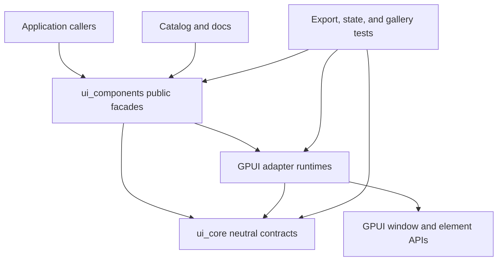
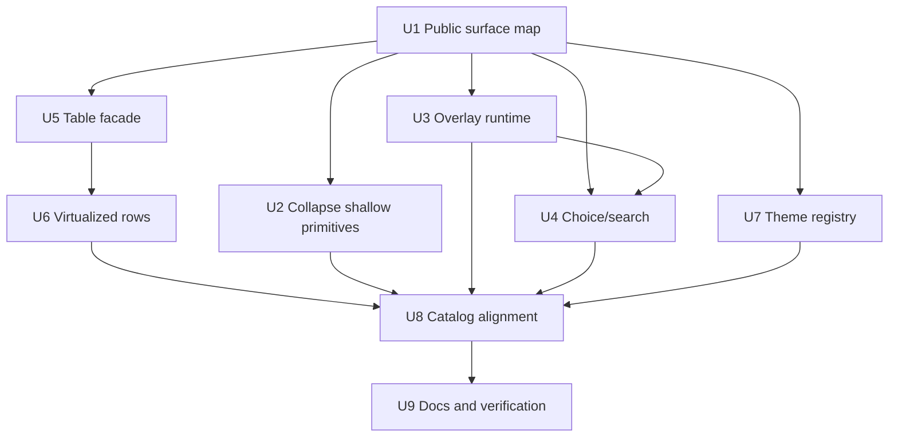

# Open GPUI UI Architecture Deepening Refactor - Plan

## Goal Capsule

Refactor the Open GPUI UI component architecture so the official component library is a deep, general-purpose framework surface rather than a broad set of individually solved components.

The refactor keeps the current product boundary from ADR 0008 and ADR 0009: `open-gpui-ui-core` owns renderer-neutral policy and state vocabulary, `open-gpui-ui-components` owns GPUI adapters and official component facades, and `examples/ui-foundation-gallery` remains the conformance surface.

The work is intentionally breaking. Because the UI component library is still pre-launch, the implementation should delete shallow compatibility surfaces, stale re-exports, accidental public internals, and duplicated runtime code once characterization tests prove the replacement behavior.

Authority order:

1. ADR 0008 and ADR 0009 define the active crate boundary and reject a new standalone headless crate for this phase.
2. `docs/ui/component-contract.md` defines the current public component behavior and known gaps.
3. `docs/verification.md` defines the UI-focused verification gates.
4. The local `repo-ref` projects are reference material only; they do not override Open GPUI crate boundaries or licensing constraints.

Success means public imports are intentional, primitive modules are real behavior owners rather than pass-through aliases, repeated overlay and choice logic is centralized, Table no longer leaks implementation render plans as the main public state surface, virtualization has a shared row-window adapter vocabulary, theme loading has an app-level registry around snapshots, and the gallery/catalog/tests describe the same component product.

---

## Product Contract

### Summary

This plan deepens the existing Open GPUI UI crates by replacing shallow public surfaces with behavior-oriented modules and by concentrating repeated adapter logic behind explicit seams.
It covers all architecture issues found in the review and assumes breaking changes are allowed when they produce a cleaner framework boundary.

### Problem Frame

The component library already has strong foundations: renderer-neutral overlay policy, token intents, virtualizer math, table state, choice/listbox state, gallery smoke tests, and many official components exist.
The main risk is now architectural shallowness, not missing breadth.

Several modules expose names without owning useful complexity.
`ui_components::primitives` contains pass-through modules for core types, `ui_core::lib.rs` wildcard-exports every module, and the component root/prelude surfaces mix official components, adapter helpers, state contracts, and low-level core contracts.
That makes the public API harder to reason about and makes future extraction or documentation depend on accidental import paths.

Several behavior families also have repeated runtime code.
Overlay components repeat controlled-open synchronization, escape/outside dismissal handling, deferred layer rendering, placement, and focus restore logic.
Choice/search components share stable-value selection, active descendant, query normalization, filtering, and typeahead behavior but still resolve much of it inside component-specific modules.
Table, Tree, and VirtualizedList each project virtualizer output into visible rows with keys and measurements, but the shared row-window shape is not a first-class module.

Table and theme are the largest public-surface pressure points.
Table currently exposes `TableRenderPlan` as a broad public contract, and many tests assert internal render-plan facts directly.
Theme has `ThemeTokens`, `ThemeSnapshot`, and `ThemeResolver`, but the contract document still names the missing app-level registry, user theme loading, and JSON schema gap.

### Requirements

**Crate and public surface**

- R1. Preserve the current crate boundary: no new standalone headless crate in this refactor.
- R2. Replace shallow primitive pass-through modules with intentional owner modules or remove them.
- R3. Keep root and prelude exports explicit, classified, and covered by tests; wildcard or accidental transitive exports should fail verification.
- R4. Favor breaking cleanup over long-lived compatibility shims, with migration notes only where a removed public path was documented or tested.

**Behavior family depth**

- R5. Move repeated GPUI overlay runtime behavior behind one adapter-owned runtime seam while keeping renderer-neutral overlay policy in `ui_core`.
- R6. Deepen choice/search behavior so Listbox, Select, Combobox, and Command share stable-value identity, active/selected resolution, disabled-item handling, query normalization, and typeahead where their contracts overlap.
- R7. Narrow Table's public interface around durable behavior, callback payloads, and documented state readouts rather than broad render-plan internals.
- R8. Add a shared virtualized-collection projection for visible row windows, stable render keys, measurement cache handoff, and scroll-target metadata across VirtualizedList, Tree, and Table.
- R9. Build an app-level theme registry around `ThemeTokens`, `ThemeSnapshot`, `ThemeResolver`, and `ColorIntent`, including user-theme loading and schema validation without importing `gpui-component`'s global theme model.

**Conformance and documentation**

- R10. Keep the component catalog, public API inventory, docs, and gallery smoke tests synchronized as one product contract.
- R11. Add characterization coverage before deleting or hiding existing public paths, then remove dead code and redundant tests once the new seams prove the same behavior.
- R12. Update verification docs so future UI architecture work runs the focused UI gates before the full workspace gate.

### Acceptance Examples

- AE1. Import tests fail if `ui_components::primitives` reintroduces a module that only re-exports `open_gpui_ui_core` without owning adapter behavior.
- AE2. A nested overlay scenario such as menu submenu, select inside sheet, or popover inside dialog uses the same escape, outside-press, and focus-restore path as other overlays.
- AE3. Filtering a Command palette, selecting from Select, navigating a Combobox popup, and using Listbox typeahead all preserve active/selected identity by stable value rather than by transient index.
- AE4. Table behavior tests can prove filtering, grouping, row pinning, editing, virtual windows, and callback payloads without requiring `TableRenderPlan` to be the main public state surface.
- AE5. VirtualizedList, Tree, and Table can each render only the visible/overscan rows while sharing the same key, measurement, and row-window vocabulary.
- AE6. A user-provided theme definition can be validated, registered, resolved into a snapshot, and used by component color resolution while missing tokens fall back predictably.
- AE7. The gallery catalog and component API inventory classify official components, state contracts, adapter-only helpers, and internal anatomy consistently.

### Scope Boundaries

In scope:

- `crates/ui_core`
- `crates/ui_components`
- `examples/ui-foundation-gallery`
- `docs/ui/component-contract.md`
- `docs/verification.md`
- A new ADR only if implementation changes the accepted architecture decisions enough that ADR 0008 or ADR 0009 need an explicit successor.

Deferred to follow-up work:

- Creating `open-gpui-ui-headless` as a standalone crate.
- Adding a new Table delegate/data-source abstraction before there is a second real adapter.
- Porting `gpui-component` or Fret modules wholesale.
- Building a full theme marketplace, remote theme package loader, or application command registry.
- Adding new visual components unless they are needed to validate one of the refactored seams.

Outside this product's identity:

- Preserving accidental pre-launch import paths as a permanent compatibility layer.
- Making the gallery the source of runtime behavior instead of a conformance and dogfood surface.

---

## Planning Contract

### Key Technical Decisions

- KTD1. Keep the current UI crates as the product boundary. ADR 0008 and ADR 0009 already define the active roadmap, and this refactor should deepen that boundary before any extraction discussion reopens.
- KTD2. Treat deletion as the default answer for shallow public modules. A module that only forwards another crate's type fails the deletion test unless it adds documentation, adapter semantics, or a stable migration name that the public contract truly needs.
- KTD3. Public API should expose behavior and stable readouts, not render assembly internals. Render plans may remain internal, crate-private, or explicitly diagnostic, but they should not be the normal application state interface unless the contract document says so after this refactor.
- KTD4. Overlay runtime belongs in `ui_components`, overlay policy belongs in `ui_core`. GPUI window state, focus handles, deferred rendering, and scroll handles are adapter concerns; dismissal policy, presence, layer kind, and focus intent remain renderer-neutral.
- KTD5. Choice identity is stable value first. Indexes remain render-window facts only, while Command-specific ranking and query policy extend the shared choice seam without leaking into Select or Listbox semantics.
- KTD6. Virtualized row-window projection is a real seam because at least three components need it. The seam should abstract keys, measurements, visible rows, and scroll targets while leaving Table, Tree, and VirtualizedList domain row models separate.
- KTD7. Theme registry builds on snapshots and token keys. The registry should preserve immutable `ThemeSnapshot` reads and `ColorIntent` resolution, adding loading, validation, revisions, and fallback diagnostics without adopting `gpui-component`'s global `ActiveTheme` shape.
- KTD8. Local reference repositories inform shape, not ownership. Fret's narrow public surfaces and snapshot-style theme reads are useful patterns; `gpui-component`'s broad catalog and delegate-heavy APIs are useful warnings and references, not drop-in architecture.
- KTD9. Characterization-first is mandatory for breaking cleanup. Each deletion or public-surface narrowing starts by pinning the intended replacement behavior, then removes the stale surface in the same unit or in the immediately dependent unit.

### High-Level Technical Design

### System-Wide Impact

This refactor changes public Rust import paths and may remove previously exported types.
It therefore affects downstream examples, documentation, public export tests, and any user code already experimenting with `open-gpui-ui-components`.

The highest risk surfaces are Table, overlay components, and component prelude exports.
The implementation must keep behavior tests stronger than compatibility tests so breaking cleanup does not silently change user-visible behavior.

### Alternative Approaches Considered

- **Extract a new headless crate first:** rejected because ADR 0008 keeps productization inside current crates and because shallow public surfaces should be cleaned before creating another package boundary.
- **Keep compatibility shims for all removed paths:** rejected because the project is pre-launch and shims would preserve accidental design.
- **Adopt `gpui-component` public shape:** rejected because its catalog mixes heavy app surfaces, global theme, and delegate patterns that would widen Open GPUI's public contract before local seams are deep.
- **Adopt Fret's full headless/ui-kit split:** rejected for this phase because Open GPUI already has `ui_core` and `ui_components`; Fret is better used as a reference for narrow interfaces and diagnostics.

---

## Implementation Units

### U1. Public surface characterization and owner map

- **Goal:** Establish the desired public surface before deleting or hiding anything.
- **Requirements:** R2, R3, R4, R10, R11; AE1, AE7.
- **Dependencies:** None.
- **Files:**
  - `crates/ui_core/src/lib.rs`
  - `crates/ui_core/src/prelude.rs`
  - `crates/ui_components/src/lib.rs`
  - `crates/ui_components/src/prelude.rs`
  - `crates/ui_components/src/primitives/mod.rs`
  - `crates/ui_components/tests/components.rs`
  - `examples/ui-foundation-gallery/src/pages/components.rs`
  - `examples/ui-foundation-gallery/tests/foundation_gallery.rs`
  - `docs/ui/component-contract.md`
- **Approach:** Classify exported names into official component, renderer-neutral state contract, GPUI adapter helper, diagnostic surface, deprecated removal target, and internal implementation detail. Add or strengthen tests that assert the desired classes rather than the current accidental paths.
- **Execution note:** Start with characterization tests that fail only on public-surface drift, then update the surface in later units.
- **Patterns to follow:** Existing `component_api_inventory_*`, `public_reexports_stay_explicit_without_wildcards`, and gallery catalog tests already prove inventory and export discipline.
- **Test scenarios:**
  - A root/prelude export inventory test rejects wildcard exports in `ui_core` and `ui_components`.
  - A component inventory test reports every official gallery component with exactly one ownership class.
  - Adapter-only helpers such as GPUI focus, geometry, and overlay scheduling remain separated from official component facades.
  - A deletion-target inventory lists shallow primitive modules so U2 can remove them without losing traceability.
- **Verification:** Focused public-export and component-inventory tests fail for accidental new exports and pass with the new owner map.

### U2. Collapse shallow primitive re-exports

- **Goal:** Remove primitive modules that only forward `open_gpui_ui_core` types, and keep only primitive modules that own real GPUI adapter behavior.
- **Requirements:** R2, R3, R4, R11; AE1.
- **Dependencies:** U1.
- **Files:**
  - `crates/ui_components/src/primitives/active_descendant.rs`
  - `crates/ui_components/src/primitives/collection.rs`
  - `crates/ui_components/src/primitives/controllable_state.rs`
  - `crates/ui_components/src/primitives/overlay.rs`
  - `crates/ui_components/src/primitives/mod.rs`
  - `crates/ui_components/src/lib.rs`
  - `crates/ui_components/src/prelude.rs`
  - `crates/ui_core/src/lib.rs`
  - `crates/ui_core/src/prelude.rs`
  - `crates/ui_components/tests/components.rs`
  - `docs/ui/component-contract.md`
- **Approach:** Delete pass-through primitive files or replace them with real adapter primitives when the module owns GPUI behavior. Move neutral type imports to `open_gpui_ui_core` or to explicit `ui_components` root/prelude exports only when the contract says the component crate should re-export them.
- **Execution note:** Remove stale aliases in the same change that introduces the replacement import path; do not leave long-lived compatibility shims.
- **Patterns to follow:** Fret's `fret-ui-kit` public-surface tests distinguish re-export policy from implementation modules, and current Open GPUI component export tests already enforce explicitness.
- **Test scenarios:**
  - `ui_components::primitives` has no module whose source is only `pub use open_gpui_ui_core::*` or a single forwarded type.
  - Code importing neutral contracts from `open_gpui_ui_core` continues to compile through documented paths.
  - Public export tests fail if a deleted primitive path is reintroduced without an owner classification.
  - Component docs no longer advertise removed primitive aliases.
- **Verification:** `open-gpui-ui-core` and `open-gpui-ui-components` checks pass with no pass-through primitive modules and with explicit export tests updated.

### U3. Overlay adapter runtime

- **Goal:** Concentrate GPUI overlay runtime behavior behind one adapter-owned module.
- **Requirements:** R5, R10, R11; AE2.
- **Dependencies:** U1.
- **Files:**
  - `crates/ui_core/src/overlay.rs`
  - `crates/ui_components/src/overlay.rs`
  - `crates/ui_components/src/menu/runtime.rs`
  - `crates/ui_components/src/popover.rs`
  - `crates/ui_components/src/dialog.rs`
  - `crates/ui_components/src/alert_dialog.rs`
  - `crates/ui_components/src/sheet.rs`
  - `crates/ui_components/src/hover_card.rs`
  - `crates/ui_components/src/menu.rs`
  - `crates/ui_components/src/context_menu.rs`
  - `crates/ui_components/src/select.rs`
  - `crates/ui_components/src/combobox.rs`
  - `crates/ui_components/src/command/mod.rs`
  - `crates/ui_components/tests/components.rs`
  - `examples/ui-foundation-gallery/tests/foundation_gallery.rs`
- **Approach:** Create an overlay runtime boundary for controlled/uncontrolled open state, policy-to-open-change conversion, escape and outside-press dispatch, focus restore, initial focus, branch ownership, deferred priority, and placement handoff. Keep `ui_core::overlay` focused on neutral policy and resolved state; keep GPUI `Window`, `Entity`, focus handles, and deferred rendering in `ui_components`.
- **Execution note:** Characterize one simple overlay, one modal overlay, one nested menu branch, and one choice overlay before moving shared runtime logic.
- **Patterns to follow:** Existing `GpuiOverlayAdapterConfig`, `OverlayResolvedState`, `outside_press_open_change`, `escape_open_change`, and `MenuRuntime` are the local starting points; Fret's `window_overlays` is a reference for diagnostics and stack ownership.
- **Test scenarios:**
  - Controlled overlays synchronize runtime open state without double-emitting open-change callbacks.
  - Escape closes only the active layer or submenu branch according to overlay policy.
  - Outside press dismisses non-modal layers without closing a parent modal that should remain open.
  - Focus restore targets the trigger or fallback target according to the resolved focus intent.
  - Select inside Sheet, Popover inside Dialog, and Menu submenu branch switching use the same runtime helper path.
- **Verification:** Overlay component tests and gallery smoke tests pass with duplicated overlay state code removed from individual components.

### U4. Choice and search behavior module

- **Goal:** Deepen shared choice/search behavior across Listbox, Select, Combobox, and Command.
- **Requirements:** R6, R10, R11; AE3.
- **Dependencies:** U1, U3.
- **Files:**
  - `crates/ui_components/src/choice.rs`
  - `crates/ui_components/src/listbox.rs`
  - `crates/ui_components/src/select.rs`
  - `crates/ui_components/src/combobox.rs`
  - `crates/ui_components/src/command/mod.rs`
  - `crates/ui_components/src/command/runtime.rs`
  - `crates/ui_components/src/command/render_plan.rs`
  - `crates/ui_components/src/roving_focus.rs`
  - `crates/ui_components/tests/components.rs`
  - `examples/ui-foundation-gallery/tests/foundation_gallery.rs`
  - `docs/ui/component-contract.md`
- **Approach:** Promote `choice.rs` from a narrow helper into the owner of stable value projection, enabled-item selection, selected-values normalization, active-value fallback, query normalization, typeahead hooks, and shared activation payload vocabulary. Keep Command ranking and filtering policy as an extension over the shared choice model, not as the base model for simpler components.
- **Execution note:** Add tests that compare the same descriptor set across Listbox, Select, Combobox, and Command before moving logic.
- **Patterns to follow:** Current `ListboxState`, `CommandRenderPlan`, and `choice::resolve_*` helpers already use stable values; `repo-ref/cmdk` informs Command semantics without forcing Command ranking into all choice components.
- **Test scenarios:**
  - Disabled selected values are ignored consistently across Listbox, Select, Combobox, and Command.
  - Active value falls back to selected value or first enabled item according to the shared policy.
  - Query normalization treats whitespace and case consistently for typeahead and command filtering.
  - Multi-select selected-values resolution preserves stable value order and removes disabled or missing values.
  - Command local filtering/ranking preserves selected values across query changes while Select and Combobox keep their simpler listbox semantics.
- **Verification:** Choice, listbox, select, combobox, command, and gallery search/choice smokes pass through the shared behavior module.

### U5. Table public facade and render-plan boundary

- **Goal:** Narrow Table's public contract so applications depend on behavior and documented readouts, not broad render assembly internals.
- **Requirements:** R3, R4, R7, R10, R11; AE4.
- **Dependencies:** U1.
- **Files:**
  - `crates/ui_components/src/table/mod.rs`
  - `crates/ui_components/src/table/resolve.rs`
  - `crates/ui_components/src/table/render_plan/mod.rs`
  - `crates/ui_components/src/table/body/mod.rs`
  - `crates/ui_components/src/table/body/rows.rs`
  - `crates/ui_components/src/table/header.rs`
  - `crates/ui_components/src/table/runtime.rs`
  - `crates/ui_components/src/lib.rs`
  - `crates/ui_components/src/prelude.rs`
  - `crates/ui_components/tests/components.rs`
  - `examples/ui-foundation-gallery/src/pages/components.rs`
  - `examples/ui-foundation-gallery/src/pages/components/render.rs`
  - `examples/ui-foundation-gallery/tests/foundation_gallery.rs`
  - `docs/ui/component-contract.md`
- **Approach:** Audit every public `TableRenderPlan` use and split it into durable application-facing readouts, crate-private render assembly, and optional diagnostics. Replace tests that only prove internal render-plan layout with tests against callback payloads, stable row/column identity, visible-window behavior, and gallery outcomes.
- **Execution note:** Characterize existing Table behavior before hiding render-plan internals because Table has the widest feature surface and the largest downstream test load.
- **Patterns to follow:** The second-stage Table depth plan already separates row model, column model, runtime, render plan, header/body rendering, and gallery proof ownership.
- **Test scenarios:**
  - Public root/prelude export tests no longer require `TableRenderPlan` unless the updated contract marks it as diagnostic.
  - Filtering, faceting, column sizing, pinned rows, pinned columns, editing, grouping, expansion, and row activation still emit the same semantic payloads.
  - Gallery Table smokes prove behavior through the rendered component rather than by inspecting render-plan internals.
  - Internal table renderers still consume render-plan data without making it a general application API.
- **Verification:** Table-focused core, component, and gallery gates pass with the narrowed public facade and updated contract text.

### U6. Shared virtualized-collection projection

- **Goal:** Introduce a shared projection for visible row windows across VirtualizedList, Tree, and Table.
- **Requirements:** R8, R10, R11; AE5.
- **Dependencies:** U5.
- **Files:**
  - `crates/ui_core/src/virtualizer.rs`
  - `crates/ui_components/src/virtualized_list.rs`
  - `crates/ui_components/src/tree.rs`
  - `crates/ui_components/src/tree/render_plan.rs`
  - `crates/ui_components/src/table/virtualization.rs`
  - `crates/ui_components/src/table/render_plan/mod.rs`
  - `crates/ui_components/src/table/body/scroll.rs`
  - `crates/ui_components/tests/components.rs`
  - `examples/ui-foundation-gallery/tests/foundation_gallery.rs`
  - `docs/ui/component-contract.md`
- **Approach:** Add a private or narrowly exported row-window projection that maps neutral `VirtualizerResolvedState` items to component row descriptors with stable render keys, measurements, visible row counts, overscan metadata, and scroll-target information. Keep Table row regions, Tree hierarchy, and VirtualizedList activation payloads separate.
- **Execution note:** Start from VirtualizedList and Tree because their row projection is simpler, then adapt Table after U5 narrows the public render-plan boundary.
- **Patterns to follow:** `VirtualizerState::resolve_fixed_window`, `VirtualizedListRenderPlan`, `TreeRenderPlan`, and Table virtualization already share the same range and measurement vocabulary.
- **Test scenarios:**
  - A fixed-size list produces the same visible and overscan ranges before and after the shared projection.
  - Stable duplicate-key handling remains component-specific where needed and does not corrupt measurement cache keys.
  - Tree flattened visible rows preserve selected/focused item metadata after row-window projection.
  - Table top, center, and bottom row regions preserve pinned-row behavior while sharing center-window projection.
  - Scroll reveal and activation payload tests still target the same stable item or row identity.
- **Verification:** Virtualizer, VirtualizedList, Tree, Table, and gallery virtualized scrolling tests pass with duplicated row-window assembly removed.

### U7. Theme registry, loading, and snapshot validation

- **Goal:** Add a real theme registry around existing token and snapshot contracts.
- **Requirements:** R9, R10, R11; AE6.
- **Dependencies:** U1.
- **Files:**
  - `crates/ui_core/src/tokens.rs`
  - `crates/ui_components/src/theme.rs`
  - `crates/ui_components/src/lib.rs`
  - `crates/ui_components/src/prelude.rs`
  - `crates/ui_components/tests/components.rs`
  - `docs/ui/component-contract.md`
  - `docs/verification.md`
- **Approach:** Keep token keys in `ui_core` and keep component color resolution in `ui_components`. Add registry, loading, validation, revision, and fallback diagnostics around immutable `ThemeSnapshot` values. Use a schema-friendly user theme definition that resolves into snapshots; do not make component style code depend on a mutable global active theme.
- **Execution note:** Characterize current light, dark, and high-contrast snapshots before introducing custom-theme loading.
- **Patterns to follow:** Existing `ThemeTokens`, `ThemeSnapshot`, `ThemeResolver`, and `ColorIntent` are the local contract; Fret's `ThemeTokenRead` and `ThemeSnapshot` pattern is the reference for narrow read interfaces and fallback diagnostics.
- **Test scenarios:**
  - Built-in light, dark, and high-contrast snapshots retain stable revisions and token values.
  - A valid user theme definition validates and registers into a snapshot with a new revision.
  - Missing optional tokens fall back to documented defaults while missing required identity fields fail validation.
  - `ThemeResolver::resolve_with` resolves component `ColorIntent` values from the registered snapshot.
  - Root/prelude exports include only the intended registry and snapshot types.
- **Verification:** Theme unit tests, component color-intent tests, export tests, and docs conformance pass without global theme coupling.

### U8. Catalog, gallery, and inventory alignment

- **Goal:** Make the component catalog, public API inventory, and rendered gallery samples describe one product surface.
- **Requirements:** R3, R10, R11; AE7.
- **Dependencies:** U2, U3, U4, U6, U7.
- **Files:**
  - `examples/ui-foundation-gallery/src/pages/components.rs`
  - `examples/ui-foundation-gallery/src/pages/components/render.rs`
  - `examples/ui-foundation-gallery/tests/foundation_gallery.rs`
  - `crates/ui_components/tests/components.rs`
  - `crates/ui_components/src/lib.rs`
  - `crates/ui_components/src/prelude.rs`
  - `docs/ui/component-contract.md`
- **Approach:** Split catalog metadata from rendering logic, then align catalog entries, `SIGNALS`, API inventory rows, state-contract entries, adapter-only entries, and gallery smoke selectors. Keep the gallery as consumer and conformance proof, not as the owner of component behavior.
- **Execution note:** Run this after the public surface and behavior-family moves so the catalog reflects the new architecture instead of preserving the old one.
- **Patterns to follow:** Existing catalog focus-mode tests, signal selector tests, component API inventory tests, and focused gallery smokes already form the contract.
- **Test scenarios:**
  - Every official catalog entry has a sample selector, signal, API inventory row, and docs entry.
  - State-contract catalog entries expose readout selectors but do not claim rendered official component samples.
  - Adapter-only helpers appear in inventory only when the public contract intentionally exposes them.
  - Focused gallery traversal can visit every focusable official or state-contract entry and return to all-components mode.
  - Heavy Table, Tree, VirtualizedList, Command, and overlay samples remain lazily inspectable and do not require all sections to mount at once.
- **Verification:** Gallery catalog tests and component inventory tests pass after metadata/rendering separation.

### U9. Architecture docs, verification, and migration notes

- **Goal:** Update durable docs so contributors understand the new architecture and the intentional breaking changes.
- **Requirements:** R4, R10, R12; AE1, AE4, AE6, AE7.
- **Dependencies:** U8.
- **Files:**
  - `docs/ui/component-contract.md`
  - `docs/verification.md`
  - `crates/ui_components/tests/components.rs`
  - `examples/ui-foundation-gallery/tests/foundation_gallery.rs`
- **Approach:** Rewrite component contract sections that mention removed primitive paths, Table render-plan exposure, theme registry gaps, overlay runtime ownership, choice behavior ownership, and catalog classification. Add a new ADR only if the implementation changes accepted decisions rather than merely executing them.
- **Execution note:** Keep migration notes short and decision-focused; do not document removed accidental paths as supported legacy APIs.
- **Patterns to follow:** `docs/adr/0008-open-gpui-ui-component-productization-roadmap.md` and `docs/adr/0009-open-gpui-table-and-virtualizer-product-shape.md` separate active roadmap decisions from historical extraction checkpoints; `docs/verification.md` already groups focused UI gates by crate and feature family.
- **Test scenarios:**
  - Documentation conformance tests reference the updated public surface and no removed primitive aliases.
  - Verification docs include focused gates for public exports, overlay, choice/search, Table, virtualized rows, theme, and gallery catalog.
  - Contract text distinguishes official components, state contracts, adapter helpers, diagnostics, and internals with the same vocabulary as tests.
  - ADR citations remain accurate and do not imply a headless crate was created.
- **Verification:** Documentation-backed tests and the full UI-focused verification set pass with docs aligned to code.

---

## Verification Contract

| Gate | Applies to | Done signal |
|---|---|---|
| `cargo fmt -p open-gpui-ui-core -p open-gpui-ui-components -p open-gpui-ui-foundation-gallery` | All units touching UI crates or gallery | Formatting is stable without unrelated churn. |
| `cargo check -p open-gpui-ui-core --tests` | U2, U6, U7 | Neutral contracts compile with explicit exports and updated tests. |
| `cargo check -p open-gpui-ui-components --tests` | U1 through U8 | Component facades, adapters, and public inventory compile after breaking cleanup. |
| `cargo check -p open-gpui-ui-foundation-gallery --tests` | U8, U9 | Gallery catalog and smoke fixtures compile against the new public surface. |
| `cargo nextest run -p open-gpui-ui-core` | U2, U6, U7 | Core overlay, token, table, and virtualizer contracts remain deterministic. |
| `cargo nextest run -p open-gpui-ui-components` | U1 through U8 | Public export, primitive, overlay, choice, table, theme, and virtualized component tests pass. |
| `cargo nextest run -p open-gpui-ui-foundation-gallery` | U3, U5, U6, U8, U9 | Focused gallery smokes prove rendered behavior and catalog alignment. |
| `cargo run -p xtask -- verify` | Final integration | Workspace formatting, checks, UI nextest gates, gallery gates, and import-boundary scan pass together. |

When implementation touches only one unit, use the focused package gates first.
Before declaring the plan complete, the final integration gate must pass or the remaining failure must be documented as unrelated existing debt with evidence.

---

## Risk Analysis & Mitigation

- **Risk: public API breakage is broader than expected.** Mitigation: U1 classifies the current surface and U2/U5 remove paths only after replacement behavior is covered.
- **Risk: overlay consolidation changes nested dismissal behavior.** Mitigation: U3 must cover simple, modal, submenu, and nested overlay scenarios through component and gallery tests.
- **Risk: choice consolidation accidentally imports Command ranking into simpler components.** Mitigation: U4 keeps Command ranking as an extension and adds cross-component descriptor tests.
- **Risk: Table render-plan narrowing removes useful diagnostics.** Mitigation: U5 may keep an explicitly named diagnostic surface, but it cannot remain the main application state contract by accident.
- **Risk: virtualized row-window sharing overgeneralizes domain models.** Mitigation: U6 shares only keys, measurements, visible rows, and scroll metadata while Table, Tree, and VirtualizedList keep their own row semantics.
- **Risk: theme registry becomes a global mutable dependency.** Mitigation: U7 keeps style reads snapshot-based and makes registry output immutable snapshots.
- **Risk: docs and gallery drift during staged refactors.** Mitigation: U8 and U9 are dependent cleanup units, and existing catalog/inventory tests become the drift detector.

---

## Documentation Plan

Update `docs/ui/component-contract.md` as the main public behavior contract.
It should describe the new owner vocabulary for primitive modules, overlay runtime, choice/search behavior, Table diagnostics, virtualized row windows, and theme registry loading.

Update `docs/verification.md` with focused gates for the changed architecture.
Keep command groups concise and aligned with existing UI verification style.

Add a new ADR only if execution changes the accepted architecture itself.
Executing ADR 0008's current-crate productization and ADR 0009's Table/virtualizer boundary does not require a new ADR by itself.

---

## Definition of Done

- All implementation units U1 through U9 are complete or an unfinished unit is explicitly removed from scope by a follow-up plan.
- No pass-through primitive module remains in `ui_components::primitives`.
- Root and prelude exports are explicit, classified, and tested.
- Overlay, choice/search, Table, virtualized rows, theme, and catalog behavior are covered by focused component and gallery tests.
- Table no longer exposes broad render-plan internals as the default public state interface unless the updated contract marks a narrowly named diagnostic surface.
- Theme loading and validation close the current app-level registry gap while preserving snapshot-based reads.
- `repo-ref` remains reference-only and is not imported as source or dependency.
- `docs/ui/component-contract.md` and `docs/verification.md` match the implemented public surface.
- The final UI-focused gates and `cargo run -p xtask -- verify` pass, or any failure is proven unrelated to this refactor.
- Abandoned experimental code, stale aliases, and dead compatibility wrappers are removed from the final diff.

---

## Appendix

### Sources and Research

- `docs/adr/0008-open-gpui-ui-component-productization-roadmap.md` keeps the current UI crates as the active product boundary.
- `docs/adr/0009-open-gpui-table-and-virtualizer-product-shape.md` assigns renderer-neutral table and virtualizer contracts to `ui_core` and GPUI adapter behavior to `ui_components`.
- `docs/ui/component-contract.md` records current public behavior and names the missing theme registry, user theme loading, and JSON schema gap.
- `docs/verification.md` defines the UI-focused `fmt`, `check`, `nextest`, gallery, and full `xtask` gates.
- `crates/ui_components/src/primitives/*` shows shallow pass-through primitive modules that do not yet own adapter behavior.
- `crates/ui_components/src/overlay.rs`, overlay component files, and `crates/ui_components/src/menu/runtime.rs` show repeated GPUI overlay runtime responsibilities.
- `crates/ui_components/src/choice.rs`, `listbox.rs`, `select.rs`, `combobox.rs`, and `command/*` show shared stable-value choice/search behavior with component-specific duplication.
- `crates/ui_components/src/table/*`, `tree.rs`, `tree/render_plan.rs`, `virtualized_list.rs`, and `crates/ui_core/src/virtualizer.rs` show repeated virtualized row-window projection.
- `examples/ui-foundation-gallery/src/pages/components.rs`, `examples/ui-foundation-gallery/src/pages/components/render.rs`, and gallery tests show the current catalog, signals, focused mode, and conformance proof surface.
- `repo-ref/fret/ecosystem/fret-ui-kit/src/lib.rs`, `window_overlays/mod.rs`, and `style/theme_read.rs` informed the narrow-surface, overlay diagnostics, and theme snapshot read patterns.
- `repo-ref/gpui-component/crates/ui/src/lib.rs`, `table/delegate.rs`, and `virtual_list.rs` informed catalog breadth, delegate, and virtual list trade-offs without being adopted wholesale.

No `STRATEGY.md`, `CONCEPTS.md`, or `docs/solutions/` directory exists in this checkout, so there were no repo-local strategy or institutional-learning documents to carry into the plan.
External web research was not load-bearing because the relevant architecture choices are already constrained by local ADRs, code, plans, and local reference repositories.
